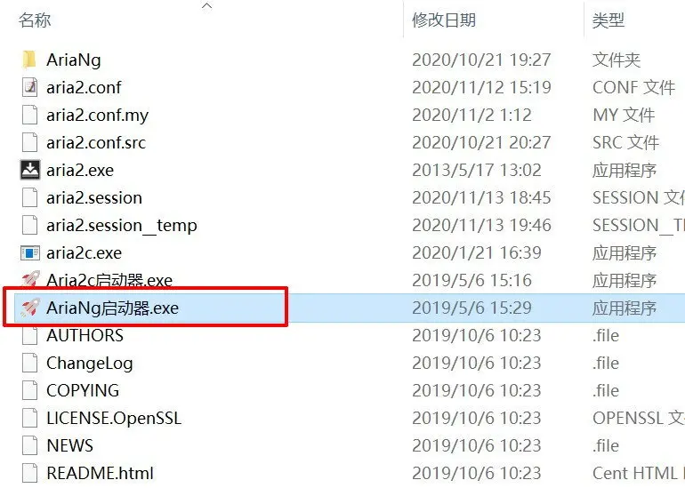
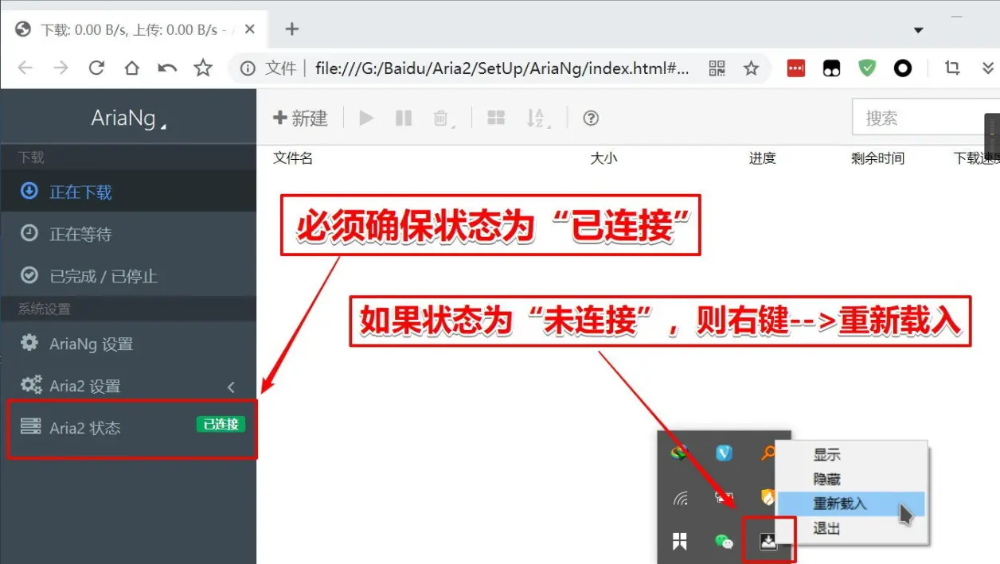
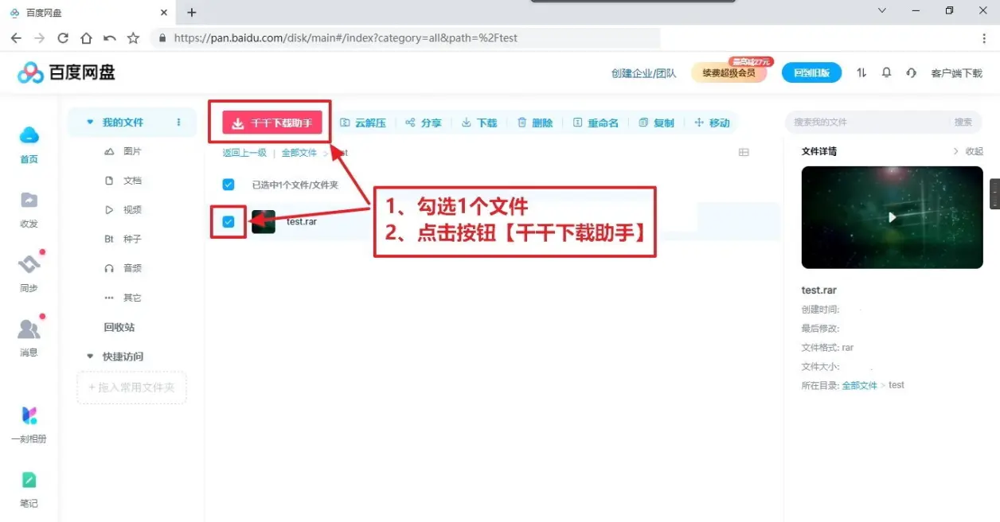
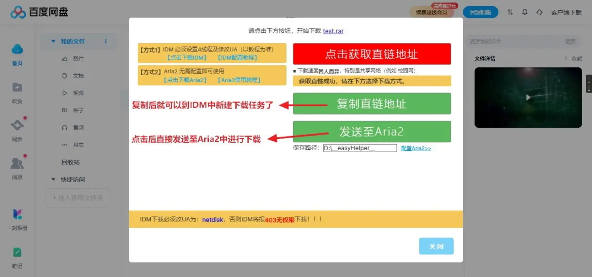
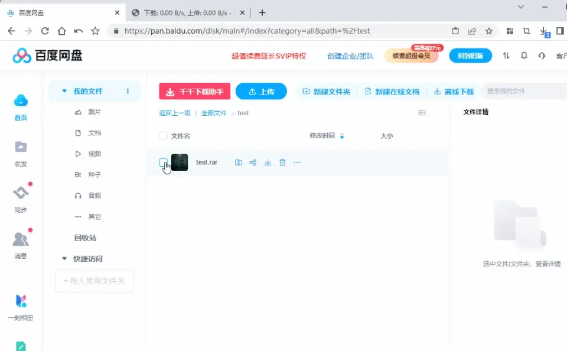
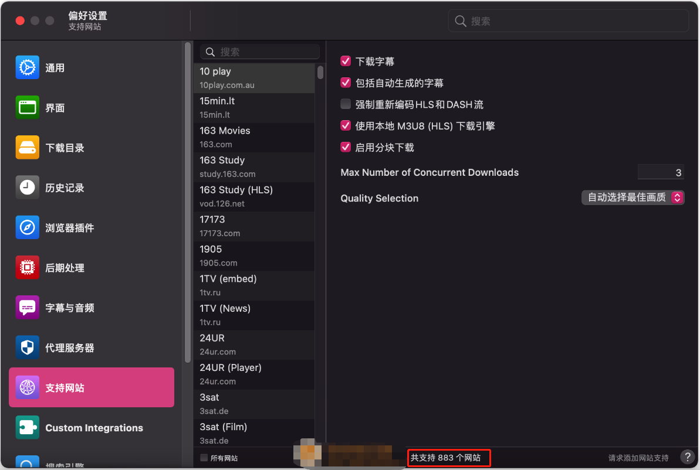

# FFmpeg 相关工具

[FFmpeg.guide](https://ffmpeg.guide/)


一个图形界面，用户拖曳生成线框，表示视频处理的各种命令节点。这个软件会根据节点线框，生成对应的 FFmpeg 命令。

猫抓：<https://github.com/xifangczy/cat-catch/releases>

特殊书签：<https://nilaoda.github.io/N_m3u8DL-CLI/GetM3u8.html>

m3u8 下载器：<https://github.com/nilaoda/N_m3u8DL-CLI/releases>

m3u8 下载器使用说明：<https://nilaoda.github.io/N_m3u8DL-CLI/>

m3u8 下载网站：<http://blog.luckly-mjw.cn/tool-show/m3u8-downloader/index.html>

## 基于或者需要结合 FFmpeg 的开源工具

### VLC 开源播放器

### Quick Cut 开源视频处理工具

开源地址：<https://gitee.com/haujet/QuickCut>

### ijkplayer - 手机端

IOS/Android

开源地址：<https://github.com/Bilibili/ijkplayer>

### QMPlay2 - PC 端

Windows/Linux

开源地址：<https://github.com/zaps166/QMPIay2>

### ZLMediaKit - 跨平台的

Windows/Linux

开源地址：<https://github.com/xiongziliang/ZLMediaKit>

### EasyDarwin

Windows/Linux

开源地址：<https://github.com/LinChengChun/EasyDarwin>

### SRS

Linux

开源地址：<https://github.com/ossrs/srs>

### nginx-rtmp-module

Linux

开源地址：<https://github.com/arut/nginx-Linuxrtmp-module>

### ❤ 免费开源的多线程下载器 （支持多视频网站）

Open-Video-Downloader 开源地址(最近两年更新)：https://github.com/jely2002/youtube-dl-gui

YoutubeDownloader 开源地址(最近有更新，推荐使用)：https://github.com/Tyrrrz/YoutubeDownloader

youtube-dlG 开源地址(六年没更新)：https://github.com/MrS0m30n3/youtube-dl-gui

用于下载 YouTube 视频的轻量级、无依赖项的 Python 库（和命令行实用程序）pytube：https://github.com/pytube/pytube

JavaScript 中的 YouTube 视频下载器(Node.js 调用)：https://github.com/fent/node-ytdl-core

youtube-dl：https://github.com/ytdl-org/youtube-dl

Windows | 用 youtube-dl 批量下载 mp3 格式音频：https://www.xjx100.cn/news/505877.html?action=onClick

### 视频素材快速一键去水印

**Free Video Downloader**：[在线视频下载 - VideoFk](https://www.videofk.com/zh-CN0494)

这个网站是国外的平台，但是支持简体中文，还是很容易上手的。基本上涵盖全网的短视频平台下载。

## 全网视频下载

[【全网最全】m3u8 到底是什么格式？一篇文章搞定 m3u8 下载 - 知乎 (zhihu.com)](https://zhuanlan.zhihu.com/p/346683119)

- 西瓜视频下载

- 好看视频的下载

- 腾讯视频下载

- 爱奇艺视频下载

- 优酷视频下载

- B 站视频下载

- 芒果 TV 视频下载

- 超清批量 MP4

- CCTV 视频下载

- 油管视频下载

- 抖音等小视频下载

- 微信公众号下载

- 微博等网页端视频下载

- A 站视频下载

- 凤凰网视频下载

- PP 视频下载：支持批量下载超清

- 风行网视频下载：支持批量下载

- 搜狐视频下载

### :a:you-get

开源地址：<https://github.com/soimort/you-get>

鉴于 youtube-dl 访问不稳定，被绞杀后不再怎么更新，其继承者 youtube-dlc 对国内的视频网站解析也不太及时，这里就不推荐使用 youtube-dl，youtube-dlc 这两款之前流行的视频解析引擎了，推荐大家使用 you-get 来替换

you-get（2022 年更新）：https://github.com/soimort/you-get

You-get 在 Windows 系统下的安装+会员视频下载的 cookie 配置：https://blog.csdn.net/cwj1412/article/details/107775004

介绍：免费下载视频音乐

1.You-Get 是什么？

- 具备下载国内外网络视频照片等的核心功能。

  2.You-Get 用途优点

- 全网站视频支持简单命令行下载，弹幕播放等。

- | 网站     | 网址                                                                                |
  | -------- | ----------------------------------------------------------------------------------- |
  | Bilibili | [http://www.bilibili.com](https://link.zhihu.com/?target=http%3A//www.bilibili.com) |
  | YouTube  | [http://www.youtube.com](https://link.zhihu.com/?target=http%3A//www.youtube.com)   |
  | 优酷     | [http://www.youku.com](https://link.zhihu.com/?target=http%3A//www.youku.com)       |
  | 爱奇艺   | [http://www.iqiyi.com](https://link.zhihu.com/?target=http%3A//www.iqiyi.com)       |
  | 腾讯视频 | [http://v.qq.com](https://link.zhihu.com/?target=http%3A//v.qq.com)                 |
  | 酷我音乐 | [http://www.kuwo.cn](https://link.zhihu.com/?target=http%3A//www.kuwo.cn)           |
  | 网易音乐 | [http://music.163.com](https://link.zhihu.com/?target=http%3A//music.163.com)       |

- 支持下载

  3.You-Get 安装

MacOS 系统安装 Homebrew （macOS 平台下不可或缺的软件包管理器。）

Homebrew 操作详见：[Homebrew 从入门到实践：视频教程 - 知乎 (zhihu.com)](https://zhuanlan.zhihu.com/p/319809242)

MacOS 通过 Homebrew 安装 You-Get 和 FFmpeg

- 1.查看 You-Get 详细信息：
  - brew info you-get
- 2.安装 You-Get：<https://zhuanlan.zhihu.com/p/325927078>
  - brew install you-get
- 3.查看 FFmpeg 详细信息：
  - brew info ffmpeg
- 4.安装 FFmpeg：
  - brew install ffmpeg

Windows 通过 pip 安装

- pip3 install you-get
- pip3 install ffmpeg

酷我音乐使用 you-get 下载步骤：<https://zhuanlan.zhihu.com/p/400207082/>

网易音乐使用 you-get 下载步骤：<https://zhuanlan.zhihu.com/p/400246128>

4.You-Get 常用命令

帮助信息：you-get -h

查看版本：you-get -v

更新 you-get：brew update you-get

必备操作命令：

- 查看视频信息：you-get -i [URL]
  - 参数"i"，代表"infomation"，查看视频的信息包括：格式、画质、大小等。
- you-get --format=
  - "--format="视频制式，选择视频制式大小
- 设定输出路径：you-get -o
  - 参数小写字母"o"，代表"--output-dir DIR"，输出文件路径。
- 设定输出文件名：you-get -O
  - 参数大写字母"O"，代表"--output-filename FILE"，输出文件夹名称。
- 下载视频列表：you-get -l [URL]
  - 参数"-l"，代表"playlist"，视频列表
- 具体请看

  - <https://zhuanlan.zhihu.com/p/325927078>

    5.亲手实践 You-Get 下载操作

实际举例 URL

```bash
you-get -i https://www.bilibili.com/video/BV1f54y1r7HV
```

下载：

```bash
you-get --format=flv360 -o /Users/用户名/Desktop -O AAA https://www.bilibili.com/video/BV1f54y1r7HV
```

如果下载 list 的单个视频，在后面加上?p=x（x 是第几个视频）

```bash
you-get --format=flv360 https://www.XXXXXX.com/video/bvXXXXXX?p=3
```

※ 补充： 若 mp4 格式需要转 mp3

用 Quicktime Player 打开-文件-导出为-选择：仅音频 就导出了一个 m4a 格式的音频
用 iTunes 打开-文件-转换-创建 MP3 版本 立刻就完成了 mp3 格式的文件

```bash
文件夹位置：/Users/用户名/Music/iTunes/iTunes Media
```

※ 补充：弹幕：<https://zhuanlan.zhihu.com/p/325927078>

使用[Danmu2Ass](https://danmu2ass.codeplex.com/)将`.xml`格式转换为`.ass`格式，打开播放器将`.ass`文件加载即可。

6.常见问题

7.多格式转换

8.You-Get 基本用法逐条解析

```bash
usage: you-get [OPTION]... URL... # 方括号表示可选项

A tiny downloader that scrapes the web


optional arguments: # 可选参数
-V, --version  Print version and exit # 显示版本号，并退出
-h, --help  Print this help message and exit # 显示帮助信息，并退出
https://zhuanlan.zhihu.com/p/325927078

Dry-run options:  # 空运行选项/预检操作
(no actual downloading) #（没有实际下载内容）

-i, --info
Print extracted information  # 显示提取下载信息

-u, --url
Print extracted information with URLs # 获得页面所有可下载URL列表

--json
Print extracted URLs in JSON format # 获取URL的json格式信息
https://zhuanlan.zhihu.com/p/325927078

Download options: # 下载选项

-n, --no-merge
    Do not merge video part  # 不合并视频

--no-caption
    Do not download captions # 不下载字幕
 (subtitles, lyrics, danmaku,...) #（标题，歌词，弹幕等）
https://zhuanlan.zhihu.com/p/325927078

-f, --force
    Force overwriting existing files # 强制覆盖现有文件

--skip-existing-file-size-check
    Skip existing file without checking file size # 跳过现有文件不检查文件大小
https://zhuanlan.zhihu.com/p/325927078

-F STREAM_ID, --format STREAM_ID
   Set video format to STREAM_ID  # 指定视频格式为STREAM_ID

-O FILE, --output-filename FILE
   Set output filename  # 设定输出文件名
https://zhuanlan.zhihu.com/p/325927078

-o DIR, --output-dir DIR
   Set output directory   # 设定输出路径（存放在哪一个文件夹下）

-p PLAYER, --player PLAYER
   Stream extracted URL to a PLAYER  # 将提取的URL传送给播放器

-c COOKIES_FILE, --cookies COOKIES_FILE
   Load cookies.txt or cookies.sqlite
   #导入cookies.txt或cookies.sqlite（隐私视频须将浏览器cookie加载入you-get）
https://zhuanlan.zhihu.com/p/325927078

-t SECONDS, --timeout SECONDS
    Set socket timeout   # 设定网络通信协议超时

-d, --debug
    Show traceback and other debug info  # 显示回溯和其他debug信息
https://zhuanlan.zhihu.com/p/325927078

-I FILE, --input-file FILE
    Read non-playlist URLs from FILE  #从文件里读取非播放列表的URl

-P PASSWORD, --password PASSWORD
    Set video visit password to PASSWORD  # 设置视频访问密码
https://zhuanlan.zhihu.com/p/325927078

-l, --playlist
    Prefer to download a playlist  #下载视频列表

-a, --auto-rename
    Auto rename same name different files  #自动重命名（相同的名称不同的文件）

-k, --insecure
    ignore ssl errors  # 忽略ssl错误
https://zhuanlan.zhihu.com/p/325927078


Proxy options:  #代理选项

-x HOST:PORT, --http-proxy HOST:PORT
Use an HTTP proxy for downloading   # 使用HTTP代理下载

-y HOST:PORT, --extractor-proxy HOST:PORT
Use an HTTP proxy for extracting only   # 仅抓取数据时使用HTTP代理

--no-proxy   Never use a proxy   # 关闭代理

-s HOST:PORT, --socks-proxy HOST:PORT
Use an SOCKS5 proxy for downloading   # 使用SOCKS5代理下载
https://zhuanlan.zhihu.com/p/325927078
```

### :b:youtube-dl

由于版权问题，youtube-dl 的下载速度非常慢，大概只有几十 KB/s，推荐使用 youtube-dl 的分叉产品**yt-dlp**(YouTube DownLoad Plus).

- 开源地址：<https://github.com/ytdl-org/youtube-dl>

### lux(原名：annie)

几乎支持全中国的短视频平台的视频下载

- 开源地址：<https://github.com/iawia002/lux>
- 介绍：go 语言编写的开源视频下载神器
- 使用教程
  - <https://zhuanlan.zhihu.com/p/165512014>
  - <https://www.sogou.com/link?url=58p16RfDRLtXMfJm5FFHq8A5LgoDdCC_gGVJ-cavaqvh4CHUR8LU2Z03w_1AaJMw>
  - <https://www.sogou.com/link?url=hedJjaC291PEb-23-sjFDanUmq_tH72dIIih_AM1IhXh0RcR5JD6ow>

## 下载工具

### Aria2

开源地址：
教程：

- [Aria2 基础上手指南 - 知乎 (zhihu.com)](https://zhuanlan.zhihu.com/p/30666881)
- [Aria2 安装和使用全教程-CSDN 博客](https://blog.csdn.net/qq_55058006/article/details/115570993)
- [Windows 中 Aria2 动态编译和使用 | FLYING TREE (jashking.github.io)](https://jashking.github.io/2017/02/12/build-aria2/)
- [无限制神器 aria2 懒人包及 Aria2 配置/Web 管理面板教程-CSDN 博客](https://blog.csdn.net/yhcad/article/details/86561233)

### Aria2 百度网盘不限速

Aria2 为绿色软件，解压后，打开“AriaNg 启动器”，即可启动 Aria2：





该版本的 Aria2 无需进行任何配置即可使用。

2.安装“百度网盘千千下载助手”油猴脚本

安装“百度网盘千千下载助手”油猴脚本



勾选文件，点击【简易下载助手】，弹出文件下载窗口。
下载窗口支持 2 种下载方式： 2.发送至 Aria2：点击后直接发送至 Aria2 中进行下载（可以在 Aria2 中看到下载状态）



Aria2 下载演示图：



#### 百度网盘真实下载地址

代码：

```js
(function () {
	var _id = 309847;
	var _findPath = location.href.slice(57);
	var _isHome = _findPath == "%2f" ? true : false;
	var _temp = _isHome ? "" : _findPath;
	var _name = "xxx.mp4"; // 这里 '' 里面的内容改成需要下载的文件的名称
	var _path = _temp + "/" + encodeURIComponent(_name);
	var _link =
		"https://pcs.baidu.com/rest/2.0/pcs/file?method=download&app_id=" +
		_id +
		"&path=" +
		_path;
	console.log("下载地址为：" + _link);
})();
```

**使用方法：**

在下载页面 按 F12 找到 Console，Ctrl+L 清除所有内容，粘贴上面代码，修改`var _name` 后面的值（下载的文件名称和后缀）， 回车即可看到下载地址

**注：如果是别人分享的 可以先存到自己的网盘 然后再用上面的方法下载即可**

## 全网下载的视频格式转换

优酷 kux 转 MP4 丁具

爱奇异 qsv 转 MP4 工具

腾迅 qv 转 mp4 工具

b 站 flv 格式转 mp4

芒果 TV 的 mtv 格式转 mp4

安卓端 ts 合并

其他软件

## 网页视频下载

### 硕鼠下载

官网：[www.flvcd.com](https://www.flvcd.com/)

### 其他短视频下载工具

iiilab：<https://weibo.iiilab.com/>

imyshare：<https://imyshare.com/parsevideo>

weibovideo：<https://www.weibovideo.com>

Instagram 下载：<https://www.w3toys.com>

Twitter 下载：<https://twdown.net/>

Facebook 下载：<https://fbdown.net>

国外视频网站下载，可以谷歌搜索：xx download

B 站下载工具：

- [贝贝 BiliBili - B 站视频下载 (xbeibeix.com)](https://xbeibeix.com/api/bilibili/)
- [B 站视频在线解析提取下载工具 - 哔哩哔哩(bilibili)视频下载到手机相册、电脑本地 (fodownloader.com)](https://www.fodownloader.com/)

浏览器搜索：xx 解析

### M3U8 类的视频下载

#### 获取 M3U8 链接

##### 1.浏览器插件：猫抓

开源地址：<https://github.com/xifangczy/cat-catch>

**注：**猫爪插件是一款专用于 chrome 及其他使用 Chromium 内核的浏览器插件，可以嗅探当前网页上的一切媒体文件。

使用猫爪插件嗅探出来的资源复制粘贴到 m3u8 下载工具下载

##### 2.猫抓插件和浏览器开发工具那里搜索：m3u8 文件，同理

浏览器打开开发者工具。找到网络(netWork)的 tab，在搜索栏里搜索：m3u8，找到该页面的 m3u8 文件，右键，【复制链接地址】；或者双击下载该文件

##### 3.特殊书签 JS 拿 m3u8 的方法

文章：[使用 javascript 在各大视频网站一键抓取无水印 m3u8 格式视频并将视频下载成 mp4 格式（以 Google 抓取腾讯视频为例）\_使用 javascript 获取 m3u8_Hakutaku 白泽的博客-CSDN 博客](https://blog.csdn.net/qq_42506411/article/details/106996027)

m3u8 是一种视频流媒体格式，可以通过 JavaScript 来获取。

- 1.打开任意浏览器，同时按下 CTRL+D 打开书签保存弹窗。点击更多，进入到添加书签页面。
- 2.在网址栏粘贴如下所示代码（javascript 抓取腾讯视频），名称则随意命名（这里我命名为腾讯视频），填写完毕后点击保存即可。
- 3.打开需要下载的视频（因为该段代码仅针对腾讯视频，因此这里我打开腾讯视频），点击书签栏刚保存过的书签。
  - 注意：目前经过测试，普通用户只能下载普通用户的视频；会员视频需要使用会员账号下载。如果想要以普通用户身份下载会员视频，可使用谷歌插件完成。
- 3.打开需要下载的视频（因为该段代码仅针对腾讯视频，因此这里我打开腾讯视频），点击书签栏刚保存过的书签。注意：目前经过测试，普通用户只能下载普通用户的视频；会员视频需要使用会员账号下载。如果想要以普通用户身份下载会员视频，可使用谷歌插件完成。
- 4.复制弹出的视频代码串（即抓取到的原生 m3u8 视频），这里我抓取到的小猪佩奇的视频代码串即为：`https://defaultts.tc.qq/defaultts.tc.qq/uwMROfz2r5zCIaQXGdGnC2df644Q3LWUuLvyGY4RMhgE_3T2/X5TpHg6-J3RDYqEcgXyqJTJaieD5C7-2TIkGNMgpj7h_7dqAi5_oQab-cBpucK4rvndsV03J41HP2esH3fh9p0Di4hkcOsyumQqtF6Fy_P4q148sI97yvROFto-d0lFF4u7fDrw1FXDJ106rmYY6MeJkhzKHvxcw04qtGZMCJbE/i0020zgntzc.321002.ts.m3u8?ver=4`
- 5.将视频代码串复制粘贴到 m3u8 下载工具中（任意一款 m3u8 视频下载工具均可），这里我使用本文中为大家所提供的下载工具。下载完毕后打开，点击“+”新增下载，将上述抓取到的（小猪佩奇）视频代码串粘贴进去，注意修改视频存储路径。
- 6.点击 start Donwnload，即可立刻开始下载视频。等待进度条走完，可发现视频存储路径位置已经出现了以字母数字串命名的视频文件，打开即可看到无水印视频。

###### 腾讯视频

可直接将这个超链接拖入你的书签栏：[腾讯视频](这句话替换为以下脚本)

```js
javascript: var a = prompt(
	PLAYER._DownloadMonitor.context.dataset.title,
	PLAYER._DownloadMonitor.context.dataset.ckc
		? PLAYER._DownloadMonitor.context.dataset.currentVideoUrl
		: PLAYER._DownloadMonitor.context.dataset.currentVideoUrl.replace(
				/:.*qq.com/g,
				"://defaultts.tc.qq.com/defaultts.tc.qq.com"
		  )
);
```

###### **腾讯视频 (DRM 内容)**

可直接将这个超链接拖入你的书签栏：[腾讯视频 (DRM 内容)](这句话替换为以下脚本)

```js
javascript: var m3u8Content =
	PLAYER._DownloadMonitor.context.dataset.playList[0].m3u8;
var blob = new Blob([m3u8Content], { type: "text/plain" });
var url = URL.createObjectURL(blob);
var title = PLAYER._DownloadMonitor.context.dataset.title + "[v+a].m3u8";
var aLink = document.createElement("a");
aLink.href = url;
aLink.download = title;
aLink.style.display = "none";
var event;
if (window.MouseEvent) {
	event = new MouseEvent("click");
} else {
	event = document.createEvent("MouseEvents");
	event.initMouseEvent(
		"click",
		true,
		false,
		window,
		0,
		0,
		0,
		0,
		0,
		false,
		false,
		false,
		false,
		0,
		null
	);
}
aLink.dispatchEvent(event);
```

###### **爱奇艺 / 愛奇藝视频**

可直接将这个超链接拖入你的书签栏：[爱奇艺视频](这句话替换为以下脚本)

```js
javascript: eval(
	(function (p, a, c, k, e, r) {
		e = function (c) {
			return (
				(c < a ? "" : e(parseInt(c / a))) +
				((c = c % a) > 35 ? String.fromCharCode(c + 29) : c.toString(36))
			);
		};
		if (!"".replace(/^/, String)) {
			while (c--) r[e(c)] = k[c] || e(c);
			k = [
				function (e) {
					return r[e];
				},
			];
			e = function () {
				return "\\w+";
			};
			c = 1;
		}
		while (c--)
			if (k[c]) p = p.replace(new RegExp("\\b" + e(c) + "\\b", "g"), k[c]);
		return p;
	})(
		'3 C=D.E.F.8.G.8.H.I.1b.z.1c.J;C.K(7(j,k){9(j.1d){3 l="";9(j.A==1e){L{9(1f(1g(M))=="7"){}}N(e){3 m=v O();m.P("Q","R://1h.S.T/U/1i/1j.U",6);m.V=7(){3 a=5.W("1k");a.Y=m.Z;5.1l("1m")[0].1n(a)};m.11(B)}3 n=j.1o;3 o="#1p\\n";n.K(7(b,c){3 e=b.l;3 f="R://z.J.S.T/1q";3 h=f+e;L{3 t=D.E.F.8.G.8.H.I.1r.z.t;h=f+e+"%1s%1t%1u=1&t="+t+"&1v="+/1w=(\\d+)/g.12(e)[1]+"&1x=4&1y=0&1z="+M(t+/\\/(\\w{10,})/g.12(e)[1])}N(13){1A.1B(13)}3 i=v O();i.1C("1D/1E");i.P("Q",h,6);i.V=7(){3 a=1F.1G(i.Z);o+="#1H:0\\n"+a["l"]+"\\n"};i.11(B)});o+="#1I-X-1J";l=o}14{l=j.A}3 p=v 1K([l],{1L:"Y/1M"});3 q=1N.1O(p);3 r=(5.x.15("-")!=-1?5.x.1P(0,5.x.15("-")):5.x.16(/\\s/,""))+"y"+j.1Q+"y"+(j.1R==2?"1S":"1T")+"y"+5.1U("1V-1W-1X")[0].1Y.16(/:/,".")+"y"+(j.1Z/17/17).20(2)+"21.A";3 s=5.W("a");s.22=q;s.23=r;s.24.25="26";3 u;9(18.19){u=v 19("1a")}14{u=5.27("28");u.29("1a",2a,6,18,0,0,0,0,0,6,6,6,6,0,B)}s.2b(u)}})',
		62,
		136,
		"|||var||document|false|function|engine|if||||||||||||||||||||||new||title|_|data|m3u8|null|info|playerObject|_player|package|adproxy|movieinfo|current|video|forEach|try|cmd5x|catch|XMLHttpRequest|open|GET|https|iqiyi|com|js|onload|createElement||text|responseText||send|exec|err|else|indexOf|replace|1024|window|MouseEvent|click|originalData|program|_selected|undefined|typeof|eval|static|common|f6a3054843de4645b34d205a9f377d25|script|getElementsByTagName|head|appendChild|fs|EXTM3U|videos|boss|E2|9C|97domain|QY00001|qd_uid|ib|ptime|ibt|console|error|overrideMimeType|application|json|JSON|parse|EXTINF|EXT|ENDLIST|Blob|type|plain|URL|createObjectURL|substring|scrsz|code|H264|H265|getElementsByClassName|iqp|time|dur|innerText|vsize|toFixed|MB|href|download|style|display|none|createEvent|MouseEvents|initMouseEvent|true|dispatchEvent".split(
			"|"
		),
		0,
		{}
	)
);
```

###### **爱奇艺 / 愛奇藝 杜比音轨**

可直接将这个超链接拖入你的书签栏：[爱奇艺杜比音轨](这句话替换为以下脚本)

```js
javascript: eval(
	(function (p, a, c, k, e, r) {
		e = function (c) {
			return (
				(c < a ? "" : e(parseInt(c / a))) +
				((c = c % a) > 35 ? String.fromCharCode(c + 29) : c.toString(36))
			);
		};
		if (!"".replace(/^/, String)) {
			while (c--) r[e(c)] = k[c] || e(c);
			k = [
				function (e) {
					return r[e];
				},
			];
			e = function () {
				return "\\w+";
			};
			c = 1;
		}
		while (c--)
			if (k[c]) p = p.replace(new RegExp("\\b" + e(c) + "\\b", "g"), k[c]);
		return p;
	})(
		'3 B=A 1k();B.1j("1h","R://2I.M.C/1c/1Q/2b.1c",9);B.1b=7(){3 a=6.Q("19");a.1m=B.Z;6.V("U")[0].S(a)};B.18(z);7 G(a){3 b=6.2S.14("; ");1K(3 i=0;i<b.1Y;i++){3 c=b[i].14("=");J(a==c[0])K 1d(c[1])}K z}7 N(a,b){3 c=A 1U(\'(^|&)\'+a+\'=([^&]*)(&|$)\',\'i\');3 r=b.22(c);J(r!=z){K 1d(r[2])}K z}3 L=8.2T.15.O("1L.M.C")!=-1?"1M":"1O";3 F=1R.1S.1T.1a.1X.1a.F;3 P="/1Z/20?1e="+F.1e+"&24=26&27=28&D="+F.D+"&L="+L+"&2d=0&2e=1&2h="+G("2i")+"&2x=2y&2E=0&T="+G("2M")+"&2R=0&d=0&s=&1n=&1o=&1p=&1q=1&1r=0&1s=0&1t="+G("1u")+"&1v=1w&1x=0&1y=2&1z="+(A 2Z()).1B()+"&1C=a&1D=0&1E=1F&1G=1H&1I=1&1J=W&Y=1&Y=5";8.I="R://1N.11.M.C"+P+"&1P="+12(P);13(8.I);7 13(a){3 b=6.V("U")[0];3 c=6.Q("19");c.L=a;b.S(c)}7 W(e){3 x=e.H.1V.1W;3 y=0;x.17(7(m,n){J(m.21){3 o=m.23;3 p="#25\\n";o.17(7(b,c){3 f=b.l;y+=b.b;3 h="R://H.11.M.C/29";3 i=h+f;2a{3 t=e.H.2c.H.t;3 j=N("D",8.I);3 k=N("T",8.I);i=h+f+"&t="+t+"&D="+j+"&2f="+/2g=(\\d+)/g.1f(f)[1]+"&2j="+k+"&2k=4&2l="+12(t+/\\/(\\w{10,})/g.1f(f)[1])+"&2m=0"}2n(2o){}3 l=A 1k();l.2p("2q/2r");l.1j("1h",i,9);l.1b=7(){3 a=2s.2t(l.Z);p+="#2u:0\\n"+a["l"]+"\\n"};l.18(z)});p+="#2v-X-2w";1g=p;3 q=A 2z([1g],{2A:"1m/2B"});3 r=2C.2D(q);3 s=(6.E.O("-")!=-1?6.E.2F(0,6.E.O("-")):6.E.2G(/\\s/,""))+"2H"+(y/1i/1i).2J(2)+"2K.2L";3 u=6.Q("a");u.15=r;u.2N=s;u.2O.2P="2Q";3 v;J(8.1l){v=A 1l("16")}2U{v=6.2V("2W");v.2X("16",2Y,9,8,0,0,0,0,0,9,9,9,9,0,z)}u.1A(v)}})}',
		62,
		186,
		"|||var|||document|function|window|false||||||||||||||||||||||||||null|new|req1|com|vid|title|movieinfo|getCookie|data|dashUrl|if|return|src|iqiyi|getQueryString|indexOf|params|createElement|https|appendChild|k_uid|head|getElementsByTagName|NILAODA||ut|responseText||video|cmd5x|loadScript|split|href|click|forEach|send|script|engine|onload|js|unescape|tvid|exec|m3u8Content|GET|1024|open|XMLHttpRequest|MouseEvent|text|lid|cf|ct|k_tag|ost|ppt|dfp|__dfp|locale|zh_cn|k_err_retries|qd_v|tm|dispatchEvent|getTime|qdy|qds|k_ft1|1354994433|k_ft4|8196|k_ft5|callback|for|tw|01010031010010000000|cache|01010031010000000000|vf|common|playerObject|_player|package|RegExp|program|audio|adproxy|length|jp|dash|_selected|match|fs|bid|EXTM3U|300|abid|500|videos|try|f6a3054843de4645b34d205a9f377d25|boss_ts|vt|rs|QY00001|qd_uid|uid|P00003|su|ib|ibt|ptime|catch|err|overrideMimeType|application|json|JSON|parse|EXTINF|EXT|ENDLIST|ori|pcw|Blob|type|plain|URL|createObjectURL|ps|substring|replace|_dolby_|static|toFixed|MB|m3u8|QC005|download|style|display|none|pt|cookie|location|else|createEvent|MouseEvents|initMouseEvent|true|Date".split(
			"|"
		),
		0,
		{}
	)
);
```

###### **爱奇艺 / 愛奇藝 交互式选择音轨**

可直接将这个超链接拖入你的书签栏：[爱奇艺音轨下载](这句话替换为以下脚本)

```js
javascript: eval(
	(function (p, a, c, k, e, r) {
		e = function (c) {
			return (
				(c < a ? "" : e(parseInt(c / a))) +
				((c = c % a) > 35 ? String.fromCharCode(c + 29) : c.toString(36))
			);
		};
		if (!"".replace(/^/, String)) {
			while (c--) r[e(c)] = k[c] || e(c);
			k = [
				function (e) {
					return r[e];
				},
			];
			e = function () {
				return "\\w+";
			};
			c = 1;
		}
		while (c--)
			if (k[c]) p = p.replace(new RegExp("\\b" + e(c) + "\\b", "g"), k[c]);
		return p;
	})(
		'3 O=C 1e();O.1f("1g","R://2e.S.H/1h/2f/2g.1h",D);O.1i=6(){3 a=7.15("1j");a.1k=O.1l;7.1m("1n")[0].1o(a)};O.1p(I);6 J(a){3 b=7.2h.1q("; ");2i(3 i=0;i<b.2j;i++){3 c=b[i].1q("=");8(a==c[0])K 1r(c[1])}K I}6 16(a,b){3 c=C 2k(\'(^|&)\'+a+\'=([^&]*)(&|$)\',\'i\');3 r=b.2l(c);8(r!=I){K 1r(r[2])}K I}3 9="2m";3 17="R://1s.18.S.H";8(A.1t.19.T("2n.S.H")!=-1){9="2o"}1u 8(A.1t.19.T("1v.H")!=-1){17="R://1s-18.1v.H";9="1w"}3 L=2p.2q.2r.1x.2s.1x.L;6 1a(b,c,e,f){3 g="/1y/1z?U="+L.U+"&E=1A&M="+L.M+"&9="+9+"&1B=0&1C=1&1D="+J("2t")+"&1E=1F&1G=0&1b="+J("1H")+"&1I=0&d=0&s=&V="+b+"&W="+c+"&N="+(e=="1J"?"2":"1")+"&1K=1&1L=0&1M=0&1N="+J("1O")+"&2u=2v&1P=0&1Q=2&1R="+(C 1S()).1T()+"&1U=a&1V=0&1W=2w&1X=2x&1Y=1&2y="+f+"&1c=1&1c=5";8(9=="1w"){g=`/1y/1z?U=${L.U}&E=1A&M=${L.M}`+`&9=${9}&1B=0&1C=1&1D=0&1E=1F&1G=0&1b=${J("1H")}`+`&1I=0&d=0&s=&b=${b}&2z=2&e=${(e=="1J"?"2":"1")}&c=${c}`+`&1K=1&1L=0&1M=0&1N=${J("1O")}&1P=0&2A=&1Z=1`+`&2B=2C&2D=2&1Q=2&1R=${(C 1S()).1T()}&1U=a&1V=0&1W=2E&1X=2F&1Y=1&1c=0`}A.Y=17+g+"&2G="+20(g);21(A.Y)}6 21(a){3 b=7.1m("1n")[0];3 c=7.15("1j");c.9=a;b.1o(c)}8(z)z=2H;3 z=[];1a("","","","22");6 22(e){3 c=e.P.23.24;c.Z(6(a,b){F G={};G.E=a.E;G.B=a.B;G.N=a.N;G.W=a.W;G.V=a.V;z.2I(G)});z.2J((11,12)=>{K(12.B<11.B?1:(12.B==11.B?0:-1))+(12.E-11.E)});F p="";z.Z(6(a,b){p+=`\\r\\n[${b}]:{${a.B||""}Q${a.E}Q${a.N}}`});F 1d=2K("请选择音轨"+p);8(!1d)K;F 13=2L(1d);F 25=z[13].V;F 26=z[13].W;F 27=z[13].N;1a(25,26,27,"28")}6 28(e){3 x=e.P.23.24;3 y=0;x.Z(6(m,n){8(m.2M){3 o=m.2N;3 p="#2O\\n";o.Z(6(b,c){3 f=b.l;y+=b.b;3 h="R://P.18.S.H/2P";3 i=h+f;2Q{3 t=e.P.2R.P.t;3 j=16("M",A.Y);3 k=16("1b",A.Y);i=h+f+"&t="+t+"&M="+j+"&2S="+/2T=(\\d+)/g.29(f)[1]+"&1Z="+k+"&2U=4&2V="+20(t+/\\/(\\w{10,})/g.29(f)[1])+"&2W=0"}2X(2Y){}3 l=C 1e();l.2Z("30/31");l.1f("1g",i,D);l.1i=6(){3 a=32.33(l.1l);p+="#34:0\\n"+a["l"]+"\\n"};l.1p(I)});p+="#35-X-36";2a=p;3 q=C 37([2a],{38:"1k/39"});3 r=3a.3b(q);3 s=(7.14.T("-")!=-1?7.14.3c(0,7.14.T("-")):7.14.3d(/\\s/,""))+`Q${(m.B||"")}Q${m.N}Q`+(y/2b/2b).3e(2)+"3f.3g";3 u=7.15("a");u.19=r;u.3h=s;u.3i.3j="3k";3 v;8(A.2c){v=C 2c("2d")}1u{v=7.3l("3m");v.3n("2d",3o,D,A,0,0,0,0,0,D,D,D,D,0,I)}u.3p(v)}})}',
		62,
		212,
		"|||var|||function|document|if|src||||||||||||||||||||||||||audioTracks|window|name|new|false|bid|let|_track|com|null|getCookie|return|movieinfo|vid|cf|req1|data|_|https|iqiyi|indexOf|tvid|lid|ct||dashUrl|forEach||a1|a2|_select|title|createElement|getQueryString|host|video|href|doRequest|k_uid|ut|_input|XMLHttpRequest|open|GET|js|onload|script|text|responseText|getElementsByTagName|head|appendChild|send|split|unescape|cache|location|else|iq|01010031010014000000|engine|jp|dash|300|vt|rs|uid|ori|pcw|ps|QC005|pt|aac|k_tag|ost|ppt|dfp|__dfp|k_err_retries|qd_v|tm|Date|getTime|qdy|qds|k_ft1|k_ft4|k_ft5|su|cmd5x|loadScript|getAllTracks|program|audio|_lid|_ct|_cf|NILAODA|exec|m3u8Content|1024|MouseEvent|click|static|common|f6a3054843de4645b34d205a9f377d25|cookie|for|length|RegExp|match|01010031010000000000|tw|01010031010010000000|playerObject|_player|package|adproxy|P00003|locale|zh_cn|740531601218477|1162183859249156|callback|slid|up|applang|en_us|sver|141287244169348|34359746564|vf|undefined|push|sort|prompt|Number|_selected|fs|EXTM3U|videos|try|boss_ts|QY00001|qd_uid|ib|ibt|ptime|catch|err|overrideMimeType|application|json|JSON|parse|EXTINF|EXT|ENDLIST|Blob|type|plain|URL|createObjectURL|substring|replace|toFixed|MB|m3u8|download|style|display|none|createEvent|MouseEvents|initMouseEvent|true|dispatchEvent".split(
			"|"
		),
		0,
		{}
	)
);
```

###### **爱奇艺 / 愛奇藝 4K H264**

可直接将这个超链接拖入你的书签栏：[爱奇艺 4K_H264](这句话替换为以下脚本)

```js
javascript: eval(
	(function (p, a, c, k, e, r) {
		e = function (c) {
			return (
				(c < a ? "" : e(parseInt(c / a))) +
				((c = c % a) > 35 ? String.fromCharCode(c + 29) : c.toString(36))
			);
		};
		if (!"".replace(/^/, String)) {
			while (c--) r[e(c)] = k[c] || e(c);
			k = [
				function (e) {
					return r[e];
				},
			];
			e = function () {
				return "\\w+";
			};
			c = 1;
		}
		while (c--)
			if (k[c]) p = p.replace(new RegExp("\\b" + e(c) + "\\b", "g"), k[c]);
		return p;
	})(
		'3 j=k 1e();j.1E("1J","S://14.y.x/N/1K/1W.N",7);j.11=6(){3 a=5.w("E");a.z=j.2i;5.L("F")[0].B(a)};j.1f(9);6 m(a){3 b=5.1P.G("; ");1Y(3 i=0;i<b.W;i++){3 c=b[i].G("=");q(a==c[0])t R(c[1])}t 9}6 1g(a,b){3 c=k 1C(\'(^|&)\'+a+\'=([^&]*)(&|$)\',\'i\');3 r=b.1G(c);q(r!=9){t R(r[2])}t 9}3 p=8.1V.P.u("1Z.y.x")!=-1?"2a":"2d";3 n=2j.2k.V.A.X.A.n;3 v="/Z/10?C="+n.C+"&12=13&D="+n.D+"&p="+p+"&15=0&16=1&17="+m("18")+"&19=1a&1b=0&1c="+m("1d")+"&2q=0&d=0&s=&1h=&1i=&1j=&1k=1&1l=0&1m=0&1n="+m("1o")+"&1p=1q&1r=0&1s=2&1t="+(k 1u()).1v()+"&1w=a&1x=0&1y=1z&1A=4&1B=H&1D=1";8.I="S://1F.J.y.x"+v+"&1H="+1I(v);K(8.I);6 K(a){3 b=5.L("F")[0];3 c=5.w("E");c.p=a;b.B(c)}6 H(e){3 i=e.1L.1M.J;i.1N(6(a,b){q(a.1O){3 c=a.M;3 d=k 1Q([c],{1R:"z/1S"});3 e=1T.1U(d);3 f=(5.o.u("-")!=-1?5.o.1X(0,5.o.u("-")):5.o.O(/\\s/,""))+"l"+a.20+"l"+(a.21==2?"22":"23")+"l"+5.24("25-26-27")[0].28.O(/:/,".")+"l"+(a.29/Q/Q).2b(2)+"2c.M";3 g=5.w("a");g.P=e;g.2e=f;g.2f.2g="2h";3 h;q(8.T){h=k T("U")}2l{h=5.2m("2n");h.2o("U",2p,7,8,0,0,0,0,0,7,7,7,7,0,9)}g.Y(h)}})}',
		62,
		151,
		"|||var||document|function|false|window|null||||||||||req1|new|_|getCookie|movieinfo|title|src|if|||return|indexOf|params|createElement|com|iqiyi|text|engine|appendChild|tvid|vid|script|head|split|NILAODA|dashUrl|video|loadScript|getElementsByTagName|m3u8|js|replace|href|1024|unescape|https|MouseEvent|click|package|length|adproxy|dispatchEvent|jp|dash|onload|bid|800|static|vt|rs|uid|P00003|ori|pcw|ps|k_uid|QC005|XMLHttpRequest|send|getQueryString|lid|cf|ct|k_tag|ost|ppt|dfp|__dfp|locale|zh_cn|k_err_retries|qd_v|tm|Date|getTime|qdy|qds|k_ft2|8196|k_ft4|callback|RegExp|ut|open|cache|match|vf|cmd5x|GET|common|data|program|forEach|_selected|cookie|Blob|type|plain|URL|createObjectURL|location|f6a3054843de4645b34d205a9f377d25|substring|for|tw|scrsz|code|H264|H265|getElementsByClassName|iqp|time|dur|innerText|vsize|03020031010010000000|toFixed|MB|03020031010000000000|download|style|display|none|responseText|playerObject|_player|else|createEvent|MouseEvents|initMouseEvent|true|pt".split(
			"|"
		),
		0,
		{}
	)
);
```

###### **爱奇艺 / 愛奇藝 4K H265**

可直接将这个超链接拖入你的书签栏：[爱奇艺 4K_H265](这句话替换为以下脚本)

```js
javascript: eval(
	(function (p, a, c, k, e, r) {
		e = function (c) {
			return (
				(c < a ? "" : e(parseInt(c / a))) +
				((c = c % a) > 35 ? String.fromCharCode(c + 29) : c.toString(36))
			);
		};
		if (!"".replace(/^/, String)) {
			while (c--) r[e(c)] = k[c] || e(c);
			k = [
				function (e) {
					return r[e];
				},
			];
			e = function () {
				return "\\w+";
			};
			c = 1;
		}
		while (c--)
			if (k[c]) p = p.replace(new RegExp("\\b" + e(c) + "\\b", "g"), k[c]);
		return p;
	})(
		'3 9=j 1c();9.1C("1H","R://13.x.w/M/1I/1U.M",6);9.10=5(){3 a=4.v("D");a.y=9.2g;4.K("E")[0].A(a)};9.1e(8);5 l(a){3 b=4.1N.F("; ");1W(3 i=0;i<b.V;i++){3 c=b[i].F("=");p(a==c[0])q Q(c[1])}q 8}5 1f(a,b){3 c=j 1A(\'(^|&)\'+a+\'=([^&]*)(&|$)\',\'i\');3 r=b.1E(c);p(r!=8){q Q(r[2])}q 8}3 o=7.1T.O.t("1X.x.w")!=-1?"28":"2b";3 m=2h.2i.U.z.W.z.m;3 u="/Y/Z?B="+m.B+"&11=12&C="+m.C+"&o="+o+"&14=0&15=1&16="+l("17")+"&18=19&1a=0&1b="+l("2o")+"&1d=0&d=0&s=&1g=&1h=&1i=&1j=1&1k=0&1l=0&1m="+l("1n")+"&1o=1p&1q=0&1r=2&1s="+(j 1t()).1u()+"&1v=a&1w=0&1x=1y&1z=G&1B=1";7.H="R://1D.I.x.w"+u+"&1F="+1G(u);J(7.H);5 J(a){3 b=4.K("E")[0];3 c=4.v("D");c.o=a;b.A(c)}5 G(e){3 i=e.1J.1K.I;i.1L(5(a,b){p(a.1M){3 c=a.L;3 d=j 1O([c],{1P:"y/1Q"});3 e=1R.1S(d);3 f=(4.n.t("-")!=-1?4.n.1V(0,4.n.t("-")):4.n.N(/\\s/,""))+"k"+a.1Y+"k"+(a.1Z==2?"20":"21")+"k"+4.22("23-24-25")[0].26.N(/:/,".")+"k"+(a.27/P/P).29(2)+"2a.L";3 g=4.v("a");g.O=e;g.2c=f;g.2d.2e="2f";3 h;p(7.S){h=j S("T")}2j{h=4.2k("2l");h.2m("T",2n,6,7,0,0,0,0,0,6,6,6,6,0,8)}g.X(h)}})}',
		62,
		149,
		"|||var|document|function|false|window|null|req1||||||||||new|_|getCookie|movieinfo|title|src|if|return|||indexOf|params|createElement|com|iqiyi|text|engine|appendChild|tvid|vid|script|head|split|NILAODA|dashUrl|video|loadScript|getElementsByTagName|m3u8|js|replace|href|1024|unescape|https|MouseEvent|click|package|length|adproxy|dispatchEvent|jp|dash|onload|bid|800|static|vt|rs|uid|P00003|ori|pcw|ps|k_uid|XMLHttpRequest|pt|send|getQueryString|lid|cf|ct|k_tag|ost|ppt|dfp|__dfp|locale|zh_cn|k_err_retries|qd_v|tm|Date|getTime|qdy|qds|k_ft2|8191|callback|RegExp|ut|open|cache|match|vf|cmd5x|GET|common|data|program|forEach|_selected|cookie|Blob|type|plain|URL|createObjectURL|location|f6a3054843de4645b34d205a9f377d25|substring|for|tw|scrsz|code|H264|H265|getElementsByClassName|iqp|time|dur|innerText|vsize|03020031010010000000|toFixed|MB|03020031010000000000|download|style|display|none|responseText|playerObject|_player|else|createEvent|MouseEvents|initMouseEvent|true|QC005".split(
			"|"
		),
		0,
		{}
	)
);
```

###### **爱奇艺 / 愛奇藝 1080P H265 (低码)**

可直接将这个超链接拖入你的书签栏：[爱奇艺 1080P_H265 (低码)](这句话替换为以下脚本)

```js
javascript: eval(
	(function (p, a, c, k, e, r) {
		e = function (c) {
			return (
				(c < a ? "" : e(parseInt(c / a))) +
				((c = c % a) > 35 ? String.fromCharCode(c + 29) : c.toString(36))
			);
		};
		if (!"".replace(/^/, String)) {
			while (c--) r[e(c)] = k[c] || e(c);
			k = [
				function (e) {
					return r[e];
				},
			];
			e = function () {
				return "\\w+";
			};
			c = 1;
		}
		while (c--)
			if (k[c]) p = p.replace(new RegExp("\\b" + e(c) + "\\b", "g"), k[c]);
		return p;
	})(
		'3 9=j 1c();9.1C("1H","R://13.x.w/M/1I/1U.M",6);9.10=5(){3 a=4.v("D");a.y=9.2g;4.K("E")[0].A(a)};9.1e(8);5 l(a){3 b=4.1N.F("; ");1W(3 i=0;i<b.V;i++){3 c=b[i].F("=");p(a==c[0])q Q(c[1])}q 8}5 1f(a,b){3 c=j 1A(\'(^|&)\'+a+\'=([^&]*)(&|$)\',\'i\');3 r=b.1E(c);p(r!=8){q Q(r[2])}q 8}3 o=7.1T.O.t("1X.x.w")!=-1?"28":"2b";3 m=2h.2i.U.z.W.z.m;3 u="/Y/Z?B="+m.B+"&11=12&C="+m.C+"&o="+o+"&14=0&15=1&16="+l("17")+"&18=19&1a=0&1b="+l("2o")+"&1d=0&d=0&s=&1g=&1h=&1i=&1j=1&1k=0&1l=0&1m="+l("1n")+"&1o=1p&1q=0&1r=2&1s="+(j 1t()).1u()+"&1v=a&1w=0&1x=1y&1z=G&1B=1";7.H="R://1D.I.x.w"+u+"&1F="+1G(u);J(7.H);5 J(a){3 b=4.K("E")[0];3 c=4.v("D");c.o=a;b.A(c)}5 G(e){3 i=e.1J.1K.I;i.1L(5(a,b){p(a.1M){3 c=a.L;3 d=j 1O([c],{1P:"y/1Q"});3 e=1R.1S(d);3 f=(4.n.t("-")!=-1?4.n.1V(0,4.n.t("-")):4.n.N(/\\s/,""))+"k"+a.1Y+"k"+(a.1Z==2?"20":"21")+"k"+4.22("23-24-25")[0].26.N(/:/,".")+"k"+(a.27/P/P).29(2)+"2a.L";3 g=4.v("a");g.O=e;g.2c=f;g.2d.2e="2f";3 h;p(7.S){h=j S("T")}2j{h=4.2k("2l");h.2m("T",2n,6,7,0,0,0,0,0,6,6,6,6,0,8)}g.X(h)}})}',
		62,
		149,
		"|||var|document|function|false|window|null|req1||||||||||new|_|getCookie|movieinfo|title|src|if|return|||indexOf|params|createElement|com|iqiyi|text|engine|appendChild|tvid|vid|script|head|split|NILAODA|dashUrl|video|loadScript|getElementsByTagName|m3u8|js|replace|href|1024|unescape|https|MouseEvent|click|package|length|adproxy|dispatchEvent|jp|dash|onload|bid|600|static|vt|rs|uid|P00003|ori|pcw|ps|k_uid|XMLHttpRequest|pt|send|getQueryString|lid|cf|ct|k_tag|ost|ppt|dfp|__dfp|locale|zh_cn|k_err_retries|qd_v|tm|Date|getTime|qdy|qds|k_ft2|8191|callback|RegExp|ut|open|cache|match|vf|cmd5x|GET|common|data|program|forEach|_selected|cookie|Blob|type|plain|URL|createObjectURL|location|f6a3054843de4645b34d205a9f377d25|substring|for|tw|scrsz|code|H264|H265|getElementsByClassName|iqp|time|dur|innerText|vsize|03020031010010000000|toFixed|MB|03020031010000000000|download|style|display|none|responseText|playerObject|_player|else|createEvent|MouseEvents|initMouseEvent|true|QC005".split(
			"|"
		),
		0,
		{}
	)
);
```

###### **爱奇艺 / 愛奇藝 1080P H265 (中码)**

可直接将这个超链接拖入你的书签栏：[爱奇艺 1080P_H265 (中码)](这句话替换为以下脚本)

```js
javascript: eval(
	(function (p, a, c, k, e, r) {
		e = function (c) {
			return (
				(c < a ? "" : e(parseInt(c / a))) +
				((c = c % a) > 35 ? String.fromCharCode(c + 29) : c.toString(36))
			);
		};
		if (!"".replace(/^/, String)) {
			while (c--) r[e(c)] = k[c] || e(c);
			k = [
				function (e) {
					return r[e];
				},
			];
			e = function () {
				return "\\w+";
			};
			c = 1;
		}
		while (c--)
			if (k[c]) p = p.replace(new RegExp("\\b" + e(c) + "\\b", "g"), k[c]);
		return p;
	})(
		'3 9=j 1c();9.1C("1H","R://13.x.w/M/1I/1U.M",6);9.10=5(){3 a=4.v("D");a.y=9.2g;4.K("E")[0].A(a)};9.1e(8);5 l(a){3 b=4.1N.F("; ");1W(3 i=0;i<b.V;i++){3 c=b[i].F("=");p(a==c[0])q Q(c[1])}q 8}5 1f(a,b){3 c=j 1A(\'(^|&)\'+a+\'=([^&]*)(&|$)\',\'i\');3 r=b.1E(c);p(r!=8){q Q(r[2])}q 8}3 o=7.1T.O.t("1X.x.w")!=-1?"28":"2b";3 m=2h.2i.U.z.W.z.m;3 u="/Y/Z?B="+m.B+"&11=12&C="+m.C+"&o="+o+"&14=0&15=1&16="+l("17")+"&18=19&1a=0&1b="+l("2o")+"&1d=0&d=0&s=&1g=&1h=&1i=&1j=1&1k=0&1l=0&1m="+l("1n")+"&1o=1p&1q=0&1r=2&1s="+(j 1t()).1u()+"&1v=a&1w=0&1x=1y&1z=G&1B=1";7.H="R://1D.I.x.w"+u+"&1F="+1G(u);J(7.H);5 J(a){3 b=4.K("E")[0];3 c=4.v("D");c.o=a;b.A(c)}5 G(e){3 i=e.1J.1K.I;i.1L(5(a,b){p(a.1M){3 c=a.L;3 d=j 1O([c],{1P:"y/1Q"});3 e=1R.1S(d);3 f=(4.n.t("-")!=-1?4.n.1V(0,4.n.t("-")):4.n.N(/\\s/,""))+"k"+a.1Y+"k"+(a.1Z==2?"20":"21")+"k"+4.22("23-24-25")[0].26.N(/:/,".")+"k"+(a.27/P/P).29(2)+"2a.L";3 g=4.v("a");g.O=e;g.2c=f;g.2d.2e="2f";3 h;p(7.S){h=j S("T")}2j{h=4.2k("2l");h.2m("T",2n,6,7,0,0,0,0,0,6,6,6,6,0,8)}g.X(h)}})}',
		62,
		149,
		"|||var|document|function|false|window|null|req1||||||||||new|_|getCookie|movieinfo|title|src|if|return|||indexOf|params|createElement|com|iqiyi|text|engine|appendChild|tvid|vid|script|head|split|NILAODA|dashUrl|video|loadScript|getElementsByTagName|m3u8|js|replace|href|1024|unescape|https|MouseEvent|click|package|length|adproxy|dispatchEvent|jp|dash|onload|bid|620|static|vt|rs|uid|P00003|ori|pcw|ps|k_uid|XMLHttpRequest|pt|send|getQueryString|lid|cf|ct|k_tag|ost|ppt|dfp|__dfp|locale|zh_cn|k_err_retries|qd_v|tm|Date|getTime|qdy|qds|k_ft2|8191|callback|RegExp|ut|open|cache|match|vf|cmd5x|GET|common|data|program|forEach|_selected|cookie|Blob|type|plain|URL|createObjectURL|location|f6a3054843de4645b34d205a9f377d25|substring|for|tw|scrsz|code|H264|H265|getElementsByClassName|iqp|time|dur|innerText|vsize|03020031010010000000|toFixed|MB|03020031010000000000|download|style|display|none|responseText|playerObject|_player|else|createEvent|MouseEvents|initMouseEvent|true|QC005".split(
			"|"
		),
		0,
		{}
	)
);
```

###### **爱奇艺 / 愛奇藝 1080P\_高帧率**

可直接将这个超链接拖入你的书签栏：[爱奇艺 1080P\_高帧率](这句话替换为以下脚本)

```js
javascript: eval(
	(function (p, a, c, k, e, r) {
		e = function (c) {
			return (
				(c < a ? "" : e(parseInt(c / a))) +
				((c = c % a) > 35 ? String.fromCharCode(c + 29) : c.toString(36))
			);
		};
		if (!"".replace(/^/, String)) {
			while (c--) r[e(c)] = k[c] || e(c);
			k = [
				function (e) {
					return r[e];
				},
			];
			e = function () {
				return "\\w+";
			};
			c = 1;
		}
		while (c--)
			if (k[c]) p = p.replace(new RegExp("\\b" + e(c) + "\\b", "g"), k[c]);
		return p;
	})(
		'3 7=8 U();7.V("W","y://X.t.u/z/Y/Z.z",5);7.10=6(){3 a=4.v("A");a.B=7.11;4.C("D")[0].E(a)};7.12(9);6 k(a){3 b=4.13.F("; ");14(3 i=0;i<b.15;i++){3 c=b[i].F("=");l(a==c[0])m G(c[1])}m 9}6 16(a,b){3 c=8 17(\'(^|&)\'+a+\'=([^&]*)(&|$)\',\'i\');3 r=b.18(c);l(r!=9){m G(r[2])}m 9}3 n=j.19.H.w("1a.t.u")!=-1?"1b":"1c";3 o=1d.1e.1f.I.1g.I.o;3 x="/1h/1i?J="+o.J+"&1j=1k&K="+o.K+"&n="+n+"&1l=0&1m=1&1n="+k("1o")+"&1p=1q&1r=0&1s="+k("1t")+"&1u=0&d=0&s=&1v=&1w=&1x=&1y=1&1z=0&1A=0&1B="+k("1C")+"&1D=1E&1F=0&1G=2&1H="+(8 1I()).1J()+"&1K=a&1L=0&1M=1N&1O=L&1P=1";j.M="y://1Q.N.t.u"+x+"&1R="+1S(x);O(j.M);6 O(a){3 b=4.C("D")[0];3 c=4.v("A");c.n=a;b.E(c)}6 L(e){3 i=e.1T.1U.N;i.1V(6(a,b){l(a.1W){3 c=a.P;3 d=8 1X([c],{1Y:"B/1Z"});3 e=20.21(d);3 f=(4.p.w("-")!=-1?4.p.22(0,4.p.w("-")):4.p.Q(/\\s/,""))+"q"+a.23+"q"+(a.24==2?"25":"26")+"q"+4.27("28-29-2a")[0].2b.Q(/:/,".")+"q"+(a.2c/R/R).2d(2)+"2e.P";3 g=4.v("a");g.H=e;g.2f=f;g.2g.2h="2i";3 h;l(j.S){h=8 S("T")}2j{h=4.2k("2l");h.2m("T",2n,5,j,0,0,0,0,0,5,5,5,5,0,9)}g.2o(h)}})}',
		62,
		149,
		"|||var|document|false|function|req1|new|null||||||||||window|getCookie|if|return|src|movieinfo|title|_|||iqiyi|com|createElement|indexOf|params|https|js|script|text|getElementsByTagName|head|appendChild|split|unescape|href|engine|tvid|vid|NILAODA|dashUrl|video|loadScript|m3u8|replace|1024|MouseEvent|click|XMLHttpRequest|open|GET|static|common|f6a3054843de4645b34d205a9f377d25|onload|responseText|send|cookie|for|length|getQueryString|RegExp|match|location|tw|03020031010010000000|03020031010000000000|playerObject|_player|package|adproxy|jp|dash|bid|610|vt|rs|uid|P00003|ori|pcw|ps|k_uid|QC005|pt|lid|cf|ct|k_tag|ost|ppt|dfp|__dfp|locale|zh_cn|k_err_retries|qd_v|tm|Date|getTime|qdy|qds|k_ft1|706504940322820|callback|ut|cache|vf|cmd5x|data|program|forEach|_selected|Blob|type|plain|URL|createObjectURL|substring|scrsz|code|H264|H265|getElementsByClassName|iqp|time|dur|innerText|vsize|toFixed|MB|download|style|display|none|else|createEvent|MouseEvents|initMouseEvent|true|dispatchEvent".split(
			"|"
		),
		0,
		{}
	)
);
```

###### **爱奇艺字幕下载**

可直接将这个超链接拖入你的书签栏：[爱奇艺字幕](这句话替换为以下脚本)

```js
javascript: var tvid =
	playerObject._player.package.engine.adproxy.engine.movieinfo.tvid;
var oData =
	playerObject._player.package.engine.adproxy.engine.episode.EpisodeStore[tvid]
		.movieInfo.originalData;
var prefix = oData.data.dstl;
var subUrl = oData.data.program.stl[0].webvtt;
var title =
	document.title.indexOf("-") != -1
		? document.title.substring(0, document.title.indexOf("-"))
		: document.title.replace(/\s/, "");
prompt(title + " [webvtt]", prefix + subUrl);
```

###### **芒果 TV**

可直接将这个超链接拖入你的书签栏：[芒果 TV](这句话替换为以下脚本)

```js
javascript: try {
	prompt(MGTVPlayer.VIDEOINFO.title, MGTVPlayer.player.cms.sourceInfo.info);
} catch (err) {
	var blob = new Blob([MGTVPlayer.player.cms.fakeMasterPlaylist], {
		type: "text/plain",
	});
	var url = URL.createObjectURL(blob);
	var title = MGTVPlayer.VIDEOINFO.title + ".m3u8";
	var aLink = document.createElement("a");
	aLink.href = url;
	aLink.download = title;
	aLink.style.display = "none";
	var event;
	if (window.MouseEvent) {
		event = new MouseEvent("click");
	} else {
		event = document.createEvent("MouseEvents");
		event.initMouseEvent(
			"click",
			true,
			false,
			window,
			0,
			0,
			0,
			0,
			0,
			false,
			false,
			false,
			false,
			0,
			null
		);
	}
	aLink.dispatchEvent(event);
}
```

###### **搜狐视频**

可直接将这个超链接拖入你的书签栏：[搜狐视频](这句话替换为以下脚本)

```js
javascript: var dur =
	document.getElementsByClassName("x-time-duration")[0].innerText;
var ti = document
	.getElementById("vinfobox")
	.getElementsByTagName("h2")[0].innerText;
var dfn = document.getElementsByClassName("x-resolution-btn")[0].innerText;
var content = "#EXTM3U\n";
_player.p2pkernel.dispatchUrlArr.forEach(function (item, index) {
	var url = item["0"];
	$.ajaxSettings.async = false;
	$.get(url, function (data, status) {
		content += "#EXTINF:0\n" + data["servers"][0]["url"] + "\n";
	});
	$.ajaxSettings.async = true;
});
content += "#EXT-X-ENDLIST";
var blob = new Blob([content], { type: "text/plain" });
var url = URL.createObjectURL(blob);
var aLink = document.createElement("a");
aLink.href = url;
aLink.download = ti + "_" + dfn + "_" + dur.replace(/:/, ".") + ".m3u8";
/*nilaoda*/ aLink.style.display = "none";
var event;
if (window.MouseEvent) {
	event = new MouseEvent("click");
} else {
	event = document.createEvent("MouseEvents");
	event.initMouseEvent(
		"click",
		true,
		false,
		window,
		0,
		0,
		0,
		0,
		0,
		false,
		false,
		false,
		false,
		0,
		null
	);
}
aLink.dispatchEvent(event);
```

###### **Wetv m3u8**

可直接将这个超链接拖入你的书签栏：[腾讯视频](这句话替换为以下脚本)

```js
javascript: var _down =
	Txplayer.dataset._instance[Object.keys(Txplayer.dataset._instance)[0]]
		._DownloadMonitor;
var a = prompt(
	_down.context.dataset.title,
	_down.context.dataset.ckc
		? _down.context.dataset.currentVideoUrl
		: _down.context.dataset.currentVideoUrl.replace(
				/:.*qq.com/g,
				"://defaultts.tc.qq.com/defaultts.tc.qq.com"
		  )
);
```

###### **Wetv 字幕下载**

可直接将这个超链接拖入你的书签栏：[Wetv 字幕](这句话替换为以下脚本)

```js
javascript: eval(
	(function (p, a, c, k, e, r) {
		e = function (c) {
			return (
				(c < a ? "" : e(parseInt(c / a))) +
				((c = c % a) > 35 ? String.fromCharCode(c + 29) : c.toString(36))
			);
		};
		if (!"".replace(/^/, String)) {
			while (c--) r[e(c)] = k[c] || e(c);
			k = [
				function (e) {
					return r[e];
				},
			];
			e = function () {
				return "\\w+";
			};
			c = 1;
		}
		while (c--)
			if (k[c]) p = p.replace(new RegExp("\\b" + e(c) + "\\b", "g"), k[c]);
		return p;
	})(
		'!6(){N{l(O(P(2))=="6"){}}Q(e){4 c=m o();c.h("p","q://r.s.t/2/3.0.1/R/S/2.u",v);c.w=6(){4 a=7.x("T");a.U="y/u";a.V=c.z;7.A("B")[0].C(a)};c.D(E);4 d=m o();d.h("p","q://r.s.t/2/3.0.1/2.W.X",v);d.w=6(){4 a=7.x("Y");a.y=d.z;7.A("B")[0].C(a)};d.D(E)};4 f=8.5.9[F.G(8.5.9)[0]].H.I.Z.5.10.11.12[0].13;4 g="";8.5.9[F.G(8.5.9)[0]].H.I.5.14.15.16(6(a,b){l(a.i&&a.i.17(\'18\')!=-1){g+=\'<a 19="\'+a.i+\'" 1a="\'+f+\'j\'+a.J+"j"+a.K+"j"+a.L+\'.1b\'+\'">\'+a.J+"  "+a.K+"  "+a.L+\'</a>\\n<k>\'}});2.h({1c:"字幕下载",1d:"<M>"+f+"</M><k><k>"+g,1e:1f});g=""}();',
		62,
		78,
		"||layer||var|dataset|function|document|Txplayer|_instance||||||||open|url|_|br|if|new||XMLHttpRequest|GET|https|cdn|bootcss|com|css|false|onload|createElement|text|responseText|getElementsByTagName|head|appendChild|send|null|Object|keys|_DownloadMonitor|context|name|id|lang|strong|try|typeof|eval|catch|skin|default|style|type|innerText|min|js|script|getinfo|getinfoData|vl|vi|ti|subtitleList|list|forEach|indexOf|http|href|download|srt|title|content|maxWidth|260".split(
			"|"
		),
		0,
		{}
	)
);
```

###### **VIKI**

可直接将这个超链接拖入你的书签栏：[VIKI 下载](这句话替换为以下脚本)

```js
javascript: eval(
	(function (p, a, c, k, e, r) {
		e = function (c) {
			return (
				(c < a ? "" : e(parseInt(c / a))) +
				((c = c % a) > 35 ? String.fromCharCode(c + 29) : c.toString(36))
			);
		};
		if (!"".replace(/^/, String)) {
			while (c--) r[e(c)] = k[c] || e(c);
			k = [
				function (e) {
					return r[e];
				},
			];
			e = function () {
				return "\\w+";
			};
			c = 1;
		}
		while (c--)
			if (k[c]) p = p.replace(new RegExp("\\b" + e(c) + "\\b", "g"), k[c]);
		return p;
	})(
		'!6(){U{V(X(Y(4))=="6"){}}Z(e){5 c=l m();c.h("n","o://p.q.r/4/3.0.1/10/11/4.t",u);c.v=6(){5 a=7.w("8");a.12="x/t";a.y=c.z;13.14("15",a.y);7.A("B")[0].C(a)};c.D(E);5 d=l m();d.h("n","o://p.q.r/4/3.0.1/4.16.17",u);d.v=6(){5 a=7.w("18");a.x=d.z;7.A("B")[0].C(a)};d.D(E)};5 f=7.F.i(/\\W-.*/,\'\');5 g="";G.9.9.H.I.J.K.19.1a(6(a,b){g+=\'<a 8="j:#L" M="\'+a.N+\'" O="\'+f+"1b"+a.P.i(/\\W<s.*/,\'\')+\'.1c\'+\'">\'+a.P.i(/\\W<s.*\\\\>(.*)</,\'$1\')+(b%2==0?\'&k;&k;&k;\':\'\')+\'</a>   \'+(b%2!=0?\'<Q>\':\'\')});4.h({F:"1d下载",1e:"<R 8=\'j:1f\'><S>"+f+"</S>"+\'&1g;[<a 8="j:#L" M="\'+G.9.9.H.I.J.K.1h[1].N+\'" O="\'+f+\'.T\'+\'">T地址</a>]<Q><1i>\'+g+"</R>",1j:1k});g=""}();',
		62,
		83,
		"||||layer|var|function|document|style|player||||||||open|replace|color|emsp|new|XMLHttpRequest|GET|https|cdn|bootcss|com||css|false|onload|createElement|text|innerText|responseText|getElementsByTagName|head|appendChild|send|null|title|html5player|player_|customSubtitle|options_|playerOptions|2e8ded|href|src|download|label|br|div|strong|m3u8|try|if||typeof|eval|catch|skin|default|type|localStorage|setItem|layerCSS|min|js|script|sortedSubtitles|forEach|_|vtt|VIKI|content|black|nbsp|sources|hr|maxWidth|370".split(
			"|"
		),
		0,
		{}
	)
);
```

###### OnDemandChina Master m3u8

适用于 [OnDemandChina(Old)](https://old.ondemandchina.com/)

可直接将这个超链接拖入你的书签栏：[OnDemandChina 下载](这句话替换为以下脚本)

```js
javascript: var url = this.myPlayer.dash.playlists.srcUrl;
var title =
	document.title.indexOf("-") != -1
		? document.title.substring(0, document.title.indexOf("-"))
		: document.title.replace(/\s/, "");
prompt(title + " [master]", url);
```

###### OnDemandChina 字幕 m3u8

可直接将这个超链接拖入你的书签栏：[OnDemandChina 字幕](这句话替换为以下脚本)

```js
javascript: var url;
var subs =
	this.myPlayer.dash.playlists.master.mediaGroups.SUBTITLES["subtitles-0"];
var title =
	document.title.indexOf("-") != -1
		? document.title.substring(0, document.title.indexOf("-"))
		: document.title.replace(/\s/, "");
for (var p in subs) {
	if (subs[p]["default"]) url = subs[p]["uri"];
}
if (url) prompt(title + " [default subtitle]", url);
```

###### NAVER TV

可直接将这个超链接拖入你的书签栏：[NAVER TV m3u8](这句话替换为以下脚本)

```js
javascript: prompt(
	document.title,
	WrapPlayer.rmcPlayer.core.model.currentVideo.source
);
```

###### 独播库

可直接将这个超链接拖入你的书签栏：[独播库 m3u8](这句话替换为以下脚本)

```js
javascript: console.log(prompt($(".title")[0].innerText, player_data.url));
```

###### NFmovies

可直接将这个超链接拖入你的书签栏：[NFmovies m3u8](这句话替换为以下脚本)

```js
javascript: console.log(prompt("m3u8", now));
```

###### cokemv

可直接将这个超链接拖入你的书签栏：[ddyunp m3u8](这句话替换为以下脚本)

```js
javascript: if (player_data.url.startsWith("http")) {
	console.log(prompt("m3u8", player_data.url.replace("&", "?")));
} else {
	console.log(
		prompt(
			"m3u8",
			"https://hls.90mm.me/ddyun/" +
				/(\w{20,})/g.exec(player_data.url)[1] +
				"/1/xxxxxxxxxxxxxxxxxxxxxxxxxxxxxxxx/playlist.m3u8"
		)
	);
}
```

###### Iq 全集 tvid

可直接将这个超链接拖入你的书签栏：[Iq 全集 tvid](这句话替换为以下脚本)

```js
javascript: window.tvids = [];
window.__NEXT_DATA__.props.initialState.play.cachePlayList[1].forEach(function (
	info
) {
	window.tvids[window.tvids.length] = info.tvId;
});
console.log(prompt("tvids", window.tvids.join(",")));
```

###### Iq 全集网址

可直接将这个超链接拖入你的书签栏：[Iq 全集网址](这句话替换为以下脚本)

```js
javascript: window.tvids = [];
window.__NEXT_DATA__.props.initialState.play.cachePlayList[1].forEach(function (
	info
) {
	window.tvids[window.tvids.length] = info.qipuIdStr;
});
console.log(
	prompt(
		"tvids",
		"https://www.iq.com/play/" +
			window.tvids.join("\r\nhttps://www.iq.com/play/")
	)
);
```

#### 下载 M3U8 链接

##### windows 桌面工具：N_m3u8DL-CLI

开源地址：<https://github.com/nilaoda/N_m3u8DL-CLI>

官网：[简介 · N_m3u8DL-CLI 文档 (nilaoda.github.io)](https://nilaoda.github.io/N_m3u8DL-CLI/)

把拿到的 m3u8 链接或者文件，复制粘贴到软件下载视频

##### M3U8 Downloader

这是一个 M3U8 下载工具，已开源并停止更新。

XP 需要安装 Microsoft .NET Framework 4 Client Profile

GitHub：<https://github.com/nilaoda/M3U8-Downloader>

##### 逍遥一仙：m3u8 more

发布页位于 52pojie.cn，工具完全免费

M3U8 批量下载器是一款小巧实用的使用 Aria2 下载引擎的 m3u8 视频批量下载工具，可以快速解析 m3u8 视频的播放地址，并获取真实下载链接，下载 m3u8 视频，同时还拥有转码功能让你能够直接在电脑上播放。

##### 在线工具 m3u8 downloader

[m3u8 downloader (luckly-mjw.cn)](http://blog.luckly-mjw.cn/tool-show/m3u8-downloader/index.html)

### IDM 下载软件使用

该软件的安装目录中自带浏览器插件，后缀为：.crx

可以嗅探下载浏览器的文件：视频，音频，图像等资源

## Windows 系统下载软件

### VidJuice UniTube - 在线音视频下载工具

[VidJuice UniTube - 在线音视频下载工具](https://store.lizhi.io/site/products/id/454?cid=fs2akdyn)

软件购买：[VidJuice UniTube - 在线音视频下载工具 - 荔枝软件商店 (lizhi.shop)](https://lizhi.shop/site/products/id/454)

### B 站下载

#### 唧唧 Down 客户端

官网：[唧唧 - JiJiDown - 电脑客户端](http://client.jijidown.com/)

在线下载：[唧唧-哔哩哔哩唧唧-bilibili 视频|弹幕在线下载 (jijidown.com)](http://www.jijidown.com/)

#### :a:DownKyi

开源地址：[leiurayer/downkyi: 哔哩下载姬 downkyi，哔哩哔哩网站视频下载工具，支持批量下载，支持 8K、HDR、杜比视界，提供工具箱（音视频提取、去水印等）(github.com)](https://github.com/leiurayer/downkyi)

下载：[Releases · leiurayer/downkyi (github.com)](https://github.com/leiurayer/downkyi/releases)

说明：[哔哩下载姬 - DownKyi (rply.cn)](http://www.rply.cn/news/116888.html)

#### Bilibili_video_download

开源地址：[Henryhaohao/Bilibili_video_download: :rainbow:Bilibili_video_download-B 站视频下载 (github.com)](https://github.com/Henryhaohao/Bilibili_video_download)

#### Bilibili Downloader

一款命令行式哔哩哔哩下载器.

开源地址：[nilaoda/BBDown: Bilibili Downloader. 一款命令行式哔哩哔哩下载器. (github.com)](https://github.com/nilaoda/BBDown)

下载地址：[Releases · nilaoda/BBDown (github.com)](https://github.com/nilaoda/BBDown/releases)

#### BilibiliDown

使用 Java 语言开发，

开源地址：[nICEnnnnnnnLee/BilibiliDown: (GUI-多平台支持) B 站 哔哩哔哩 视频下载器。支持稍后再看、收藏夹、UP 主视频批量下载|Bilibili Video Downloader 😳 仅供交流学习使用喔 (github.com)](https://github.com/nICEnnnnnnnLee/BilibiliDown)

下载地址：[Releases · nICEnnnnnnnLee/BilibiliDown (github.com)](https://github.com/nICEnnnnnnnLee/BilibiliDown/releases)

#### 鼠鼠下载器

跨平台哔哩哔哩视频下载工具。

开源地址：[MoyuScript/double-mouse-downloader: 鼠鼠下载器——跨平台哔哩哔哩视频下载工具。 (github.com)](https://github.com/MoyuScript/double-mouse-downloader)

下载：[Releases · MoyuScript/double-mouse-downloader (github.com)](https://github.com/MoyuScript/double-mouse-downloader/releases)

#### BilibiliVideoDownload

使用 TypeScript 开发的 npm 包：哔哩哔哩视频下载 | HDR | 8K，此库依赖于 [ffmpeg](https://www.ffmpeg.org/download.html)，请安装并设置路径

开源地址：[MunMunMiao/BilibiliVideoDownload: Bilibili video download | 哔哩哔哩视频下载 | HDR | 8K (github.com)](https://github.com/MunMunMiao/BilibiliVideoDownload)

#### BiliDuang：暂停维护

开源地址：[kengwang/BiliDuang: (暂停维护) Bilibili 哔哩哔哩视频下载 C# GUI 版 - 支持 BV 支持 4K 支持地区限制下载 支持互动视频 支持无水印 支持弹幕/字幕下载转换 支持课程下载 (github.com)](https://github.com/kengwang/BiliDuang)

#### B 站弹幕姬 - B 站直播彈幕工具

开源地址：[copyliu/bililive_dm: B 站弹幕姬 - B 站直播彈幕工具 (github.com)](https://github.com/copyliu/bililive_dm)

### 哔哩哔哩的 API

[MoyuScript/bilibili-api: 哔哩哔哩的 API 调用模块 (github.com)](https://github.com/MoyuScript/bilibili-api)

[Nemo2011/bilibili-api: 哔哩哔哩常用 API 调用。支持视频、番剧、用户、频道、音频等功能。原仓库地址：https://github.com/MoyuScript/bilibili-api](https://github.com/Nemo2011/bilibili-api)

[SocialSisterYi/bilibili-API-collect: 哔哩哔哩-API 收集整理【不断更新中....】 (github.com)](https://github.com/SocialSisterYi/bilibili-API-collect)

[fython/BilibiliAPIDocs: 哔哩哔哩开放接口第三方文档（仅提供官方曾公开接口） (github.com)](https://github.com/fython/BilibiliAPIDocs)

#### 使用 API 开发的 B 站应用

[aaa1115910/bv: 哔哩哔哩 的第三方 Android TV 应用。A third-party Android TV app for Bilibili. (github.com)](https://github.com/aaa1115910/bv)

[xiaye13579/BBLL: 一个第三方哔哩哔哩 TV 和 Pad 客户端，A third-party bilibili client for TV & Pad。 (github.com)](https://github.com/xiaye13579/BBLL)

### B 站相关插件

[the1812/Bilibili-Evolved: 强大的哔哩哔哩增强脚本 (github.com)](https://github.com/the1812/Bilibili-Evolved)

[andywang425/BLTH: 哔哩哔哩（bilibili.com）油猴辅助脚本，Bilibili Live Tasks Helper。 (github.com)](https://github.com/andywang425/BLTH)

[JimmyLv/BibiGPT: BibiGPT v1 · one-Click AI Summary for Audio/Video & Chat with Learning Content: Bilibili | YouTube | Tweet 丨 TikTok 丨 Local files | Websites 丨 Podcasts | Meetings | Lectures, etc. 音视频内容 AI 一键总结 & 对话：哔哩哔哩丨 YouTube 丨推特丨小红书丨抖音丨网页丨播客丨会议丨本地文件等 (原 BiliGPT 省流神器 & 课代表) (github.com)](https://github.com/JimmyLv/BibiGPT)

PotPlayer 哔哩哔哩插件：可以直接在 PotPlayer 中播放哔哩哔哩中的视频、直播和音乐

- 开源地址：[chen310/BilibiliPotPlayer: PotPlayer 哔哩哔哩插件：可以直接在 PotPlayer 中播放哔哩哔哩中的视频、直播和音乐 (github.com)](https://github.com/chen310/BilibiliPotPlayer)

### B 站开源项目

[bilibili (github.com)](https://github.com/bilibili)

## Mac 系统下载软件

### Downie

并下载购买 Downie

官网：<https://software.charliemonroe.net/downie/>

学习版：<https://macwk.com/soft/downie>

购买：[Downie 4 - Mac 在线视频下载软件 支持主流视频网站 - 荔枝软件商店 (lizhi.shop)](https://lizhi.shop/site/products/id/280)

打开后，如果你想下载视频，比如：

```
https://www.bilibili.com/video/BV1PY4y1z7PX
```

只需要复制链接后，并打开 Downie4，粘贴下载

并且，还可以打开浏览器下载，轻松解决 Cookies 问题，真的是“捷径”哦。

Downie 支持的网站（部分）：



### VideoProc

### Total Video Downloader

### Folx

### PullTube

### Airy Pro

### 4K Video Downloader

## 手机下载软件

### 浏览器自带视频图像等资源嗅探解析下载

夸克浏览器

小米收集自带浏览器

via 浏览器

狐猴浏览器

。。。

### IOS 系统上

使用网页在线网站工具

## 浏览器扩展

Video Downloader professiona

猫抓

Flash Video Downloader Plus

Flash Video Downloader

搜索：B 站下载

## 官方客户端视频下载

B 站下载：windows 系统商店下载的 B 站客户端，可以直接下载视频的.mp4 和.flv 格式

优酷下载的视频格式：kux

腾讯视频下载的视频格式：qlv

爱奇艺下载的视频格式：qsv

下载视频后，需要把下载的软件转换格式

转码工具下载链接：

。。。。

## 终极方案：录屏

### 录屏工具
