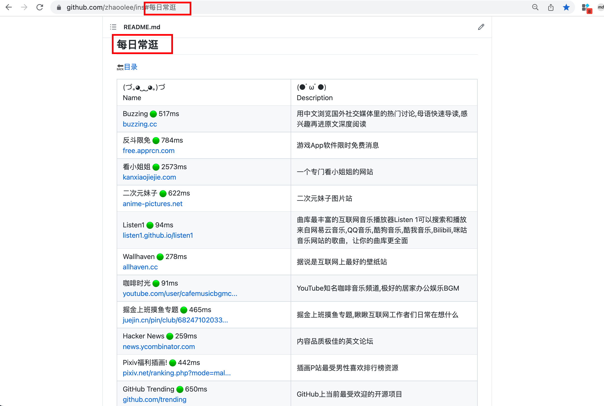
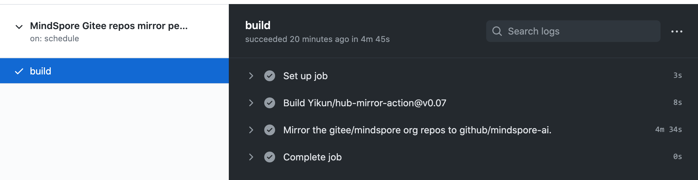

# GitHub Actions教程

入门可看阮一峰老师的教程：[GitHub Actions 入门教程 - 阮一峰的网络日志 (ruanyifeng.com)](https://www.ruanyifeng.com/blog/2019/09/getting-started-with-github-actions.html)

[zhaoolee/WordPressXMLRPCTools: 用Hexo的方式管理WordPress(使用Github Actions自动更新文章到WordPress)](https://github.com/zhaoolee/WordPressXMLRPCTools)

[chinthakagodawita/autoupdate：一个 GitHub 操作，每当更改推送到目标分支时，它就会自动更新拉取请求分支。](https://github.com/chinthakagodawita/autoupdate)

基于Github Actions自动检测网站连接速度的开源导航工具：https://github.com/zhaoolee/ins

将网址相关内容写入[csv文件](https://github.com/zhaoolee/ins/blob/main/website_info.csv)，加入标签字段（可选），开源脚本可以定时运行Github Actions, 对网址进行连接速度检测, 并根据标签自动分类, 分类的网址，会自动生成锚点，方便一键直达；比如 https://github.com/zhaoolee/ins#每日常逛

## 用于Github/Gitee仓库同步的Github Action

## 介绍：

- 一个利用Github Action完成Github或者Gitee用户/组织的工具。
- 支持黑白名单、指定库同步、缓存加速、强制同步等功能。
- 可以配合Github action的配置完成周期同步代码的诉求。
- 目前支持Github、Gitee的用户和组织的同步。

[1] Action地址：https://github.com/marketplace/actions/hub-mirror-action
[2] 代码：https://github.com/Yikun/hub-mirror-action
[3] 演示：https://github.com/Yikun/hub-mirror-action/actions
[4] 原理：[巧用Github Action同步代码到Gitee](https://yikun.github.io/2020/01/17/巧用Github-Action同步代码到Gitee/)