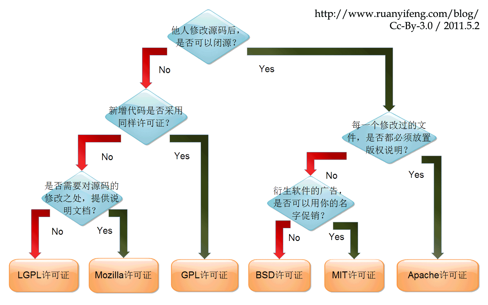
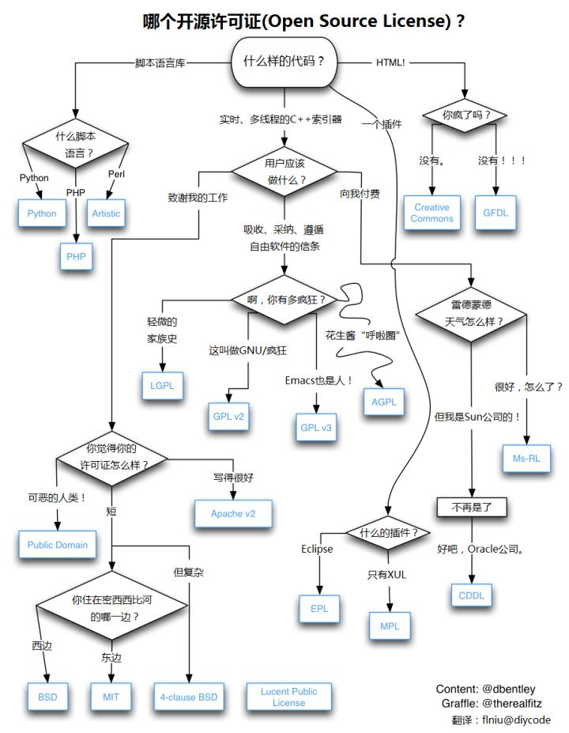

# 代码开源协议

> 开源项目的版权都有明确的归属，受到相关开源协议的约束和保护。在 GitHub 上有一篇详细的《[开源指南](https://opensourceway.community/open-source-guide/legal/)》，讲解了开源的基本法律知识和问题。希望使用 GitHub 的朋友都能认真读一读这篇指南，保护自己的合法权益，也尊重他人的劳动成果
>

现在市面上的开源协议至少有上百种，经过 开源促进会（Open Source Initiative）认可的开源协议也多达 70 多种。不过我们最常用的主流开源协议主要有 GPL、LGPL、EPL、MPL、Apache、MIT 和 BSD 这几种。

## 介绍常见的开源协议：

- BSD（Berkeley Software Distribution license）
- MIT（Massachusetts Institute of Technology）
- Apache Licence 2.0（ASL）
- GPL（General Public License）
- AGPL（The Affero General Public License）
- LGPL（Lesser General Public License）
- MPL(Mozilla)（Mozilla Public License）
- EPL（Eclipse Public License）

#### 借用以下分析图（该图**乌克兰程序员 PaulBagwell 原创，阮一峰翻译**）展示一下常用的开源协议： http://www.ruanyifeng.com/blog/2011/05/how_to_choose_free_software_licenses.html

::: details
乌克兰程序员 PaulBagwell 原创：https://paulmillr.com/posts/simple-description-of-popular-software-licenses/
:::

#### [维基百科上维基条目 直观的汇总了各个开源许可证在多个方面的差别](https://zh.wikipedia.org/wiki/%E8%87%AA%E7%94%B1%E5%8F%8A%E9%96%8B%E6%94%BE%E5%8E%9F%E5%A7%8B%E7%A2%BC%E8%BB%9F%E9%AB%94%E8%A8%B1%E5%8F%AF%E8%AD%89%E6%AF%94%E8%BC%83)

#### 国外 IT 大牛 Dan Bentley 制作了一张更全面也很有趣的图：https://www.diycode.cc/topics/164

## **一、BSD 协议 （Berkeley Software Distribution license）**

BSD 源自加州大学伯克利分校，是自由软件中使用最广泛的许可协议之一，其给于使用者很大自由的协议。

使用者**可以自由的使用、修改源代码，也可以将修改后的代码开源或闭源，甚至作为商业软件再发布。前提是发布的源代码、二进制可执行文件相关文档中需包含 BSD 许可协议声明，并且不能使用开源机构名字做产品的市场推广**。

BSD 许可证有三种版本：初版的 4 句版许可证，“修订版”3 句版许可证和“简化版”2 句版许可证。这三种版本都在使用理念上高度接近 MIT 许可证。事实上，2 句版 BSD 许可证和 MIT 许可证之间的实际差异很小。

3 句版和 4 句版 BSD 许可证增加了对名称重用和广告的更多要求。如果你想保护自己的产品或品牌名称，可以考虑使用这两版许可证。

##### BSD 许可证具有以下特点：

- 非版权
- 项目作品适合商业用途。
- 被许可方可以修改工作。
- 被许可方必须提供引用说明。
- 被许可方可以根据不同条款重新发布衍生作品。
- 被许可方不必将其衍生作品和源代码一起发布。
- 被许可方不得使用原作者名称或 商标 来为衍生作品背书（3 句版和 4 句版 BSD）
- 被许可方必须在提及此项目功能或用途的所有广告材料中致谢项目原作者（4 句版 BSD）

##### **使用 BSD 前提条件：**

当你发布使用了 BSD 协议的代码，或以 BSD 协议代码为基础做二次开发时，需要满足以下三个条件：

- 如果再发布的产品中包含源代码，则在源代码中必须带有原来代码中的 BSD 协议；
- 如果再发布的是二进制类库/软件，则需要在类库/软件的文档和版权声明中包含原来代码中的 BSD 协议；
- 不可以使用开源代码的作者/机构名字和原来产品的名字做市场推广；

BSD 鼓励代码共享，但需要尊重代码作者的著作权。 BSD 允许使用者修改和重新发布代码，也允许基于 BSD 代码上开发商业软件的发布和销售，因此**很多公司企业在选用开源产品的时候都首选 BSD 协议（因为遵循 BSD 协议的代码完全可控，必要的时候可以修改或者二次开发）**。

##### **BSD 许可条款**

Copyright (c) 1998, Regents of the University of California All rights reserved. Copyright (c) 1998 著作权由加州大学董事会所有，著作权人保留一切权利。 Redistribution and use in source and binary forms, with or without modification, are permitted provided that the following conditions are met: 在符合以下条件的情况下，允许用户对源代码和二进制文件进行使用和再散播，无论源代码是否进行了修改： 1.Redistributions of source code must retain the above copyright notice, this list of conditions and the following disclaimer. 对于源码的再散播，必须保留以上著作权声明、此条件列表、以及下述的免责声明. 2.Redistributions in binary form must reproduce the above copyright notice, this list of conditions and the following disclaimer in the documentation and/or other materials provided with the distribution. 以二进制可执行文件的散播，必须将以上著作权声明、此条件列表、以及下述的免责声明，添加到文档 以及/或 其他材料中. 3.Neither the name of the University of California, Berkeley nor the names of its contributors may be used to endorse or promote products derived from this software without specific prior written permission. 未事前获取书面许可，不得使用加州大学伯克利分校或本软件贡献者之名称，来为本软件之派生物做任何表示支持、认可或推广、促销之行为。 this software is provided by the regents and contributors "as is" and any express or implied warranties, including, but not limited to, the implied warranties of merchantability and fitness for a particular purpose are disclaimed. in no event shall the regents and contributors be liable for any direct, indirect, incidental, special, exemplary, or consequential damages (including, but not limited to, procurement of substitute goods or services; loss of use, data, or profits; or business interruption) however caused and on any theory of liability, whether in contract, strict liability, or tort (including negligence or otherwise) arising in any way out of the use of this software, even if advised of the possibility of such damage. 免责声明： 本软件是由加州大学董事会及本软件之贡献者提供（本就如此），本软件包装不负任何明示或默示之担保责任，包括但不限于就适售性以及特定目的的适用性为默示性担保。加州大学董事会及本软件之贡献者，无论任何条件、无论成因或任何责任主义、无论此责任为因合约关系、无过失责任主义或因非违约之侵权（包括过失或其他原因等）而起，对于任何因使用本软件包装所产生的任何直接性、间接性、偶发性、特殊性、惩罚性或任何结果的损害（包括但不限于替代商品或劳务之购用、使用损失、资料损失、利益损失、业务中断等等），不负任何责任，即在该种使用已获事前告知可能会造成此类损害的情形下亦然。

::: tip 使用 BSD 协议的常见项目
Django（3 句版 BSD）：https://www.djangoproject.com/foundation/faq/

Ruby（2 句版 BSD 和自定义许可证）：https://www.ruby-lang.org/en/about/license.txt

Redis（3 句版 BSD）：https://redis.io/topics/license
:::

## **二、MIT（Massachusetts Institute of Technology）**

MIT 源自麻省理工学院（Massachusetts Institute of Technology, MIT）

MIT 是和 BSD 一样宽范的许可协议，作者只想保留版权，而无任何其他了限制。 使用者**只需在发布的源代码、二进制可执行文件相关文档中包含 MIT 许可协议声明，便可自由的使用、修改源代码、作为商业软件再发布、甚至使用开源机构名字做产品的市场推广**。

这是一个非常受欢迎的许可证，甚至可能是最受欢迎的。它对重复使用的限制极少，可以轻松地与其他许可证相关联，包括 GPL 和专有许可证。

##### **MIT 协议具有以下特点：**

- 非版权
- 项目作品适合商业用途。
- 被许可方可以修改项目。
- 被许可方必须提供引用说明。
- 被许可方可以根据不同条款重新发布衍生作品
- 被许可方不必将其衍生作品和源代码一起发布。

##### **MIT 许可条款**

Copyright (C) <year /> <copyright holders /> Permission is hereby granted, free of charge, to any person obtaining a copy of this software and associated documentation files (the "Software"), to deal in the Software without restriction, including without limitation the rights to use, copy, modify, merge, publish, distribute, sublicense, and/or sell copies of the Software, and to permit persons to whom the Software is furnished to do so, subject to the following conditions: The above copyright notice and this permission notice shall be included in all copies or substantial portions of the Software. the software is provided "as is", without warranty of any kind, express or implied, including but not limited to the warranties of merchantability, fitness for a particular purpose and noninfringement. in no event shall the authors or copyright holders be liable for any claim, damages or other liability, whether in an action of contract, tort or otherwise, arising from, out of or in connection with the software or the use or other dealings in the software.

::: tip 使用 MIT 协议的常见项目
Node.js：https://nodejs.org/en/

Atom：https://atom.io/faq

AngularJS：https://docs.angularjs.org/misc/faq
:::

## **三、Apache Licence 2.0（ASL）**

Apache Licence 是一个由**Apache 软件基金会**发布的自由软件许可证，最初为 Apache http 服务器而撰写。

ASL 出现后，我们逐步进入宽松的免费许可证时代。在某些情况下，甚至 FSF 都建议使用 Apache 许可证。Apache 许可证相当宽松，因为它不需要在相同的条款下分发任何衍生作品。换句话说，这是一个非版权许可证。 ASL 是 Apache 软件基金会项目使用的唯一许可证。广泛认为 ASL 对商业友好，已在该组织之外得到大量应用。在 ASL 下发布企业级项目并不稀奇。 该协议与 BSD 类似，同样鼓励代码共享和尊重原作者的著作权，允许代码修改、再发布。 Apache Licence 也是对商业应用友好的许可，使用者也**可以在需要的时候修改代码来满足需要并作为开源或商业产品发布/销售**。

**前提条件**

需要满足的条件与 BSD 类似：

- 需要给使用代码的用户拷贝一份 Apache Licence
- 如果你修改了代码，需要在被修改的文件中说明。
- 在延伸的代码中（修改和有源代码衍生的代码中）需要带有原来代码中的协议，商标，专利声明和其他原来作者规定需要包含的说明。
- 如果再发布的产品中包含一个 Notice 文件，则在 Notice 文件中需要带有 Apache Licence。你可以在 Notice 中增加自己的许可，但不可以表现为对 Apache Licence 构成更改。

你可以在 Notice 中增加自己的许可，但不可以表现为对 Apache Licence 构成更改。

##### Apache 许可证具有以下特点：

- 非版权
- 项目作品适合商业用途。
- 被许可方可以修改项目。
- 被许可方必须提供引用说明。
- 被许可方可以根据不同条款重新分配衍生作品。
- 被许可方不必将其衍生作品和源代码一起分发。

##### **如何引用 Apache Licence 2.0 条款**

Copyright [yyyy] [name of copyright owner] Licensed under the Apache License, Version 2.0 (the "License"); you may not use this file except in compliance with the License. You may obtain a copy of the License at http://www.apache.org/licenses/LICENSE-2.0 Unless required by applicable law or agreed to in writing, software distributed under the License is distributed on an "AS IS" BASIS, WITHOUT WARRANTIES OR CONDITIONS OF ANY KIND, either express or implied. See the License for the specific language governing permissions and limitations under the License.

::: tip 使用 ASL 协议的常见项目
安卓（ASL v2.0，某些情况例外）：https://source.android.com/source/licenses.html

Apache Spark（ASL v2.0）：http://spark.apache.org/faq.html

Spring Framework（ASL v2.0）：https://spring.io/projects/spring-framework
:::

## **四、GPL（General Public License）**

GPL 许可证最初由**自由软件基金会（Free Software Foundation）**的**理查德·斯托曼**为 GNU 项目所撰写。

GPL 是一个 Copyleft 许可证，其派生作品只能以相同的许可条款分发： 使用者在软件开发中**只要使用 GPL 协议的相关类库与代码，则该软件亦必须采用 GPL 协议，既必须开源与免费。**

GPL 是最受欢迎的开源许可证之一。它有好几个版本，但对于新项目，你应该考虑使用最新版 GPL。

GPL 支持强大的版权保护，可能是最具保护性的免费软件许可证。其背后的核心理念就是任何衍生作品，也必须在 GPL 下发布。

GPL 是自由软件基金会项目的指定许可证，包括 Linux 系统核心的各种 GNU 编译器集合（GCC）在内的很多项目都采用了 GPL 开源协议。

GPL 协议和 BSD、MIT、Apache Licence 等鼓励代码重用的许可很不一样。

**GPL 的出发点是代码的开源/免费使用和引用/修改/衍生代码的开源/免费使用，其不允许修改后和衍生的代码做为闭源的商业软件发布和销售（只要使用 GPL 协议的相关类库与代码，则该软件亦必须采用 GPL 协议，既必须开源与免费。）**。

大型项目，尤其是商业项目往往将 GPL 与一个或多个其他许可证结合使用。 这也就是为什么我们能免费使用各种版本的 linux，包括商业公司的 Linux、个人组织二次开发的 Linux 版本。

##### GPL 协议具有以下特点：

- 版权约束很强
- 项目工作适合商业用途。
- 被许可方可以修改项目。
- 被许可方必须将源代码与衍生作品一起发布（必须开源）。
- 不允许更换协议：一旦最原始的源码使用了 GPL，其衍生的所有代码都必须使用 GPL。这也是开源保障之一
- 声明变更：对于代码的变更需要有文档进行说明改了哪些地方
- 衍生作品必须以相同的条款发布（保留协议和版权）。

::: tip 使用 GPL 协议的常见项目
Inkscape（GPL v2）：http://wiki.inkscape.org/wiki/index.php/Frequently_asked_questions#Under_what_license_is_Inkscape_released.3F

MySQL（GPL+商业许可证）：https://mariadb.com/kb/en/mariadb/licensing-faq/

MariaDB（GPL v2）：[https://mariadb.com/kb/en/library/licensing-faq/](https://link.zhihu.com/?target=https%3A//mariadb.com/kb/en/library/licensing-faq/)
:::

##### **如何引用 GPL 条款**

Copyright (C) <year /> <name of author /> This program is free software: you can redistribute it and/or modify it under the terms of the GNU General Public License as published by the Free Software Foundation, either version 3 of the License, or (at your option) any later version. This program is distributed in the hope that it will be useful, but WITHOUT ANY WARRANTY; without even the implied warranty of MERCHANTABILITY or FITNESS FOR A PARTICULAR PURPOSE. See the GNU General Public License for more details. You should have received a copy of the GNU General Public License along with this program. If not, see <https://www.gnu.org/licenses/>.

## 五、AGPL（**_The Affero General Public License_**）

原有的 [GPL](http://www.oschina.net/bbs/thread/2826) 协议，由于现在网络服务公司兴起（如：google）产生了一定的漏洞，比如使用 GPL 的自由软件，但是并不发布与网络之中，则可以自由的使 用 GPL 协议确不开源自己私有的解决方案。AGPL 则增加了对此做法的约束。

GPL 的约束生效的前提是“发布”软件，即使用了 GPL 成分的软件通过互联网或光盘 release 软件，就必需明示地附上源代码，并且源代码和产品也受 GPL 保护。这样如果不“发布”就可以不受约束了。比如使用 GPL 组件编写一个 Web 系统，不发布这个系统，但是用这个系统在线提供服务，同时不开源系统代码。

**AGPL 是 GPL 的一个补充，在 GPL 的基础上加了一些限制。**

AGPL 这个协议的制定是为了避免一个 GPL/LGPL 协议中的漏洞，称之为 Web Service Loopwhole。 这主要是由于 GPL 是针对传统的软件分发模式的商业模式 (以微软为代表), 如果你使用的 GPL 的代码作为基础完成你自己的软件，如果你要分发你的软件，你的软件必须也是 GPL 的。

随着以 Google 为代表的软件作为服务的互联网公司的兴起，它们的 “不分发软件，为客户提供网络服务” 的商业模式就不受 GPL 协议的约束，所以 Google 公司在构筑他的搜索引擎的时候可以随心所欲的拿现有的 GPL 协议的开源代码，无需开源他的修改成果。

AGPL 协议在 GPL 协议的基础上加上了这个约束。

小结： 商业软件不能使用 AGPL 协议的代码。

## **六、LGPL（Lesser General Public License）**

LGPL 原本被称为**GNU Library General Public License**，最初于 1991 年发布，为与 GPLv2 保持一致而采用 2.0 版的编号； 许可证的 2.1 版与 1999 年在修订后发布，与此同时，它被重命名为**GNU Lesser General Public License**，以显示**自由软件基金会（Free Software Foundation）**认为并不是所有程序库都应当采用该许可证的态度； LGPL 的第 3 版于 2007 年发布，它以在 GPL 第 3 版之上附加应用一系列许可的方式表现。

LGPL 是 GPL 的一个主要为类库使用设计的开源协议，与 GPL 要求任何使用/修改/衍生之 GPL 类库的的软件必须采用 GPL 协议不同。 **LGPL 允许商业软件通过类库引用方式使用 LGPL 类库而不需要开源商业软件的代码**，这使得**采用 LGPL 协议的开源代码可以被商业软件作为类库引用并发布和销售**；但使用者**如果修改了 LGPL 协议的代码或衍生，则所有修改的代码和衍生的代码都必须采用 LGPL 协议**。

GPL 在某种意义上讲是非常严格的，**它强制任何衍生作品在相同条款下以\*\***开源\***\*方式发布**。程序库应当尤为关注 GPL——库是大型软件的构建模块：在 GPL 协议下发布库，你将强制使用该库的任何应用程序也在 GPL 协议下发布。LGPL 则可以解决这个问题。

**对于**[程序库](https://www.zhihu.com/search?q=%E7%A8%8B%E5%BA%8F%E5%BA%93&search_source=Entity&hybrid_search_source=Entity&hybrid_search_extra=%7B%22sourceType%22%3A%22answer%22%2C%22sourceId%22%3A507675584%7D)**，自由软件基金会（FSF）区分了三种情况：**

- 你的库执行了与非自由标准竞争的标准。在这种情况下，广泛采用你的库将有助于自由软件的发展。 对于这种情况，FSF 建议使用非常宽松的 Apache[许可证](https://www.zhihu.com/search?q=%E8%AE%B8%E5%8F%AF%E8%AF%81&search_source=Entity&hybrid_search_source=Entity&hybrid_search_extra=%7B%22sourceType%22%3A%22answer%22%2C%22sourceId%22%3A507675584%7D)（下文会讲到这种许可证）。
- 你的库执行了其他库已执行的标准。在这种情况下，完全放弃[copyleft](https://www.zhihu.com/search?q=copyleft&search_source=Entity&hybrid_search_source=Entity&hybrid_search_extra=%7B%22sourceType%22%3A%22answer%22%2C%22sourceId%22%3A507675584%7D)对于自由软件的发展没有任何好处。所以 FSF 推荐使用 LGPL。
- 最后，如果你的库不与其它库或其他标准竞争，FSF 建议使用 GPL。

当然，FSF 的建议大多是从[道德](https://www.zhihu.com/search?q=%E9%81%93%E5%BE%B7&search_source=Entity&hybrid_search_source=Entity&hybrid_search_extra=%7B%22sourceType%22%3A%22answer%22%2C%22sourceId%22%3A507675584%7D)上做的考虑，而在实际情况中，开发者还会有其他方面的顾虑，特别是很多时候想根据许可项目开展商业业务。此时将商业许可证考虑在内是可行的选择。

##### LGPL 协议具有以下特点：

- 版权约束较弱（受限于动态关联的程序库）
- 项目作品适合商业用途。
- 被许可方可以修改项目。
- 被许可方必须将源代码与衍生工作一起开源发布。
- 如果你修改了项目，则必须以相同的条款发布修改后的作品。
- 如果你使用项目作品，无需以相同的条款发布衍生作品。

##### **如何引用 LGPL 条款**

Copyright (C) year name of author This library is free software; you can redistribute it and/or modify it under the terms of the GNU Lesser General Public License as published by the Free Software Foundation; either version 2.1 of the License, or (at your option) any later version. This library is distributed in the hope that it will be useful, but WITHOUT ANY WARRANTY; without even the implied warranty of MERCHANTABILITY or FITNESS FOR A PARTICULAR PURPOSE. See the GNU Lesser General Public License for more details. You should have received a copy of the GNU Lesser General Public License along with this library; if not, write to the Free Software Foundation, Inc., 51 Franklin Street, Fifth Floor, Boston, MA 02110-1301 USA

::: tip 使用 LGPL 协议的常见项目
http://OpenOffice.org 3 （LGPL v3）：https://www.openoffice.org/license.html

CUPS （LGPL v2 和 GPL）：https://www.cups.org/doc/license.html

GNU Aspell （LGPLv2.1）：https://directory.fsf.org/wiki/Aspell#tab=Details
:::

## **七、MPL（Mozilla Public License）**

**MPL**开源协议由**Mozilla 基金会**开发并维护。 该协议融合了 BSD 许可与 GNU 通用公共许可协议的特性，追求平衡专有软件和开源软件开发者之间的顾虑（**平衡开发者对源代码的需求和他们利用源代码获得的利益**）。

**MPL 协议**允许使用者**在自己已有的源代码库上加一个接口，除了对接 Mozilla Public License 开源库的接口程序源代码以 MPL 许可的形式对外许可外，源代码中的其他源码可以不用 MPL 许可证的方式强制对外许可**。

**MPL 协议**是 Mozilla 基金会开发的软件所用的许可证，当然不仅仅用于这个领域。 **MPL 协议**旨在严格许可证成为（如 GPL）和宽松许可证（如 MIT 许可证）之间的折中方案。

在**MPL 协议**中，“发证单位”是源文件。许可方不得限制 MPL 涵盖的任何文件的用户权限和访问权限。但是同一个项目也可以包含专有的非 MPL 许可文件。如果授予对 MPL 许可文件的访问权限，则可以在任何许可下发布生成的项目。

##### **MPL 协议**具有以下特点：

- 版权约束较弱（受限于单个文件）
- 项目作品适合商业用途。
- 被许可方可以修改项目。
- 被许可方必须提供引用说明。
- 被许可方可以根据不同条款重新发布衍生作品
- 被许可方不得重新许可 MPL 许可的资源
- 被许可方必须将其衍生作品与 MPL 许可的源代码一起分发。

##### **使用 MPL 协议前提条件：**

- 经 MPL 许可证发布的源代码的修改也要以 MPL 许可证的方式再许可出来；
- 如果修改了代码，需要有一个专门文件描述对源代码程序的修改时间和修改方式；

::: tip 使用 MPL 协议的常见项目
火狐浏览器

办公套件 LibreOffice（MPL v2.0）：https://www.libreoffice.org/about-us/licenses/

2D 图形引擎 Cairo（MPL v1.1）：https://cairographics.org/
:::

## **八、EPL（Eclipse Public License）**

**协议**：https://www.eclipse.org/legal/epl-2.0/

Eclipse 公共许可证（简称 EPL）是一种开源软件发布许可证，由 Eclipse 基金会应用于名下的集成开发环境 Eclipse 上。EPL 替代了原先的通用公共许可证（CommonPublicLicense，简称 CPL），在其基础上删除了专利相关诉讼的限制条款。

EPL 是为适合商业应用的自由软件所量身定制的许可证，其反版权限定也比现时的[GNU 通用公共许可证](https://baike.baidu.com/item/GNU%E9%80%9A%E7%94%A8%E5%85%AC%E5%85%B1%E8%AE%B8%E5%8F%AF%E8%AF%81/393832)（GNUGPL）等自由软件软件许可证更为松弛：在使用以 EPL 授权的程序时，用户有权使用、修改、复制与发布软件原始版本和修改后版本，在某些情况下则必须将修改内容一并释出。

EPL 已被[开放源代码促进会](https://baike.baidu.com/item/%E5%BC%80%E6%94%BE%E6%BA%90%E4%BB%A3%E7%A0%81%E4%BF%83%E8%BF%9B%E4%BC%9A/1655968)认可，同时亦为[自由软件基金会](https://baike.baidu.com/item/%E8%87%AA%E7%94%B1%E8%BD%AF%E4%BB%B6%E5%9F%BA%E9%87%91%E4%BC%9A/6653246)列入自由软件许可证名单。

关于 EPL 新版本的讨论已于 2013 年 5 月启动。

由于版权约束比 LGPL 弱，因此 EPL 许可证更加商业友好，因为它允许转授使用许可和构建由 EPL 和非 EPL（甚至专有）许可代码组成的软件，前提是非 EPL 代码是“软件的单独模块”。

此外，在包括项目工作在内的商业产品引起的诉讼/损害的情况下，EPL 为 EPL 代码贡献者提供了额外保护。

##### **EPL 协议**具有以下特点：

- 较弱的[版权约束](https://www.zhihu.com/search?q=%E7%89%88%E6%9D%83%E7%BA%A6%E6%9D%9F&search_source=Entity&hybrid_search_source=Entity&hybrid_search_extra=%7B%22sourceType%22%3A%22answer%22%2C%22sourceId%22%3A507675584%7D)（受限于软件“模块”）
- 项目作品适合商业用途。
- 被许可方可以修改项目。
- 如果你修改了作品，则必须以相同的条款发布修改后的作品。
- 如果你使用了作品，无需以相同的条款发布衍生作品。
- 软件的商业分销商必须在因商业用途导致的诉讼/损害中保护或赔偿原始 EPL 贡献者。

::: tip 使用 EPL 协议的常见项目
编程语言 Clojure：https://clojure.org/community/license

应用服务器 Jetty（EPL v1.0）：https://www.eclipse.org/jetty/licenses.html

Java 测试框架（EPL v1.0）：https://junit.org/junit4/license.html
:::

## 九、The Unlicense

[The Unlicense](https://choosealicense.com/licenses/unlicense/)**是一个完全免费无约束的协议，也就是你放弃你的所有权利，将劳动成功无私奉献出来。允许任何人为了任何目的使用任何手段进行任何操作，不用保留任何信息，当然，作者免责**

## 十、None / No License

如果你在使用 GitHub 中,没有选择协议默认是 [No License](https://choosealicense.com/no-permission/), 这并不是代码什么协议也没有, 它表示: **不允许他人进行复制、分发、使用和修改。但是如果你把它上传到了 github，那么默认允许他人查看（view）源码、分叉（fork）到自己的仓库，只是不能使用、修改而已。**

## 关于开源协议的几个重要问题：

##### 我能不使用任何开源协议吗？

如果项目没有明确注明所适用的开源许可证，则应用项目作者司法管辖区的“默认”版权。换句话说，永远不要将“不用许可证”当成一种隐式授权，让他人随心所欲地使用你的项目。事实恰恰相反：即使没有明确的许可证，你，项目的作者，事实上并未放弃[法律](https://www.zhihu.com/search?q=%E6%B3%95%E5%BE%8B&search_source=Entity&hybrid_search_source=Entity&hybrid_search_extra=%7B%22sourceType%22%3A%22answer%22%2C%22sourceId%22%3A507675584%7D)授予的任何权利。

但请记住，许可证既支配权利也支配义务。你有没有想过为什么这么多许可证文本中都有一份粗体大写的关于产品保证的免责声明，或者更常见的是没有保证？这是为了保护作品的所有者免受隐性担保或用户假设。你最不想看到的就是因为发布了开源项目而被[起诉](https://www.zhihu.com/search?q=%E8%B5%B7%E8%AF%89&search_source=Entity&hybrid_search_source=Entity&hybrid_search_extra=%7B%22sourceType%22%3A%22answer%22%2C%22sourceId%22%3A507675584%7D)吧！

##### 我能使用自定义开源协议吗？

**能，但最好别这么干。**

作为一种合同，许可证不能（在大多数[司法管辖区](https://www.zhihu.com/search?q=%E5%8F%B8%E6%B3%95%E7%AE%A1%E8%BE%96%E5%8C%BA&search_source=Entity&hybrid_search_source=Entity&hybrid_search_extra=%7B%22sourceType%22%3A%22answer%22%2C%22sourceId%22%3A507675584%7D)）凌驾于地方法律之上。因此，在全球各地难以强制执行许可权利。一旦牵扯到官司，在法官面前为“标准”开源许可证辩护会更容易（难度要低一些）。事实上，已经出现了类似的案件。显然，使用自定义许可证这官司很难打。

此外，自定义许可证可能会与其他许可证发生冲突，从而导致你的项目在法律上不利。

##### 我能使用多个开源协议吗？

**可以。**

使用多个开源许可证并不罕见。特别是当你想根据开源项目开展商业业务时，最好是多考虑几个开源协议。

##### 我后面能修改许可证吗？

**能改。**

版权所有者负责许可条款，只要你是唯一的贡献者，就可以轻松更改许可证。但是举一个极端的例子，如果 Linus Torvald（Linux 发明者）想要在不同的许可下发布[Linux 内核](https://www.zhihu.com/search?q=Linux%E5%86%85%E6%A0%B8&search_source=Entity&hybrid_search_source=Entity&hybrid_search_extra=%7B%22sourceType%22%3A%22answer%22%2C%22sourceId%22%3A507675584%7D)，他可能首先需要成千上万的贡献者同意该项目。这在实际情况中是不可能完成的。当然，在合理的情况下，是可以做到的。

## **========== 工具网站和参考 ==========**

::: tip 工具网站

##### 开源协议软件许可证查询网站：https://tldrlegal.com/

##### 许可证选择详解说明网站：https://choosealicense.rustwiki.org/

##### GitHub 官方资料：

[GitHub 开源应用程序条款和条件](https://docs.github.com/cn/site-policy/github-terms/github-open-source-applications-terms-and-conditions)

[GitHub 官方的开源协议网址](https://choosealicense.com/)（\***\*提供了各主流许可证的协议文本，并对它们作了详细的介绍和比较\*\***）
:::

##### 参考自下列：

[开发者如何选择开源协议](https://blog.csdn.net/yhan_shen/article/details/122502005?spm=1001.2101.3001.6650.2&utm_medium=distribute.pc_relevant.none-task-blog-2%7Edefault%7ECTRLIST%7ERate-2-122502005-blog-94903264.t5_layer_targeting_s&depth_1-utm_source=distribute.pc_relevant.none-task-blog-2%7Edefault%7ECTRLIST%7ERate-2-122502005-blog-94903264.t5_layer_targeting_s&utm_relevant_index=4)

[一文详解常见开源协议](https://www.cnblogs.com/xiaxveliang/p/12893660.html)

[知乎问答：主流开源协议之间有何异同？](https://www.zhihu.com/question/19568896)

[Github 协议详解](http://www.bewindoweb.com/224.html)**(简单明了版，看这个)**

## 总结

### 1：Apache License 2.0

这是一个著名的非盈利开源组织 Apache 采用的协议，它励代码共享和尊重原作者的著作权，同时也允许代码修改，再发布（作为开源或商业软件）。

- 要求

1. 在代码中保留作者提供的协议和版权信息
2. 如果修改了代码，则必须在被修改的文件中进行说明。

- 允许的权利
  商用、分发、修改、专利授权、私用
  、附加协议
- 禁止项

1. 禁止因使用等造成影响责任承担、也就是说免责申明
2. 不能使用相应的商标。

**提示：商业软件可以使用，也可以修改使用 Apache 协议的代码。**

### 2：GPLv3

此协议是应用最为广泛的开源协议，拥有较强的版权自由要求,也赋予和保证了开源项目开发者广泛的权利。基本上，它允许用户合法复制，分发和修改软件，但衍生代码的分发需开源并且也要遵守此协议。此协议有许多变种，不同变种的要求略有不同。

- 要求

1. 修改后的源码也需要公开
2. 版权及协议也要于此协议一致
3. 修改后，需要在相应的文件做说明，

- 允许
  商用，分发，修改，专利授权，私用
- 禁止

1. 禁止因使用等造成影响责任承担、也就是说免责申明
2. 静止在软件分发传播过程中附加上原来没有的协议条款等

**提示：商业软件不能使用 GPL 协议的代码。**

### 3：LGPL

其主要用于一些代码库，LGPL 比起 GPL 它授予的权限较少，LGPL 允许商业软件通过类库引用(link)方式使用 LGPL 类库而不需要开源商业软件的代码。因此使用 LGPL 协议的开源代码可以被商业软件作为**类库引用**并发布和销售。注意是以类库的形式使用，也就是说如果修改了源代码的话则也必须使用 LGPL 协议贡献源码出来。

- 要求

1. 公开使用了 LGPL 部分的代码，其余部分不需要公开。
2. 可以库引用的方式用于商业软件。
3. 在代码中保留作者提供的协议和版权信息

- 允许
  商用、分发、修改、专利授权、私用、附加协议
- 禁止
  禁止承担责任，(免责申明)、

**提示：商业软件可以使用，但不能修改 LGPL 协议的代码。**

**GPL/LGPL 都保障原作者的知识产权，避免有人利用开源代码复制并开发类似的产品**

### 4：MIT

宽松简单且精要的一个协议。在适当标明来源及免责的情况下，它允许你对代码进行任何形式的使用,也就是原作者只想保留版权,而无任何其他了限制,而你必须在发行版里包含原许可协议的声明,无论你是以二进制发布的还是以源代码发布的。

- 要求
  在代码中保留作者提供的协议和版权信息
- 允许
  商用、分发、修改、私用、附加协议
- 禁止
  禁止承担责任，(免责申明)

**提示：商业软件可以使用，也可以修改 MIT 协议的代码，甚至可以出售 MIT 协议的代码。**

### 5：BSD

BSD 开源协议是一个给于使用者很大自由的协议。基本上使用者可以”为所欲为”,可以自由的使用，修改源代码，也可以将修改后的代码作为开源或者专有软件再发布。与 MIT 协议只存在细微差异。差别为 MIT 可以使用原名称进行宣传，而 BSD 不可以。

- 要求
  在代码中保留作者提供的协议和版权信息
- 允许
  商用、分发、修改、私用、附加协议
- 禁止
  禁止承担责任，(免责申明)

**提示：商业软件可以使用，也可以修改使用 BSD 协议的代码。**

### 6：Mozilla 2.0

是由 Mozilla 基金创建维护的。此协议旨在较为宽松的 BSD 协议和更加互惠的 GPL 协议中寻找一个折衷点，允许免费重发布、免费修改，但要求修改后的代码版权归软件的发起者。这种授权维护了商业软件的利益，它要求基于这种软件得修改无偿贡献版权给该软件。

- 要求

1. 公开源代码
2. 在代码中保留作者提供的协议和版权信息

- 允许
  商用、分发、修改、专利授权、私用、附加协议
- 禁止

1. 禁止承担责任，(免责申明)
2. 禁止使用商标

**提示：商业软件可以使用，也可以修改 MPL 协议的代码，但修改后的代码版权归软件的发起者。**
