# 小程序云开发

## 一、认识小程序云开发

小程序云开发简称 tcb，是微信官方给我们提供的基于腾讯云的云服务器。

目前云开发包含：云数据库，云函数，云存储，云调用。

云开发相对于传统服务器的优势如下表：

|                | 云开发         | 传统服务器     |
| -------------- | -------------- | -------------- |
| 难易程度       | 简单           | 复杂           |
| 部署难易       | 基本上不用部署 | 部署费时费力   |
| 是否需要域名   | 不需要         | 需要           |
| 是否需要备案   | 不需要         | 需要           |
| 是否支持 https | 不需要         | 需要           |
| 适合公司       | 中小型公司     | 大公司         |
| 学习难易       | 容易上手       | 学习起来比较久 |
| 费用           | 免费版基本够用 | 200-2000/年    |

通过上面的对比，我们可以看出，如果你想快速创建一个小程序的后台，用云开发是不错的选择。

## 二、云开发官方文档

[微信开放文档 (qq.com)](https://developers.weixin.qq.com/miniprogram/dev/wxcloud/basis/getting-started.html)

官方文档永远是最好的老师，也是最准最正确的老师，所以在学习过程中，一定要养成经常查看官方文档的习惯。

## 三、开通小程序云开发功能

我们开通小程序云开发，需要符合下面几个条件

- 1、 必须实名注册小程序，因为我们使用云开发时需要用到 appid
- 2、小程序云开发必须先创建一个小程序项目后才能开通

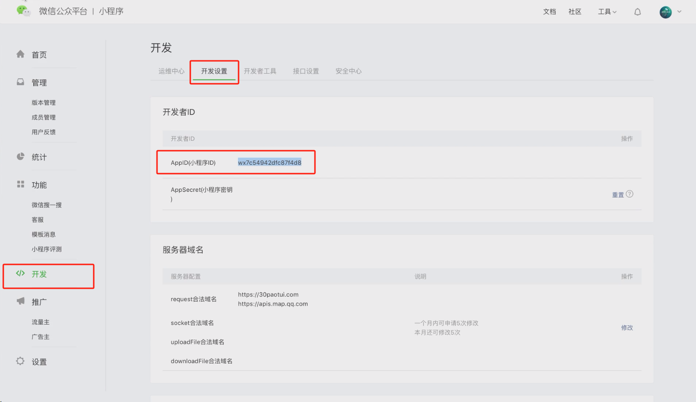

### 开通云开发

文档：[快速开始 / 小程序/小游戏 (qq.com)](https://developers.weixin.qq.com/miniprogram/dev/wxcloud/quick-start/miniprogram.html)

微信开发者工具内，点击【云开发】，然后开通

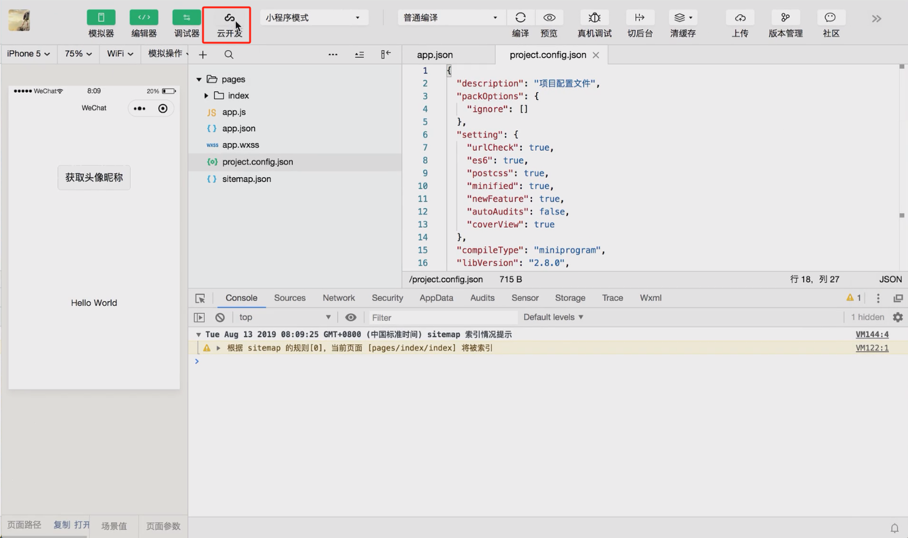

弹出的开通页

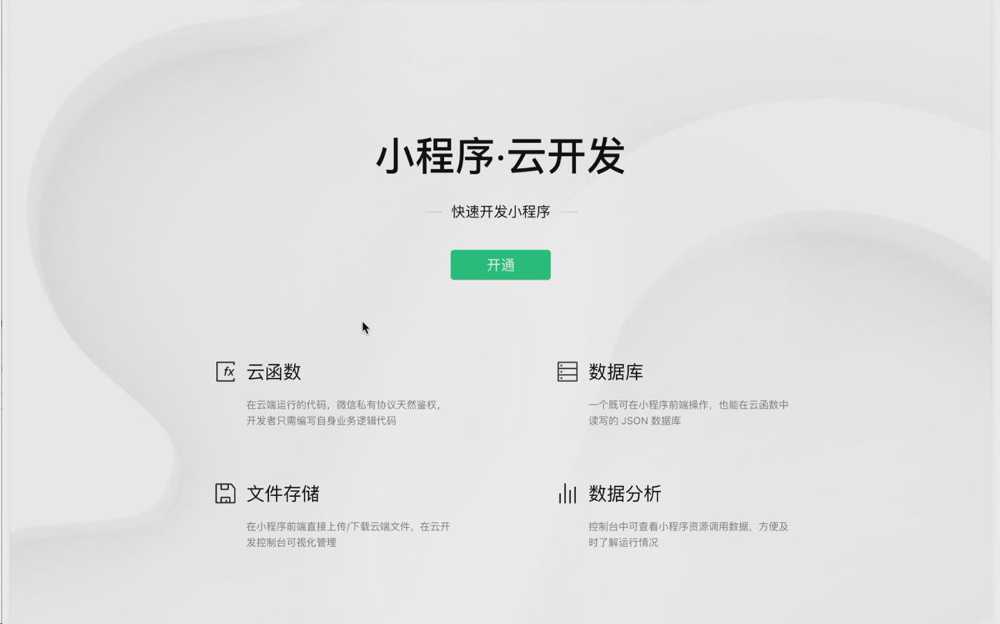

开通协议

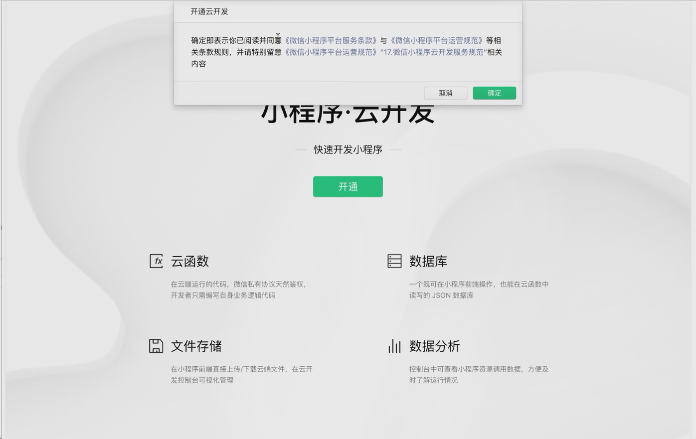

创建

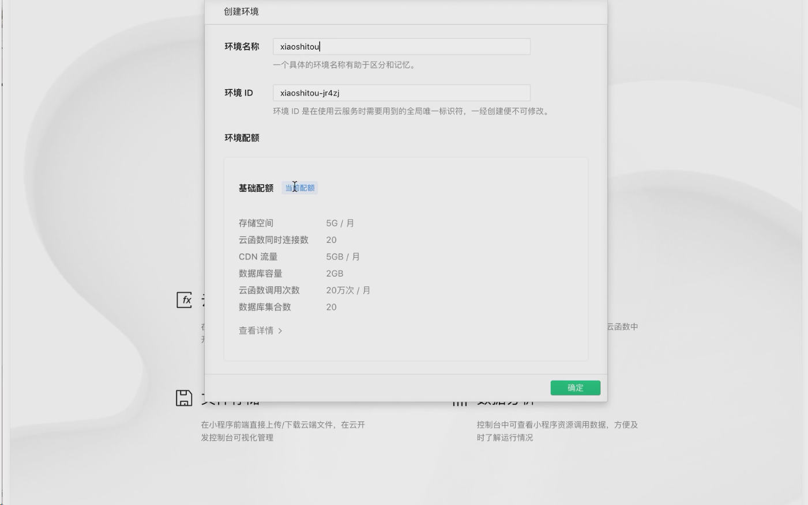

点击确定创建

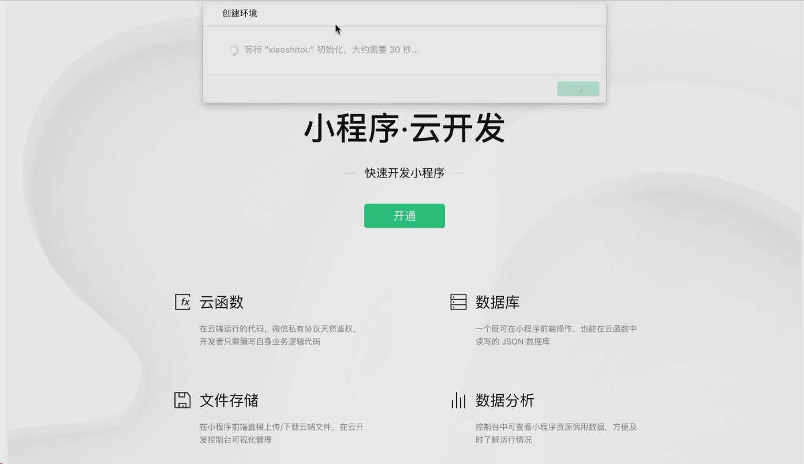

创建成功

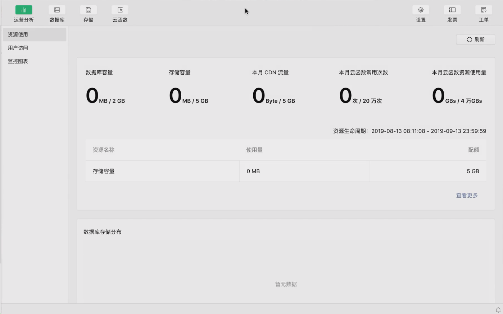

## 四、云开发环境初始化

### 代码初始化

文档可看开发指引：[开发指引 / 指引 / 控制台 (qq.com)](https://developers.weixin.qq.com/miniprogram/dev/wxcloud/guide/)

初始化：[开发指引 / 基础能力 / 初始化 (qq.com)](https://developers.weixin.qq.com/miniprogram/dev/wxcloud/guide/init.html)

### 第 1 步: 创建项目

打开并登录微信开发者工具，新建小程序项目，填入 AppID，后端服务选择“微信云开发”。

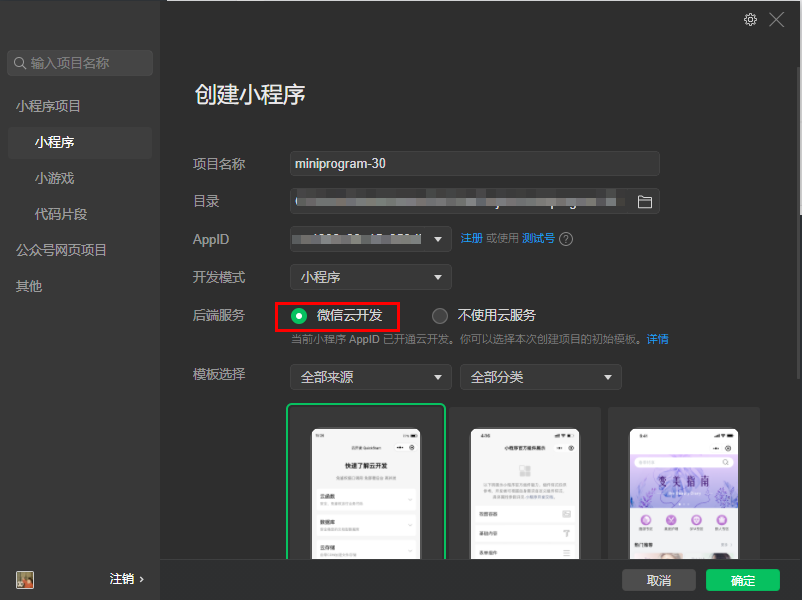

### 第 2 步: 选择模板

在模板来源中选择**微搭**，并在下方选择希望使用的低代码模板。

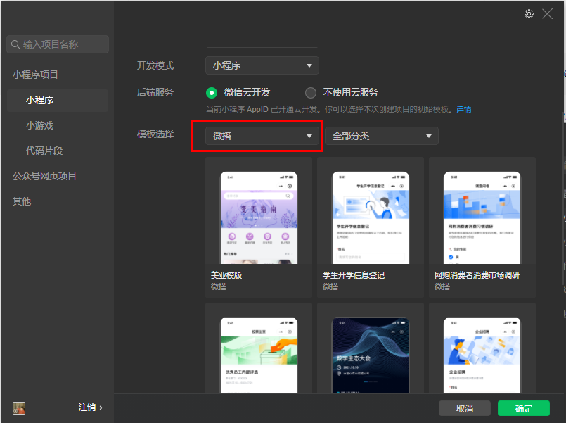

以网购消费者市场调研模板为例，点击确定后即可进入到该模板的低代码编辑器中。

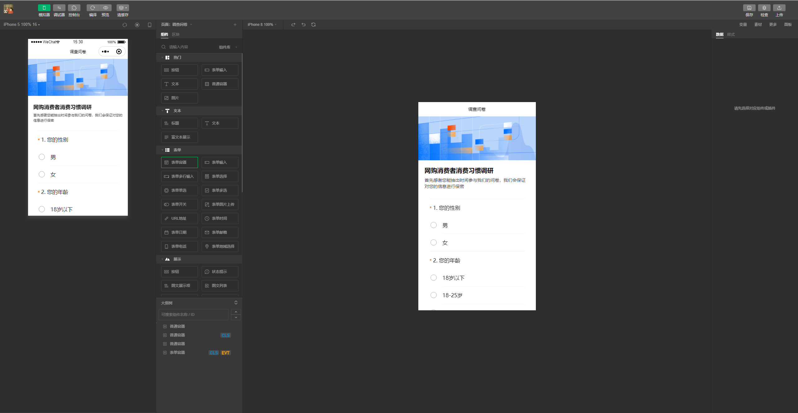

### 基本目录

- miniprogram：存放小程序的前端页面，包含了 app.js，app.json，app.wxss 等文件，以及 pages 目录，存放各个页面的 js，wxml，json，wxss 文件。
- **miniprogram/cloud**：存放云函数的目录，每个子目录对应一个云函数(目录的名字就是云函数的名字)，包含了 index.js，package.json 等文件，以及 node_modules 目录，存放云函数的依赖模块。
- project.config.json：工具配置文件，用于设置项目的 AppID，版本号，编译模式等信息。

### 第 3 步: 开始开发

进入低代码编辑后，便可以通过简单的组件拖拉拽以及可视化界面对模板进行定制化的开发。

## 五、云开发基础能力

文档：[基础概念-云开发能力](https://developers.weixin.qq.com/miniprogram/dev/wxcloud/basis/capabilities.html)

**包括数据库、存储、云函数、云调用、HTTP API**：

- [云开发能力-数据库](https://developers.weixin.qq.com/miniprogram/dev/wxcloud/basis/capabilities.html#数据库)
- [云开发能力-存储](https://developers.weixin.qq.com/miniprogram/dev/wxcloud/basis/capabilities.html#存储)
- [云开发能力-云函数](https://developers.weixin.qq.com/miniprogram/dev/wxcloud/basis/capabilities.html#云函数)
- [云开发能力-云调用](https://developers.weixin.qq.com/miniprogram/dev/wxcloud/basis/capabilities.html#云调用)
- [云开发能力-HTTP API](https://developers.weixin.qq.com/miniprogram/dev/wxcloud/basis/capabilities.html#HTTP API)

### 一、数据库

云开发提供了一个 JSON 数据库，顾名思义，数据库中的每条记录都是一个 JSON 格式的对象。一个数据库可以有多个集合（相当于关系型数据中的表），集合可看做一个 JSON 数组，数组中的每个对象就是一条记录，记录的格式是 JSON 对象。

数据库可以导入和导出当前的数据库，格式为.json。

### 二、存储

云开发提供了一块存储空间，提供了上传文件到云端、带权限管理的云端下载能力，开发者可以在小程序端和云函数端通过 API 使用云存储功能。

如可以上传存储图片、视频等资源。

#### 1、文件上传

选择 word，excel 等文件的文档：[媒体 / 图片 / wx.chooseMessageFile (qq.com)](https://developers.weixin.qq.com/miniprogram/dev/api/media/image/wx.chooseMessageFile.html)

选择图片的文档：[媒体 / 视频 / wx.chooseMedia (qq.com)](https://developers.weixin.qq.com/miniprogram/dev/api/media/video/wx.chooseMedia.html)

选择视频文件的文档：[媒体 / 视频 / wx.chooseMedia (qq.com)](https://developers.weixin.qq.com/miniprogram/dev/api/media/video/wx.chooseMedia.html)

视频播放组件 video 的文档：[媒体组件 / video (qq.com)](https://developers.weixin.qq.com/miniprogram/dev/component/video.html)

使用 wx.cloud.uploadFile 上传文件：[开发者资源 / SDK 文档 / 文件存储 / uploadFile / 小程序 (qq.com)](https://developers.weixin.qq.com/minigame/dev/wxcloud/reference-sdk-api/storage/uploadFile/client.uploadFile.html)

#### 2、文件下载

使用 wx.cloud.downloadFile 下载文件：[开发者资源 / SDK 文档 / 文件存储 / downloadFile / 小程序 (qq.com)](https://developers.weixin.qq.com/miniprogram/dev/wxcloud/reference-sdk-api/storage/downloadFile/client.downloadFile.html)

#### 3、使用 wx.openDocument 打开文件

[文件 / wx.openDocument (qq.com)](https://developers.weixin.qq.com/miniprogram/dev/api/file/wx.openDocument.html)

### 三、云函数

云函数是一段运行在云端的代码，无需管理服务器，在开发工具内编写、一键上传部署即可运行后端代码。

为什么要用云函数获取数据库的数据？

1， 云函数获取数据库数据可以突破 20 条的限制

2， 云函数获取数据库不受数据表的权限控制

3， 云函数可以实现的功能更多

### 四、云调用

云调用是云开发提供的基于云函数使用小程序开放接口的能力，支持在云函数调用服务端开放接口，如发送模板消息、获取小程序码等操作都可以在云函数中完成，详情可见具体[开发指引](https://developers.weixin.qq.com/miniprogram/dev/wxcloud/guide/openapi/openapi.html)。

### 五、HTTP API

云开发资源也可以通过 HTTP 接口访问，即在小程序外访问，接口见[HTTP API 文档](https://developers.weixin.qq.com/miniprogram/dev/wxcloud/reference-http-api/)。

## 以下是云开发实战

## 云开发实现登陆注册功能

### 1、注册页

注册页主要用到了 input 组件获取用户输入，button 组件实现注册功能，注册主要是把账号名和密码添加到云开发数据库

### 2、登陆页

登陆主要是获取用户输入的账号和密码，然后从数据库里读取相应的数据，做账号和密码的比对，如果账号和密码都一样，就可以直接登陆成功

### 3、登陆成功跳转到首页

登陆成功以后，会调整到首页

### 4、保存登陆状态

我们通常做登陆时，用户登陆成功后我们需要帮用户保存登陆状态，要不然用户下次再进入应用时还要重新登陆。所以我们要做下用户登陆状态的保存

## 模仿微信朋友圈

### 1、效果图

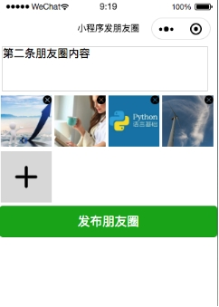 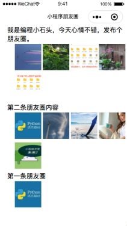

### 2、流程图

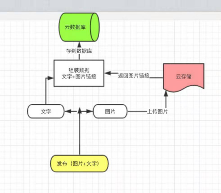

### 3、图文讲解

<https://juejin.im/post/5da15e15f265da5b576be2e8>

### 4、图片选择

<https://developers.weixin.qq.com/miniprogram/dev/api/media/image/wx.chooseImage.html>

### 5、Promise 实现异步

我们做图片上传时，必须所有的图片都上传成功后才能成功，有一个图片上传失败本地上传就不成。

| Promise 做异步                        | new Promise((resolve, reject) => { resolve("异步 123") // reject("错误 123") }).then(res => { console.log("返回的数据", res) }).catch(res => { console.log("错误", res) })         |
| ------------------------------------- | ---------------------------------------------------------------------------------------------------------------------------------------------------------------------------------- |
| Promise.all 执行多条 Promise 异步数据 | let pArr = []let p1 = new Promise((resolve, reject) => { resolve("异步 123") // reject("错误 123")});pArr.push(p1)Promise.all(pArr).then(res => { console.log("返回的数据", res)}) |

Promise.all(iterable) 方法返回一个 [Promise](https://developer.mozilla.org/zh-CN/docs/Web/JavaScript/Reference/Global_Objects/Promise) 实例，此实例在 iterable 参数内所有的 promise 都“完成（resolved）”或参数中不包含 promise 时回调完成（resolve）；如果参数中 promise 有一个失败（rejected），此实例回调失败（reject），失败原因的是第一个失败 promise 的结果。

### 6、云数据库文档

<https://developers.weixin.qq.com/miniprogram/dev/wxcloud/reference-client-api/database/collection.orderBy.html>

## 实现微信支付准备工作

我们在使用微信支付之前，需要做以下准备

### 1、注册一个微信支付的商户号

官方注册网址：<https://pay.weixin.qq.com/index.php/apply/applyment_home/guide_normal>

### 2、生成微信支付的密匙

配套图文讲解：<https://www.jianshu.com/p/f0805f5792e3>

### 3、在小程序里关联微信支付的商户号

## 小程序实现微信支付（云开发云函数实现）

### 1、tenpay 三方依赖使用文档

<https://www.npmjs.com/package/tenpay>

### 2、小程序支付官方 api

<https://developers.weixin.qq.com/miniprogram/dev/api/open-api/payment/wx.requestPayment.html>

## 实现订阅消息推送

> 之前的通过 formid 发送模板消息推送，将在 2020 年 1 月 10 日下线，所以我们不得不使用订阅消息了。

我们先来看下订阅消息的官方简介。
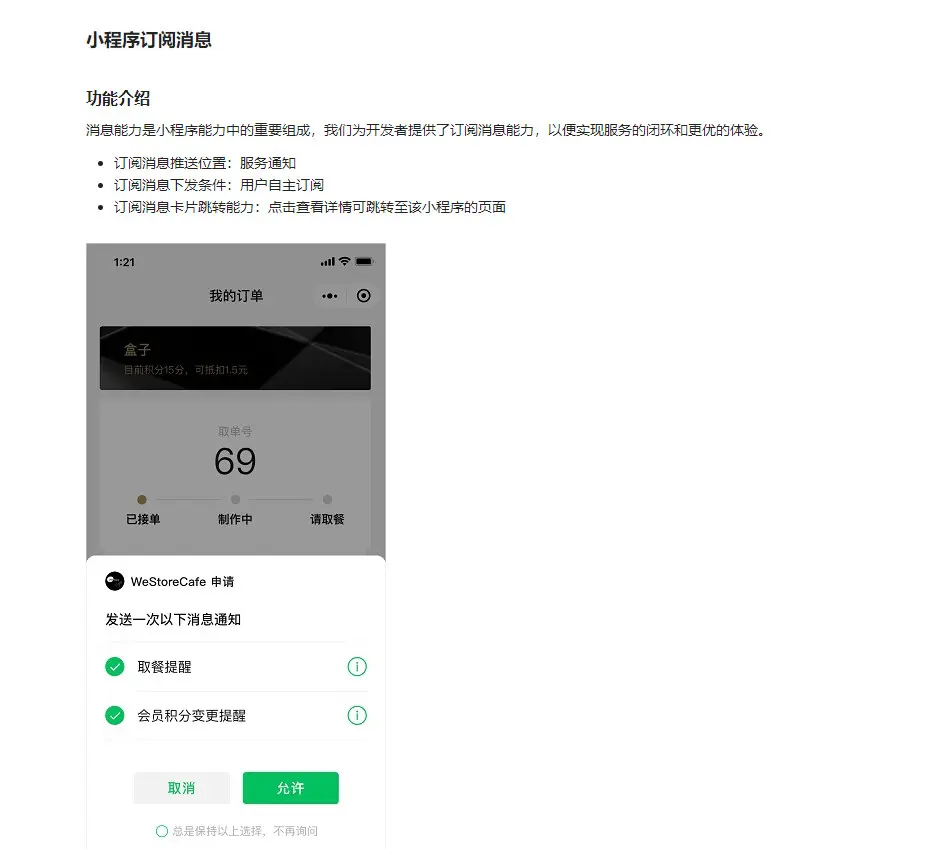
接下来我们就来借助云开发，来快速实现小程序消息推送的功能。

### 一：获取模板 ID

这一步和我们之前的模板消息推送是一样的，也是先添加模板，然后拿到模板 id
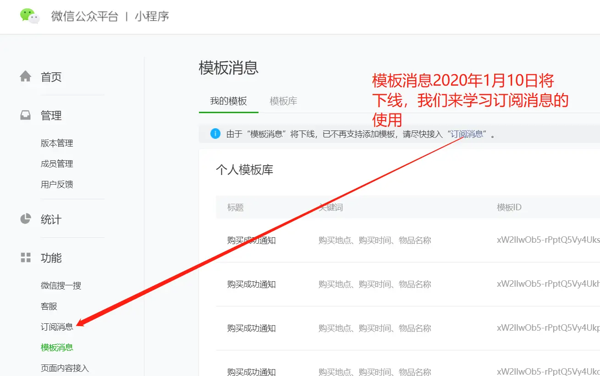
首先是开通订阅消息功能，很简单，如下图
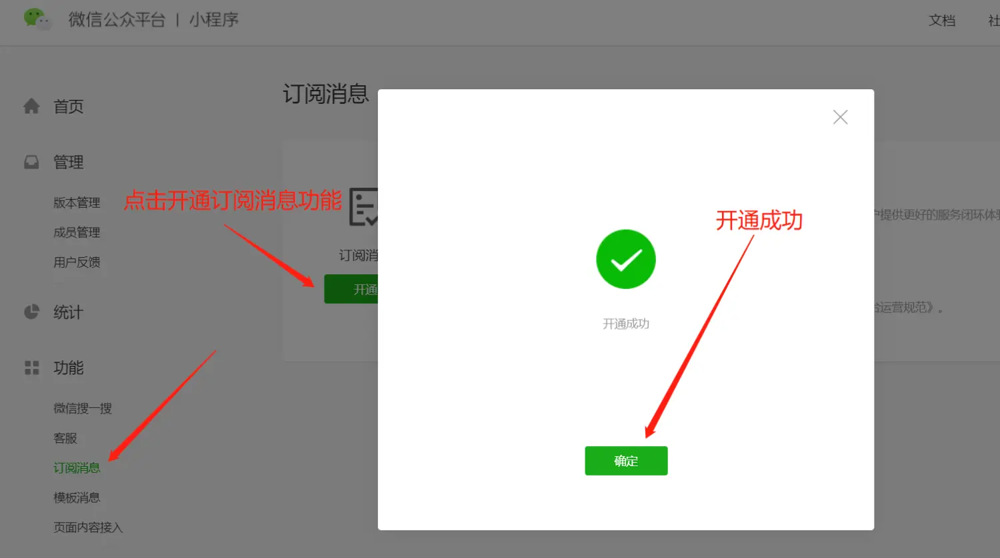
由于长期性订阅消息，目前仅向政务民生、医疗、交通、金融、教育等线下公共服务开放，后期将逐步支持到其他线下公共服务业务。仅就线下公共服务这一点，长期性订阅消息就和大部分开发者无缘了。
所以我们这里只能以使用一次性订阅消息为例。
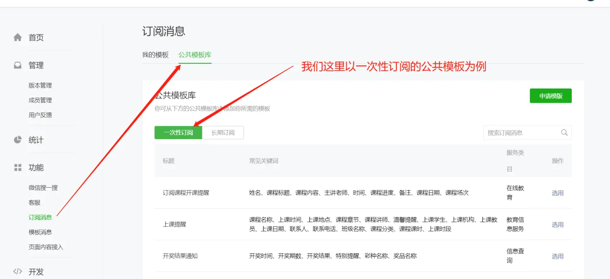
如上图，我们从公共模板库里选择一个一次性订阅的模板。然后编辑模板如下图
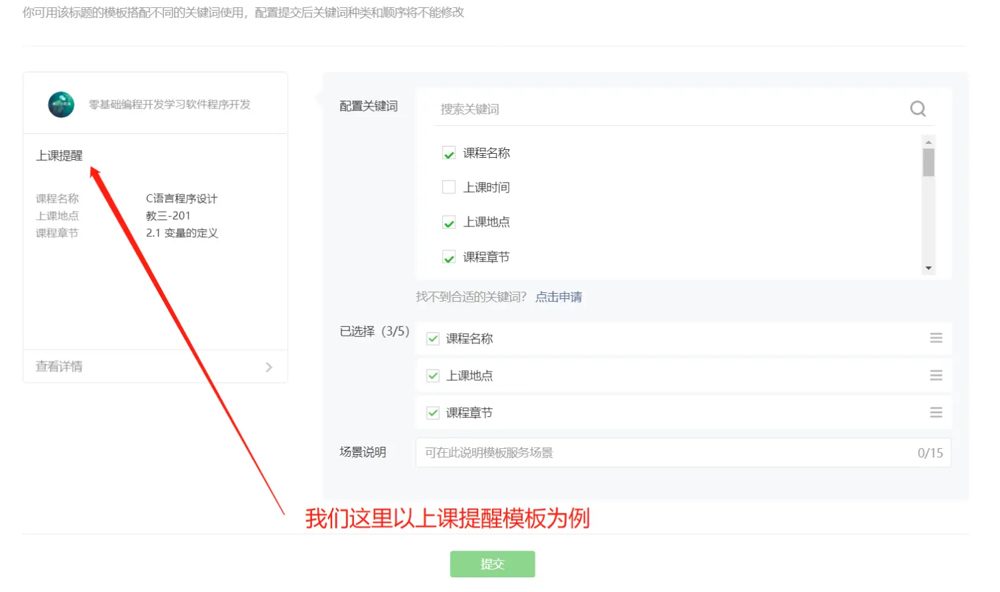
下图就是我们添加好的模板，下图的模板 id 就是我们需要的。
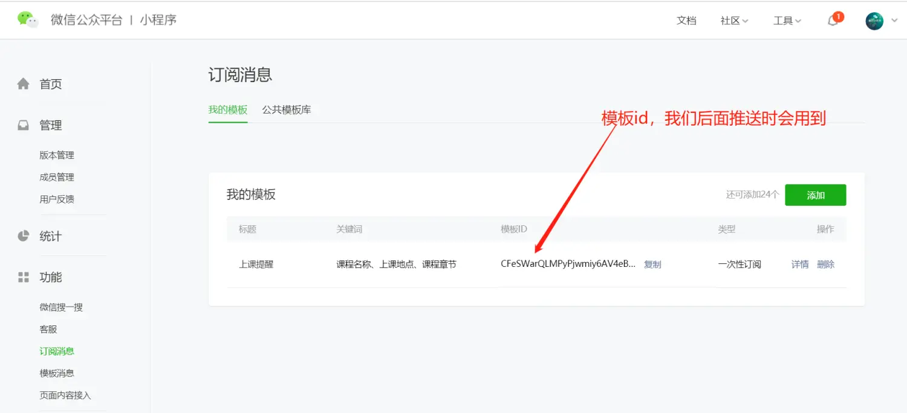

### 二：请求用户授权

我们做订阅消息授权时，只能是用户点击或者支付完成后才可以调起来授权弹窗，官方是这么要求的：
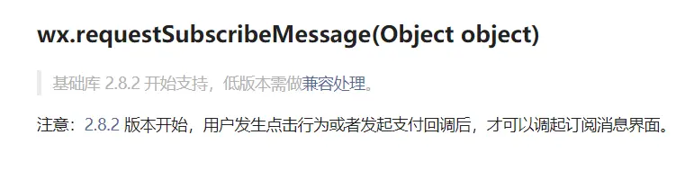
我们这里用到了 wx.requestSubscribeMessage 这个方法，来获取用户的授权。

- 1，编写 index.wxml 代码
  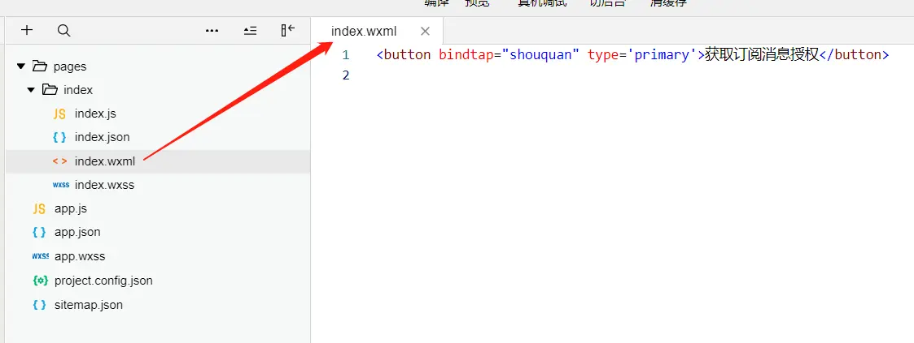
- 2，编写 index.js 代码,实现点击获取授权
  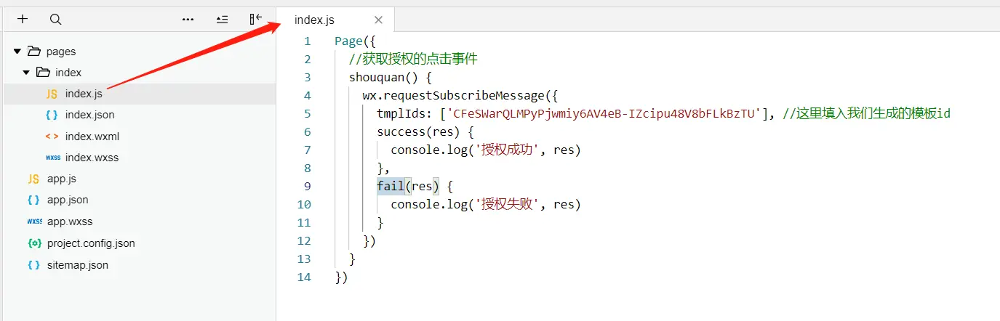
  这一步 tmplIds 里的一串字符，就是我们自己添加的模板 id
- 3，点击按钮运行效果如下
  开发者工具模拟器上点击授权弹窗是这样的：
  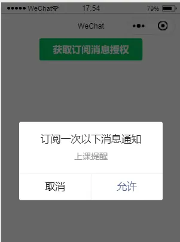
  手机上的授权弹窗是这样的：
  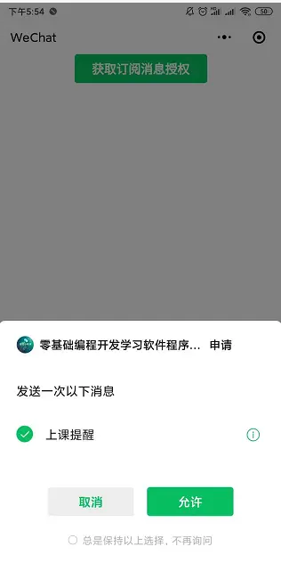
  可以看到，这里显示的就是我们添加的 ‘上课提醒’的模板。
  细心的同学可以看到， 真机上多了一个 ‘总是保持以上选择，不再询问’
  其实，你自己仔细多品一些。也能明天，我们正常订阅消息授权时，用户允许的话，你只能推送一次消息。也就是用户允许一次，我们就可以推送一条消息给用户，并且这个允许不存在过期。所以我们可以让用户尽量多的点击允许，这样我们就可以尽量多的给用户发送消息了。

这里用户允许后，我们就可以给用户推送消息了，接下来我们来借助云开发的云函数来实现消息推送功能。

### 三：获取用户的 opneid

先来看官方爸爸是怎么说的。
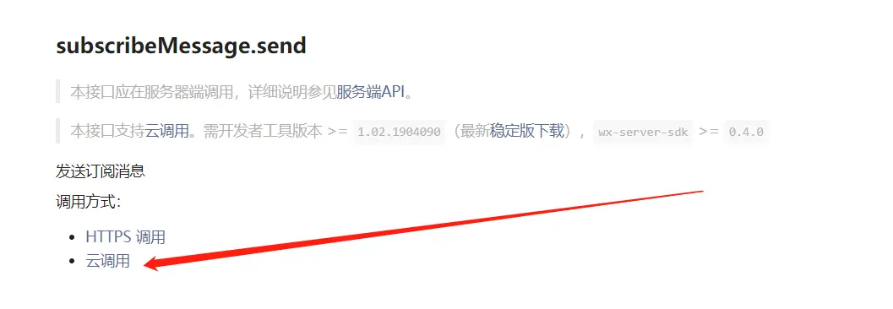
可以看出官方提供了两种方式，我们这里使用云调用。说白了就是在云函数里调用推送功能。

- 推送所需参数
  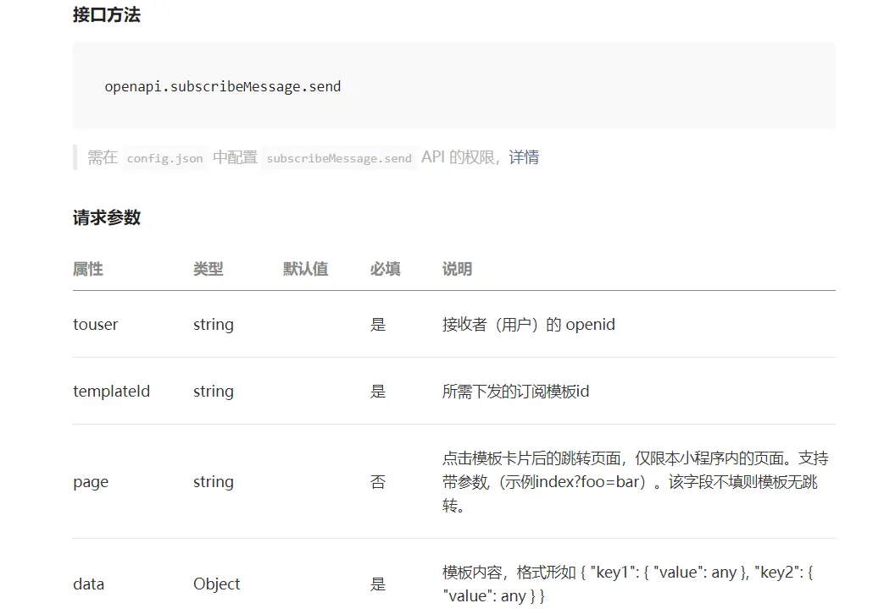
  可以看到我这里用来 openapi 功能，并且需要用到用户的 opneid，关于 openid 的获取，我之前有写过文章，也录过视频的。文章的话，大家去翻下我历史的文章，视频的话，点击这个即可：[《借助云函数获取用户 openid》](https://edu.csdn.net/course/play/26572/336253)
  这里的 openid 的获取我就不再详细讲解了，把对应云函数的代码给大家贴出来。
  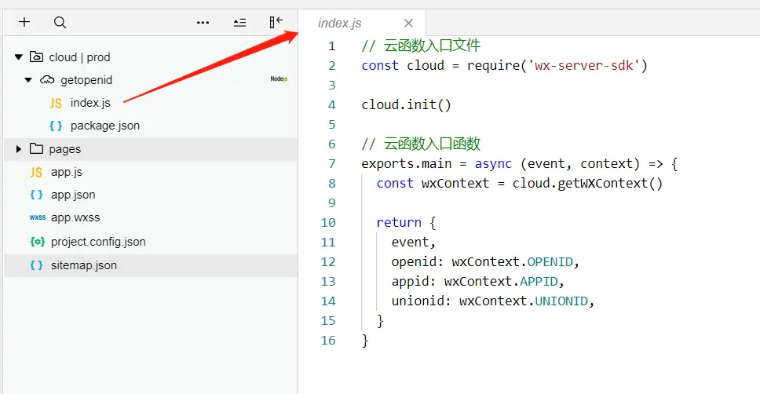
  在使用云开发时，有几点需要注意的
- 1，需要在 project.config.json 里创建云函数目录如下图
  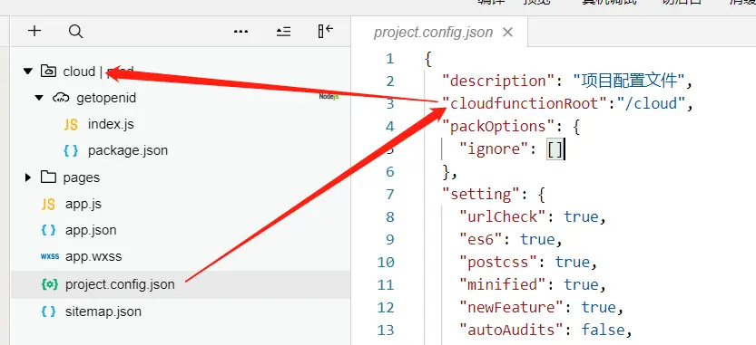
- 2，需要在 app.js 里初始化云开发环境
  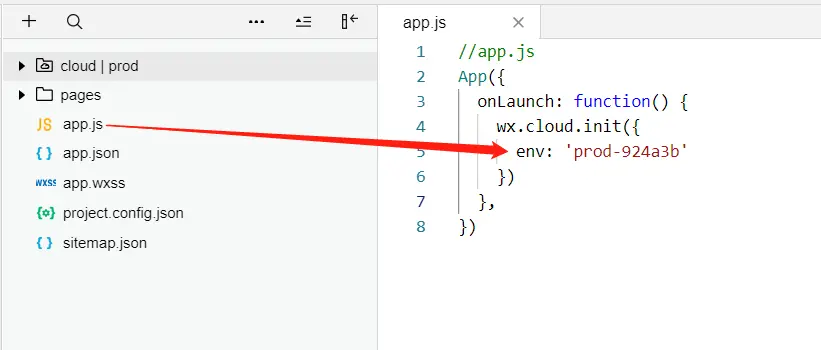
  至于云开发的环境 id 从哪里拿，我视频里也讲过很多遍了，直接去看我视频或者翻看我历史文章即可。
  [《零基础入门云开发视频》](https://edu.csdn.net/course/play/26572/336253)

### 四：用云函数实现消息推送

我们只需要创建一个云函数如下，然后填入用户的 openid，要跳转的小程序页面链接，模板内容，模板 id 即可。通常这些数据都应该传进来，简单起见，我就把这里的模板内容写成固定的。
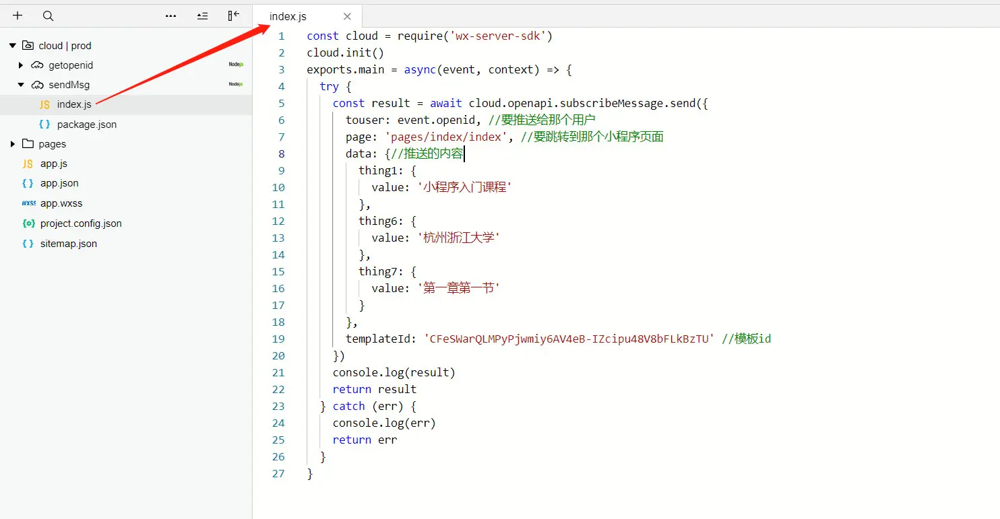

**注意**：我在编写上面的代码时，推送内容的 key 必须和小程序模板里的 key 保持一致，否则就会报如下错误。

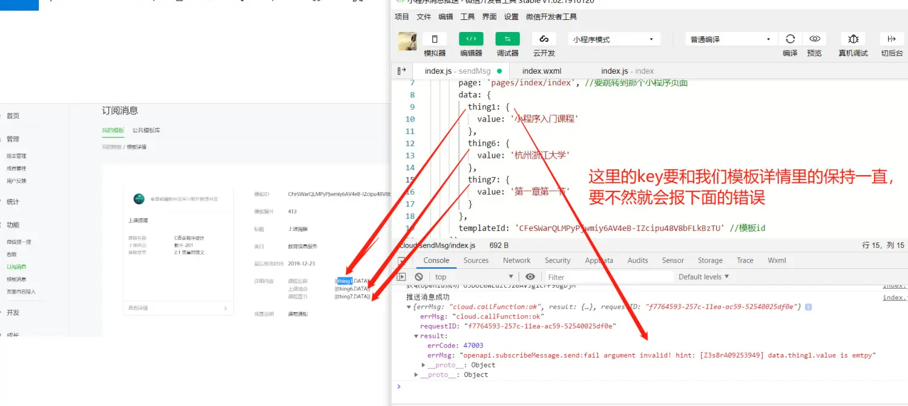

- 然后看下调用这个云函数的地方
  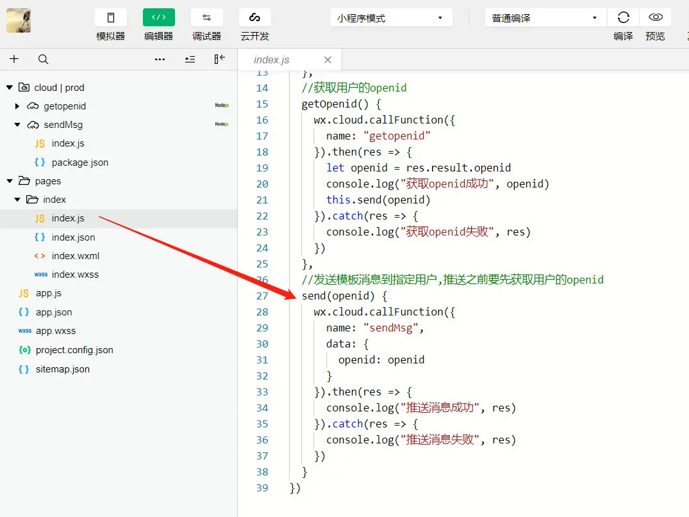
  如果用户没有授权，我们推送会报如下错误
  
  如果用户授权过，我们就可以成功推送了，推送后的打印日志如下
  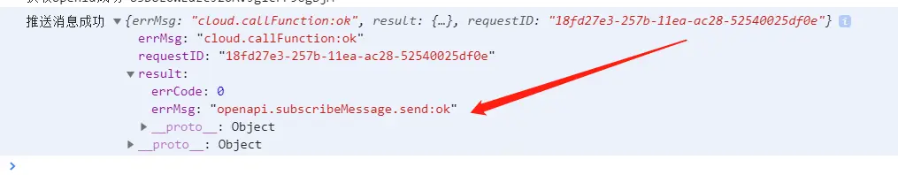
  还记得我们真机上的授权吗，如果用户只是点击了允许，没有选择一直允许，那我我们在推送成功一次后，如果再次推送，就需要用户重新授权。否则，还是会报这个错误的
  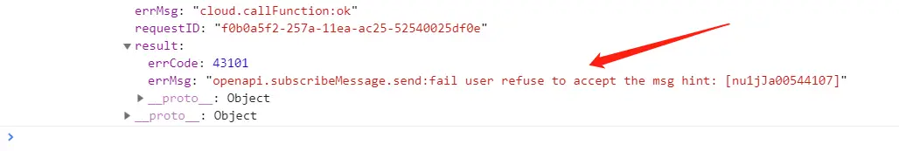
  所以我们用户点击一次允许，我们就可以推送一次消息，比如，我点击了 4 次允许那么我就可以成功的推送 4 次
  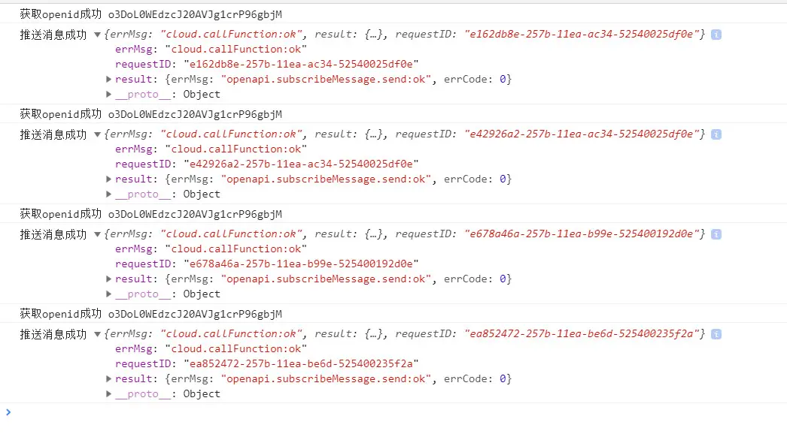

#### 效果图

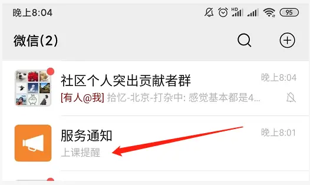
可以看到，我们成功的收到 上课提醒的模板消息，点击进去，就是我们具体的推送内容
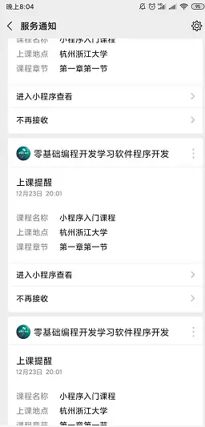
其实我这是连续收到了 4 条消息，因为我点击了 4 次允许推送，所以就可以成功的推送 4 次。

到这里我们就完整的实现模板消息推送功能了，下面我把主要代码贴给大家，大家也可以私信我获取完整源码。

- index.wxml

```html
<button bindtap="shouquan" type="primary">获取订阅消息授权</button>
<button bindtap="getOpenid">获取用户的openid并推送消息</button>
```

- index.js

```js
//编程小石头wechat：2501902696
Page({
	//获取授权的点击事件
	shouquan() {
		wx.requestSubscribeMessage({
			tmplIds: ["CFeSWarQLMPyPjwmiy6AV4eB-IZcipu48V8bFLkBzTU"], //这里填入我们生成的模板id
			success(res) {
				console.log("授权成功", res);
			},
			fail(res) {
				console.log("授权失败", res);
			},
		});
	},
	//获取用户的openid
	getOpenid() {
		wx.cloud
			.callFunction({
				name: "getopenid",
			})
			.then((res) => {
				let openid = res.result.openid;
				console.log("获取openid成功", openid);
				this.send(openid);
			})
			.catch((res) => {
				console.log("获取openid失败", res);
			});
	},
	//发送模板消息到指定用户,推送之前要先获取用户的openid
	send(openid) {
		wx.cloud
			.callFunction({
				name: "sendMsg",
				data: {
					openid: openid,
				},
			})
			.then((res) => {
				console.log("推送消息成功", res);
			})
			.catch((res) => {
				console.log("推送消息失败", res);
			});
	},
});
```

- 推送对应的云函数

```js
//编程小石头wechat：2501902696
const cloud = require("wx-server-sdk");
cloud.init();
exports.main = async (event, context) => {
	try {
		const result = await cloud.openapi.subscribeMessage.send({
			touser: event.openid, //要推送给那个用户
			page: "pages/index/index", //要跳转到那个小程序页面
			data: {
				//推送的内容
				thing1: {
					value: "小程序入门课程",
				},
				thing6: {
					value: "杭州浙江大学",
				},
				thing7: {
					value: "第一章第一节",
				},
			},
			templateId: "CFeSWarQLMPyPjwmiy6AV4eB-IZcipu48V8bFLkBzTU", //模板id
		});
		console.log(result);
		return result;
	} catch (err) {
		console.log(err);
		return err;
	}
};
```

后面我会分享更多小程序相关的知识出来，请持续关注。

#### 注意：授权一次，只能发送一条消息

### 五：发送订阅消息给多个用户

```html
//发送订阅消息给多个用户 sendAll() { if (name == null || name == '') {
wx.showToast({ icon: "none", title: '请输入课程名', }) return } let users = [
"oc4sa0Vp_s65LEItm4JSWT5WFQds", "oc4sa0dZ-pSCu95djiLCt7jo97bY" ]
users.forEach(item => { console.log("for循环", item) this.sendFun(item, name) })
}, //封装的方式方法 sendFun(openid, name) { wx.cloud.callFunction({ name:
"fasong", data: { openid: openid, name: name } }).then(res => {
console.log("发送单条成功", res) }).catch(res => { console.log("发送单条失败",
res) }) }
```

## 短信验证码

文档：[云开发 / 发送短信 v2 (qq.com)](https://developers.weixin.qq.com/miniprogram/dev/OpenApiDoc/cloudbase/newSendCloudBaseSms.html)

### 1、使用云开发短信的条件

这个前置条件很重要，条件不满足，你就没法使用云开发短信功能

#### 使用条件

1、必须是企业小程序，目前个人小程序无法使用短信发送

2、必须开通静态网站功能(后面应该会逐步放开)

3、必须开通云开发(这个没得说，不开通云开发你还用啥云开发功能)
