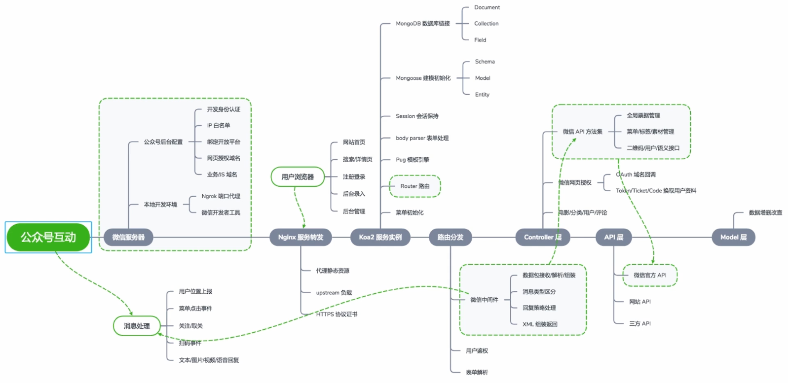

# Koa开发微信公众号后端服务

思维导图：



## 后端接入指南

按照文档一步步实现后端的服务开发

[接入概述 | 微信开放文档 (qq.com)](https://developers.weixin.qq.com/doc/offiaccount/Basic_Information/Access_Overview.html)

## Koa接口开发

0.对接微信服务器

[开启公众号开发者模式 | 微信开放文档 (qq.com)](https://developers.weixin.qq.com/doc/offiaccount/Getting_Started/Getting_Started_Guide.html)

项目代码本地映射

1.koa服务器接口请求参数校验，防止恶意请求：[接入概述 | 微信开放文档 (qq.com)](https://developers.weixin.qq.com/doc/offiaccount/Basic_Information/Access_Overview.html)

最底部有接入的代码示例

```js

```

2.消息回复开发

```js

```

