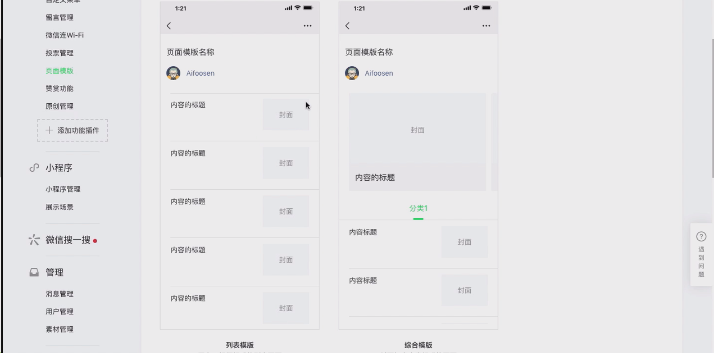
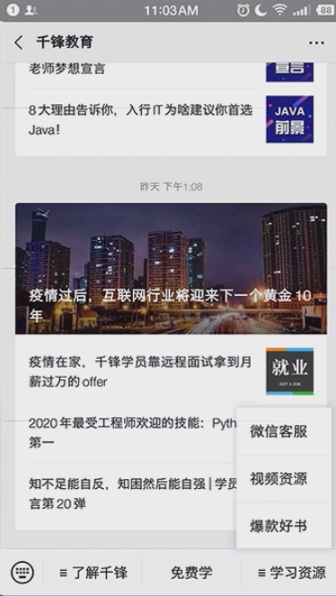
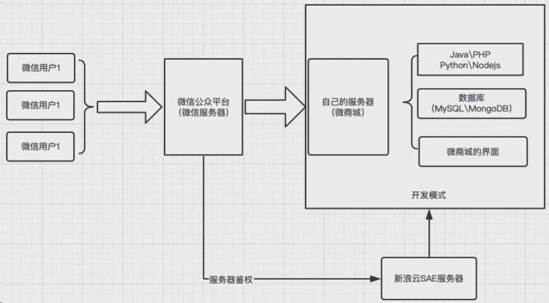
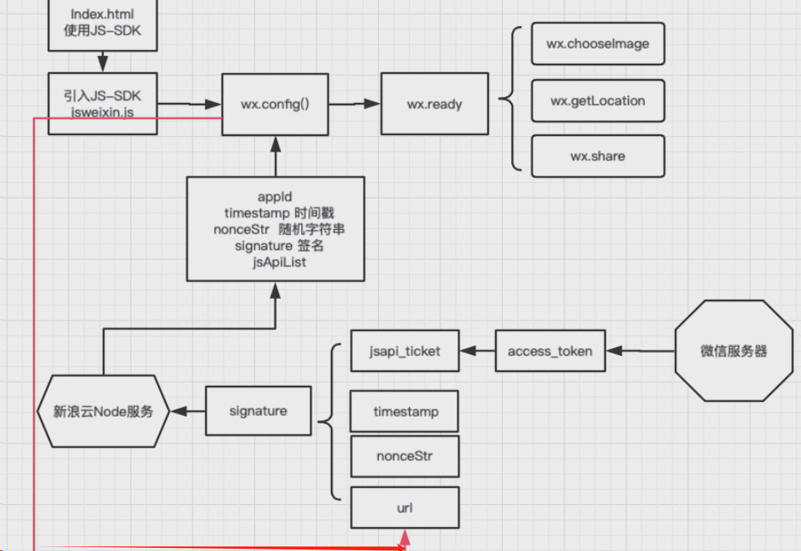
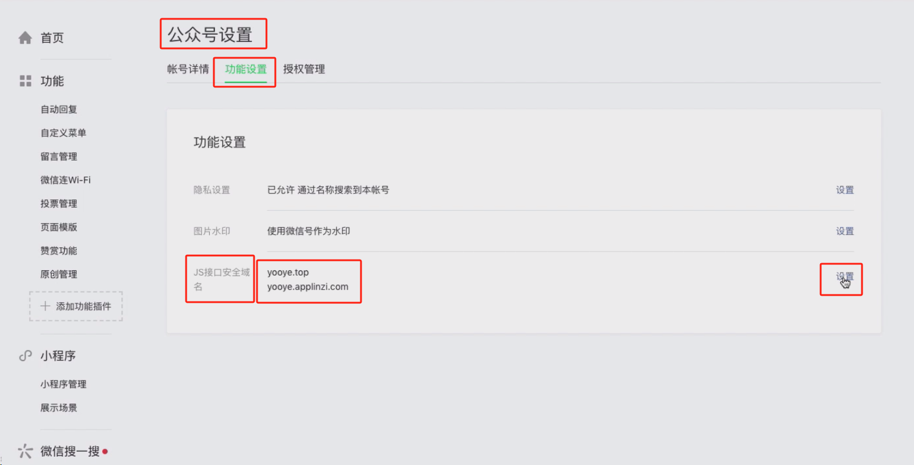
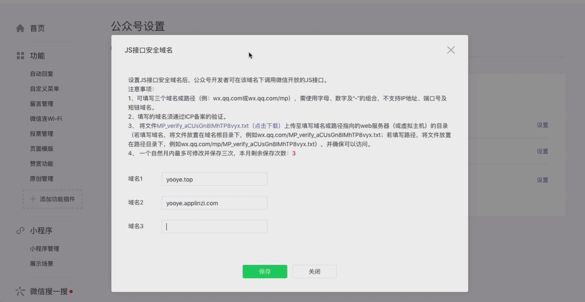
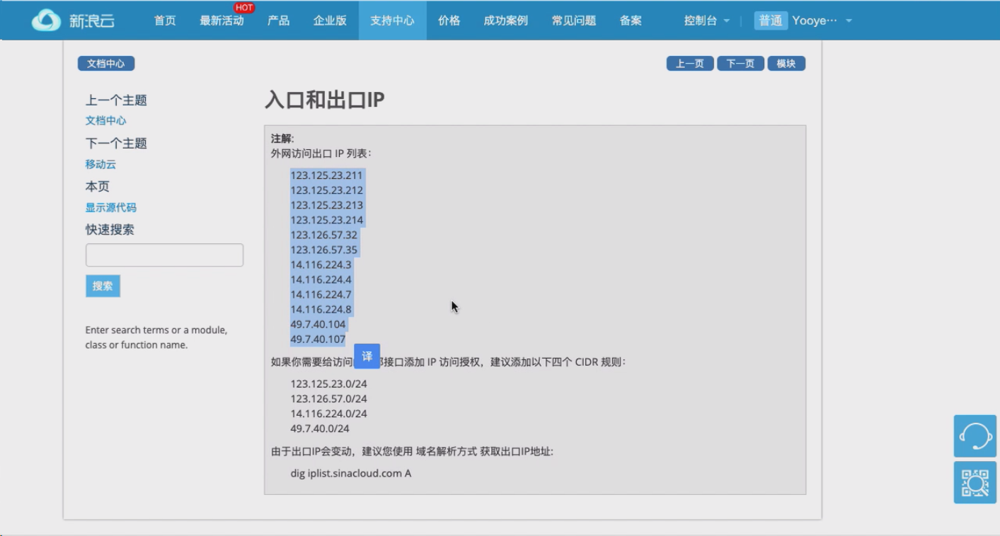
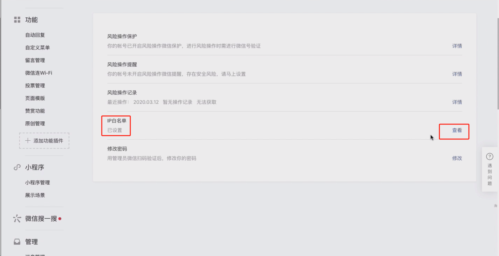
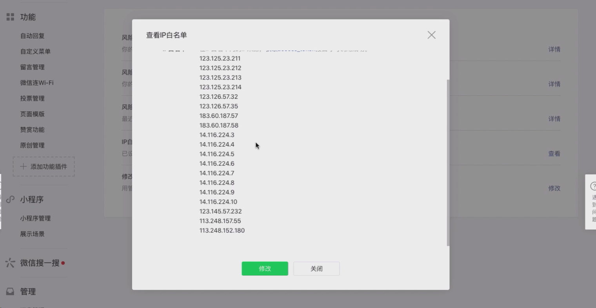
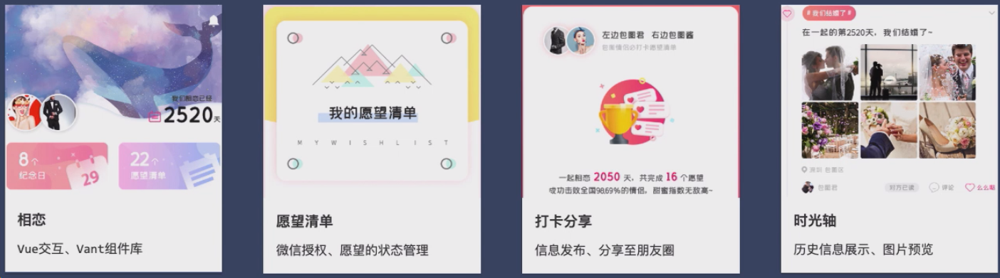

# 微信公众号开发

## 一、微信公众号设置自定义菜单及消息推送

### 1.图文推送

根据关键字，推送文章或其他资料

微信公众号后台：发布文章

### 2.关键字回复

根据关键字，推送对应消息内容

微信公众号后台：功能模块——自动回复

### 3.自定义底部菜单

自定义公众号底部菜单

微信公众号后台：功能模块——自定义底部菜单

### 4.页面模板

收集历史资料，提供更友好的体验

微信公众号后台：功能模块——页面模板



### 公众号展示



## 二、Node.js 服务端开发（Express）

### 流程图



### 使用框架、数据库和软件

#### Express

基于 Node.js，快速、开放、极简的 web 开发框架。

#### MongoDB

MongoDB 是一个基于分布式文件存储的数据库。

#### Mongoose

Mongoose 是对 mongodb 进行便捷操作的对象模型工具。

#### Robo3T

Robo3T 是 mongodb 的一个非常好用的可视化管理工具。

#### 在线部署

云服务器、应用容器、新浪云 SAE、Git 代码托管及部署。

使用二级域名跟微信公众号接口对接，部署自己的服务端代码。

## 三、微信公众号开发鉴权

### 1.网页授权流程

微信公众平台开发文档：[开发前必读 / 首页 (qq.com)](https://developers.weixin.qq.com/doc/offiaccount/Getting_Started/Overview.html)

### 2.JS-SDK 介绍及鉴权

微信网页开发 / JS-SDK 说明文档：[微信网页开发 / JS-SDK 说明文档 (qq.com)](https://developers.weixin.qq.com/doc/offiaccount/OA_Web_Apps/JS-SDK.html)

#### 鉴权流程



#### 步骤一：绑定域名

先完成域名的申请与绑定

##### 1.微信公众平台进入：“公众号设置”的“功能设置”里填写“JS 接口安全域名”。



设置域名：



> 需要事先下载一个 MP_verify_aCUsGn8IMhTP8vyx.txt 文件，放在我们自己填写的域名的静态资源文件夹下去
> 保证我们可以通过域名路径+MP_verify_aCUsGn8IMhTP8vyx.txt 的方式可以访问到该文件，已做验证例如：我们想要配置 aifoosen.applinzi.com 域名
> 则我们要保证通过：http://aifoosen.applinzi.com/MP_verify_aCUsGn8IMhTP8vyx.txt 可以访问到服务器上的这个文件

##### 2.IP 白名单配置

微信公众平台进入“安全中心”的“IP 白名单”里填写，跟 js-sdk 鉴权相关的所有 ip 新浪云相关 IP 的位置：文档中心----入口与出口 IP-----外网访问出口 IP 列表



配置到公众号安全中心



添加 IP 白名单



#### 步骤二：引入 JS 文件

> 在需要调用 JS 接口的页面引入如下 JS 文件，(支持 https)：http://res.wx.qq.com/open/js/jweixin-1.6.0.js

```html
<script src="http://res.wx.qq.com/open/js/jweixin-1.6.0.js" />

<script>
	// 这里就可以通过config接口注入权限验证配置
</script>
```

### 3.config 接口注入权限验证配置

#### index.html

```html
<script src="http://res.wx.qq.com/open/js/jweixin-1.6.0.js" />

<script>
	// 这里就可以通过config接口注入权限验证配置
</script>
```

#### 后端 express 接口对接代码

代码 1

```js
// 引入 express 模块
const express = require("express");
// 引入 crypto 模块
const crypto = require("crypto");
// 引入 xml2js 模块
const xml2js = require("xml2js");
// 引入 xmlbuilder 模块
const xmlbuilder = require("xmlbuilder");

// 创建 express 应用
const app = express();

// 设置你的令牌（Token）
const token = "your_token";

// 监听微信服务器发送的 GET 请求
app.get("/wechat", (req, res) => {
	// 获取请求参数
	const { signature, timestamp, nonce, echostr } = req.query;
	// 将 token、timestamp、nonce 三个参数进行字典序排序
	const array = [token, timestamp, nonce];
	array.sort();
	// 将排序后的字符串拼接成一个字符串
	const str = array.join("");
	// 对拼接后的字符串进行 sha1 加密
	const sha1Str = crypto.createHash("sha1").update(str).digest("hex");
	// 判断加密后的字符串是否与 signature 相等
	if (sha1Str === signature) {
		// 如果相等，说明请求来自微信服务器，返回 echostr
		res.send(echostr);
	} else {
		// 如果不相等，说明请求不合法，返回错误
		res.send("error");
	}
});

// 监听微信服务器发送的 POST 请求
app.post("/wechat", (req, res) => {
	// 定义一个数组，用于存储请求数据
	const buffer = [];
	// 监听请求数据的事件
	req.on("data", (data) => {
		// 将请求数据添加到数组中
		buffer.push(data);
	});
	// 监听请求结束的事件
	req.on("end", () => {
		// 将请求数据转换为字符串
		const msgXml = Buffer.concat(buffer).toString("utf-8");
		// 使用 xml2js 库解析 XML 格式的消息
		xml2js.parseString(msgXml, { explicitArray: false }, (err, result) => {
			if (err) {
				// 如果解析出错，抛出异常
				throw err;
			}
			// 获取解析后的消息对象
			result = result.xml;
			// 获取消息的发送者（用户）
			const fromUser = result.FromUserName;
			// 获取消息的接收者（公众号）
			const toUser = result.ToUserName;
			// 判断消息的类型
			if (result.MsgType === "text") {
				// 如果是文本消息，根据消息内容进行回复
				if (result.Content === "你好") {
					// 如果用户发送 '你好'，回复 '你好，欢迎关注我的公众号'
					replyText(fromUser, toUser, "你好，欢迎关注我的公众号", res);
				} else {
					// 如果用户发送其他内容，回复 '你说的是：' + 消息内容
					replyText(fromUser, toUser, "你说的是：" + result.Content, res);
				}
			} else if (result.MsgType === "event") {
				// 如果是事件消息，根据事件类型进行回复
				if (result.Event === "subscribe") {
					// 如果是关注事件，回复 '感谢你的关注'
					replyText(fromUser, toUser, "感谢你的关注", res);
				} else if (result.Event === "CLICK") {
					// 如果是点击菜单事件，根据菜单键值进行回复
					if (result.EventKey === "V1001_TODAY_MUSIC") {
						// 如果点击了 '今日歌曲' 菜单，回复 '你点击了今日歌曲'
						replyText(fromUser, toUser, "你点击了今日歌曲", res);
					} else if (result.EventKey === "V1001_HELLO_WORLD") {
						// 如果点击了 '你好世界' 菜单，回复 '你点击了你好世界'
						replyText(fromUser, toUser, "你点击了你好世界", res);
					}
				}
			}
		});
	});
});

// 定义一个函数，用于回复文本消息
function replyText(fromUser, toUser, content, res) {
	// 使用 xmlbuilder 库构建 XML 格式的回复消息
	const xml = xmlbuilder
		.create("xml")
		.ele("ToUserName")
		.cdata(fromUser)
		.up()
		.ele("FromUserName")
		.cdata(toUser)
		.up()
		.ele("CreateTime")
		.txt(new Date().getTime())
		.up()
		.ele("MsgType")
		.cdata("text")
		.up()
		.ele("Content")
		.cdata(content)
		.end();
	// 发送回复消息
	res.send(xml);
}

// 监听 3000 端口
app.listen(3000, () => {
	console.log("server is running at http://localhost:3000");
});
```

express 写微信公众号 JS-SDK 鉴权签名功能

```js
// 引入 express 模块
const express = require("express");
// 引入 crypto 模块
const crypto = require("crypto");
// 引入 axios 模块
const axios = require("axios");

// 创建 express 应用
const app = express();

// 设置你的 AppID 和 AppSecret
const AppID = "your_appid";
const AppSecret = "your_appsecret";

// 定义一个变量，用于存储 access_token
let access_token = "";
// 定义一个变量，用于存储 jsapi_ticket
let jsapi_ticket = "";

// 定义一个函数，用于获取 access_token
async function getAccessToken() {
	// 拼接请求 URL
	const url = `https://api.weixin.qq.com/cgi-bin/token?grant_type=client_credential&appid=${AppID}&secret=${AppSecret}`;
	// 发送 GET 请求
	const res = await axios.get(url);
	// 获取响应数据
	const data = res.data;
	// 判断是否成功
	if (data.access_token) {
		// 如果成功，更新 access_token
		access_token = data.access_token;
		// 打印日志
		console.log("获取 access_token 成功：", access_token);
	} else {
		// 如果失败，打印错误
		console.log("获取 access_token 失败：", data.errmsg);
	}
}

// 定义一个函数，用于获取 jsapi_ticket
async function getJsapiTicket() {
	// 拼接请求 URL
	const url = `https://api.weixin.qq.com/cgi-bin/ticket/getticket?access_token=${access_token}&type=jsapi`;
	// 发送 GET 请求
	const res = await axios.get(url);
	// 获取响应数据
	const data = res.data;
	// 判断是否成功
	if (data.ticket) {
		// 如果成功，更新 jsapi_ticket
		jsapi_ticket = data.ticket;
		// 打印日志
		console.log("获取 jsapi_ticket 成功：", jsapi_ticket);
	} else {
		// 如果失败，打印错误
		console.log("获取 jsapi_ticket 失败：", data.errmsg);
	}
}

// 定义一个函数，用于生成签名
function getSignature(noncestr, timestamp, url) {
	// 按照签名算法拼接字符串
	const str = `jsapi_ticket=${jsapi_ticket}&noncestr=${noncestr}&timestamp=${timestamp}&url=${url}`;
	// 对字符串进行 SHA1 加密
	const signature = crypto.createHash("sha1").update(str).digest("hex");
	// 返回签名
	return signature;
}

// 监听微信服务器发送的 GET 请求
app.get("/wechat", async (req, res) => {
	// 获取请求参数
	const { noncestr, timestamp, url } = req.query;
	// 判断参数是否完整
	if (noncestr && timestamp && url) {
		// 如果参数完整，判断 access_token 和 jsapi_ticket 是否存在
		if (!access_token || !jsapi_ticket) {
			// 如果不存在，先获取 access_token
			await getAccessToken();
			// 再获取 jsapi_ticket
			await getJsapiTicket();
		}
		// 生成签名
		const signature = getSignature(noncestr, timestamp, url);
		// 返回签名
		res.send(signature);
	} else {
		// 如果参数不完整，返回错误
		res.send("error");
	}
});

// 监听 3000 端口
app.listen(3000, () => {
	console.log("server is running at http://localhost:3000");
});
```

### 其他功能实现看文档

[微信网页开发 / JS-SDK 说明文档 (qq.com)](https://developers.weixin.qq.com/doc/offiaccount/OA_Web_Apps/JS-SDK.html)

## 四、微信公众号网页综合项目


