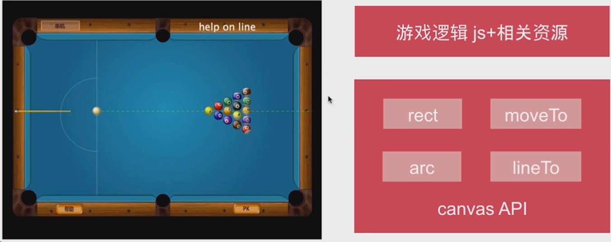
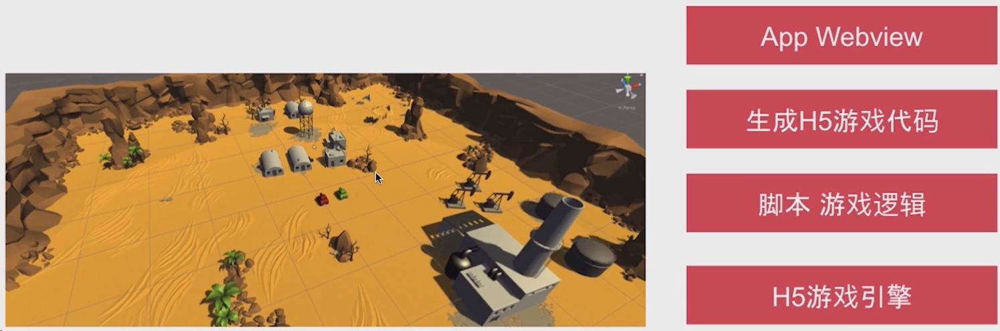
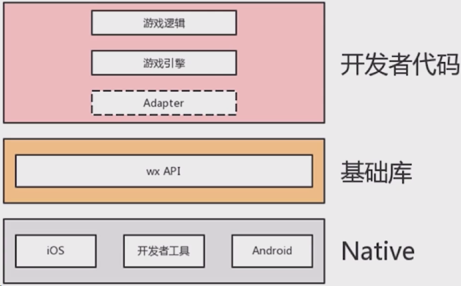

# 什么是微信小游戏

## 基于 DOM 的 H5 小游戏

- 游戏逻辑 is dom 操作+相关资源
- 页面结构 div
- 游戏界面 css

## 基于 canvas 的 H5 小游戏

游戏逻辑 js+相关资源

canvas API

- rect
- arc
- moveTo
- lineTo

可以迁移到微信小游戏开发。

## 基于游戏引擎的 H5 小游戏

- App Webview
- 生成 H5 游戏代码
- 脚本 游戏逻辑
- H5 游戏引擎

现在很多游戏引擎都支持一次编写，编译出很多平台的源码。从而达到多平台开发小游戏的目的。

## 微信小游戏

微信小游戏是一种基于微信平台的游戏产品，它可以让用户在微信内部即点即玩，无需下载安装，同时享受微信的社交能力和原生体验。

微信小游戏是基于微信原生功能特性的、仅保留 HTML5 游戏特性的综合技术。小游戏保留了 H5 中游戏相关的技术，而在此基础上又追加了小程序部分特性能力。这样出来的游戏，技术更专注、特点更微信。

微信小游戏的开发主要依托于 HTML5 技术，尤其是 Canvas 2D 和 WebGL 渲染接口，同时也提供了微信的原生 SDK，用于实现用户登录、转发、排行榜等功能。

Canvas 是 HTML5 提供的一个元素，用于在网页上绘制图形，包括 2D 和 3D 的图形。Canvas 可以用于开发 H5 小游戏和微信小游戏，但不能混用。

**Canvas 2D 可以用于开发 2D 的游戏，如消除类、跑酷类等，而 WebGL 可以用于开发 3D 的游戏，如坦克大战、跳一跳等。**

## 微信小游戏与 H5 小游戏有以下几个区别

[浅显易懂的说清楚小游戏和 H5 游戏的技术区别-腾讯云开发者社区-腾讯云 (tencent.com)](https://cloud.tencent.com/developer/article/2186619)

- 运行环境：微信小游戏不是运行在浏览器中，而是运行在微信的原生环境中，使用独立的 JavaScript 引擎和渲染引擎，因此性能更稳定和可控。
- 本地缓存：微信小游戏支持 4M 的本地包和 50M 的物理缓存，可以提高游戏的加载速度和用户体验，而 H5 小游戏没有本地包，缓存也受浏览器的限制。
- 产品支持：微信小游戏可以利用微信的强大入口和社交传播，获取更多的用户和流量，而 H5 小游戏的入口较少，传播也不便捷。
- API 支持：微信小游戏提供了丰富的微信内部 SDK，可以实现用户登录、转发、排行榜、支付、广告等功能，而 H5 小游戏只能使用浏览器的标准 API，功能受限。
- 微信小游戏相比 APP 游戏轻量级
- 微信小游戏相比 H5 游戏性能好

## H5 小游戏迁移到微信小游戏

### 支持的引擎

H5 游戏

- javascript 逻辑
- H5 游戏引擎
- 浏览器 API
- webview 特性
- IOS/Andorid 操作系统

微信小游戏

- javascript 逻辑
- 微信小游戏游戏引擎
- 微信小游戏 SDK
- webview 特性
- IOS/Andorid 操作系统

### 加载核心游戏包 4M，加载过程如下

小游戏

1. 下载小游戏包
2. 加载 game.js
3. 运行游戏脚本
4. wx.downloadFile 加载远程资源
5. 启动首场景

浏览器

1. 请求 index.html
2. 加载引擎脚本和游戏脚本
3. 按需加载资源
4. 启动首场景

### 微信小游戏 Adapter：模拟浏览器 BOM、DOM API

