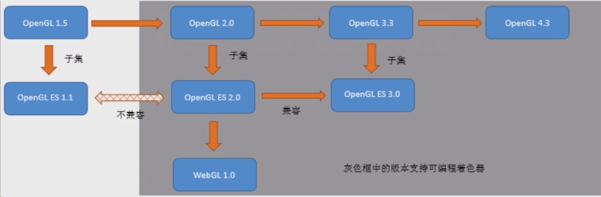
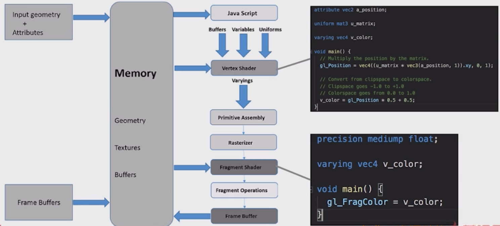
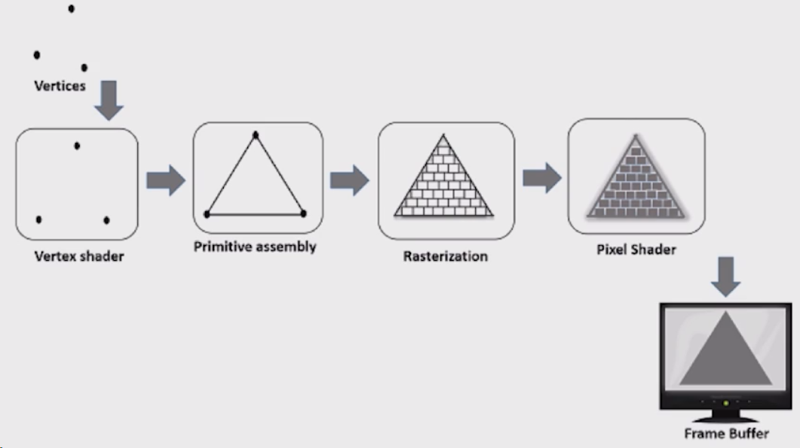

# Canvas-WebGL游戏开发

## 如何对GPU进行编程

OPENGL--The Industry Standard for High Performance Graphics
不同显卡对于OPENGL的支持程度不同



| 类型  | API                                                   |
| :---: | ----------------------------------------------------- |
| WebGL | glTranslate、glRotatef                                |
| GLSL  | 顶点着色器——gl_Position<br />片元着色器——gl_FragColor |

代码示例

```js
// 顶点着色器
varying vec4 v_Color;
void main() {
    ...
    v_Color = vec4(1., 1., 1., 1);
}

// 片元着色器
varying vec4 v_Color;
void main() {
    ...
    gl_FragColor = v_Color;
}
...
```

### webGL渲染管线



例子2



## WebGL管线实战

[WebGL 是一种 JavaScript API，可以在浏览器中渲染高性能的交互式 3D 和 2D 图形，而无需使用插件。](https://developer.mozilla.org/zh-CN/docs/Web/API/WebGL_API)

[WebGL 基于 OpenGL ES 2.0，使用 HTML 的 `canvas` 元素作为绘图容器](https://developer.mozilla.org/zh-CN/docs/Web/API/WebGL_API/Tutorial/Getting_started_with_WebGL)。

要使用 WebGL 进行 3D 渲染，您需要以下几个步骤：

- 获取 `canvas` 元素的引用，并调用 `getContext("webgl")` 方法来获取 WebGL 上下文对象。
- 编写顶点着色器和片段着色器，使用 GLSL 语言描述图形的顶点属性和颜色输出。
- 创建着色器程序对象，并将着色器附加到它上面，然后链接并使用它。
- 创建缓冲区对象，并将顶点数据和索引数据传输到 GPU 中。
- 指定着色器程序中的顶点属性变量和缓冲区对象之间的对应关系。
- 设置视图矩阵、投影矩阵和模型矩阵，以控制图形的视角、大小和位置。
- 设置清除颜色和深度测试等渲染状态。
- 调用 `drawElements()` 或 `drawArrays()` 方法来绘制图形。

```js

```

## Three.js

Three.js 是一个基于 WebGL 的 JavaScript 库，它可以让您在浏览器中轻松创建和显示 3D 场景。

Three.js 提供了一些高级的抽象和组件，如几何体，材质，灯光，相机，动画，后期处理等，让您无需编写复杂的底层代码，就可以快速构建出各种精彩的 3D 作品：https://threejs-journey.com/。

关于 Three.js 的教程和示例，您可以参考以下链接：

- [Three.js 官网](https://www.npmjs.com/package/three)：提供了 Three.js 的下载，文档，API，示例，论坛等资源。
- [Three.js Journey](https://threejs-journey.com/)：一个全面的 Three.js 课程，包含了 72 小时的视频教程，如何使用 Three.js 创建 3D 场景。从基础知识，经典技巧，到高级技术，着色器，Blender，React Three Fiber 等，应有尽有。

