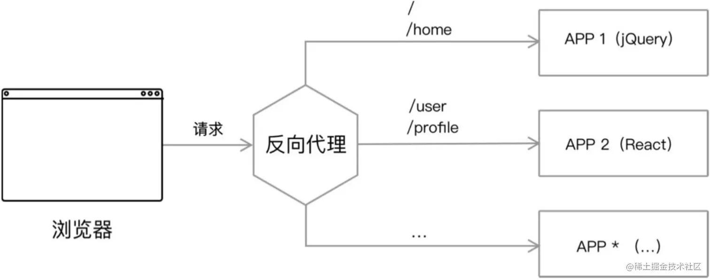
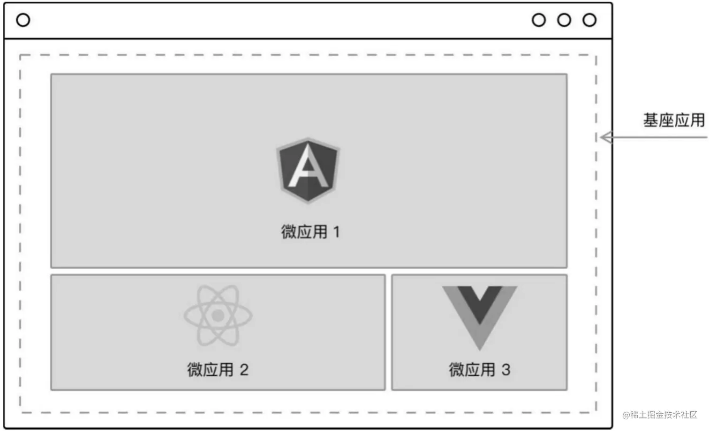
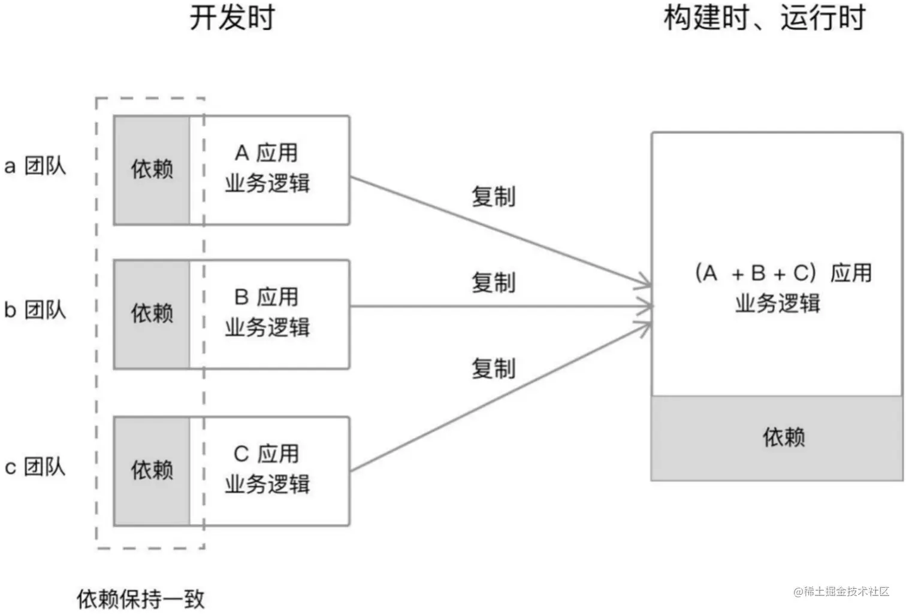
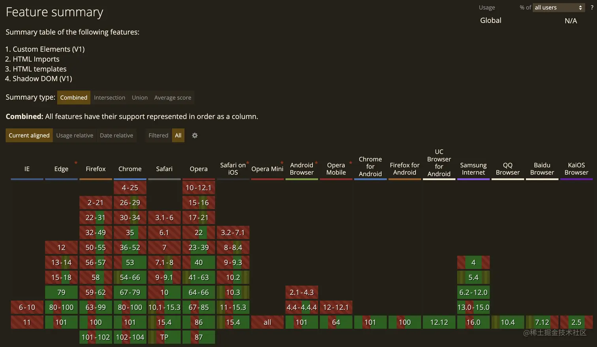
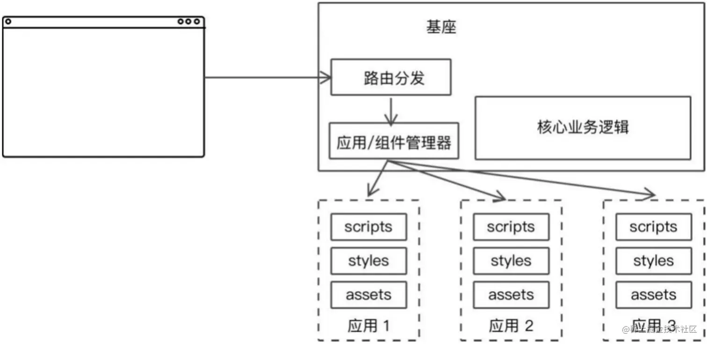

# 微前端架构设计

## 一、微前端方案

目前主流的微前端有如下六种实现方式：

1.路由分发式。通过 HTTP 服务器的反向代理功能，将请求路由到对应的应用上。



2. 前端微服务化。在不同的框架之上设计通信和加载机制，以在一个页面内加载对应的应用，这是目前社区主流微前端框架采用最多的方式。



3. 微应用，通过软件工程的方式，在部署构建环境中，把多个独立的应用组合成一个单体应用，即开发时独立，构建时集成。



4.微件化。开发一个新的构建系统，将部分业务功能构建成一个独立的 Chunk 代码，使用时只需要远程加载即可。

5.前端容器化。将 iframe 作为容器来容纳其他前端应用，这是最快速最简单的方式，天然隔离各子应用执行环境，但是最大的缺点就是加载应用时有明显的加载延迟，用户体验很差。

6.应用组件化。借助于 Web Components 技术，来构建跨框架的前端应用，该方案最大的问题是浏览器对 Web Component 支持程度不高。



目前比较主流的微前端方式是**前端微服务化**，所以这部分内容讲的是实现前端微服务化方案的方式方法。

### JavaScript 沙盒环境隔离

#### 闭包隔离

隔离核心需要解决的问题一句话描述：**不同子应用对全局资源的访问需要控制。**
对应在浏览器的语境下，意味着两点：

1. 需要隔离对全局上下文产生的副作用。
2. 特别地，要隔离 DOM / BOM 对象。 在 JavaScript 中，讲到隔离，很容易就能联想到闭包，没错，在微前端中，子应用环境隔离最常用的方式就是使用闭包，在创建沙箱时把全局变量的副本通过参数传到闭包即可。

```javascript
(function (exports, require, module, __filename, __dirname) {
	// 实际的 Module 代码
});
```

但是在实际创建子应用沙箱的时候，创建全局对象的成本过高，所以通常不直接创建主应用的副本传递给子应用，而是创建一个 iframe ，因为 iframe 天然就是一个独立的环境，完全和主应用隔离,并且能在主应用中引用。

```js
// 子应用被包上 wrapper
__GLOBAL_HOOK(id, function (exports, require, module, { window }) {
	// 实际的子应用代码
});

// wrapper 的实现
const frame = document.createElement("iframe"); // 创建一个新的子应用沙箱
const _window = frame.contentWindow; // 新建子应用的 window 环境

function __GLOBAL_HOOK(id, entry) {
	entry(exports, require, module, {
		window: _window,
	});
}
```

拿到隔离后的 DOM / BOM 对象之后，我们可以使用 proxy 去插入一些额外的逻辑，比如把子应用某些方法直接委托给主应用，或者禁用子应用的某些方法。

```js
class History {
	constructor(_history) {
		return new Proxy(_history, {
			get(target, name) {
				switch (name) {
					case "pushState":
						// 在这里魔改掉
						break;
				}
			},
		});
	}
}
```

#### diff 方法隔离

当我们的子页面加载到父类的基座中的时候，我们可以生成一个 map 的散列表。在页面渲染之前，我们先把当前的 window 上的变量等都存储在这个 map 中。当页面卸载的时候，我们在遍历这个 map，将其数据在替换回去。

```javascript
class Sandbox {
	constructor() {
		this.cacheMy = {}; // 存放修改的属性
		this.cacheBeforeWindow = {};
	}
	showPage() {
		this.cacheBeforeWindow = {};
		for (const item in window) {
			this.cacheBeforeWindow[item] = window[item];
		}

		Object.keys(this.cacheMy).forEach((p) => {
			window[p] = this.cacheMy[p];
		});
	}

	hidePage() {
		for (const item in window) {
			if (this.cacheBeforeWindow[item] !== window[item]) {
				// 记录变更
				this.cacheMy[item] = window[item];
				// 还原window
				window[item] = this.cacheBeforeWindow[item];
			}
		}
	}
}

const diffSandbox = new Sandbox();
// 模拟页面激活
diffSandbox.showPage(); // 激活沙箱
window.info = "我是子应用";
console.log("页面激活，子应用对应的值", window.info);
// 模拟页面卸载
diffSandbox.hidePage();
// 模拟页面激活
console.log("页面卸载后，子应用的对应的值", window.info);
diffSandbox.showPage(); // 重新激活
console.log("页面激活，子应用对应的值", window.info);
```

#### 使用 es6 的新特性：`proxy`代理

这里需要用到 es6 的新特性：`proxy`，[Proxy - JavaScript | MDN (mozilla.org)](https://developer.mozilla.org/zh-CN/docs/Web/JavaScript/Reference/Global_Objects/Proxy)。原理是监听 get 和 set 方法，针对当前路由进行 window 的属性或方法的存取

```javascript
const windowMap = new Map();
const resertWindow = {};

let routerUrl = "";
const handler = {
	get: function (obj, prop) {
		const tempWindow = windowMap.get(routerUrl);
		console.log(windowMap, routerUrl);
		return tempWindow[prop];
	},
	set: function (obj, prop, value) {
		if (!windowMap.has(routerUrl)) {
			windowMap.set(routerUrl, JSON.parse(JSON.stringify(resertWindow)));
		}
		const tempWindow = windowMap.get(routerUrl);
		tempWindow[prop] = value;
		// console.log(obj, prop, value);
	},
};

let proxyWindow = new Proxy(resertWindow, handler);
// 首先是父类的a属性.
proxyWindow.a = "我是父类的a属性的值";

// 改变路由到子类
routerUrl = "routeA";
proxyWindow.a = "我是routerA的a属性的值";

// 改变路由到父类
routerUrl = "";
console.log(proxyWindow.a);

// 改变路由到子类
routerUrl = "routeA";
console.log(proxyWindow.a);
```

#### iframe 自带 css 和 js 沙盒隔离

### 路由

#### 1.主应用不处理路由，完全由子应用来接管。

> 主应用就只作为容器，触发加载和渲染子应用。

主应用对子应用的加载定义，可以写死在一个配置 map 中，并且通过手动绑定外部事件（如点击 tab）触发。 而子应用自己的路由逻辑该干嘛还是干嘛，URL 的变化直接反馈到当前地址栏中。
主子的关系：**单向传递参数（参数写死），后续子应用的状态变化按照原逻辑运行。**

此方案存在以下 2 个问题：

1. 不同的子应用如果存在相同的路由，就会冲突。
2. 由于主应用没处理路由，带着路由进页面的时候不会产生效果（而是进入初始状态）。

#### 2.子应用和主应用共享路由

> 主应用根据路由调度子应用，子应用内部的状态变化根据特定规则反映到主应用的路由。

第一个方案存在路由冲突的问题，解决方案很简单，只需使用命名空间去区分子应用即可，如下
方案 1: 由于子应用 1 与子应用 2 首页路由一样，就会存在冲突

```html
<Route path={`/home`} component={Home} /> // 子应用1首页路由 <Route
path={`/home`} component={Home} /> // 子应用2首页路由
```

使用命名空间优化:

```html
const APP1_NAME = 'app1'; const APP2_NAME = 'app2'; <Route
path={`${APP1_NAME`}/home`} component={Home} /> // 子应用1首页路由 <Route
path={`${APP2_NAME}/home`} component={Home} /> // 子应用2首页路由
```

这样就解决了路由冲突，但是这就相当于需要约束子应用的路由规则，对子应用有入侵。
此方案的主子关系：**单向传递参数，参数从 URL 中来，主应用控制大粒度的路由，后续子应用的状态变化稍加改造运行。**

#### 3.子应用维护隔离的路由

> 主应用根据路由调度子应用，子应用内部的状态变化反映到各自的沙箱中，互不干扰，但不会反映到主应用的路由中。

在上一节已经讲过，在子应用中使用的是独立的沙箱环境，可以想到，在使用了沙箱后，子应用所有的引用以及操作，都是基于创建的 iframe 环境的，比如 `location / history / document` 等实际都是使用 iframe 的对象。
点击子应用中的链接，被框架拦截默认的链接跳转行为，改为 `pushState`，由于子应用使用的是沙箱的 `history`，所以最终实际上是改变了 iframe 的 URL。
那此时点击会不会触发主应用侧的 popstate 呢？答案是不会，因为子应用 DOM 中的点击事件最终会冒泡到沙箱的 `document`，和主应用并无关联。
这样就**解决了主应用路由冲突的问题，同时又不侵入子应用路由制定，子应用路由可以随心所欲的制定了。**
此方案好像已经完美了？其实并不是，还存在一个问题：由于子应用路由是在沙箱中进行的，主应用完全感受不到，所以就体现不出子应用的路由状态（浏览器地址栏不会随子应用路由变化而改变）。

#### 4.子应用路由同步回主应用

> 主应用根据路由调度子应用，子应用内部的状态变化反映到各自的沙箱中，互不干扰，并且最终会反映到主应用的路由中。

主应用要感知到子应用路由变化并且反应到地址栏，需要 3 步：

1. 主应用监听子应用消息
2. 子应用路由变化之后，发送新路由相关信息给主应用
3. 主应用拿到消息，做出相应变化，如更新到地址栏
   思考一下，子应用每次路由变化都要主动发消息给主应用，这样不是很繁琐吗？是的，不过还记得在上一节创建子应用环境时我们对子应用的某些对象创建了 proxy 吗？这里的 proxy 就是可以来做这些 hook 逻辑的。

```js
switch (name) {
	case "pushState":
		return (...args) => {
			const returnValue = _pushState.call(_history, ...args);
			// 插入消息通信逻辑
			frame.postMessage(
				{
					type: "statechange",
					data: {
						location: frame.location,
						state: _history.state,
					},
				},
				"*"
			);
			return returnValue;
		};
}
```

主应用侧监听子应用消息，然后拼出路由后 `replaceState`，从而更新浏览器地址栏。

```js
frame.contentWindow.addEventListener("message", (e) => {
	const payload = e.data;
	switch (payload.type) {
		case "statechange":
			const { state, title, location } = payload.data;
			const url = location.href;
			window.history.replaceState(state, title, url);
			break;
	}
});
```

### 实践：子应用加载

子应用加载有两种方式：

1. JS Entry，子应用将资源打成一个 `entry script`，比如 `single-spa` 的 [example](https://link.segmentfault.com/?enc=V4vNM3PeC4viRHYRWP0bOQ==.q376bO8a%2BVDc%2B%2B3aXYvI4g3QjX4S%2BbJcQFFrrysYe4540Kwf2XS2eZSa5aH5Ixb/2kQXkLg5Ae2ceUjfO7X5gPPw8b1cKWFGmGp1zmuIbT%2Bzm68EV3zfcWxTjXxdENJipfI1Hsaue4rOp4UosAkjJeJsPB0o2K9lsY00Gj0uWdX/%2BnGueUR9hUKj5%2BqECSo2tn7LMGuA%2BH1u1tTBEVcv2Q==) 中的方式。但这个方案的限制也颇多，如要求子应用的所有资源打包到一个 `js bundle` 里，包括 `css`、图片等资源。除了打出来的包可能体积庞大之外的问题之外，资源的并行加载等特性也无法利用上。
2. HTML Entry，更加灵活，直接将子应用打出来 `HTML` 作为入口，主框架可以通过 `fetch html` 的方式获取子应用的静态资源，同时将 `HTML document` 作为子节点塞到主框架的容器中。这样不仅可以极大的减少主应用的接入成本，子应用的开发方式及打包方式基本上也不需要调整，而且可以天然的解决子应用之间样式隔离的问题。 HTML Entry 子应用注册代码一般如下：

```js
framework.registerApp("subApp1", { entry: "//www.a.com/index.html" });
```

这里 HTML 本质上还是充当了静态资源表的角色，所以在追求性能极致的情况下，可以改为静态的 JSON 配置，从而去掉请求 HTML 以及解析 HTML 里静态资源列表的时间。

| 方案       | 优点                                                         | 缺点                                                       |
| ---------- | ------------------------------------------------------------ | ---------------------------------------------------------- |
| HTML Entry | 解耦更彻底，子应用不依赖主应用 DOM，子应用独立开发，独立部署 | 多了一次 HTML 请求，解析有性能损耗，无法做构建时优化       |
| JS Entry   | 便于作构建时优化                                             | 依赖主应用提供挂载节点，打包产物体积膨胀，资源无法并行加载 |

### CSS 样式隔离

在微前端架构中，由于存在同时运行多个子应用的场景，样式隔离就是必不可少的工作。

#### 1.Shadow DOM

如果不考虑浏览器兼容性，`Shadow DOM`肯定是优先想到的方案，因为这是浏览器原生支持的 CSS 隔离

```js
const shadow = document
	.querySelector("#hostElement")
	.attachShadow({ mode: "open" });
shadow.innerHTML =
	'<sub-app>sub app1</sub-app><link rel="stylesheet" href="//www.a.com/index.css">';
```

此方案存在一个致命问题，**子应用的样式作用域仅在`shadow` 元素下，那么一旦子应用中出现运行时越界跑到外面构建 `DOM` 的场景，必定会导致构建出来的 `DOM` 无法应用子应用的样式的情况**。
比如一些通用弹窗，一般都是挂在 `document.body` 下面的，不在 `Shadow DOM` 里面，导致无法应用到`Shadow DOM`里的样式。

#### 2.自定义 css 属性前缀

**通过约定 `css` 前缀的方式来避免样式冲突，即各个子应用使用特定的前缀来命名 `class`，或者直接基于 `css module` 方案写样式**。

这种方案对于新系统是可以的，但是微前端很多场景都是需要去接入已经存在的旧系统，显然这种方式需要对旧系统进行大量改造。

其实解决方案很简单，子应用的所有元素都插入到`id="root"`标签中，`id`是唯一的，所以通过添加属性选择器前缀`#root`可以让`css`样式在指定的`<div id="root"></div>`内生效。

在开发子模块之前，需要确定一个全局唯一的 css 前缀，然后在书写的过程中同一添加此前缀，或在根 root 上添加此前缀，使用 less 或 sass 作用域嵌套即可。例如：

```html
<div class="rootA">
	<span class="rootA-span"></span>
</div>
<style>
	.root {
		.rootA-span {
			// 子路由A的css
		}
	}
</style>
```

思考一下，如何实现动态 `css`，保证运行某个子应用时只有该应用的 `css`生效，而加载此应用之前的其他子应用样式自动卸载，避免互相影响？

其实如果使用 `HTML Entry`的方式，是天然支持 `css`自动卸载的

```html
<html>
	<body>
		<main id="subApp1">
			// 子应用完整的 html 结构
			<link rel="stylesheet" href="//www.a.com/subapp1.css" />
			<div id="root">....</div>
		</main>
	</body>
</html>
```

当卸载子应用 app1 时，app1 的 container 节点会被卸载，从而删除了里面的 `<link rel="stylesheet" href="www.a.com/subapp1.css">`节点，也就自动卸载了该应用的样式，从而避免影响到后续加载的其他子应用。

#### 3.css 属性的 key 值+hash

类似于 vue 的 scoped。在打包的时候，对 css 选择器加上响应的属性，属性的 key 值是一些不重复的 hash 值，然后在选择的时候，使用属性选择器进行选择。

### 实践：父子应用通信

#### 1.发布订阅

在全局挂一个**事件总线**，应用之间不直接交互，而是统一去事件总线上注册事件，监听事件，通过发布订阅模型来做应用间的通信。

这是最方便的方式，不用引入任何第三方库，直接使用 window 的 `CustomEvent` 来监听一个自定义事件，然后在任意地方派发一个自定义事件，就可以天然的通过自定义事件来做到应用间互相通信。

#### 2.基于 props

这个方式就跟`React`和`Vue`父组件传递数据给子组件一样，把 `state`,`onStateChange`, `setState`都传递给子应用，这样就实现了子应用与主应用通信。

特别的，为了保证数据流清晰，子应用间一般不直接通信，而是都基于`props`来变相通信，保证自顶向下的单一数据流。

### 静态资源处理

使用 `globalAssets` 共享资源：

```js
// index.js
import microApp from '@micro-zoe/micro-app'

microApp.start({
  globalAssets: {
    js: ['js地址1', 'js地址2', ...], // js地址
    css: ['css地址1', 'css地址2', ...], // css地址
  }
})
```

或者使用 `global` 属性：

```html
<link rel="stylesheet" href="xx.css" global />
<script src="xx.js" global></script>
```

以及对资源的过滤：

```html
<link rel="stylesheet" href="xx.css" exclude />
<script src="xx.js" exclude></script>
<style exclude></style>
```

### 渲染微前端模式

- **默认模式**：每次都按顺序执行一次 JS，具有幂等性
- **umd 模式**：只在初次渲染时执行所有 JS，对于需要频繁切换微应用的项目可以提高其性能

### 插件系统

> 插件系统的主要作用就是对 js 进行修改，每一个 js 文件都会经过插件系统，我们可以对这些 js 进行拦截和处理，它通常用于修复 js 中的错误或向子应用注入一些全局变量。

这个插件系统主要可以在中间层处理一下 JS，避免一些由于固定模板而无法处理的 JS 报错。总的来说，这个系统还是个新生儿，需要后续其它开发者一起共建。

## 二、微前端架构设计

目前主流的微前端框架都采用 `Master-Slaves` 的架构，即主从架构。
主应用提供子应用加载器，通过不同的路由加载不同的子应用。
在业务功能上，主应用可以提供一些基础的能力，避免各子应用重复开发，比如：

1. 用户的登录、注册管理。
2. 系统的统一鉴权管理。
3. 导航菜单管理。
4. 路由管理。
5. 数据管理。
6. 通信代理。 

### 原理学习文章

[Qiankun 原理与实践指南 - 写代码的海怪的专栏 - 掘金 (juejin.cn)](https://juejin.cn/column/7140116822098968606)

[一文带你进入微前端世界 - 掘金 (juejin.cn)](https://juejin.cn/post/7104253657251577886)

## 三、手写实现简易微前端框架

文章：[带你手写微前端框架 · Issue #4 · YataoZhang/my-single-spa (github.com)](https://github.com/Yataozhang/my-single-spa/issues/4)

[带你手写微前端框架]文章代码开源地址：[YataoZhang/my-single-spa: 微前端框架简易实现，方便不了解微前端实现原理的同学快速掌握其原理 (github.com)](https://github.com/YataoZhang/my-single-spa)

微前端 2：[FrankFang/micro-frontend-starter (github.com)](https://github.com/FrankFang/micro-frontend-starter)
