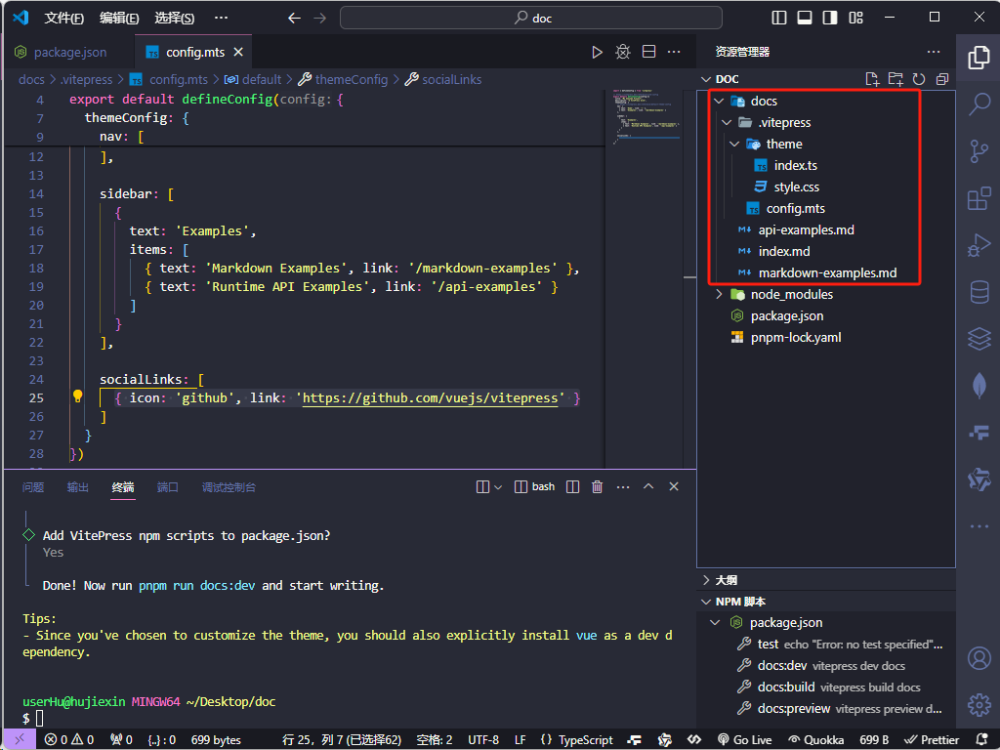
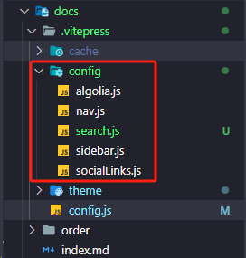
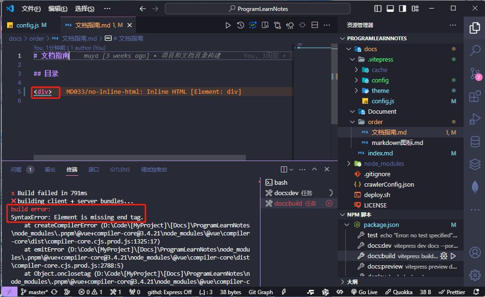
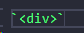
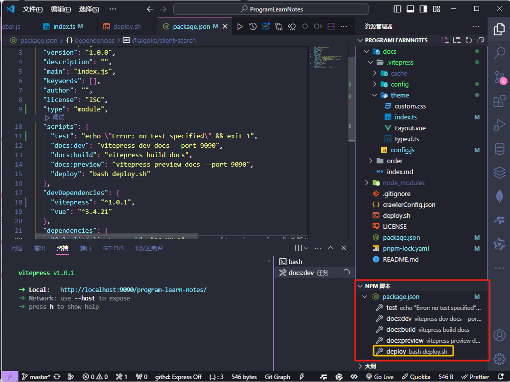
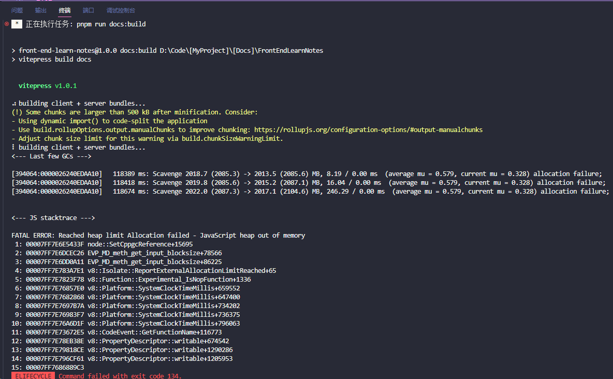
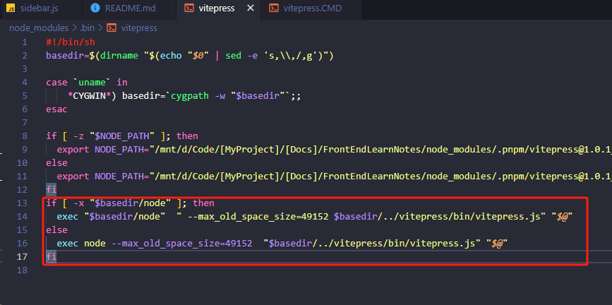
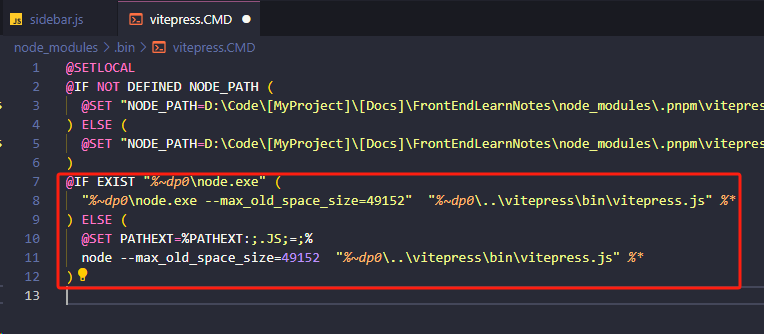

# 使用 vitepress 搭建博客文档和踩坑

VitePress1.0 正式版终于发布啦！[Announcing VitePress 1.0 | The Vue Point (vuejs.org)](https://blog.vuejs.org/posts/vitepress-1.0)

一年多来，从测试版开始，就用 VitePress 来写博客文档，写了最大的一个文档打包后有 500 多 MB 大小，下面是我使用 VitePress 写博客和部署的一些经验和总结，文后附上示例博客文档，可以直接克隆下来写并部署自己的静态文档博客。

## VitePress 相关网址

开源地址：https://github.com/vuejs/vitepress

官网文档：https://vitepress.dev/zh/

## VitePress 是什么？

VitePress 是一个[静态站点生成器](https://en.wikipedia.org/wiki/Static_site_generator) (SSG)，专为构建快速、以内容为中心的站点而设计。简而言之，VitePress 获取用 Markdown 编写的内容，对其应用主题，并生成可以轻松部署到任何地方的静态 HTML 页面。

**下面是我使用 VitePress 写博客文档和部署的一些经验和总结**

## VitePress 安装和使用

安装文档：[快速开始 | VitePress](https://vitepress.dev/zh/guide/getting-started)

### 1.新建一个项目目录

#### 1.1 新建一个博客文档的项目目录：如 mydoc

### 2. VSCode 打开该目录，然后运行终端

#### 1.2.1 初始化项目

```bash
npm init
```

#### 1.2.2 安装 vitepress

```bash
pnpm add -D vitepress
```

#### 1.2.3 初始化 vitepress 项目向导

```bash
pnpm vitepress init
```

将需要回答几个简单的问题：以下是按照官网文档选择

```bash
┌  Welcome to VitePress!
│
◇  Where should VitePress initialize the config?（vitepress主要文件夹）
│  ./docs
│
◇  Site title:（站点标签的标题）
│  My Awesome Project
│
◇  Site description:（站点主页的描述）
│  A VitePress Site
│
◆  Theme:（可选的主题。这里我选第二个：默认的主题+可定制的）
│  ○ Default Theme (Out of the box, good-looking docs)
│  ● Default Theme + Customization
│  ○ Custom Theme
```

#### 1.2.4 文件夹创建完成，目录如下

```bash
.
├─ docs
│  ├─ .vitepress
   	  ├─ theme # 自定义主题目录
   	  	 ├─ index.ts
   	  	 └─ style.css
│  │  └─ config.mts # 文档首页的概览、导航栏、侧边栏、链接、文字等等主题配置
│  ├─ api-examples.md # 默认的API示例使用文档
│  ├─ markdown-examples.md # 默认的markdown示例文档
│  └─ index.md  # 文档的首页
└─ package.json
```



api-examples.md 和 markdown-examples.md 这两个示例文档可以删掉，并在 config.mts 的 sidebar 删掉相关链接。

下面开始项目目录的配置准备：

## 首页配置

参考文档：[默认主题—主页](https://vitepress.dev/zh/reference/default-theme-home-page#home-page)

`docs`目录下的`index.md`便是博客文档的首页


index.md 文档如下：

```bash
---
# 文档：https://vitepress.dev/zh/reference/default-theme-home-page#home-page

layout: home

title: 鹤屿编程学习笔记
titleTemplate: 记录自己的编程学习笔记

hero:
  name: 鹤屿编程学习笔记
  # text: 记录自己的编程学习笔记
  tagline: "正在开发中"
  # 首页右边Logo设置
  # image:
  #   src: /logo.png
  #   alt: logo
  actions:
    - theme: brand
      text: 查看编程学习笔记
      link: /order/文档指南

features:
  - icon: 💡
    title: 文档基于vitePress构建
    details: 记录自己的编程学习笔记
  - icon: 📦
    title: 服务端语言
    details: Java、PHP、Python、Go
  - icon: 🤖
    title: 底层编程语言
    details: C/C++、Rust...
---

<!-- 表情：https://github.com/markdown-it/markdown-it-emoji/blob/master/lib/data/full.json -->

<style>
  /*首页标题 覆盖变量 自定义字体渐变样式*/
  :root {
    --vp-home-hero-name-color: transparent;
    --vp-home-hero-name-background: -webkit-linear-gradient(120deg, #bd34fe, #41d1ff);
  }
</style>

<!-- 团队成员显示 -->
<!-- <script setup>
import {
  VPTeamPage,
  VPTeamPageTitle,
  VPTeamMembers
} from 'vitepress/theme'

const members = [
  {
    avatar: 'https://www.github.com/yyx990803.png',
    name: 'Evan You',
    title: 'Creator',
    links: [
      { icon: 'github', link: 'https://github.com/yyx990803' },
      { icon: 'twitter', link: 'https://twitter.com/youyuxi' }
    ]
  },
]
</script>

<VPTeamPage>
  <VPTeamPageTitle>
    <template #title>
      我们的团队
    </template>
    <template #lead>
      各个成员来着....
    </template>
  </VPTeamPageTitle>
  <VPTeamMembers :members="members" />
</VPTeamPage> -->
```

## 站点和主题配置

配置文档：[默认主题配置 | VitePress](https://vitepress.dev/zh/reference/default-theme-config)

### 1.为了方便，我们不使用 ts，把 config.mts 改成 config.js

改了 config 文件的后缀成.js 后，以下 config.js 文件的内容：defineConfig()可去可不去，去掉的话如下：

```js
// 去掉defineConfig()和defineConfig的导入，改成
export default {};
```

### 2.config 的站点配置

文档：[站点配置 | VitePress](https://vitepress.dev/zh/reference/site-config)

#### config.js 配置

```js
export default {
	lang: "zh", // 中文，英文设置en-US
	title: "鹤屿编程学习笔记", // 浏览器标签标题
	description:
		"软件开发计：开发文档和开发计划，完成功能工具，和待开发的功能和工具",
	base: "/program-learn-notes", // url默认前缀
	appearance: true, // 暗黑模式
	ignoreDeadLinks: true, // 不会因死链接而使构建失败
	lastUpdated: true, // 使用 git 提交获取时间戳，使默认主题能够显示页面的上次更新时间
	// markdown主题
	markdown: {
		// 主题选择：https://github.com/shikijs/shiki/blob/main/docs/themes.md#all-themes
		// 主题预览：https://vscodethemes.com/
		// 添加自定义的主题(加载主题)：https://github.com/shikijs/shiki/blob/main/docs/themes.md#loading-theme
		theme: "one-dark-pro",
		lineNumbers: true, // 显示代码行数
	},
	// outDir: "../dist", // 打包输出的目录
	// titleTemplate: '牧涯前端学习笔记', // 标题后缀
	cleanUrls: true, // url是否带.html后缀
	// 浏览器标签图标设置
	head: [
		[
			"link",
			{
				rel: "icon",
				href: "https://avatars.githubusercontent.com/u/48587992?v=4",
			},
		],
		// ['link', { rel: 'icon', type: 'image/svg+xml', href: '/logo.svg' }],
	],
};
```

### 3.主题配置

主题配置文档：[默认主题配置 | VitePress](https://vitepress.dev/zh/reference/default-theme-config)

#### config.js 配置

```js
export default {
	// ***** 主题设置 *****
	// 文档：https://vitepress.vuejs.org/config/theme-configs
	themeConfig: {
		logo: "/img/buding.svg",
		siteTitle: "鹤屿编程学习笔记", // 网站左上角标题
		outlineTitle: "⚡️文档内容大纲", // 大纲标题
		outline: "deep", // 大纲显示层级：number：只显示 | [number, number]：指定层级范围显示 | 'deep'：全部显示 | false：不显示

		// 使用浏览器内置索引进行模糊全文搜索
		search: {
			provider: "local",
			options: {
				locales: {
					root: {
						translations: {
							button: {
								buttonText: "搜索文档",
								buttonAriaLabel: "搜索文档",
							},
							modal: {
								noResultsText: "无法找到相关结果",
								displayDetails: "显示详细信息",
								resetButtonTitle: "清除查询条件",
								backButtonTitle: "返回搜索结果",
								footer: {
									selectText: "选择",
									selectKeyAriaLabel: "enter",
									navigateText: "切换",
									navigateUpKeyAriaLabel: "up arrow",
									navigateDownKeyAriaLabel: "down arrow",
									closeText: "关闭",
									closeKeyAriaLabel: "escape",
								},
							},
						},
					},
				},

				_render(src, env, md) {
					const html = md.render(src, env);
					if (env.frontmatter?.search === false) return "";
					// 从搜索中排除页面
					if (env.relativePath.startsWith("some/path")) return "";
					// 转换内容——添加锚点
					if (env.frontmatter?.title)
						return md.render(`# ${env.frontmatter.title}`) + html;
					return html;
				},
				// 搜索配置
				miniSearch: {
					/**
					 * @type {Pick<import('minisearch').Options, 'extractField' | 'tokenize' | 'processTerm'>}
					 */
					options: {
						/* ... */
					},
					/**
					 * @type {import('minisearch').SearchOptions}
					 * @default
					 * { fuzzy: 0.2, prefix: true, boost: { title: 4, text: 2, titles: 1 } }
					 */
					searchOptions: {
						/* ... */
					},
				},
			},
		},

		// 使用 algolia 搜索框
		// search: {
		//   provider: 'algolia',
		//   options: {
		//   appId: '1L6FRXPKEM',
		//   apiKey: '934b4c2e67a08d72d379c9af236c5859',
		//   indexName: 'program-learn-notes',
		//   placeholder: '请输入关键词',
		//   buttonText: '搜索',
		//   searchParameters: {
		//     faeFilters: ['tags:guide,api']
		//   }
		// },
		// },

		// 右上角导航
		nav: [{ text: "🌍我的个人网站", link: "" }],
		// 右上角导航中显示带有图标的社交帐户链接
		socialLinks: [
			// { icon: 'discord', link: 'https://github.com/' },
			// { icon: 'facebook', link: 'https://github.com/' },
			// { icon: 'instagram', link: 'https://github.com/' },
			// { icon: 'linkedin', link: 'https://github.com/' },
			// { icon: 'slack', link: 'https://github.com/' },
			// { icon: 'twitter', link: 'https://github.com/' },
			// { icon: 'youtube', link: 'https://github.com/' },
			// { icon: 'github', link: 'https://github.com/muyaCode/program-learn-notes' },
			{
				icon: {
					svg: `<svg t="1690871772610" class="icon" viewBox="0 0 1024 1024" version="1.1" xmlns="http://www.w3.org/2000/svg" p-id="987" width="256" height="256">
            <path d="M512 1024C229.222 1024 0 794.778 0 512S229.222 0 512 0s512 229.222 512 512-229.222 512-512 512z m259.149-568.883h-290.74a25.293 25.293 0 0 0-25.292 25.293l-0.026 63.206c0 13.952 11.315 25.293 25.267 25.293h177.024c13.978 0 25.293 11.315 25.293 25.267v12.646a75.853 75.853 0 0 1-75.853 75.853h-240.23a25.293 25.293 0 0 1-25.267-25.293V417.203a75.853 75.853 0 0 1 75.827-75.853h353.946a25.293 25.293 0 0 0 25.267-25.292l0.077-63.207a25.293 25.293 0 0 0-25.268-25.293H417.152a189.62 189.62 0 0 0-189.62 189.645V771.15c0 13.977 11.316 25.293 25.294 25.293h372.94a170.65 170.65 0 0 0 170.65-170.65V480.384a25.293 25.293 0 0 0-25.293-25.267z" fill="#C71D23" p-id="988"></path>
          </svg>`,
				},
				link: "https://gitee.com/muyaCode/program-learn-notes",
			},
			// {
			//   icon: {
			//     svg: `<svg t="1660806015529" class="icon" viewBox="0 0 1024 1024" version="1.1" xmlns="http://www.w3.org/2000/svg" p-id="1999" xmlns:xlink="http://www.w3.org/1999/xlink" width="200" height="200">
			//       <defs>
			//         <style type="text/css">
			//           @font-face { font-family: feedback-iconfont; src: url("//at.alicdn.com/t/font_1031158_u69w8yhxdu.woff2?t=1630033759944") format("woff2"), url("//at.alicdn.com/t/font_1031158_u69w8yhxdu.woff?t=1630033759944") format("woff"), url("//at.alicdn.com/t/font_1031158_u69w8yhxdu.ttf?t=1630033759944") format("truetype"); }
			//         </style>
			//       </defs>
			//       <path d="M514.6112 508.672m-445.4912 0a445.4912 445.4912 0 1 0 890.9824 0 445.4912 445.4912 0 1 0-890.9824 0Z" fill="#FFF3E6" p-id="2000"></path>
			//       <path d="M672.256 358.912c23.3984-13.9776 39.168-39.936 39.168-69.7344 0-44.5952-35.2768-80.7424-78.7456-80.7424-19.5072 0-37.2736 7.3216-51.0464 19.3024-13.6704-23.8592-38.912-39.8848-67.84-39.8848s-54.1696 16.0256-67.84 39.8848c-13.7728-12.032-31.5392-19.3024-51.0464-19.3024-43.52 0-78.7456 36.1472-78.7456 80.7424 0 29.7984 15.7696 55.7056 39.168 69.7344-80.4864 45.2096-133.8368 123.8016-133.8368 213.2992 0 140.2368 130.8672 253.9008 292.3008 253.9008s292.352-113.664 292.352-253.9008c-0.0512-89.4464-53.4016-168.0384-133.888-213.2992z m-73.984 208.0256c14.1312 0 25.6 11.776 25.6 26.2656s-11.4688 26.2656-25.6 26.2656h-60.928v62.464c0 14.4896-11.4688 26.2656-25.6 26.2656s-25.6-11.776-25.6-26.2656v-62.464h-60.928c-14.1312 0-25.6-11.776-25.6-26.2656s11.4688-26.2656 25.6-26.2656h60.928v-20.0192h-60.928c-14.1312 0-25.6-11.776-25.6-26.2656s11.4688-26.2656 25.6-26.2656h27.904c-17.2032-18.9952-32.256-35.5328-35.7888-39.2192a26.63424 26.63424 0 0 1-7.2704-27.9552c4.4544-13.7728 18.9952-21.1968 32.4096-16.5888 6.8608 2.3552 6.8608 2.3552 49.7664 49.7152 6.9632 7.68 13.9264 15.36 19.968 22.0672l61.3888-65.1264a25.12896 25.12896 0 0 1 36.1984-0.6144c10.1888 10.0864 10.4448 26.6752 0.6144 37.12l-38.2976 40.6016h26.1632c14.1312 0 25.6 11.776 25.6 26.2656s-11.4688 26.2656-25.6 26.2656h-60.928v20.0192h60.928z" fill="#FFA131" p-id="2001"></path><path d="M768.9728 448.3584c-23.3984-36.1984-56.6784-66.9696-96.7168-89.4464 23.3984-13.9776 39.168-39.936 39.168-69.7344 0-44.5952-35.2768-80.7424-78.7456-80.7424-19.5072 0-37.2736 7.3216-51.0464 19.3024-13.6704-23.8592-38.912-39.8848-67.84-39.8848s-54.1696 16.0256-67.84 39.8848c-13.7728-12.032-31.5392-19.3024-51.0464-19.3024-43.52 0-78.7456 36.1472-78.7456 80.7424 0 29.7984 15.7696 55.7056 39.168 69.7344-80.4864 45.2096-133.8368 123.8016-133.8368 213.2992 0 50.432 16.9984 97.3824 46.1824 136.9088 17.3056 6.2464 35.2256 11.3664 53.8112 15.104 199.7824 40.8064 394.9568-81.664 447.488-275.8656z m-170.7008 118.5792c14.1312 0 25.6 11.776 25.6 26.2656s-11.4688 26.2656-25.6 26.2656h-60.928v62.464c0 14.4896-11.4688 26.2656-25.6 26.2656s-25.6-11.776-25.6-26.2656v-62.464h-60.928c-14.1312 0-25.6-11.776-25.6-26.2656s11.4688-26.2656 25.6-26.2656h60.928v-20.0192h-60.928c-14.1312 0-25.6-11.776-25.6-26.2656s11.4688-26.2656 25.6-26.2656h27.904c-17.2032-18.9952-32.256-35.5328-35.7888-39.2192a26.63424 26.63424 0 0 1-7.2704-27.9552c4.4544-13.7728 18.9952-21.1968 32.4096-16.5888 6.8608 2.3552 6.8608 2.3552 49.7664 49.7152 6.9632 7.68 13.9264 15.36 19.968 22.0672l61.3888-65.1264a25.12896 25.12896 0 0 1 36.1984-0.6144c10.1888 10.0864 10.4448 26.6752 0.6144 37.12l-38.2976 40.6016h26.1632c14.1312 0 25.6 11.776 25.6 26.2656s-11.4688 26.2656-25.6 26.2656h-60.928v20.0192h60.928z" fill="#FFAD3A" p-id="2002"></path><path d="M672.256 358.912c1.792-1.0752 3.5328-2.2528 5.2224-3.4816 13.312-26.112 24.1664-53.8624 32.2048-83.0976-7.5264-36.5056-39.168-63.9488-77.0048-63.9488-19.5072 0-37.2736 7.3216-51.0464 19.3024-13.6704-23.8592-38.912-39.8848-67.84-39.8848s-54.1696 16.0256-67.84 39.8848c-13.7728-12.032-31.5392-19.3024-51.0464-19.3024-43.52 0-78.7456 36.1472-78.7456 80.7424 0 29.7984 15.7696 55.7056 39.168 69.7344-80.4864 45.2096-133.8368 123.8016-133.8368 213.2992 0 6.2464 0.3584 12.4928 0.8704 18.6368 62.3104 9.0624 123.8528 4.5568 181.2992-11.52 4.5056-7.424 12.4928-12.3904 21.6576-12.3904h15.9744c15.36-5.8368 30.3616-12.544 44.9536-20.0192v-0.0512h-60.928c-14.1312 0-25.6-11.776-25.6-26.2656s11.4688-26.2656 25.6-26.2656h27.904c-17.2032-18.9952-32.256-35.5328-35.7888-39.2192a26.63424 26.63424 0 0 1-7.2704-27.9552c4.4544-13.7728 18.9952-21.1968 32.4096-16.5888 6.8608 2.3552 6.8608 2.3552 49.7664 49.7152 6.9632 7.68 13.9264 15.36 19.968 22.0672l61.3888-65.1264a25.12896 25.12896 0 0 1 36.1984-0.6144c8.2944 8.192 9.8816 20.6848 4.9152 30.72 23.2448-26.1632 43.52-55.296 60.16-86.8864-0.9728-0.4096-1.8432-0.9728-2.7136-1.4848z" fill="#FFBB48" p-id="2003"></path><path d="M256.256 452.0448c145.7152-15.6672 275.2-104.3968 342.1696-235.52-6.0928 3.0208-11.7248 6.8096-16.7936 11.264-13.6704-23.8592-38.912-39.8848-67.84-39.8848s-54.1696 16.0256-67.84 39.8848c-13.7728-12.032-31.5392-19.3024-51.0464-19.3024-43.52 0-78.7456 36.1472-78.7456 80.7424 0 29.7984 15.7696 55.7056 39.168 69.7344-41.4208 23.1936-75.5712 55.296-99.072 93.0816z" fill="#FFC753" p-id="2004"></path>
			//     </svg>`
			//   },
			//   link: 'https://muyacode.github.io/program-learn-notes'
			// }
		],
		// *****左边侧栏导航*****
		sidebar: {
			"/": [
				{
					text: "🌟文档指南",
					collapsible: true, // 可折叠
					collapsed: true, // 初始不折叠
					items: [
						{ text: "文档指南", link: "/order/文档指南" },
						{ text: "markdown图标", link: "/order/markdown图标" },
					],
				},

				{
					text: "🌟Java",
					collapsible: true, // 可折叠
					collapsed: true, // 初始不折叠
					items: [
						{
							text: "",
							link: "/Document/Java/",
						},
					],
				},
				{
					text: "🌟Go",
					collapsible: true, // 可折叠
					collapsed: true, // 初始不折叠
					items: [
						{
							text: "",
							link: "/Document/Go/",
						},
					],
				},
				{
					text: "🌟Python",
					collapsible: true, // 可折叠
					collapsed: true, // 初始不折叠
					items: [
						{
							text: "",
							link: "/Document/Python/",
						},
					],
				},
				{
					text: "🌟PHP",
					collapsible: true, // 可折叠
					collapsed: true, // 初始不折叠
					items: [
						{
							text: "",
							link: "/Document/PHP/",
						},
					],
				},
				{
					text: "🌟C/C++",
					collapsible: true, // 可折叠
					collapsed: true, // 初始不折叠
					items: [
						{
							text: "",
							link: "/Document/C-C++/",
						},
					],
				},
				{
					text: "🌟Rust",
					collapsible: true, // 可折叠
					collapsed: true, // 初始不折叠
					items: [
						{
							text: "",
							link: "/Document/Rust/",
						},
					],
				},
			],
		},

		// 编辑
		editLink: {
			pattern:
				"https://gitee.com/muyaCode/program-learn-notes/edit/main/docs/:path",
			text: "在 Gitee上编辑此页",
		},
		// 自定义上次更新的文本和日期格式
		lastUpdated: {
			text: "上次更新：",
			formatOptions: {
				dateStyle: "full",
				timeStyle: "medium",
			},
		},
		docFooter: {
			prev: "上一篇",
			next: "下一篇",
		},

		// 右边文档大纲下面的-卡片广告
		// carbonAds: {
		//   code: '卡片广告 code',
		//   placement: '卡片广告布置'
		// },

		// 首页页脚配置。您可以添加消息和版权。仅当页面由于设计原因不包含边栏时，才会显示页脚。
		footer: {
			message: "Released under the MIT License.",
			copyright: "Copyright © 2024  heyu",
		},
	},
};
```

#### 为了方便维护，我们把主题的主要模块抽取出来

1.`docs/.vitepress`目录中新建`config` 文件夹，然后把以下模块：

- `search`（浏览器搜索配置）
- `algolia` （配置外部搜索）
- `nav`（顶部右上角自定义导航）
- `socialLinks`（顶部右上角导航中显示带有图标的社交帐户链接）
- `sidebar`（🌟 文章的侧边导航：写的 markdown 文档要配置 文章的标题和路径链接 🌟）

等抽取成模块：



然后 config.js 导入，使用如下：

```js
import search from "./config/search";
// import algolia from "./config/algolia";
import socialLinks from "./config/socialLinks";
import nav from "./config/nav";
import sidebar from "./config/sidebar";

// 配置文档：https://vitepress.vuejs.org/config/introduction
export default {
	// ***** 主题设置 *****
	// 文档：https://vitepress.vuejs.org/config/theme-configs
	themeConfig: {
		logo: "/img/buding.svg",
		siteTitle: "鹤屿编程学习笔记", // 网站左上角标题
		outlineTitle: "⚡️文档内容大纲", // 大纲标题
		outline: "deep", // 大纲显示层级：number：只显示 | [number, number]：指定层级范围显示 | 'deep'：全部显示 | false：不显示

		// 使用浏览器内置索引进行模糊全文搜索
		search,
		// 使用 algolia 搜索框
		// search: {
		//   provider: 'algolia',
		//   options: algolia,
		// },
		// 右上角导航
		nav,
		// 右上角导航中显示带有图标的社交帐户链接
		socialLinks,
		// *****左边侧栏导航*****
		sidebar,

		// 编辑
		editLink: {
			pattern:
				"https://gitee.com/muyaCode/program-learn-notes/edit/main/docs/:path",
			text: "在 Gitee上编辑此页",
		},
		// 自定义上次更新的文本和日期格式
		lastUpdated: {
			text: "上次更新：",
			formatOptions: {
				dateStyle: "full",
				timeStyle: "medium",
			},
		},
		docFooter: {
			prev: "上一篇",
			next: "下一篇",
		},

		// 右边文档大纲下面的-卡片广告
		// carbonAds: {
		//   code: '卡片广告 code',
		//   placement: '卡片广告布置'
		// },

		// 首页页脚配置。您可以添加消息和版权。仅当页面由于设计原因不包含边栏时，才会显示页脚。
		footer: {
			message: "Released under the MIT License.",
			copyright: "Copyright © 2024  heyu",
		},
	},
};
```

## 自定义主题

按照我们前面创建 docs 文件夹的时候的主题选项，docs/.vitepress 目录中会生成 theme 目录和文件。

详情参考文档定义：[自定义主题 | VitePress](https://vitepress.dev/zh/guide/custom-theme)

## 写 MarkDwom 文档

在原有的大众化的 MarkDwom 文档格式基础上，有了些改变，可以显示更多样式，参考文档：[Markdown 扩展 | VitePress](https://vitepress.dev/zh/guide/markdown)

## 写 MarkDwom 文档的坑

### 1.html 标签不要直接写

像这样：



运行报错：

```bash
build error:
SyntaxError: Element is missing end tag.
```

这个报错时没有显示哪个具体的文档报错的，如果你的文档一多，就比较比较难找。

所以养成习惯，代码块外的 html 的标签需要添加上` `，编程引用代码块的形式，如：`<div>`，这样，打包就不会报错了。



有解决方案了

打包报错，控制台输出报错的文档：https://vitepress.dev/zh/reference/site-config#transformpagedata

### 2.图片和文件夹命名最好不要写各种字符，容易报URL错误❌ 

且错误不会显示具体在哪里，只有一行排除

## 编译打包

终端运行

```bash
pnpm run docs:build
```

## 上传 Gitee 和 GitHub 部署博客

参考文档：https://vitepress.dev/zh/guide/deploy

### 1.上传 git 仓库，然后配置部署博客

#### 1.1.1 Gitee 仓库部署的前置

限制比较多

完成以下才能使用部署 gitpage

- 需要身份证实名 Gitee（审核需要大概一周吧）。
- 仓库必须开源
- 上传的仓库总体积不能超过 1024MB(1GB)
- 仓库种的单张图片不能大于 5MB，否则不能部署文档。
- 每一次上传之后，都需要重新部署 gitpage

Gitee 仓库可以同步到 GitHub

#### 1.1.2 Gitee 仓库部署

##### 推送分支和创建 `gh-pages`分支

1.Gitee 创建一个仓库，先把 marster 主分支上传到远程仓库，然后远程再创建一个`gh-pages`分支，此分支用于打包的项目目录的上传。

2.打包后的项目目录：`docs/.vitepress/dist` ，终端中进入该目录

```bash
cd docs/.vitepress/dist
```

3.然后，把该目录下的文件，推送到远程分支`gh-pages`，推送后的分支目录文件如下：


##### 部署 Gitee Pages 服务

仓库中点击：服务——Gitee Pages


选择分支，然后部署


部署成功后，会有提示部署好的网址，打开就能看到部署好的文档网站了。

**gitee 仓库每次提交 gh-pages 分支，都需要手动再在这里点击更新部署，而 github 仓库是自动更新。**

#### 3.gitee 关联 github 仓库，并同步

1.在仓库中点击管理

2.点击仓库镜像管理

3.点击添加镜像


看文档如何获取私人令牌，然后选择仓库——添加


添加完成后是这样子的


这样，每当上传到 gitee 仓库时，也会同步到 github 仓库。

github 的 pages 部署如下：

#### 1.2.1 GitHub

GitHub 部署静态文档网站，没有上面 Gitee 的这些限制，但是国内访问比较慢。

#### 1.2.2 GitHub 仓库部署

1.重复上面 Gitee 仓库的创建和提交上传分支的操作，创建和提交上传 marster 和 gh-pages 这两个分支。

2.点击仓库顶部第二栏：`Settings`——Pages——然后选择分支——save 部署


**github 仓库每次提交 gh-pages 分支，是自动更新部署的。**不像 gitee 仓库，需要手动更新

### 2.写了个脚本，能自动化打包和上传到 github 或 gitee 仓库

#### 项目根目录中新建：deploy.sh

```js
#!/usr/bin/env sh

# 确保脚本抛出遇到的错误
set -e

# 打包生成静态文件
pnpm run docs:build

# 进入生成的文件夹
cd docs/.vitepress/dist

# 如果是发布到自定义域名
# echo 'www.example.com' > CNAME

time=$(date "+%Y-%m-%d %H:%M:%S")

git init
git add -A
git commit -m "GitHub Action 自动部署：$time"

# # 如果发布到 https://<USERNAME>.github.io   -f 强制推送
# git push -f git@github.com:<USERNAME>/<USERNAME>.github.io.git master
git push -f git@gitee.com:muyaCode/program-learn-notes.git master:gh-pages # 发布到Gitee
# git push -f git@github.com:muyaCode/program-learn-notes.git master:gh-pages # 发布到GitHub

# 退出到本项目根目录
cd -
# 删除 打包成的dist文件目录
rm -rf docs/.vitepress/dist

# echo "仓库地址：https://github.com/muyaCode/program-learn-notes"
# echo "文档地址：https://muyacode.github.io/program-learn-notes/"

# 格式化输出带颜色配置：https://www.shuzhiduo.com/A/D854N3mVzE/
echo -e "Gitee仓库地址：\033[44;37m https://gitee.com/muyaCode/program-learn-notes/ \033[0m"
echo -e "GiteePages文档地址：\033[47;30m https://muyacode.gitee.io/program-learn-notes/ \033[0m"

# echo -e "GitHub仓库地址：\033[44;37m https://github.com/muyaCode/program-learn-notes/ \033[0m"
# echo -e "GitHubPages文档地址：\033[47;30m https://muyacode.github.io/program-learn-notes/ \033[0m"
```

#### package.json 添加执行该脚本的命令：

```js
"scripts": {
    "deploy": "bash deploy.sh"
},
```

#### 这样脚本命令就可以点击运行了



运行之后等待脚本运行完成，然后再去 github 或 gitee 仓库看看是否成功，gitee 仓库的话，需要手动更新部署，github 仓库自动更新。

### 3.文档过大打包编译时错误

vitepress 默认的打包设置内存比较小，如果你的文档很多，项目体积很大，打包则会报错：



vitepress 内存溢出(JS stacktrace)，是因为内存设置不足，这时候我们可以以下添加内存设置：

在 `node_modules/.bin/vitepress` 文件 和 `node_modules/.bin/vitepress.CMD` 文件修改增加运行内存：

**vitepress** 文件：`--max_old_space_size=49152`



```bash
if [ -x "$basedir/node" ]; then
  exec "$basedir/node"  " --max_old_space_size=49152 $basedir/../vitepress/bin/vitepress.js" "$@"
else
  exec node --max_old_space_size=49152  "$basedir/../vitepress/bin/vitepress.js" "$@"
fi
```

**vitepress.CMD** 文件：`--max_old_space_size=49152`



```bash
@IF EXIST "%~dp0\node.exe" (
  "%~dp0\node.exe --max_old_space_size=49152"  "%~dp0\..\vitepress\bin\vitepress.js" %*
) ELSE (
  @SET PATHEXT=%PATHEXT:;.JS;=;%
  node --max_old_space_size=49152  "%~dp0\..\vitepress\bin\vitepress.js" %*
)
```

这样打包就不会出错了。

## 以上项目的参考仓库

gitee：https://gitee.com/muyaCode/program-learn-notes

可以直接克隆下来编写在 Document 中创建目录文件、编写 markdown 文档，再在`docs\.vitepress\config\sidebar.js`中添加文章文档目录和链接，

再根据上面的部署教程，运行 `deploy.sh` 脚本部署自己的博客文档等静态网站。

# 让您的文档网站变得智能

[医生 |让您的文档网站变得智能 (documate.site)](https://documate.site/)

开源地址：https://github.com/aircodelabs/documate

一个开源工具，用于将 AI 聊天对话框嵌入到您的文档网站中，以根据您的内容回答用户问题。

# 给vitepress博客里增加一个RSS订阅

[给vitepress博客里增加一个RSS订阅 - 掘金 (juejin.cn)](https://juejin.cn/post/7245641209913753661)

## 交互式文档的 Markdown 扩展，可在 VitePress 中使用

官网：[genji-md.dev/](https://genji-md.dev/)

GitHub：https://github.com/pearmini/genji

