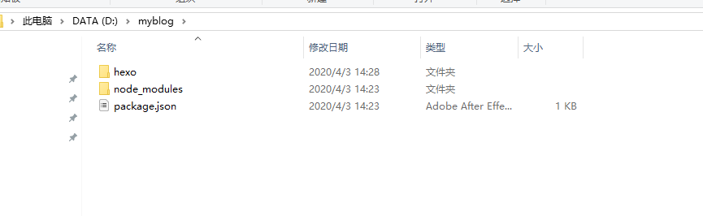
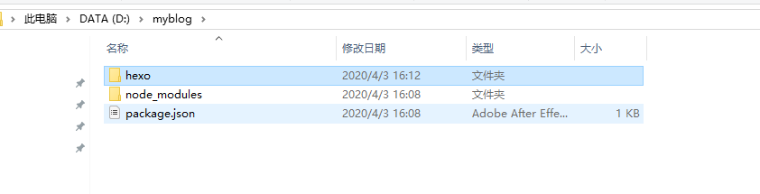
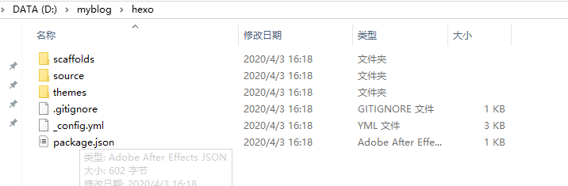
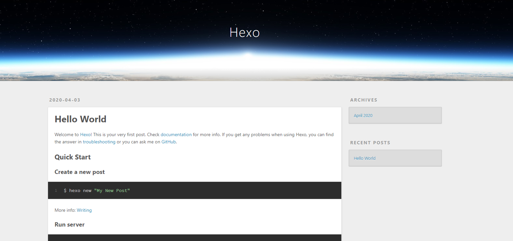
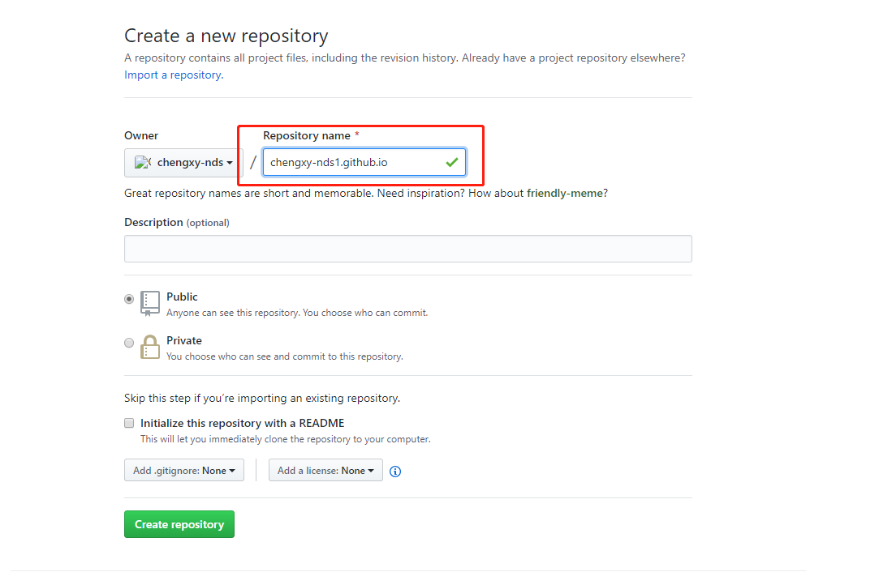
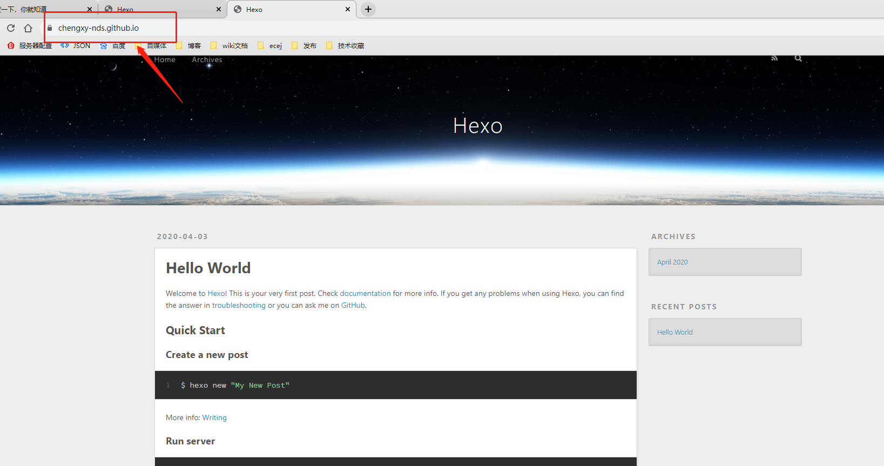
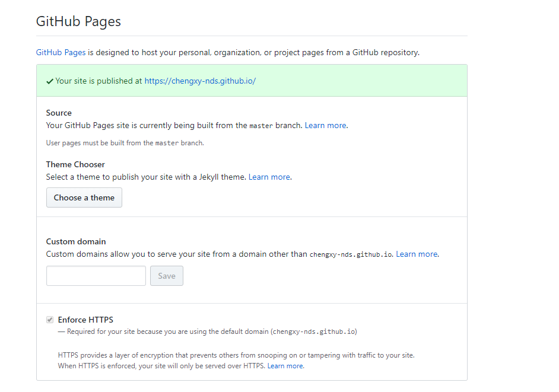
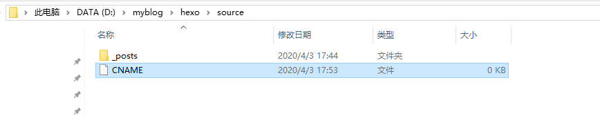
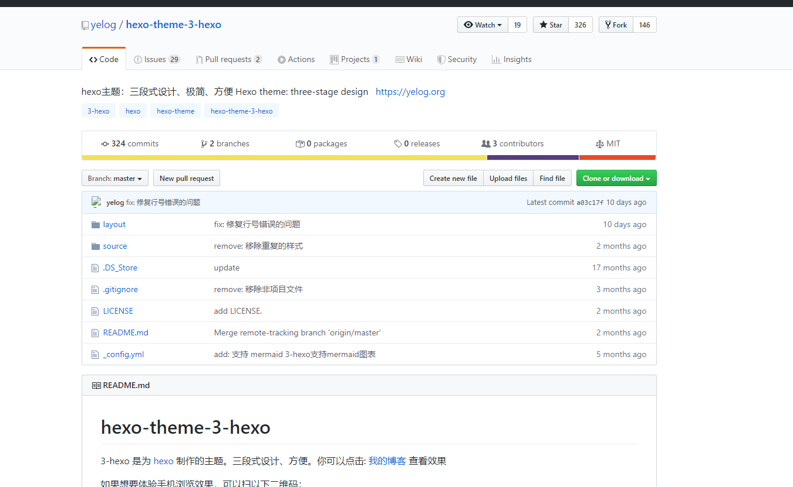
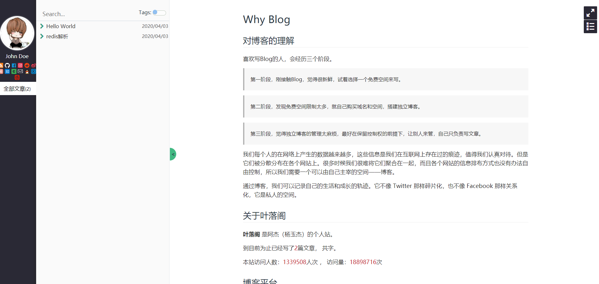

# hexo 框架的介绍和使用

官网：[Hexo](https://hexo.io/zh-cn/index.html)

GitHub：[hexojs/hexo](https://github.com/hexojs/hexo)

## hexo 的介绍

快速、简洁且高效的博客框架

Hexo是一款基于`Node.js`的静态博客（无需与后台交互，全由静态页面组成）框架，依赖少易于安装简单，更主要的是它免费，而且可以轻松的将生成的静态网页托管在`GitHub`，`码云`和`Coding`上，搭建博客首选框架之一。

## hexo 的简单安装和使用

### 安装

npm 包管理工具

```bash
npm install hexo-cli -g
```

下载的资源是国外的可能比较慢
淘宝镜像（代理的仓库）

```bash
npm install hexo -g --registry=https://registry.npm.taobao.org
```

### 使用

在一个空目录（hexo init）博客系统的初始化

`hexo\source\_posts md`文档就是博客文档

如果要写一篇博客

```bash
新建文件  xxx.md
```

把 md 文档转 html 文件

```bash
hexo g
```

在自己的服务器预览

```bash
执行命令：hexo s
打开链接：localhost:4000
```

如果从新生成 html 文件可能会有缓存

```bash
清除缓存命令：hexo clean
重新执行md转html命令：hexo g
```

和 github 关联 推代码到 github：hexo-deploy-git 插件

```bash
npm install hexo-deployer-git --save
```

和 github 关联需要配置文件：修改文件 `_config.yml` 在最下面添加

```bash
type: git
# 在github配置仓库 名称
repo: git@github.com:用户名/用户名.github.io.git
branch: master
```

把代码推到 github

```bash
hexo d
```

只能预览代码 无法预览页面 --> 配置当前仓库可以通过网络访问页面

在仓库的首页 settings ---> GitHub Pages --> 改选项 Source

```bash
none---master branch
```

通过 `用户名.github.io` 访问你的博客

## Hexo 本地搭建

**在你选定的磁盘里，建一个文件夹专门用来存 `myblog`博客相关的文件。** 文件夹内右键打开 `Git Bash Here`，在此窗口内执行以下所有命令。




### 1、安装 Hexo

用`npm`安装`hexo`，由于国内网络高“墙”深院，避免安装缓慢或失败，这里切换阿里的`NPM`镜像，没办法只能采用迂回战术了。

```bash
npm install -g cnpm --registry=https://registry.npm.taobao.org
```

用 `cnpm` 安装 `hexo`

```bash
cnpm install -g hexo-cli
```

安装可能有一些缓慢，当然这还是取决于你的带宽，这个过程中会出现的`WARN`提示不用理会。

```bash
cnpm install hexo --save
```

到这`hexo`就安装好了，检查一下`hexo -v`是否安装成功

```bash
$ hexo -v
hexo-cli: 3.1.0
os: Windows_NT 10.0.18362 win32 x64
node: 12.16.1
v8: 7.8.279.23-node.31
uv: 1.34.0
zlib: 1.2.11
brotli: 1.0.7
ares: 1.15.0
modules: 72
nghttp2: 1.40.0
napi: 5
llhttp: 2.0.4
http_parser: 2.9.3
openssl: 1.1.1d
cldr: 35.1
icu: 64.2
tz: 2019c
unicode: 12.1
```

### 2、初始化 Hexo

`Hexo`安装完以后需要进行初始化操作。

```bash
$ hexo init
```

**注意**：这时需要在`myblog`文件中，创建一个新的文件夹用来存放`hexo`博客文件。否则执行`hexo init`命令会报错。



进入`hexo文件`夹内右键打开 `Git Bash Here`，在此窗口内执行后边的所有命令。


```bash
$ hexo init
FATAL D:\myblog not empty, please run `hexo init` on an empty folder and then copy your files into it
FATAL Something's wrong. Maybe you can find the solution here: http://hexo.io/docs/troubleshooting.html
Error: target not empty
    at Context.initConsole (C:\Users\51536\AppData\Roaming\npm\node_modules\hexo-cli\lib\console\init.js:23:27)
```

初始化成功后，`hexo文件`夹内会出现如下的文件：

`node_modules`: 依赖包 `public`：存放生成的页面 `scaffolds`：生成文章的一些模板 `source`：用来存放你的文章 `themes`：放下下载的主题 `_config.yml:` 博客的核心配置文件（设置主体、标题等属性）



接着需要执行一下`cnpm install`命令，要不下边的启动会提示命令不合法。


```bash
cnpm install
```

最后用 `hexo s -g` 命令来启动安装好的 `hexo`。

```bash
$ hexo s -g
INFO  Start processing
INFO  Hexo is running at http://localhost:4000 . Press Ctrl+C to stop.
```

直接访问`http://localhost:4000`显示如下页面，本地博客搭建成功。




## Hexo 托管至 GitHub

### 1、创建GitHub仓库

这时候需要我们在`GitHub`上创建一个仓库，设置仓库的名字以`XXX.github.io`结尾




### 2、配置`_config.yml`文件

修改`_config.yml`文件，添加你创建的`GitHub`仓库地址

```bash
deploy:
  type: git
  repo: https://github.com/YourgithubName/YourgithubName.github.io.git
  branch: master
```

安装部署命令`deploy-git` ，这样你才能用命令部署到`GitHub`。

```bash
$ cnpm install hexo-deployer-git  --save
```

上边修改完毕以后，依次执行以下命令，提交本地`hexo`文件到`GitHub`。

```bash
hexo clean
hexo generate
hexo deploy
```

### 3、线上测试

访问刚创建的仓库：`https://chengxy-nds.github.io/`，文件推送至GitHub后页面显示会有一定的延迟，稍等几十秒再次刷新页面，看到下边这些页面就表示博客部署成功。




### 4、设置个人域名

现在我们的博客地址：`https://chengxy-nds.github.io/`，但是看着是不是觉得有点low，如果有钱自己可以买一个域名。在云平台随便买一个，看自己喜好，例如：chengxy.com。

将域名指向`GitHub`的服务器地址， `192.30.252.153` 和 `192.30.252.154` 。

进入存放博客的`GitHub`仓库，点击`settings`，设置`Custom domain`，输入域名`chengxy.com`




然后在本地博客文件`source`中创建一个名为`CNAME`文件，不要后缀。写上你的域名。



最后重新编译上传文件，访问：`chengxy.com`即可。

```bash
hexo clean
hexo generate
hexo deploy
```

## Hexo主题切换

虽然我们的博客搭建完成，但大家肯定也发现，现有的博客样式丑爆了，这时候就需要到官网挑一个自己喜欢的风格了。

### 1、下载主题

`hexo`主体官网：`https://hexo.io/themes/`，我们随便找一个主题替换演示一下，主题都托管在github上，直接clone就好。




### 2、配置`_config.yml`

可以看到`hexo` 只有一个默认的主题`theme`，现在进入`theme`文件夹执行`git`克隆命令，或者直接下载一个主题放入`theme`文件夹内都可以。

```bash
git clone https://github.com/yelog/hexo-theme-3-hexo.git
```

修改`_config.yml`文件中的`theme`属性

```bash
theme: hexo-theme-3-hexo
```

打包上传看看效果：

```bash
hexo clean
hexo generate
hexo deploy
```

### 3、测试

nice！主题已经替换成功，是比自带的好卡不少



## Hexo基本操作

博客搭建完，接下来就要开始写博客，管理博客了~

创建我们的第一篇博客，会在`source\_posts`目录下生成一个`程序员内点事的第一篇博客.md`文件

```bash
hexo n 程序员内点事的第一篇博客
```

##### hexo基本配置

`_config.yml`是`hexo`框架最核心的文件，博客的配置基本在这里。

```bash
#博客名称
title: 我的博客
#副标题
subtitle: 一天进步一点
#简介
description: 记录生活点滴
#博客作者
author: John Doe
#博客语言
language: zh-CN
#时区
timezone:

#博客地址,与申请的GitHub一致
url: http://elfwalk.github.io
root: /
#博客链接格式
permalink: :year/:month/:day/:title/
permalink_defaults:

source_dir: source
public_dir: public
tag_dir: tags
archive_dir: archives
category_dir: categories
code_dir: downloads/code
i18n_dir: :lang
skip_render:

new_post_name: :title.md # File name of new posts
default_layout: post
titlecase: false # Transform title into titlecase
external_link: true # Open external links in new tab
filename_case: 0
render_drafts: false
post_asset_folder: false
relative_link: false
future: true
highlight:
  enable: true
  line_number: true
  auto_detect: true
  tab_replace:

default_category: uncategorized
category_map:
tag_map:

#日期格式
date_format: YYYY-MM-DD
time_format: HH:mm:ss

#分页，每页文章数量
per_page: 10
pagination_dir: page

#博客主题
theme: landscape

#发布设置
deploy: 
  type: git
  #elfwalk改为你的github用户名
  repository: https://github.com/elfwalk/elfwalk.github.io.git
  branch: master
```

