# 部署博客

[【开源自荐】Markdown 批量导出工具、开放式跨平台博客解决方案，随意组合写作平台(语雀/Notion/FlowUs/飞书)和博客平台(Hexo/Vitepress/Confluence/WordPress等) · Issue #3644 · ruanyf/weekly (github.com)](https://github.com/ruanyf/weekly/issues/3644)

## 将 GitHub 存储库问题用作博客

[Gitblog （英语） |轻量级博客解决方案](https://gitblog.io/)

## github action + github pages / gitee action + gitee  pages


## 信息聚合页—Glance(Docker部署)

自托管仪表板，可以显示实时 RSS 订阅、Reddit 子版块帖子、天气、书签、特定频道的最新 YouTube 视频、日历、股票信息、iframe、twitch 频道和热门游戏、GitHub 发布和网站监控等。

### 相关地址

**GitHub**：https://github.com/glanceapp/glance


### 示例搭建

[Home - Glance (gugu.ovh)](https://glance.gugu.ovh/)

### 主要特色

- 支持各种主题
- 支持Docker部署，升级更新十分方便
- 支持X86和ARM平台部署
- 移动端适配非常好
- 支持各种小部件
  - RSS 源
  - Subreddit 帖子
  - 天气
  - 书签
  - Hacker News
  - Lobsters
  - 特定频道的最新 YouTube 视频
  - 时钟
  - 日历
  - 股票
  - iframe
  - Twitch 频道和热门游戏
  - GitHub 发布
  - 代码库概览
  - 网站监控
  - 搜索框
- 十分轻量
  - 极少的 JavaScript，无臃肿的框架
  - 极少的依赖
  - 单一且易于分发的 小于15MB 二进制文件以及同样小的 Docker 容器
  - 所有请求都是并行处理的，未缓存的页面通常在 ~1 秒内加载（取决于网速和小部件数量）

### 搭建视频

哔哩哔哩：https://www.bilibili.com/video/BV1Sb421J7N9

教程：[满满极客风！10分钟搭建专属你自己的信息聚合页——Glance ｜好玩儿的Docker项目｜我不是咕咕鸽-我不是咕咕鸽 (laoda.de)](https://blog.laoda.de/archives/docker-compose-install-glance)

### 配置

查看[配置文档](https://github.com/glanceapp/glance/blob/main/docs/configuration.md)以了解更多信息。还提供了一个[预配置的页面](https://github.com/glanceapp/glance/blob/main/docs/configuration.md#preconfigured-page)，以帮助您快速入门。

### 安装

谨慎

该项目正在积极开发中，预计每隔一段时间就会发生一些事情。

#### 手动


查看可用二进制文件[的发布页面](https://github.com/glanceapp/glance/releases)。您可以将二进制文件放入其中，并通过 [systemd 服务](https://linuxhandbook.com/create-systemd-services/)让它从您的服务器启动。要为配置文件指定其他路径，请使用以下选项：`/opt/glance/``--config`

```
/opt/glance/glance --config /etc/glance.yml
```


#### docker

重要

在运行容器之前，请确保同一目录中有一个有效的文件。`glance.yml`

```
docker run -d -p 8080:8080 \
  -v ./glance.yml:/app/glance.yml \
  -v /etc/timezone:/etc/timezone:ro \
  -v /etc/localtime:/etc/localtime:ro \
  glanceapp/glance
```

或者，如果您更喜欢 docker compose：

```
services:
  glance:
    image: glanceapp/glance
    volumes:
      - ./glance.yml:/app/glance.yml
      - /etc/timezone:/etc/timezone:ro
      - /etc/localtime:/etc/localtime:ro
    ports:
      - 8080:8080
    restart: unless-stopped
```

### 从源代码构建

要求： [Go](https://go.dev/dl/) >= v1.22

要构建：

```
go build -o build/glance .
```

要运行：

```
go run .
```


### 构建 Docker 镜像

构建映像：

**请务必将“所有者”替换为您的姓名或组织。**

```
docker build -t owner/glance:latest -f Dockerfile.single-platform .
```

将映像推送到注册表：

```
docker push owner/glance:latest
```

## Cloudflare 部署

[Microfeed/Microfeed：在 Cloudflare 上自托管的轻量级 CMS，用于播客、博客、照片、视频、文档和精选 URL。 (github.com)](https://github.com/microfeed/microfeed)

[OXeu/Rin: ⚡️Rin 是一个基于 Cloudflare Pages + Workers + D1 + R2 全家桶的博客，无需服务器无需备案，只需要一个解析到 Cloudflare 的域名即可部署。 (github.com)](https://github.com/OXeu/Rin)

## 通过Notion、GitHub、Vercel

视频教程：[如何构建自己的个人网站 ｜ 通过Notion、GitHub、Vercel_哔哩哔哩_bilibili](https://www.bilibili.com/video/BV1Tn4y1d7ya/)

使用Notion作为CMS搭建个人网站的指南，适合没有编程经验的用户。指南包括准备环境、注册Notion账号、创建新页面并填充内容，帮助用户在30分钟内建立展示个人作品和技能的网站，以便提升个人品牌并吸引机会。 

GitHub链接：https://github.com/transitive-bullshit/nextjs-notion-starter-kit 

CSDN链接🔗：https://blog.csdn.net/qq_45430571/article/details/139301976

## netlify / vercel  一键部署

或者 

以下是如何使用 Netlify 部署 Vue 应用程序，它允许您连接到各种 Git 提供商。我们将在这篇文章中了解如何部署 GitHub 项目。

部署我们的应用程序是为其他用户启用在线访问的必要步骤。使用不正确的工具进行部署可能会很困难，因为这会使过程变得很麻烦。 Netlify 是部署应用程序的绝佳解决方案，因为它支持 GitHub 等工具，这使我们可以通过将 GitHub 帐户连接到 Netlify 帐户来轻松发布应用程序。

本教程将教我们一种使用 Netlify 和 GitHub 部署 Vue 应用程序的简单方法。

##  先决条件

这篇文章假设您对 Git 和 GitHub 有基本的了解，因为本教程不会介绍这一点。我们将仅讨论 Netlify 以及如何设置 Netlify 帐户。

以下是我们必须设置的几项内容才能完成本教程：

- 一个有效的 Git 和 GitHub 帐户。要创建新的 GitHub 帐户，请遵循本指南。
- 我们的计算机中安装了 Node 的压缩版本

##  Netlify简介

Netlify 是一种无服务器后端服务，用于构建 Web 应用程序和动态网站。它提供了一个开发平台，包括网站的构建和部署。该平台建立在开放的网络标准之上，这意味着我们可以轻松集成构建工具和框架。

## 创建一个新的 Vue 项目

第一步是创建一个新的 Vue 项目。 Vue 提供了两种创建新的方法

项目—我们可以使用最新的 CLI 命令或旧的 CLI 命令。要创建一个新的 Vue 项目，我们将使用以下命令：

```
npm init vue@latest
```

接下来，我们将创建文件名并选择要包含在应用程序中的功能。

完成后，下一步是运行以下命令：

```
cd file-name
npm install 
```

运行上述命令后，我们将使用以下命令运行服务器：

```
npm run dev
```

## 构建基本应用程序

我们将创建一个简单的项目，当我们完成设置并启动新的 Vue 项目时，我们将使用 Netlify 部署该项目。在此示例中，我们将创建一个在线技术学习平台。我们只会开发和启动 Hero 和 nav 部分，因为本教程的主要目标不是构建一个功能齐全的程序，而是演示如何使用 Netlify 和 GitHub 启动我们的应用程序。

复制下面的代码，然后将其粘贴到创建的 Vue 组件中。请注意，这只是一个示例；按照相同的过程，我们可以将之前的应用程序推送并部署到 Netlify。

```html
<template>
  <section class="text-gray-600 body-font">
    <div class="container mx-auto flex px-5 py-24 md:flex-row flex-col items-center">
      <div
        class="lg:flex-grow md:w-1/2 lg:pr-24 md:pr-16 flex flex-col md:items-start md:text-left mb-16 md:mb-0 items-center text-center">
        <h1 class="title-font sm:text-5xl text-3xl mb-4 font-bold text-gray-900">Begin your coding
          <br class="hidden lg:inline-block">journey
        </h1>
        <p class="mb-8 leading-relaxed">They claim that nothing is insurmountable to learn. Learning to program is also
          not impossible. All we need is your dedication and time. Our platform will help you stay focused with lots of
          our features and curriculum</p>
        <div class="flex justify-center">
          <a class="inline-block py-4 px-10 free-btn text-md " href="#">
            TRY FOR FREE
          </a>
          <a class="inline-block py-4 px-10 bg-btn text-md " href="#">
            SIGN UP NOW
          </a>
        </div>
      </div>
      <div class="lg:max-w-lg lg:w-full md:w-1/2 w-5/6">
        
      </div>
    </div>
  </section>
</template>
```

 超文本标记语言

这是我们应用程序的完整示例。

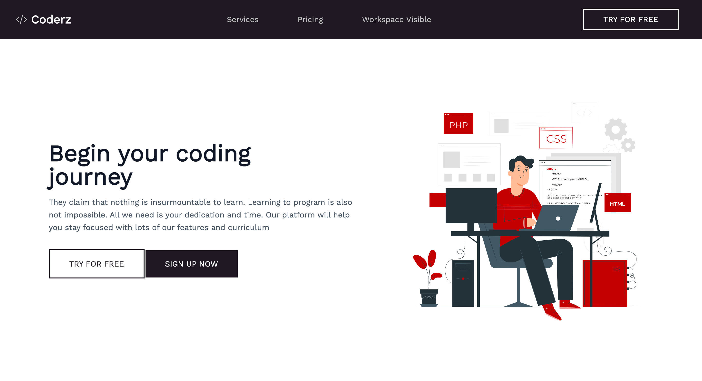

现在我们已经完成了应用程序的创建，下一步是通过 Git 终端将应用程序推送到 GitHub，以便我们可以使用 Netlify 进行部署。

## 创建新存储库

第一步是在 GitHub 上创建一个新的存储库。为此，单击“+”图标，我们将看到一个下拉菜单，单击菜单 `new repository` 这会将我们重定向到我们将创建新存储库的位置。

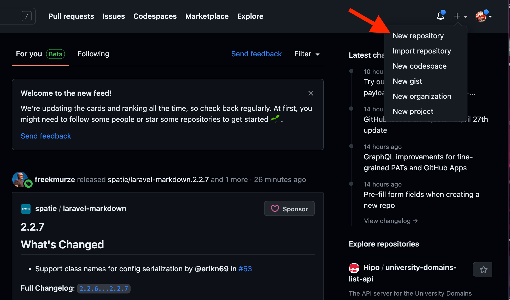

然后将添加我们存储库的名称和描述。尽管描述是可选的，但建议我们始终解释我们的应用程序的全部内容，因为它可以帮助用户在贡献之前了解项目。 GitHub 具有作为开源平台的独特优势，同时仍然允许我们将存储库私有化。例如，我们可以选择将此存储库设为公开还是私有。

我们选择public，因为它是公共存储库，但将来我们仍然可能会改变主意，将其设为私有存储库。

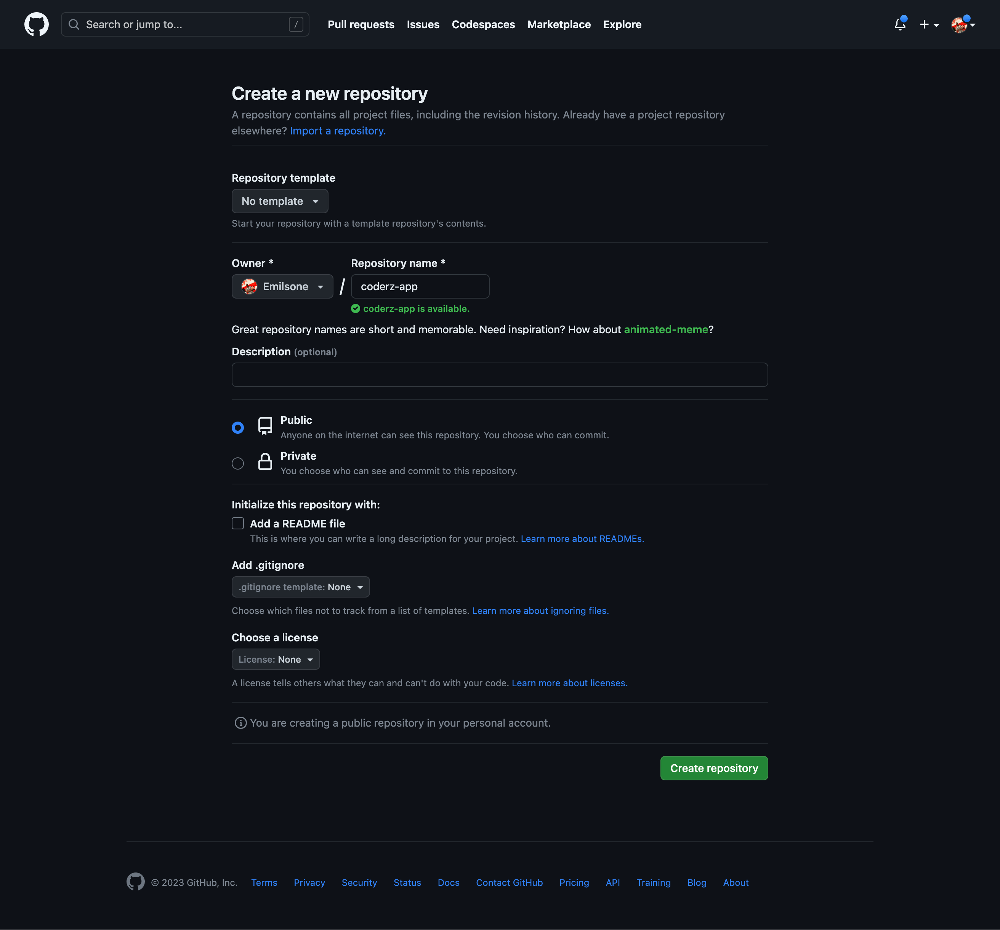

## 从命令行推送现有存储库

接下来，我们将从命令行推送现有存储库。为此，我们将创建一个 Git init 文件或添加以下命令。由于我们创建了一个新的 Vue 项目，因此我们不会创建 Git 文件。安装新的 Vue 项目时，还会包含一个 Git 文件。

要推送到现有存储库，我们将遵循以下列表步骤：

```
git remote add origin git@github.com:Emilsone/coderz-app.git
git add .
git commit -m "write commit message"
git push -u origin main
```

我们已经成功将项目推送到GitHub：

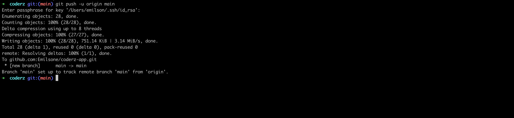

这是我们在 GitHub 上的项目：

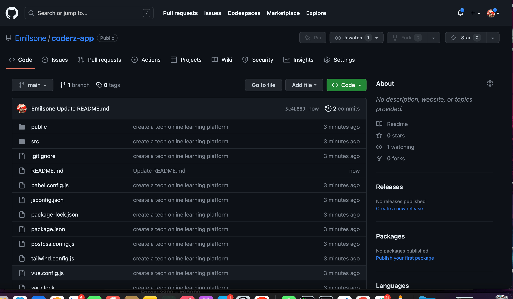

## 设置 Netlify 帐户

要创建 Netlify 帐户，请访问 Netlify 网站并单击屏幕右上角的注册按钮。

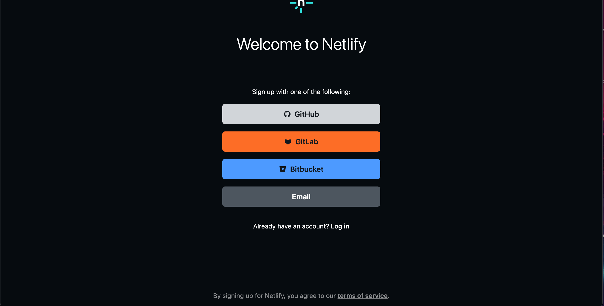

Netlify为我们提供了不同的登录方法，如上图所示。一旦我们选择了首选的登录选项，我们将被重定向到设置我们的帐户。在本节中，我们将被要求选择 Netlify 的用途。我们可以将 Netlify 用于四种不同的目的，包括 `client` 、 `work` 、 `school` 和 `personal` 使用。

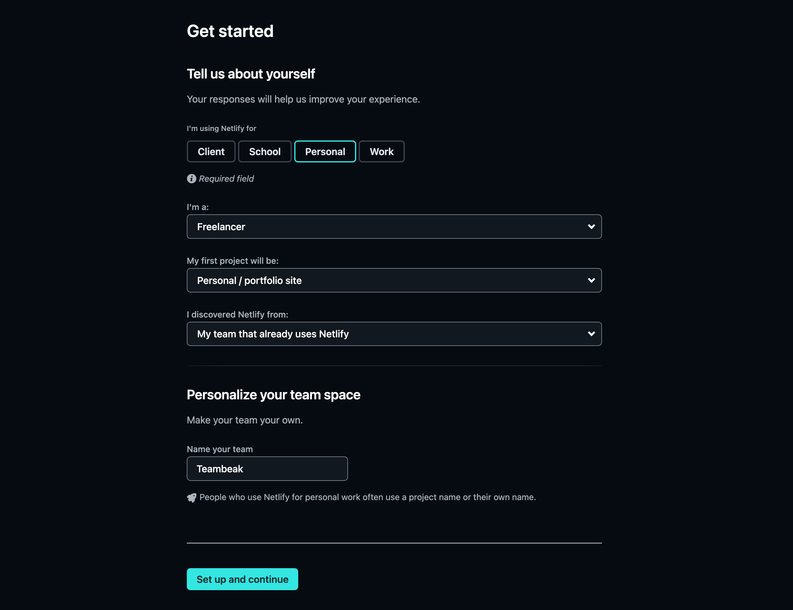

## 使用 Netlify 和 GitHub 部署 Vue 应用程序

现在我们已经成功创建并配置了 Netlify 帐户，下一步是部署我们的应用程序。我们可以选择手动部署或从 Git 部署，但我们不会这样做，因为我们需要查看 Netlify 仪表板来了解它的功能并查看其他功能。相反，我们将通过主仪表板进行部署。

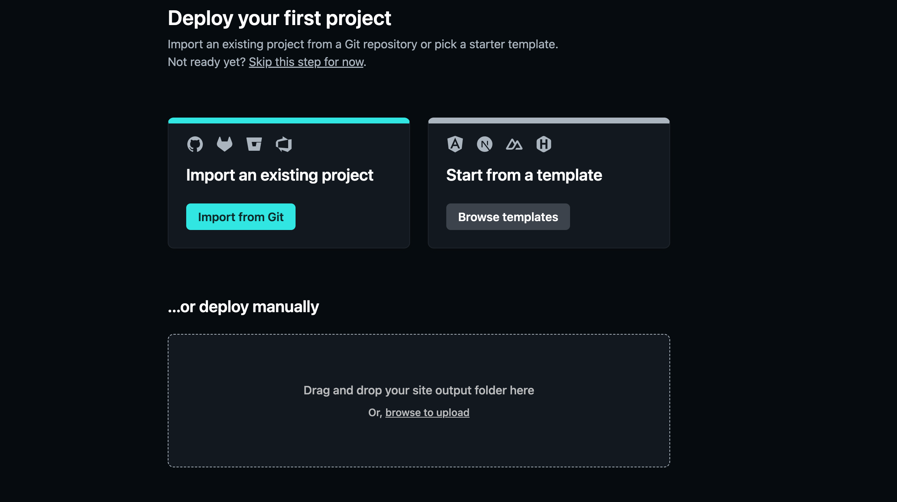

这就是我们的 Nelify 仪表板的样子，我们有 `Bandwidth` 、 `Build minutes used` 、 `Concurrent builds` 和 `Team members` 。

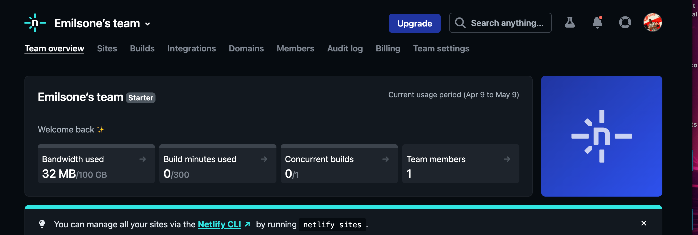

接下来是部署新站点。要部署新站点，我们将单击菜单 `sites` 。它将带我们到可以从 GitHub 添加新站点的位置。单击 `Add new site` 按钮，从下拉菜单中单击 `import an existing project` 。

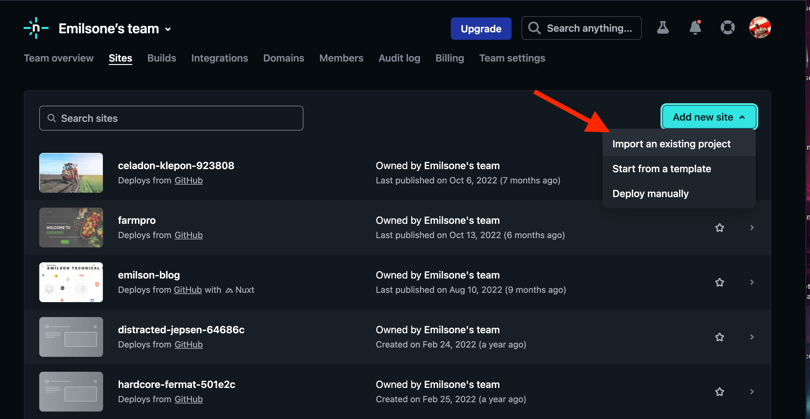

下一步，我们将选择托管代码的 Git 提供商。例如，我们有 GitHub、GitLab、Bitbucket 和 Azure DevOps。我们将选择 GitHub 选项，因为我们在他们的平台上托管了我们的代码。

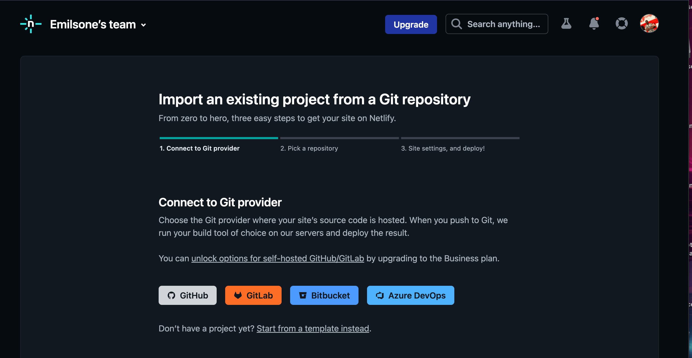

我们将选择要链接的存储库并在 Netlify 上部署我们的网站。在此示例中，我选择了推送到 GitHub 的存储库。

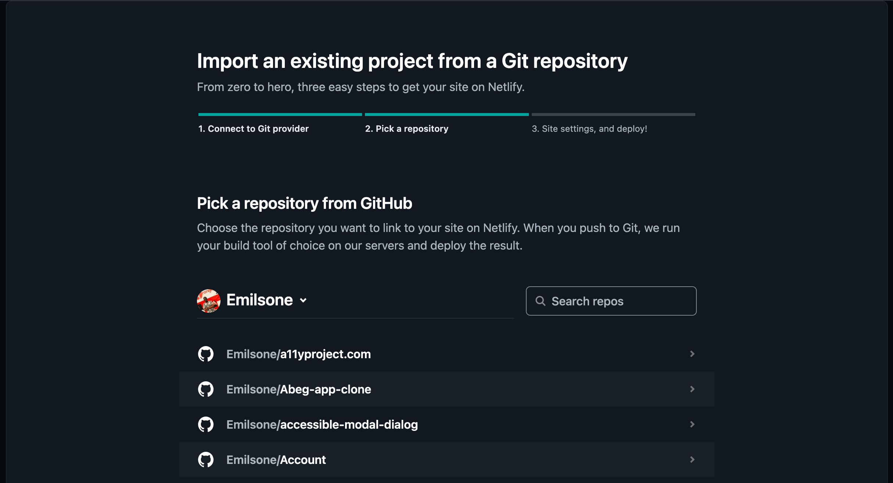

选择完存储库后，接下来就是部署它。为了避免部署失败，我们必须在进一步操作之前仔细研究说明。

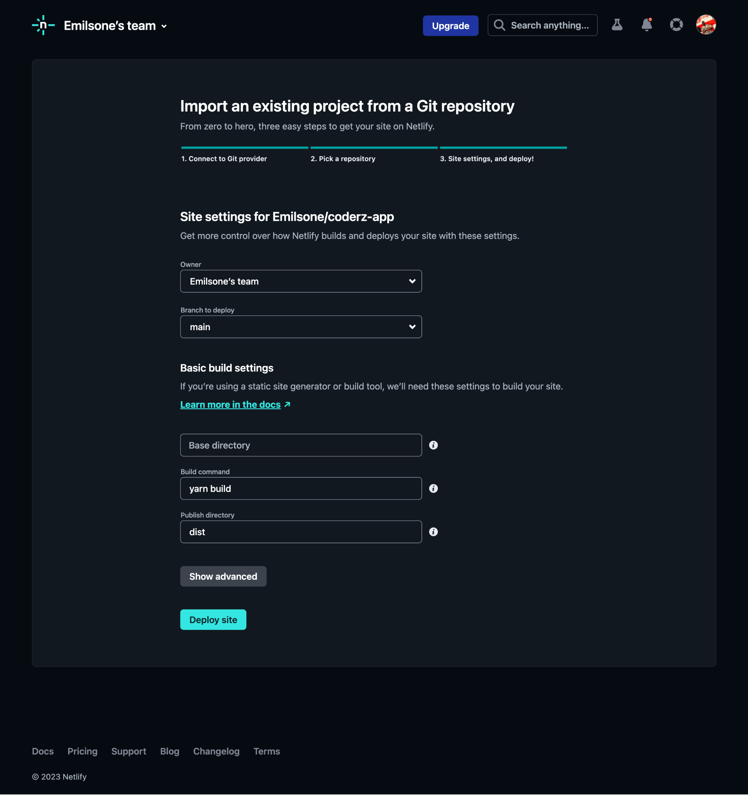

我们已经成功部署了我们的网站！

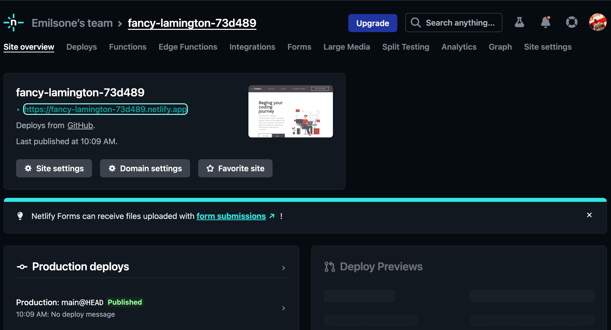

我们已经了解了如何使用 Netlify 和 GitHub 部署我们的应用程序。 Netlify 还为我们提供了自定义域名的选项。让我们看看如何做到这一点。为此，我们将单击链接 `site settings` 。

单击“更改站点名称”按钮。

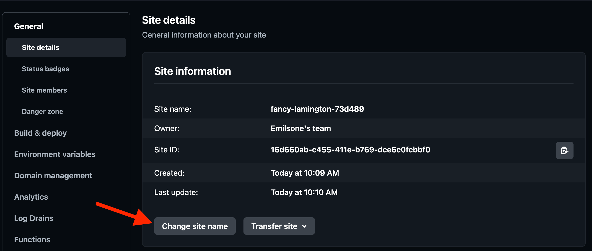

这会将我们重定向到要更改应用程序名称的位置。


就这样！我们已经成功定制了我们的域名。

##  结论

使用 Netlify 和 GitHub 部署我们的 Vue 应用程序非常简单，因为 Netlify 只需几个步骤即可帮助简化部署过程。使用 Git 和 Netlify 进行托管为我们提供了一个简单高效的工作流程来部署和管理我们的应用程序。本文将帮助我们使用 Netlify 轻松部署应用程序。