# mongoDB 下载安装和配置

## 关于MongoDB

- MongoDB是面向文档型的数据库（非关系型数据库）。 在MySql里面我们是一个个的数据表，但是在MongoDB里面是一个个的集合，集合里面是一个个的文档。 在MySql里面的数据表中是一行一行的数据，但是在MongoDB里面的文档中是一个对象的集合，每个对象类似一行的数据。 MongoDB是以键值对的形式保存数据的。
- MongoDB是为快速开发互联网Web应用 而设计的数据库系统。 • MongoDB的设计目标是极简、灵活、作为 Web应用栈的一部分。 • MongoDB的数据模型是面向文档的，所谓 文档是一种类似于JSON的结构，简单理解 MongoDB这个数据库中存的是各种各样的 JSON。（BSON）

## mongoDB 安装和启动运行配置

安装文档：[Install MongoDB Community Edition — MongoDB Manual](https://www.mongodb.com/docs/manual/administration/install-community/)

## 1.下载

1.打开官网：<https://www.mongodb.com/>

2.点击社区版：选择  `Products > Community Edition`  就能进入社区版

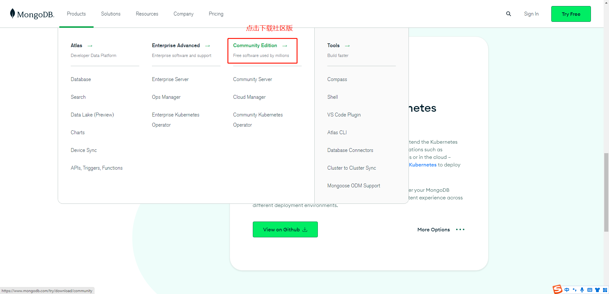

3.选择版本下载：

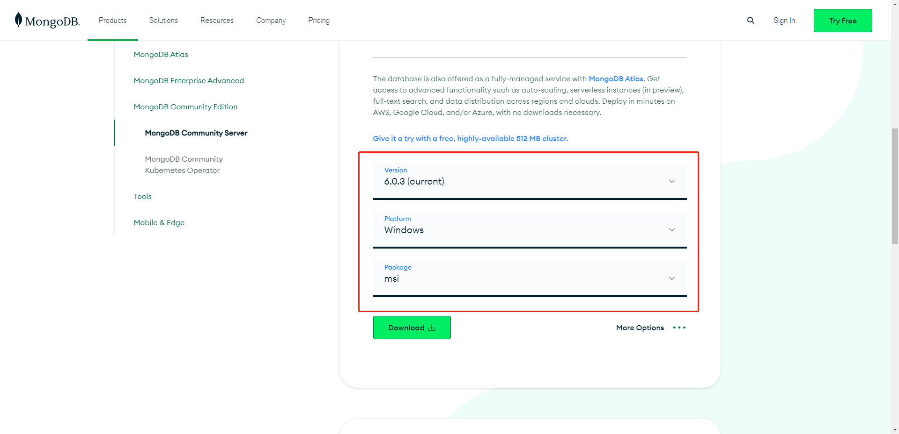

---

## 2.安装、配置与启动

### 1.安装：到这一步：complete（完整的安装：默认安装到系统盘）| Custom（习惯安装：可以自定义安装路径）。然后一路 next

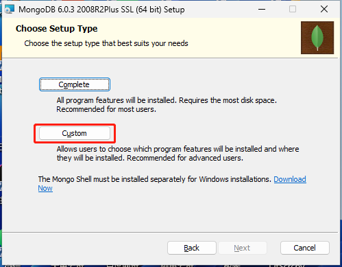

最后 点击“finish”按钮完成安装

### 2.安装完成之后找到对应的安装目录

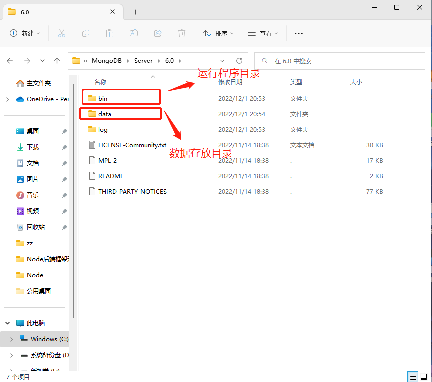

### 3.在安装路径下->创建`data\db`(存储 MongoDB 产生的数据)，和 `data\log` 日志文件夹

### 4.运行 MongoDB 服务

进入  `bin`  目录下，`cmd`  进入  `命令行窗口`，使用命令的指定存储数据文件的形式启动：`mongod --dbpath=..\data\db`

从 MongoDB 目录的 bin 目录中执行 mongod.exe 文件。
C:\mongodb\bin>mongod --dbpath D:\mongo\data\db

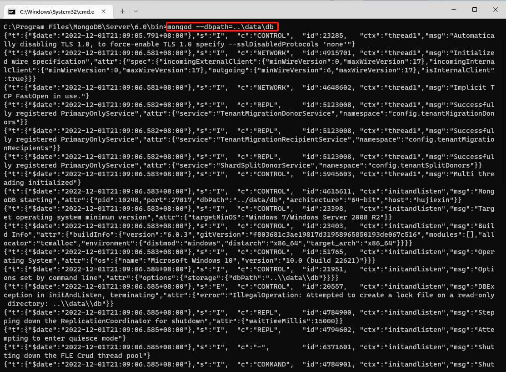

4.1.服务相关命令：

```bash
启动服务：net start MongoDB
关闭服务：net stop MongoDB
移除服务：目录路径\MongoDB\bin\mongod.exe –remove
```

### 5.本地测试启动地址：localhost:27017

成功启动：看到  `It looks like you are trying to access MongoDB over HTTP on the native driver port.`  就能证明 MongoDB 启动成功

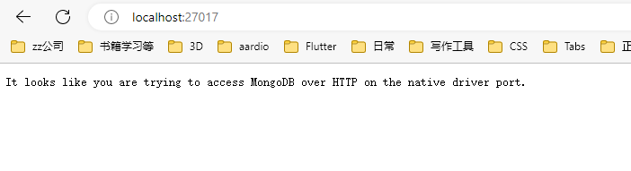

6.存放数据和日志目录：安装目录下新建`conf\mongodb.conf`文件，给该文件添加些配置信息：

```bash
systemLog:
  destination: file
  # 指定日志存放文件
  path: C:\Program Files\MongoDB\Server\6.0\log\mongodb.log
  logAppend: true
storage:
  journal:
    enabled: true
  # 指定存放数据文件的全路径
  dbPath: C:\Program Files\MongoDB\Server\6.0\data
net:
  bindIp: 127.0.0.1
  port: 27020
setParameter:
  enableLocalhostAuthBypass: false
```

详细配置可参考：[官方文档](https://www.mongodb.com/docs/manual/reference/configuration-options/)

6.1 进入  `bin`  目录下，`cmd`  进入  `命令行窗口`，使用命令的形式让  `mongodb`  指定配置文件启动：

```bash
mongod -f ..\conf\mongodb.conf
# 或者
mongod --config ..\conf\mongodb.conf
```

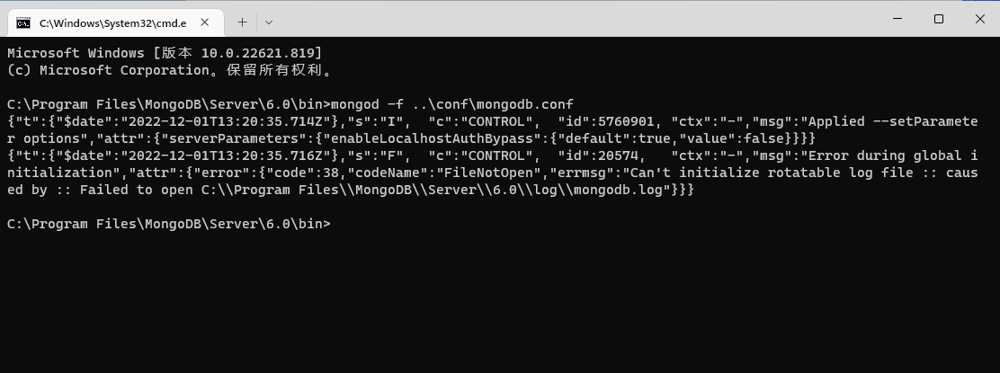

## 配置 MongoDB 服务

安装文档

- https://docs.mongodb.com/manual/administration/install-community/

0.管理员模式打开命令行窗口

1.创建目录，执行下面的语句来创建数据库和日志文件的目录

- mkdir c:\data\db mkdir c:\data\log

2.创建配置文件(存放日志和相关配置)

- 创建一个配置文件。该文件必须设置 systemLog.path 参数，包括一些附加的配置选项更好。

- 例如，创建一个配置文件位于 D:\mongodb\mongod.cfg，其中指定 systemLog.path 和 storage.dbPath。具体配置内容如下：

- systemLog:    destination: file    path: D:\data\log\mongod.log storage:    dbPath: D:\data\db

3.安装 MongoDB服务 (将mongoDB设置为系统服务)

- 通过执行mongod.exe，使用--install选项来安装服务，使用--config选项来指定之前创建的配置文件。
  - D:\mongodb\bin\mongod.exe --config "D:\mongodb\mongod.cfg" --install

- 要使用备用 dbpath(db路径)，可以在配置文件（例如：C:\mongodb\mongod.cfg）或命令行中通过 --dbpath 选项指定。

  - mongod --dbpath D:\mongodb\data\db

  - 启动数据库，把指定的目录作为路径存放数据

- 如果需要，您可以安装 mongod.exe 或 mongos.exe 的多个实例的服务。只需要通过使用 --serviceName 和 --serviceDisplayName 指定不同的实例名。只有当存在足够的系统资源和系统的设计需要这么做。

4.打开cmd输入命令：net start MongoDB，启动MongoDB服务器

- net start MongoDB

5.关闭MongoDB服务

- net stop MongoDB

6.移除 MongoDB 服务

- D:\mongodb\bin>mongod.exe --remove

- sc.exe delete MongoDB

命令行下运行 MongoDB 服务器 和 配置 MongoDB 服务 任选一个方式启动就可以。

## 3.MongoDB 连接操作和相关命令

### 1.Shell 命令连接

执行命令：`D:\mongodb\bin\mongo.exe`

如果使用 Shell 命令的形式打开 MongoDB，最好先配置以下环境变量，打开

鼠标右键  `我的电脑（此电脑）` - `属性` - `高级系统设置`  再选择  `环境变量`

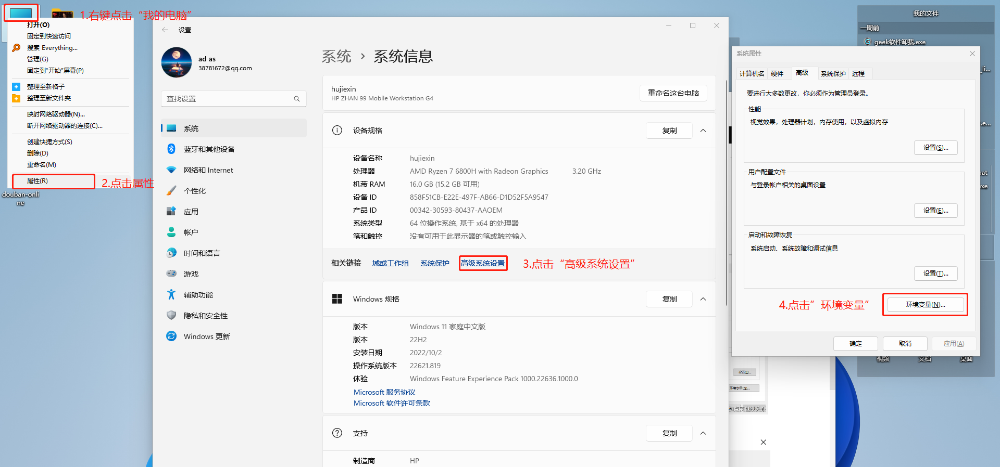

选择  `Path`，点击  `编辑`

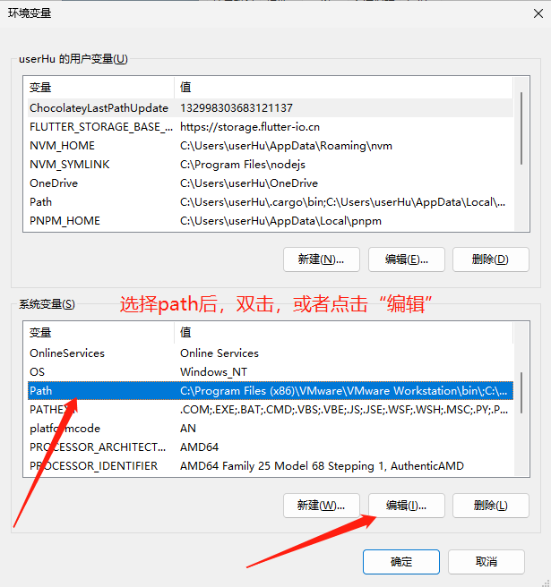
点击  `新建` ，然后把 MongoDB 的  `bin`  目录路径粘贴上去：比如我的  `C:\Program Files\MongoDB\Server\6.0\bin`

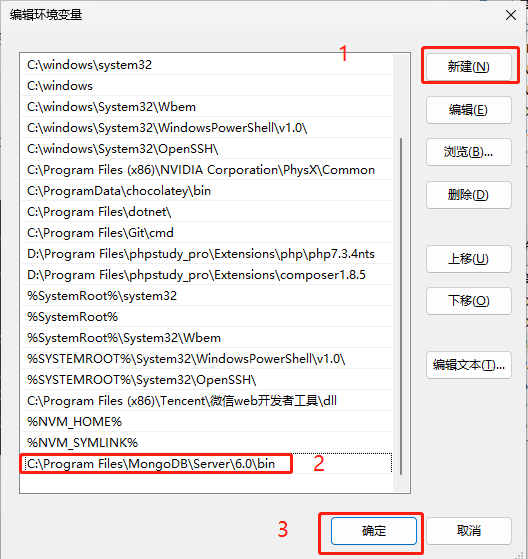

返回的窗口全部依次点击  `确定`  即可。

#### MongoDB 相关 shell 命令文档（后面有空需要学习）：[Install mongosh — MongoDB Shell](https://www.mongodb.com/docs/mongodb-shell/install/)

开启 MongoDB 之后，`cmd`  进入  `命令行窗口`，输入命令 ：

```bash
mongo
# 或者
mongo --host=127.0.0.1 --port=27017
```

查看已经有的数据库：

```bash
show databases
```

退出 Mongodb

```bash
exit
```

查看帮助文档

```bash
mongo --help
```

#### 1.1 官方工具 MongoDB Shell

MongoShell 是**MongoDB 发行版的一个组件**， 安装并启动 MongoDB 后，将 MongoShell 连接到正在运行的 MongoDB 实例，MongoDB 手册中的大多数示例使用 MongoShell，然而，许多驱动程序也提供了与 MongoDB 类似的接口。

`MongoDB Shell` 官方地址下载：[MongoDB Compass Download | MongoDB](https://www.mongodb.com/try/download/shell)

---

### MongoDB 后台管理 Shell

- 如果你需要进入MongoDB后台管理，你需要先打开mongodb装目录的下的bin目录，然后执行mongo.exe文件，MongoDB Shell是MongoDB自带的交互式Javascript shell,用来对MongoDB进行操作和管理的交互式环境。

- cmd 执行命令 mongo 进入shell命令行
  - mongo

- 当你进入mongoDB后台后，它默认会链接到 test 文档（数据库）：
  - \> mongo MongoDB shell version: v5.0.3 connecting to: test

- 由于它是一个JavaScript shell，您可以运行一些简单的算术运算:
  - \> 2 + 2 4 >

- db 命令用于查看当前操作的文档（数据库）：

  - ```bash
    > db.runoob.insert({x:10})
    WriteResult({ "nInserted" : 1 })
    > db.runoob.find()
    { "_id" : ObjectId("5604ff74a274a611b0c990aa"), "x" : 10 }
    >
    ```

### 2.MongoDB 客户端程序连接

一些连接数据库的图形化工具也能够连接 MongoDB

#### 2.1. MongoDBCompass-图形化界面客户端

`Compass`  图形化界面客户端：[MongoDB-compass 下载](https://www.mongodb.com/try/download/compass)

视频地址：[Webinar: MongoDB Compass - Data navigation made easy | MongoDB](https://www.mongodb.com/presentations/webinar-mongodb-compass-data-navigation-made-easy?utm_campaign=Int_ET_Download%20Center%20-%20Compass%20Download_WW%20-%20Autoresponder%20%28Sept%202017%29&utm_medium=email&utm_source=Eloqua)

官方总文档地址：[MongoDB Documentation](https://www.mongodb.com/docs/)

**使用教程文档地址**：[What is MongoDB Compass? — MongoDB Compass](https://www.mongodb.com/docs/compass/current/)

---

下载解压或者安装后：在打开的界面中，输入主机地址、端口等相关信息

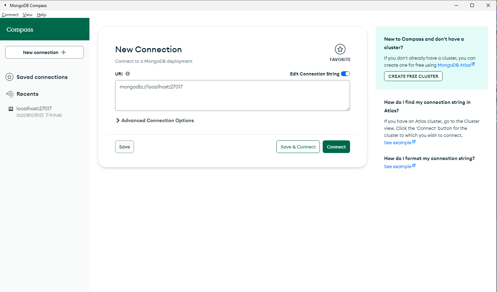

连接成功：

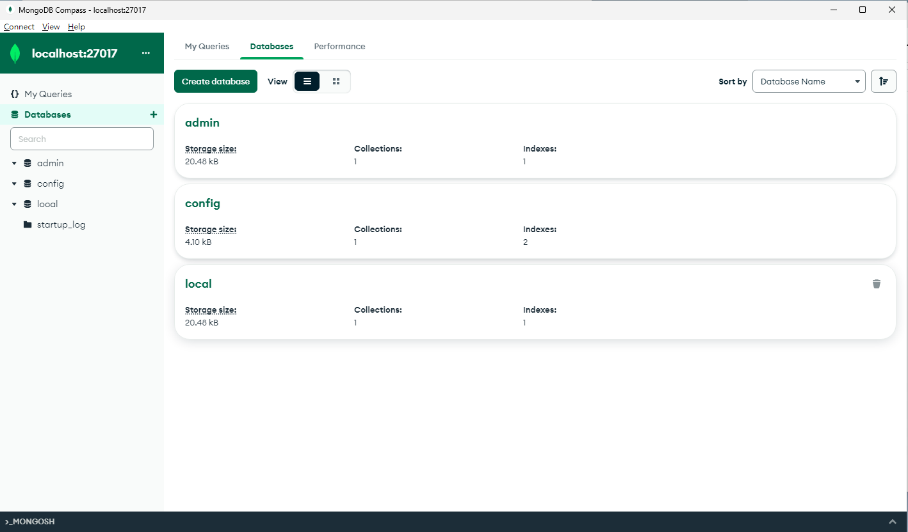

图形化界面的好处就是可以很清晰的看到数据库中数据的展示和减少写一些查询语句。

---

#### 2.2. Navicat 数据库管理软件

---

#### 2.3. Robo 3T 客户端管理软件

下载地址：<https://robomongo.org/download>

安装：傻瓜式安装，全部点击下一步 next

连接和使用：

> 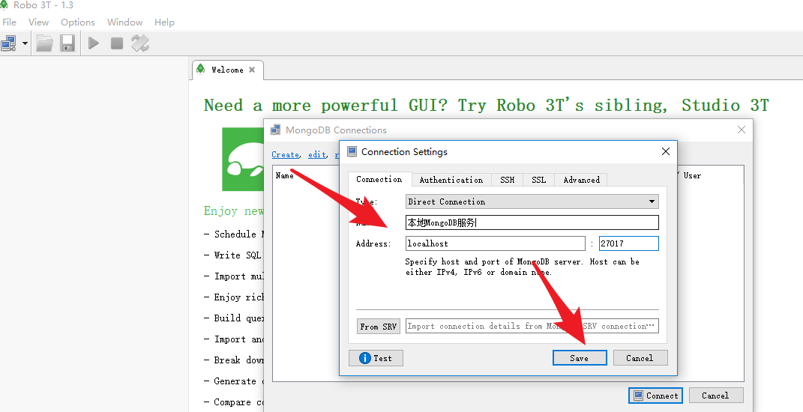
>
> 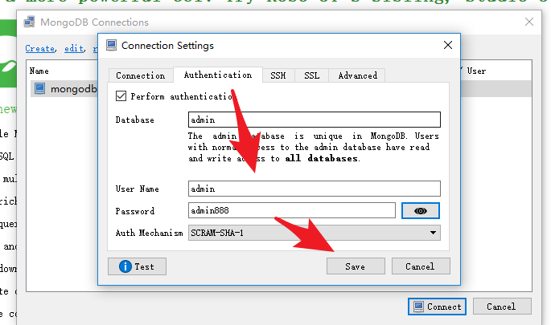
>
> 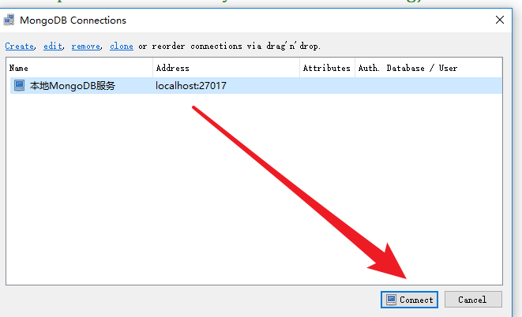
>
> 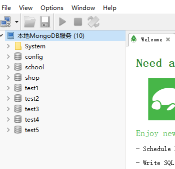
>
> 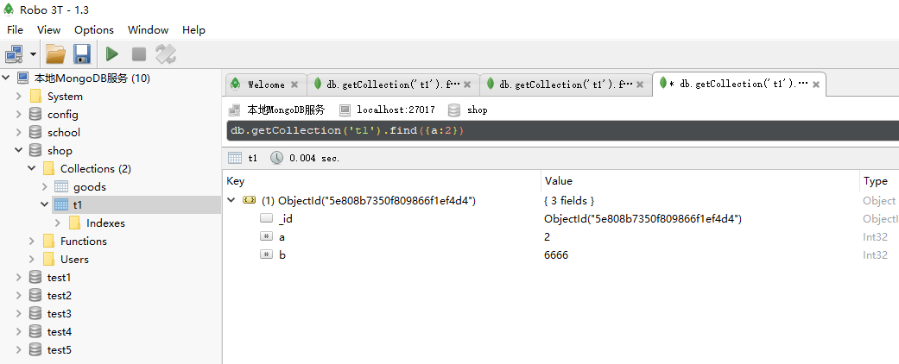

---

#### 2.4. Robomongo

---

#### 2.5 adminMongo

adminMongo 管理系统 - WEB/PC 端口网页管理：[https://adminmongo.markmoffat.com/](https://adminmongo.markmoffat.com/)

---

#### 2.6 MongoVUE 客户端软件

---

#### 2.7 VS Code 连接 MongoDB 数据库

官网文档：[MongoDB for VS Code — MongoDB for VS Code](https://www.mongodb.com/docs/mongodb-vscode/)

VS Code 搜索安装插件：MongoDB for VS Code

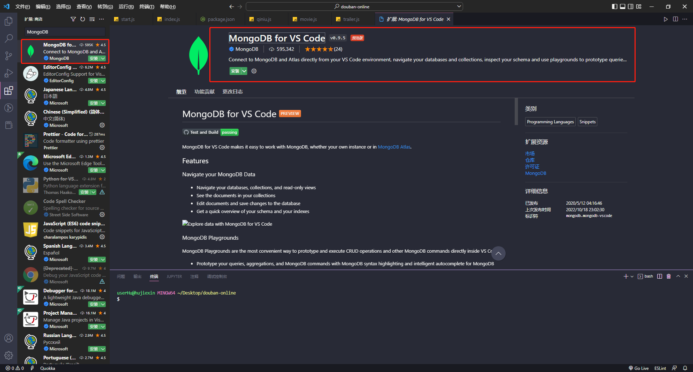

VS Code 连接：

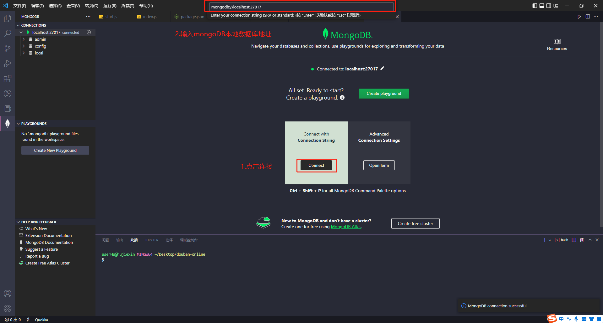

使用该插件添加数据库：没学会，文档待定
