# mongoDB下载安装和配置

## mongoDB安装和启动运行配置

安装文档：[Install MongoDB Community Edition — MongoDB Manual](https://www.mongodb.com/docs/manual/administration/install-community/)

## 1.下载

1.打开官网：<https://www.mongodb.com/>

2.点击社区版：选择 `Products > Community Edition` 就能进入社区版

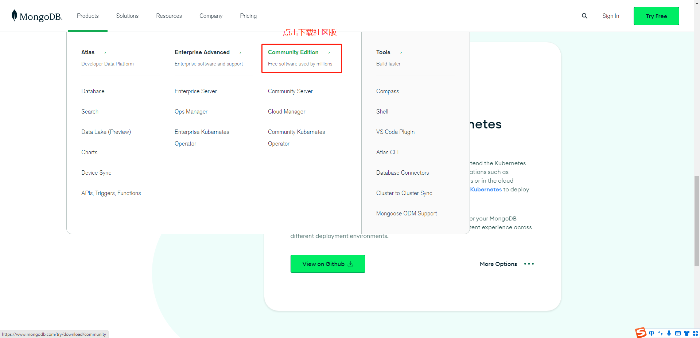

3.选择版本下载：

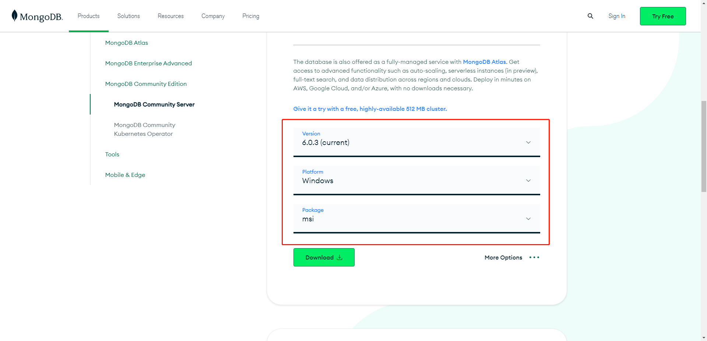

---

## 2.安装、配置与启动

1.安装：到这一步：complete（完整的安装：默认安装到系统盘）| Custom（习惯安装：可以自定义安装路径）。然后一路next

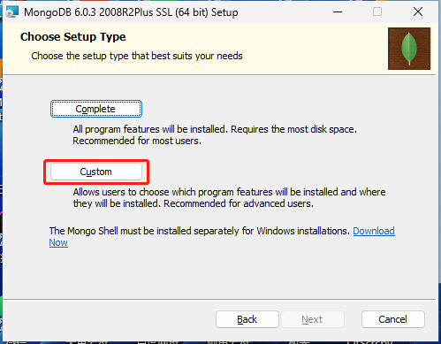

最后 点击“finish”按钮完成安装

2.安装完成之后找到对应的安装目录

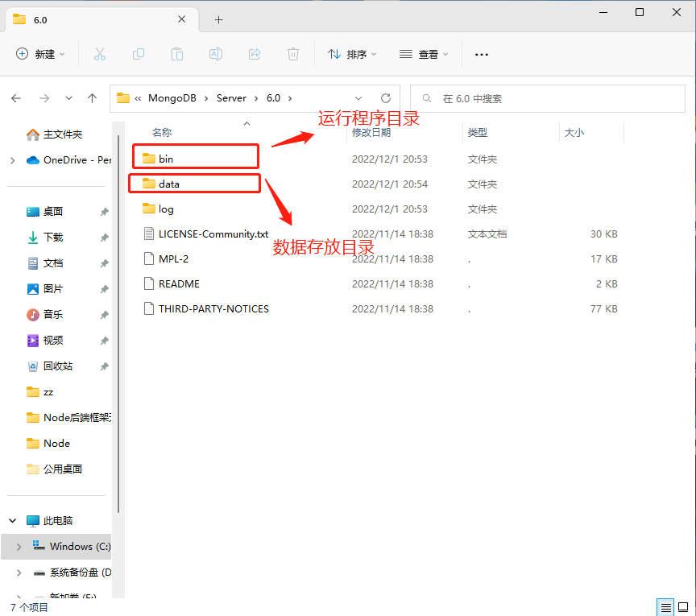

3.在安装路径下->创建`data\db`(存储 MongoDB 产生的数据)，和 `data\log` 日志文件夹

4.运行MongoDB服务

进入 `bin` 目录下，`cmd` 进入 `命令行窗口`，使用命令的指定存储数据文件的形式启动：`mongod --dbpath=..\data\db`

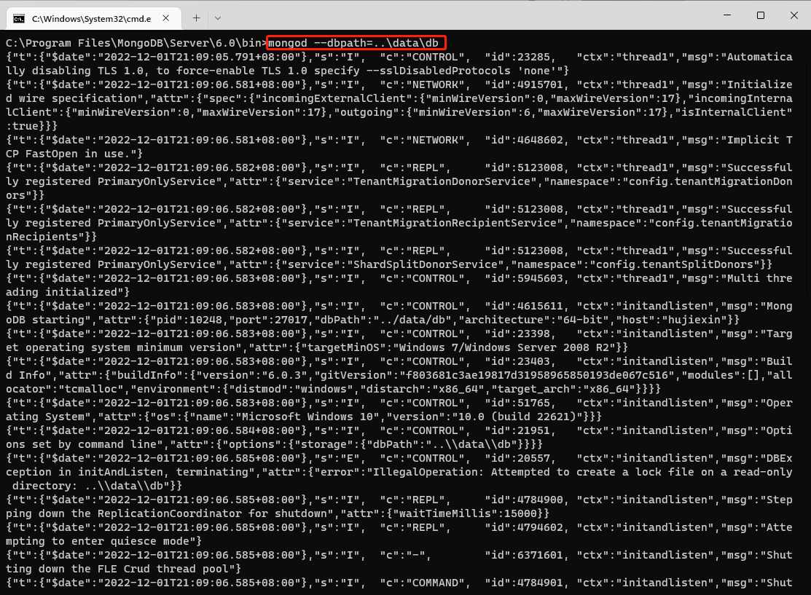

4.1.服务相关命令：

```bash
启动服务：net start MongoDB
关闭服务：net stop MongoDB
移除服务：目录路径\MongoDB\bin\mongod.exe –remove
```

5.本地测试启动地址：localhost:27017

成功启动：看到 `It looks like you are trying to access MongoDB over HTTP on the native driver port.` 就能证明 MongoDB 启动成功

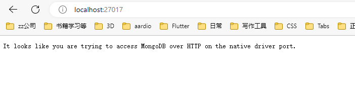

6.存放数据和日志目录：安装目录下新建`conf\mongodb.conf`文件，给该文件添加些配置信息：

```bash
systemLog:
  destination: file
  # 指定日志存放文件
  path: C:\Program Files\MongoDB\Server\6.0\log\mongodb.log
  logAppend: true
storage:
  journal:
    enabled: true
  # 指定存放数据文件的全路径
  dbPath: C:\Program Files\MongoDB\Server\6.0\data
net:
  bindIp: 127.0.0.1
  port: 27020
setParameter:
  enableLocalhostAuthBypass: false
```

详细配置可参考：[官方文档](https://www.mongodb.com/docs/manual/reference/configuration-options/)

6.1 进入 `bin` 目录下，`cmd` 进入 `命令行窗口`，使用命令的形式让 `mongodb` 指定配置文件启动：

```bash
mongod -f ..\conf\mongodb.conf
# 或者
mongod --config ..\conf\mongodb.conf
```

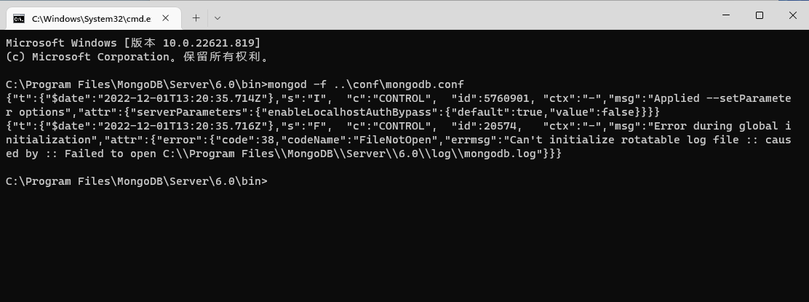

---

## 3.MongoDB连接

#### 1.Shell 命令连接

如果使用 Shell 命令的形式打开 MongoDB，最好先配置以下环境变量，打开

鼠标右键 `我的电脑（此电脑）` - `属性` - `高级系统设置` 再选择 `环境变量`

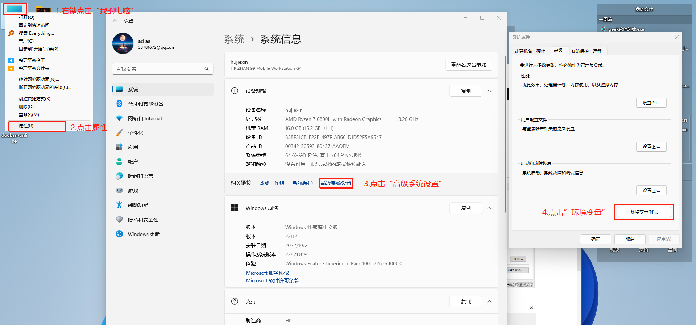

选择 `Path`，点击 `编辑`  

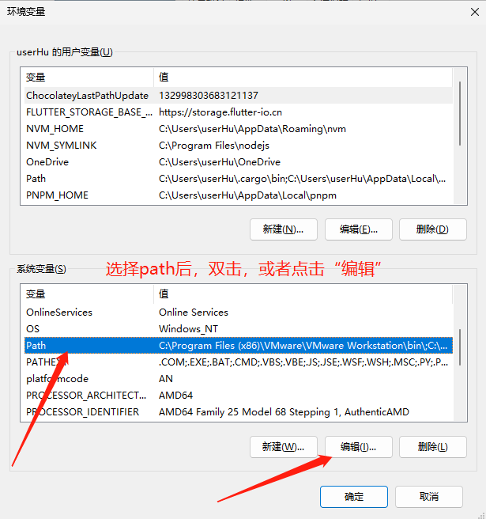
点击 `新建` ，然后把 MongoDB 的 `bin` 目录路径粘贴上去：比如我的 `C:\Program Fi

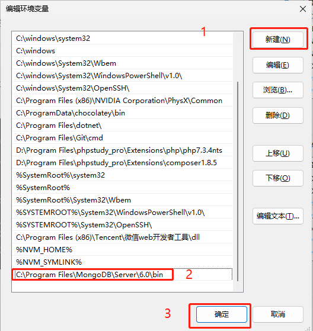

返回的窗口全部依次点击 `确定` 即可。

开启 MongoDB 之后，`cmd` 进入 `命令行窗口`，输入命令 ：

```bash
mongo
# 或者
mongo --host=127.0.0.1 --port=27017
```

查看已经有的数据库：

```bash
show databases
```

退出 Mongodb

```bash
exit
```

查看帮助文档

```bash
mongo --help
```

#### 1.1官方工具MongoDB Shell

MongoShell是**MongoDB发行版的一个组件**， 安装并启动MongoDB后，将MongoShell连接到正在运行的MongoDB实例，MongoDB手册中的大多数示例使用 MongoShell，然而，许多驱动程序也提供了与MongoDB类似的接口。

`MongoDB Shell` 官方地址下载：[MongoDB Compass Download | MongoDB](https://www.mongodb.com/try/download/shell)

---

#### 2.MongoDB客户端程序连接

一些连接数据库的图形化工具也能够连接 MongoDB

##### 2.1. MongoDBCompass-图形化界面客户端

`Compass` 图形化界面客户端：[MongoDB-compass下载](https://www.mongodb.com/try/download/compass)

视频地址：[Webinar: MongoDB Compass - Data navigation made easy | MongoDB](https://www.mongodb.com/presentations/webinar-mongodb-compass-data-navigation-made-easy?utm_campaign=Int_ET_Download%20Center%20-%20Compass%20Download_WW%20-%20Autoresponder%20%28Sept%202017%29&utm_medium=email&utm_source=Eloqua)

---

下载解压或者安装后：在打开的界面中，输入主机地址、端口等相关信息

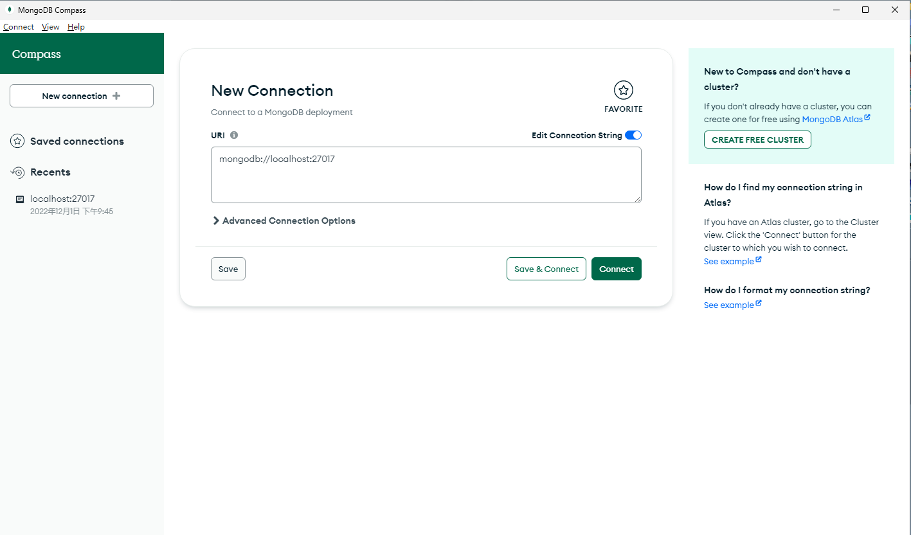

连接成功：

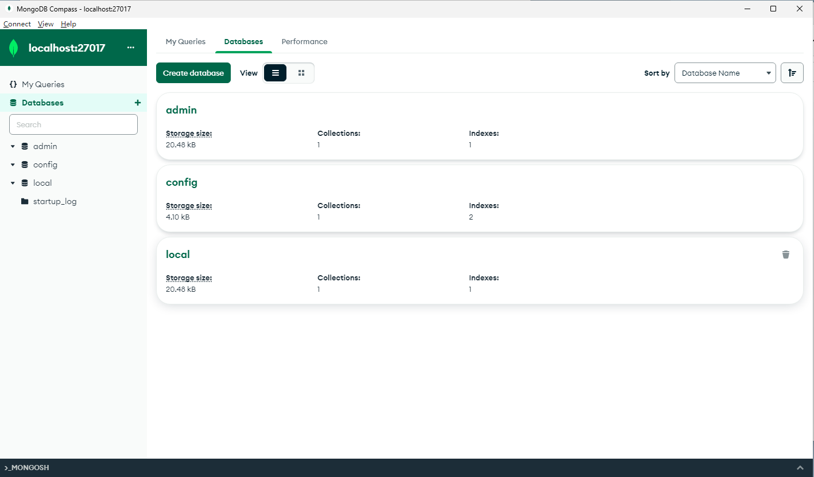

图形化界面的好处就是可以很清晰的看到数据库中数据的展示和减少写一些查询语句。

---

##### 2.2. Navicat

---

##### 2.3. robo3t

---

##### 2.4. Robomongo

---

##### 2.5. VS Code连接MongoDB数据库

官网文档：[MongoDB for VS Code — MongoDB for VS Code](https://www.mongodb.com/docs/mongodb-vscode/)

VS Code搜索安装插件：MongoDB for VS Code

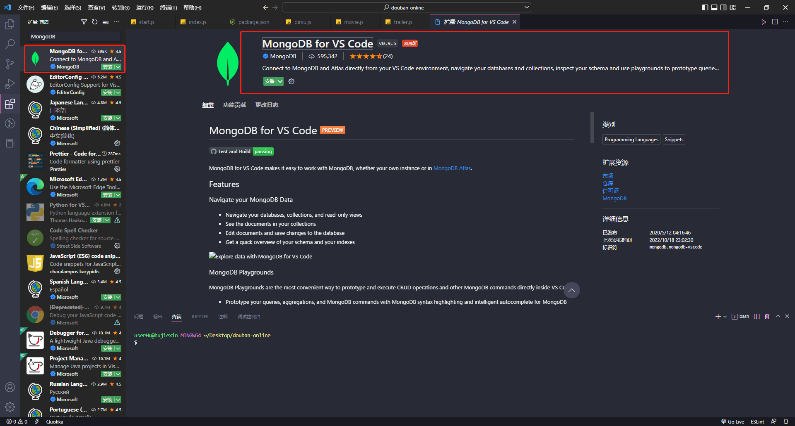

VS Code 连接：

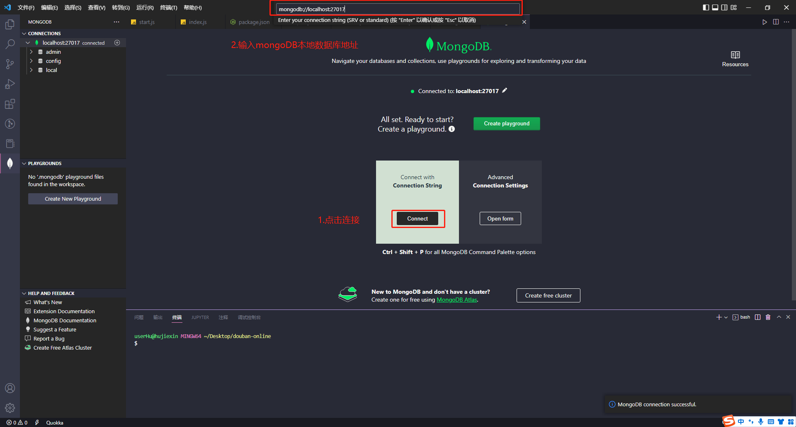

使用该插件添加数据库：没学会，文档待定
