# MongoDB基础

MongoDB相关shell命令文档：[Install mongosh — MongoDB Shell](https://www.mongodb.com/docs/mongodb-shell/install/)

## 基础shell命令

数据库（查看、创建、选择、删除

```bash
查看：show databases
创建：有单独的语法，但是忽略  隐式创建
选择：use 数据库名
删除：1通过use选中数据库，2通过db.dropDatabase()删除数据库
```

集合（查看、创建、删除

```bash
查看：show collections
创建：db.createCollection('集合名')     多学一招：忽略  后期插入数据 隐式创建集合
删除：db.集合名.drop()
```

## MongoDB文档增删修查（CURD）

### #C增

**语法：**db.集合名.insert(JSON数据)

**说明：**集合存在-则直接插入数据，集合不存在-隐式创建

**练习：**在test2数据库的c1集合中插入数据（姓名叫webopenfather年龄18岁）

```bash
use test2
db.c1.insert({uname:"webopenfather", age:18})

留心1：数据库和集合不存在都隐式创建
留心2：对象的键统一不加引号方便看，但是查看集合数据时系统会自动加
留心3：mongodb会给每条数据增加一个全球唯一的_id键 
```

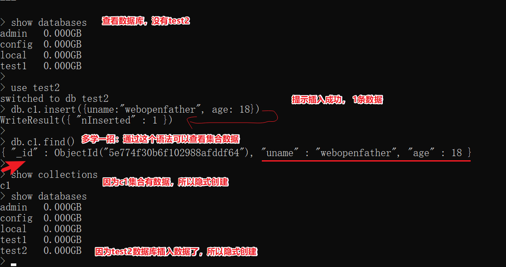

多学一招：_id的组成

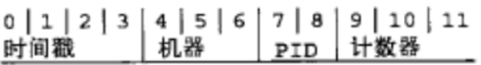

**思考1：是否可以自定义_id值？**

> 回答：可以，只需要给插入的JSON数据增加_id键即可覆盖（但实战强烈不推荐
>
>``` bash
> db.c1.insert({_id:1, uname:"webopenfather", age:18})
>

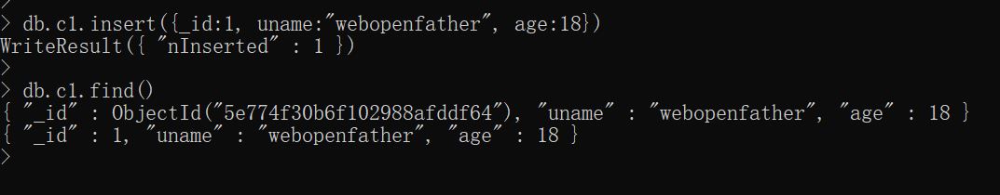

**思考2：如何一次性插入多条记录？**

> 回答：传递数据，数组中写一个个JSON数据即可
>
>``` bash
>     db.c1.insert([
>         {uname:"z3", age:3},
>         {uname:"z4", age:4},
>         {uname:"w5", age:5}
>     ])
>```
>
> ​
> ​    含义：一次性插入3条数据到c1集合

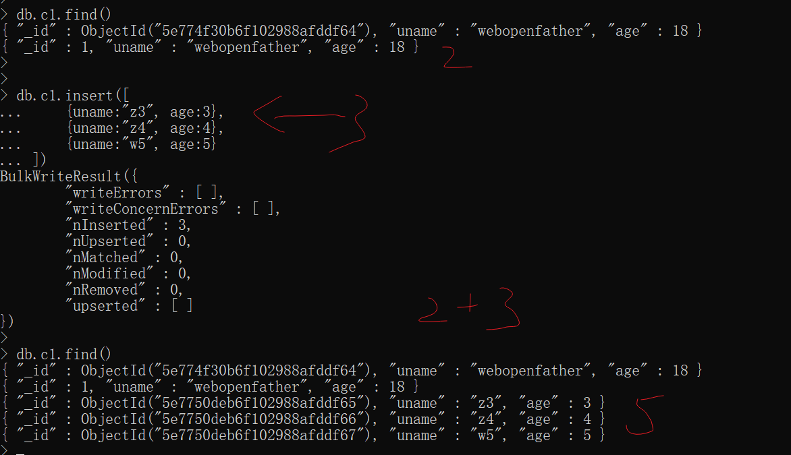

**思考3：如何快速插入10条数据**：

> 回答：mongodb底层使用JS引擎实现的，所以支持部分js语法
>
> 因此：可以写for循环
>
>``` bash
>     for (var i=1; i<=10; i++){
>         print(i)
>     }
>     
>     需求：在test2数据库c2集合中插入10条数据，分别为 a1 a2 ... a10
>     use test2
>     for (var i=1; i<=10; i++){
>         db.c2.insert({uanme: "a"+i, age: i})
>     }
>```

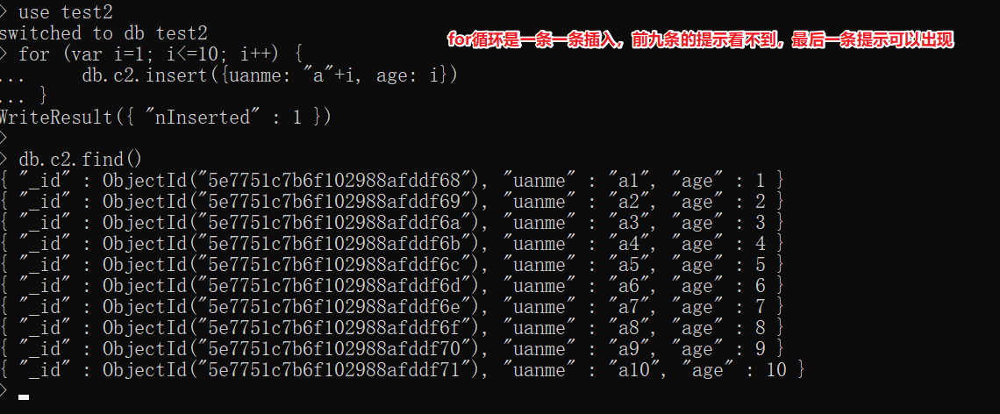

### #R查

**基础语法：**db.集合名.find(条件  [,查询的列])

```bash
条件
    查询所有数据           {}或者不写
    查询age=6的数据          {age:6}
    既要age=6又要性别=男    {age:6,sex:'男'}

查询的列（可选参数
    不写 - 这查询全部列（字段
    {age:1}  只显示age列（字段
    {age:0}  除了age列（字段都显示
    留心：不管你怎么写系统自定义的_id都会在
```

**升级语法**：

```bash
db.集合名.find({键:值})  注：值不直接写
                 {运算符:值}
db.集合名.find({
    键:{运算符:值}
})
```

| 运算符  | 作用     |
|:----:|:------ |
| $gt  | 大于     |
| $gte | 大于等于   |
| $lt  | 小于     |
| $lte | 小于等于   |
| $ne  | 不等于    |
| $in  | in     |
| $nin | not in |

**练习1：查询所有数据**：

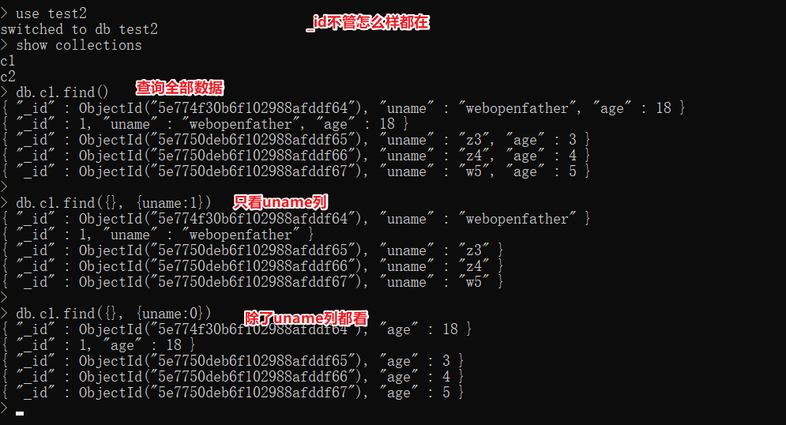

**练习2：查询年龄大于5岁的数据？**

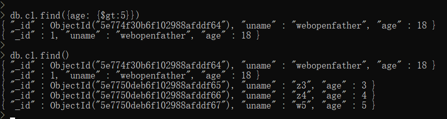

**练习3：查询年龄是5岁、8岁、10岁的数据？**

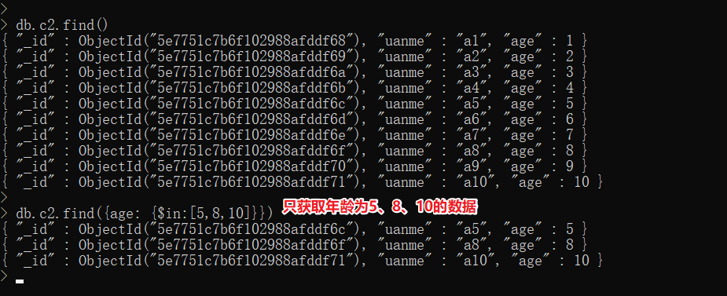

**练习3：只看年龄列，或者年龄以外的列（_id别管它）？**

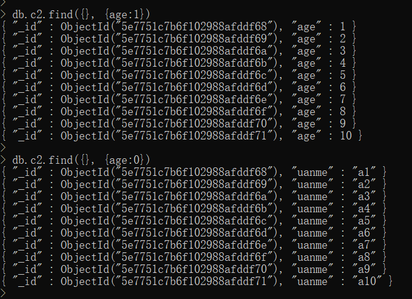

### #U改

**基础语法：** db.集合名.update（条件， 新数据  [,是否新增，是否修改多条]）

```bash
是否新增：指条件匹配不到数据则插入(true是插入，false否不插入默认)
是否修改多条：指将匹配成功的数据都修改（true是，false否默认）
```

**升级语法**：

说明：

是否新增：指匹配不到数据则插入（true-是插入，false-否不插入默认）

是否修改多条：将匹配成功的数据都修改（true-是，false-否默认）

```bash
db.集合名.update（条件， 新数据）
                      {修改器: {键:值}}
```

| 修改器     | 作用   |
|:-------:|:---- |
| $inc    | 递增   |
| $rename | 重命名列 |
| $set    | 修改列值 |
| $unset  | 删除列  |

**准备工作**：

```bash
use test2;
for(var i = 1; i<= 10; i++){
    db.c3.insert( {"uname":"zs"+i,"age":i} );
}
```

**练习1：将{uname:**"**zs1**"**}改为{uname:**"**zs2**"**}**

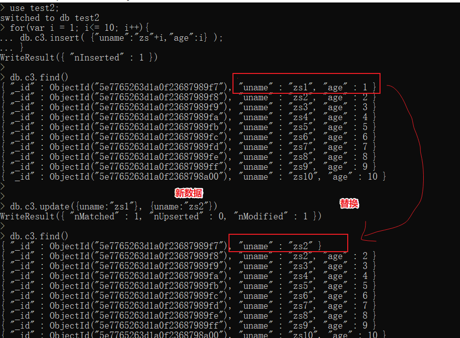

> 发现：默认不是修改，而是替换
>
> 解决：使用升级语法 修改器
>
> 需求：使用修改器将zs4的姓名改为zs44
>
> 语法：db.c3.update({uname:"zs4"}, {$set: {uname: "zs44"}})

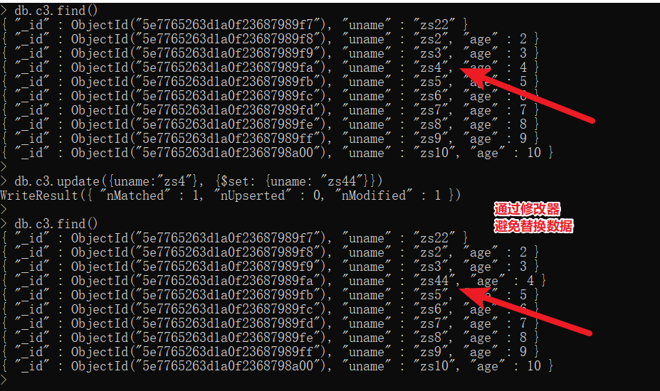

**练习2：给{uname:**"**zs10**"**}的年龄加2岁或者减2岁**

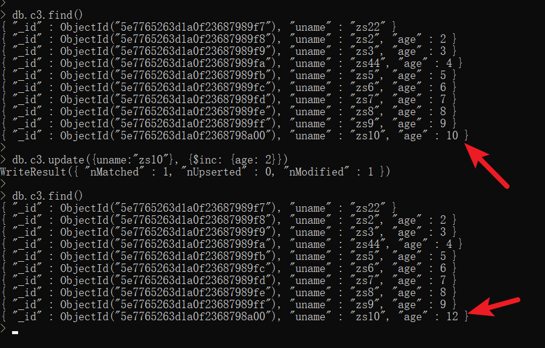

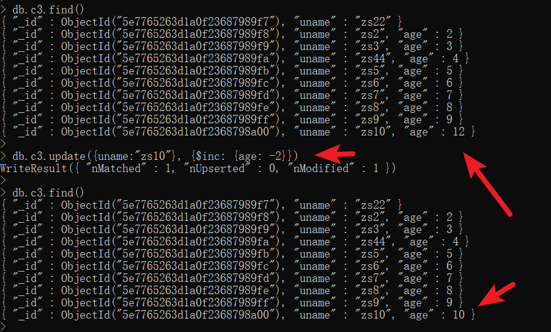

**练习3：修改器综合练习** ：

插入数据：db.c4.insert( {uname:"神龙教主",age:888,who:"男",other:"非国人"});

> 完成需求：
>
> ```bash
> uname  改成   webopenfather      (修改器：$set）
> age    增加   111                       (修改器：\$inc）
> who   改字段 sex                      (修改器：\$rename）
> other 删除                            (修改器：\$unset）
> ```
>
> 语法分析：
>
> ```bash
> db.c4.update({uname:"神龙教主"}, {uname: "webopenfather"})  #错误，替换
>                                 {$set: {uname: "webopenfather"}}
>                                 {$inc: {age: 111}}
>                                 {$rename: {who: "sex"}}
>                                 {$unset: {other: true}}
> 留心如何一次性写多个修改器
> db.c4.update({uname:"神龙教主"}, {
>     $set: {uname: "webopenfather"},
>     $inc: {age: 111},
>     $rename: {who: "sex"},
>     $unset: {other: true}
> })
> ```

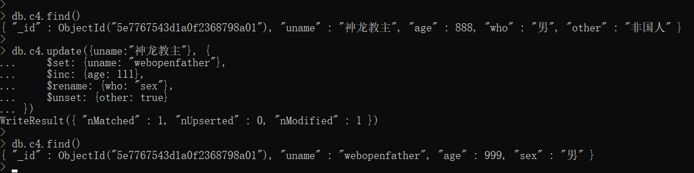

**练习4：验证语法最后两个参数（了解）**：

【验证】是否新增true是false否：修改uame 等于 zs30的年龄 30岁

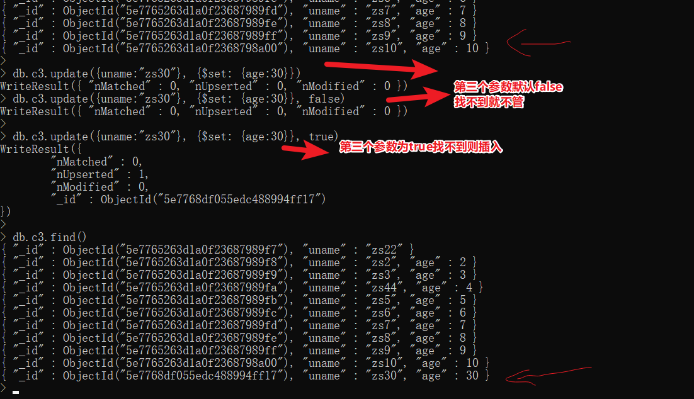

【验证】是否修改多条true是，false否默认

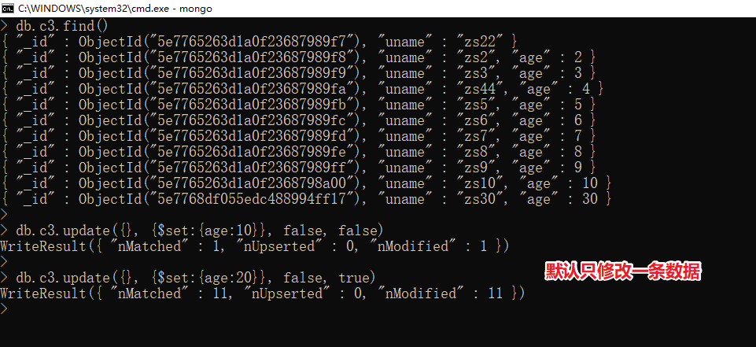

### #D删

语法：db.集合名.remove(条件 [, 是否删除一条] )

注意：是否删除一条 true是,false否 默认

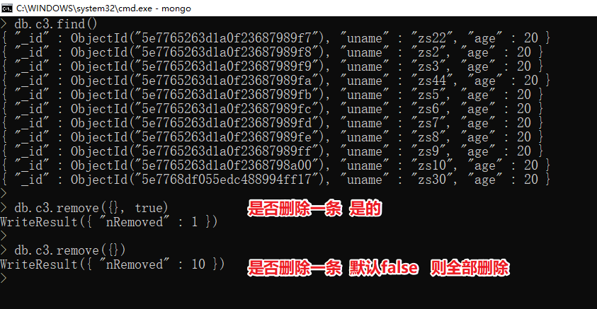

### 小总结

高级开发攻城狮统称：所有数据库都需要增删改查CURD标识

MongoDB删除语法：remove

增Create

```bash
db.集合名.insert(JSON数据)
```

删Delete

```bash
db.集合名.remove(条件 [,是否删除一条true是false否默认])

也就是默认删除多条
```

改Update

```bash
db.集合名.update(条件， 新数据  [,是否新增,是否修改多条])

升级语法db.集合名.update(条件，{修改器：{键：值}})
```

查Read

```bash
db.集合名.find(条件 [,查询的列])


## MongoDB实战教学管理系统数据库设计

### 数据库设计流程

根据UI设计稿

1确定功能模块所属集合

2确定集合字段

```bash
UI设计稿每个展示内容对应一个字段
创建于字段
更新于字段
状态字段

最后：先中文、再英文
留心：上述规则照顾基础差的，如果大神 或 久而久之 就变成肌肉记忆 下意识直接创建
```

#### 练习

- 需求：根据教学系统，设置存放学生信息的集合，并插入20条测试数据

- 代码

```bash
1. 先中文
集合名称：学生集合
集合字段：编号、学好、姓名、电话、性别、年龄、学历、备注

2. 再英文

use school
for (var num=1; num<=20; num++){
    db.stu.insert({
        id:num,
        no: "QF"+num,
        uname: "神龙教"+num,
        tel: "1111111111",
        sex: "女",
        age: num,
        school: "研究生",
        remark: "土豪"
    })
}
```

## ■MongoDB实战教学管理系统数据库设计

### 实战开发流程


### 数据库设计流程

根据UI设计稿

1确定功能模块所属集合

2确定集合字段

```bash
UI设计稿每个展示内容对应一个字段
创建于字段
更新于字段
状态字段

最后：先中文、再英文
留心：上述规则照顾基础差的，如果大神 或 久而久之 就变成肌肉记忆 下意识直接创建
```

### 设计练习

- 需求：根据教学系统，设置存放学生信息的集合，并插入20条测试数据

- 代码

```bash
1. 先中文
集合名称：学生集合
集合字段：编号、学好、姓名、电话、性别、年龄、学历、备注

2. 再英文

use school
for (var num=1; num<=20; num++){
    db.stu.insert({
        id:num,
        no: "QF"+num,
        uname: "神龙教"+num,
        tel: "1111111111",
        sex: "女",
        age: num,
        school: "研究生",
        remark: "土豪"
    })
}
```
