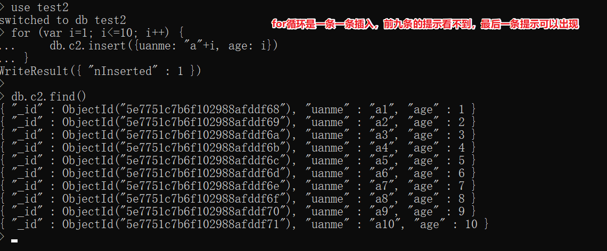

# MongoDB 基础

- MongoDB 是面向文档型的数据库（非关系型数据库）。

- 在 MySql 里面我们是一个个的数据表，但是在 MongoDB 里面是一个个的集合，集合里面是一个个的文档。

- 在 MySql 里面的数据表中是一行一行的数据，但是在 MongoDB 里面的文档中是一个对象的集合，每个对象类似一行的数据。

- MongoDB 是以键值对的形式保存数据的。
  MongoDB 是为快速开发互联网 Web 应用而设计的数据库系统。
  
- MongoDB 的设计目标是极简、灵活、作为Web 应用栈的一部分。
  
- MongoDB 的数据模型是面向文档的，所谓文档是一种类似于 JSON 的结构，简单理解MongoDB 这个数据库中存的是各种各样的JSON。（BSON）

## 概念

数据库(database)
数据库是一个仓库，在仓库中可以存放集合

集合(collection)
集类似于数组，在集合中可以存放文档

文档(documnet)
文档是数据库中最小单位，我们存储和操作的内容都是文档

---

MongoDB 相关 shell 命令文档：[Install mongosh — MongoDB Shell](https://www.mongodb.com/docs/mongodb-shell/install/)

## 基础 shell 命令

数据库（查看、创建、选择、删除

```bash
查看存在的数据库：show databases
创建：有单独的语法，但是忽略  隐式创建
切换到指定的数据库(无论数据库是否存在 均可切换成功)：use 数据库名
删除：1通过use选中数据库，2通过db.dropDatabase()删除数据库
```

集合（查看、创建、删除

```bash
查看当前所在的数据库：db
查看当前数据库下的所有集合：show collections
查看当前数据库里的文档集合：db.getCollectionNames()
创建：db.createCollection('集合名')     # 多学一招：忽略  后期插入数据 隐式创建集合
删除：db.集合名.drop()
```

## MongoDB 数据库操作指令

### 基本指令

- show dbs | show databases

  - 查看已经存在的数据库

- use 数据库名

  - 切换到指定的数据库(无论数据库是否存在 均可切换成功)

- db

  - 查看当前所在的数据库

- show collections

  - 查看当前数据库下的所有集合

- db.getCollectionNames()
  - 查看当前数据库里的文档集合

### 数据库的 CRUD 操作 (增删改查)

#### 插入数据

##### db.集合名.insert(文档)

- 向指定的集合录入一条文档(如果集合不存在会自动创建)

- db.users.insert({user:"daotin",age:18})

##### 插入多条数据或单条数据的其他写法

- db.集合名.insertMany([文档 1,文档 2])

  - 插入多条数据

- db.集合名.insertOne(文档)

  - 插入单条数据

- ```bash
  db.users.insert([
      {username:"马云",age:58,height:167,friends:["马化腾","许家印","雷军","李彦宏","柳传志"]},
      {username:"许家印",age:52,height:177,friends:["马化腾","雷军","柳传志"]},
      {username:"雷军",age:48,height:174,friends:["马化腾","董明珠","柳传志"]},
      {username:"雷德承",age:18,height:180,friends:["马化腾","王健林","柳传志"]},
      {username:"王思聪",age:32,height:179,friends:["林更新","林缓存","陈赫","雷军"]}
  ])
  ```

##### 插入说明

- 当我们向集合中插入文档时，如果没有给文档指定 `_id` 属性，则数据库会自动为文档添加`_id`

- 该属性用来作为文档的唯一标识

- \_id 可以自己指定，如果我们指定了数据库就不会再添加了，如果自己指定\_id 也必须确保它的唯一性

- 指定 id 属性值

  - `{"_id":"hello"}`

- 生成\_id 指令

  - ObjectId()

  - 没指定就自动生成

#### 查询语句

##### 基本查询语句

查询指定的集合内所有数据

- db.集合名.find()

- db.users.find()

  - 示例结果

  - ```bash
    //{ "_id" : ObjectId("5c18e0aef024bd18615cc516"), "user" : "daotin", "age" : 18 }
    //{ "_id" : ObjectId("5c18e188dc1d4d80df2f4ae6"), "user" : "lvonve", "age" : 10 }
    //{ "_id" : ObjectId("5c18e188dc1d4d80df2f4ae7"), "user" : "wenran", "age" : 20 }
    ```

查询指定字段

- db.集合名.find({筛选条件},{显示字段})

- db.users.find({age:18, user:"haha"})

查询 显示和不显示字段

- 显示的字段值为 1，不显示的字段值为 0

- db.users.find({},{ \_id:0, user:1 })

查询集合中符合条件的第一个文档

- db.集合名.findOne()

- db.users.findOne()

##### 查询条件

###### 筛选条件

- 条件格式: 属性名:{条件操作符:值}

- 条件操作符

  - $gt : 大于

  - $gte : 大于等于

  - $lt : 小于

  - $lte : 小于等于

  - $in : 包含其中任意一个 注意 $in 操作符的值必须为数组类型

  - $all : 包含所有 值同上,必须为数组类型

  - $nin : 不包含其中任意一个 值要求同上

  - $ne : 不等于

  - $not : 对已定义好的条件进行取反 {属性:{$not:{条件}}}

  - $mod : 取模 (取余) $mod:[x,y] 取所有除 x 余 y 的值

- 示例

  - db.users.find({age:{$gt:35}},{\_id:0})

    - // 筛选条件为年龄大于 35

  - db.users.find({friends:{$in:["林更新"]}},{\_id:0})

    - // 筛选条件为 friends 字段有林更新的。

  - db.users.find({friends:{$in:["林更新","雷军"]}},{\_id:0})

    - // 筛选条件为 friends 字段有林更新或者有雷军的。

  - db.users.find({friends:{$all:["马化腾","雷军"]}},{\_id:0})

    - // 筛选条件为 friends 字段同时包含马化腾和雷军

  - db.users.find({friends:{$nin:["马化腾","雷军"]}},{\_id:0})

    - // 筛选条件为 friends 字段不包含马化腾或者不包含雷军即可

  - db.users.find({age:18},{\_id:0})

    - // 筛选条件为 age 为 18 的文档

  - db.users.find({age:{$ne:18}},{\_id:0})

    - // 筛选条件为 age 不为 18 的文档

  - db.users.find({age:{$ne:18}},{\_id:0})

    - // 筛选条件为 age 不为 18 的文档

  - db.users.find({age:{$not:{$gt:18}}},{\_id:0})

    - // 筛选条件为年龄不大于 18

  - db.users.find({age:{$mod:[3,0]}},{\_id:0})
    - // 筛选条件为 age/3 余数为 0 的文档

###### 模糊查询

- 文档

  - https://blog.csdn.net/comhaqs/article/details/23822479

- 五种写法

  - 1、db.goods.find({name:/joe/ig})

  - 2、db.goods.find({name:{$regex:/joe/ig}})

  - 3、db.goods.find({goodsName:{$regex: "joe", $options:"ig"}})

  - var reg = new RegExp("joe", "ig");

  - 4、db.goods.find({name:reg})

  - 5、db.goods.find({name:{$regex:reg}})

###### 条件“且”和“或”

- 条件：且

  - db.users.find({条件 1，条件 2},{\_id:0})

  - // db.users.find({age:{$gt:35},friends:{$in:["雷军"]}},{\_id:0}) // 年龄大于 35，并且 friends 中有雷军的

- 条件：或

  - db.users.find({$or:[{条件 1},{条件 2}]},{\_id:0})

  - // db.users.find({$or:[{age:{$gt:35}},{friends:{$in:["雷军"]}}]},{\_id:0}) // 年龄大于 35，或者 friends 中有雷军的

- 条件：且和或都有

  - db.users.find({条件 1,$or:[{条件 2},{条件 3}]},{\_id:0})

    - // 满足条件 1，并且满足条件 2 或者条件 3 中的一个

  - db.users.find({age:{$gt:30},$or:[{height:{$lt:175}},{friends:{$in:["许家印"]}}]},{\_id:0})
    - // 年龄大于 30 ，并且身高小于 175 或者认识许家印

###### 其他条件操作

- find().limit(n)

  - //取满足条件的头 n 条数据

  - 分页使用

- find().skip(n)

  - //跳过 n 条数据再取数据

  - 分页使用

- find().count()

  - //对满足条件的数据进行计数

- find().sort({第一排序条件,第二排序条件,.....})

  - //按照属性进行排序

- find().skip(m).limit(n)

  - //跳过 m 条数据 再取头 n 条数据 (调用顺序没有讲究,但是作用效果均为先跳过数据再取数据)

- 示例

  - db.users.find({},{\_id:0}).limit(3)

    - // 取 users 集合中所有文档的前 3 个

  - db.users.find({},{\_id:0}).limit(3).skip(3)

    - // 取 users 集合中敲过前三个后取目前文档的前 3 个

  - db.users.find({},{\_id:0,age:1}).sort({age:1})

    - // 按照年龄升序排列（正数为升序）

  - db.users.find({},{\_id:0,age:1}).sort({age:-1})

    - // 按照年龄降序排列（负数为升序）

  - db.users.find({},{\_id:0,age:1,height:1}).sort({age:1,height:1})

    - // 按照年龄升序排列，如果年龄相同，按照身高升序排列

  - db.users.find({age:{$gt:35}},{\_id:0}).count((err,count)=>{console.log(count)})

    - // 统计年龄大于 35 岁的文档个数

  - 设计翻页
    - db.users.find().limit(y).skip((x-1)\*y)

#### 修改语句

##### 基本语法

- db.users.update(查询条件,新对象)

  - 默认情况下会使用新对象来替换旧的对象

  - 如果修改指定的属性，而不是替换需要使用“修改操作符”来完成修改

  - 修改一个符合条件的文档

- db.集合名.update(query,{修改器:{属性:值}},option)

  - option 为可选参数, 为对象类型，其下有两个属性： `multi` : 布尔值，是否修改所有符合条件的数据，默认 false `upsert` : 布尔值，当没有符合条件的数据时，是否创建该数据，默认 false

  - db.users.update({"user":"ahah"},{ $修改器:{age:18}},{multi: true})
    - 同时修改多个符合条件的文档

- db.集合名.updateOne()

  - 修改一个符合条件的文档

- db.集合名.updateMany()

  - 同时修改多个符合条件的文档

- db.集合名.replaceOne()
  - 替换一个符合条件的文档

##### 修改器

- 属性

  - $set

    - 对文档指定属性重新赋值

  - $inc

    - 对文档指定值进行叠加(值为正)或递减(值为负) 适用于数字类型的值

  - $unset
    - 删除文档的指定属性(包括属性名及属性值)

- 示例

  - db.users.update({username:"马云"},{$set:{age:55}})

    - 设置 username 为”马云“文档的 age 为 55

  - db.users.update({username:"马云"},{$inc:{age:2}}))

    - 设置 username 为”马云“的 age 在原来的基础上+2，如果是-2 的话是减 2

  - db.users.update({username:"马云"},{$unset:{age:1}})
    - 删除 username 为”马云“的 age 属性，这里 age 设置的值可以任意。

##### 数组修改器

- 属性

  - $push : 给数组类型的值添加一个新元素

  - $addToSet : 给数组类型的值添加一个新元素 (该方法不会重复添加已经存在的值,同时也不会影响原来已经存在的重复值)

  - $pop : 从尾部删除一条数据 (值的大小不会对结果产生影响 永远只会操作一条数据) (值为正 从尾部删除一条数据 值为负 从头部删除一条数据)

  - $pull : 按条件删除数组内元素  {$pull:{属性:值}} 删除指定值的元素

- 示例

  - db.users.update({username:"马云"},{$push:{friends:"Daotin"}})

    - 给马云的 friends 属性的最后增加一个值“Daotin”

  - db.users.update({username:"马云"},{$pop:{friends:0}})

    - 给马云的 friends 属性从最后删除一个值。这里指令 friends 的值可随意。

  - db.users.update({username:"马云"},{$pull:{friends:"林更新"}})
    - 删除马云的 friends 属性中的林更新

##### 注意：

- 在默认情况下，修改操作只会操作第一条符合条件的数据。

#### 删除语句

##### db.集合名.remove(query,option)

- 注意

  - 默认情况下 会删除所有符合条件的数据

- option：为可选参数，为对象类型属性

  - justOne
    - 是否只删除第一条符合条件的数据，默认 false

- 示例

  - db.users.remove({user:"lvonve"})

    - 删除 user 属性值为 lvonve 的所有文档

  - db.users.remove({user:"lvonve"},{justOne: true})
    - 删除 user 属性值为 lvonve 的第一个文档

##### db.集合名.deleteOne()

- 删除一个符合条件的数据

##### db.集合名.deleteMany()

- 删除多个符合条件的数据

##### db.集合名.drop()

- 清空删除集合

- db.users.drop()

##### 说明

- 公司数据一般不使用删除语句，一般使用一个字段来标识这段数据是否删除（虚拟删除），使用 0 和 1 或者 布尔值 表示是否删除

## MongoDB 文档增删修查（CURD）

### #C 增

**语法：**db.集合名.insert(JSON 数据)

**说明：**集合存在-则直接插入数据，集合不存在-隐式创建

**练习：**在 test2 数据库的 c1 集合中插入数据（姓名叫 webopenfather 年龄 18 岁）

```bash
use test2
db.c1.insert({uname:"webopenfather", age:18})

留心1：数据库和集合不存在都隐式创建
留心2：对象的键统一不加引号方便看，但是查看集合数据时系统会自动加
留心3：mongodb会给每条数据增加一个全球唯一的_id键
```


多学一招：\_id 的组成


**思考 1：是否可以自定义\_id 值？**

> 回答：可以，只需要给插入的 JSON 数据增加\_id 键即可覆盖（但实战强烈不推荐
>
> ```bash
> db.c1.insert({_id:1, uname:"webopenfather", age:18})
>
> ```


**思考 2：如何一次性插入多条记录？**

> 回答：传递数据，数组中写一个个 JSON 数据即可
>
> ```bash
>     db.c1.insert([
>         {uname:"z3", age:3},
>         {uname:"z4", age:4},
>         {uname:"w5", age:5}
>     ])
> ```
>
> 含义：一次性插入 3 条数据到 c1 集合


**思考 3：如何快速插入 10 条数据**：

> 回答：mongodb 底层使用 JS 引擎实现的，所以支持部分 js 语法
>
> 因此：可以写 for 循环
>
> ```js
> for (var i = 1; i <= 10; i++) {
> 	print(i);
> }
>
> // 需求：在test2数据库c2集合中插入10条数据，分别为 a1 a2 ... a10
> // use test2
> for (var i = 1; i <= 10; i++) {
> 	db.c2.insert({ uanme: "a" + i, age: i });
> }
> ```



### #R 查

#### 基本查询语句

##### 查询指定的集合内所有数据

db.集合名.find()

```js
db.users.find();
```

示例结果

```bash
//{ "_id" : ObjectId("5c18e0aef024bd18615cc516"), "user" : "daotin", "age" : 18 }
//{ "_id" : ObjectId("5c18e188dc1d4d80df2f4ae6"), "user" : "lvonve", "age" : 10 }
//{ "_id" : ObjectId("5c18e188dc1d4d80df2f4ae7"), "user" : "wenran", "age" : 20 }
```

##### 查询指定字段

db.集合名.find({筛选条件},{显示字段})

```js
db.users.find({ age: 18, user: "haha" });
```

##### 查询 显示和不显示字段

显示的字段值为 1，不显示的字段值为 0

```js
db.users.find({}, { _id: 0, user: 1 });
```

##### 查询集合中符合条件的第一个文档

db.集合名.findOne()

```js
db.users.findOne();
```

##### 运算符

| 运算符 | 作用     |
| :----: | :------- |
|  $gt   | 大于     |
|  $gte  | 大于等于 |
|  $lt   | 小于     |
|  $lte  | 小于等于 |
|  $ne   | 不等于   |
|  $in   | in       |
|  $nin  | not in   |

#### 查询条件

##### 筛选条件

条件格式: 属性名:{条件操作符:值}

条件操作符

| 条件操作符 |                         值                         |
| :--------: | :------------------------------------------------: |
|    $gt     |                        大于                        |
|    $gte    |                      大于等于                      |
|    $lt     |                        小于                        |
|    $lte    |                      小于等于                      |
|    $in     | 包含其中任意一个 注意 $in 操作符的值必须为数组类型 |
|    $all    |           包含所有 值同上,必须为数组类型           |
|    $nin    |           不包含其中任意一个 值要求同上            |
|    $ne     |                       不等于                       |
|    $not    |   对已定义好的条件进行取反 {属性:{$not:{条件}}}    |
|    $mod    |    取模 (取余) $mod:[x,y] 取所有除 x 余 y 的值     |

示例

```js
db.users.find({ age: { $gt: 35 } }, { _id: 0 }); // 筛选条件为年龄大于35
db.users.find({ friends: { $in: ["林更新"] } }, { _id: 0 }); // 筛选条件为friends字段有林更新的。
db.users.find({ friends: { $in: ["林更新", "雷军"] } }, { _id: 0 }); // 筛选条件为friends字段有林更新或者有雷军的。
db.users.find({ friends: { $all: ["马化腾", "雷军"] } }, { _id: 0 }); // 筛选条件为friends字段同时包含马化腾和雷军
db.users.find({ friends: { $nin: ["马化腾", "雷军"] } }, { _id: 0 }); // 筛选条件为friends字段不包含马化腾或者不包含雷军即可
db.users.find({ age: 18 }, { _id: 0 }); // 筛选条件为age为18的文档
db.users.find({ age: { $ne: 18 } }, { _id: 0 }); // 筛选条件为age不为18的文档
db.users.find({ age: { $ne: 18 } }, { _id: 0 }); // 筛选条件为age不为18的文档
db.users.find({ age: { $not: { $gt: 18 } } }, { _id: 0 }); // 筛选条件为年龄不大于18
db.users.find({ age: { $mod: [3, 0] } }, { _id: 0 }); // 筛选条件为age/3余数为0的文档
```

##### 模糊查询

文档：https://blog.csdn.net/comhaqs/article/details/23822479

五种写法

```js
1、
    db.goods.find({name:/joe/ig})
2、
    db.goods.find({name:{$regex:/joe/ig}})
3、
    db.goods.find({goodsName:{$regex: "joe", $options:"ig"}})
	var reg = new RegExp("joe", "ig");
4、
    db.goods.find({name:reg})
5、
    db.goods.find({name:{$regex:reg}})
```

##### 条件“且”和“或”

条件：且

```js
db.users.find({条件1，条件2},{_id:0})
// db.users.find({age:{$gt:35},friends:{$in:["雷军"]}},{_id:0})
// 年龄大于35，并且friends中有雷军的
```

条件：或

```js
db.users.find({ $or: [{ 条件1 }, { 条件2 }] }, { _id: 0 });
// db.users.find({$or:[{age:{$gt:35}},{friends:{$in:["雷军"]}}]},{_id:0})
// 年龄大于35，或者friends中有雷军的
```

条件：且和或都有

```js
// 满足条件1，并且满足条件2或者条件3中的一个
db.users.find({ 条件1, $or: [{ 条件2 }, { 条件3 }] }, { _id: 0 });
// 年龄大于30 ，并且身高小于175或者认识许家印
db.users.find(
	{
		age: { $gt: 30 },
		$or: [{ height: { $lt: 175 } }, { friends: { $in: ["许家印"] } }],
	},
	{ _id: 0 }
);
```

##### 其他条件操作

```bash
find().limit(n)
	// 取满足条件的头n条数据
	分页使用
find().skip(n)
	// 跳过n条数据再取数据
	分页使用
find().count()
	// 对满足条件的数据进行计数
find().sort({第一排序条件,第二排序条件,.....})
	 / /按照属性进行排序
find().skip(m).limit(n)
	// 跳过m条数据 再取头n条数据 (调用顺序没有讲究,但是作用效果均为先跳过数据再取数据)
```

示例

```js
db.users.find({}, { _id: 0 }).limit(3);
// 取users集合中所有文档的前3个
db.users.find({}, { _id: 0 }).limit(3).skip(3);
// 取users集合中敲过前三个后取目前文档的前3个
db.users.find({}, { _id: 0, age: 1 }).sort({ age: 1 });
// 按照年龄升序排列（正数为升序）
db.users.find({}, { _id: 0, age: 1 }).sort({ age: -1 });
// 按照年龄降序排列（负数为升序）
db.users.find({}, { _id: 0, age: 1, height: 1 }).sort({ age: 1, height: 1 });
// 按照年龄升序排列，如果年龄相同，按照身高升序排列
db.users.find({ age: { $gt: 35 } }, { _id: 0 }).count((err, count) => {
	console.log(count);
});
// 统计年龄大于35岁的文档个数
设计翻页;
db.users
	.find()
	.limit(y)
	.skip((x - 1) * y);
```

**练习 1：查询所有数据**：


**练习 2：查询年龄大于 5 岁的数据？**


**练习 3：查询年龄是 5 岁、8 岁、10 岁的数据？**


**练习 3：只看年龄列，或者年龄以外的列（\_id 别管它）？**


### #U 改

**基础语法：** db.集合名.update（条件， 新数据 [,是否新增，是否修改多条]）

```js
db.users.update(查询条件,新对象)
	默认情况下会使用新对象来替换旧的对象
	如果修改指定的属性，而不是替换需要使用“修改操作符”来完成修改
	修改一个符合条件的文档

db.集合名.update(query,{修改器:{属性:值}},option)
	option 为可选参数, 为对象类型，其下有两个属性：
    multi : 布尔值，是否修改所有符合条件的数据，默认false
    upsert : 布尔值，当没有符合条件的数据时，是否创建该数据，默认false
	db.users.update({"user":"ahah"},{ $修改器:{age:18}},{multi: true})
		同时修改多个符合条件的文档

db.集合名.updateOne()
	修改一个符合条件的文档

db.集合名.updateMany()
	同时修改多个符合条件的文档

db.集合名.replaceOne()
	替换一个符合条件的文档
```

说明

```bash
是否新增：指条件匹配不到数据则插入(true是插入，false否不插入默认)
是否修改多条：指将匹配成功的数据都修改（true是，false否默认）
```

**升级语法**：

说明：

是否新增：指匹配不到数据则插入（true-是插入，false-否不插入默认）

是否修改多条：将匹配成功的数据都修改（true-是，false-否默认）

```bash
db.集合名.update（条件， 新数据）
                      {修改器: {键:值}}
```

| 修改器  | 作用                                                                |
| :-----: | :------------------------------------------------------------------ |
|  $inc   | 递增：对文档指定值进行叠加(值为正)或递减(值为负) 适用于数字类型的值 |
| $rename | 重命名列                                                            |
|  $set   | 修改列值：对文档指定属性重新赋值                                    |
| $unset  | 删除列：删除文档的指定属性(包括属性名及属性值)                      |

示例：

```js
db.users.update({username:"马云"},{$set:{age:55}})
	设置username为”马云“文档的 age为55

db.users.update({username:"马云"},{$inc:{age:2}}))
	设置username为”马云“的age在原来的基础上+2，如果是-2的话是减2

db.users.update({username:"马云"},{$unset:{age:1}})
	删除username为”马云“的age属性，这里age设置的值可以任意。
```

数组修改器

| 数组修改器 |                                                           值说明                                                           |
| :--------: | :------------------------------------------------------------------------------------------------------------------------: |
|   $push    |                                                给数组类型的值添加一个新元素                                                |
| $addToSet  |              给数组类型的值添加一个新元素 (该方法不会重复添加已经存在的值,同时也不会影响原来已经存在的重复值)              |
|    $pop    | 从尾部删除一条数据 (值的大小不会对结果产生影响 永远只会操作一条数据) (值为正 从尾部删除一条数据 值为负 从头部删除一条数据) |
|   $pull    |                                  按条件删除数组内元素 {$pull:{属性:值}} 删除指定值的元素                                   |

数组修改器示例：

在默认情况下，修改操作只会操作第一条符合条件的数据。

```js
db.users.update({username:"马云"},{$push:{friends:"Daotin"}})
	给马云的friends属性的最后增加一个值“Daotin”

db.users.update({username:"马云"},{$pop:{friends:0}})
	给马云的friends属性从最后删除一个值。这里指令friends的值可随意。

db.users.update({username:"马云"},{$pull:{friends:"林更新"}})
	删除马云的friends属性中的林更新
```

**准备工作**：

```js
use test2;
for(var i = 1; i<= 10; i++){
    db.c3.insert( {"uname":"zs"+i,"age":i} );
}
```

**练习 1：将{uname:**"**zs1**"**}改为{uname:**"**zs2**"**}**


> 发现：默认不是修改，而是替换
>
> 解决：使用升级语法 修改器
>
> 需求：使用修改器将 zs4 的姓名改为 zs44
>
> 语法：db.c3.update({uname:"zs4"}, {$set: {uname: "zs44"}})


**练习 2：给{uname:**"**zs10**"**}的年龄加 2 岁或者减 2 岁**


**练习 3：修改器综合练习** ：

插入数据：db.c4.insert( {uname:"神龙教主",age:888,who:"男",other:"非国人"});

> 完成需求：
>
> ```bash
> uname  改成   webopenfather      (修改器：$set）
> age    增加   111                       (修改器：\$inc）
> who   改字段 sex                      (修改器：\$rename）
> other 删除                            (修改器：\$unset）
> ```
>
> 语法分析：
>
> ```bash
> db.c4.update({uname:"神龙教主"}, {uname: "webopenfather"})  #错误，替换
>                                 {$set: {uname: "webopenfather"}}
>                                 {$inc: {age: 111}}
>                                 {$rename: {who: "sex"}}
>                                 {$unset: {other: true}}
> 留心如何一次性写多个修改器
> db.c4.update({uname:"神龙教主"}, {
>     $set: {uname: "webopenfather"},
>     $inc: {age: 111},
>     $rename: {who: "sex"},
>     $unset: {other: true}
> })
> ```


**练习 4：验证语法最后两个参数（了解）**：

【验证】是否新增 true 是 false 否：修改 uame 等于 zs30 的年龄 30 岁


【验证】是否修改多条 true 是，false 否默认


### #D 删

语法：db.集合名.remove(条件 [, 是否删除一条] )

```js
db.集合名.remove(query,option)
	注意
		默认情况下  会删除所有符合条件的数据
	option：为可选参数，为对象类型属性
		justOne
			是否只删除第一条符合条件的数据，默认false
	示例
		db.users.remove({user:"lvonve"})
			删除user属性值为lvonve的所有文档
		db.users.remove({user:"lvonve"},{justOne: true})
			删除user属性值为lvonve的第一个文档

db.集合名.deleteOne()
	删除一个符合条件的数据

db.集合名.deleteMany()
	删除多个符合条件的数据

db.集合名.drop()
	清空删除集合：db.users.drop()
```

说明

公司数据一般不使用删除语句，一般使用一个字段来标识这段数据是否删除（虚拟删除），使用 0 和 1 或者 布尔值 表示是否删除

注意：是否删除一条 true 是,false 否 默认


### 小总结

高级开发攻城狮统称：所有数据库都需要增删改查 CURD 标识

MongoDB 删除语法：remove

增 Create

```bash
db.集合名.insert(JSON数据)
```

删 Delete

```bash
db.集合名.remove(条件 [,是否删除一条true是false否默认])

也就是默认删除多条
```

改 Update

```bash
db.集合名.update(条件， 新数据  [,是否新增,是否修改多条])

升级语法db.集合名.update(条件，{修改器：{键：值}})
```

查 Read

````bash
db.集合名.find(条件 [,查询的列])


## MongoDB实战教学管理系统数据库设计

### 数据库设计流程

根据UI设计稿

1确定功能模块所属集合

2确定集合字段

```bash
UI设计稿每个展示内容对应一个字段
创建于字段
更新于字段
状态字段

最后：先中文、再英文
留心：上述规则照顾基础差的，如果大神 或 久而久之 就变成肌肉记忆 下意识直接创建
````

#### 练习

- 需求：根据教学系统，设置存放学生信息的集合，并插入 20 条测试数据

- 代码

```bash
1. 先中文
集合名称：学生集合
集合字段：编号、学好、姓名、电话、性别、年龄、学历、备注

2. 再英文

use school
for (var num=1; num<=20; num++){
    db.stu.insert({
        id:num,
        no: "QF"+num,
        uname: "神龙教"+num,
        tel: "1111111111",
        sex: "女",
        age: num,
        school: "研究生",
        remark: "土豪"
    })
}
```

## ■MongoDB 实战教学管理系统数据库设计

### 实战开发流程


### 数据库设计流程

根据 UI 设计稿

1 确定功能模块所属集合

2 确定集合字段

```bash
UI设计稿每个展示内容对应一个字段
创建于字段
更新于字段
状态字段

最后：先中文、再英文
留心：上述规则照顾基础差的，如果大神 或 久而久之 就变成肌肉记忆 下意识直接创建
```

### 设计练习

- 需求：根据教学系统，设置存放学生信息的集合，并插入 20 条测试数据

- 代码

```bash
1. 先中文
集合名称：学生集合
集合字段：编号、学好、姓名、电话、性别、年龄、学历、备注

2. 再英文

use school
for (var num=1; num<=20; num++){
    db.stu.insert({
        id:num,
        no: "QF"+num,
        uname: "神龙教"+num,
        tel: "1111111111",
        sex: "女",
        age: num,
        school: "研究生",
        remark: "土豪"
    })
}
```
