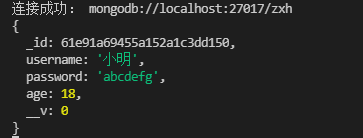

# mongoDB数据库

有关 CRUD（创建、读取、更新、删除）操作的信息， 看：

- [插入文档](https://www.mongodb.com/docs/manual/tutorial/insert-documents/)

- [查询文档](https://www.mongodb.com/docs/manual/tutorial/query-documents/)

- [更新文档](https://www.mongodb.com/docs/manual/tutorial/update-documents/)

- [删除文档](https://www.mongodb.com/docs/manual/tutorial/remove-documents/)

## Node连接MongoDB数据库

### 1.mongodb库连接MongoDB

[MongoDB 中文手册](https://www.mongodb.org.cn/manual/)

官网mongodb示例连接文档：[快速入门 — Node.js (mongodb.com)](https://www.mongodb.com/docs/drivers/node/current/quick-start/)

官方文档以mongodb这个库为例：<https://github.com/mongodb/node-mongodb-native>

npm包地址：[mongodb - npm (npmjs.com)](https://www.npmjs.com/package/mongodb)

菜鸟教程：[Node.js 连接 MongoDB | 菜鸟教程 (runoob.com)](https://www.runoob.com/nodejs/nodejs-mongodb.html)

**操作示例：**

- 安装mongodb库：`npm i mongodb`

- **node使用mongodb库连接上mongodb数据库**

```jsx
const MongoClient = require('mongodb').MongoClient;

// mongoDB数据库的服务地址
const url = 'mongodb://localhost:27017';

// 操作的数据库名称
const mdb = 'stu_db';

// 实例化链接对象
const client = new MongoClient(url);

// 实例对象connect连接数据库
client.connect(function(err, client) {
  if (err) {
    console.log('数据库连接失败....')
  } else {
    console.log('数据库连接成功....')
    const db = client.db(mdb);
    client.close();
  }
})
```

- **stu_db库(集合)中插入数据**

```jsx
const MongoClient = require('mongodb').MongoClient;

// mongoDB数据库的服务地址
const url = 'mongodb://localhost:27017';

// 操作的数据库名称
const mdb = 'stu_db';

// 实例化链接对象
const client = new MongoClient(url);

// 实现插入数据的方法
function insertDocuments(db, callback) {
 // 获取操作数据库的集合
 const collection = db.collection('stu_db');
 // 通过集合对象来插入文档
 collection.insertMany([
   {name: 'Chris',   age: 24, city: '北京市'},
   {name: 'Wilson',  age: 26, city: '南京市'},
   {name: 'Alan',    age: 22, city: '重庆市'},
   {name: 'Jimmy',   age: 21, city: '杭州市'},
   {name: 'Elvis',   age: 20, city: '长沙市'},
   {name: 'Danny',   age: 18, city: '合肥市'},
  ],function(error, result) {
   if (error) {
    console.log('数据插入失败...')
   } else {
     console.log('数据插入成功...');
     callback(result)
   }
 })
}

// 实例对象connect连接数据库
client.connect(function(err) {
  if (err) {
    console.log('数据库连接失败....')
  } else {
    console.log('数据库连接成功....')
    const db = client.db(mdb);
    // 插入数据 
    insertDocuments(db,(res) => {
      console.log(res);
      client.close();
    })

  }
})
```


- **stu_db库(集合)中删除数据**

```jsx
const MongoClient = require('mongodb').MongoClient;

// mongoDB数据库的服务地址
const url = 'mongodb://localhost:27017';

// 操作的数据库名称
const mdb = 'stu_db';

// 实例化链接对象
const client = new MongoClient(url);

// 删除数据
function delDocuments(db, callback) {
  const collection = db.collection('stu_db');
  collection.deleteOne({name:'Elvis'}, function(err, result) {
    if(err) {
      console.log('数据删除失败...')
    } else {
      console.log('数据删除成功...')
      callback(result)
    } 
  })
}

// 实例对象connect连接数据库
client.connect(function(err) {
  if (err) {
    console.log('数据库连接失败....')
  } else {
    console.log('数据库连接成功....')
    const db = client.db(mdb);

    // 删除数据
     delDocuments(db, (res) => {
      client.close();
    }) 

  }
})
```

- **stu_db库(集合)中修改数据**

```jsx
const MongoClient = require('mongodb').MongoClient;

// mongoDB数据库的服务地址
const url = 'mongodb://localhost:27017';

// 操作的数据库名称
const mdb = 'stu_db';

// 实例化链接对象
const client = new MongoClient(url);

// 修改数据
function updateDocuments(db, callback) {
  // 获取操作数据库的集合
  const collection = db.collection('stu_db');
  collection.updateMany(
    {name: 'Alan'},
    {
      $set: {
        name: 'Lison'
      }
    },
    function (err, result) {
      if (err) {
        console.log('数据更新失败...')
      } else {
        console.log('数据更新成功...');
        callback(result)
      } 
    }
  )
}

// 实例对象connect连接数据库
client.connect(function(err) {
  if (err) {
    console.log('数据库连接失败....')
  } else {
    console.log('数据库连接成功....')
    // 更新数据
   updateDocuments(db, (res) => {
      console.log(res);
      client.close();
    })

  }
})
```

- **stu_db库(集合)中查询数据**

```jsx
const MongoClient = require('mongodb').MongoClient;

// mongoDB数据库的服务地址
const url = 'mongodb://localhost:27017';

// 操作的数据库名称
const mdb = 'stu_db';

// 实例化链接对象
const client = new MongoClient(url);

// 查询数据
function findDocuments(db, callback) {
  // 获取操作数据库的集合
  const collection = db.collection('stu_db');
  collection.find({age: 20}).toArray(function(err, result){
    if(err) {
      console.log('数据查询失败...')
    } else {
      console.log('数据查询成功...');
      callback(result)
    }
  })
}

// 实例对象connect连接数据库
client.connect(function(err) {
  if (err) {
    console.log('数据库连接失败....')
  } else {
    console.log('数据库连接成功....')
    const db = client.db(mdb);
    // 查询数据
     findDocuments(db, (res) => {
       console.log(res);
       client.close();
    })

  }
})
```

---

### mongodb库封装使用

数据库连接配置模块：module/config.js

```js
// 数据库连接配置文件
const app = {
  dbUri: 'mongodb://127.0.0.1:27017/',
  dbName: 'koa'
}

module.exports = app;
```

数据库连接模块 + 增删改查方法封装：module/db.js

```js
const { MongoClient, ObjectID } = require("mongodb");
const Config = require("./config.js");

const client = new MongoClient(Config.dbUri);

class Db {
    // 单例：多次实例化不共享的问题(只实例化一次，其他实例化便共享那个实例)
    static getInstance() {
        if (!Db.instance) {
            Db.instance = new Db();
        }
        return Db.instance;
    }

    constructor() {
        /*属性 放db对象*/
        this.dbClient = '';
        /*实例化的时候就连接数据库*/
        this.connect();
    }

    // 连接数据库
    connect() {
        let _that = this;
        return new Promise((resolve, reject) => {
            if (!_that.dbClient) {
                client.connect((err, client) => {
                    if (err) {
                        // console.log('连接错误');
                        reject(err);
                    } else {
                        _that.dbClient = client.db(Config.dbName);
                        console.log('DB连接成功');
                        // console.log('DB连接成功', _that.dbClient);
                        resolve(_that.dbClient);
                    }
                });
            } else {
                resolve(_that.dbClient);
            }
        });
    }

    /**
     * 封装增删改查方法
     */
    find(collectionName, json) {
        return new Promise((resolve, reject) => {
            this.connect().then((db) => {
                var result = db.collection(collectionName).find(json);

                result.toArray(function (err, docs) {
                    if (err) {
                        reject(err);
                        return;
                    }
                    resolve(docs);
                });
            });
        });
    }
    update(collectionName, json1, json2) {
        return new Promise((resolve, reject) => {
            this.connect().then((db) => {
                //db.user.update({},{$set:{}})
                db.collection(collectionName).updateOne(
                    json1,
                    {
                        $set: json2,
                    },
                    (err, result) => {
                        if (err) {
                            reject(err);
                        } else {
                            resolve(result);
                        }
                    }
                );
            });
        });
    }
    insert(collectionName, json) {
        return new Promise((resolve, reject) => {
            this.connect().then((db) => {
                db.collection(collectionName).insertOne(json, function (err, result) {
                    if (err) {
                        reject(err);
                    } else {
                        resolve(result);
                    }
                });
            });
        });
    }

    remove(collectionName, json) {
        return new Promise((resolve, reject) => {
            this.connect().then((db) => {
                db.collection(collectionName).removeOne(json, function (err, result) {
                    if (err) {
                        reject(err);
                    } else {
                        resolve(result);
                    }
                });
            });
        });
    }
    // mongodb里面查询 _id 把字符串转换成对象
    getObjectId(id) {
        return new ObjectID(id);
    }
}

module.exports = Db.getInstance();
```

路由使用：routes/user/users.js

```js
const router = require('koa-router')();
const DB = require('../../module/db.js');

// 路由文档：https://github.com/koajs/router/blob/HEAD/API.md

// 定义路由的前缀：/users
router.prefix('/users')


// 显示用户信息
router.get('/',async (ctx)=>{

  let result = await DB.find('user',{});

  console.log(result);
  await ctx.render('index',{
      list: JSON.stringify(result)
  });
})

// 增加用户
router.get('/add',async (ctx)=>{
  await ctx.render('add');
})


// 执行增加用户的操作
router.post('/doAdd',async (ctx)=>{

  // 获取表单提交的数据

  // console.log(ctx.request.body);  //{ username: '王麻子', age: '12', sex: '1' }

  let data = await DB.insert('user',ctx.request.body);
  //console.log(data);
  try{
      if(data.result.ok){
          ctx.redirect('/')
      }
  }catch(err){
      console.log(err);
      return;
      ctx.redirect('/add');
  }
})

// 编辑用户
router.get('/edit',async (ctx)=>{
  // 通过get传过来的id来获取用户信息
  let id = ctx.query.id;

  let data = await DB.find('user',{"_id":DB.getObjectId(id)});

  // 获取用户信息
  await ctx.render('edit',{
      list:data[0]
  });

})


router.post('/doEdit',async (ctx)=>{
  // 通过get传过来的id来获取用户信息
  // console.log(ctx.request.body);

  var id = ctx.request.body.id;
  var username = ctx.request.body.username;
  var age = ctx.request.body.age;
  var sex = ctx.request.body.sex;

  let data = await DB.update('user',{"_id":DB.getObjectId(id)},{
      username,age,sex
  })

  try{
      if(data.result.ok){
          ctx.redirect('/')
      }
  }catch(err){
      console.log(err);
      return;
      ctx.redirect('/');
  }

})


// 删除用户
router.get('/delete',async (ctx)=>{

  let id = ctx.query.id;

  var data = await DB.remove('user',{"_id":DB.getObjectId(id)});
  console.log(data);
  if(data){
      ctx.redirect('/')
  }
})

module.exports = router
```

应用路由方法：app.js

```js
// routes路由
const index = require('./routes/index');
const users = require('./routes/user/users');

/** 
 * 将routes路由对象，挂载到app对象中
 * allowedMethods()方法：router.allowedMethods()用在了路由匹配 router.routes()之后，当所有 路由中间件最后调用.的时候，根据 ctx.status 设置 response 响应头，当请求出错时的处理逻辑
*/
app.use(index.routes(), index.allowedMethods());
app.use(users.routes(), users.allowedMethods());
```

---

### 2.mongoose对象模型工具库连接MongoDB

使用mongoose连接MongoDB数据库-npm包：[mongoose - npm (npmjs.com)](https://www.npmjs.com/package/mongoose)

mongodb官网文档：[https://mongoosejs.com/](https://mongoosejs.com/)  

中文网文档：[http://www.mongoosejs.net/](http://www.mongoosejs.net/)

#### 抽象模型对应：一层层包含 --> schema包含model，model包含entitv

| MongoDB     | MySQL       | Mongoose |
|:-----------:|:-----------:|:--------:|
| database    | database    | database |
| collection  | table       | schema   |
| document    | row         | model    |
| field       | column      | entity   |
| index       | index       | methods  |
| primary key | primary key | statics  |
| 无           | table join  | virtual  |

#### 1、安装 mongoose

```bash
npm install mongoose
```

#### 2、引用

```javascript
const mongoose = require('mongoose');
```

#### 3、创建js文件用于连接MongoDB数据库

```javascript
// 引入mongoose
const mongoose = require('mongoose');
// 定义字符串常量
const uri = "mongodb://localhost:27017/test" // test是数据库名字
// 1.连接数据库
mongoose.connect(uri, { useNewUrlParser:true, useUnifiedTopology:true }) 
// 2.连接成功
mongoose.connection.on('connected', () => {
    console.log('连接成功：', db_url);
})
// 3.连接失败
mongoose.connection.on('error', (err) => {
    console.log('连接错误：', err);
})
// 4.断开连接
mongoose.connection.on('disconnection', () => {
    console.log('断开连接');
})
module.exports = mongoose;
```

### 3.实现增删改查(CURD)操作

#### 1、插入数据

定义UserSchema：设计文档结构

参考教程：[mongoose - npm (npmjs.com)](https://www.npmjs.com/package/mongoose)

```javascript
const mongoose = require('mongoose')
const bcrypt = require('bcrypt')

const SALT_WORK_FACTOR = 10
const MAX_LOGIN_ATTEMPTS = 5
const LOCK_TIME = 2 * 60 * 60 * 1000
// 
const Schema = mongoose.Schema
// 定义Schema
const UserSchema = new Schema({
  // user admin superAdmin
  role: {
    type: String,
    default: 'user'
  },
  username: String,
  password: String,
  email: String,
  age: Number,
  hashed_password: String,
  loginAttempts: {
    type: Number,
    required: true,
    default: 0
  },
  lockUntil: Number,
  meta: {
    createdAt: {
      type: Date,
      default: Date.now()
    },
    updatedAt: {
      type: Date,
      default: Date.now()
    }
  }
})

// 登录机制保护方法：判断是否到可以登录得时限
UserSchema.virtual('isLocked').get(function () {
  return !!(this.lockUntil && this.lockUntil > Date.now())
})

// .pre保存前的中间件middleware处理事件
UserSchema.pre('save', function (next) {
  if (this.isNew) {
    this.meta.createdAt = this.meta.updatedAt = Date.now()
  } else {
    this.meta.updatedAt = Date.now()
  }

  next()
})

// 密码保存
UserSchema.pre('save', function (next) {
  let user = this
  // 如果没有修改密码
  if (!user.isModified('password')) return next()
  // 重新加密 密码
  bcrypt.genSalt(SALT_WORK_FACTOR, (err, salt) => {
    if (err) return next(err)

    bcrypt.hash(user.password, salt, (error, hash) => {
      if (error) return next(error)

      user.password = hash
      next()
    })
  })
})

// 添加Schema的实例方法
UserSchema.methods = {
  // 密码的比较方法
  comparePassword: function (_password, password) {
    return new Promise((resolve, reject) => {
      bcrypt.compare(_password, password, function (err, isMatch) {
        if (!err) resolve(isMatch)
        else reject(err)
      })
    })
  },
  // 登录机制保护方法：密码错误多少次超限，实现账户锁定
  incLoginAttempts: function (user) {
    const that = this

    return new Promise((resolve, reject) => {
      if (that.lockUntil && that.lockUntil < Date.now()) {
        that.update({
          $set: {
            loginAttempts: 1
          }, 
          $unset: {
            lockUntil: 1
          }
        }, function (err) {
          if (!err) resolve(true)
          else reject(err)
        })
      } else {
        let updates = {
          $inc: {
            loginAttempts: 1
          }
        }

        if (that.loginAttempts + 1 >= MAX_LOGIN_ATTEMPTS && !that.isLocked) {
          updates.$set = {
            lockUntil: Date.now() + LOCK_TIME
          }
        }

        that.update(updates, err => {
          if (!err) resolve(true)
          else reject(err)
        })
      }
    })
  }
}

// 将文档结构发布为模型
const UserModel = mongoose.model('UserModel', UserSchema)
```

其中，mongoose.model 方法就是用来将一个架构发布为 model; 其中：

> 第一个参数：传入一个大写名词单数字符串用来表示你的数据库名称，其中，mongoose会自动将大写名词的字符串生成小写复数的集合名称，例如这里的UserModel最终会变成 usermodels 集合名称。  
> 第二个参数：架构 Schema  
> 返回值：模型构造函数

3）插入数据(Model.save([fn]))：

```javascript
const mongoose = require('mongoose')
const UserModel = mongoose.model('UserModel')

//创建模型
let Model = new UserModel({
    username:'小明',
    password:'123456',
    age:18
})
//2.同模型的sava([fn]),保存模型到数据库中
Model.save((err,res) => {
    if(err){
        console.log('保存失败：',err);
    }else{
        console.log(res);
    }
})
```

打开mongo 数据库，可以看到数据被插入进去（便于后续操作，于是多添加了几条数据）  

#### 2、更新数据

```javascript
Model.updateOne(conditions, doc, [options], [callback])
```

> conditions: 更新的条件，该值是一个对象。  
> doc： 需要更新的内容，该值也是一个对象。  
> options：可选参数，它有如下属性：  
> safe ：（布尔型）安全模式（默认为架构中设置的值（true））  
> upsert ：（boolean）如果不匹配，是否创建文档（false）  
> multi ：（boolean）是否应该更新多个文档（false）  
> runValidators：如果为true，则在此命令上运行更新验证程序。更新验证器根据模型的模式验证更新操作。  
> strict：（布尔）覆盖strict此更新的选项  
> overwrite： （布尔）禁用只更新模式，允许您覆盖文档（false）  
> callback: 回调函数

```javascript
function update(){
     //找到更新的数据
     let  where_str = { 'username' : '小明'};
     //更新后的数据
     let update_str = { 'password' : 'abcdefg'};   
     UserModel.updateOne(where_str,update_str,function(err,res){
        if(err){
            console.log('更新失败：',err);
        }else{
            console.log(res);
        }
    })
}
update() //调用更新函数
```


密码成功更改！  

第二种更新方法  

2）更新并返回数据：终端返回更新前的所有数据，数据库响应更新后的数据

```javascript
Model.findOneAndUpdate([(conditions, doc, [options], [callback])]
```

> conditions： 第一个参数是一个对象参数，是用于查询与之相匹配的数据用的  
> doc：第二个参数也是一个对象参数，用于修改查询到的数据中的某条信息  
> options：第三个参数也是一个对象参数，主要用于设定匹配数据与更新数据的一些规定，比较复杂，一般用不到  
> callback：第四个参数也就是我们最熟悉的回调函数，函数默认传入两个参数,err、data。当数据库发生错误的时候传回一个err，若数据库正常，err为空；当正常根据第一个参数查询到相关数据并成功修改了我们设定的数据，data返回修改前的数据信息，若根据第一个参数没有查询到相关数据，data为null

```javascript
UserModel.findOneAndUpdate({
        username: '小张'
    },{
        $set: {
            password: 'aaaaaaaaaa'
        }
    },{},function(err,data){
        if(err){
            console.log("更新错误!");
        }
        else if(!data) {
            console.log("未找到数据！");
            console.log(data);
        }
        else if(data) {
            console.log("更新成功!");
            console.log(data);
        }
    })
```

看终端打印结果：为更改前的数据  
  
数据库中返回的数据为更改后的密码  


#### 3、查询数据

```javascript
//查询所有
UserModel.find(function(err,data){
  if(err){
      console.log(err)
  }else{
      console.log(data)
  }
})
```


```javascript
//按id查询
UserModel.findById({_id:"61e91a69455a152a1c3dd150"},function(err,data){
    if(err){
        console.log(err)
    }else{
        console.log(data);
    }
})
```



```javascript
//记录数查询
UserModel.countDocuments(function(err,data){
        if(err){
            console.log(err)
        }else{
            console.log("记录数："+data);
        }
    })
```


#### 4、删除数据

```javascript
UserModel.deleteOne({
       username: '小张'
   },{},function(err,data){
       if(err){
           console.log('删除错误!');
       }
       else if(!data) {
           console.log("未找到数据！");
           console.log(data);
       }
       else if(data) {
           console.log("删除成功!");
           console.log(data);
       }
   })
```

  

查看数据库，成功删除小张信息。  


#### 5.排序

排序 使用 sort() 方法，该方法接受一个参数，规定是升序(1)还是降序(-1)

{ type: 1 }  // 按 type 字段升序
{ type: -1 } // 按 type 字段降序

```js
var MongoClient = require('mongodb').MongoClient;
var url = "mongodb://localhost:27017/";
 
MongoClient.connect(url, { useNewUrlParser: true }, function(err, db) {
    if (err) throw err;
    var dbo = db.db("runoob");
    var mysort = { type: 1 };
    dbo.collection("site").find().sort(mysort).toArray(function(err, result) {
        if (err) throw err;
        console.log(result);
        db.close();
    });
});
```

#### 6.连接集合

##### 使用  $lookup 来实现左连接

```js
var MongoClient = require('mongodb').MongoClient;
var url = "mongodb://127.0.0.1:27017/";
 
MongoClient.connect(url, { useNewUrlParser: true }, function(err, db) {
  if (err) throw err;
  var dbo = db.db("runoob");
  dbo.collection('orders').aggregate([
    { $lookup:
       {
         from: 'products',            // 右集合
         localField: 'product_id',    // 左集合 join 字段
         foreignField: '_id',         // 右集合 join 字段
         as: 'orderdetails'           // 新生成字段（类型array）
       }
     }
    ]).toArray(function(err, res) {
    if (err) throw err;
    console.log(JSON.stringify(res));
    db.close();
  });
});
```

##### 有两个集合数据分别为

集合1：orders

```js
var MongoClient = require('mongodb').MongoClient;
var url = "mongodb://localhost:27017/";

let obj = { _id: 1, product_id: 154, status: 1 }
MongoClient.connect(url, { useNewUrlParser: true }, function(err, db) {
    if (err) throw err;
    var dbo = db.db("laochen");
    dbo.collection("orders").insertOne(obj, function(err, res) {
        if (err) throw err;
        console.log("文档插入成功");
        db.close();
    });
});
```

集合2：products

````js
var MongoClient = require('mongodb').MongoClient;
var url = "mongodb://localhost:27017/";
 
MongoClient.connect(url, { useNewUrlParser: true }, function(err, db) {
    if (err) throw err;
    var dbo = db.db("user");
    var myobj =  [
      { _id: 154, name: '笔记本电脑' },
      { _id: 155, name: '耳机' },
      { _id: 156, name: '台式电脑' }
    ];
    dbo.collection("products").insertMany(myobj, function(err, res) {
        if (err) throw err;
        console.log("插入的文档数量为: " + res.insertedCount);
        db.close();
    });
});
````

#### 7.删除集合

使用  drop()  方法来删除集合：

```js
var MongoClient = require('mongodb').MongoClient;
var url = "mongodb://localhost:27017/";
 
MongoClient.connect(url, { useNewUrlParser: true }, function(err, db) {
    if (err) throw err;
    var dbo = db.db("laochen");
    // 删除 test 集合
    dbo.collection("user").drop(function(err, delOK) {  // 执行成功 delOK 返回 true，否则返回 false
        if (err) throw err;
        if (delOK) console.log("集合已删除");
        db.close();
    });
});
```

