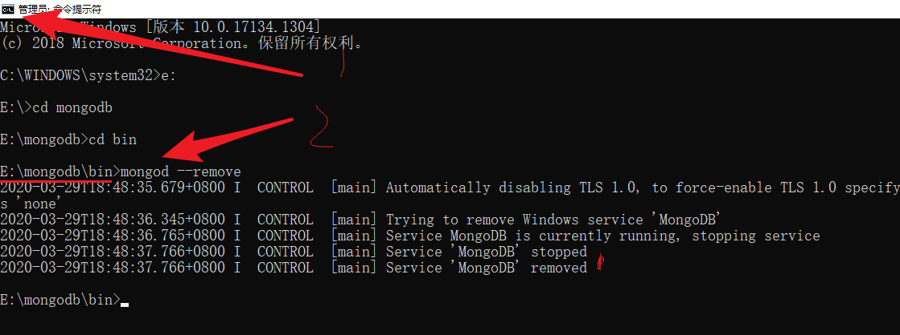
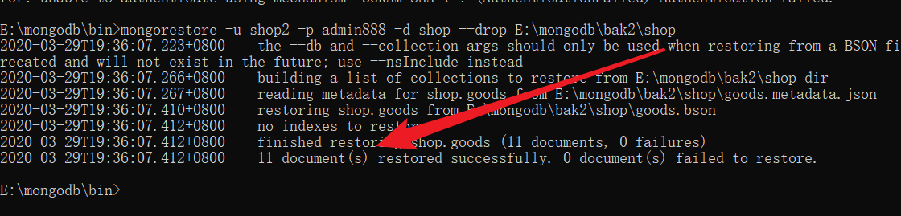

# MongoDB 高级

官方文档首页：[MongoDB 文档](https://www.mongodb.com/docs/)

MongoDB 高级文档：[入门 — MongoDB 手册](https://www.mongodb.com/docs/manual/tutorial/getting-started/)

## ■MongoDB 排序&分页

### 明确需求

数据库，是用来存放数据的

咱们后期从数据库获取数据 需要排序 、多页展示如何实现？


### 准备

```bash
use test3
db.c1.insert({_id:1,name:"a",sex:1,age:1})
db.c1.insert({_id:2,name:"a",sex:1,age:2})
db.c1.insert({_id:3,name:"b",sex:2,age:3})
db.c1.insert({_id:4,name:"c",sex:2,age:4})
db.c1.insert({_id:5,name:"d",sex:2,age:5})

db.c1.find()
```

### 排序

- 语法：db.集合名.find().sort(JSON 数据)

- 说明：键-就是要排序的列/字段、值：1 升序 -1 降序

- 练习：年龄升序&降序

> 

### Limit 与 Skip 方法

- 语法：db.集合名.find().sort().skip(数字).limit(数字)
- 说明：skip 跳过指定数量（可选），limit 限制查询的数量
- 练习：1-降序查询查询 2 条，2-降序跳过 2 条并查询 2 条

> 

### 实战分页

需求：数据库 1 - 10 数据，每页显示两条（5 页）

语法：db.集合名.find().skip().limit(2)

```bash
skip计算公式：（当前页 - 1） * 每页显示条数

1页    1  2        0
2页    3  4        2
3页    5  6        4
4页    7  8        6
5页    9  10        8
```

### 小总结

db.集合名.find()

.sort({列: 1/-1})排序

.skip(数字) 跳过指定数量

.limit(数字)限制查询条数

.count() 统计总数量

不够：百度或谷歌

## ■MongoDB 聚合查询

### 明确相关需求


思考：如何统计数据、如何实现分组统计等？

回答：通过 MongoDB 聚合查询

### 概念

聚合查询

顾名思义就是把数据聚起来，然后统计

### 语法(略复杂

语法

```bash
db.集合名称.aggregate([
    {管道:{表达式}}
     ....
])
```

常用管道

```bash
$group 将集合中的文档分组，用于统计结果
$match 过滤数据，只要输出符合条件的文档
$sort  聚合数据进一步排序
$skip  跳过指定文档数
$limit 限制集合数据返回文档数
....
```

常用表达式

```bash
$sum  总和  $sum:1同count表示统计
$avg  平均
$min  最小值
$max  最大值
...
```

### 查询前准备

```bash
use test4
db.c1.insert({_id:1,name:"a",sex:1,age:1})
db.c1.insert({_id:2,name:"a",sex:1,age:2})
db.c1.insert({_id:3,name:"b",sex:2,age:3})
db.c1.insert({_id:4,name:"c",sex:2,age:4})
db.c1.insert({_id:5,name:"d",sex:2,age:5})
```

|     |     | 统计 |
| --- | --- | ---- |
|     |     |      |
|     |     |      |
|     |     |      |

### 练习

- 统计男生、女生的总年龄

> ```bash
> db.c1.aggregate([
>     {
>         $group:{
>             _id: "$sex",
>             rs: {$sum: "$age"}
>         }
>     }
> ])
> ```
>
> 

- 统计男生、女生的总人数

> ```bash
> db.c1.aggregate([
>     {
>         $group:{
>             _id: "$sex",
>             rs: {$sum:1}
>         }
>     }
> ])
> ```
>
> 

- 求学生总数和平均年龄

> ```bash
> db.c1.aggregate([
>     {
>         $group:{
>             _id: null,
>             total_num: {$sum:1},
>             total_avg: {$avg: "$age"}
>         }
>     }
> ])
> ```
>
> 

- 查询男生、女生人数，按人数升序

> ```bash
> db.c1.aggregate([
>     {$group:{_id: "$sex",rs: {$sum: 1}}},
>     {$sort:{rs: -1}}
> ])
> ```
>
> 

## ■MongoDB 优化索引

### 生活中的索引


### 数据库中的索引

- 说明：索引是一种排序好的便于快速查询的数据结构

- 作用：帮助数据库高校的查询数据


### 索引优缺点

- 优点

> 提高数据查询的效率，降低数据库的 IO 成本
> 通过索引对数据进行排序，降低数据排序的成本，降低 CPU 的消耗

- 缺点

> 占用磁盘空间
> 大量索引影响 SQL 语句效率，因为每次插入和修改数据都需要更新索引

### 语法

- 创建索引语法：db.集合名.createIndex(待创建索引的列 [,额外选项])
- 参数：

> 待创建索引的列：{键:1,...,键:-1}
> 说明：1 升序 -1 降序 例如{age:1}表示创建 age 索引并按照升序的方式存储
> 额外选项：设置索引的名称或者唯一索引等等

- 删除索引语法：

> 全部删除：db.集合名.dropIndexes()
>
> 删除指定：db.集合名.dropIndex(索引名)

- 查看索引语法：db.集合名.getIndexes()

### 删除练习

**准备**：向数据库中新增十万条数据

> ```bash
> //选择数据库
> use test5;
> //向数据库中添加数据
> for(var i=0;i<100000;i++){
> db.c1.insert({'name':"aaa"+i,"age":i});
> }
> ```

**创建普通索引**：

> 需 求：给 name 添加普通索引
>
> 练习 1：给 name 添加普通索引，命令：db.c1.createIndex({name:1})
>
> 
>
> 练习 2：删除 name 索引，命令：db.c1.dropIndex('name_1')
>
> 
>
> 练习 3：给 name 创建索引并起名 webopenfather
>
> 命令：db.c1.createIndex({name:1}, {name: "webopenfather"})
>
> 

**创建复合/组合索引**：

> 需求：给 name 和 age 添加组合索引
>
> 说明：就是一次性给两个字段建立索引
>
> 语法：db.集合名.createIndex({键 1:方式,键 2:方式})
>
> 

**创建唯一索引**：

> 需 求：给 name 添加普通索引
>
> 语 法：db.集合名.createIndex(待添加索引的列， {unique: 列名})
>
> 练习 1：删除全部索引，命令：db.c1.dropIndexes();
>
> 
>
> 练习 2：设置唯一索引，命令：db.c1.createIndex({name:1}, {unique: "name"})
>
> 
>
> 练习 3：测试唯一索引特性，
>
> 命 令：
> db.c1.insert({name: "a"});
> db.c1.insert({name: "a"});
>
> 

### 分析索引（explain）

- 语法：db.集合名.find().explain('executionStats')

- 说明：

> 
> COLLSCAN 全表扫描
> IXSCAN 索引扫描
> FETCH 根据索引去检索指定 document

- 练习

> 测试：age 未添加索引情况
> 语法：db.c1.find({age:18}).explain('executionStats');
>
> 
>
> 测试：age 添加索引情况
> 语法：db.c1.createIndex({age: 1})
> 继续：db.c1.find({age:18}).explain('executionStats')
> 

### 选择规则（如何选择合适的列创建索引）

-为常做条件、排序、分组的字段建立索引 -选择唯一性索引 （ps. 同值较少如性别字段） -选择较小的数据列，为较长的字符串使用前缀索引 （ps. 索引文件更小）

## ■MongoDB 权限机制

### 明确需要添加索引的需求

发现我们再 DOS 窗口直接输入命令就可以登录数据库

这在实战工作中绝对不允许的

思考：如何解决

回答：使用权限机制，开启验证模式即可

### 语法(略难

创建账号

```bash
db.createUser({
    "user" : "账号",
    "pwd": "密码",
    "roles" : [{
        role: "角色",
        db: "所属数据库"
    }]
})
```

角色

```bash
#角色种类
超级用户角色：root
数据库用户角色：read、readWrite;
数据库管理角色：dbAdmin、userAdmin；
集群管理角色：clusterAdmin、clusterManager、clusterMonitor、hostManager；
备份恢复角色：backup、restore；
所有数据库角色：readAnyDatabase、readWriteAnyDatabase、userAdminAnyDatabase、dbAdminAnyDatabase

#角色说明
root：只在admin数据库中可用。超级账号，超级权限；
read：允许用户读取指定数据库；
readWrite：允许用户读写指定数据库；
dbAdmin：允许用户在指定数据库中执行管理函数，如索引创建、删除，查看统计或访问system.profile；
dbAdminAnyDatabase：只在admin数据库中可用，赋予用户所有数据库的dbAdmin权限；
clusterAdmin：只在admin数据库中可用，赋予用户所有分片和复制集相关函数的管理权限；
userAdmin：允许用户向system.users集合写入，可以找指定数据库里创建、删除和管理用户；
userAdminAnyDatabase：只在admin数据库中可用，赋予用户所有数据库的userAdmin权限；
readAnyDatabase：只在admin数据库中可用，赋予用户所有数据库的读权限；
readWriteAnyDatabase：只在admin数据库中可用，赋予用户所有数据库的读写权限；
```

### 开启验证模式

**开启验证模式概念**： 名词，指用户需要输入账号密码才能登陆使用

**操作步骤**：

```bash
1. 添加超级管理员
2. 退出卸载服务
3. 重新安装需要输入账号密码的服务（注在原安装命令基础上加上--auth即可
4. 启动服务 -> 登陆测试
```

**步骤 1：添加超级管理员**：

> mongo
>
> ```bash
> use admin
>
> db.createUser({
>     "user" : "admin",
>     "pwd": "admin888",
>     "roles" : [{
>         role: "root",
>         db: "admin"
>     }]
> })
> ```
>
> 脚下留心：2.x 3.x 4.x 前面版本默认是看不到 admin 没关系 你直接选中即可

**步骤 2：退出卸载服务**：

> ```bash
> bin\mongod --remove
> ```
>
> 脚下留心：DOS 窗口必须用管理员省份运行
>
> 

**步骤 3：安装需要身份验证的 MongoDB 服务**：

> ```bash
> bin\mongod --install --dbpath E:\mongodb\data --logpath E:\mongodb\logs\mongodb2.log --auth
> ```
>
> 

**步骤 4：启动服务 -> 登录测试**：

> 

### 通过超级管理员账号登陆

- 方法 1：mongo 服务器 IP 地址:端口/数据库 -u 用户名 -p 密码

> 
>
> 

- 方法 2：a-先登录，b-选择数据库，c-输入 db.auth(用户名,密码)

> 

### 管理员权限练习

- **需求**

> 添加用户 shop1 可以读 shop 数据库
> 添加用户 shop2 可以读写 shop 数据库
> 脚下留心：必须在对应数据库创建用户

- **准备：**创建测试数据和测试用户（注：选择 shop 仓库创建用户）

> ```bash
> use shop;
> for(var i=1; i<=10; i++){
>     db.goods.insert({"name":"goodsName"+i,"price":i});
> }
> ```

- **添加用户并设置权限**

> ```bash
> //切记
> use shop
>
> //shop1
> db.createUser({
>     "user" : "shop1",
>     "pwd": "admin888",
>     "roles" : [{
>         role: "read",
>         db: "shop"
>     }]
> })
>
> //shop2
> db.createUser({
>     "user" : "shop2",
>     "pwd": "admin888",
>     "roles" : [{
>         role: "readWrite",
>         db: "shop"
>     }]
> })
> ```

- **验证：shop1 可读**

> 

- **验证：shop2 验证可读可写**

> 

## ■MongoDB 备份还原

### 明确数据库备份的需求

在实战工作中一定要做好数据库备份工作

否则万一数据丢失

带来的影响是巨大的

### 备份数据库 mongodump

- **语法**

> ```bash
> 导出数据语法：mongodump -h -port -u -p -d -o
> 导出语法说明
> -h         host  服务器IP地址（一般不写 默认本机
> -port           端口（一般不写 默认27017
> -u     user   账号
> -p      pwd   密码
> -d  database  数据库（留心：数据库不写则导出全局
> -o     open   备份到指定目录下
> ```

- **练习(备份所有数据)**：mongodump -u admin -p admin888 -o E:\mongodb\bak

> 

- **练习(备份指定数据)**：mongodump -u admin -p admin888 -d shop -o E:\mongodb\bak2

> 

### 还原数据库 mongorestore

- **语法：**

> ```bash
> 还原数据语法：mongorestore -h -port -u -p  -d --drop 备份数据目录
> 还原数据说明：
> -h
> -port
> -u
> -p
> -d       不写则还原全部数据库
> --drop   先删除数据库再导入
> ```

- **练习(还原所有数据)**：mongorestore -u admin -p admin888 --drop E:\mongodb\bak

> 
>
> 
>
> 
>
> 

- **练习(还原指定数据)**：mongorestore -u shop2 -p admin888 -d shop --drop E:\mongodb\bak2\shop

> 
>
> 
