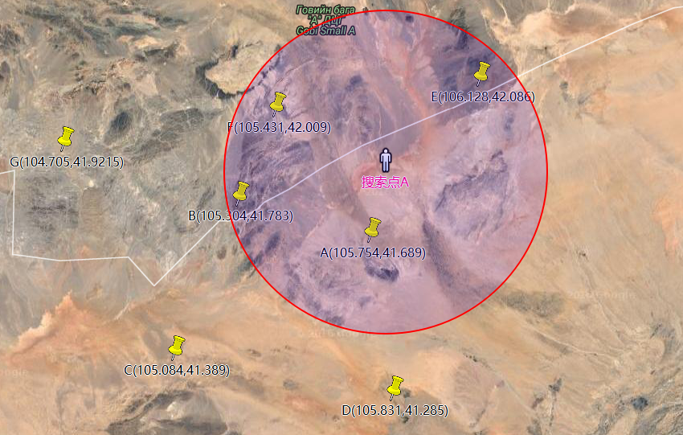

### 准备开始

---

#### MongoDB

- 一个数据库对应多个集合

  - 一个集合对应多个文档对象
  - 在 mongo 中不论是 db 还是集合，你都无需去创建他
  - 直接就当他已经存在，直接 Use 来使用
    - use db 名称;
      - 接着会被切换到该 db 中
      - `db.要创建的集合名称.save({})`;这样集合就被创建了

- **解决 32 位异常**
  mongod --dbpath="路径" --journal --storageEngine=mmapv1

- 1:启动服务器
  - `mongod --dbpath "D:/mongodb/db"` // 目录一定要存在自己创建随便名称‘
    - 尽量设置在非系统盘 `C盘生成目录是需要权限的`
  - 如果看到`waiting for connections on port 27017`说明服务已经启动
- 客户端连接服务器**另开一个命令行**
  - `mongo` 默认连接的是 test 数据库
- 查询有哪些数据库
  - 查询数据库：`show dbs;`
  - 切换数据库: `use 数据库名;`
- 查询当前 db 下有哪些集合
  - `show collections;`
- 查询数据：
  - `db.集合名.find();` //查询出来的是文档对象 document
  - `db.users.find();`
- 添加数据:
  - `db.集合名.save(对象)` //mongo 默认会给我们加入\_id 作为该文档对象的唯一标识
  - `db.users.save({contry:'中国',name:'小明',score:77});`
- 删除数据:
  - `db.集合名.remove(条件对象);`//条件匹配就会被删除
  - `db.users.remove({name:'小明'});`
  - 如果给定一个空对像，会匹配全部
- 更新数据:
  - `db.集合名.update({匹配条件对象},{$set:{修改后的对象}});`
  - `db.users.update({name:'小明'},{$set:{contry:'印度'}});;`

#### 条件查询

```
练习：
  查询姓名为小明的学生
        db.users.find({name:'小明'});;   查询英语成绩大于90分的同学
        db.users.find({score:{$gt:90}}); //查找成绩大于90分$gt
        //$lt小于
 查询数学成绩不等于88的同学
        db.users.find({score:{$ne:88}});   查询总分大于200分的所有同学
        db.users.find({score:{$gt:200}});
```

#### 分页

- `db.users.find().skip(3).limit(3);`
- db.集合名称.find().跳到 3.显示 3 条 + limit 0,3

#### 排序

- `db.users.find().sort({key:排序方式});`
- `db.users.find().sort({'score':1});` //正数代表升序，负数代表降序

#### 模糊匹配

- `db.users.find({name:{$regex:'小'}});`
- `db.users.find({name:{$regex:'明'}});`

#### 聚合函数

- 需要求当前集合的记录数：
- `db.users.find().count();`
- 求最大值 -求整个集合的总成绩 + db.集合名.聚合({ 组的划分规则{\_id:'1',显示内容:{$sum:'$score'}} })
  - 求所有人的平均分
    - `db.users.aggregate({$group:{_id:'1',sumscore:{$avg:'$score' } }});`
  - 求按国家分组，求所有国家的总分
    - `db.users.aggregate({$group:{_id:'$contry',sumScore:{$sum:'$score'}}});`
- 添加基础数据:
  db.users.save({contry:'中国',name:'小明',score:77});
  db.users.save({contry:'中国',name:'小红',score:88});
  db.users.save({contry:'中国',name:'小张',score:99});
  db.users.save({contry:'美国',name:'jack',score:45});
  db.users.save({contry:'美国',name:'rose',score:67});
  db.users.save({contry:'美国',name:'mick',score:89});

#### 联合查询

```js
db.orders.insert([
	{ _id: 1, item: "almonds", price: 12, quantity: 2 },
	{ _id: 2, item: "pecans", price: 20, quantity: 1 },
	{ _id: 3 },
]);
db.inventory.insert([
	{ _id: 1, sku: "almonds", description: "product 1", instock: 120 },
	{ _id: 2, sku: "bread", description: "product 2", instock: 80 },
	{ _id: 3, sku: "cashews", description: "product 3", instock: 60 },
	{ _id: 4, sku: "pecans", description: "product 4", instock: 70 },
	{ _id: 5, sku: null, description: "Incomplete" },
	{ _id: 6 },
]);
db.orders.aggregate([
	{
		$lookup: {
			from: "inventory",
			localField: "item",
			foreignField: "sku",
			as: "inventory_docs",
		},
	},
]);
```

#### 操作符

- https://docs.mongodb.com/manual/reference/operator/

#### 配置 https

- 公钥 公开的加密方式
- 私钥 存在服务器的唯一解公钥加密的方式
- 签名 确保数据的一致性
- 证书 确保当前发送数据单位可信

#### 扩展知识（使用 mongodb 实现附近的人）



```js
// 创建索引
db.test.createIndex({ sp: "2dsphere" });

db.test.insert({
	name: "A",
	sp: { type: "Point", coordinates: [105.754, 41.689] },
});
db.test.insert({
	name: "B",
	sp: { type: "Point", coordinates: [105.304, 41.783] },
});
db.test.insert({
	name: "C",
	sp: { type: "Point", coordinates: [105.084, 41.389] },
});
db.test.insert({
	name: "D",
	sp: { type: "Point", coordinates: [105.831, 41.285] },
});
db.test.insert({
	name: "E",
	sp: { type: "Point", coordinates: [106.128, 42.086] },
});
db.test.insert({
	name: "F",
	sp: { type: "Point", coordinates: [105.431, 42.009] },
});
db.test.insert({
	name: "G",
	sp: { type: "Point", coordinates: [104.705, 41.921] },
});
```

#### 查找附近的人

```js
db.test.find({
	sp: {
		$nearSphere: {
			$geometry: {
				type: "Point",
				coordinates: [105.304, 41.783],
			},
			$minDistance: 25000,
			$maxDistance: 40000,
		},
	},
});
```

#### 离我最近

```js
db.test.aggregate({
	$geoNear: {
		near: { type: "Point", coordinates: [105.304, 41.783] },
		distanceField: "dist.calculated",
		spherical: true,
		maxDistance: 40000,
	},
});
```

经纬度查询网站

- http://www.gpsspg.com/maps.htm
