# MySQL 下载安装和配置

## MySQL Community Server 下载

1.下载地址：[MySQL :: MySQL Community Downloads](https://dev.mysql.com/downloads/)

2.找到 MySQL Community Server(默认是最新版本，且是 zip 压缩格式)：[MySQL :: Download MySQL Community Server](https://dev.mysql.com/downloads/mysql/)

2.1 最新版本 msi 安装包格式-点击 ‘’Go to Download Page‘ 的图片：下载最大的 msi 安装包

3.如果要下载 5.7 版本，找到并点击右边文字连接：[Looking for previous GA versions?](https://dev.mysql.com/downloads/mysql/5.7.html)

3.1 版本 5 msi 安装包格式也是-点击 ‘’Go to Download Page‘ 的图片：下载最大的 msi 安装包

中科大 Mysql 镜像：[Index of /mysql-ftp/Downloads/ (ustc.edu.cn)](http://mirrors.ustc.edu.cn/mysql-ftp/Downloads/)

## 安装

### windows 安装

双击运行 mysql-installer-community-xxx.msi

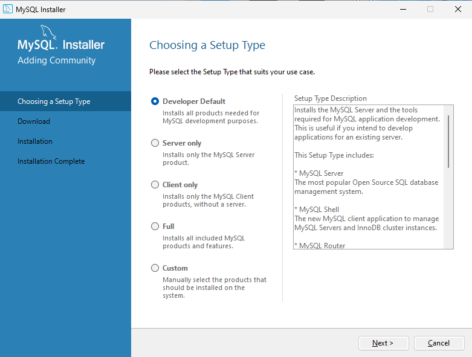

#### 安装界面代表

- “Developer Default”是开发者默认

- “Server only”仅作为服务器安装

- “Client only”仅作为客户端安装

- “Full”是完整安装

- “Custom”是自定义安装

这里选择是 “Developer Default”是开发者默认，点击“Next”

来的第二个界面

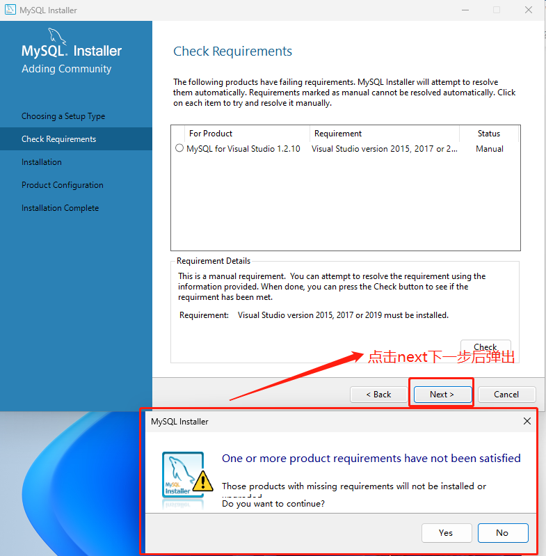

点击下一步弹出弹窗，再点击 Yes

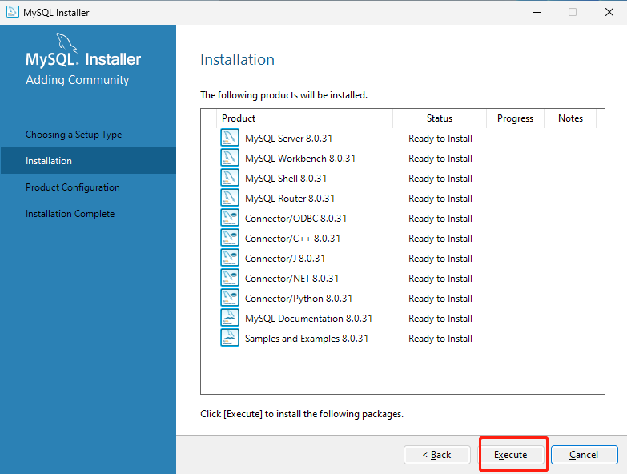

点击  `Excute`，安装 MySQL 的相关组件，这个过程可能需要耗时几分钟

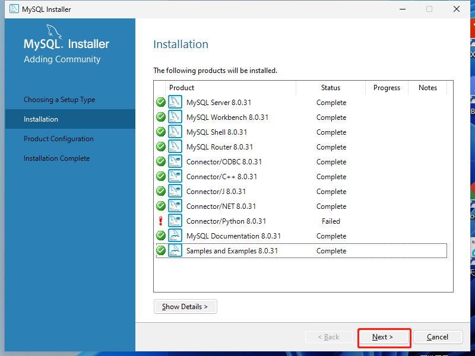

安装完成全部组件后，点击  `next`

后面一路`next`

来到`Accounts and Roles`页面

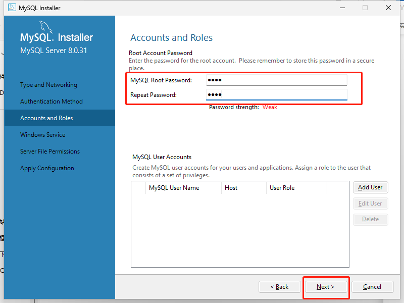

输入 MySQL 的 root 密码，谨记，设置完密码之后点击  `next`

`next`到最后 `Apply Configuration` 页面，

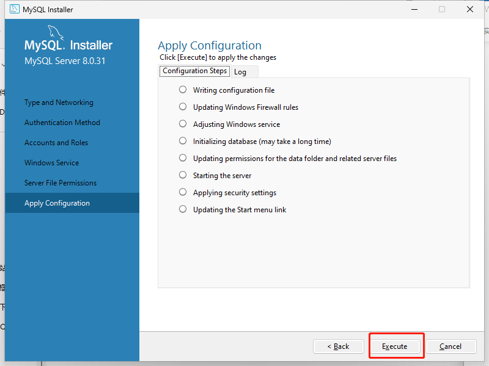

点击  `Execute` ，安装相关依赖包

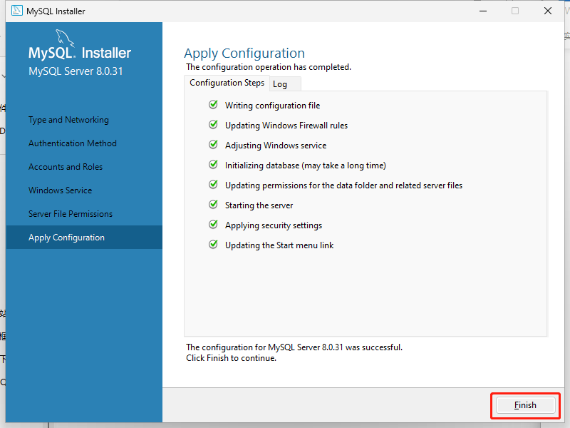

相关组件和设置完成安装，点击`Finish`回到初始安装页

配置向导，如果不用配置就选择`Cancel`，需要配置向导就选择 `next`

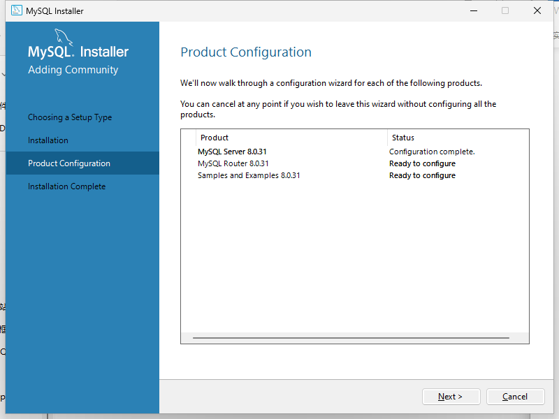

如果这里选择`Cancel`，弹出弹窗，选择`Yes`，至此，安装完成

如果是点击`next`，后面需要**输入用户名和密码**，点击`check`，检查是否正确。

成功了`next`才可点击

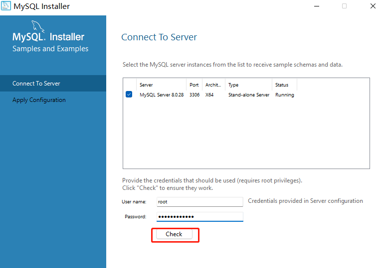

后面还需要 Execute 安装相关

最后`Finish`完成

## MySQL 启动

MySQL 安装完成之后会自动注册为系统服务，默认为启动状态，而且是开机自启的。

如果想要停止 MySQL 可通过  `win + R`  打开运行，输入  `services.msc`  找到  `MySQL`  进行停止。

或者通过指令（需要以管理员的身份执行）去操作：

启动：`net start mysql80`  
停止：`net stop mysql80`.

1.查找 cmd

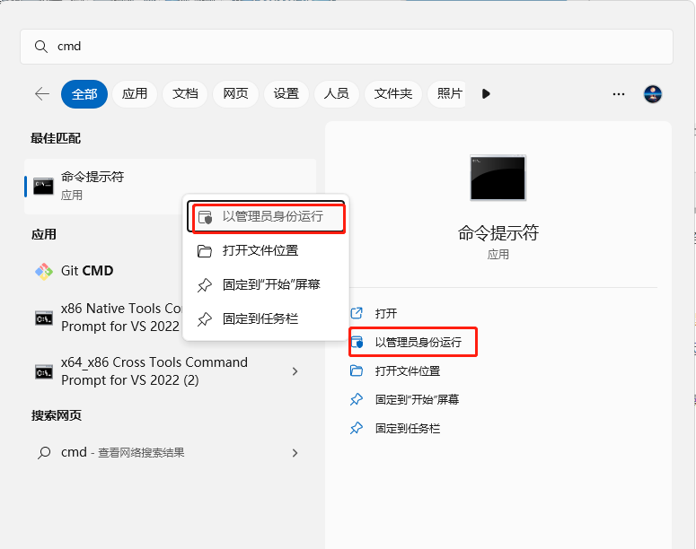

2.运行命令

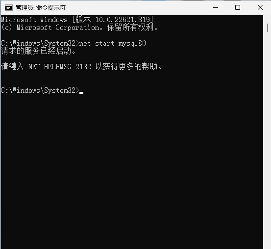

## MySQL 客户端连接

数据库相关命令：参考：[MySql 数据库命令大全](https://blog.csdn.net/LCW0102/article/details/123835997)

```bash
# 连接MySQL
mysql -h主机地址 -u用户名 －p用户密码
# 启动mysql服务器
net start mysql
# 关闭mysql服务器
net stop mysql
# 修改数据库密码
mysqladmin -u用户名 -p旧密码 password 新密码


# 创建数据库
create database
# 显示所有的数据库名
show databases 数据库名称
# 使用或切换数据库
use 数据库名称
# 查询当前所在数据库
select database
# 修改数据库编码格式
alter database

# ***** 数据库中的表操作 *****
# 查看数据库中所有的表
show tables
# 查看指定表的创建结构
show create table
# 将表中记录清空
delete from 表名
# 删除数据库
drop database 库名
# 删除表格
drop table 表名
或
drop table if exists 表名称;
或
drop table if exists 表名称1,表名称2,…;
# 删除说明：if exists是判断是否存在该表，若存在则进行删除，若不存在也不会报错，不是非必须写，但是不写的话，删除一个不存在的表就会有报错。删除表的时候可以一次性删除一个，也可以一次性删除多个表。

# 创建一个新表
create table 表名称（
  列名 数据类型 comment '备注’,
  列名 数据类型 ,
  …
）
# 显示表中的记录
select * from 表名
# 数据传入命令
load data local infile "文件名" into table 表名
# 表的详细描述
describe tablename
# 查询当前表结构
desc 表名称
# 查询表详细结构
show create table 表名称;
或
show full columns from 表名称;

```

---

### 方式 1：MySQL 提供的客户端命令工具

点击键盘按键`win`(四个正方形合成一个的图标按键)，呼出应用相关(我这里是 win11 系统)

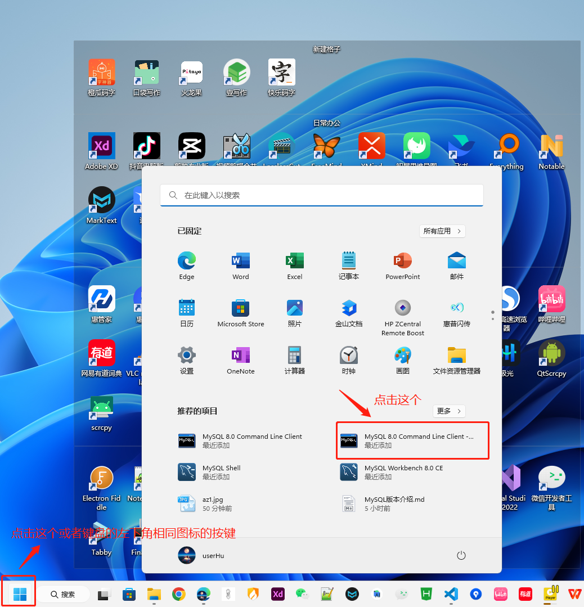

双击打开，输入密码

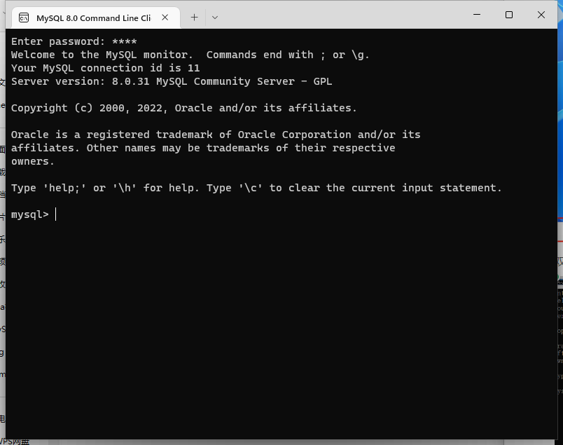

---

### 方式 2：系统自带的命令行工具执行命令

指令：`mysql [-h 127.0.0.1] [-P 3306] -u root -p`

或者：`mysql -uroot -p`

如果没有配置 mysql 的环境变量

执行以上指令会提示：

```bash
'mysql' 不是内部或外部命令，也不是可运行的程序
或批处理文件。
```

> 注意：要想在任意目录下执行上面的命令，就必须得配置 PATH 环境变量

#### 配置 MySQL 全局环境变量

配置环境变量：打开  `我的电脑(此电脑)` -> 鼠标`右键` -> 选择  `属性` -> 找到  `高级系统设置` -> 选择  `环境变量`

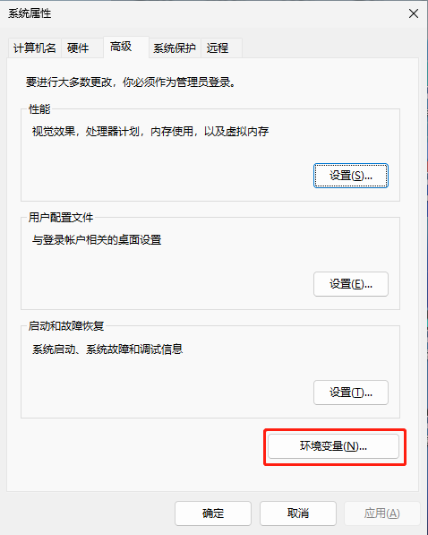

双击或者单击选择  `Path`，点击  `编辑`

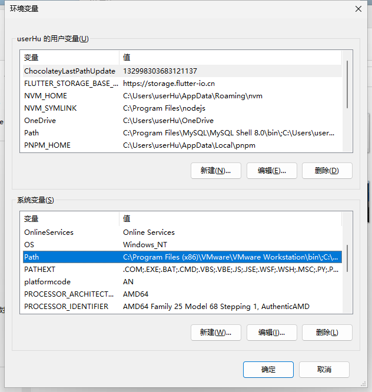

找到 MySQL 服务端的安装路径：`C:\Program Files\MySQL\MySQL Server 8.0\bin`

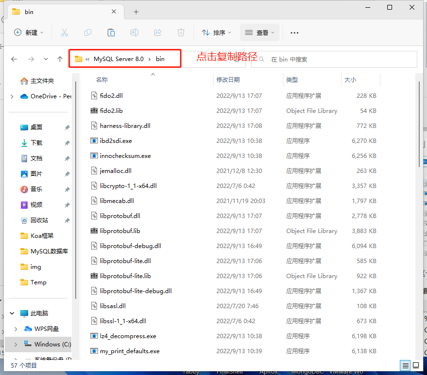

将这个路径配置到  `Path`  之中

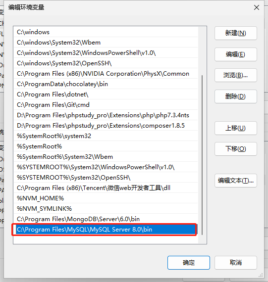

来到打开的配置环境变量的窗口，全部点击  `确定`

现在就能够直接用系统管理员身份运行 cmd 或者 Powershell 指令打开 MySQL 了，指令：`mysql -uroot -p`

---

### 方式 3：Navicat Premium 数据库图形化界面管理软件(收费)

---

### 方式 4

## 卸载 MySQL 数据库

首先调出系统服务，`win + R`  打开运行，输入  `services.msc` ，点击  `确定`

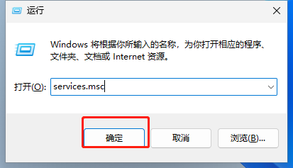

找到`MySQL80`服务，右键点击停止

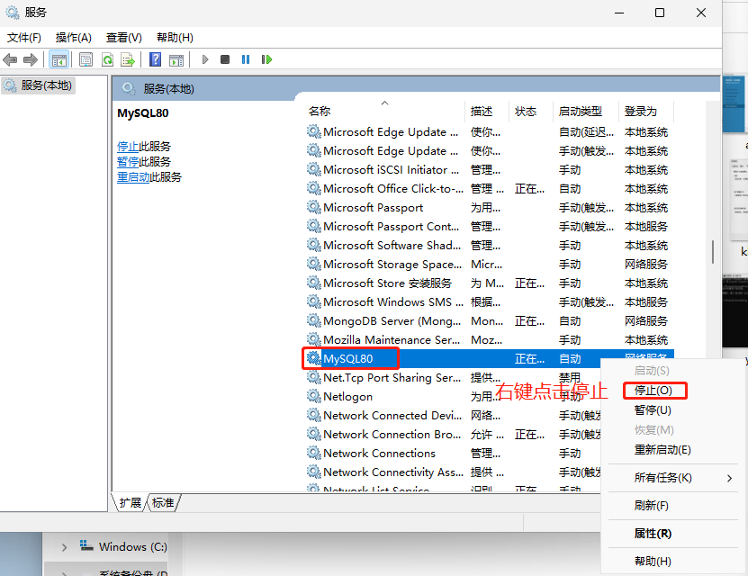

最后打开  `控制面板`，选择  `卸载程序`
卸载 MySQL 相关的组件

## 可能遇到的问题

**（1）使用数据库管理工具连接时报  `Plugin caching_sha2_password could not be loaded:**\*\*****`\*\*

MySQL 新版默认使用  `caching_sha2_password`  作为身份验证插件，而旧版是使用  `mysql_native_password`，当连接 MySQL 时报错`plugin caching_sha2_password could not be loaded`时，可换回旧版插件。

解决方案：

命令行登录 mysql 之后，修改用户的身份验证插件

```sql
# 修改 root 用户的身份验证插件为 mysql_native_password
ALTER USER 'root'@'localhost' IDENTIFIED WITH mysql_native_password BY '123456';

# 刷新
FLUSH PRIVILEGES；
```

重新连接

---

参考博客：  
[SQLyog 错误号码 plugin caching_sha2_password could not be loaded](https://blog.csdn.net/qq_54202620/article/details/122729704)
