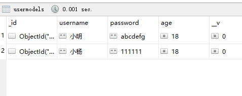

# mongoDB数据库

官方开源库：[mongodb (github.com)](https://github.com/mongodb)

MongoDB开源地址：[mongodb/mongo: The MongoDB Database (github.com)](https://github.com/mongodb/mongo)

MongoDB官网：[MongoDB: The Developer Data Platform | MongoDB](https://www.mongodb.com/home)

MongoDB中文官网：[MongoDB中文网 mongodb官网 (p2hp.com)](http://mongodb.p2hp.com/)

官方资源和文档：[Develop Applications — MongoDB Documentation](https://www.mongodb.com/docs/develop-applications/)

**中文网：**

基于4.2版本的手册：[MongoDB中文网](https://www.mongodb.org.cn/)

[MonogDB 中文网 | MongoDB 中文文档](https://mongodb.net.cn/)

中文社区：

[MongoDB中文社区 (mongoing.com)](https://mongoing.com/)

[MongoDB-全球领先的现代通用数据库 | MongoDB中文社区 (mongoing.com)](https://mongoing.com/mongodb-inc)

4.2中文手册：[MongoDB中文手册|官方文档中文版 - MongoDB-CN-Manual (mongoing.com)](https://docs.mongoing.com/)

**教程：**

[MongoDB 教程 | 菜鸟教程 (runoob.com)](https://www.runoob.com/mongodb/mongodb-tutorial.html)

## mongoDB安装和启动运行配置

安装文档：[Install MongoDB Community Edition — MongoDB Manual](https://www.mongodb.com/docs/manual/administration/install-community/)

### 1.下载

1.打开官网：https://www.mongodb.com/

2.点击社区版：选择 `Products > Community Edition` 就能进入社区版


3.选择版本下载：


---

### 2.安装、配置与启动

1.安装：到这一步：complete（完整的安装：默认安装到系统盘）| Custom（习惯安装：可以自定义安装路径）。然后一路next


最后 点击“finish”按钮完成安装

2.安装完成之后找到对应的安装目录


3.在安装路径下->创建`data\db`(存储 MongoDB 产生的数据)，和 `data\log` 日志文件夹

**4.运行MongoDB服务**

进入 `bin` 目录下，`cmd` 进入 `命令行窗口`，使用命令的指定存储数据文件的形式启动：`mongod --dbpath=..\data\db`


4.1.服务相关命令：

```bash
启动服务：net start MongoDB
关闭服务：net stop MongoDB
移除服务：目录路径\MongoDB\bin\mongod.exe –remove
```

5.测试启动地址：http://localhost:27017/

成功启动：看到 `It looks like you are trying to access MongoDB over HTTP on the native driver port.` 就能证明 MongoDB 启动成功


给该文件添加些配置信息：

```bash
systemLog:
  destination: file
  # 指定日志存放文件
  path: C:\Program Files\MongoDB\Server\6.0\log\mongodb.log
  logAppend: true
storage:
  journal:
    enabled: true
  # 指定存放数据文件的全路径
  dbPath: C:\Program Files\MongoDB\Server\6.0\data
net:
  bindIp: 127.0.0.1
  port: 27020
setParameter:
  enableLocalhostAuthBypass: false
```

详细配置可参考：[官方文档](https://www.mongodb.com/docs/manual/reference/configuration-options/)

进入 `bin` 目录下，`cmd` 进入 `命令行窗口`，使用命令的形式让 `mongodb` 指定配置文件启动：

```bash
mongod -f ..\conf\mongodb.conf
# 或者
mongod --config ..\conf\mongodb.conf
```


---

### 3.MongoDB连接

#### 1.Shell 命令连接

如果使用 Shell 命令的形式打开 MongoDB，最好先配置以下环境变量，打开

鼠标右键 `我的电脑（此电脑）` - `属性` - `高级系统设置` 再选择 `环境变量`


选择 `Path`，点击 `编辑`  


点击 `新建` ，然后把 MongoDB 的 `bin` 目录路径粘贴上去：比如我的 `C:\Program Fi


返回的窗口全部依次点击 `确定` 即可。

开启 MongoDB 之后，`cmd` 进入 `命令行窗口`，输入命令 ：

```bash
mongo
# 或者
mongo --host=127.0.0.1 --port=27017
```

查看已经有的数据库：

```bash
show databases
```

退出 Mongodb

```bash
exit
```

查看帮助文档

```bash
mongo --help
```

#### 1.1官方工具MongoDB Shell

MongoShell是**MongoDB发行版的一个组件**， 安装并启动MongoDB后，将MongoShell连接到正在运行的MongoDB实例，MongoDB手册中的大多数示例使用 MongoShell，然而，许多驱动程序也提供了与MongoDB类似的接口。

`MongoDB Shell` 官方地址下载：[MongoDB Compass Download | MongoDB](https://www.mongodb.com/try/download/shell)

---

#### 2.MongoDB客户端程序连接

一些连接数据库的图形化工具也能够连接 MongoDB

##### 2.1. Compass-图形化界面客户端

`Compass` 图形化界面客户端：[MongoDB-compass下载](https://www.mongodb.com/try/download/compass)

视频地址：[Webinar: MongoDB Compass - Data navigation made easy | MongoDB](https://www.mongodb.com/presentations/webinar-mongodb-compass-data-navigation-made-easy?utm_campaign=Int_ET_Download%20Center%20-%20Compass%20Download_WW%20-%20Autoresponder%20%28Sept%202017%29&utm_medium=email&utm_source=Eloqua)

---

下载解压或者安装后：在打开的界面中，输入主机地址、端口等相关信息


连接成功：


图形化界面的好处就是可以很清晰的看到数据库中数据的展示和减少写一些查询语句。

---

##### 2.2. Navicat：

---

##### 2.3. robo3t：

---

##### 2.4. Robomongo：

---

##### 2.5. VS Code连接MongoDB数据库

官网文档：[MongoDB for VS Code — MongoDB for VS Code](https://www.mongodb.com/docs/mongodb-vscode/)

VS Code搜索安装插件：MongoDB for VS Code


VS Code 连接：


添加数据库：没学会，文档待定

## Node连接MongoDB数据库

### 1.mongodb库连接MongoDB

官网mongodb示例连接文档：[快速入门 — Node.js (mongodb.com)](https://www.mongodb.com/docs/drivers/node/current/quick-start/)

官方文档以mongodb这个库为例：https://github.com/mongodb/node-mongodb-native

npm包地址：[mongodb - npm (npmjs.com)](https://www.npmjs.com/package/mongodb)

mongodb官网文档：[https://mongoosejs.com/](https://mongoosejs.com/)  

中文网文档：[http://www.mongoosejs.net/](http://www.mongoosejs.net/)

菜鸟教程：[Node.js 连接 MongoDB | 菜鸟教程 (runoob.com)](https://www.runoob.com/nodejs/nodejs-mongodb.html)

**操作示例：**

- **先使用node连接上数据库**

```jsx
const MongoClient = require('mongodb').MongoClient;

// mongoDB数据库的服务地址
const url = 'mongodb://localhost:27017';

// 操作的数据库名称
const mdb = 'stu_db';

// 实例化链接对象
const client = new MongoClient(url);

// 实例对象connect连接数据库
client.connect(function(err) {
  if (err) {
    console.log('数据库连接失败....')
  } else {
    console.log('数据库连接成功....')
    const db = client.db(mdb);
    client.close();
  }
})
```

- **stu_db库(集合)中插入数据**

```jsx
const MongoClient = require('mongodb').MongoClient;

// mongoDB数据库的服务地址
const url = 'mongodb://localhost:27017';

// 操作的数据库名称
const mdb = 'stu_db';

// 实例化链接对象
const client = new MongoClient(url);

// 实现插入数据的方法
function insertDocuments(db, callback) {
 // 获取操作数据库的集合
 const collection = db.collection('stu_db');
 // 通过集合对象来插入文档
 collection.insertMany([
   {name: 'Chris',   age: 24, city: '北京市'},
   {name: 'Wilson',  age: 26, city: '南京市'},
   {name: 'Alan',    age: 22, city: '重庆市'},
   {name: 'Jimmy',   age: 21, city: '杭州市'},
   {name: 'Elvis',   age: 20, city: '长沙市'},
   {name: 'Danny',   age: 18, city: '合肥市'},
  ],function(error, result) {
   if (error) {
    console.log('数据插入失败...')
   } else {
     console.log('数据插入成功...');
     callback(result)
   }
 })
}

// 实例对象connect连接数据库
client.connect(function(err) {
  if (err) {
    console.log('数据库连接失败....')
  } else {
    console.log('数据库连接成功....')
    const db = client.db(mdb);
    // 插入数据 
    insertDocuments(db,(res) => {
      console.log(res);
      client.close();
    })

  }
})
```


- **stu_db库(集合)中删除数据**

```jsx
const MongoClient = require('mongodb').MongoClient;

// mongoDB数据库的服务地址
const url = 'mongodb://localhost:27017';

// 操作的数据库名称
const mdb = 'stu_db';

// 实例化链接对象
const client = new MongoClient(url);

// 删除数据
function delDocuments(db, callback) {
  const collection = db.collection('stu_db');
  collection.deleteOne({name:'Elvis'}, function(err, result) {
    if(err) {
      console.log('数据删除失败...')
    } else {
      console.log('数据删除成功...')
      callback(result)
    } 
  })
}

// 实例对象connect连接数据库
client.connect(function(err) {
  if (err) {
    console.log('数据库连接失败....')
  } else {
    console.log('数据库连接成功....')
    const db = client.db(mdb);

    // 删除数据
     delDocuments(db, (res) => {
      client.close();
    }) 

  }
})
```

- **stu_db库(集合)中修改数据**

```jsx
const MongoClient = require('mongodb').MongoClient;

// mongoDB数据库的服务地址
const url = 'mongodb://localhost:27017';

// 操作的数据库名称
const mdb = 'stu_db';

// 实例化链接对象
const client = new MongoClient(url);

// 修改数据
function updateDocuments(db, callback) {
  // 获取操作数据库的集合
  const collection = db.collection('stu_db');
  collection.updateMany(
    {name: 'Alan'},
    {
      $set: {
        name: 'Lison'
      }
    },
    function (err, result) {
      if (err) {
        console.log('数据更新失败...')
      } else {
        console.log('数据更新成功...');
        callback(result)
      } 
    }
  )
}

// 实例对象connect连接数据库
client.connect(function(err) {
  if (err) {
    console.log('数据库连接失败....')
  } else {
    console.log('数据库连接成功....')
    // 更新数据
   updateDocuments(db, (res) => {
      console.log(res);
      client.close();
    })

  }
})
```

- **stu_db库(集合)中查询数据**

```jsx
const MongoClient = require('mongodb').MongoClient;

// mongoDB数据库的服务地址
const url = 'mongodb://localhost:27017';

// 操作的数据库名称
const mdb = 'stu_db';

// 实例化链接对象
const client = new MongoClient(url);

// 查询数据
function findDocuments(db, callback) {
  // 获取操作数据库的集合
  const collection = db.collection('stu_db');
  collection.find({age: 20}).toArray(function(err, result){
    if(err) {
      console.log('数据查询失败...')
    } else {
      console.log('数据查询成功...');
      callback(result)
    }
  })
}

// 实例对象connect连接数据库
client.connect(function(err) {
  if (err) {
    console.log('数据库连接失败....')
  } else {
    console.log('数据库连接成功....')
    const db = client.db(mdb);
    // 查询数据
     findDocuments(db, (res) => {
       console.log(res);
       client.close();
    })

  }
})
```

---

### 2.mongoose对象模型工具库连接MongoDB

使用mongoose连接MongoDB数据库-npm包：[mongoose - npm (npmjs.com)](https://www.npmjs.com/package/mongoose)

**抽象模型对应：一层层包含：schema包含model，model包含entitv**

| MongoDB    | Mongoose |
|:----------:|:--------:|
| document   | schema   |
| collection | model    |
| database   | entitv   |

#### 1、安装 mongoose

```bash
npm install mongoose
```

#### 2、引用

```javascript
const mongoose = require('mongoose');
```

#### 3、创建js文件用于连接MongoDB数据库

```javascript
// 引入mongoose
const mongoose = require('mongoose');
// 定义字符串常量
const uri = "mongodb://localhost:27017/test" // test是数据库名字
// 1.连接数据库
mongoose.connect(uri, { useNewUrlParser:true, useUnifiedTopology:true }) 
// 2.连接成功
mongoose.connection.on('connected', () => {
    console.log('连接成功：', db_url);
})
// 3.连接失败
mongoose.connection.on('error', (err) => {
    console.log('连接错误：', err);
})
// 4.断开连接
mongoose.connection.on('disconnection', () => {
    console.log('断开连接');
})
module.exports = mongoose;
```

#### 实现增删改查操作

#### 1、插入数据

定义UserSchema：设计文档结构

参考教程：[mongoose - npm (npmjs.com)](https://www.npmjs.com/package/mongoose)

```javascript
const mongoose = require('mongoose')
const bcrypt = require('bcrypt')

const SALT_WORK_FACTOR = 10
const MAX_LOGIN_ATTEMPTS = 5
const LOCK_TIME = 2 * 60 * 60 * 1000
// 
const Schema = mongoose.Schema
// 定义Schema
const UserSchema = new Schema({
  // user admin superAdmin
  role: {
    type: String,
    default: 'user'
  },
  username: String,
  password: String,
  email: String,
  age: Number,
  hashed_password: String,
  loginAttempts: {
    type: Number,
    required: true,
    default: 0
  },
  lockUntil: Number,
  meta: {
    createdAt: {
      type: Date,
      default: Date.now()
    },
    updatedAt: {
      type: Date,
      default: Date.now()
    }
  }
})

// 登录机制保护方法：判断是否到可以登录得时限
UserSchema.virtual('isLocked').get(function () {
  return !!(this.lockUntil && this.lockUntil > Date.now())
})

// .pre保存前的中间件middleware处理事件
UserSchema.pre('save', function (next) {
  if (this.isNew) {
    this.meta.createdAt = this.meta.updatedAt = Date.now()
  } else {
    this.meta.updatedAt = Date.now()
  }

  next()
})

// 密码保存
UserSchema.pre('save', function (next) {
  let user = this
  // 如果没有修改密码
  if (!user.isModified('password')) return next()
  // 重新加密 密码
  bcrypt.genSalt(SALT_WORK_FACTOR, (err, salt) => {
    if (err) return next(err)

    bcrypt.hash(user.password, salt, (error, hash) => {
      if (error) return next(error)

      user.password = hash
      next()
    })
  })
})

// 添加Schema的实例方法
UserSchema.methods = {
  // 密码的比较方法
  comparePassword: function (_password, password) {
    return new Promise((resolve, reject) => {
      bcrypt.compare(_password, password, function (err, isMatch) {
        if (!err) resolve(isMatch)
        else reject(err)
      })
    })
  },
  // 登录机制保护方法：密码错误多少次超限，实现账户锁定
  incLoginAttempts: function (user) {
    const that = this

    return new Promise((resolve, reject) => {
      if (that.lockUntil && that.lockUntil < Date.now()) {
        that.update({
          $set: {
            loginAttempts: 1
          }, 
          $unset: {
            lockUntil: 1
          }
        }, function (err) {
          if (!err) resolve(true)
          else reject(err)
        })
      } else {
        let updates = {
          $inc: {
            loginAttempts: 1
          }
        }

        if (that.loginAttempts + 1 >= MAX_LOGIN_ATTEMPTS && !that.isLocked) {
          updates.$set = {
            lockUntil: Date.now() + LOCK_TIME
          }
        }

        that.update(updates, err => {
          if (!err) resolve(true)
          else reject(err)
        })
      }
    })
  }
}

// 将文档结构发布为模型
const UserModel = mongoose.model('UserModel', UserSchema)
```

其中，mongoose.model 方法就是用来将一个架构发布为 model; 其中：

> 第一个参数：传入一个大写名词单数字符串用来表示你的数据库名称，其中，mongoose会自动将大写名词的字符串生成小写复数的集合名称，例如这里的UserModel最终会变成 usermodels 集合名称。  
> 第二个参数：架构 Schema  
> 返回值：模型构造函数

3）插入数据(Model.save([fn]))：

```javascript
const mongoose = require('mongoose')
const UserModel = mongoose.model('UserModel')

//创建模型
let Model = new UserModel({
    username:'小明',
    password:'123456',
    age:18
})
//2.同模型的sava([fn]),保存模型到数据库中
Model.save((err,res) => {
    if(err){
        console.log('保存失败：',err);
    }else{
        console.log(res);
    }
})
```

打开mongo 数据库，可以看到数据被插入进去（便于后续操作，于是多添加了几条数据）  

#### 2、更新数据

```javascript
Model.updateOne(conditions, doc, [options], [callback])
```

> conditions: 更新的条件，该值是一个对象。  
> doc： 需要更新的内容，该值也是一个对象。  
> options：可选参数，它有如下属性：  
> safe ：（布尔型）安全模式（默认为架构中设置的值（true））  
> upsert ：（boolean）如果不匹配，是否创建文档（false）  
> multi ：（boolean）是否应该更新多个文档（false）  
> runValidators：如果为true，则在此命令上运行更新验证程序。更新验证器根据模型的模式验证更新操作。  
> strict：（布尔）覆盖strict此更新的选项  
> overwrite： （布尔）禁用只更新模式，允许您覆盖文档（false）  
> callback: 回调函数

```javascript
function update(){
     //找到更新的数据
     let  where_str = { 'username' : '小明'};
     //更新后的数据
     let update_str = { 'password' : 'abcdefg'};   
     UserModel.updateOne(where_str,update_str,function(err,res){
        if(err){
            console.log('更新失败：',err);
        }else{
            console.log(res);
        }
    })
}
update() //调用更新函数
```


密码成功更改！  

第二种更新方法  

2）更新并返回数据：终端返回更新前的所有数据，数据库响应更新后的数据

```javascript
Model.findOneAndUpdate([(conditions, doc, [options], [callback])]
```

> conditions： 第一个参数是一个对象参数，是用于查询与之相匹配的数据用的  
> doc：第二个参数也是一个对象参数，用于修改查询到的数据中的某条信息  
> options：第三个参数也是一个对象参数，主要用于设定匹配数据与更新数据的一些规定，比较复杂，一般用不到  
> callback：第四个参数也就是我们最熟悉的回调函数，函数默认传入两个参数,err、data。当数据库发生错误的时候传回一个err，若数据库正常，err为空；当正常根据第一个参数查询到相关数据并成功修改了我们设定的数据，data返回修改前的数据信息，若根据第一个参数没有查询到相关数据，data为null

```javascript
UserModel.findOneAndUpdate({
        username: '小张'
    },{
        $set: {
            password: 'aaaaaaaaaa'
        }
    },{},function(err,data){
        if(err){
            console.log("更新错误!");
        }
        else if(!data) {
            console.log("未找到数据！");
            console.log(data);
        }
        else if(data) {
            console.log("更新成功!");
            console.log(data);
        }
    })
```

看终端打印结果：为更改前的数据  
  
数据库中返回的数据为更改后的密码  


### 3、查询数据

```javascript
//查询所有
UserModel.find(function(err,data){
  if(err){
      console.log(err)
  }else{
      console.log(data)
  }
})
```


```javascript
//按id查询
UserModel.findById({_id:"61e91a69455a152a1c3dd150"},function(err,data){
    if(err){
        console.log(err)
    }else{
        console.log(data);
    }
})
```


```javascript
//记录数查询
UserModel.countDocuments(function(err,data){
        if(err){
            console.log(err)
        }else{
            console.log("记录数："+data);
        }
    })
```


#### 4、删除数据

```javascript
UserModel.deleteOne({
       username: '小张'
   },{},function(err,data){
       if(err){
           console.log('删除错误!');
       }
       else if(!data) {
           console.log("未找到数据！");
           console.log(data);
       }
       else if(data) {
           console.log("删除成功!");
           console.log(data);
       }
   })
```

  

查看数据库，成功删除小张信息。  
