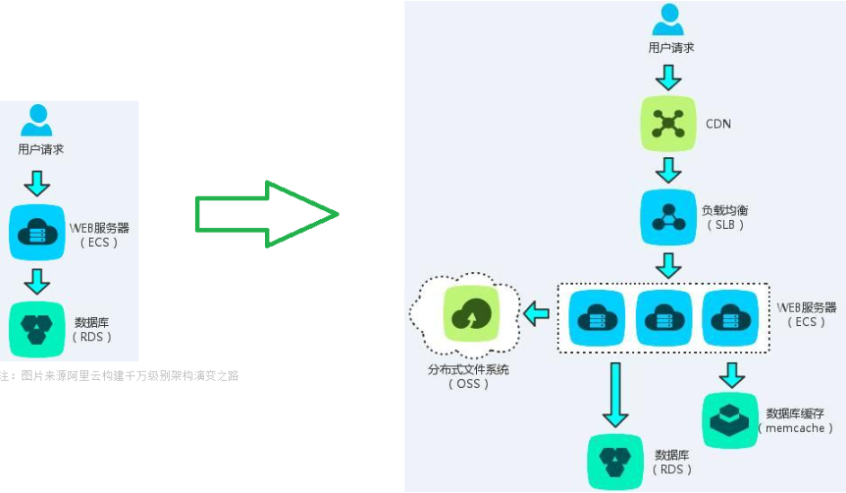

# 数据库简介

用来数据的存放和操作

## 数据库的种类

### 种类

关系型：Oracle、MySQL、SQLite 、SQL Server等

非关系型（**Not** Only **SQL**）：MongoDB（文档）、Redis/Memcache（内存）

### 关系型和非关系型数据库软件区别

相同点：都是数据库软件，用来存放项目数据

不同点：

``` bash
关系型：1.遵循SQL标准，换句话说语法大同小异、2.有库和表约束等
非关系型：1.没有统一标准、2.一般键值对形式存储、3.读取速度更快
```

### 关系型和非关系型数据库软件如何选择



## 如何选择数据库

- 对于那些可靠性要求高的用mysq
-对于那些存储量在的用mongodb
-对于那些读写性能要求高的redis

redis可以和其他数据可组合使用，起到性能优化的效果

## 数据库排行榜

[DB-Engines Ranking - popularity ranking of database management systems](https://db-engines.com/en/ranking)
