# Nginx 配置

Nginx 官网：[nginx news](https://nginx.org/)

中文网：[nginx 中文网 官网 (p2hp.com)](https://nginx.p2hp.com/)

Nginx 中文文档：[Nginx 中文文档 (redis.com.cn)](https://blog.redis.com.cn/doc/)

菜鸟教程：[Nginx 配置详解 | 菜鸟教程 (runoob.com)](https://www.runoob.com/w3cnote/nginx-setup-intro.html)

Nginx 安装包下载：[nginx：下载](https://nginx.org/en/download.html)

## Nginx 简介

服务器 nginx 是一种高性能的 Web 服务器和反向代理软件，它可以处理静态和动态的内容，支持负载均衡、缓存、安全等功能。

Nginx (engine x) 是一个高性能的 HTTP 和反向代理 web 服务器，同时也提供了 IMAP/POP3/SMTP 服务。Nginx 是由伊戈尔·赛索耶夫为俄罗斯访问量第二的 Rambler.ru 站点（俄文：Рамблер）开发的，第一个公开版本 0.1.0 发布于 2004 年 10 月 4 日。2011 年 6 月 1 日，nginx 1.0.4 发布。

高并发，大流量：需要面对高并发用户，大流量访问。举个例子，去往迪拜的飞机有 200 张票，但是有 100w 人都挤进系统买票，如何让这 100w 人能够看到票务的实时更新，以及顺利的买到一张票，都是一个网站架构师应该考虑的问题。这也许对于淘宝的“双十一”1000w 的一分钟独立访问用户量来说，是个微不足道的数字，但是对于用户的体验以及网站的口碑来说，都是一项不小的挑战

Nginx 是一个安装非常的简单、配置文件非常简洁（还能够支持 perl 语法）、Bug 非常少的服务。Nginx 启动特别容易，并且几乎可以做到 7\*24 不间断运行，即使运行数个月也不需要重新启动。你还能够不间断服务的情况下进行软件版本的升级。

Nginx 代码完全用 C 语言从头写成。官方数据测试表明能够支持高达 50,000 个并发连接数的响应。

### 1.正向代理 反向代理

**正向代理**来进行上网等功能。如果把局域网外的 Internet 想象成一个巨大的资源库，则局域网中的客户端要访问 Internet，则需要通过代理服务器来访问，这种代理服务就称为正向代理（也就是大家常说的，通过正向代理进行上网功能）


**反向代理**实际运行方式是代理服务器接受网络上的连接请求。它将请求转发给内部网络上的服务器，并将从服务器上得到的结果返回给网络上请求连接的客户端，此时代理服务器对外就表现为一个服务器。


### 2.负载均衡（upstream）

#### 轮询

轮询方式是 Nginx 负载默认的方式，顾名思义，所有请求都按照时间顺序分配到不同的服务上，如果服务 Down 掉，可以自动剔除

#### 权重

指定每个服务的权重比例，weight 和访问比率成正比，通常用于后端服务机器性能不统一，将性能好的分配权重高来发挥服务器最大性能

### 3.动静分离

在 Web 开发中，通常来说，动态资源其实就是指那些后台资源，而静态资源就是指 HTML，JavaScript，CSS，img 等文件。

一般来说，都需要将动态资源和静态资源分开，将静态资源部署在 Nginx 上，当一个请求来的时候，如果是静态资源的请求，就直接到 nginx 配置的静态资源目录下面获取资源，如果是动态资源的请求，nginx 利用反向代理的原理，把请求转发给后台应用去处理，从而实现动静分离。

在使用前后端分离之后，可以很大程度的提升静态资源的访问速度，同时在开过程中也可以让前后端开发并行可以有效的提高开发时间，也可以有些的减少联调时间 。

## 其他 Nginx 学习笔记

Nginx 模块笔记文档：[珠峰架构师成长计划 — nginx](http://www.zhufengpeixun.com/strong/html/61.10.devops-nginx.html)

## nginx 下载和配置 https

Nginx 安装包下载：[nginx：下载](https://nginx.org/en/download.html)

1. 下载好对应的系统版本的 nginx，然后在你想安装的盘符目录，解压 nginx-1.xxx.zip

   1. [mac 上安装 Nginx 简单详细教程\_?Oliver 的博客-CSDN 博客\_mac 部署 nginx](https://blog.csdn.net/zhengcaocao/article/details/126957646)

2. 安装 cygwin：Cygwin 是一个在 windows 平台上运行的类 UNIX 模拟环境(第 2~3 步不用也可以)

   1. 官网：[Cygwin](https://www.cygwin.com/)

3. 通过命令行运行：C:\cygwin64\bin 目录下的 openssl.exe
4. 生成证书(管理员方式打开命令行)

```bash
# 1、首先，进入你想创建证书和私钥的目录，例如：nginx/config目录
cd D:\\dev\\nginx-1.13.12\\conf

# 2、创建服务器私钥，命令会让你输入一个口令：
openssl genrsa -des3 -out server.key 1024

# 3、创建公钥（CSR）：
openssl req -new -key server.key -out server.csr

# 4、不用输入密码
cp server.key server.key.org
openssl rsa -in server.key.org -out server.key

# 5、最后标记证书使用上述私钥和公钥：
openssl x509 -req -days 365 -in server.csr -signkey server.key -out server.crt
```

### 配置 nginx：`nginx-1.23.3/conf/nginx.conf` 文件

Nginx 的主配置文件是 nginx.conf，这个配置文件一共由三部分组成，分别为全局块、events 块和 http 块。

在 http 块中，又包含 http 全局块、多个 server 块。

每个 server 块中，可以包含 server 全局块和多个 location 块。在同一配置块中嵌套的配置块，各个之间不存在次序关系

#### 1.全局块

全局块是默认配置文件从开始到 events 块之间的一部分内容，主要设置一些影响 Nginx 服务器整体运行的配置指令，因此，这些指令的作用域是 Nginx 服务器全局。

- user [user] [group] 指定可以运行 nginx 服务的用户和用户组，只能在全局块配置 user 指令在 Windows 上不生效，如果你制定具体用户和用户组会报警告
  worker_processes nginx 进程数量 worker_processes 比如设置为 2 nginx 将会开启一个 master 进程和 2 两个 worker 进程
- pid logs/nginx.pid 存放 pid 文件
- error_log logs/error.log; 全局错误日志类型 debug info warn error 存放地址

#### 2.events 块

events 块涉及的指令主要影响 Nginx 服务器与用户的网络连接。常用到的设置包括是否开启对多 worker process 下的网络连接进行序列化，是否允许同时接收多个网络连接，选取哪种事件驱动模型处理连接请求，每个 worker process 可以同时支持的最大连接数等

accept_mutex 默认开启-开启之后 nginx 的多个 worker 将会以串行的方式来处理，只会有一个 worker 将会被唤起，其他的 worker 继续睡眠，如果不开启将会造成惊群效应多个 worker 全部唤起不过只有一个 Worker 能获取新连接，其它的 Worker 会重新进入休眠状态

worker_connections 单个进程最大连接数（最大连接数=连接数+进程数）

#### 3.http 块

http 块是 Nginx 服务器配置中的重要部分，代理、缓存和日志定义等绝大多数的功能和第三方模块的配置都可以放在这个模块中。

- include 指令，用于引入其他的配置文件
- default_type 如果 Web 程序没设置，Nginx 也没对应文件的扩展名，就用 Nginx 里默认的 default_type 定义的处理方式。default_type application/octet-stream; #nginx 默认文件类型
- log_format 指令，用于定义日志格式，此指令只能在 http 块中进行配置
- sendfile 简单来说就是启用 sendfile()系统调用来替换 read()和 write()调用，减少系统上下文切换从而提高性能，当 nginx 是静态文件服务器时，能极大提高 nginx 的性能表现
- keepalive_timeout HTTP 有一个 KeepAlive 模式，它告诉 webserver 在处理完一个请求后保持这个 TCP 连接的打开状态。若接收到来自客户端的其它请求，服务端会利用这个未被关闭的连接，而不需要再建立一个连接。
- gzip 开启 Gzip 压缩功能， 可以使网站的 css、js 、xml、html 文件在传输时进行压缩，提高访问速度, 进而优化 Nginx 性能

#### 4.server 块

每一个 http 块都可以包含多个 server 块，而每个 server 块就相当于一台虚拟主机，它内部可有多台主机联合提供服务，一起对外提供在逻辑上关系密切的一组服务

listen 指令的配置非常灵活，可以单独制定 ip，单独指定端口或者同时指定 ip 和端口

```bash
listen 127.0.0.1:8000;  #只监听来自127.0.0.1这个IP，请求8000端口的请求
listen 127.0.0.1; #只监听来自127.0.0.1这个IP，请求80端口的请求（不指定端口，默认80）
listen 9999; #监听来自所有IP，请求9999端口的请求
listen *:9999; #和上面效果一样
listen localhost:8000; #和第一种效果一致
```

server_name nginx 允许一个虚拟主机有一个或多个名字，也可以使用通配符"\*"来设置虚拟主机的名字 支持 ip 域名 通配符 正则等

```bash
 server_name  localhost;
```

#### 5.location 块

每个 server 块中可以包含多个 location 块。在整个 Nginx 配置文档中起着重要的作用，而且 Nginx 服务器在许多功能上的灵活性往往在 location 指令的配置中体现出来

location 指令可以分为以下 3 类：

- 前缀字符串匹配

- 正则表达式匹配
- 用于内部跳转的命名 location

##### 前缀字符串匹配

- 精确匹配 =
- 前缀匹配 ^~（立刻停止后续的正则搜索）
- 按文件中顺序的正则匹配 ~或~\*
- 匹配不带任何修饰的前缀匹配。

##### location root

root 指定目录的上级目录，并且该上级目录要含有 locatoin 指定名称的同名目录。

```bash
location /img/ {
	root /var/www/image;
}
```

若按照这种配置的话，则访问/img/目录下的文件时，nginx 会去/var/www/image/img/目录下找文件

### Nginx 配置参考

```json
#服务器CPU核数
worker_processes  4;

#error_log  logs/error.log;
#error_log  logs/error.log  notice;
#error_log  logs/error.log  info;

#pid        logs/nginx.pid;


events {
    worker_connections  1024;
}


http {
    include       mime.types;
    default_type  application/octet-stream;

    #log_format  main  '$remote_addr - $remote_user [$time_local] "$request" '
    #                  '$status $body_bytes_sent "$http_referer" '
    #                  '"$http_user_agent" "$http_x_forwarded_for"';

    #access_log  logs/access.log  main;

    sendfile        on;
    #tcp_nopush     on;

    #keepalive_timeout  0;
    keepalive_timeout  65;

    #gzip  on;

    server {
  #监听端口
        listen       8080;
        server_name  localhost;

        #charset koi8-r;

        #access_log  logs/host.access.log  main;


  #代理的规则
        #location / {
        #    root   html;
        #    index  index.html index.htm;
        #}
  # 前端请求/根路径代理的地址
  location / {
   proxy_pass http://192.168.88.1:300
        }
  # 服务端请求/api代理的地址
  location /api {
   proxy_pass http://127.0.0.1:3000;
   proxy_set_header Host $host;
  }


        #error_page  404              /404.html;

        # redirect server error pages to the static page /50x.html
        #
        error_page   500 502 503 504  /50x.html;
        location = /50x.html {
            root   html;
        }

        # proxy the PHP scripts to Apache listening on 127.0.0.1:80
        #
        #location ~ \.php$ {
        #    proxy_pass   http://127.0.0.1;
        #}

        # pass the PHP scripts to FastCGI server listening on 127.0.0.1:9000
        #
        #location ~ \.php$ {
        #    root           html;
        #    fastcgi_pass   127.0.0.1:9000;
        #    fastcgi_index  index.php;
        #    fastcgi_param  SCRIPT_FILENAME  /scripts$fastcgi_script_name;
        #    include        fastcgi_params;
        #}

        # deny access to .htaccess files, if Apache's document root
        # concurs with nginx's one
        #
        #location ~ /\.ht {
        #    deny  all;
        #}
    }


    # another virtual host using mix of IP-, name-, and port-based configuration
    #
    #server {
    #    listen       8000;
    #    listen       somename:8080;
    #    server_name  somename  alias  another.alias;

    #    location / {
    #        root   html;
    #        index  index.html index.htm;
    #    }
    #}


    # HTTPS server
    #
    #server {
    #    listen       443 ssl;
    #    server_name  localhost;

    #    ssl_certificate      cert.pem;
    #    ssl_certificate_key  cert.key;

    #    ssl_session_cache    shared:SSL:1m;
    #    ssl_session_timeout  5m;

    #    ssl_ciphers  HIGH:!aNULL:!MD5;
    #    ssl_prefer_server_ciphers  on;

    #    location / {
    #        root   html;
    #        index  index.html index.htm;
    #    }
    #}

}
```

访问：`https://localhost` 即可显示 nginx 目录下 html 下的 index.html 或者 index.htm

### Nginx 重定向

待定

## nginx 基本使用

1. 以管理员运行 CMD 命令行
2. cd 到 nginx 根目录 启动 `nginx.exe` 文件，启动命令：`start nginx`
3. 在任务管理器看到两个 `nginx.exe` 任务在运行，说明 nginx 启动了，其中一个是主进程，一个是工作进程

### 常用命令(在 nginx 安装根目录 CMD 命令行执行的命令)

```bash
nginx -c /path/to/nginx.conf  # 以特定目录下的配置文件启动nginx:

nginx -s  reload  # 修改配置后重新加载生效

nginx -s  reopen   # 重新打开日志文件

nginx -s stop  # 快速停止nginx,暴力停止,可能造成数据丢失

nginx -s quit  # 完整有序的停止nginx

nginx -t    # 测试当前配置文件是否正确

nginx -t -c /path/to/nginx.conf # 测试特定的nginx配置文件是否正确
```

## Nginx 可视化配置工具

### NginxConfig 简介

Nginx Config 是一个强大的 Nginx 配置文件生成器，号称配置 Nginx 服务器所需的唯一工具。

正因为 Nginx 功能强大，所以针对其各个功能的配置项会显得特别多，对于我们来说要记住那么多配置是一件十分头疼的事，甚至会经常出现符号书写错误的情况。而 Nginx Config 正是提供了简单配置 Nginx 的方法，通过可视化页面，针对 Nginx 的各个配置项提供了简洁明了的配置方法。

Nginx Config 支持以下功能的可视化配置：HTTPS、HTTP/2、IPv6、certbot、HSTS、安全请求头、SSL 配置、OCSP 解析器、缓存、gzip、brotli、回退路由、反向代理、www/non-www 重定向、CDN、PHP（TCP/socket、 WordPress、Drupal、Magento、Joomla)、Node.js、Python (Django) 服务器等。

**项目地址**：<https://github.com/digitalocean/nginxconfig.io>


下面是 NginxConfig 使用过程中的一张效果图！

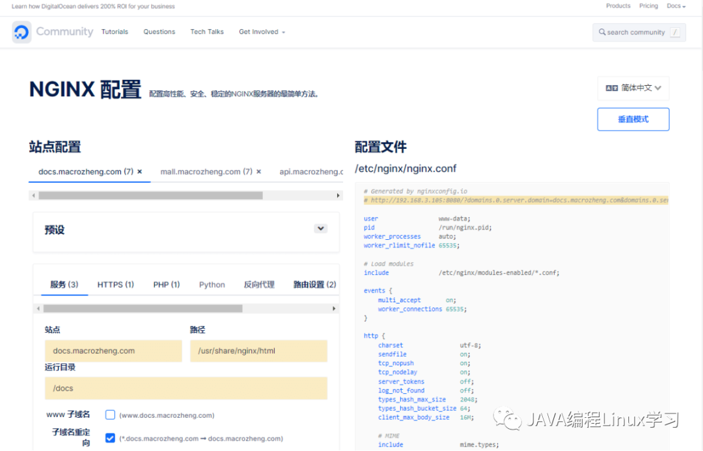

### 安装

#### 安装 Node.js

由于`NginxConfig`是一个基于 Vue 的前端项目，我们首先得安装`Node.js`。

首先从官网下载`Node.js`的安装包

##### 1.下载

访问地址：<https://nodejs.org/zh-cn/download/>


##### 2.安装

下载成功后将安装包解压到`/usr/local/src/`目录下，使用如下命令即可；

```bash
cd /usr/local/src/
tar xf node-v16.14.2-linux-x64.tar.xz
cd node-v16.14.2-linux-x64/
./bin/node -v
```

使用`./bin/node -v`命令可查看当前安装版本；


创建`node`和`npm`命令软链接；

```bash
ln -s /usr/local/src/node-v16.14.2-linux-x64/bin/node /usr/bin/node
ln -s /usr/local/src/node-v16.14.2-linux-x64/bin/npm /usr/bin/npm
node -v
npm -v
```

查看版本


#### 安装 NginxConfig

`Node.js`安装完成后，就可以开始安装`NginxConfig`了。

##### 1.克隆下载 NginxConfig 项目

访问地址：<https://github.com/digitalocean/nginxconfig.io>


解压到指定目录，并使用`npm`命令安装依赖并运行；

```bash
tar -zxvf nginxconfig.io-master.tar.gz
npm install
npm run dev
```

`NginxConfig`运行成功后就可以直接访问了，访问地址：<http://192.168.3.105:8080>


### 使用

接下来我们就体验下`NginxConfig`的可视化配置生成功能，看看是不是够强大！

#### 使用准备

首先我们需要安装 Nginx ；

我们将实现如下功能，通过静态代理访问在不同目录下的静态网站，通过动态代理来访问 SpringBoot 提供的 API 接口；

```bash
# 静态代理，访问help文档网站
help.fogsvc.com
# 动态代理，访问api线上API
api.fogsvc.com
```

需要提前修改下本机 host 文件。

```bash
192.168.3.105 docs.fogsvc.com
192.168.3.105 api.fogsvc.com
```

### 文档网站配置

我们先来配置 help.fogsvc.com 网站的访问，域名为：help.fogsvc.com。

在`NginxConfig`中选择好预设为前端，然后修改服务配置，配置好站点、路径和运行目录；

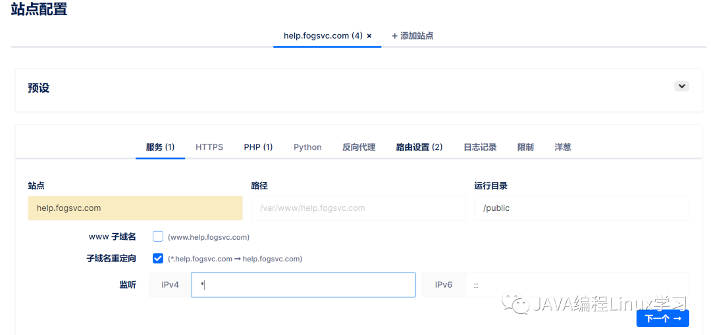

点击下一步，进入 https 设置，不需要 HTTPS 的话可以选择不启用；


然后在全局配置->安全中去除`Content-Security-Policy`设置；

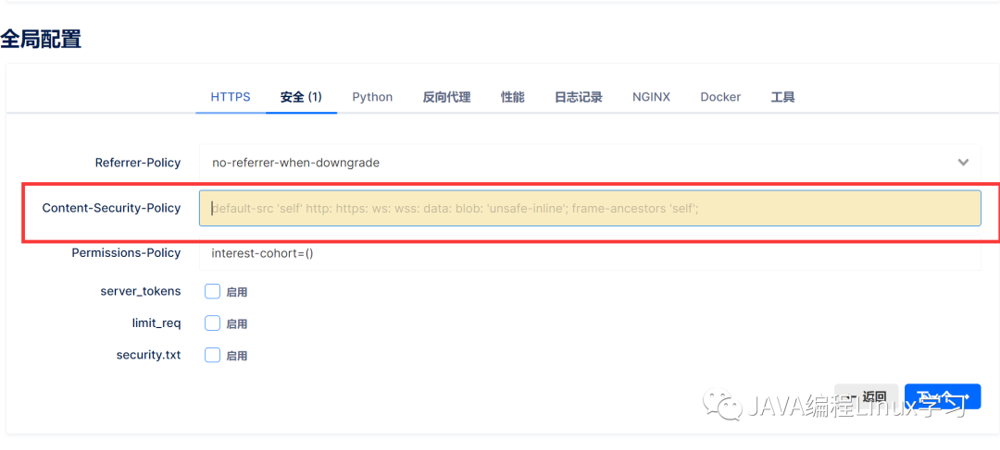

再修改性能配置，开启 Gzip 压缩，删除资源有效期限制。

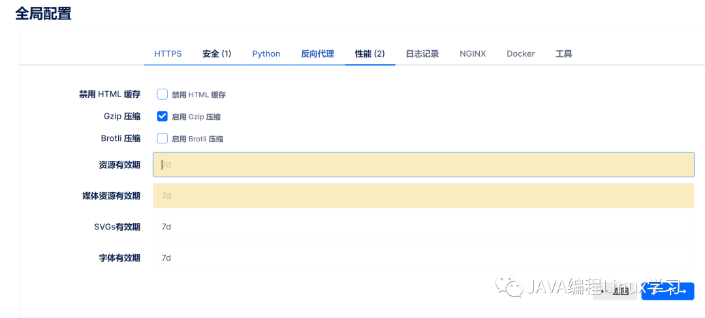

### API 网站配置

最后配置下 mall 的 Swagger API 文档网站的访问，域名为：api.fogsvc.com。

继续添加一个站点，修改服务配置，只需修改站点名称即可；


然后启用反向代理并设置，反向代理到线上 API；

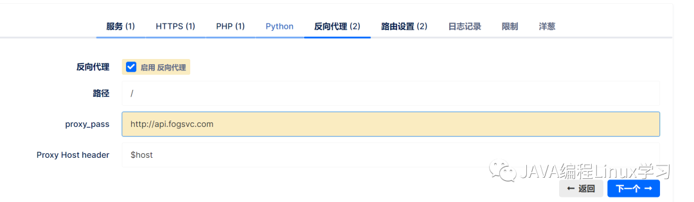

如果路由功能暂时不用，可以关闭。


点击下载按钮直接下载`NginxConfig`给我们生成好的配置了；


下载完成后改个名字，然后上传到 Linux 服务器的 Nginx 配置目录下，使用如下命令解压；

```bash
tar -zxvf nginxconfig.io.tar.gz
```

`NginxConfig`将为我们生成如下配置文件；

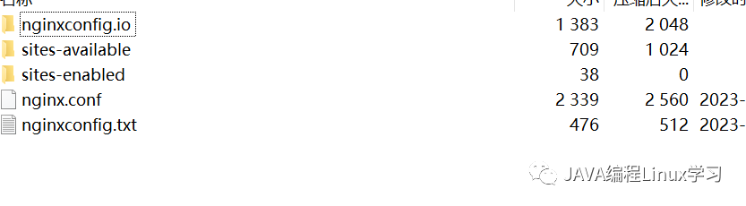

重启 Nginx 使配置生效；

```bash
docker restart nginx
```

项目地址：<https://github.com/digitalocean/nginxconfig.io>

## Nginx 常用命令

### 1.配置 nginx 环境变量

whereis nginx 找到 nginx 安装目录

前往跟目录 找到 etc 文件夹

vim profile 打开配置文件

添加环境变量（前半段 node 忽略）

```bash
export PATH=$PATH:/node-v14.19.1-linux-x64/bin:/usr/local/nginx/sbin
```

### 2.Nginx 常用命令介绍

#### 1.查看 nginx 版本号

```bash
nginx -v
nginx -V
```

#### 2.启动 nginx

直接执行 nginx 即可

#### 3.停止 nginx

```bash
nginx -s stop
```

Stop 是立即停止

```bash
nginx -s quit
```

Quit 是一个优雅的关闭方式，Nginx 在退出前完成已经接受的请求处理

#### 4.重载 nginx 配置文件

nginx -s reload

#### 5 查看 nginx 进程

```bash
ps -ef | grep nginx

ps -ef
```

输出标准格式的 linux 进程命令

```bash
grep nginx
```

grep 命令 是查找， 是一种强大的文本搜索工具 我们这儿是查找 nginx

## Nginx 反向代理

[nginx news](https://nginx.org/)

### Nginx 反向代理的配置语法

反向代理中的常用指令：

```bash
proxy_pass
proxy_set_header
```

proxy_pass

该指令用来设置被代理服务器地址，可以是主机名称、IP 地址加端口号形式。

#### 案例 1 代理到哔哩哔哩

```bash
location / {
   root   html;
   index  index.html index.htm;
   proxy_pass http://bilibili.com;
}
```

访问/就会被转到哔哩哔哩

#### 案例 2 nginx 反向代理解决跨域

##### 前端代码

         a.onclick = () => {
            let xhr = new XMLHttpRequest()

            xhr.open('GET','/api/portal/list')

            xhr.onreadystatechange = () => {
                if(xhr.readyState == 4 &&  xhr.status == 200){
                   console.log(xhr.responseText);
                }
            }

            xhr.send(null)
         }

##### express 服务端代码

```bash
const express = require('express')

const app = express()


app.get('/portal/list', (req, res) => {
    res.json({
        code: 200,
        message: "搞咩啊"
    })
})

app.listen(9000,()=>{
    console.log('success');
})
```

##### nginx 配置文件

        location /api/ {
            proxy_pass http://localhost:9000/;
        }

截取到/api/ 将会转发到：http://localhost:9000/

##### proxy_set_header

该指令可以更改 Nginx 服务器接收到的客户端请求的请求头信息，然后将新的请求头发送给代理的服务器

```bash
proxy_set_header X-Real-IP $remote_addr;
proxy_set_header X-Real-Port $remote_port;
proxy_set_header X-Forwarded-For $proxy_add_x_forwarded_for;
```

三个 header 分别表示：

- X-Real-IP 客户端或上一级代理 ip
- X-Real-Port 客户端或上一级端口
- X-Forwarded-For 包含了客户端和各级代理 ip 的完整 ip 链路

其中 X-Real-IP 是必需的，后两项选填。当只存在一级 nginx 代理的时候 X-Real-IP 和 X-Forwarded-For 是一致的，而当存在多级代理的时候，X-Forwarded-For 就变成了如下形式

$remote_addr 是前一节点的 IP，并不一定是用户的真实 IP。

## Nginx-Vue-History-404 问题

Vue histroy 模式 跳转路由 404 问题

### 问题原因

我们的服务器是根据页面路由，去按路径寻找资源的。我们打包好的 web 站点只有一个 html 页面，不存在其他资源目录下的 html，服务器找不到对应页面所以才报 404。

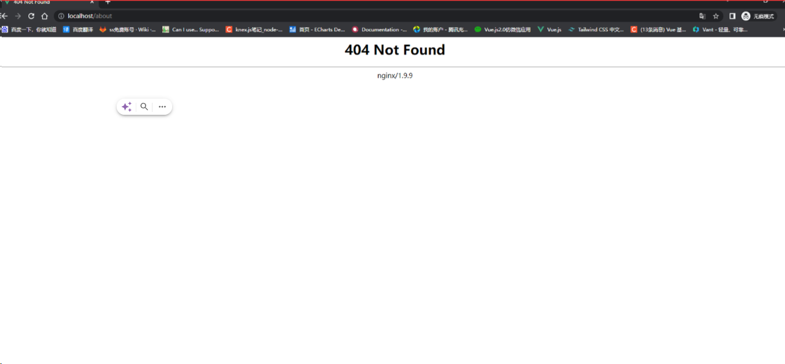

### 解决方案

```bash
try_files $uri $uri/ /index.html;
```

如果给出的 file 都没有匹配到，则重新请求最后一个参数给定的 uri，就是新的 location 匹配

常见的变量：

- $uri 当前请求的 URI，但不含“？”后的参数
- $args 当前请求的参数，即“？”后的宇符串
- $arg_xxx 当前请求里的某个参数，“arg ”后是参数的名字
- $http_xxx 当前请求里的 xxx 头部对应的值
- $sent_http_xxx 返回给客户端的响应头部对应的值
- $remote_addr 客户端 IP 地址。
- $http_cookie 获取 cookie 值
- $cookie_xxx 当前请求的 cookie xxx 对应的值
- $request_uri 浏览器发起的不作任何修改的请求的 url 中的 path 如在www.baidu.com/p1/file?d=111, 其值为/p1/file?d=111
- $uri 指当前的请求 URI，不包括任何参数，反映任何内部重定向或 index 模块所做的修改
- $request_method 请求方法

## Nginx 安装使用 Go-Access-日志分析器

将我们的 Linux 服务器设置为中文版

```cobol
$ localectl  set-locale LANG=zh_CN.UTF8
```

重启服务器即可

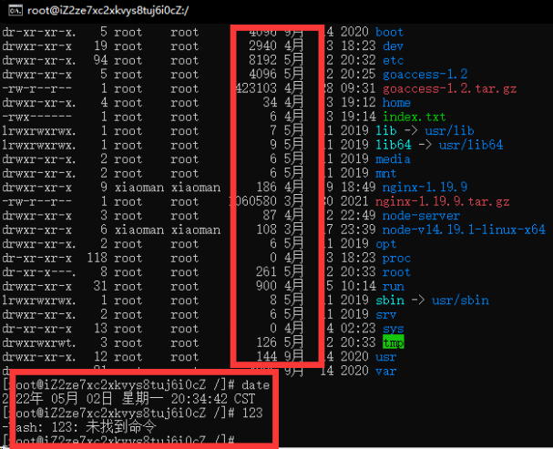

GoAccess 是一款开源、实时，运行在命令行终端下的 web 日志分析工具。该工具提供快速、多样的 HTTP 状态统计，可以令管理员不再纠结于统计各类数据，和繁杂的指令以及一大堆管道/正则表达式说 byebye

[小满 Linux（第十章 Nginx-Go-Access-日志分析器）\_--date-spec=-CSDN 博客](https://xiaoman.blog.csdn.net/article/details/124546293)

## Nginx-负载均衡 upstream

### 基本语法

upstream 的基本语法如下，一个 upstream 需要设置一个名称，这个名称可以在 server 里面当作 proxy 主机使用。

```bash
upstream  node {
    server 127.0.0.1:9001;
    server 127.0.0.1:9002;
    server 127.0.0.1:9003;
}
```

2

```bash
location / {
    proxy_pass http://node;
}
```

### 1.默认状态是按照轮询的方式去做负载的

使用 express 启动三个服务 分别是 9001 9002 9003

```js
const express = require("express");
var num = 1;
const app = express();

app.get("/list", (req, res) => {
	res.json({
		code: 200,
		message: "Nginx 负载均衡9001",
	});
	console.log("Nginx 负载均衡9001", num);
	num++;
});
//------------------------------9001
app.listen(9001, () => {
	console.log("9001 success");
});

//-----------------------------------
const express = require("express");
var num = 1;
const app = express();

app.get("/list", (req, res) => {
	res.json({
		code: 200,
		message: "Nginx 负载均衡9002",
	});
	console.log("Nginx 负载均衡9002", num);
	num++;
});
//------------------------------9002
app.listen(9002, () => {
	console.log("9002 success");
});

//--------------------------------

const express = require("express");
var num = 1;
const app = express();

app.get("/list", (req, res) => {
	res.json({
		code: 200,
		message: "Nginx 负载均衡9003",
	});
	console.log("Nginx 负载均衡9003", num);
	num++;
});
//------------------------------9003
app.listen(9003, () => {
	console.log("9003 success");
});
```

使用`postman`或者`Apifox`等接口测试软件请求压测。

经过 33 次压测之后 平均每个负载为 11 次证明轮询

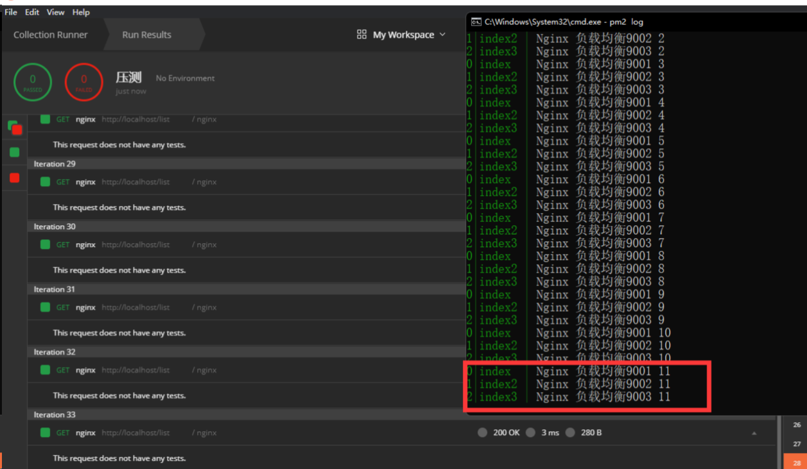

### 2.权重 weight

```bash
 upstream  node {
    server 127.0.0.1:9001 weight=3;
    server 127.0.0.1:9002 weight=2;
    server 127.0.0.1:9003 weight=1;
}
```

权重越大服务器承载的并发就越高

压测 100 更多的并发打到了 9001

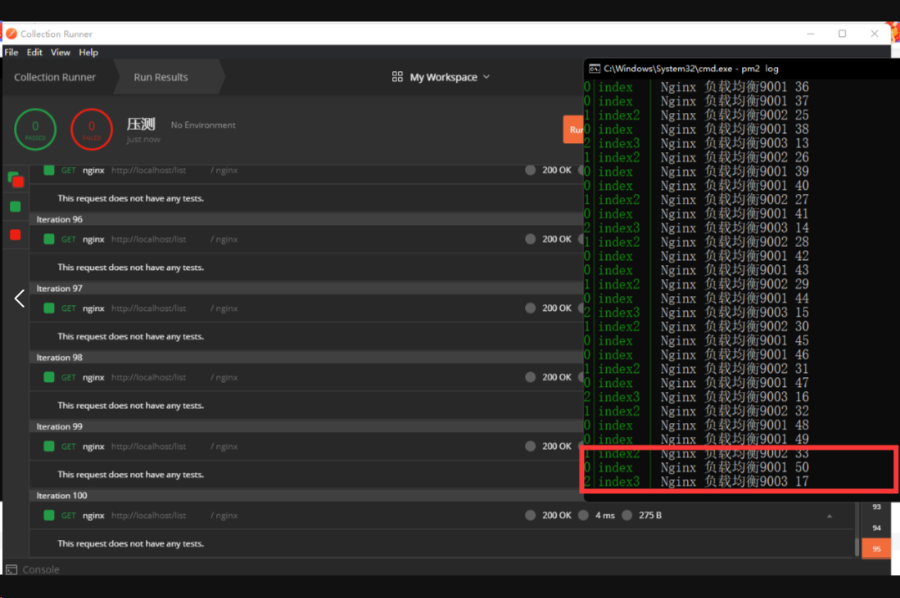

### 3.fail_timeout backup

fail_timeout 是故障等待超时时间

backup 是备用服务器参数，可以为一个 upstream 设置一个 backup 的 server，在生产 server 全部都出问题之后，可以自动切换到备用 server 上，为回复服务争取时间

    upstream  node {

        server 127.0.0.1:9001 fail_timeout=60;

        server 127.0.0.1:9002 fail_timeout=20;

        server 127.0.0.1:9003 backup;

    }

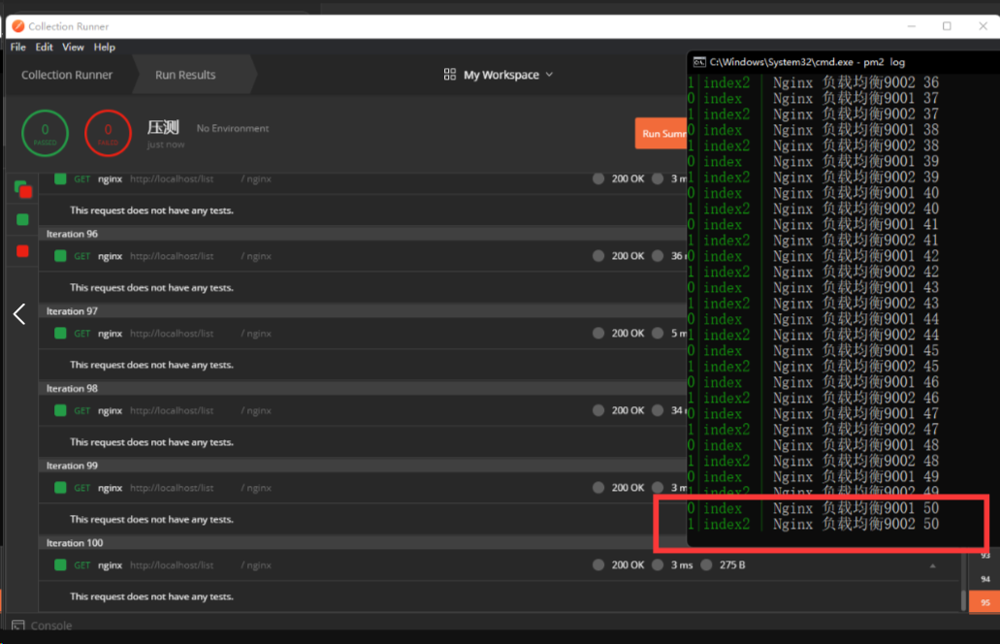
