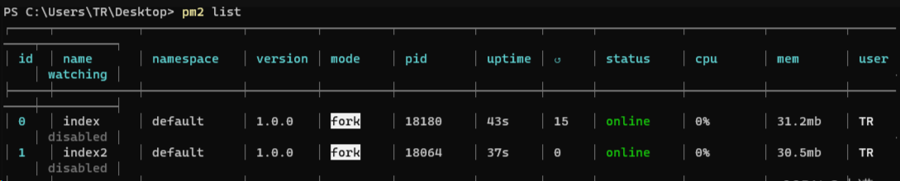
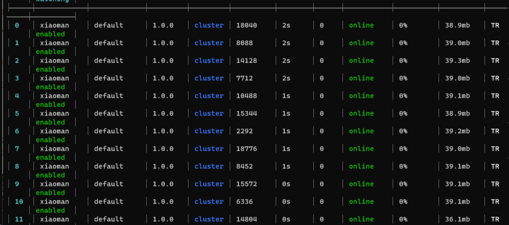
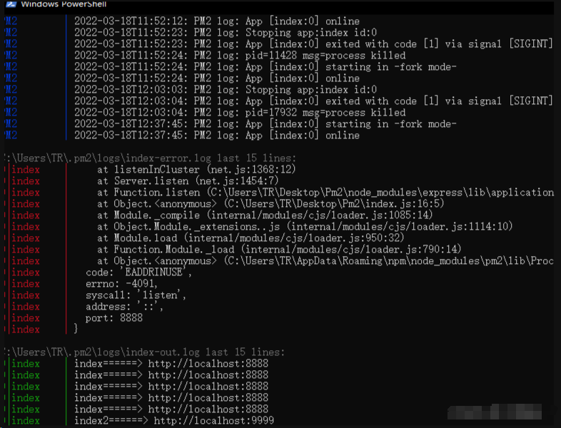
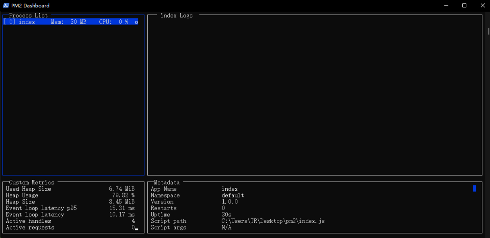

# Pm2的简介和配置使用

## Pm2介绍

pm2 是 node 进程管理工具，可以利用它来简化很多 node 应用管理的繁琐任务，如性能监控、自动重启、负载均衡等，因为在工作中遇到服务器重启后，需要一个个去重新启动每个服务，这样不仅繁琐、效率低，而且容易遗忘开启一些服务。

## PM2 的主要特性

- 内建负载均衡（使用 Node cluster 集群模块）
- 后台运行
- 0 秒停机重载
- 具有 Ubuntu 和 CentOS 的启动脚本
- 停止不稳定的进程（避免无限循环）
- 控制台检测
- 提供 HTTP API
- 远程控制和实时的接口 API ( Nodejs 模块,允许和 PM2 进程管理器交互 )

## 一、安装 & 目录

1、运行以下命令进行全局安装

```coffeescript
npm install -g pm2
```

2.查看是否安装成功，查看pm2的版本号

````bash
pm2 -v
````

## 二、常用命令

### 1、启动命令

```cobol
$ pm2 start app.js
```

启动成功后，我们对应可以看到启动的服务的一些信息，如下所示



### 2、命令行参数

我们可以在最基本的启动命令后面，添加一些参数选项，去满足我们的需求，常用的参数选项如下所示：

- --watch：监听应用目录的变化，一旦发生变化，自动重启。
- -i or --instance：启用多少个实例，可用于负载均衡，如果 -i 0 或者 -i max，则根据当前机器核数确定实例数目。
- --ignore-watch：排除监听的目录或文件，可以是特定的文件名，也可以是正则。

我们在启动命令后面加入以上的一些参数，完整的启动命令如下所示：

```bash
pm2 start app.js --watch -i max -n xiaoman
```

启动成功后的截图如下，我们通过截图可以看到启动的应用名称变为 xiaoman，然后启动12个进程，说明我们在启动命令后面添加的参数已经起作用。



### 3、重启

```bash
$ pm2 restart app.js
```

### 4、停止应用进程

停止特定的应用，可以通过 pm2 list 先获取应用的名字或者进程的 id，然后再调用以下命令停止相应的应用；

```bash
$ pm2 stop app_name | app_id
```

如果需要停止全部的应用，则使用以下命令：

```bash
$ pm2 stop all
```

### 5、删除应用进程

删除特定的应用，可以通过 pm2 list 先获取应用的名字或者进程的 id，然后再调用以下命令删除相应的应用；

```bash
$ pm2 delete app_name | app_id
```

如果需要删除全部的应用，则使用以下命令：

```bash
$ pm2 delete all
```

### 6、查看进程

以表格形式显示

```bash
$ pm2 list
```

## 三、配置文件

如果我们使用命令行参数定义一些选项，那么每次启动进程时，都需要敲上一大堆的命令，非常繁琐；所以我们可以使用配置文件来将命令行参数进行配置，配置文件里的配置项跟命令行参数是基本一致的；

如下所示  pm2 的配置文件 pm2.json ，然后在 package.json 文件中配置启动命令 "pm2": "pm2 start pm2.json" ，这样我们只需要运行 npm run pm2 就可以使用 pm2 启动我们的 express 项目，并且相关运行参数直接在 pm2.json 中配置好了。相关配置项表示的意义在下面文件中都已经注释说明

```json
{
    "apps": {
        "name": "express_project",       // 项目名          
        "script": "app.js",              // 执行文件
        "cwd": "./",                     // 根目录
        "args": "",                      // 传递给脚本的参数
        "interpreter": "",               // 指定的脚本解释器
        "interpreter_args": "",          // 传递给解释器的参数
        "watch": true,                   // 是否监听文件变动然后重启
        "ignore_watch": [                // 不用监听的文件
            "node_modules",
            "public"
        ],
        "exec_mode": "cluster_mode",     // 应用启动模式，支持 fork 和 cluster 模式
        "instances": "max",              // 应用启动实例个数，仅在 cluster 模式有效 默认为 fork
        "error_file": "./logs/app-err.log",         // 错误日志文件
        "out_file": "./logs/app-out.log",           // 正常日志文件
        "merge_logs": true,                         // 设置追加日志而不是新建日志
        "log_date_format": "YYYY-MM-DD HH:mm:ss",   // 指定日志文件的时间格式
        "min_uptime": "60s",                        // 应用运行少于时间被认为是异常启动
        "max_restarts": 30,                         // 最大异常重启次数
        "autorestart": true,                        // 默认为 true, 发生异常的情况下自动重启
        "restart_delay": "60"                       // 异常重启情况下，延时重启时间
        "env": {
           "NODE_ENV": "production",                // 环境参数，当前指定为生产环境
           "REMOTE_ADDR": ""               
        },
        "env_dev": {
            "NODE_ENV": "development",              // 环境参数，当前指定为开发环境
            "REMOTE_ADDR": ""
        },
        "env_test": {                               // 环境参数，当前指定为测试环境
            "NODE_ENV": "test",
            "REMOTE_ADDR": ""
        }
    }
}
```

## 四、高阶应用

### 1、负载均衡

可以使用 -i 参数配置集群数，实现负载均衡，相关命令如下，可以查看 官网章节；

```bash
$ pm2 start app.js -i 3 // 开启三个进程
$ pm2 start app.js -i max // 根据机器CPU核数，开启对应数目的进程 
```

### 2、日志查看

我们可以通过打开日志文件查看日志外，还可以通过 pm2 logs 来查看实时日志，这点有对于线上问题排查；日志查看命令如下：

```bash
$ pm2 logs
```

则我们可以在命令窗口实时看到日志输出：



### 3、监控

我们可以使用以下命令，查看当前通过 pm2 运行的进程的状态；

```crystal
$ pm2 monit
```

动态监控界面如下所示：



