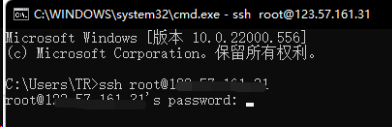
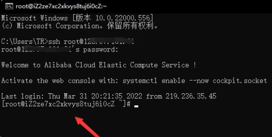
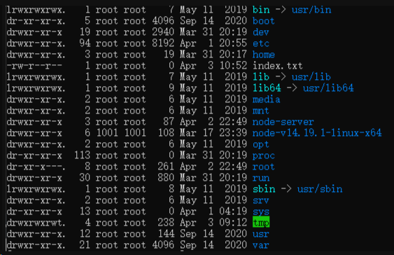
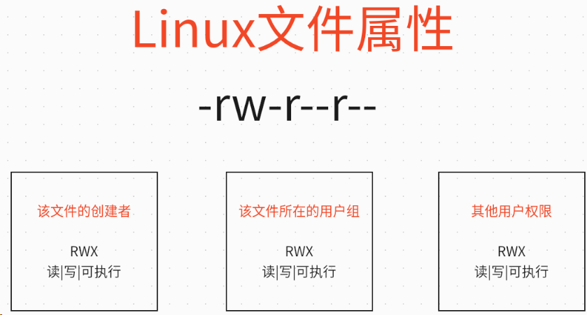
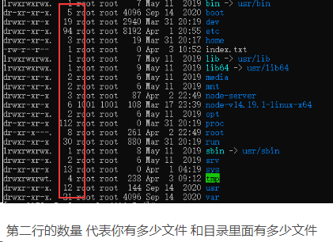
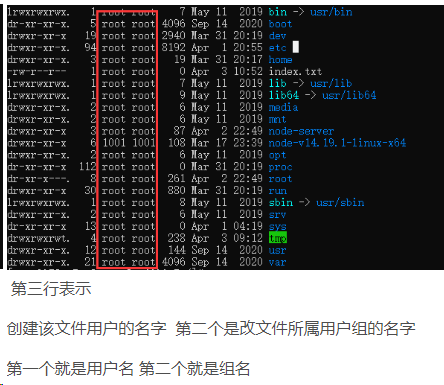
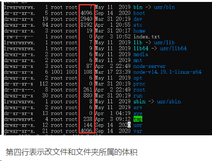
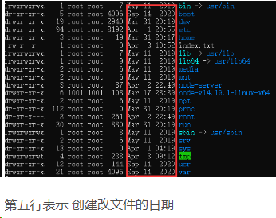
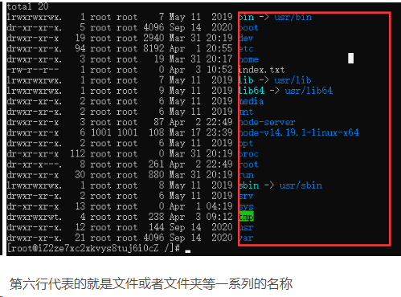
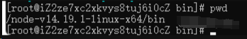

# 服务器运维和配置

## 一、服务器和域名购买

### 服务器服务商

阿里云服务器：

腾讯云服务器：

百度云服务器：

华为云服务器：

### 域名购买

## 二、认识服务器控制台菜单的信息

概览

站点设置

安全

服务器运维

## 三、服务端 Linux 运维

### 0.认识 Linux

Linux，全称 GNU/Linux，是一种免费使用和自由传播的类 UNIX 操作系统，其内核由林纳斯·本纳第克特·托瓦兹于 1991 年 10 月 5 日首次发布，它主要受到 Minix 和 Unix 思想的启发，是一个基于 POSIX 的多用户、多任务、支持多线程和多 CPU 的操作系统。

它能运行主要的 Unix 工具软件、应用程序和网络协议。它支持 32 位和 64 位硬件。Linux 继承了 Unix 以网络为核心的设计思想，是一个性能稳定的多用户网络操作系统。Linux 有上百种不同的发行版，如基于社区开发的 debian、archlinux，和基于商业开发的 Red Hat Enterprise Linux、SUSE、Oracle Linux 等。

### 1.连接 Linux 服务器

#### 1.使用 SSH 连接服务器

window 安装 SSH（安装地址） [mls-software.com](http://www.mls-software.com/opensshd.html)

Macbook 免安装自带

#### 2.使用方式

打开终端

ssh 账号默认 root@服务器地址

例子：ssh root@123.456.789

然后选择 Y ，然后输入密码即可



显示这个代表连接成功



### 2.常用的 Linux 命令

#### 查看当前的目录的文件

```bash
ls
```

查看文件属性信息

```bash
ls -l
```



##### 首字母作用

文件的开头对应是 -

目录开头对应的是 d

快捷方式对应的是 l

U 盘对应的是 b

鼠标键盘等硬件对应的 c

#### Linux 文件属性

每三个一组 rw-

-为缺少权限













#### 切换目录

```bash
cd 目录路径
```

#### Linux wget 命令用来下载软件

```bash
wget https://cdn.npmmirror.com/binaries/node/v14.19.1/node-v14.19.1-linux-x64.tar.xz
```

#### 下载完成之后——解压

```bash
使用tar 命令
-c: 压缩
-x：解压
-t：查看内容
-r：向压缩归档文件末尾追加文件
-u：更新原压缩包中的文件

这五个是独立的命令，压缩解压都要用到其中一个，可以和别的命令连用但只能用其中一个。下面的参数是根据需要在压缩或解压档案时可选的。

-z：有gzip属性的
-j：有bz2属性的
-Z：有compress属性的
-v：显示所有过程
-O：将文件解开到标准输出

下面的参数-f是必须的

-f: 使用档案名字，切记，这个参数是最后一个参数，后面只能接档案名。

# tar -cf all.tar *.jpg
这条命令是将所有.jpg的文件打成一个名为all.tar的包。-c是表示产生新的包，-f指定包的文件名。

# tar -rf all.tar *.gif
这条命令是将所有.gif的文件增加到all.tar的包里面去。-r是表示增加文件的意思。

# tar -uf all.tar logo.gif
这条命令是更新原来tar包all.tar中logo.gif文件，-u是表示更新文件的意思。

# tar -tf all.tar
这条命令是列出all.tar包中所有文件，-t是列出文件的意思

# tar -xf all.tar
这条命令是解出all.tar包中所有文件，-x是解开的意思

压缩
tar –cvf jpg.tar *.jpg //将目录里所有jpg文件打包成tar.jpg
tar –czf jpg.tar.gz *.jpg   //将目录里所有jpg文件打包成jpg.tar后，并且将其用gzip压缩，生成一个gzip压缩过的包，命名为jpg.tar.gz
tar –cjf jpg.tar.bz2 *.jpg //将目录里所有jpg文件打包成jpg.tar后，并且将其用bzip2压缩，生成一个bzip2压缩过的包，命名为jpg.tar.bz2
tar –cZf jpg.tar.Z *.jpg   //将目录里所有jpg文件打包成jpg.tar后，并且将其用compress压缩，生成一个umcompress压缩过的包，命名为jpg.tar.Z
rar a jpg.rar *.jpg //rar格式的压缩，需要先下载rar for Linux
zip jpg.zip *.jpg //zip格式的压缩，需要先下载zip for linux

解压
tar –xvf file.tar //解压 tar包
tar -xzvf file.tar.gz //解压tar.gz
tar -xjvf file.tar.bz2   //解压 tar.bz2
tar –xZvf file.tar.Z   //解压tar.Z
unrar e file.rar //解压rar
unzip file.zip //解压zip
```

我们执行

```bash
tar -xvf node-v14.19.1-linux-x64.tar.xz
```

#### Linux 权限

查看查看文件信息

```bash
ls -l
```

RWX 分别是可读 可写 可执行权限

这个权限我们可以修改使用 chmod 777 文件名

我们先学习一组规律

- 读------R 对应数字 4
- 写------W 对应数字 2
- 可执行-----X 对应数字 1

所以 7 就是可读可写可执行权限


我们可以在 root 账户下创建一个用户，测试一下 使用 adduser 账号 passwd 给用户设置密码

```bash
# 创建账户
adduser hehe
passwd hehe
```

重新使用这个新账户连接 sh，使用 cmd

```bash
sh hehe@公网ip
然后输入密码：
hehe
```

hehe 用户下的看看是否有权限：无权限 的用户将无法读写

```bash
echo hello>index.txt

# 没有权限出现：-bash:  index.txt: Permission denied
```

root 用户下增加这个账户的权限：我们 root 账号把 index.txt 设置 700

```bash
chmod 700 index.txt
```

再次在 hehe 用户下的看看是否有权限

```bash
echo hehe> index.txt
```

### 3.使用命令配置 Linux 服务器

#### 配置环境变量

```bash
pwd
```

命令用于显示工作目录



使用 pwd 命令获取 node bin 的位置

前往跟目录下面的 etc/profile 此文件涉及系统的环境，即环境变量相关。这里修改会对所有用户起作用

使用 vi 命令编辑该文件

```bash
vi profile
```

然后按一下 I 键 进入编辑模式

在最后一行添加

```bash
export PATH=$PATH:你的目录/node-v14.19.1-linux-x64/bin
```

然后执行 `source profile` 或者重启 linux

配置淘宝代理

```bash
npm config set registry https://registry.npm.taobao.org
```

### 4.未配置域名是可以使用公网 IP 访问地址

例如服务器公网 IP/接口名：

## 四、服务器软件配置

## Linux 安装 Nginx

### 1、安装 gcc

安装 nginx 需要先将官网下载的源码进行编译，编译依赖 gcc 环境，如果没有 gcc 环境，则需要安装：

```bash
yum install gcc-c++
```

### 2、PCRE pcre-devel 安装

PCRE(Perl Compatible Regular Expressions) 是一个 Perl 库，包括 perl 兼容的正则表达式库。nginx 的 http 模块使用 pcre 来解析正则表达式，所以需要在 linux 上安装 pcre 库，pcre-devel 是使用 pcre 开发的一个二次开发库。nginx 也需要此库。命令：

```bash
yum install -y pcre pcre-devel
```

### 3、zlib 安装

zlib 库提供了很多种压缩和解压缩的方式， nginx 使用 zlib 对 http 包的内容进行 gzip ，所以需要在 Centos 上安装 zlib 库。

```bash
yum install -y zlib zlib-devel
```

### 4、OpenSSL 安装

OpenSSL 是一个强大的安全套接字层密码库，囊括主要的密码算法、常用的密钥和证书封装管理功能及 SSL 协议，并提供丰富的应用程序供测试或其它目的使用。

nginx 不仅支持 http 协议，还支持 https（即在 ssl 协议上传输 http），所以需要在 Centos 安装 OpenSSL 库。

```bash
yum install -y openssl openssl-devel
```

### 5.下载 Nginx

```bash
wget https://nginx.org/download/nginx-1.19.9.tar.gz
```

### 6.解压 nginx

```bash
tar -zxvf nginx-1.19.9.tar.gz
cd nginx-1.19.9
```

### 7.执行 nginx-configure 文件

```bash
ls
./configure
```

### 8.make 命令编译

执行完后会有一个 MakeFile 文件夹

make 是一个命令工具，它解释 Makefile 中的指令（应该说是规则）。在 Makefile 文件中描述了整个工程所有文件的编译顺序、编译规则

```bash
make
make install
```

### 9.查询 nginx 安装目录

```bash
whereis nginx
```

### 10.进入安装目录执行 nginx

```bash
cd usr local/nginx
```

前往安装目录找到 sbin 执行 nginx

```bash
./nginx
```

### yum install 404 解决方案

1、进入配置文件内，删除所有的.repo 文件（也可以备份）

```bash
#进入配置文件夹
cd /etc/yum.repos.d/
#删除旧的配置文件
rm *.repo
#输入“y”回车确认
```

ls 确保该目录下的.repo 文件已完全删除
下载可以用的.repo 文件

```bash
wget -O /etc/yum.repos.d/CentOS-Base.repo https://mirrors.aliyun.com/repo/Centos-vault-8.5.2111.repo
```

如果没有安装 wget，也可以用下面命令：

```bash
curl -o /etc/yum.repos.d/CentOS-Base.repo https://mirrors.aliyun.com/repo/Centos-vault-8.5.2111.repo
```

运行 yum makecache 生成缓存

```bash
yum makecache
```

### Linux 防火墙

#### 1、firewalld 的基本使用

启动： systemctl start firewalld

查看状态： systemctl status firewalld

停止：systemctl stop firewalld

禁用：systemctl disable firewalld

#### 2.systemctl 是 CentOS7 的服务管理工具中主要的工具，它融合之前 service 和 chkconfig 的功能于一体

启动一个服务：systemctl start firewalld.service
关闭一个服务：systemctl stop firewalld.service
重启一个服务：systemctl restart firewalld.service
显示一个服务的状态：systemctl status firewalld.service
在开机时启用一个服务：systemctl enable firewalld.service
在开机时禁用一个服务：systemctl disable firewalld.service
查看服务是否开机启动：systemctl is-enabled firewalld.service
查看已启动的服务列表：systemctl list-unit-files|grep enabled
查看启动失败的服务列表：systemctl --failed

#### 3.配置 firewalld-cmd

查看版本： firewall-cmd --version

查看帮助： firewall-cmd --help

显示状态： firewall-cmd --state

查看所有打开的端口： firewall-cmd --zone=public --list-ports

更新防火墙规则： firewall-cmd --reload

查看区域信息: firewall-cmd --get-active-zones

查看指定接口所属区域： firewall-cmd --get-zone-of-interface=eth0

拒绝所有包：firewall-cmd --panic-on

取消拒绝状态： firewall-cmd --panic-off

查看是否拒绝： firewall-cmd --query-panic

#### 那怎么开启一个端口呢

##### 添加

```bash
firewall-cmd --zone=public --add-port=80/tcp --permanent    （--permanent永久生效，没有此参数重启后失效）
```

##### 重新载入

```bash
firewall-cmd --reload
```

##### 查看

```bash
firewall-cmd --zone= public --query-port=80/tcp
```

##### 删除

```bash
firewall-cmd --zone= public --remove-port=80/tcp --permanent
```

## 五、服务器部署项目

### 1.域名备案解析

只有中国大陆的服务器需要域名备案，而香港或者其他国家的服务器不需要备案域名

### 2.部署二级域名

Nginx 的 conf 配置

```json
# 把二级域名部署到这个vhosts文件夹
include /etc/nginx/vhosts/*.conf;
```

### 3.阿里主机绑定多个域名

域名在阿里云备案，需要解析到阿里主机或服务器，阿里云的服务器又不便宜只有新用户才便宜，又不想域名掉备案又不想花重金在阿里买服务器怎么搞呢？

买阿里云的主机，但是有多个域名一个主机怎么实现加载不同的内容呢，今天这个代码是通过 ChatGPT 做出来的。

1.实现了三个域名加载不同的内容。对应域名加载对应 HTML。

2.请注意，在实际使用时，需要根据实际情况进行修改和适当的调整。

3.首先在虚拟机根目录创建一个 index.php 和三个 html 并命名为域名前缀。

4.复制下面代码到 index.php 文件中，并修改文件中的域名为自己的。

```php
<?php

$host = $_SERVER['HTTP_HOST'];

switch ($host) {
    case 'www.xx8g.com':
        // 加载 xiaogao1.html 页面
        include 'xiaogao1.html';
        break;
    case 'www.xx8g2.cn':
        // 加载 xiaogao2.html 页面
        include 'xiaogao2.html';
        break;
    case 'www.xx8g3.cn':
        // 加载 xiaogao3.html 页面
        include 'xiaogao3.html';
        break;
    default:
        // 默认情况下返回一个 404 页面
        header('HTTP/1.1 404 Not Found');
        echo '<html><body>';
        echo '<h1>404 Not Found</h1>';
        echo '<p>The requested URL ' . $_SERVER['REQUEST_URI'] . ' was not found on this server.</p>';
        echo '</body></html>';
        break;
}
```

5.然后打开 html 修改要显示的内容即可，还有另一种实现的方法，使用伪静态，但是阿里云主机不支持 server 命令。
