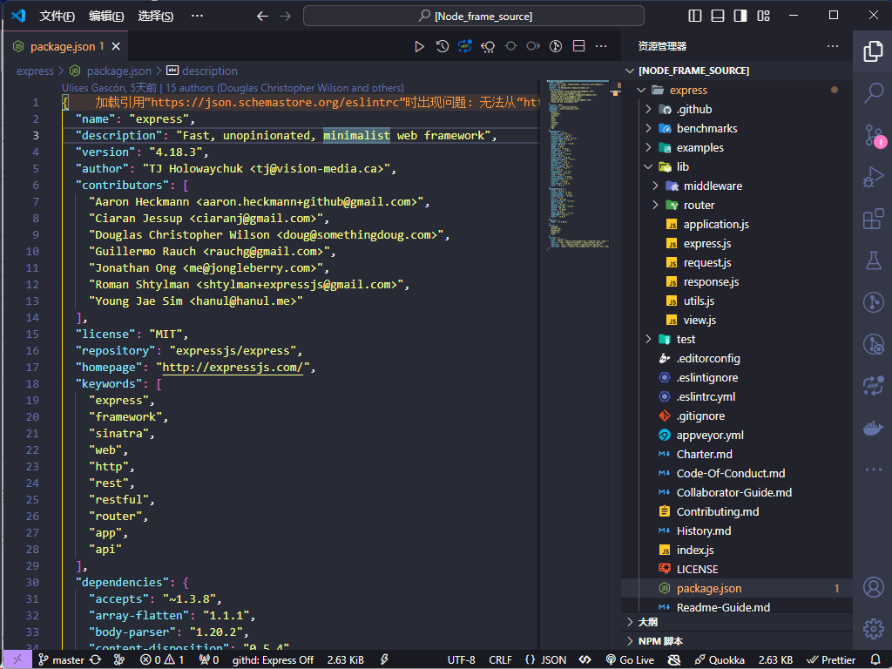
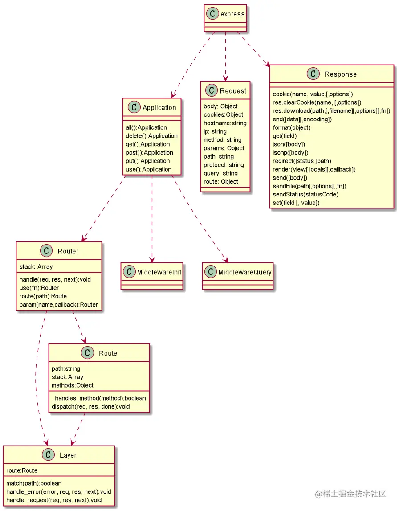
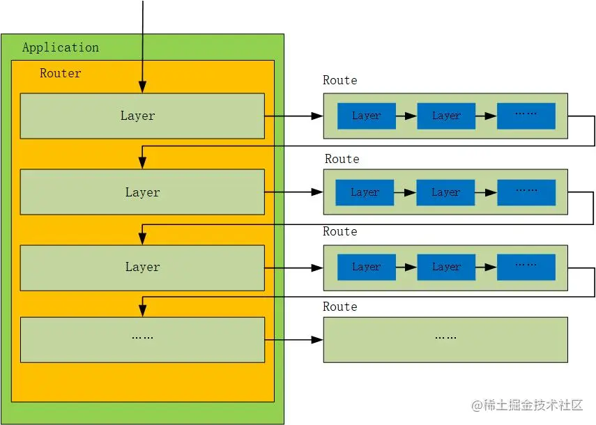
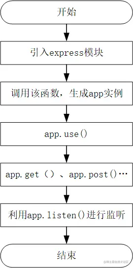
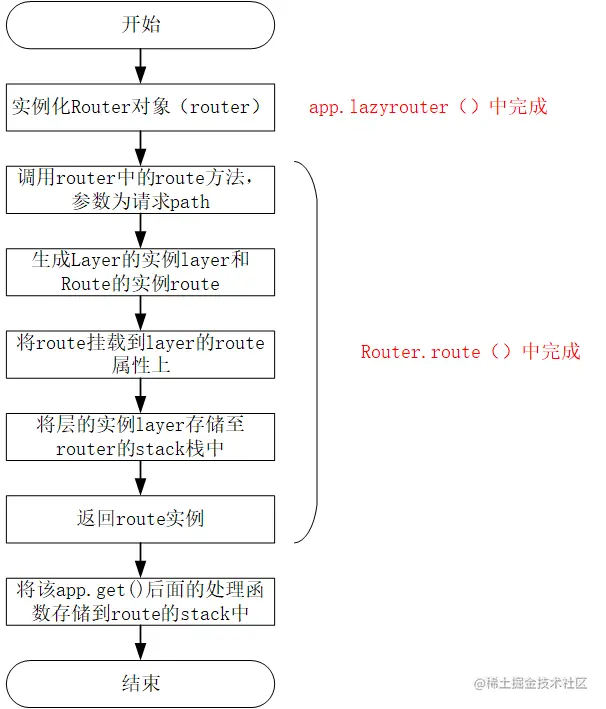
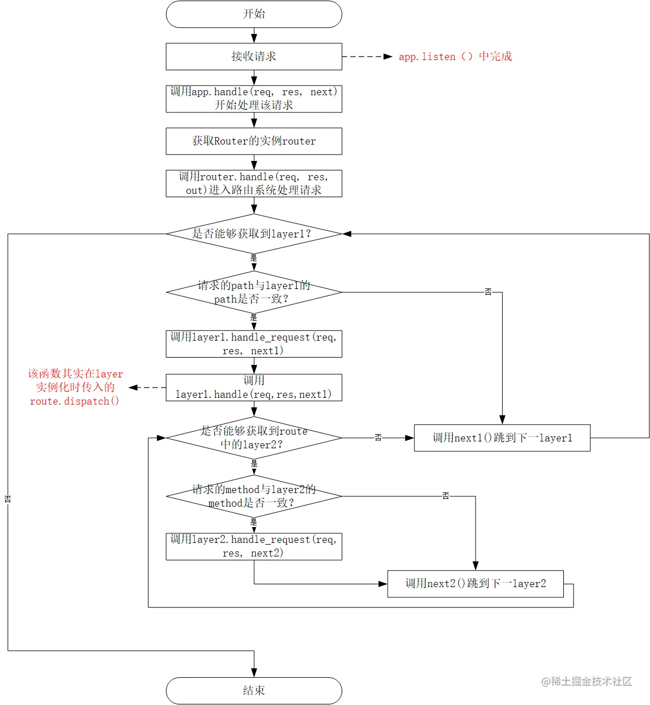

# Express 框架源码解析

## Express 框架源码下载和源码目录

Express 框架源码：<https://github.com/expressjs/express>

源码如下：



Express 框架的源码结构如下：

```bash
lib目录下
├── application.js  # 创建Express应用后可直接调用的api均在此处（核心）
├── express.js  # 入口文件，创建一个Express应用
├── request.js  # 丰富了http中request实例上的功能
├── response.js  # 丰富了http中response实例上的功能
├── utils.js  # 工具函数
├── view.js  # 与模板渲染相关的内容
├── router  # 与路由相关的内容（核心）
    ├── index.js
    ├── layer.js
    └── route.js
├── middleware  # 与中间件相关的内容
    ├── init.js  # 会将新增加在request和response新增加的功能挂载到原始请求的request和response的原型上
    └── query.js  # 将请求url中的query部分添加到request的query属性上
```

## Express 项目开发工作流程——基本概念和原理

### Express 框架的基本概念和原理

Express 框架的核心概念包括：

- 应用
- 中间件
- 路由
- 请求
- 响应

Express 框架的基本原理是：

- 使用中间件处理请求
- 使用路由匹配请求
- 使用回调函数处理请求

### Express 框架的工作流程

1. 创建一个 Express 应用。
2. 使用 use()方法注册中间件。
3. 使用 get()、post()、put()、delete()等方法注册路由。
4. 使用 listen()方法启动服务器。

**当一个 HTTP 请求到来时，Express 框架会按照以下步骤进行处理：**

1. 遍历所有中间件，并执行所有匹配的中间件。
2. 遍历所有路由，并找到第一个匹配的路由。
3. 执行路由的回调函数。
4. 将响应发送回客户端。

## Express 源码解析

### 文件方法解析

- 1.middleware(中间件)下主要有 init.js 和 query.js，init.js 的作用是初始化 request，response，而 query.js 中间件的作用是格式化 url，将 url 中的 rquest 参数剥离,储存到 req.query 中；
- 2.router 文件夹为 router 组件，包括 index.js、route.js 和 layer.js，router 组件负责中间件的插入和链式执行，具体将在下面讲解；
- 3.express.js（入口文件）和 application.js 是主要的框架文件，暴露了 express 的 api；
- 4.request.js 和 response.js 提供了一些方法丰富 request 和 response 实例的功能,如 req.is、req.get、req.params、req.originalUrl 等；
- 5.view.js 封装了模板渲染引擎，通过 res.render()调用引擎渲染网页。

### 抽象接口

对源码的目录结构有了一定了解，下面利用 UML 类图对该系统各个模块的依赖关系进一步了解，为后续源码分析打好基础。



### 设计原理

> 这一部分是整个 Express 框架的核心，下图是整个框架的运行流程，一看是不是很懵逼，为了搞清楚这一部分，需要明确四个概念：Application、Router、Layer、Route。



> 为了明确上述四个概念，先引入一段代码

```javascript
const express = require("./express");
const res = require("./response");
const app = express();
app.get(
	"/test1",
	(req, res, next) => {
		console.log("one");
		next();
	},
	(req, res) => {
		console.log("two");
		res.end("two");
	}
);
app.get(
	"/test2",
	(req, res, next) => {
		console.log("three");
		next();
	},
	(req, res) => {
		console.log("four");
		res.end("four");
	}
);
app.listen(3000);
```

1. Application：表示一个 Express 应用，通过 express()即可进行创建。
2. Router：路由系统，用于调度整个系统的运行，在上述代码中该路由系统包含 app.get('/test1',……)和 app.get('/test2',……)两大部分
3. Layer：代表一层，对于上述代码中 app.get('/test1',……)和 app.get('/test2',……)都可以成为一个 Layer
4. Route：一个 Layer 中会有多个处理函数的情况，这多个处理函数构成了 Route，而 Route 中的每一个函数又成为 Route 中的 Layer。对于上述代码中，app.get('/test1',……)中的两个函数构成一个 Route，每个函数又是 Route 中的 Layer。

> 了解完上述概念后，结合该幅图，就大概能对整个流程有了直观感受。首先启动服务，然后客户端发起了：<http://localhost:3000/test2> 的请求，该过程应该如何运行呢？
>
> 1. 启动服务时会依次执行程序，将该路由系统中的路径、请求方法、处理函数进行存储（这些信息根据一定结构存储在 Router、Layer 和 Route 中）
> 2. 对相应的地址进行监听，等待请求到达。
> 3. 请求到达，首先根据请求的 path 去从上到下进行匹配，路径匹配正确则进入该 Layer，否则跳出该 Layer。
> 4. 若匹配到该 Layer，则进行请求方式的匹配，若匹配方式匹配正确，则执行该对应 Route 中的函数。

**上述解释的比较简单，后续会在细节部分进一步阐述。**

### 体会细节

> 通过上述对 Express 设计原理的分析，下面将从两个方面做进一步的源码解读，下面流程图是一个常见的 Express 项目的过程，首先会进行 app 实例初始化、然后调用一系列中间件，最后建立监听。对于整个工程的运行来说，主要分为两个阶段：初始化阶段、请求处理阶段，下面将以 app.get()为例来阐述一下该核心细节。



#### 1 初始化阶段

> 下面利用 app.get()这个路由来了解一下工程的初始化阶段。



1.首先来看一下 app.get()的内容(源代码中 app.get()是通过遍历 methods 的方式产生)

```javascript
app.get = function (path) {
	// ……
	this.lazyrouter();

	var route = this._router.route(path);
	route.get.apply(route, slice.call(arguments, 1));
	return this;
};
```

2.在 app.lazyrouter()会完成 router 的实例化过程

```javascript
app.lazyrouter = function lazyrouter() {
	if (!this._router) {
		this._router = new Router({
			caseSensitive: this.enabled("case sensitive routing"),
			strict: this.enabled("strict routing"),
		});

		// 此处会使用一些中间件
		this._router.use(query(this.get("query parser fn")));
		this._router.use(middleware.init(this));
	}
};
```

注意：该过程中其实是利用了单例模式，保证整个过程中获取 router 实例的唯一性。

3.调用 router.route()方法完成 layer 的实例化、处理及保存，并返回实例化后的 route。(注意源码中是 proto.route)

```javascript
router.prototype.route = function route(path) {
	var route = new Route(path);
	var layer = new Layer(
		path,
		{
			sensitive: this.caseSensitive,
			strict: this.strict,
			end: true,
		},
		route.dispatch.bind(route)
	);

	layer.route = route; // 把route放到layer上

	this.stack.push(layer); // 把layer放到数组中
	return route;
};
```

4.将该 app.get()中的函数存储到 route 的 stack 中。(注意源码中也是通过遍历 method 的方式将 get 挂载到 route 的 prototype 上)

```javascript
Route.prototype.get = function () {
	var handles = flatten(slice.call(arguments));

	for (var i = 0; i < handles.length; i++) {
		var handle = handles[i];
		// ……
		// 给route添加layer，这个层中需要存放方法名和handler
		var layer = Layer("/", {}, handle);
		layer.method = method;

		this.methods[method] = true;
		this.stack.push(layer);
	}

	return this;
};
```

**注意：上述代码均删除了源码中一些异常判断逻辑，方便读者看清整体框架。**

> 通过上述的分析，可以看出初始化阶段主要做了两件事情：
>
> 1. 将路由处理方式（app.get()、app.post()……）、app.use()等划分为路由系统中的一个 Layer。
> 2. 对于每一个层中的处理函数全部存储至 Route 对象中，一个 Route 对象与一个 Layer 相互映射。

#### 2 请求处理阶段

> 当服务启动后即进入监听状态，等待请求到达后进行处理。



1.app.listen()使服务进入监听状态（实质上是调用了 http 模块）

```javascript
app.listen = function listen() {
	var server = http.createServer(this);
	return server.listen.apply(server, arguments);
};
```

2.当连接建立会调用 app 实例，app 实例中会立即执行 app.handle()函数，app.handle()函数会立即调用路由系统的处理函数 router.handle()

```javascript
app.handle = function handle(req, res, callback) {
	var router = this._router;
	// 如果路由系统中处理不了这个请求，就调用done方法
	var done =
		callback ||
		finalhandler(req, res, {
			env: this.get("env"),
			onerror: logerror.bind(this),
		});
	//……
	router.handle(req, res, done);
};
```

3.router.handle()主要是根据路径获取是否有匹配的 layer，当匹配到之后则调用 layer.prototype.handle_request()去执行 route 中内容的处理

```javascript
router.prototype.handle = function handle(req, res, out) {
	// 这个地方参数out就是done，当所有都匹配不到，就从路由系统中出来，名字很形象
	var self = this;
	// ……
	var stack = self.stack;

	// ……

	next();

	function next(err) {
		// ……
		// get pathname of request
		var path = getPathname(req);

		// find next matching layer
		var layer;
		var match;
		var route;

		while (match !== true && idx < stack.length) {
			layer = stack[idx++];
			match = matchLayer(layer, path);
			route = layer.route;
			// ……
		}

		// no match
		if (match !== true) {
			return done(layerError);
		}
		// ……

		// Capture one-time layer values
		req.params = self.mergeParams
			? mergeParams(layer.params, parentParams)
			: layer.params;
		var layerPath = layer.path;

		// this should be done for the layer
		self.process_params(layer, paramcalled, req, res, function (err) {
			if (err) {
				return next(layerError || err);
			}

			if (route) {
				return layer.handle_request(req, res, next);
			}

			trim_prefix(layer, layerError, layerPath, path);
		});
	}

	function trim_prefix(layer, layerError, layerPath, path) {
		// ……

		if (layerError) {
			layer.handle_error(layerError, req, res, next);
		} else {
			layer.handle_request(req, res, next);
		}
	}
};
```

4.layer.handle_request()会调用 route.dispatch()触发 route 中内容的执行

```javascript
Layer.prototype.handle_request = function handle(req, res, next) {
	var fn = this.handle;

	if (fn.length > 3) {
		// not a standard request handler
		return next();
	}

	try {
		fn(req, res, next);
	} catch (err) {
		next(err);
	}
};
```

5.route 中的通过判断请求的方法和 route 中 layer 的方法是否匹配，匹配的话则执行相应函数，若所有 route 中的 layer 都不匹配，则调到外层的 layer 中继续执行。

```javascript
Route.prototype.dispatch = function dispatch(req, res, done) {
	var idx = 0;
	var stack = this.stack;
	if (stack.length === 0) {
		return done();
	}

	var method = req.method.toLowerCase();
	// ……

	next();
	// 此next方法是用户调用的next，如果调用next会执行内层的next方法，如果没有匹配到会调用外层的next方法
	function next(err) {
		// ……

		var layer = stack[idx++];
		if (!layer) {
			return done(err);
		}

		if (layer.method && layer.method !== method) {
			return next(err);
		}

		// 如果当前route中的layer的方法匹配到了，执行此layer上的handler
		if (err) {
			layer.handle_error(err, req, res, next);
		} else {
			layer.handle_request(req, res, next);
		}
	}
};
```

> 通过上述的分析，可以看出初始化阶段主要做了两件事情：
>
> 1. 首先判断 layer 中的 path 和请求的 path 是否一致，一致则会进入 route 进行处理，否则调到下一层 layer
> 2. 在 route 中会判断 route 中的 layer 与请求方法是否一致，一致的话则函数执行，否则不执行，所有 route 中的 layer 执行完后跳到下层的 layer 进行执行。

### 调试 Express 源码

调试 Express 源码可以帮助您更好地理解源码的执行流程。可以使用 Node.js 的 debugger 工具进行调试。

## 核心源码解析

[超详细的《Express》核心原理解析（上） - 掘金 (juejin.cn)](https://juejin.cn/post/7095550340883283976#heading-6)

[超详细的《Express》核心原理解析（下） - 掘金 (juejin.cn)](https://juejin.cn/post/7100748215145725960)

[Express 中间件原理详解 - 掘金 (juejin.cn)](https://juejin.cn/post/6844903573663416334)
