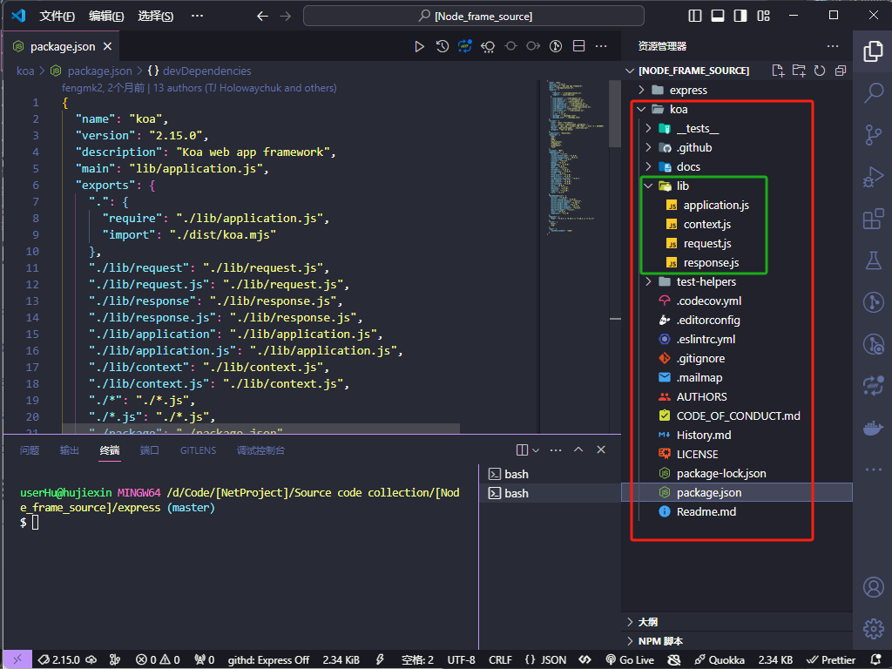
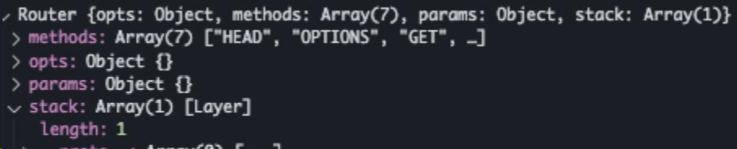

# KoaJS 框架源码解析

Koa 的 GitHub 开源地址：https://github.com/koajs/koa

了解实践完 koa 如何开发应用的流程和依赖的相关原理，就可以看 koa 源码，看如何实现了。

## 一、koa 是什么

koa 是一个精简的 node 框架，它主要做了以下事情：

- 1.基于 node 原生 req 和 res 为 request 和 response 对象赋能，并基于它们封装成一个 context 对象。
- 2.基于 async/await（generator）的中间件洋葱模型机制。

koa1 和 koa2 在源码上的区别主要是于对异步中间件的支持方式的不同。

- koa1 是使用 generator、yield 的模式。
- koa2 使用的是 async/await+Promise 的模式。

## 二、Koa 核心对象

HTTP 接收 解析 响应
中间件 执行上下文

Application Context

Request Response

Middlewares

Session Cookie

## 三、Koa 源码目录文件

koa 项目克隆下来后，主要源码在 lib 目录，源码文件，现在的 koa 版本是 2.15.0：



### 四个源码文件

```bash
── lib
├── application.js
├── context.js
├── request.js
└── response.js

# 对应了koa的4个对象：
── lib
├── new Koa() || ctx.app
├── ctx
├── ctx.req || ctx.request
└── ctx.res || ctx.response
```

#### 服务类：lib/application.js

##### 应用级别的方法和属性

application.js 是 koa 的入口（从 koa 文件夹下的 package.json 的 main 字段（lib/application.js）中可以得知此文件是入口文件），也是核心部分。

Koa 在 application 对象上，定义了一些应用级别的方法和属性，如 app.listen, app.use, app.env, app.proxy 等，用于启动服务器，加载中间件，设置环境变量，开启代理支持等。

application.js 核心其实处理了这 4 个事情：

- 1.启动框架
- 2.实现洋葱模型中间件机制
- 3.封装高内聚的 context
- 4.实现异步函数的统一错误处理机制

```js

```

#### 上下文对象：lib/context.js

##### 中间件参数

Koa 通过 context 参数，将 req 和 res 对象封装在一起，提供了一致的 API，避免了直接操作原生的 Node.js 对象。同时，Koa 也允许开发者通过 ctx.state 属性，传递一些自定义的数据给中间件。

在 application.createContext 函数中，被创建的 context 对象会挂载基于 request.js 实现的 request 对象和基于 response.js 实现的 response 对象。

2 个 delegate 的作用是让 context 对象代理 request 和 response 的部分属性和方法。

context.js 核心其实处理了这 2 个事情：

- 1.错误事件处理
- 2.代理 response 对象和 request 对象的部分属性和方法

```js

```

#### HTTP 请求对象：lib/request.js

##### 请求信息的获取

Koa 通过 request 对象，提供了一些便捷的方法，用于获取请求的信息，如 req.method, req.path, req.query, req.header, req.ip, req.is, req.get 等。Koa 还支持多种类型的请求参数，如查询字符串、表单数据、JSON 数据等。

在 application.js 的 createContext 函数中，会把 node 原生的 req 作为 request 对象(即 request.js 封装的对象)的属性。

request 对象基于 node 原生 req 封装了一系列便利属性和方法，供处理请求时调用。

所以当你访问 ctx.request.xxx 的时候，实际上是在访问 request 对象上的赋值器（setter）和取值器（getter）。

```js

```

#### HTTP 响应对象：lib/response.js

##### 响应内容的设置

Koa 通过 response 对象，提供了一些便捷的方法，用于设置响应的内容，如 res.body, res.status, res.type, res.length, res.redirect, res.attachment 等。Koa 还支持多种类型的响应内容，如字符串、Buffer、流、JSON、HTML 等。

在 application.js 的 createContext 函数中，会把 node 原生的 res 作为 response 对象（即 response.js 封装的对象）的属性。

response 对象基于 node 原生 res 封装了一系列便利属性和方法，供处理请求时调用。

所以当你访问 ctx.response.xxx 的时候，实际上是在访问 response 对象上的赋值器（setter）和取值器（getter）。

```js

```

### 中间件：middlewares

Koa 的洋葱模型是一种中间件执行流程的设计模式，通过 next() 函数和 await 关键字的配合，实现了中间件函数的顺序执行和控制权的传递。

Koa 中间件的实现主要依赖于 koa-compose 这个库，它会将中间件数组转化为一个 Promise 函数，然后递归地调用每个中间件函数，并传入 ctx 和 next 参数。

在 2.15.0 版本的代码中，洋葱模型的实现主要在以下几个文件中：

- lib/application.js：这里定义了 Koa 的 use 和 callback 方法，以及 handleRequest 方法，用于加载和执行中间件函数。
- lib/context.js：这里定义了 Koa 的 ctx 对象，用于封装请求和响应的信息，以及提供一些便捷的方法。
- lib/response.js：这里定义了 Koa 的 res 对象，用于设置响应的状态码、头部、内容等。
- lib/request.js：这里定义了 Koa 的 req 对象，用于获取请求的方法、路径、参数、头部等。
- node_modules/koa-compose/index.js：这里定义了 compose 函数，用于将中间件数组转化为一个 Promise 函数，并递归地调用每个中间件函数。

#### koa-compose 库的代码

```js
"use strict";

module.exports = compose;

/**
 * @param {Array} middleware
 * @return {Function}
 */
function compose(middleware) {
	if (!Array.isArray(middleware))
		throw new TypeError("Middleware stack must be an array!");
	for (const fn of middleware) {
		if (typeof fn !== "function")
			throw new TypeError("Middleware must be composed of functions!");
	}

	/**
	 * @param {Object} context
	 * @return {Promise}
	 * @api public
	 */
	return function (context, next) {
		let index = -1;
		return dispatch(0);
		// 主要函数
		function dispatch(i) {
			if (i <= index)
				return Promise.reject(new Error("next() called multiple times"));
			index = i;
			let fn = middleware[i];
			if (i === middleware.length) fn = next;
			if (!fn) return Promise.resolve();
			try {
				//
				return Promise.resolve(fn(context, dispatch.bind(null, i + 1)));
			} catch (err) {
				return Promise.reject(err);
			}
		}
	};
}
```

结合 koa 源码的 application.js 中的使用，调试

执行 koa 后端项目代码

```js
const mid1 = async (ctx, next) => {
	console.log(ctx.body);
	// 中间件执行的关键
	await next();
};
const mid2 = async (ctx, next) => {
	console.log(ctx.type);
	// 中间件执行的关键
	await next();
};
const mid3 = async (ctx, next) => {
	// 中间件执行的关键
	await next();
};

app.use(mid1);
app.use(mid2);
app.use(mid3);
```

## 四、深入理解 koa 源码

把项目实战结合，深入理解 koa 源码

从**初始化、启动应用、处理请求**等的角度，来**对这过程中比较重要**的细节进行讲解及延伸，如果彻底弄懂，会对 koa 以及 ES6、generator、async/await、co、异步中间件等有更深一步的了解。

## Koa 的最小实现

[Koa 源码导读及实现最小版解析并附源码 - 掘金 (juejin.cn)](https://juejin.cn/post/7023565121976795150)

文章的源码：[mini-code/code/koa at master · shfshanyue/mini-code (github.com)](https://github.com/shfshanyue/mini-code/tree/master/code/koa)

## Koa 核心的依赖库

Koa 开发项目，需要安装一些核心的依赖库，主要有以下几个：

- [**koa**]：这是 Koa 框架本身，提供了基本的 Web 服务器功能，以及中间件机制、上下文对象、请求响应处理等。
- [**koa-router**]：这是一个路由中间件，用于定义和匹配不同的 URL 路径，以及不同的 HTTP 方法，实现路由的分发和控制。
- [**koa-bodyparser**]：这是一个请求体解析中间件，用于解析客户端传递的数据，支持 JSON、表单、文本等格式，将解析后的数据挂载到 ctx.request.body 上。
- [**koa-static**]：这是一个静态资源服务中间件，用于托管静态文件，如图片、CSS、JS 等，可以设置缓存、压缩等选项。
- [**koa-session**]：
- [**koa-logger**]：
- [**sequelize**]：这是一个 ORM 库，用于操作数据库，支持多种数据库类型，如 MySQL、PostgreSQL、SQLite 等，提供了一系列的 API，让你可以用对象和 Promise 的方式操作数据。

## koa-router 源码解析

koa-router 开源地址：https://github.com/koajs/router

koa 项目路由例子：

```js
const Koa = require("koa");
const Router = require("koa-router");
const router = new Router();
const app = new Koa();

router.get("/test", (ctx, next) => {
	console.log("test");
	ctx.response.status = 200;
	ctx.body = "text";
});

router.get("/", (ctx, next) => {
	console.log("home");
	ctx.response.status = 200;
	ctx.body = "home";
});

app
	.use(async (ctx, next) => {
		console.log("中间件触发->进");
		await next();
		console.log("中间件触发->出");
	})
	.use(router.routes())
	.use(router.allowedMethods());

app.listen(1111);
```

先获取了 Router 类，并实例化一个 router，然后使用 router 提供的 api 定义我们 Node 服务的路由规则，最终使用 koa 的 use，将 router 组件放进 koa 的中间件中。

### new Router()到底干了什么？

```js
function Router(opts) {
	if (!(this instanceof Router)) {
		return new Router(opts);
	}

	this.opts = opts || {};
	this.methods = this.opts.methods || [
		"HEAD",
		"OPTIONS",
		"GET",
		"PUT",
		"PATCH",
		"POST",
		"DELETE",
	];

	this.params = {};
	this.stack = [];
}
```

Router 的 class 非常简单，只是对一些值的赋值和初始化。

在 Router 的原型上有以下一些 api：

- all
- allowedMethods
- match
- param
- prefix
- redirect
- register
- route
- url
- use
- del
- routes

在文档中出现的一些 get、post 等等的一些 api，并不在原型中，原因是在我们实例化会执行以下代码：

```js
methods.forEach(function (method) {
	Router.prototype[method] = function (name, path, middleware) {
		var middleware;

		if (typeof path === "string" || path instanceof RegExp) {
			middleware = Array.prototype.slice.call(arguments, 2);
		} else {
			middleware = Array.prototype.slice.call(arguments, 1);
			path = name;
			name = null;
		}

		this.register(path, [method], middleware, {
			name: name,
		});

		return this;
	};
});
```

这里 methods 实际上是：[http_methods | Node.js v20 文档](https://nodejs.cn/api/http.html#http_http_methods)返回的数组。这里实际上就是对当前 http 支持的请求方式都赋值到 Router 的原型上，从而实现了 router.get 这样的调用方式。

### 添加路由规则执行的代码

添加路由规则我们一般是使用 router.get 或者 post 等等的 api，那么具体是做什么呢，先看看源码。

```js
Router.prototype[method] = function (name, path, middleware) {
	var middleware;
	// 当判断我们是否有对路由进行命名
	if (typeof path === "string" || path instanceof RegExp) {
		middleware = Array.prototype.slice.call(arguments, 2);
	} else {
		// 当我们没有对路由进行命名，那么将第一个参数作为路径使用
		middleware = Array.prototype.slice.call(arguments, 1);
		path = name;
		name = null;
	}
	// 注册路由到Router中
	this.register(path, [method], middleware, {
		name: name,
	});

	return this;
};
```

将我们路由规则中的参数组装，并调用 Router 的 register 函数注册进 router 实例中。

```js
Router.prototype.register = function (path, methods, middleware, opts) {
	opts = opts || {};

	var router = this;
	var stack = this.stack;

	// 如果当前的path是一个数组的形式传入，将循环注册（同一个this中）
	if (Array.isArray(path)) {
		path.forEach(function (p) {
			router.register.call(router, p, methods, middleware, opts);
		});

		return this;
	}

	// 创建一个路由实例
	var route = new Layer(path, methods, middleware, {
		end: opts.end === false ? opts.end : true,
		name: opts.name,
		sensitive: opts.sensitive || this.opts.sensitive || false,
		strict: opts.strict || this.opts.strict || false,
		prefix: opts.prefix || this.opts.prefix || "",
		ignoreCaptures: opts.ignoreCaptures,
	});

	if (this.opts.prefix) {
		route.setPrefix(this.opts.prefix);
	}

	// add parameter middleware
	Object.keys(this.params).forEach(function (param) {
		route.param(param, this.params[param]);
	}, this);

	// 将路由实例推入router的stack中
	stack.push(route);

	return route;
};
```

Layer 实现

```js
function Layer(path, methods, middleware, opts) {
	this.opts = opts || {};
	this.name = this.opts.name || null;
	this.methods = [];
	this.paramNames = [];
	this.stack = Array.isArray(middleware) ? middleware : [middleware]; // 记录我们传入的回调函数是否是一个数组

	methods.forEach(function (method) {
		var l = this.methods.push(method.toUpperCase());
		if (this.methods[l - 1] === "GET") {
			// 当判断有GET请求，将在前面放入一个HEAD
			this.methods.unshift("HEAD");
		}
	}, this);

	// 必须确保传入的回调一定是一个函数
	this.stack.forEach(function (fn) {
		var type = typeof fn;
		if (type !== "function") {
			throw new Error(
				methods.toString() +
					" `" +
					(this.opts.name || path) +
					"`: `middleware` " +
					"must be a function, not `" +
					type +
					"`"
			);
		}
	}, this);

	this.path = path;
	this.regexp = pathToRegExp(path, this.paramNames, this.opts); // 将传入的路径转换为正则

	debug("defined route %s %s", this.methods, this.opts.prefix + this.path);
}
```

完成这一系列的操作后，当前的 router 实例是这样的



当我们声明多个路由规则的时候，stack 将会不停增加路由实例。

在这个时候其实我们一直都是在未 router 这个中间件添加路由规则，直到我们使用 koa 的 use 的方式将 router 注册进 koa，路由的规则才能生效。

```js
app.use(router.routes());
```

那么 router.routes()具体做了什么，是如何判断我们的请求进入那个路由规则中的呢？在 koa 的中间中使用 use，我们必须使用一个函数，所以 router.routes 最终返回一个 dispatch 函数给 koa 中间件去执行。

```js
Router.prototype.routes = Router.prototype.middleware = function () {
	var router = this;

	var dispatch = function dispatch(ctx, next) {
		debug("%s %s", ctx.method, ctx.path);

		var path = router.opts.routerPath || ctx.routerPath || ctx.path;
		// 执行router实例中的match函数
		var matched = router.match(path, ctx.method);
		var layerChain, layer, i;

		if (ctx.matched) {
			ctx.matched.push.apply(ctx.matched, matched.path);
		} else {
			ctx.matched = matched.path;
		}

		ctx.router = router;
		// 如果matchd的route为false，即没有method
		if (!matched.route) return next();

		var matchedLayers = matched.pathAndMethod;
		// 赋值到ctx中，最先命中的路由规则
		var mostSpecificLayer = matchedLayers[matchedLayers.length - 1];
		ctx._matchedRoute = mostSpecificLayer.path;
		if (mostSpecificLayer.name) {
			ctx._matchedRouteName = mostSpecificLayer.name;
		}

		// 实际上这里就是实现一个内部的中间件数组
		layerChain = matchedLayers.reduce(function (memo, layer) {
			// 暂时不知道作用，阅读到后面或许知道
			memo.push(function (ctx, next) {
				ctx.captures = layer.captures(path, ctx.captures);
				ctx.params = layer.params(path, ctx.captures, ctx.params);
				ctx.routerName = layer.name;
				return next();
			});
			return memo.concat(layer.stack);
		}, []);

		// 调用koa-compose
		// 内部实现一次洋葱模型并主动触发
		return compose(layerChain)(ctx, next);
	};

	dispatch.router = this;

	return dispatch;
};
```

到这里，最最最基本的配置路由及实现方式就结束了。实际上 koa 的 router 也是作为一个中间件，但是我们每一次注册的路由，最终都会在 koa-router 这个中间件中自己内部循环触发，相当于一个洋葱包着另外一个洋葱。

同时也通过代码发现一些问题，因为要确定当前的路径到底命中那个路由规则，所以需要在接受到请求的时候对所有注册的路由进行循环判断到底哪些命中了，然后内部再合成一个洋葱模型的中间件。当我们比较小型的应用可能路由只有十来二十个的时候，其实一点问题都没有，但是如果当我们路由规则相当多，达到一定量级，例如有 1 万个路由规则，那么这个时候在接受到请求的时候，循环匹配命中的路由将会带来一定的**性能损耗**！

### allowedMethods

在官方文档中，建议我们要配合 allowedMethods 这个中间件使用，那么 allowedMethods 中间件到底是干什么的，为什么要配合使用呢？

> Returns separate middleware for responding to`OPTIONS`requests with an`Allow`header containing the allowed methods, as well as responding with`405 Method Not Allowed`and`501 Not Implemented`as appropriate.

先来看看源码

```js
Router.prototype.allowedMethods = function (options) {
	options = options || {};
	var implemented = this.methods;

	return function allowedMethods(ctx, next) {
		return next().then(function () {
			var allowed = {};
			// 当没有status或者status == 404的时候，allowedMethods才开始工作。
			if (!ctx.status || ctx.status === 404) {
				// 获取当前路由的类型
				ctx.matched.forEach(function (route) {
					route.methods.forEach(function (method) {
						allowed[method] = method;
					});
				});

				var allowedArr = Object.keys(allowed);
				// 如果当前请求的类型不是支持的类型，那么将根据配置选择是返回501还是报错
				if (!~implemented.indexOf(ctx.method)) {
					if (options.throw) {
						var notImplementedThrowable;
						if (typeof options.notImplemented === "function") {
							notImplementedThrowable = options.notImplemented(); // set whatever the user returns from their function
						} else {
							notImplementedThrowable = new HttpError.NotImplemented();
						}
						throw notImplementedThrowable;
					} else {
						ctx.status = 501;
						ctx.set("Allow", allowedArr.join(", "));
					}
				} else if (allowedArr.length) {
					// 如果是OPTIONS请求，那么将返回当前命中路由所支持的请求类型
					if (ctx.method === "OPTIONS") {
						ctx.status = 200;
						ctx.body = "";
						ctx.set("Allow", allowedArr.join(", "));
						// 如果请求的类型不是当前路由支持的类型，那么将判断配置中是否报错，又或者默认返回405，并且告知客户端当前路由所支持的请求类型
					} else if (!allowed[ctx.method]) {
						if (options.throw) {
							var notAllowedThrowable;
							if (typeof options.methodNotAllowed === "function") {
								notAllowedThrowable = options.methodNotAllowed(); // set whatever the user returns from their function
							} else {
								notAllowedThrowable = new HttpError.MethodNotAllowed();
							}
							throw notAllowedThrowable;
						} else {
							ctx.status = 405;
							ctx.set("Allow", allowedArr.join(", "));
						}
					}
				}
			}
		});
	};
};
```

注释中也有写明，allowedMethods 必须紧跟 router 中间件。在中间件执行完后会对请求做一些兜底操作，具体干嘛已经在注释上写明。

### koa-router 的其他 api

看到文档，看见了还一些 api，那么继续看看源码，到底这些 api 有什么用呢？

- all
- use
- prefix
- redirect
- url
- param

#### all

```js
Router.prototype.all = function (name, path, middleware) {
	var middleware;

	if (typeof path === "string") {
		middleware = Array.prototype.slice.call(arguments, 2);
	} else {
		middleware = Array.prototype.slice.call(arguments, 1);
		path = name;
		name = null;
	}
	// methods就是所有能支持的请求类型，因为内部会经过循环比对是否命中路径规则，而且还命中请求类型
	// 所以尽可能少去使用all，而是明确指明使用的请求类型
	this.register(path, methods, middleware, {
		name: name,
	});

	return this;
};
```

#### use

```js
router.use(async (ctx, next) => {
	ctx.session = "123123";
	console.log("session -> in");
	await next();
	console.log("session -> out");
});

router.get("/test", (ctx, next) => {
	console.log("test");
	ctx.body = "text";
});

router.get("/", async (ctx, next) => {
	console.log("home");
	ctx.body = "home";
});
```

在 use 的源码中当使用 use 的时候没有指定路由规则，那么将是所有路由都可以命中，实际上当使用 use 的时候，也会调用 router.register 注册中间件，但是这个时候注册时所传入的 path 将会是这样**(.\*)**，可以命中所有路由，从而每次请求的 match 阶段，都会命中这个中间件。

官方还有另外一种写法，可以指定路由触发，和配置多个路由触发。

```js
// use middleware only with given path
router.use("/users", userAuth());

// or with an array of paths
router.use(["/users", "/admin"], userAuth());
```

源码判断到如果第一位是一个字符串，就直接注册时传入这个字符串当做这个中间件的 path，从而来命中，如果传入的是数组，那么就会循环执行 use 来将数组中的 path 逐个注册。

#### prefix

为你的路由设置前缀。

```js
router.prefix("/things/:thing_id");
```

从源码了解到，无论是的 prefix 是在注册路由前还是注册路由后，最终都会为每一个路由规则的 path 修改为 prefix + path，从而改变 router 规则中的 path 的正则表达式。

#### redirect

重定向

```js
Router.prototype.redirect = function (source, destination, code) {
	// 如果首字不是/将调用url函数创建一个合法的url
	if (source[0] !== "/") {
		source = this.url(source);
	}

	// 如果首字不是/将调用url函数创建一个合法的url
	if (destination[0] !== "/") {
		destination = this.url(destination);
	}

	return this.all(source, (ctx) => {
		ctx.redirect(destination); // 调用ctx中的redirect函数进行重定向
		ctx.status = code || 301;
	});
};
```

#### url

根据传入的具名路由规则获取对应的 path

#### param

一个 param 的 demo

```js
router
	.param("user", (id, ctx, next) => {
		ctx.user = users[id];
		if (!ctx.user) return (ctx.status = 404);
		return next();
	})
	.get("/users", (ctx) => {
		ctx.body = ctx.user;
	})
	.get("/users/:user", (ctx) => {
		ctx.body = ctx.user;
	})
	.get("/users/:user/friends", (ctx) => {
		return ctx.user.getFriends().then(function (friends) {
			ctx.body = friends;
		});
	});
```

param 源码

```js
Router.prototype.param = function (param, middleware) {
	this.params[param] = middleware;
	this.stack.forEach(function (route) {
		route.param(param, middleware);
	});
	return this;
};
```

在我们调用**param**的时候，实际上会添加在**router**实例上的**params**数组中。当我们添加**param**的时候，如果之前已经注册了路由，那么**stack**将会存在之前我们注册的路由，那么将循环调用**stack**中每个路由的**param**函数，来进行匹配当前加入的这个**param**是否命中。

在调用**param**之后，我们还需要注册路由的时候，那么将会在**register**的时候，循环当前**router**实例的**params**数组，循环调用**params**数组的来调用**route**的**param**方法来判断是否命中。

```js
Object.keys(this.params).forEach(function (param) {
	route.param(param, this.params[param]);
}, this);
```

那我们来看一下 param 是做了什么！

```js
Layer.prototype.param = function (param, fn) {
	var stack = this.stack;
	var params = this.paramNames;
	var middleware = function (ctx, next) {
		return fn.call(this, ctx.params[param], ctx, next);
	};
	middleware.param = param;

	var names = params.map(function (p) {
		return p.name;
	});

	var x = names.indexOf(param);
	if (x > -1) {
		// iterate through the stack, to figure out where to place the handler fn
		stack.some(function (fn, i) {
			// param handlers are always first, so when we find an fn w/o a param property, stop here
			// if the param handler at this part of the stack comes after the one we are adding, stop here
			if (!fn.param || names.indexOf(fn.param) > x) {
				// inject this param handler right before the current item
				stack.splice(i, 0, middleware);
				return true; // then break the loop
			}
		});
	}

	return this;
};
```

其实主要是判断当前的 Layer 实例中的 paramNames 参数是否有数据，该数据是通过在实例化一个 Layer 对象的时候通过 pathToRegExp 函数，对路径进行正则匹配，找到当前路径的带有“:“标识的参数值，然后存放在 paramNames 当中。回到 param 函数中，就是循环 paramNames 来将满足条件的 param 的回调函数放到当前路由 stack 的数组中，并且从头开始放入。从而实现匹配对应路由参数的匹配关系。

### 总结

- koa 的路由为了要满足洋葱模型的设计理念，避免不了不少循环
- 当使用 koa 的服务有大量的中间件，以及大量的路由时候，会产生大量的循环，从而影响启动速度和路由响应速度。
- 从源码中，我发现 koa 在整体上是很不错的框架，洋葱模式也是十分优秀，但是当我们的 node 服务逐渐庞大，路由和中间件使用的越来越多的时候，洋葱模型的设计就会成为了累赘，会产生很多循环来命中路由和执行中间件。所以当服务越来越大，路由规则和中间件越来越多的时候，就应该考虑不要使用 koa 或者将服务拆分（微服务）

## koa-session 源码解析
