# Vue2 源码解析

[推荐 7 个 Vue2、Vue3 源码解密分析的开源项目 👍 · Issue #35 · FrontEndGitHub/FrontEndGitHub](https://github.com/FrontEndGitHub/FrontEndGitHub/issues/35)

vue2 源码地址：<https://github.com/vuejs/vue.git>

petite-vue 源码解析

- github：<https://github.com/vuejs/petite-vue>
- petite-vue 源码解析文档：<http://fsjohnhuang.gitee.io/petite-vue-source-reading/>

解析 vue2 源码流程：

- 1.知道`Vue2`的功能原理
- 2.手写实现一个简版的`Vue2`
- 3.最后我们再去调试 vue2 源码的运行

## vue全家桶源码技术揭秘

[准备工作 | Vue.js 技术揭秘 (ustbhuangyi.github.io)](https://ustbhuangyi.github.io/vue-analysis/v2/prepare/)

开源地址：[ustbhuangyi/vue-analysis: :thumbsup: Vue.js 源码分析 (github.com)](https://github.com/ustbhuangyi/vue-analysis)

## Vue2 源码功能思维导图


## 一、mustache 模板引擎（帮助了解 vue 的模板渲染引擎）

### 1.什么是模板引擎

#### 1.模板引擎是将数据要变为视图最优雅的解决方案

数据：

```json
[
	{ "name": "小明", "age": 12, "sex": "男" },
	{ "name": "小红", "age": 11, "sex": "女" },
	{ "name": "小强", "age": 13, "sex": "男" }
]
```

Vue 的解决方法：这实际上就是一种模板引擎

```html
<li v-for="item in arr"></li>
```

视图：

```html
<ul>
	<li>
		<div class="hd">小明的基本信息</div>
		<div class="bd">
			<p>姓名：小明</p>
			<p>年龄：12</p>
			<p>性别：男</p>
		</div>
	</li>
	<li>
		<div class="hd">小红的基本信息</div>
		<div class="bd">
			<p>姓名：小红</p>
			<p>年龄：11</p>
			<p>性别：女</p>
		</div>
	</li>
	……
</ul>
```

#### 2.历史上曾经出现的[数据变为视图]的方法

**纯 DOM 法**： 非常笨拙，没有实战价值

```html
<!DOCTYPE html>
<html lang="en">
	<head>
		<meta charset="UTF-8" />
		<meta name="viewport" content="width=device-width, initial-scale=1.0" />
		<title>Document</title>
	</head>

	<body>
		<ul id="list"></ul>

		<script>
			var arr = [
				{ name: "小明", age: 12, sex: "男" },
				{ name: "小红", age: 11, sex: "女" },
				{ name: "小强", age: 13, sex: "男" },
			];

			var list = document.getElementById("list");

			for (var i = 0; i < arr.length; i++) {
				// 每遍历一项，都要用DOM方法去创建li标签
				let oLi = document.createElement("li");
				// 创建hd这个div
				let hdDiv = document.createElement("div");
				hdDiv.className = "hd";
				hdDiv.innerText = arr[i].name + "的基本信息";
				// 创建bd这个div
				let bdDiv = document.createElement("div");
				bdDiv.className = "bd";
				// 创建三个p
				let p1 = document.createElement("p");
				p1.innerText = "姓名：" + arr[i].name;
				bdDiv.appendChild(p1);
				let p2 = document.createElement("p");
				p2.innerText = "年龄：" + arr[i].age;
				bdDiv.appendChild(p2);
				let p3 = document.createElement("p");
				p3.innerText = "性别：" + arr[i].sex;
				bdDiv.appendChild(p3);

				// 创建的节点是孤儿节点，所以必须要上树才能被用户看见
				oLi.appendChild(hdDiv);
				// 创建的节点是孤儿节点，所以必须要上树才能被用户看见
				oLi.appendChild(bdDiv);
				// 创建的节点是孤儿节点，所以必须要上树才能被用户看见
				list.appendChild(oLi);
			}
		</script>
	</body>
</html>
```

**数组 join 法**： 曾几何时非常流行，是曾经的前端必会知识

```html
<!DOCTYPE html>
<html lang="en">
	<head>
		<meta charset="UTF-8" />
		<meta name="viewport" content="width=device-width, initial-scale=1.0" />
		<title>Document</title>
	</head>

	<body>
		<ul id="list"></ul>

		<script>
			var arr = [
				{ name: "小明", age: 12, sex: "男" },
				{ name: "小红", age: 11, sex: "女" },
				{ name: "小强", age: 13, sex: "男" },
			];

			var list = document.getElementById("list");

			// 遍历arr数组，每遍历一项，就以字符串的视角将HTML字符串添加到list中
			for (let i = 0; i < arr.length; i++) {
				list.innerHTML += [
					"<li>",
					'    <div class="hd">' + arr[i].name + "的信息</div>",
					'    <div class="bd">',
					"        <p>姓名：" + arr[i].name + "</p>",
					"        <p>年龄：" + arr[i].age + "</p>",
					"        <p>性别：" + arr[i].sex + "</p>",
					"    </div>",
					"</li>",
				].join("");
			}
		</script>
	</body>
</html>
```

**ES6 的反引号法**： ES6 中新增的`${a}`语法糖，很好用

```html
<!DOCTYPE html>
<html lang="en">
	<head>
		<meta charset="UTF-8" />
		<meta name="viewport" content="width=device-width, initial-scale=1.0" />
		<title>Document</title>
	</head>

	<body>
		<ul id="list"></ul>

		<script>
			var arr = [
				{ name: "小明", age: 12, sex: "男" },
				{ name: "小红", age: 11, sex: "女" },
				{ name: "小强", age: 13, sex: "男" },
			];

			var list = document.getElementById("list");

			// 遍历arr数组，每遍历一项，就以字符串的视角将HTML字符串添加到list中
			for (let i = 0; i < arr.length; i++) {
				list.innerHTML += `
                <li>
                    <div class="hd">${arr[i].name}的基本信息</div>    
                    <div class="bd">
                        <p>姓名：${arr[i].name}</p>    
                        <p>性别：${arr[i].sex}</p>    
                        <p>年龄：${arr[i].age}</p>    
                    </div>    
                </li>
            `;
			}
		</script>
	</body>
</html>
```

**模板引擎**： 解决数据变为视图的最优雅的方法

看下面

### 2.mustache 基本使用

#### mustache 库简介

- mustache 官方 git： <https://github.com/janl/mustache.js>
- mustache 是“胡子”的意思，因为它的嵌入标记{{ }}非常像胡子
- 而{{ }}的语法也被 Vue 沿用，这就是我们学习 mustache 的原因
- mustache 是最早的模板引擎库，比 Vue 诞生的早多了，它的底层实现机理在当时是非常有创造性的、轰动性的，为后续模板引擎的发展提供了崭新的思路

#### mustache 库基本使用

必须要引入 mustache 库，可以在 bootcdn.com 上找到它

mustache 的模板语法非常简单，比如前述案例的模板语法如下：

```html
<!DOCTYPE html>
<html lang="en">
	<head>
		<meta charset="UTF-8" />
		<meta name="viewport" content="width=device-width, initial-scale=1.0" />
		<title>Document</title>
	</head>

	<body>
		<div id="container"></div>

		<!-- 模板 -->
		<script type="text/template" id="mytemplate">
			<ul>
			    {{#arr}}
			        <li>
			            <div class="hd">{{name}}的基本信息</div>
			            <div class="bd">
			                <p>姓名：{{name}}</p>
			                <p>性别：{{sex}}</p>
			                <p>年龄：{{age}}</p>
			            </div>
			        </li>
			    {{/arr}}
			</ul>
		</script>

		<script src="jslib/mustache.js"></script>
		<script>
			var templateStr = document.getElementById("mytemplate").innerHTML;

			var data = {
				arr: [
					{ name: "小明", age: 12, sex: "男" },
					{ name: "小红", age: 11, sex: "女" },
					{ name: "小强", age: 13, sex: "男" },
				],
			};

			var domStr = Mustache.render(templateStr, data);
			var container = document.getElementById("container");
			container.innerHTML = domStr;
		</script>
	</body>
</html>
```

#### 循环对象数组

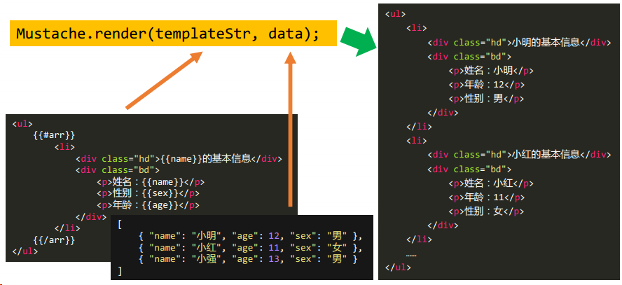

#### 不循环


#### 循环简单数组

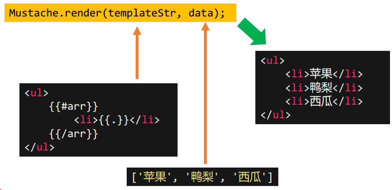

#### 数组可以嵌套


#### 布尔值

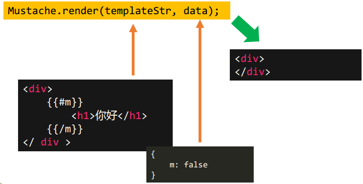

### 3.mustache 的底层核心机理

mustache 库不能用简单的正则表达式思路实现

**在较为简单的示例情况下，可以用正则表达式实现**

模板字符串

```html
<h1>我买了一个{{thing}}，好{{mood}}</h1>
```

数据

```json
{
	"thing": "华为手机",
	"mood": "开心"
}
```

但是当情况复杂时，正则表达式的思路肯定就不行了。比如这样的模板字符串，
是不能用正则表达式的思路实现的模板字符串

```html
<div>
	<ul>
		{{#arr}}
		<li>{{.}}</li>
		{{/arr}}
	</ul>
</div>
```

#### mustache 库的机理

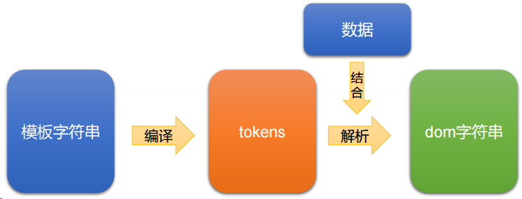

#### 什么是 tokens

- tokens 是一个 JS 的嵌套数组，说白了，就是模板字符串的 JS 表示
- 它是“抽象语法树”、“虚拟节点”等等的开山鼻祖

##### 模板字符串

```html
<h1>我买了一个{{thing}}，好{{mood}}啊</h1>
```

##### tokens：最外层的[]里面的每一个[]都是 token

```json
[
	["text", "<h1>我买了一个"],
	["name", "thing"],
	["text", "，好"],
	["name", "mood"],
	["text", "啊</h1>"]
]
```

演示一下正则表达式实现简单模板数据填充

```html
<!DOCTYPE html>
<html lang="en">
	<head>
		<meta charset="UTF-8" />
		<meta name="viewport" content="width=device-width, initial-scale=1.0" />
		<title>Document</title>
	</head>

	<body>
		<script>
			var templateStr =
				"<h1>我买了一个{{thing}}，花了{{money}}元，好{{mood}}</h1>";

			var data = {
				thing: "白菜",
				money: 5,
				mood: "激动",
			};

			// 最简单的模板引擎的实现机理，利用的是正则表达式中的replace()方法。
			// replace()的第二个参数可以是一个函数，这个函数提供捕获的东西的参数，就是$1
			// 结合data对象，即可进行智能的替换
			function render(templateStr, data) {
				return templateStr.replace(/\{\{(\w+)\}\}/g, function (findStr, $1) {
					return data[$1];
				});
			}

			var result = render(templateStr, data);
			console.log(result);
		</script>
	</body>
</html>
```

#### 模板解析原理

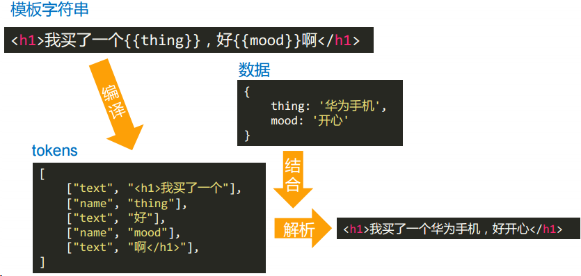

##### 循环情况下的 tokens

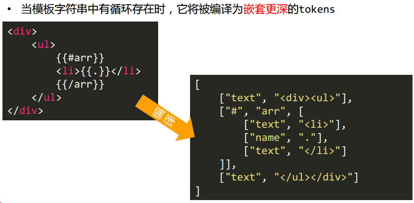

##### 双重循环情况下的 tokens

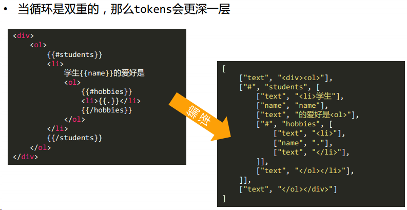

##### mustache 库的机理

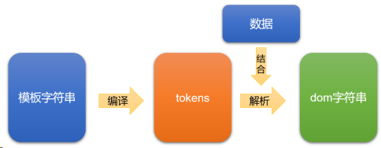

mustache 库底层重点要做两个事情：

- ① 将模板字符串编译为 tokens 形式
- ② 将 tokens 结合数据，解析为 dom 字符串

##### 观察 tokens

在 mustache.js 源码内找到 tokens 的赋值，打印 tokens 的值：console.log(tokens);

然后调用代码看看：

```html
<!DOCTYPE html>
<html lang="en">
	<head>
		<meta charset="UTF-8" />
		<meta name="viewport" content="width=device-width, initial-scale=1.0" />
		<title>Document</title>
	</head>

	<body>
		<script src="jslib/mustache.js"></script>
		<script>
			var templateStr1 = `
            <ul>
                {{#arr}}
                    <li>
                        <div class="hd">{{name}}的基本信息</div>    
                        <div class="bd">
                            <p>姓名：{{name}}</p>    
                            <p>性别：{{sex}}</p>    
                            <p>年龄：{{age}}</p>    
                        </div>
                    </li>
                {{/arr}}
            </ul>
        `;

			var templateStr2 = `
            <ul>
                {{#arr}}
                    <li>
                        {{name}}的爱好是：
                        <ol>
                            {{#hobbies}} 
                                <li>{{.}}</li>
                            {{/hobbies}} 
                        </ol>
                    </li>    
                {{/arr}}
            </ul>
        `;

			Mustache.render(templateStr2, {});
		</script>
	</body>
</html>
```

### 4.:a:手写实现 mustache 库

#### 使用 webpack 和 webpack-dev-server 构建

- 模块化打包工具有 webpack（webpack-dev-server）、rollup、Parcel 等
- mustache 官方库使用 rollup 进行模块化打包，而我们今天使用 webpack（webpack-dev-server）进行模块化打包，这是因为 webpack（webpack-dev-server）能让我们更方便地在浏览器中（而不是 nodejs 环境中）实时调试程序，相比 nodejs 控制台，浏览器控制台更好用，比如能够点击展开数组的每项。
- 生成库是 UMD 的，这意味着它可以同时在 nodejs 环境中使用，也可以在浏览器环境中使用。实现 UMD 不难，只需要一个“通用头”即可。

模块化打包工具有 webpack（webpack-dev-server）、rollup、Parcel 等

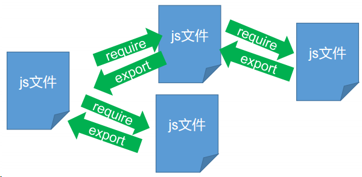

#### 项目目录和文件

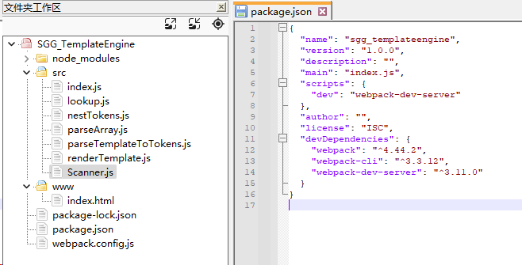

##### src 目录

- index.js
- lookup.js
- nestTokens.js
- parseArray.js
- parseTemplateToTokens.js
- renderTemplate.js
- Scanner.js

##### www 目录

index.html

```html
<!DOCTYPE html>
<html lang="en">
	<head>
		<meta charset="UTF-8" />
		<meta name="viewport" content="width=device-width, initial-scale=1.0" />
		<title>Document</title>
	</head>

	<body>
		<div id="container"></div>

		<script src="/xuni/bundle.js"></script>

		<script>
			// 模板字符串
			var templateStr = `
            <div>
                <ul>
                    {{#students}}
                    <li class="myli">
                        学生{{name}}的爱好是
                        <ol>
                            {{#hobbies}}
                            <li>{{.}}</li>
                            {{/hobbies}}
                        </ol>
                    </li>
                    {{/students}}
                </ul>
            </div>
        `;

			// 数据
			var data = {
				students: [
					{ name: "小明", hobbies: ["编程", "游泳"] },
					{ name: "小红", hobbies: ["看书", "弹琴", "画画"] },
					{ name: "小强", hobbies: ["锻炼"] },
				],
			};

			// 调用render
			var domStr = SSG_TemplateEngine.render(templateStr, data);
			console.log(domStr);

			// 渲染上树
			var container = document.getElementById("container");
			container.innerHTML = domStr;
		</script>
	</body>
</html>
```

##### webpack.config.js 文件

```json
const path = require('path');

module.exports = {
    // 模式，开发
    mode: 'development',
    // 入口
    entry: './src/index.js',
    // 打包到什么文件
    output: {
        filename: 'bundle.js'
    },
    // 配置一下webpack-dev-server
    devServer: {
        // 静态文件根目录
        contentBase: path.join(__dirname, "www"),
        // 不压缩
        compress: false,
        // 端口号
        port: 8080,
        // 虚拟打包的路径，bundle.js文件没有真正的生成
        publicPath: "/xuni/"
    }
};
```

##### package.json

```json
{
	"name": "sgg_templateengine",
	"version": "1.0.0",
	"description": "",
	"main": "index.js",
	"scripts": {
		"dev": "webpack-dev-server"
	},
	"author": "",
	"license": "ISC",
	"devDependencies": {
		"webpack": "^4.44.2",
		"webpack-cli": "^3.3.12",
		"webpack-dev-server": "^3.11.0"
	}
}
```

开发时注意事项

- 学习源码时，源码思想要借鉴，而不要抄袭。要能够发现源码中书写的精彩的地方；
- 将独立的功能拆写为独立的 js 文件中完成，通常是一个独立的类，每个单独的功能必须能独立的“单元测试”；
- 应该围绕中心功能，先把主干完成，然后修剪枝叶；
- 功能并不需要一步到位，功能的拓展要一步步完成，有的非核心功能甚至不需实现；

#### :b: 模板引擎源码手写实现

index.js

```js
import parseTemplateToTokens from "./parseTemplateToTokens.js";
import renderTemplate from "./renderTemplate.js";

// 全局提供SSG_TemplateEngine对象
window.SSG_TemplateEngine = {
	// 渲染方法
	render(templateStr, data) {
		// 调用parseTemplateToTokens函数，让模板字符串能够变为tokens数组
		var tokens = parseTemplateToTokens(templateStr);
		// 调用renderTemplate函数，让tokens数组变为dom字符串
		var domStr = renderTemplate(tokens, data);

		return domStr;
	},
};
```

lookup.js

```js
/* 
    功能是可以在dataObj对象中，寻找用连续点符号的keyName属性
    比如，dataObj是
    {
        a: {
            b: {
                c: 100
            }
        }
    }
    那么lookup(dataObj, 'a.b.c')结果就是100
    不忽悠大家，这个函数是某个大厂的面试题
*/
export default function lookup(dataObj, keyName) {
	// 看看keyName中有没有点符号，但是不能是.本身
	if (keyName.indexOf(".") != -1 && keyName != ".") {
		// 如果有点符号，那么拆开
		var keys = keyName.split(".");
		// 设置一个临时变量，这个临时变量用于周转，一层一层找下去。
		var temp = dataObj;
		// 每找一层，就把它设置为新的临时变量
		for (let i = 0; i < keys.length; i++) {
			temp = temp[keys[i]];
		}
		return temp;
	}
	// 如果这里面没有点符号
	return dataObj[keyName];
}
```

nestTokens.js

```js
/* 
    函数的功能是折叠tokens，将#和/之间的tokens能够整合起来，作为它的下标为3的项
*/
export default function nestTokens(tokens) {
	// 结果数组
	var nestedTokens = [];
	// 栈结构，存放小tokens，栈顶（靠近端口的，最新进入的）的tokens数组中当前操作的这个tokens小数组
	var sections = [];
	// 收集器，天生指向nestedTokens结果数组，引用类型值，所以指向的是同一个数组
	// 收集器的指向会变化，当遇见#的时候，收集器会指向这个token的下标为2的新数组
	var collector = nestedTokens;

	for (let i = 0; i < tokens.length; i++) {
		let token = tokens[i];

		switch (token[0]) {
			case "#":
				// 收集器中放入这个token
				collector.push(token);
				// 入栈
				sections.push(token);
				// 收集器要换人。给token添加下标为2的项，并且让收集器指向它
				collector = token[2] = [];
				break;
			case "/":
				// 出栈。pop()会返回刚刚弹出的项
				sections.pop();
				// 改变收集器为栈结构队尾（队尾是栈顶）那项的下标为2的数组
				collector =
					sections.length > 0 ? sections[sections.length - 1][2] : nestedTokens;
				break;
			default:
				// 甭管当前的collector是谁，可能是结果nestedTokens，也可能是某个token的下标为2的数组，甭管是谁，推入collctor即可。
				collector.push(token);
		}
	}

	return nestedTokens;
}
```

parseArray.js

```js
import lookup from "./lookup.js";
import renderTemplate from "./renderTemplate.js";

/* 
    处理数组，结合renderTemplate实现递归
    注意，这个函数收的参数是token！而不是tokens！
    token是什么，就是一个简单的['#', 'students', [

    ]]
    
    这个函数要递归调用renderTemplate函数，调用多少次？？？
    千万别蒙圈！调用的次数由data决定
    比如data的形式是这样的：
    {
        students: [
            { 'name': '小明', 'hobbies': ['游泳', '健身'] },
            { 'name': '小红', 'hobbies': ['足球', '蓝球', '羽毛球'] },
            { 'name': '小强', 'hobbies': ['吃饭', '睡觉'] },
        ]
    };
    那么parseArray()函数就要递归调用renderTemplate函数3次，因为数组长度是3
*/

export default function parseArray(token, data) {
	// 得到整体数据data中这个数组要使用的部分
	var v = lookup(data, token[1]);
	// 结果字符串
	var resultStr = "";
	// 遍历v数组，v一定是数组
	// 注意，下面这个循环可能是整个包中最难思考的一个循环
	// 它是遍历数据，而不是遍历tokens。数组中的数据有几条，就要遍历几条。
	for (let i = 0; i < v.length; i++) {
		// 这里要补一个“.”属性
		// 拼接
		resultStr += renderTemplate(token[2], {
			...v[i],
			".": v[i],
		});
	}
	return resultStr;
}
```

parseTemplateToTokens.js

```js
import Scanner from "./Scanner.js";
import nestTokens from "./nestTokens.js";

/* 
    将模板字符串变为tokens数组
*/
export default function parseTemplateToTokens(templateStr) {
	var tokens = [];
	// 创建扫描器
	var scanner = new Scanner(templateStr);
	var words;
	// 让扫描器工作
	while (!scanner.eos()) {
		// 收集开始标记出现之前的文字
		words = scanner.scanUtil("{{");
		if (words != "") {
			// 尝试写一下去掉空格，智能判断是普通文字的空格，还是标签中的空格
			// 标签中的空格不能去掉，比如<div class="box">不能去掉class前面的空格
			let isInJJH = false;
			// 空白字符串
			var _words = "";
			for (let i = 0; i < words.length; i++) {
				// 判断是否在标签里
				if (words[i] == "<") {
					isInJJH = true;
				} else if (words[i] == ">") {
					isInJJH = false;
				}
				// 如果这项不是空格，拼接上
				if (!/\s/.test(words[i])) {
					_words += words[i];
				} else {
					// 如果这项是空格，只有当它在标签内的时候，才拼接上
					if (isInJJH) {
						_words += " ";
					}
				}
			}
			// 存起来，去掉空格
			tokens.push(["text", _words]);
		}
		// 过双大括号
		scanner.scan("{{");
		// 收集开始标记出现之前的文字
		words = scanner.scanUtil("}}");
		if (words != "") {
			// 这个words就是{{}}中间的东西。判断一下首字符
			if (words[0] == "#") {
				// 存起来，从下标为1的项开始存，因为下标为0的项是#
				tokens.push(["#", words.substring(1)]);
			} else if (words[0] == "/") {
				// 存起来，从下标为1的项开始存，因为下标为0的项是/
				tokens.push(["/", words.substring(1)]);
			} else {
				// 存起来
				tokens.push(["name", words]);
			}
		}
		// 过双大括号
		scanner.scan("}}");
	}

	// 返回折叠收集的tokens
	return nestTokens(tokens);
}
```

renderTemplate.js

```js
import lookup from "./lookup.js";
import parseArray from "./parseArray.js";
/* 
    函数的功能是让tokens数组变为dom字符串
*/
export default function renderTemplate(tokens, data) {
	// 结果字符串
	var resultStr = "";
	// 遍历tokens
	for (let i = 0; i < tokens.length; i++) {
		let token = tokens[i];
		// 看类型
		if (token[0] == "text") {
			// 拼起来
			resultStr += token[1];
		} else if (token[0] == "name") {
			// 如果是name类型，那么就直接使用它的值，当然要用lookup
			// 因为防止这里是“a.b.c”有逗号的形式
			resultStr += lookup(data, token[1]);
		} else if (token[0] == "#") {
			resultStr += parseArray(token, data);
		}
	}

	return resultStr;
}
```

Scanner.js

```js
/* 
    扫描器类
*/
export default class Scanner {
	constructor(templateStr) {
		// 将模板字符串写到实例身上
		this.templateStr = templateStr;
		// 指针
		this.pos = 0;
		// 尾巴，一开始就是模板字符串原文
		this.tail = templateStr;
	}

	// 功能弱，就是走过指定内容，没有返回值
	scan(tag) {
		if (this.tail.indexOf(tag) == 0) {
			// tag有多长，比如{{长度是2，就让指针后移多少位
			this.pos += tag.length;
			// 尾巴也要变，改变尾巴为从当前指针这个字符开始，到最后的全部字符
			this.tail = this.templateStr.substring(this.pos);
		}
	}

	// 让指针进行扫描，直到遇见指定内容结束，并且能够返回结束之前路过的文字
	scanUtil(stopTag) {
		// 记录一下执行本方法的时候pos的值
		const pos_backup = this.pos;
		// 当尾巴的开头不是stopTag的时候，就说明还没有扫描到stopTag
		// 写&&很有必要，因为防止找不到，那么寻找到最后也要停止下来
		while (!this.eos() && this.tail.indexOf(stopTag) != 0) {
			this.pos++;
			// 改变尾巴为从当前指针这个字符开始，到最后的全部字符
			this.tail = this.templateStr.substring(this.pos);
		}

		return this.templateStr.substring(pos_backup, this.pos);
	}

	// 指针是否已经到头，返回布尔值。end of string
	eos() {
		return this.pos >= this.templateStr.length;
	}
}
```

### 总结

- Mustache 底层太美了！tokens 的意义也不言自明了。如果没有 token，那
  么数组的循环形式，就很难处理。我们通过本课，确实学到了很多，视野面
  变得更广，感觉肚子里的东西更多了；
- 在 Mustache 源码中，还有 Context 类和 Writer 类，在我们的代码演示中，
  都将它们进行了简化，但是不影响主干功能的实现。我们的这个“简化版本
  的”代码非常值得大家进行手写，你会受益良多的！当然，如果有精力，可
  以再研究透彻这个“简化版本的”代码后，自己对 Mustache 原包进行学习；

## 二、虚拟 DOM 和 diff 算法

### 简单介绍一下虚拟 DOM 和 diff 算法

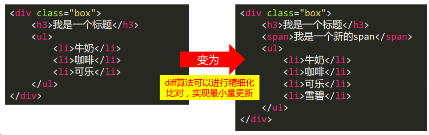

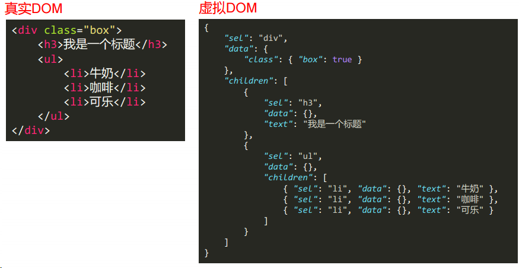

diff 是发生在虚拟 DOM 上的

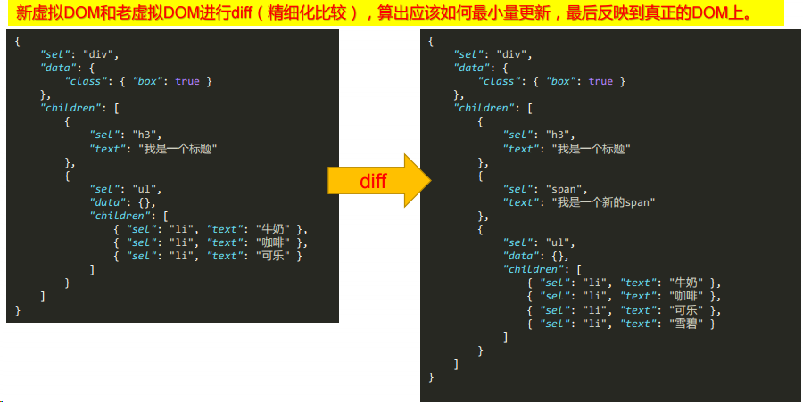

### 开始学习

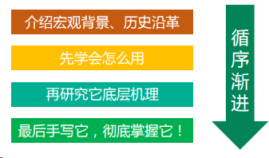

### 1.snabbdom 简介和测试环境搭建

- snabbdom 是瑞典语单词，单词原意“速度”；
- snabbdom 是著名的虚拟 DOM 库，是 diff 算法的鼻祖，Vue 源码借鉴了 snabbdom；
  官方 git：https://github.com/snabbdom/snabbdom

#### 1.安装 snabbdom

1.在 git 上的 snabbdom 源码是用 TypeScript 写的，git 上并不提供编译好的
JavaScript 版本；

2.如果要直接使用 build 出来的 JavaScript 版的 snabbdom 库，可以从 npm 上下
载：

```bash
npm i -D snabbdom
```

学习库底层时，建议大家阅读原汁原味的 TS 代码，最好带有库作者原注释，
这样对你的源码阅读能力会有很大的提升。

#### 2.snabbdom 的测试环境搭建

##### 新建一个目录 study-snabbdom

1.snabbdom 库是 DOM 库，当然不能在 nodejs 环境运行，所以我们需要搭建 webpack 和 webpack-dev-server 开发环境，好消息是不需要安装任何 loader

2.这里需要注意，**必须安装最新版 webpack@5**，不能安装 webpack@4，这是因为 webpack4 没有读取身份证中 exports 的能力，建议大家使用这样的版本：

```bash
npm i -D webpack@5 webpack-cli@3 webpack-dev-server@3
```

##### webpack.config.js

```js
// 从https://www.webpackjs.com/官网照着配置
const path = require("path");

module.exports = {
	// 入口
	entry: "./src/index.js",
	// 出口
	output: {
		// 虚拟打包路径，就是说文件夹不会真正生成，而是在8080端口虚拟生成
		publicPath: "xuni",
		// 打包出来的文件名，不会真正的物理生成
		filename: "bundle.js",
	},
	devServer: {
		// 端口号
		port: 8080,
		// 静态资源文件夹
		contentBase: "www",
	},
};
```

##### package.json

```json
{
	"name": "study-snabbdom",
	"version": "1.0.0",
	"description": "",
	"main": "index.js",
	"scripts": {
		"dev": "webpack-dev-server"
	},
	"author": "",
	"license": "ISC",
	"dependencies": {
		"snabbdom": "^3.6.0"
	},
	"devDependencies": {
		"webpack": "^5.11.0",
		"webpack-cli": "^3.3.12",
		"webpack-dev-server": "^3.11.0"
	}
}
```

##### src/index.js

官方仓库的 Example 代码：

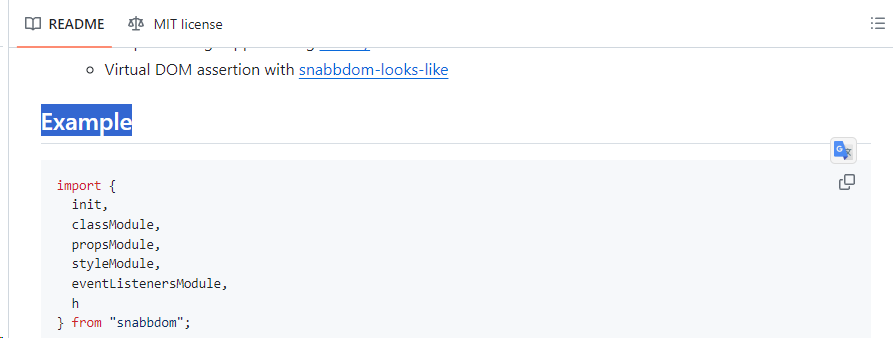

```js
import {
	init,
	classModule,
	propsModule,
	styleModule,
	eventListenersModule,
	h,
} from "snabbdom";

const patch = init([
	// Init patch function with chosen modules
	classModule, // makes it easy to toggle classes
	propsModule, // for setting properties on DOM elements
	styleModule, // handles styling on elements with support for animations
	eventListenersModule, // attaches event listeners
]);

const container = document.getElementById("container");

const vnode = h(
	"div#container.two.classes",
	{ on: { click: () => console.log("div clicked") } },
	[
		h("span", { style: { fontWeight: "bold" } }, "This is bold"),
		" and this is just normal text",
		h("a", { props: { href: "/foo" } }, "I'll take you places!"),
	]
);
// Patch into empty DOM element – this modifies the DOM as a side effect
patch(container, vnode);

const newVnode = h(
	"div#container.two.classes",
	{ on: { click: () => console.log("updated div clicked") } },
	[
		h(
			"span",
			{ style: { fontWeight: "normal", fontStyle: "italic" } },
			"This is now italic type"
		),
		" and this is still just normal text",
		h("a", { props: { href: "/bar" } }, "I'll take you places!"),
	]
);
// Second `patch` invocation
patch(vnode, newVnode); // Snabbdom efficiently updates the old view to the new state
```

##### www/index.html

```html
<!DOCTYPE html>
<html lang="en">
	<head>
		<meta charset="UTF-8" />
		<meta name="viewport" content="width=device-width, initial-scale=1.0" />
		<title>Document</title>
	</head>
	<body>
		<button id="btn">按我改变DOM</button>
		<div id="container"></div>

		<script src="/xuni/bundle.js"></script>
	</body>
</html>
```

开始启动项目，即证明调试环境已经搭建成功。

#### 3.snabbdom 官方 git 仓库 examples 目录的 demo 程序

跑通 snabbdom 官方 git 仓库的 Example 的代码也可以找 examples 目录的 demo 程序跑跑试下。

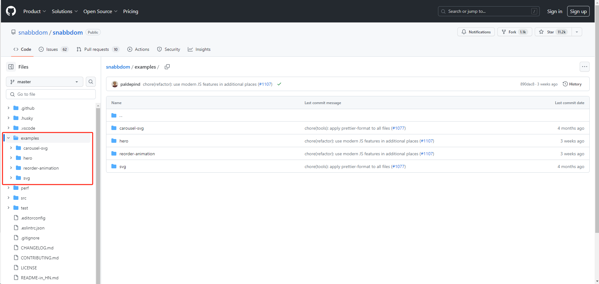

### 2.虚拟 DOM 和 h 函数

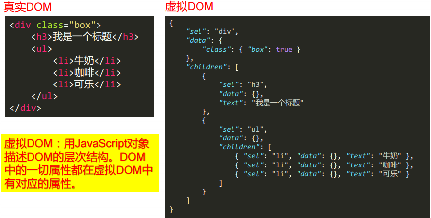

diff 是发生在虚拟 DOM 上的


### 3.体验 h 和 diff 函数

基于上面的创建的 study-snabbdom 项目

##### package.json 装上 snabbdom 库

```json
{
	"name": "study-snabbdom",
	"version": "1.0.0",
	"description": "",
	"main": "index.js",
	"scripts": {
		"dev": "webpack-dev-server"
	},
	"author": "",
	"license": "ISC",
	"dependencies": {
		"snabbdom": "^3.6.2"
	},
	"devDependencies": {
		"webpack": "^5.11.0",
		"webpack-cli": "^3.3.12",
		"webpack-dev-server": "^3.11.0"
	}
}
```

##### src/index-学习 h 函数.js

```js
import { init } from "snabbdom/init";
import { classModule } from "snabbdom/modules/class";
import { propsModule } from "snabbdom/modules/props";
import { styleModule } from "snabbdom/modules/style";
import { eventListenersModule } from "snabbdom/modules/eventlisteners";
import { h } from "snabbdom/h";

// 创建出patch函数
const patch = init([
	classModule,
	propsModule,
	styleModule,
	eventListenersModule,
]);

// 创建虚拟节点
const myVnode1 = h(
	"a",
	{
		props: {
			href: "http://www.atguigu.com",
			target: "_blank",
		},
	},
	"尚硅谷"
);

const myVnode2 = h("div", "我是一个盒子");

const myVnode3 = h("ul", [
	h("li", {}, "苹果"),
	h("li", "西瓜"),
	h("li", [h("div", [h("p", "哈哈"), h("p", "嘻嘻")])]),
	h("li", h("p", "火龙果")),
]);

console.log(myVnode3);

// 让虚拟节点上树
const container = document.getElementById("container");
patch(container, myVnode3);
```

##### src/index-体验 diff 算法.js

```js
import { init } from "snabbdom/init";
import { classModule } from "snabbdom/modules/class";
import { propsModule } from "snabbdom/modules/props";
import { styleModule } from "snabbdom/modules/style";
import { eventListenersModule } from "snabbdom/modules/eventlisteners";
import { h } from "snabbdom/h";

// 得到盒子和按钮
const container = document.getElementById("container");
const btn = document.getElementById("btn");

// 创建出patch函数
const patch = init([
	classModule,
	propsModule,
	styleModule,
	eventListenersModule,
]);

const vnode1 = h("ul", {}, [
	h("li", { key: "A" }, "A"),
	h("li", { key: "B" }, "B"),
	h("li", { key: "C" }, "C"),
	h("li", { key: "D" }, "D"),
]);

patch(container, vnode1);

const vnode2 = h("ul", {}, [
	h("li", { key: "D" }, "D"),
	h("li", { key: "A" }, "A"),
	h("li", { key: "C" }, "C"),
	h("li", { key: "B" }, "B"),
]);

// 点击按钮时，将vnode1变为vnode2
btn.onclick = function () {
	patch(vnode1, vnode2);
};
```

### 4.snabbdom 的 h 函数如何工作

#### h 函数用来产生虚拟节点（vnode）

比如这样调用 h 函数：

```js
h("a", { props: { href: "http://www.atguigu.com" } }, "尚硅谷");
```

将得到这样的虚拟节点：

```js
{ "sel": "a", "data": { props: { href: 'http://www.atguigu.com' } }, "text": "尚硅谷" }
```

它表示的真正的 DOM 节点：

```html
<a href="http://www.atguigu.com">尚硅谷</a>
```

#### 一个虚拟节点有哪些属性？

```json
{
    children: undefined
    data: {}
    elm: undefined
    key: undefined
    sel: "div"
    text: "我是一个盒子"
}
```

h 函数可以嵌套使用，从而得到虚拟 DOM 树（重要）

比如这样嵌套使用 h 函数：

```js
h("ul", {}, [h("li", {}, "牛奶"), h("li", {}, "咖啡"), h("li", {}, "可乐")]);
```

将得到这样的虚拟 DOM 树：

```json
{
	"sel": "ul",
	"data": {},
	"children": [
		{ "sel": "li", "text": "牛奶" },
		{ "sel": "li", "text": "咖啡" },
		{ "sel": "li", "text": "可乐" }
	]
}
```

#### h 函数用法很活

演示一下 h 函数的多种用法

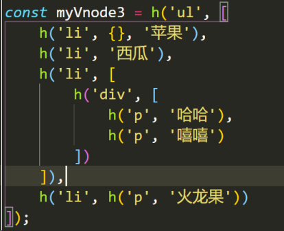

### 5.diff 算法原理

- 最小量更新太厉害啦！真的是最小量更新！当然，key 很重要。key 是这个节点的唯一标识，告诉 diff 算法，在更改前后它们是同一个 DOM 节点。
- **只有是同一个虚拟节点，才进行精细化比较**，否则就是暴力删除旧的、插入新的。延伸问题：如何定义是同一个虚拟节点？答：选择器相同且 key 相同。
- **只进行同层比较，不会进行跨层比较**。即使是同一片虚拟节点，但是跨层了，对不起，精细化比较不 diff 你，而是暴力删除旧的、然后插入新的。

diff 并不是那么的“无微不至”啊！真的影响效率么？？

答：上面 2、3 操作在实际 Vue 开发中，基本不会遇见，所以这是合理的优化
机制。

#### 同层对比示意图

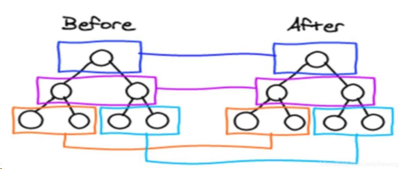

#### diff 处理新旧节点不是同一个节点时

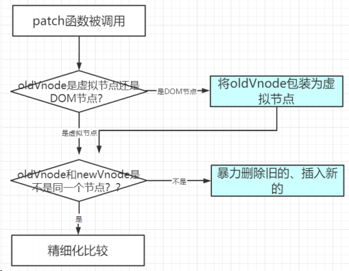

#### 如何定义“同一个节点”

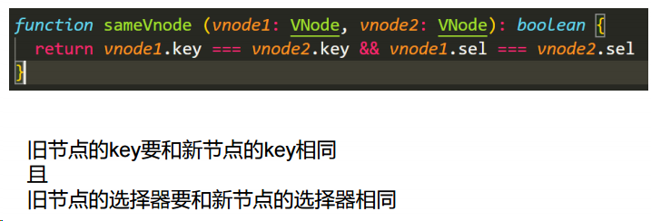

#### 创建节点时，所有子节点需要递归创建的

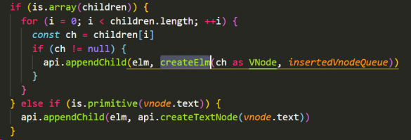

#### diff 算法处理新旧节点为同一节点时

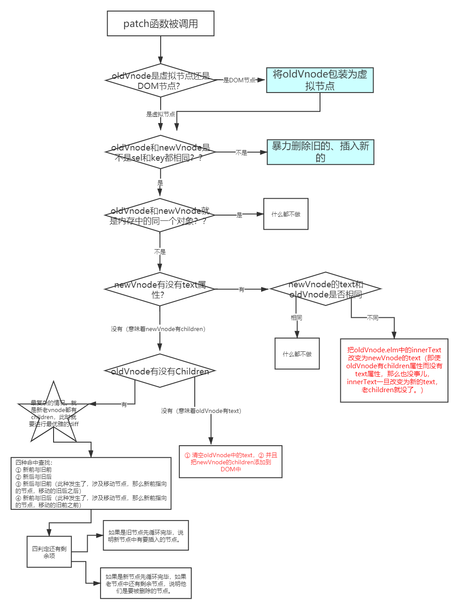

#### 经典的 diff 算法优化策略

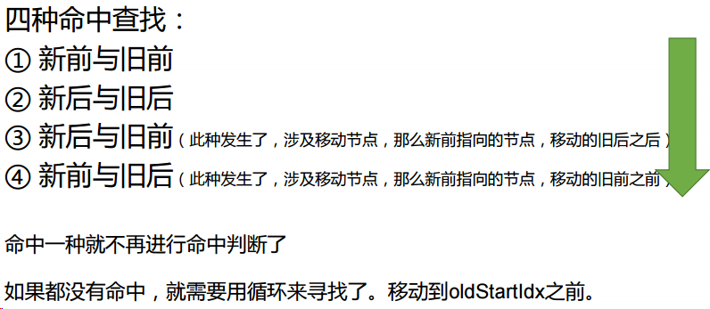

#### 算法：旧前、旧后 | 新前、新后概念

旧前：旧节点合集的的第一个节点

旧后：旧节点合集的的最后一个节点

新前：新节点合集的的第一个节点

新后：新节点合集的的最后一个节点

这些判断对比后虚拟 DOM 命中后会移动位置，这些命名也会移动位置，换一个 DOM 成为旧前、旧后 | 新前、新后。

#### 更新子节点：对应 updateChildren.js 里的方法

##### 新增的情况

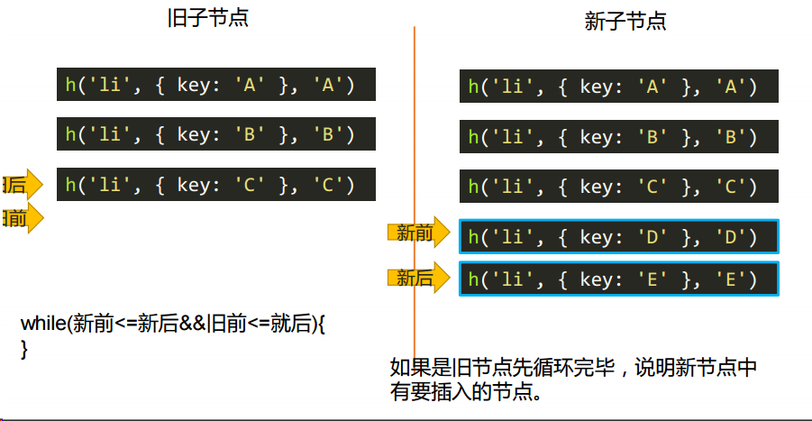

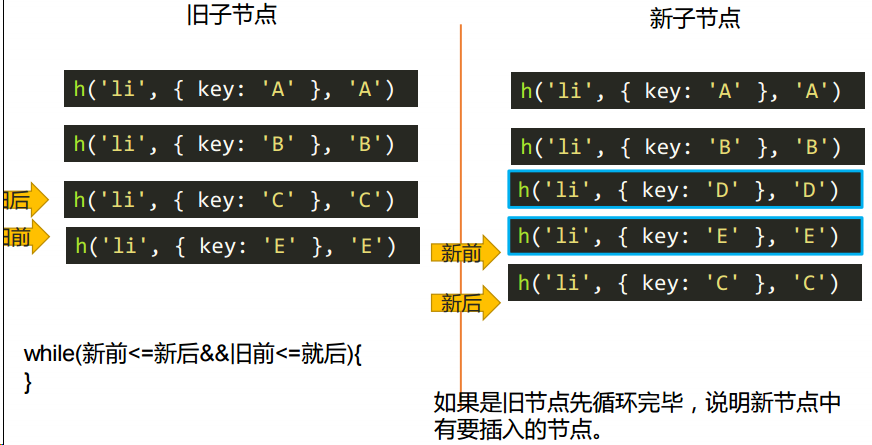

##### 删除的情况

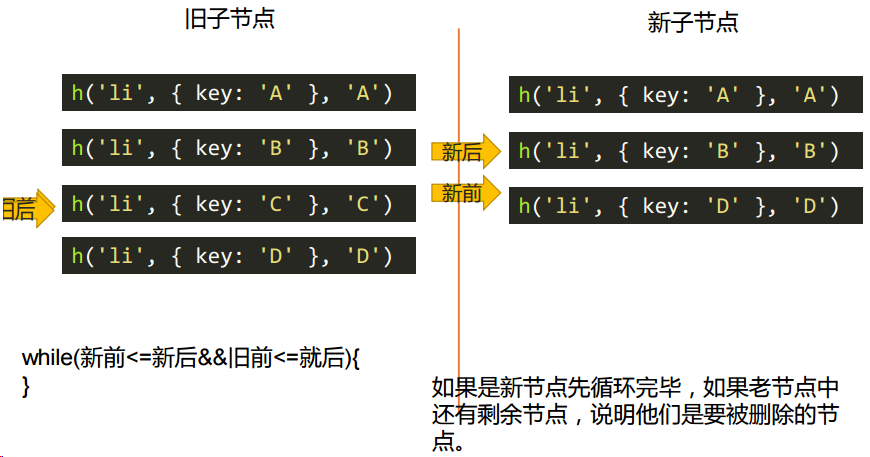

##### 多删除的情况

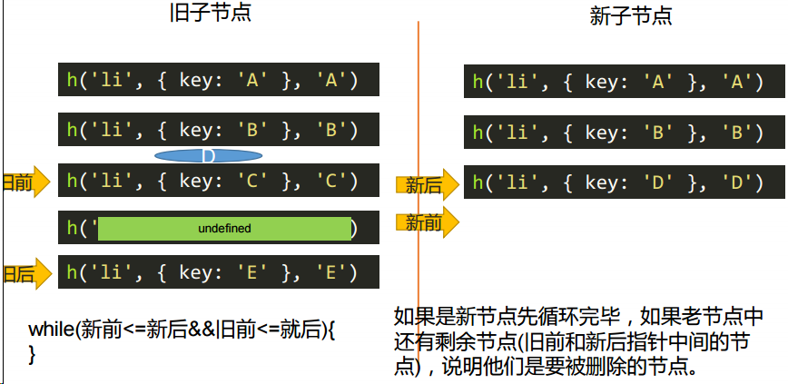

##### 复杂的情况

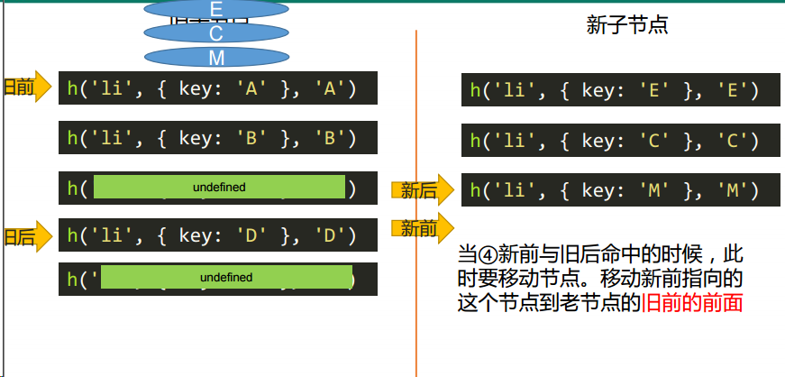

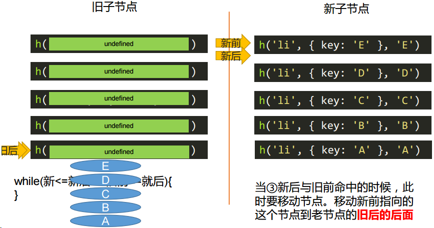

### 6.手写实现虚拟 DOM 和 diff 算法:a:

基于上面的创建的 study-snabbdom 项目，手写实现 snabbdom

#### 6.1 调试代码

##### src/index.js

```js
import h from "./mysnabbdom/h.js";
import patch from "./mysnabbdom/patch.js";

const myVnode1 = h("ul", {}, [
	h("li", { key: "A" }, "A"),
	h("li", { key: "B" }, "B"),
	h("li", { key: "C" }, "C"),
	h("li", { key: "D" }, "D"),
	h("li", { key: "E" }, "E"),
]);

// 得到盒子和按钮
const container = document.getElementById("container");
const btn = document.getElementById("btn");

// 第一次上树
patch(container, myVnode1);

// 新节点
const myVnode2 = h("ul", {}, [
	h("li", { key: "Q" }, "Q"),
	h("li", { key: "T" }, "T"),
	h("li", { key: "A" }, "A"),
	h("li", { key: "B" }, "B"),
	h("li", { key: "Z" }, "Z"),
	h("li", { key: "C" }, "C"),
	h("li", { key: "D" }, "D"),
	h("li", { key: "E" }, "E"),
]);

btn.onclick = function () {
	patch(myVnode1, myVnode2);
};
```

#### 6.2 :b:src/mysnabbdom 目录：自己实现的 snabbdom

snabbdom 的源码是 ts 写的：https://github.com/snabbdom/snabbdom，我们需要仿写js代码，只要主干功能

##### src/mysnabbdom/vnode.js

```js
// 函数的功能非常简单，就是把传入的5个参数组合成对象返回
export default function (sel, data, children, text, elm) {
	const key = data.key;
	return {
		sel,
		data,
		children,
		text,
		elm,
		key,
	};
}
```

##### src/mysnabbdom/h.js：创建虚拟节点

```js
import vnode from "./vnode.js";

// 编写一个低配版本的h函数，这个函数必须接受3个参数，缺一不可
// 相当于它的重载功能较弱。
// 也就是说，调用的时候形态必须是下面的三种之一：
// ——形态①：h('div', {}, '文字')
// ——形态②：h('div', {}, [])
// ——形态③：h('div', {}, h())
export default function (sel, data, c) {
	// 检查参数的个数
	if (arguments.length != 3)
		throw new Error("对不起，h函数必须传入3个参数，我们是低配版h函数");
	// 检查参数c的类型
	if (typeof c == "string" || typeof c == "number") {
		// 说明现在调用h函数是形态①
		return vnode(sel, data, undefined, c, undefined);
	} else if (Array.isArray(c)) {
		// 说明现在调用h函数是形态②
		let children = [];
		// 遍历c，收集children
		for (let i = 0; i < c.length; i++) {
			// 检查c[i]必须是一个对象，如果不满足
			if (!(typeof c[i] == "object" && c[i].hasOwnProperty("sel")))
				throw new Error("传入的数组参数中有项不是h函数");
			// 这里不用执行c[i]，因为你的测试语句中已经有了执行
			// 此时只需要收集好就可以了
			children.push(c[i]);
		}
		// 循环结束了，就说明children收集完毕了，此时可以返回虚拟节点了，它有children属性的
		return vnode(sel, data, children, undefined, undefined);
	} else if (typeof c == "object" && c.hasOwnProperty("sel")) {
		// 说明现在调用h函数是形态③
		// 即，传入的c是唯一的children。不用执行c，因为测试语句中已经执行了c。
		let children = [c];
		return vnode(sel, data, children, undefined, undefined);
	} else {
		throw new Error("传入的第三个参数类型不对");
	}
}
```

##### src/mysnabbdom/patch.js：让虚拟节点上 dom 树

```js
import vnode from "./vnode.js";
import createElement from "./createElement.js";
import patchVnode from "./patchVnode.js";

export default function patch(oldVnode, newVnode) {
	// 判断传入的第一个参数，是DOM节点还是虚拟节点？
	if (oldVnode.sel == "" || oldVnode.sel == undefined) {
		// 传入的第一个参数是DOM节点，此时要包装为虚拟节点
		oldVnode = vnode(
			oldVnode.tagName.toLowerCase(),
			{},
			[],
			undefined,
			oldVnode
		);
	}

	// 判断oldVnode和newVnode是不是同一个节点
	if (oldVnode.key == newVnode.key && oldVnode.sel == newVnode.sel) {
		console.log("是同一个节点");
		patchVnode(oldVnode, newVnode);
	} else {
		console.log("不是同一个节点，暴力插入新的，删除旧的");
		// 根据虚拟DOM节点创建真实的DOM节点
		let newVnodeElm = createElement(newVnode);

		// 插入到老节点之前
		if (oldVnode.elm.parentNode && newVnodeElm) {
			oldVnode.elm.parentNode.insertBefore(newVnodeElm, oldVnode.elm);
		}
		// 删除老节点
		oldVnode.elm.parentNode.removeChild(oldVnode.elm);
	}
}
```

##### src/mysnabbdom/createElement.js：将 vnode 虚拟节点创建为真实 DOM 节点

```js
// 真正创建节点：将vnode创建为DOM，是孤儿节点，不进行插入
export default function createElement(vnode) {
	// console.log('目的是把虚拟节点', vnode, '真正变为DOM');
	// 创建一个DOM节点，这个节点现在还是孤儿节点
	let domNode = document.createElement(vnode.sel);
	// 有子节点还是有文本？？
	if (
		vnode.text != "" &&
		(vnode.children == undefined || vnode.children.length == 0)
	) {
		// 它内部是文字
		domNode.innerText = vnode.text;
	} else if (Array.isArray(vnode.children) && vnode.children.length > 0) {
		// 它内部是子节点，就要递归创建节点
		for (let i = 0; i < vnode.children.length; i++) {
			// 得到当前这个children
			let ch = vnode.children[i];
			// 创建出它的DOM，一旦调用createElement意味着：创建出DOM了，并且它的elm属性指向了创建出的DOM，但是还没有上树，是一个孤儿节点。
			let chDOM = createElement(ch);
			// 上树
			domNode.appendChild(chDOM);
		}
	}
	// 补充elm属性
	vnode.elm = domNode;

	// 返回elm，elm属性是一个纯DOM对象
	return vnode.elm;
}
```

##### src/mysnabbdom/patchVnode.js：同一虚拟 DOM 的新老节点对比

```js
import createElement from "./createElement";
import updateChildren from "./updateChildren.js";

// 对比同一个虚拟节点
export default function patchVnode(oldVnode, newVnode) {
	// 判断新旧vnode是否是同一个对象
	if (oldVnode === newVnode) return;
	// 判断新vnode有没有text属性
	if (
		newVnode.text != undefined &&
		(newVnode.children == undefined || newVnode.children.length == 0)
	) {
		// 新vnode有text属性
		console.log("新vnode有text属性");
		if (newVnode.text != oldVnode.text) {
			// 如果新虚拟节点中的text和老的虚拟节点的text不同，那么直接让新的text写入老的elm中即可。如果老的elm中是children，那么也会立即消失掉。
			oldVnode.elm.innerText = newVnode.text;
		}
	} else {
		// 新vnode没有text属性，有children
		console.log("新vnode没有text属性");
		// 判断老的有没有children
		if (oldVnode.children != undefined && oldVnode.children.length > 0) {
			// 老的有children，新的也有children，此时就是最复杂的情况。
			updateChildren(oldVnode.elm, oldVnode.children, newVnode.children);
		} else {
			// 老的没有children，新的有children
			// 清空老的节点的内容
			oldVnode.elm.innerHTML = "";
			// 遍历新的vnode的子节点，创建DOM，上树
			for (let i = 0; i < newVnode.children.length; i++) {
				let dom = createElement(newVnode.children[i]);
				oldVnode.elm.appendChild(dom);
			}
		}
	}
}
```

##### src/mysnabbdom/updateChildren.js：diff 对比后更新子 DOM 节点

```js
import patchVnode from "./patchVnode.js";
import createElement from "./createElement.js";

// 判断是否是同一个虚拟节点
function checkSameVnode(a, b) {
	return a.sel == b.sel && a.key == b.key;
}

export default function updateChildren(parentElm, oldCh, newCh) {
	console.log("我是updateChildren");
	console.log(oldCh, newCh);

	// 旧前
	let oldStartIdx = 0;
	// 新前
	let newStartIdx = 0;
	// 旧后
	let oldEndIdx = oldCh.length - 1;
	// 新后
	let newEndIdx = newCh.length - 1;
	// 旧前节点
	let oldStartVnode = oldCh[0];
	// 旧后节点
	let oldEndVnode = oldCh[oldEndIdx];
	// 新前节点
	let newStartVnode = newCh[0];
	// 新后节点
	let newEndVnode = newCh[newEndIdx];

	let keyMap = null;

	// 开始大while了
	while (oldStartIdx <= oldEndIdx && newStartIdx <= newEndIdx) {
		console.log("★");
		// 首先不是判断①②③④命中，而是要略过已经加undefined标记的东西
		if (oldStartVnode == null || oldCh[oldStartIdx] == undefined) {
			oldStartVnode = oldCh[++oldStartIdx];
		} else if (oldEndVnode == null || oldCh[oldEndIdx] == undefined) {
			oldEndVnode = oldCh[--oldEndIdx];
		} else if (newStartVnode == null || newCh[newStartIdx] == undefined) {
			newStartVnode = newCh[++newStartIdx];
		} else if (newEndVnode == null || newCh[newEndIdx] == undefined) {
			newEndVnode = newCh[--newEndIdx];
		} else if (checkSameVnode(oldStartVnode, newStartVnode)) {
			// 新前和旧前
			console.log("①新前和旧前命中");
			patchVnode(oldStartVnode, newStartVnode);
			oldStartVnode = oldCh[++oldStartIdx];
			newStartVnode = newCh[++newStartIdx];
		} else if (checkSameVnode(oldEndVnode, newEndVnode)) {
			// 新后和旧后
			console.log("②新后和旧后命中");
			patchVnode(oldEndVnode, newEndVnode);
			oldEndVnode = oldCh[--oldEndIdx];
			newEndVnode = newCh[--newEndIdx];
		} else if (checkSameVnode(oldStartVnode, newEndVnode)) {
			// 新后和旧前
			console.log("③新后和旧前命中");
			patchVnode(oldStartVnode, newEndVnode);
			// 当③新后与旧前命中的时候，此时要移动节点。移动新前指向的这个节点到老节点的旧后的后面
			// 如何移动节点？？只要你插入一个已经在DOM树上的节点，它就会被移动
			parentElm.insertBefore(oldStartVnode.elm, oldEndVnode.elm.nextSibling);
			oldStartVnode = oldCh[++oldStartIdx];
			newEndVnode = newCh[--newEndIdx];
		} else if (checkSameVnode(oldEndVnode, newStartVnode)) {
			// 新前和旧后
			console.log("④新前和旧后命中");
			patchVnode(oldEndVnode, newStartVnode);
			// 当④新前和旧后命中的时候，此时要移动节点。移动新前指向的这个节点到老节点的旧前的前面
			parentElm.insertBefore(oldEndVnode.elm, oldStartVnode.elm);
			// 如何移动节点？？只要你插入一个已经在DOM树上的节点，它就会被移动
			oldEndVnode = oldCh[--oldEndIdx];
			newStartVnode = newCh[++newStartIdx];
		} else {
			// 四种命中都没有命中
			// 制作keyMap一个映射对象，这样就不用每次都遍历老对象了。
			if (!keyMap) {
				keyMap = {};
				// 从oldStartIdx开始，到oldEndIdx结束，创建keyMap映射对象
				for (let i = oldStartIdx; i <= oldEndIdx; i++) {
					const key = oldCh[i].key;
					if (key != undefined) {
						keyMap[key] = i;
					}
				}
			}
			console.log(keyMap);
			// 寻找当前这项（newStartIdx）这项在keyMap中的映射的位置序号
			const idxInOld = keyMap[newStartVnode.key];
			console.log(idxInOld);
			if (idxInOld == undefined) {
				// 判断，如果idxInOld是undefined表示它是全新的项
				// 被加入的项（就是newStartVnode这项)现不是真正的DOM节点
				parentElm.insertBefore(createElement(newStartVnode), oldStartVnode.elm);
			} else {
				// 如果不是undefined，不是全新的项，而是要移动
				const elmToMove = oldCh[idxInOld];
				patchVnode(elmToMove, newStartVnode);
				// 把这项设置为undefined，表示我已经处理完这项了
				oldCh[idxInOld] = undefined;
				// 移动，调用insertBefore也可以实现移动。
				parentElm.insertBefore(elmToMove.elm, oldStartVnode.elm);
			}
			// 指针下移，只移动新的头
			newStartVnode = newCh[++newStartIdx];
		}
	}

	// 继续看看有没有剩余的。循环结束了start还是比old小
	if (newStartIdx <= newEndIdx) {
		console.log(
			"new还有剩余节点没有处理，要加项。要把所有剩余的节点，都要插入到oldStartIdx之前"
		);
		// 遍历新的newCh，添加到老的没有处理的之前
		for (let i = newStartIdx; i <= newEndIdx; i++) {
			// insertBefore方法可以自动识别null，如果是null就会自动排到队尾去。和appendChild是一致了。
			// newCh[i]现在还没有真正的DOM，所以要调用createElement()函数变为DOM
			parentElm.insertBefore(createElement(newCh[i]), oldCh[oldStartIdx].elm);
		}
	} else if (oldStartIdx <= oldEndIdx) {
		console.log("old还有剩余节点没有处理，要删除项");
		// 批量删除oldStart和oldEnd指针之间的项
		for (let i = oldStartIdx; i <= oldEndIdx; i++) {
			if (oldCh[i]) {
				parentElm.removeChild(oldCh[i].elm);
			}
		}
	}
}
```

## 三、数据响应式原理(数据变化侦测)

彻底弄懂 Vue2 的数据更新原理，手写相关实现代码，官方原理图：

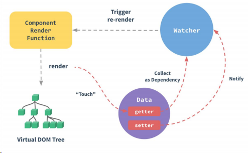

### 1.从 MVVM 模式开始

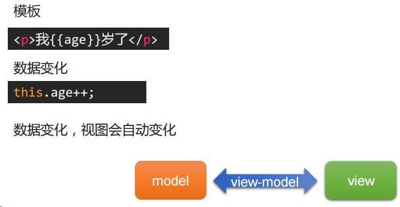

### 2.侵入式和非侵入式

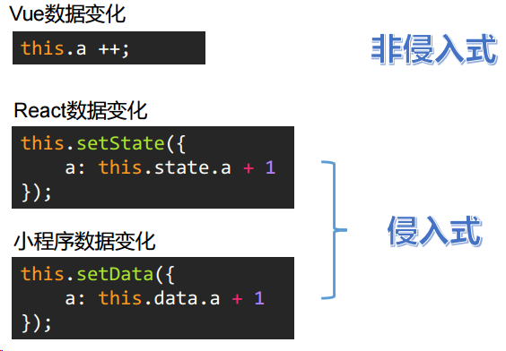

### 3.数据的劫持和代理方法：Object.defineProperty()

利用 JavaScript 引擎赋予的功能方法：Object.defineProperty()，检测对象属性变化：[Object.defineProperty() - JavaScript | MDN (mozilla.org)](https://developer.mozilla.org/zh-CN/docs/Web/JavaScript/Reference/Global_Objects/Object/defineProperty)

Object.defineProperty()方法会直接在一个对象上定义一个新属性，或者修改
一个对象的现有属性，并返回此对象。

```js
var obj = {};
Object.defineProperty(obj, "a", {
	value: 3,
});
Object.defineProperty(obj, "b", {
	value: 5,
});
console.log(obj);
console.log(obj.a, obj.b);
```

Object.defineProperty()方法可以设置一些额外隐藏的属性。

```js
Object.defineProperty(obj, "a", {
	value: 3,
	// 是否可写
	writable: false,
});

Object.defineProperty(obj, "b", {
	value: 5,
	// 是否可以被枚举
	enumerable: false,
});
```

#### getter/setter

看 MDN 文档：[Object.defineProperty() - JavaScript | MDN (mozilla.org)](https://developer.mozilla.org/zh-CN/docs/Web/JavaScript/Reference/Global_Objects/Object/defineProperty)

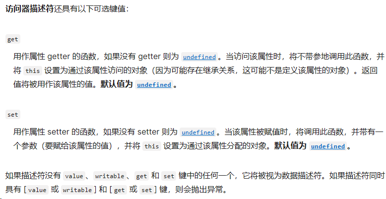

```js
Object.defineProperty(obj, "a", {
	// getter
	get() {
		console.log("你试图访问obj的a属性");
	},
	// setter
	set() {
		console.log("你试图改变obj的a属性");
	},
});
console.log(obj.a);
obj.a = 10;
```

这里有一个小坑：需要用闭包存储 get 和 set 的值

#### defineReactive 闭包函数

##### getter/setter 需要变量周转才能工作

```js
var obj = {};
// 定义外部的变量作为周转
var temp;
Object.defineProperty(obj, "a", {
	// getter
	get() {
		console.log("你试图访问obj的a属性");
		return temp;
	},
	// setter
	set(newValue) {
		console.log("你试图改变obj的a属性", newValue);
		temp = newValue;
	},
});

console.log(obj.a);
obj.a = 9;
obj.a++;
console.log(obj.a); // 10
```

##### 使用 defineReactive 函数不需要设置临时变量了，而是用闭包

```js
function defineReactive(data, key, val) {
	Object.defineProperty(data, key, {
		// 可枚举
		enumerable: true,
		// 可以被配置，比如可以被delete
		configurable: true,
		// getter
		get() {
			console.log("你试图访问obj的" + key + "属性");
			// val 参数当做上面外部的临时变量
			return val;
		},
		// setter
		set(newValue) {
			console.log("你试图改变obj的" + key + "属性", newValue);
			// val 参数当做上面外部的临时变量
			if (val === newValue) {
				return;
			}
			val = newValue;
		},
	});
}

var obj = {};
defineReactive(obj, "a", 10);

console.log(obj.a);
obj.a = 29;
obj.a++;
console.log(obj.a); // 30
```

### 4.递归侦测对象全部属性

Observer：观察类

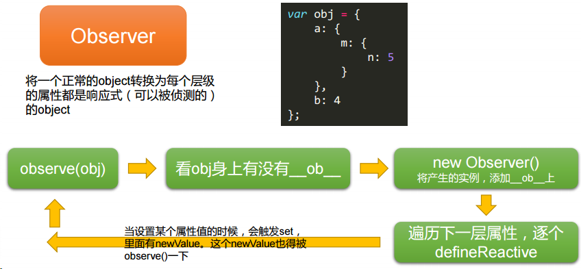

### 5.数组的响应式处理

#### Vue 底层改写了数组原生的七个方法

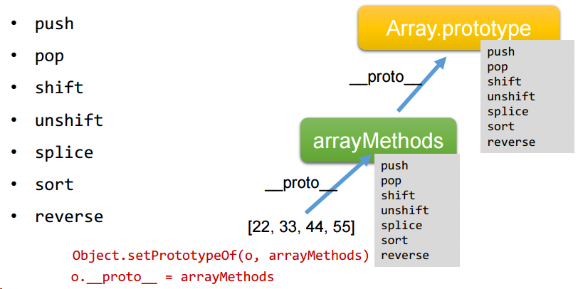

### 6.依赖收集

#### 什么是依赖？

- 需要用到数据的地方，称为依赖
- Vue1.x，细粒度依赖，用到数据的 DOM 都是依赖；
- Vue2.x，中等粒度依赖，用到数据的组件是依赖；
- 在 getter 中收集依赖，在 setter 中触发依赖

#### Dep 类和 Watcher 类

1.把依赖收集的代码封装成一个 Dep 类，它专门用来管理依赖，**每个 Observer 的实例，成员中都有一个 Dep 的实例；**

2.Watcher 是一个中介，数据发生变化时通过 Watcher 中转，通知组件。

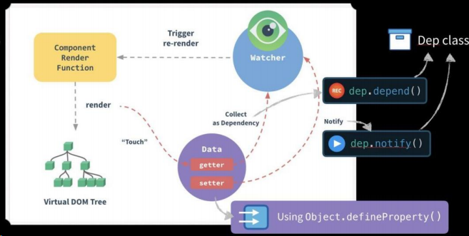

- 依赖就是 Watcher。只有 Watcher 触发的 getter 才会收集依赖，哪个 Watcher 触发了 getter，就把哪个 Watcher 收集到 Dep 中。
- Dep 使用发布订阅模式，当数据发生变化时，会循环依赖列表，把所有的 Watcher 都通知一遍。

代码实现的巧妙之处：Watcher 把自己设置到全局的一个指定位置，然后读取数据，因为读取了数据，所以会触发这个数据的 getter。在 getter 中就能得到当前正在读取数据的 Watcher，并把这个 Watcher 收集到 Dep 中。

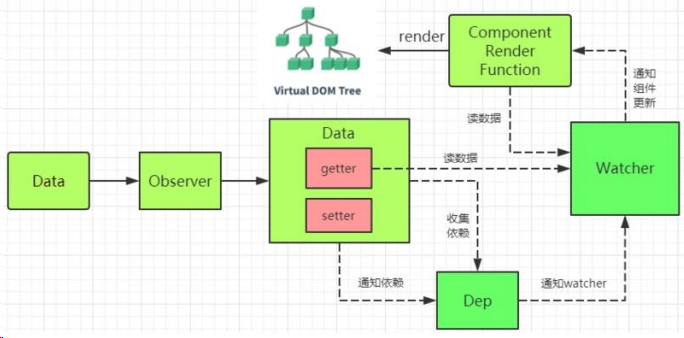

### 7.:a:根据 Vue2 响应式原理手写实现响应式代码

项目依然是使用 webpack 打包的。

#### 1.新建项目目录：study-data-reactive

```bash
src：手写实现的源码目录
 |——array.js
 |——defineReactive.js
 |——Dep.js
 |——index.js
 |——observe.js
 |——Observer.js
 |——utils.js
 |__Watcher.js
www：导入手写打包而成的bundle.js
 |—index.html
package.json
webpack.config.js
```

#### 2.:b:手写的响应式代码

www/index.html

```html
<!DOCTYPE html>
<html lang="en">
	<head>
		<meta charset="UTF-8" />
		<meta name="viewport" content="width=device-width, initial-scale=1.0" />
		<title>Document</title>
	</head>
	<body>
		<script src="/xuni/bundle.js"></script>
	</body>
</html>
```

package.json

```json
{
	"name": "study-snabbdom",
	"version": "1.0.0",
	"description": "",
	"main": "index.js",
	"scripts": {
		"dev": "webpack-dev-server"
	},
	"author": "",
	"license": "ISC",
	"dependencies": {},
	"devDependencies": {
		"webpack": "^5.11.0",
		"webpack-cli": "^3.3.12",
		"webpack-dev-server": "^3.11.0"
	}
}
```

webpack.config.js

```js
// 从https://www.webpackjs.com/官网照着配置
const path = require("path");

module.exports = {
	// 入口
	entry: "./src/index.js",
	// 出口
	output: {
		// 虚拟打包路径，就是说文件夹不会真正生成，而是在8080端口虚拟生成
		publicPath: "xuni",
		// 打包出来的文件名，不会真正的物理生成
		filename: "bundle.js",
	},
	devServer: {
		// 端口号
		port: 8080,
		// 静态资源文件夹
		contentBase: "www",
	},
};
```

src/index.js：调用手写实现的响应式相关的方法

```js
import observe from "./observe.js";
import Watcher from "./Watcher.js";

var obj = {
	a: {
		m: {
			n: 5,
		},
	},
	b: 10,
	c: {
		d: {
			e: {
				f: 6666,
			},
		},
	},
	g: [22, 33, 44, 55],
};

observe(obj);
new Watcher(obj, "a.m.n", (val) => {
	console.log("★我是watcher，我在监控a.m.n", val);
});
obj.a.m.n = 88;
// obj.g.push(66);
console.log(obj);
```

##### src/defineReactive.js：通过闭包函数使用 Object.defineProperty()

```js
import observe from "./observe.js";
import Dep from "./Dep.js";

export default function defineReactive(data, key, val) {
	const dep = new Dep();
	// console.log('我是defineReactive', key);
	if (arguments.length == 2) {
		val = data[key];
	}

	// 子元素要进行observe，至此形成了递归。这个递归不是函数自己调用自己，而是多个函数、类循环调用
	let childOb = observe(val);

	Object.defineProperty(data, key, {
		// 可枚举
		enumerable: true,
		// 可以被配置，比如可以被delete
		configurable: true,
		// getter
		get() {
			console.log("你试图访问" + key + "属性");
			// 如果现在处于依赖收集阶段
			if (Dep.target) {
				dep.depend();
				if (childOb) {
					childOb.dep.depend();
				}
			}
			return val;
		},
		// setter
		set(newValue) {
			console.log("你试图改变" + key + "属性", newValue);
			if (val === newValue) {
				return;
			}
			val = newValue;
			// 当设置了新值，这个新值也要被observe
			childOb = observe(newValue);
			// 发布订阅模式，通知dep
			dep.notify();
		},
	});
}
```

##### src/observe.js：让 Observer 工具类只为对象服务

```js
import Observer from "./Observer.js";
export default function (value) {
	// 如果value不是对象，什么都不做
	if (typeof value != "object") return;
	// 定义ob
	var ob;
	if (typeof value.__ob__ !== "undefined") {
		ob = value.__ob__;
	} else {
		ob = new Observer(value);
	}
	return ob;
}
```

##### src/Observer.js：将一个正常的 object 转换为每个层级的属性都是响应式(可以被侦测的)的 object

```js
import { def } from "./utils.js";
import defineReactive from "./defineReactive.js";
import { arrayMethods } from "./array.js";
import observe from "./observe.js";
import Dep from "./Dep.js";

export default class Observer {
	constructor(value) {
		// 每一个Observer的实例身上，都有一个dep
		this.dep = new Dep();
		// 给实例（this，一定要注意，构造函数中的this不是表示类本身，而是表示实例）添加了__ob__属性，值是这次new的实例
		def(value, "__ob__", this, false);
		// console.log('我是Observer构造器', value);
		// 不要忘记初心，Observer类的目的是：将一个正常的object转换为每个层级的属性都是响应式（可以被侦测的）的object
		// 检查它是数组还是对象
		if (Array.isArray(value)) {
			// 如果是数组，要非常强行的蛮干：将这个数组的原型，指向arrayMethods
			//（arrayMethods在array.js里，是vue2底层改写过的7个数组的方法）
			Object.setPrototypeOf(value, arrayMethods);
			// 让这个数组变的observe
			this.observeArray(value);
		} else {
			this.walk(value);
		}
	}
	// 遍历value,把value的每一个值都转为响应式的
	walk(value) {
		for (let k in value) {
			defineReactive(value, k);
		}
	}
	// 数组的特殊遍历
	observeArray(arr) {
		for (let i = 0, l = arr.length; i < l; i++) {
			// 逐项进行observe
			observe(arr[i]);
		}
	}
}
```

上面三个文件的关系：observe.js 引用 => Observer.js 引用 => defineReactive.js 引用 => observe.js

形成了一个圈相互依赖和引用的关系。

##### src/utils.js：定义 Object.defineProperty()的属性

```js
export const def = function (obj, key, value, enumerable) {
	Object.defineProperty(obj, key, {
		value,
		enumerable,
		writable: true,
		configurable: true,
	});
};
```

##### src/array.js：数组的响应式处理

```js
import { def } from "./utils.js";

// 得到Array.prototype
const arrayPrototype = Array.prototype;

// 以Array.prototype为原型创建arrayMethods对象，并暴露
export const arrayMethods = Object.create(arrayPrototype);

// vue底层改写了数组的7个方法（关键）：要被改写的7个数组方法
const methodsNeedChange = [
	"push",
	"pop",
	"shift",
	"unshift",
	"splice",
	"sort",
	"reverse",
];

methodsNeedChange.forEach((methodName) => {
	// 备份原来的方法，因为push、pop等7个数组函数的功能不能被剥夺
	const original = arrayPrototype[methodName];
	// 定义新的方法
	def(
		arrayMethods,
		methodName,
		function () {
			// 恢复原来7个数组函数的功能
			const result = original.apply(this, arguments);
			// 把类数组对象变为数组，下面才能用splice方法
			const args = [...arguments];
			// 把这个数组身上的__ob__取出来，__ob__已经被添加了，为什么已经被添加了？因为数组肯定不是最高层，比如obj.g属性是数组，obj不能是数组，第一次遍历obj这个对象的第一层的时候，已经给g属性（就是这个数组）添加了__ob__属性。
			const ob = this.__ob__;

			// 有三种方法push\unshift\splice能够插入新项，现在要把插入的新项也要变为observe的
			let inserted = [];

			switch (methodName) {
				case "push":
				case "unshift":
					inserted = args;
					break;
				case "splice":
					// splice格式是splice(下标, 数量, 插入的新项)
					inserted = args.slice(2);
					break;
			}

			// 判断有没有要插入的新项，让新项也变为响应的
			if (inserted) {
				ob.observeArray(inserted);
			}

			console.log("啦啦啦");

			ob.dep.notify();

			return result;
		},
		false
	);
});
```

##### src/Dep.js：收集依赖，然后通知 Watcher——Dep 使用发布订阅模式，当数据发生变化时，会循环依赖列表，把所有的 Watcher 都通知一遍。

```js
var uid = 0;
export default class Dep {
	constructor() {
		console.log("我是DEP类的构造器");
		this.id = uid++;

		// 用数组存储自己的订阅者。subs是英语subscribes订阅者的意思。
		// 这个数组里面放的是Watcher的实例
		this.subs = [];
	}
	// 添加订阅
	addSub(sub) {
		this.subs.push(sub);
	}
	// 添加依赖
	depend() {
		// Dep.target就是一个我们自己指定的全局的位置，你用window.target也行，只要是全剧唯一，没有歧义就行
		if (Dep.target) {
			this.addSub(Dep.target);
		}
	}
	// 通知更新
	notify() {
		console.log("我是notify");
		// 浅克隆一份
		const subs = this.subs.slice();
		// 遍历
		for (let i = 0, l = subs.length; i < l; i++) {
			subs[i].update();
		}
	}
}
```

##### src/Watcher.js（重点理解，后面生命周期的实现也依靠这个工具类）：侦听依赖：依赖就是 Watcher——只有 Watcher 触发的 getter 才会收集依赖，哪个 Watcher 触发了 getter，就把哪个 Watcher 收集到 Dep 中。

```js
import Dep from "./Dep";

var uid = 0;
export default class Watcher {
	constructor(target, expression, callback) {
		console.log("我是Watcher类的构造器");
		this.id = uid++;
		this.target = target;
		this.getter = parsePath(expression);
		this.callback = callback;
		this.value = this.get();
	}
	update() {
		this.run();
	}
	get() {
		// 进入依赖收集阶段。让全局的Dep.target设置为Watcher本身，那么就是进入依赖收集阶段
		Dep.target = this;
		const obj = this.target;
		var value;

		// 只要能找，就一直找
		try {
			value = this.getter(obj);
		} finally {
			Dep.target = null;
		}

		return value;
	}
	run() {
		this.getAndInvoke(this.callback);
	}
	getAndInvoke(cb) {
		const value = this.get();

		if (value !== this.value || typeof value == "object") {
			const oldValue = this.value;
			this.value = value;
			cb.call(this.target, value, oldValue);
		}
	}
}

function parsePath(str) {
	var segments = str.split(".");

	return (obj) => {
		for (let i = 0; i < segments.length; i++) {
			if (!obj) return;
			obj = obj[segments[i]];
		}
		return obj;
	};
}
```

## 四、AST 抽象语法树

### 1.了解抽象语法树

#### 1.1 抽象语法树是什么

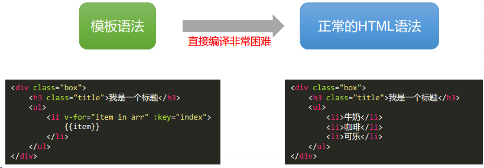

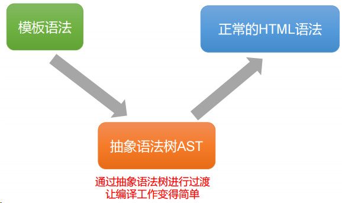

#### 1.2 抽象语法树本质上就是一个 JS 对象

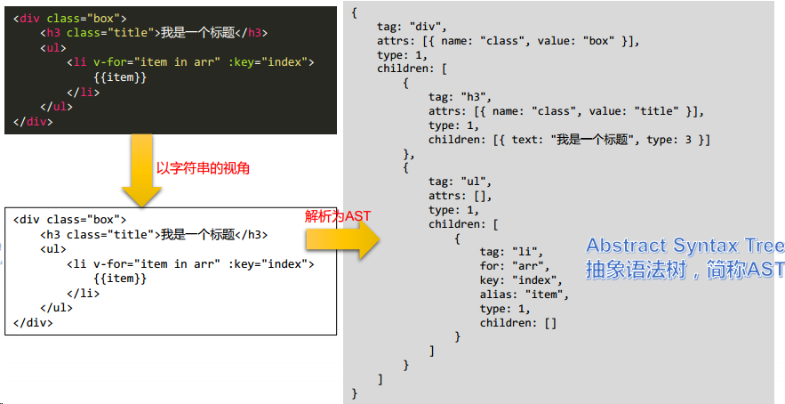

#### 1.3 抽象语法树和虚拟节点的关系

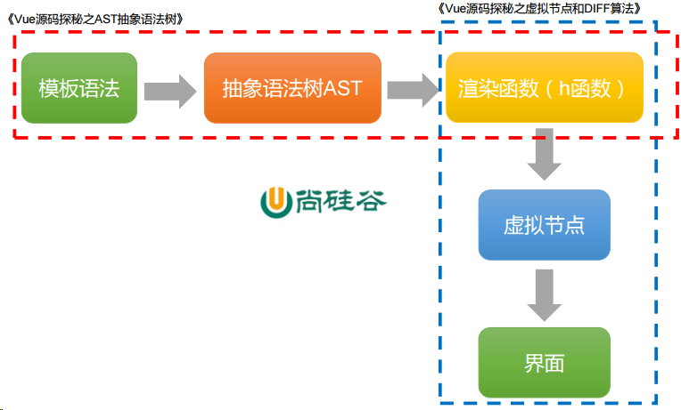

### 2.相关算法储备

#### 指针思想——题目 1

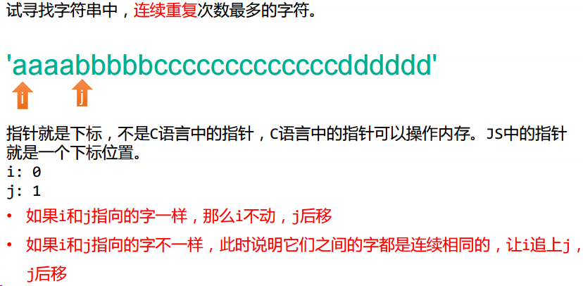

指针思想实现：

```html
<!DOCTYPE html>
<html lang="en">
	<head>
		<meta charset="UTF-8" />
		<meta name="viewport" content="width=device-width, initial-scale=1.0" />
		<title>Document</title>
	</head>

	<body>
		<script>
			// 试寻找字符串中，连续重复次数最多的字符。
			var str = "abbbccc";

			// 指针
			var i = 0;
			var j = 1;
			// 当前重复次数最多的次数
			var maxRepeatCount = 0;
			// 重复次数最多的字符串
			var maxRepeatChar = "";

			// 当i还在范围内的时候，应该继续寻找
			while (i <= str.length - 1) {
				// 看i指向的字符和j指向的字符是不是不相同
				if (str[i] != str[j]) {
					// console.log('报！！！' + i + '和' + j + '之间的文字连续相同！！都是字母' + str[i] + '它重复了' + (j - i) + '次');
					// 和当前重复次数最多的进行比较
					if (j - i > maxRepeatCount) {
						// 如果当前文字重复次数（j - i）超过了此时的最大值
						// 就让它成为最大值
						maxRepeatCount = j - i;
						// 将i指针指向的字符存为maxRepeatChar
						maxRepeatChar = str[i];
					}
					// 让指针i追上指针j
					i = j;
				}
				// 不管相不相同，j永远要后移
				j++;
			}

			// 循环结束之后，就可以输出答案了
			console.log(
				maxRepeatChar + "重复了" + maxRepeatCount + "次，是最多的连续重复字符"
			);
		</script>
	</body>
</html>
```

#### 递归深入——题目 1

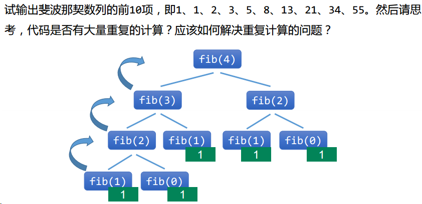

斐波那契数列输出——使用缓存对象实现

```html
<!DOCTYPE html>
<html lang="en">
	<head>
		<meta charset="UTF-8" />
		<meta name="viewport" content="width=device-width, initial-scale=1.0" />
		<title>Document</title>
	</head>

	<body>
		<script>
			// 试输出斐波那契数列的前10项，即1、1、2、3、5、8、13、21、34、55

			// 缓存对象
			var cache = {};

			// 创建一个函数，功能是返回下标为n的这项的数字
			function fib(n) {
				// 判断缓存对象中有没有这个值，如果有，直接用
				if (cache.hasOwnProperty(n)) {
					return cache[n];
				}
				// 缓存对象没有这个值
				// 看下标n是不是0或者是不是1，如果是，就返回常数1
				// 如果不是，就递归
				var v = n == 0 || n == 1 ? 1 : fib(n - 1) + fib(n - 2);
				// 写入缓存。也就是说，每算一个值，就要把这个值存入缓存对象。
				cache[n] = v;
				return v;
			}

			for (let i = 0; i <= 9; i++) {
				console.log(fib(i));
			}
		</script>
	</body>
</html>
```

##### 上面代码的 cache 缓存思想

```json
{
	"0": 1,
	"1": 1,
	"2": 2,
	"3": 3,
	"4": 5,
	"5": 8
}
```

#### 递归深入——题目 2

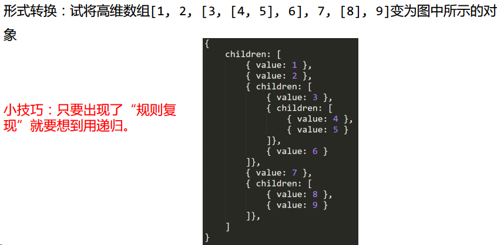

递归实现高维数组变成对象：

```html
<!DOCTYPE html>
<html lang="en">
	<head>
		<meta charset="UTF-8" />
		<meta name="viewport" content="width=device-width, initial-scale=1.0" />
		<title>Document</title>
	</head>

	<body>
		<script>
			// 转换数组的形式[1, 2, 3, [4, 5]]要变为这样的对象：
			// {
			//     chidren: [
			//         {
			//             value: 1
			//         },
			//         {
			//             value: 2
			//         },
			//         {
			//             value: 3
			//         },
			//         {
			//             children: [
			//                 {
			//                     {
			//                         value: 4
			//                     },
			//                     {
			//                         value: 5
			//                     }
			//                 }
			//             ]
			//         }
			//     ]
			// }

			// 测试数组
			var arr = [1, 2, 3, [4, 5], [[[6], 7, 8], 9], 10];

			// 写法1：for循环转换函数
			// function convert(arr) {
			//     // 准备一个结果数组
			//     var result = [];
			//     // 遍历传入的arr的每一项
			//     for (let i = 0; i < arr.length; i++) {
			//         // 如果遍历到的数字是number，直接放进入
			//         if (typeof arr[i] == 'number') {
			//             result.push({
			//                 value: arr[i]
			//             });
			//         } else if (Array.isArray(arr[i])) {
			//             // 如果遍历到的这项是数组，那么就递归
			//             result.push({
			//                 children: convert(arr[i])
			//             });
			//         }
			//     }
			//     return result;
			// }

			// 写法2：map转换函数，参数不是arr这个词语，而是item，意味着现在item可能是数组，也可能是数字
			// 即，写法1的递归次数要大大小于写法2。因为写法2中，遇见什么东西都要递归一下。
			function convert(item) {
				if (typeof item == "number") {
					// 如果传进来的参数是数字
					return {
						value: item,
					};
				} else if (Array.isArray(item)) {
					// 如果传进来的参数是数组
					return {
						children: item.map((_item) => convert(_item)),
					};
				}
			}

			var o = convert(arr);
			console.log(o);
		</script>
	</body>
</html>
```

#### 栈（重要）

- 栈（stack）又名堆栈，它是一种运算受限的线性表，**仅在表尾能进行插入和删除操作**。这一端被称为**栈顶**，相对地，把另一端称为**栈底**。
- 向一个栈插入新元素又称作**进栈、入栈或压栈**；从一个栈删除元素又称作**出栈或退栈**。
- **后进先出（LIFO）**特点：栈中的元素，最先进栈的必定是最后出栈，后进栈的一定会先出栈。
- JavaScript 中，栈可以**用数组模拟**。需要限制只能使用 push()和 pop()，不能
  使用 unshift()和 shift()。即，**数组尾是栈顶**。
- 当然，可以用面向对象等手段，将栈封装的更好。

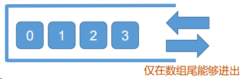

##### 利用“栈”的题目

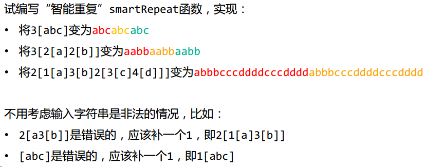

文字题目：

```bash
试编写“智能重复”smartRepeat函数，实现：
• 将3[abc]变为abcabcabc
• 将3[2[a]2[b]]变为aabbaabbaabb
• 将2[1[a]3[b]2[3[c]4[d]]]变为abbbcccddddcccddddabbbcccddddcccdddd

不用考虑输入字符串是非法的情况，比如：
• 2[a3[b]]是错误的，应该补一个1，即2[1[a]3[b]]
• [abc]是错误的，应该补一个1，即1[abc]
```

##### 使用“栈” 优雅解题

词法分析的时候，经常要用到栈这个数据结构；

初学者大坑：栈的题目和递归非常像，这类题目给人的感觉都是用递归解题。信
心满满动手开始写了，却发现递归怎么都递归不出来。此时就要想到，不是用递
归，而是用栈。

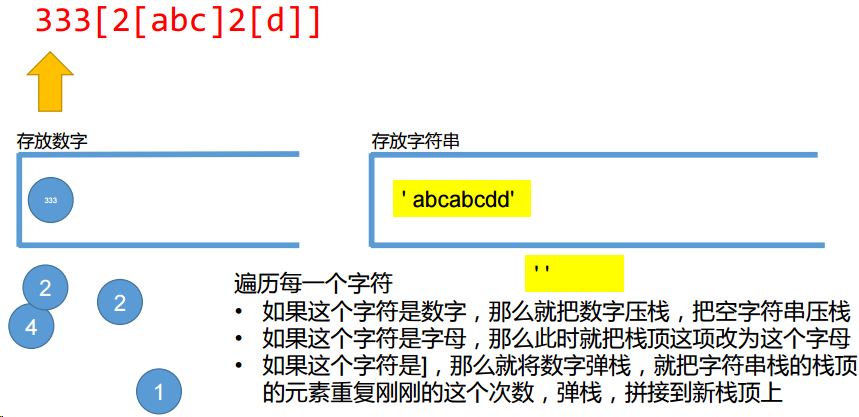

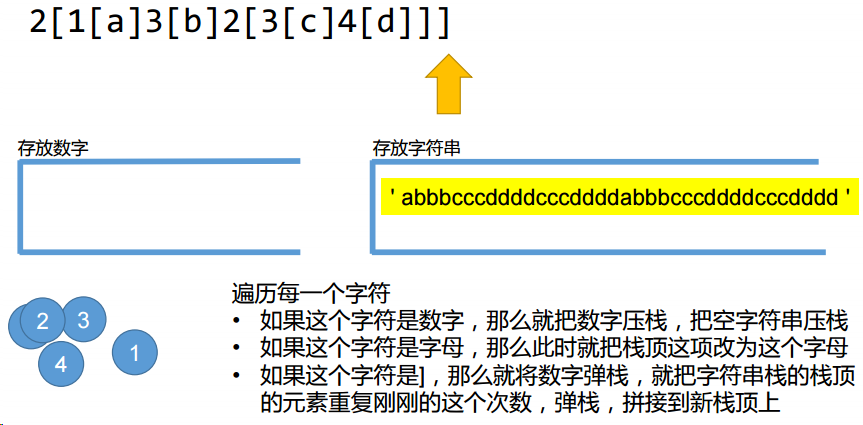

##### [栈]题目实现代码：

```html
<!DOCTYPE html>
<html lang="en">
	<head>
		<meta charset="UTF-8" />
		<meta name="viewport" content="width=device-width, initial-scale=1.0" />
		<title>Document</title>
	</head>

	<body>
		<script>
			// 试编写“智能重复”smartRepeat函数，实现：
			// 将3[abc]变为abcabcabc
			// 将3[2[a]2[b]]变为aabbaabbaabb
			// 将2[1[a]3[b]2[3[c]4[d]]]变为abbbcccddddcccddddabbbcccddddcccdddd

			function smartRepeat(templateStr) {
				// 指针
				var index = 0;
				// 栈1，存放数字
				var stack1 = [];
				// 栈2，存放临时字符串
				var stack2 = [];
				// 剩余部分
				var rest = templateStr;

				while (index < templateStr.length - 1) {
					// 剩余部分
					rest = templateStr.substring(index);

					// 看当前剩余部分是不是以数字和[开头
					if (/^\d+\[/.test(rest)) {
						// 得到这个数字
						let times = Number(rest.match(/^(\d+)\[/)[1]);
						// 就把数字压栈，把空字符串压栈
						stack1.push(times);
						stack2.push("");
						// 让指针后移，times这个数字是多少位就后移多少位加1位。
						// 为什么要加1呢？加的1位是[。
						index += times.toString().length + 1;
					} else if (/^\w+\]/.test(rest)) {
						// 如果这个字符是字母，那么此时就把栈顶这项改为这个字母
						let word = rest.match(/^(\w+)\]/)[1];
						stack2[stack2.length - 1] = word;
						// 让指针后移，word这个词语是多少位就后移多少位
						index += word.length;
					} else if (rest[0] == "]") {
						// 如果这个字符是]，那么就①将stack1弹栈，②stack2弹栈，③把字符串栈的新栈顶的元素重复刚刚弹出的那个字符串指定次数拼接到新栈顶上。
						let times = stack1.pop();
						let word = stack2.pop();
						// repeat是ES6的方法，比如'a'.repeat(3)得到'aaa'
						stack2[stack2.length - 1] += word.repeat(times);
						index++;
					}

					console.log(index, stack1, stack2);
				}

				// while结束之后，stack1和stack2中肯定还剩余1项。返回栈2中剩下的这一项，重复栈1中剩下的这1项次数，组成的这个字符串。如果剩的个数不对，那就是用户的问题，方括号没有闭合。
				return stack2[0].repeat(stack1[0]);
			}

			var result = smartRepeat("3[2[3[a]1[b]]4[d]]");
			console.log(result);
		</script>
	</body>
</html>
```

##### 上诉栈算法 对应的正则表达式的相关方法的输出

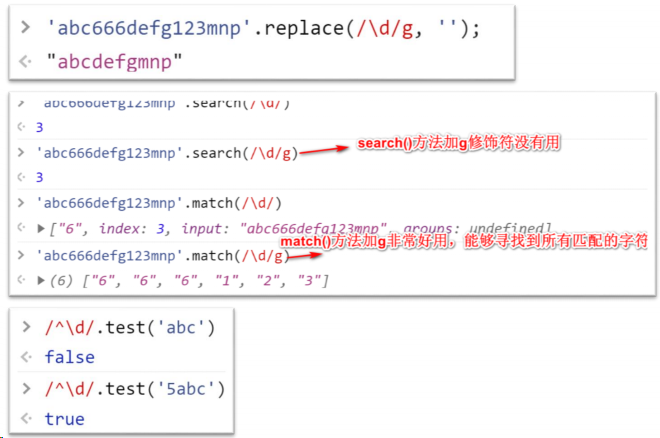

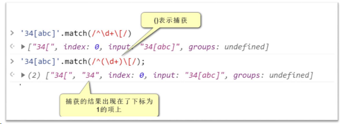

### 3.:a:手写实现 AST 抽象语法树

- 学习源码时，源码思想要借鉴，而不要抄袭。要能够发现源码中书写的精彩的地方；
- 将独立的功能拆写为独立的 js 文件中完成，通常是一个独立的类，每个单独的功能必须能独立的“单元测试”；
- 应该围绕中心功能，先把主干完成，然后修剪枝叶；
- 功能并不需要一步到位，功能的拓展要一步步完成，有的非核心功能甚至不需实现；

#### 1.实现流程

##### 1.AST 形成算法

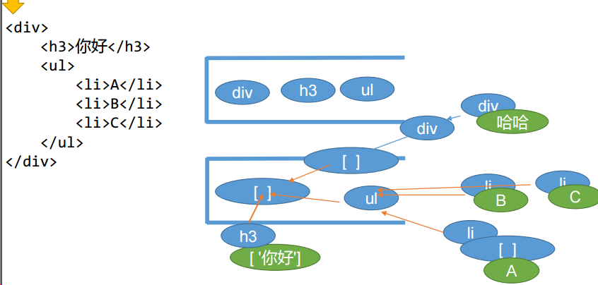

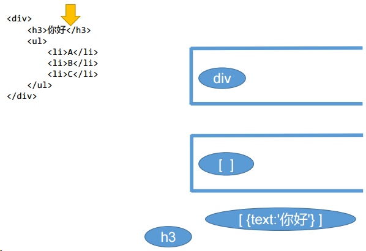

##### 2.手写 AST 编译器

##### 3.手写文本解析功能

##### 4.AST 优化

##### 5.将 AST 生成 h()函数

##### 6.识别 attrs

attrs 就是标签内的属性，如 class、id 等...

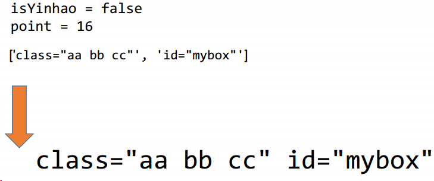

#### 2.新建项目 study-ast

目录文件如下：

```bash
src
├── index.js  # 调试试验的js文件
├── parse.js  # 标签的识别和收集
└── parseAttrsString.js  # 把attrsString变为数组返回
www
└── index.html  # 用来引用的webpack打包后的js文件
package.json # npm依赖
webpack.config.js # wepack配置文件
```

package.json

```json
{
	"name": "study-snabbdom",
	"version": "1.0.0",
	"description": "",
	"main": "index.js",
	"scripts": {
		"dev": "webpack-dev-server"
	},
	"author": "",
	"license": "ISC",
	"devDependencies": {
		"webpack": "^5.11.0",
		"webpack-cli": "^3.3.12",
		"webpack-dev-server": "^3.11.0"
	}
}
```

webpack.config.js

```js
// 从https://www.webpackjs.com/官网照着配置
const path = require("path");

module.exports = {
	// 入口
	entry: "./src/index.js",
	// 出口
	output: {
		// 虚拟打包路径，就是说文件夹不会真正生成，而是在8080端口虚拟生成
		publicPath: "xuni",
		// 打包出来的文件名，不会真正的物理生成
		filename: "bundle.js",
	},
	devServer: {
		// 端口号
		port: 8080,
		// 静态资源文件夹
		contentBase: "www",
	},
};
```

www/index.html

```html
<!DOCTYPE html>
<html lang="en">
	<head>
		<meta charset="UTF-8" />
		<meta name="viewport" content="width=device-width, initial-scale=1.0" />
		<title>Document</title>
	</head>
	<body>
		<div id="container"></div>

		<script src="/xuni/bundle.js"></script>
	</body>
</html>
```

src/index.js

```js
import parse from "./parse.js";

var templateString = `<div>
    <h3 class="aa bb cc" data-n="7" id="mybox">你好</h3>
    <ul>
        <li>A</li>
        <li>B</li>
        <li>C</li>
    </ul>
</div>`;

const ast = parse(templateString);
console.log(ast);
```

#### 3.:b:手写实现 AST 抽象语法树解析

##### src/parseAttrsString.js：识别 attrs 标签的属性字符串，然后变为数组返回出去

```js
// 识别attrs标签的属性字符串，然后变为数组返回出去
export default function (attrsString) {
	if (attrsString == undefined) return [];
	console.log(attrsString);
	// 当前是否在引号内
	var isYinhao = false;
	// 断点
	var point = 0;
	// 结果数组
	var result = [];

	// 遍历attrsString，而不是你想的用split()这种暴力方法
	for (let i = 0; i < attrsString.length; i++) {
		let char = attrsString[i];
		if (char == '"') {
			isYinhao = !isYinhao;
		} else if (char == " " && !isYinhao) {
			// 遇见了空格，并且不在引号中
			console.log(i);
			if (!/^\s*$/.test(attrsString.substring(point, i))) {
				result.push(attrsString.substring(point, i).trim());
				point = i;
			}
		}
	}
	// 循环结束之后，最后还剩一个属性k="v"
	result.push(attrsString.substring(point).trim());

	// 下面的代码功能是，将["k=v","k=v","k=v"]变为[{name:k, value:v}, {name:k, value:v}, {name:k,value:v}];
	result = result.map((item) => {
		// 根据等号拆分
		const o = item.match(/^(.+)="(.+)"$/);
		return {
			name: o[1],
			value: o[2],
		};
	});

	return result;
}
```

##### src/parse.js

```js
import parseAttrsString from "./parseAttrsString.js";

// parse函数，主函数
export default function (templateString) {
	// 指针
	var index = 0;
	// 剩余部分
	var rest = "";
	// 开始标记
	var startRegExp = /^\<([a-z]+[1-6]?)(\s[^\<]+)?\>/;
	// 结束标记
	var endRegExp = /^\<\/([a-z]+[1-6]?)\>/;
	// 抓取结束标记前的文字
	var wordRegExp = /^([^\<]+)\<\/[a-z]+[1-6]?\>/;
	// 准备两个栈
	var stack1 = [];
	var stack2 = [{ children: [] }];

	while (index < templateString.length - 1) {
		rest = templateString.substring(index);
		// console.log(templateString[index]);
		if (startRegExp.test(rest)) {
			// 识别遍历到的这个字符，是不是一个开始标签
			let tag = rest.match(startRegExp)[1];
			let attrsString = rest.match(startRegExp)[2];
			// console.log('检测到开始标记', tag);
			// 将开始标记推入栈1中
			stack1.push(tag);
			// 将空数组推入栈2中
			stack2.push({
				tag: tag,
				children: [],
				attrs: parseAttrsString(attrsString),
			});
			// 得到attrs字符串的长度
			const attrsStringLength = attrsString != null ? attrsString.length : 0;
			// 指针移动标签的长度加2再加attrString的长度，为什么要加2呢？因为<>也占两位
			index += tag.length + 2 + attrsStringLength;
		} else if (endRegExp.test(rest)) {
			// 识别遍历到的这个字符，是不是一个结束标签
			let tag = rest.match(endRegExp)[1];
			// console.log('检测到结束标记', tag);
			let pop_tag = stack1.pop();
			// 此时，tag一定是和栈1顶部的是相同的
			if (tag == pop_tag) {
				let pop_arr = stack2.pop();
				if (stack2.length > 0) {
					stack2[stack2.length - 1].children.push(pop_arr);
				}
			} else {
				throw new Error(pop_tag + "标签没有封闭！！");
			}
			// 指针移动标签的长度加3，为什么要加2呢？因为</>也占3位
			index += tag.length + 3;
		} else if (wordRegExp.test(rest)) {
			// 识别遍历到的这个字符，是不是文字，并别不能是全空
			let word = rest.match(wordRegExp)[1];
			// 看word是不是全是空
			if (!/^\s+$/.test(word)) {
				// 不是全是空
				// console.log('检测到文字', word);
				// 改变此时stack2栈顶元素中
				stack2[stack2.length - 1].children.push({ text: word, type: 3 });
			}
			// 指针移动标签的长度加3，为什么要加2呢？因为</>也占3位
			index += word.length;
		} else {
			index++;
		}
	}

	// 此时stack2就是我们之前默认放置的一项了，此时要返回这一项的children即可
	return stack2[0].children[0];
}
```

## 五、指令和生命周期

### 1.搭建项目 study-directive

基于前面【响应式数据原理】中【study-data-reactive】项目手写实现的代码

```bash
src：响应式数据——手写实现的源码目录
 |——array.js
 |——defineReactive.js
 |——Dep.js
 |——index.js
 |——observe.js
 |——Observer.js
 |——utils.js
 |__Watcher.js
```

得到的目录文件如下：

```bash
src
├── array.js
├── Compile.js  # 编译
├── defineReactive.js
├── Dep.js
├── index.js
├── observe.js
├── Observer.js
├── utils.js
├── Vue.js  # Vue类
└── Watcher.js
www
└── index.html  # 用来引用的webpack打包后的js文件
package.json # npm依赖
webpack.config.js # wepack配置文件
```

package.json

```json
{
	"name": "study-directive",
	"version": "1.0.0",
	"description": "",
	"main": "index.js",
	"scripts": {
		"dev": "webpack-dev-server"
	},
	"author": "",
	"license": "ISC",
	"dependencies": {},
	"devDependencies": {
		"webpack": "^5.11.0",
		"webpack-cli": "^3.3.12",
		"webpack-dev-server": "^3.11.0"
	}
}
```

webpack.config.js

```js
// 从https://www.webpackjs.com/官网照着配置
const path = require("path");

module.exports = {
	// 入口
	entry: "./src/index.js",
	// 出口
	output: {
		// 虚拟打包路径，就是说文件夹不会真正生成，而是在8080端口虚拟生成
		publicPath: "xuni",
		// 打包出来的文件名，不会真正的物理生成
		filename: "bundle.js",
	},
	devServer: {
		// 端口号
		port: 8080,
		// 静态资源文件夹
		contentBase: "www",
	},
};
```

### 2.手写实现 vue2 指令和生命周期

#### www/index.html：试验代码功能

```html
<!DOCTYPE html>
<html lang="en">
	<head>
		<meta charset="UTF-8" />
		<meta name="viewport" content="width=device-width, initial-scale=1.0" />
		<title>Document</title>
	</head>

	<body>
		<div id="app">
			你好{{b.m.n}}
			<br />
			<input type="text" v-model="b.m.n" />
		</div>
		<button onclick="add()">按我加1</button>

		<script src="/xuni/bundle.js"></script>
		<script>
			var vm = new Vue({
				el: "#app",
				data: {
					a: 10,
					b: {
						m: {
							n: 7,
						},
					},
				},
				watch: {
					a() {
						console.log("a改变啦");
					},
				},
				created() {},
				update() {},
			});

			console.log(vm);

			function add() {
				vm.b.m.n++;
			}
		</script>
	</body>
</html>
```

#### src/index.js：像 windo 变量中注入 Vue 类

```js
import Vue from "./Vue.js";

window.Vue = Vue;
```

#### src/Vue.js：

```js
import Compile from "./Compile.js";
import observe from "./observe.js";
import Watcher from "./Watcher.js";

export default class Vue {
	constructor(options) {
		// 把参数options对象存为$options
		this.$options = options || {};
		// 数据
		this._data = options.data || undefined;
		observe(this._data);
		// 默认数据要变为响应式的，这里就是生命周期
		this._initData();
		// 调用默认的watch
		this._initWatch();
		// 模板编译
		new Compile(options.el, this);
	}

	_initData() {
		var self = this;
		Object.keys(this._data).forEach((key) => {
			Object.defineProperty(self, key, {
				get: () => {
					return self._data[key];
				},
				set: (newVal) => {
					self._data[key] = newVal;
				},
			});
		});
	}
	// 默认的watch监听的方法的实现
	_initWatch() {
		var self = this;
		var watch = this.$options.watch;
		Object.keys(watch).forEach((key) => {
			new Watcher(self, key, watch[key]);
		});
	}
}
```

#### src/Compile.js：模板编译

```js
import Watcher from "./Watcher.js";

export default class Compile {
	constructor(el, vue) {
		// vue实例
		this.$vue = vue;
		// 挂载点
		this.$el = document.querySelector(el);
		// 如果用户传入了挂载点
		if (this.$el) {
			// 调用函数，让节点变为fragment，类似于mustache中的tokens。实际上用的是AST，这里就是轻量级的，fragment
			let $fragment = this.node2Fragment(this.$el);
			// 编译
			this.compile($fragment);
			// 替换好的内容要上树
			this.$el.appendChild($fragment);
		}
	}
	node2Fragment(el) {
		var fragment = document.createDocumentFragment();

		var child;
		// 让所有DOM节点，都进入fragment
		while ((child = el.firstChild)) {
			fragment.appendChild(child);
		}
		return fragment;
	}
	compile(el) {
		// console.log(el);
		// 得到子元素
		var childNodes = el.childNodes;
		var self = this;

		var reg = /\{\{(.*)\}\}/;

		childNodes.forEach((node) => {
			var text = node.textContent;
			text;
			// console.log(node.nodeType);
			// console.log(reg.test(text));
			if (node.nodeType == 1) {
				self.compileElement(node);
			} else if (node.nodeType == 3 && reg.test(text)) {
				let name = text.match(reg)[1];
				self.compileText(node, name);
			}
		});
	}

	compileElement(node) {
		// console.log(node);
		// 这里的方便之处在于不是将HTML结构看做字符串，而是真正的属性列表
		var nodeAttrs = node.attributes;
		var self = this;

		// 类数组对象变为数组
		[].slice.call(nodeAttrs).forEach((attr) => {
			// 这里就分析是否是指令
			var attrName = attr.name;
			var value = attr.value;
			// 指令都是v-开头的
			var dir = attrName.substring(2);

			// 看看是不是指令
			if (attrName.indexOf("v-") == 0) {
				// v-开头的就是指令
				if (dir == "model") {
					// console.log('发现了model指令', value);
					new Watcher(self.$vue, value, (value) => {
						node.value = value;
					});
					var v = self.getVueVal(self.$vue, value);
					node.value = v;

					// 添加监听
					node.addEventListener("input", (e) => {
						var newVal = e.target.value;
						self.setVueVal(self.$vue, value, newVal);
						v = newVal;
					});
				} else if (dir == "if") {
					// console.log('发现了if指令', value);
				}
			}
		});
	}

	compileText(node, name) {
		// console.log('AA', name);
		// console.log('BB', this.getVueVal(this.$vue, name));
		node.textContent = this.getVueVal(this.$vue, name);
		new Watcher(this.$vue, name, (value) => {
			node.textContent = value;
		});
	}

	getVueVal(vue, exp) {
		var val = vue;
		exp = exp.split(".");
		exp.forEach((k) => {
			val = val[k];
		});

		return val;
	}

	setVueVal(vue, exp, value) {
		var val = vue;
		exp = exp.split(".");
		exp.forEach((k, i) => {
			if (i < exp.length - 1) {
				val = val[k];
			} else {
				val[k] = value;
			}
		});
	}
}
```

## Vue2 源码调试剖析

### 1.Vue 2 源码克隆、安装依赖、运行

从 https://github.com/vuejs/vue.git 克隆代码到本地后，安装依赖。

切换到 dev 分支，因为 dev 分支是 2.6 最新版代码，而 main 分支是 2.7 版本的代码

```bash
yarn install
```

安装报错不用管：

```bash
yarn install
yarn install v1.22.21
[1/4] Resolving packages...
[2/4] Fetching packages...
[3/4] Linking dependencies...
[4/4] Building fresh packages...
[1/7] ⠄ chromedriver
[7/7] ⠄ commitizen
[3/7] ⠄ phantomjs-prebuilt
[-/7] ⠄ waiting...
error D:\Code\[NetProject]\Source code collection\[VueOfficial]\vue\node_modules\puppeteer: Command failed.
Exit code: 1
Command: node install.js
Arguments:
Directory: D:\Code\[NetProject]\Source code collection\[VueOfficial]\vue\node_modules\puppeteer
Output:
ERROR: Failed to download Chromium r609904! Set "PUPPETEER_SKIP_CHROMIUM_DOWNLOAD" env variable to skip download.
Error: read ECONNRESET
```

直接运行运行 vue 源码

```bash
yarn run dev
```

### 2.Vue 2 源码目录介绍

#### Vue 2 源码目录

Vue 2 源码位于 `vue/src` 目录下，该目录包含了 Vue 框架的核心代码以及一些相关的工具和配置文件。

以下是 Vue 2 源码目录的主要结构：

```bash
dist/ # 这个文件夹包含Vue.js的不同构建版本，如UMD、CommonJS和ES Module格式的文件。
test/ # 包含测试Vue.js各个部分功能的代码，确保框架的稳定性和可靠性。
types/ # 包含TypeScript类型定义文件。

# vue2.6版本(2.6版本和以前的目录结构基本相同)
vue/src  # 源代码所在的文件夹，包括Vue.js的核心功能和实用程序函数。
├── compiler  # 包含Vue.js的模板编译器代码，将模板转换为渲染函数。
	├── compiler.js  # 编译器的入口文件
	├── parser/index.js  # 模板解析器
	└── generator/index.js  # 代码生成器
├── core  # 核心代码：如Vue 构造函数、组件、指令、生命周期、响应系统、虚拟DOM、观察者模式等。（主要的Vue的核心实现代码在这个目录）
	├── index.js  #  Vue 构造函数的导出
	├── components  # 组件相关代码
	└── ...  #
├── platforms  # 包含不同平台（如web或weex）特定的代码。
	├── web/index.js  # Web 平台的适配代码
	└── weex/index.js  # 微信小程序的适配代码
├── server  # 包含服务端渲染（SSR）相关的代码。
├── sfc  # 用于处理单文件组件（.vue文件）的代码。
└── shared  # 包含Vue.js各部分共享的实用功能。

# vue2.7版本（2.7增加了vue3的Composition Api、setup语法糖、Css v-bind等，目录和源码有所改变）
vue/src  # 源代码所在的文件夹，包括Vue.js的核心功能和实用程序函数。
├── compiler  # 包含Vue.js的模板编译器代码，将模板转换为渲染函数。
├── core  # 核心代码：如响应系统、虚拟DOM、观察者模式等。（主要的Vue的核心实现代码在这个目录）
├── platforms  # 包含不同平台（如web或weex）特定的代码。
├── shared  # 公共方法和常量代码
├── types  # 包含 Vue.js 的 TypeScript 类型定义文件。
├── v3  # 包含了从 Vue 3 版本中移植到 Vue 2.7 的功能，例如 Composition API。
└── global.d.ts  # 全局的 TypeScript 声明文件，它定义了整个 Vue.js 项目的全局类型。


# vue2.7版本删减了一些目录
Vue 2.6版本中的某些目录变动可能是由于多种原因，包括项目结构的优化、功能的重构，或者是为了与新的技术标准保持一致。具体到server、sfc和platforms/weex目录的变化，这里有一些可能的解释：

-server目录: Vue CLI的更新可能会影响到server目录的结构。Vue CLI提供了一系列内置的服务和配置选项，随着版本的迭代，部分配置和服务可能已经被整合或修改。
-sfc目录: 单文件组件（Single File Components，SFC）是Vue的一个核心特性，允许开发者将模板、脚本和样式封装在单个文件中。Vue 2.7版本对SFC进行了更新，如果你在从2.6升级到2.7时遇到问题，可以参考社区的讨论和解决方案。
-platforms/weex目录: Weex是一个由阿里巴巴发起的跨平台移动应用解决方案，Vue 2.6中的Weex支持可能已经根据新的需求或技术进展进行了调整。例如，某些指令可能已经被更新或替换。
```

Vue 2.6 和 2.7 的源码目录结构非常相似，因为 2.7 主要是在 2.6 的基础上增加了一些新功能和改进。

Vue 2.7 在 2.6 的基础上增加了对 Composition API 的支持，以及一些其他的改进，例如对`<script setup>` 语法糖的支持。如果你想了解更多关于 Vue 2.7 的新特性和改进，可以查看官方的迁移指南：https://v2.vuejs.org/v2/guide/migration-vue-2-7.html

#### 其他目录

以下是 Vue2 源码根目录下除了 src 目录，其他目录的用途：

- **benchmarks** 目录：包含性能测试代码。
- **compiler-sfc(2.7 版本，2.6 版本及之前都没有)** 目录：包含单文件组件 (SFC) 编译器的代码。
- **dist** 目录：源码最终打包后的文件输出目录。
- **examples** 目录：官方的使用示例。
- **flow** 目录：类型检测（没人用了，和 TS 功能类似）
- **packages** 目录：一些下好的包，（vue 源码包含额 weex）
- **scripts** 目录：一些辅助脚本。
- **test** 目录：测试代码。
- **types** 目录：类型定义文件。

### 3.学习调试剖析 Vue 2 源码建议

首先阅读 Vue 2 的官方文档：[vue2 的官方文档](https://cn.vuejs.org/v2/guide/index.html)，了解 Vue 框架的基本原理和功能。

### 4:a:基于运行的 vue 源码调试剖析

#### 1.根据 vue2 源码项目的 package.json 文件中的 scripts 下的命令，找到运行和打包的命令，分析运行和打包的入口文件。

- **scripts/config.js** （web-full-dev，web-runtime-cjs-dev，web-runtime-esm...）
- 分析 `scripts/config.js` 代码得到的打包的入口：按下面每一个文件的代码执行顺序一步步得到
  - **src/platforms/web/entry-runtime.js**
  - **src/platforms/web/entry-runtime-with-compiler.js**
  - (上面两个入口的区别是：带有 compiler 的会重写$mount，将 template 变成 render 函数）
  - **src/platforms/web/runtime/index.js**（所谓的运行时，会提供一些 dom 操作的 api 属性操作、元素操作，提供一些组件和指令)
  - **src/core/index.js** initGlobalAPI 初始化全局 api
    - **src/core/instance/index.js** Vue 的构造函数

以上文件的代码的执行流程：


#### 2.从 `core` 目录开始阅读源码，了解 Vue 框架的核心代码，了解相关的功能和实现。

package.json 指定 script 脚本命令的 sourcemap 参数 可以开启代码调试：

添加：--sourcemap，或简写：-s

```json
"script": {
    "dev": "rollup -w -c scripts/config.js --sourcemap --environment TARGET:web-full-dev",
}
```

自己写的调试例子，把 examples 目录下的目录代码删除，自己写例子来调试，如【Vue2 源码解析.assets】资源目录下的 examples 目录，就是自己写的调试 vue 源码的例子

#### 3.除了代码打断点调试，也可以使用一些调试工具，例如 Chrome DevTools，帮助理解代码的执行过程。

在自己写的 examples 目录例子中，添加 debugger 调试时非常长的，熟悉代码运行流程和代码目录下的文件的功能之后，可以找到相关代码文件，直接打断点调试，更方便。

## Vue2.7 版本源码调试剖析

## Vue2 面试题

### 1.请说一下`Vue2`响应式数据的理解 （先知道基本的问题在哪， 源码的角度回答， 你用的时候会有哪些问题）

可以监控一个数据的修改和获取操作。 针对对象格式会给每个对象的属性进行劫持 Object.defineProperty

> 源码层面 initData -> observe -> defineReactive 方法 （内部对所有属性进行了重写 性能问题） 递归增加对象中的对象增加 getter 和 setter

> 我们在使用 Vue 的时候如果 层级过深（考虑优化） 如果数据不是响应式的就不要放在 data 中了。 我们属性取值的时候尽量避免多次取值。 如果有些对象是放到 data 中的但是不是响应式的可以考虑采用 Object.freeze() 来冻结对象

```js
let total = 0;
for(let i = 0; ; i< 100；i++>){
    total += i;
}
this.timer = total
```

### 2.`Vue`中如何检测数组变化?

vue2 中检测数组的变化并没有采用 defineProperty 因为修改索引的情况不多(如果直接使用 defineProperty 会浪费大量性能)。 采用重写数组的变异方法来实现 （函数劫持）

> initData -> observe -> 对我们传入的数组进行原型链修改，后续调用的方法都是重写后的方法 -》 对数组中每个对象也再次进行代理

修改数组索引 ，修改长度是无法进行监控的 `arr[1] = 100; arr.length = 300;` 不会触发视图更新的

`arr[0].xxx = 100;` 因为数组中的对象会被 `observe`

### 3.`Vue`中如何进行依赖收集？

- 所谓的依赖收集 （观察者模式） 被观察者指代的是数据 (dep)， 观察者（watcher 3 中渲染 wather、计算属性、用户 watcher）
- 一个 watcher 中可能对应着多个数据 watcher 中还需要保存 dep （重新渲染的时候可以让属性重新记录 watcher） 计算属性也会用到

> 多对多的关系 一个 dep 对应多个 watcher ， 一个 watcher 有多个 dep 。 默认渲染的时候会进行依赖收集（会触发 get 方法）， 数据更新了就找到属性对应的 watcher 去触发更新

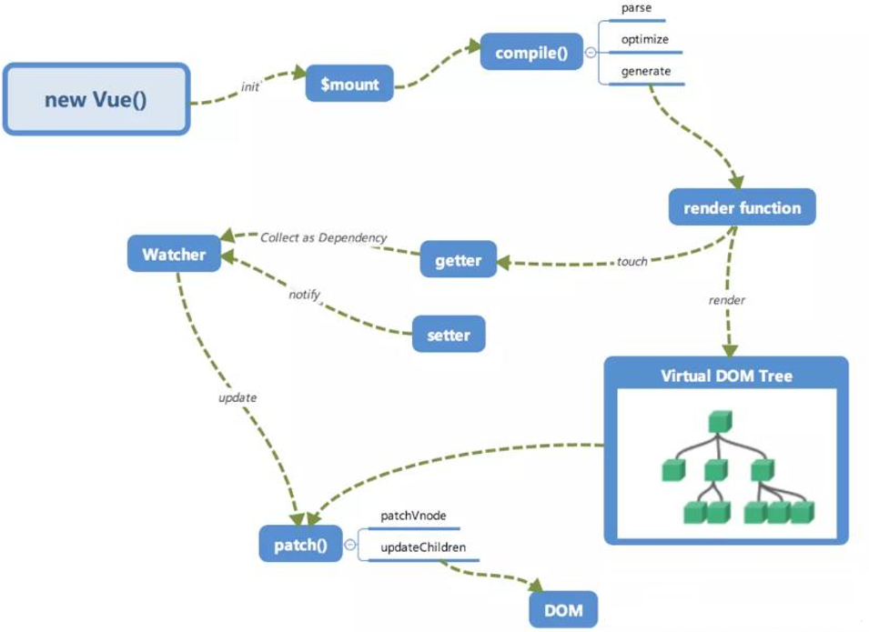

取值的时候收集依赖，设值的时候更新视图

### 4.如何理解`Vue`中模板编译原理

我们用户传递的是 template 属性，我们需要将这个 template 编译成 render 函数

- template -> ast 语法树
- 对语法树进行标记 （标记的是静态节点）
- 将 ast 语法树生成 render 函数

> 最终每次渲染可以调用 render 函数返回对应的虚拟节点 (递归是先子后父)

### 5.`Vue`生命周期钩子是如何实现的

就是内部利用了一个发布订阅模式 将用户写的钩子维护成了一个数组，后续一次调用 callHook。 主要靠的是 mergeOptions

> 内部就是一个发布订阅模式

为什么有些钩子的执行是先子后父亲，有些是先父后子 组件渲染是如何渲染的？

```html
// 遇到父组件就先渲染父组件
<div id="app">
    // 遇到子组件就渲染子组件
    <my-button   >
    // 先渲染子组件后 完成才能渲染完毕父组件
</div>
```

### 6.`Vue`的生命周期方法有哪些？一般在哪一步发送请求及原因

beforeCreate 这里没有实现响应式数据 vue3 中不需要用了 没用
created √ 拿到的是响应式的属性 (不涉及到 dom 渲染) 这个 api 可以在服务端渲染中使用 在 vue3 中 setup
beforeMount 没用实际价值
mounted √ 表示组件挂载完成了 `vm.$el` 第一次渲染完毕了，等待渲染完毕后 mounted 中可以获取 `$el`
beforeUpdate
updated 更新前后
activated keep-alive
deactivated
beforeDestroy √ 手动调用移除会触发
destroyed √ 销毁后触发
errorCaptured 捕获错误

> 一般最多的在 mounted （created 不是比 mounted 早吗？ 代码是同步执行的，请求是异步的） 服务端渲染不都是在 created 中，真正使用服务端渲染的时候 基本上也不会使用 created （服务端没有 dom 也没有 mounted 钩子） 在哪里发请求主要看你要做什么事（请求的时候获取 dom 元素，都写在这里就可以的）

created 执行完之后再执行的 mounted 这个时候异步已经在 cteated 执行完了吧 错误的
因为生命周期是顺序调用的 （同步的） 请求是异步的 所以最终获取到数据肯定是在 mounted 之后的

### 7.`Vue.mixin`的使用场景和原理

我们可以通过 Vue.mixin 来实现逻辑的复用, 问题在于数据来源不明确。 声明的时候可能会导致命名冲突。 高阶组件， vue3 采用的就是 compositionAPI 解决了复用问题

```js
Vue.mixin({
	data() {
		return { xxx: 11 };
	},
	beforeCreate() {
		this.$store = new Store();
	},
	beforeDestroy() {},
});
Vue.component("my", {
	data() {
		return { xxx: 222 };
	},
	template: "{{xxx}}",
});
```

> mixin 的核心就是合并属性 （内部采用了策略模式进行合并） 全局 mixin，局部 mixin。 针对不同的属性有不同的合并策略

### 8.`Vue`组件 data 为什么必须是个函数？

原因就在于针对根实例而言，new Vue, 组件是通过同一个构造函数多次创建实例，如果是同一个对象的话那么数据会被互相影响。 每个组件的数据源都是独立的，那就每次都调用 data 返回一个新的对象

```js
const Vue = {};
Vue.extend = function (options) {
	function Sub() {
		this.data = this.constructor.options.data();
	}
	Sub.options = options;
	return Sub;
};

let Child = Vue.extend({
	data() {
		return { a: 1 };
	},
});
let c1 = new Child();
c1.data.a = 100;
let c2 = new Child();
console.log(c2.data.a);
```

### 9.`nextTick`在哪里使用？原理是?

nextTick 内部采用了异步任务进行了包装 （多个 nextTick 调用 会被合并成一次 内部会合并回调）最后在异步任务中批处理
主要应用场景就是异步更新 （默认调度的时候 就会添加一个 nextTick 任务） 用户为了获取最终的渲染结果需要在内部任务执行之后在执行用户逻辑
这时候用户需要将对应的逻辑放到 nextTick 中

### 10.`computed`和`watch`区别

computed 和 watch 的相同点。 底层都会创建一个 watcher (用法的区别 computed 定义的属性可以在模板中使用,watch 不能在视图中使用)

- computed 默认不会立即执行 只有取值的时候才会执行 内部会唯一个 dirty 属性 来控制依赖的值是否发生变化。 默认计算属性需要同步返回结果 ( 有个包 就是让 computed 变成异步的)
- watch 默认用户会提供一个回调函数，数据变化了就调用这个回调。 我们可以监控某个数据的变化 数据变化了执行某些操作

### 11.`Vue.set`方法是如何实现的

Vue.set 方法是 vue 中的一个补丁方法 （正常我们添加属性是不会触发更新的， 我们数组无法监控到索引和长度）

如何实现的 我们给每一个对象都增添了一个 dep 属性

> vue3 中也不需要此方法了 (当属性添加或者删除时 手动触发对象本身 dep 来进行更新)

### 12.`Vue`为什么需要虚拟 DOM

- 主要这个虚拟 dom 的好处是什么？ 我们写的代码可能要针对不同的平台来使用 （weex，web，小程序） 可以跨平台，不需要考虑平台问题
- 不用关心兼容性问题， 可以在上层将对应的渲染方法传递给我 ， 我来通过虚拟 dom 渲染即可

- diff 算法 针对更新的时候， 有了虚拟 dom 之后我们可以通过 diff 算法来找到最后的差异进行修改真实 dom （类似于在真实 dom 之间做了一个缓存）

> 跨平台 、diff 算法

### 13.`Vue`中`diff`算法原理

diff 算法的特点就是平级比较 ， 内部采用了双指针方式进行了优化 优化了常见的操作。 采用了递归比较的方式

#### 针对一个节点的 diff 算法

- 先拿出根节点来进行比较如果是同一个节点则比较属性 ， 如果不是同一个节点则直接换成最新的即可
- 同一个节点比较属性后，复用老节点

#### 比较儿子

- 一方有儿子 一方没儿子 （删除 、 添加）
- 两方都有儿子
  - 优化比较 头头 尾尾 交叉比对
  - 就做一个映射表，用新的去映射表中查找此元素是否存在，存在则移动不存在则插入， 最后删除多余的
  - 这里会有多移动的情况

> O(n)复杂度的递归比较

### 14.既然 Vue 通过数据劫持可以精准探测数据变化，为什么还需要虚拟 DOM 进行`diff`检测差异

- 如果给每个属性都去增加 watcher , 而且粒度太小也是不好控制, 降低 watcher 的数量 （每一个组件都有一个 watcher） 可以通过 diff 算法来优化渲染过程。 通过 diff 算法和响应式原理折中处理了一下

### 15.请说明 Vue 中 key 的作用和原理，谈谈你对它的理解

isSameVnode 中会根据 key 来判断两个元素是否是同一个元素，key 不相同说明不是同一个元素 （key 在动态列表中不要使用索引 -》 bug）
我们使用 key 尽量要保证 key 的唯一性 （这样可以优化 diff 算法）

### 16.谈一谈对 Vue 组件化的理解

组件的优点： 组件的复用可以根据数据渲染对应的组件 ， 把组件相关的内容放在一起 （方便复用）合理规划组件，可以做到更新的时候是组件级更新 (组件化中的特性 属性， 事件， 插槽)

> Vue 中怎样处理组件 1） Vue.extend 根据用户的传入的对象生成一个组件的构造函数 2） 根据组件产生对应的虚拟节点 data:{hook:init} 3）做组件初始化 将我们的虚拟节点转化成真实节点 （组件的 init 方法） new Sub().$mount()

### 17.`Vue`的组件渲染流程 （init）

- `vm.$options.components['my'] = {my:模板}`
- 创造组件的虚拟节点 `createComponent {tag:'my',data:{hook:{init}}`,`componentOptions:{Ctor:Vue.extend( {my:模板})}}`
- 创造真实节点的 `createComponent init -> new 组件().$mount() -> vm.componentInstance`
- `vm.$el` 插入到父元素中

### 18.`Vue`组件更新流程 （prepatch）

- 组件更新会触发 组件的 prepatch 方法，会复用组件，并且比较组件的 属性 事件 插槽
- 父组件给子组件传递的属性是(props) 响应式的 , 在模板中使用会做依赖收集 收集自己的组件 watcher
- 稍后组件更新了 会重新给 props 赋值 ， 赋值完成后会触发 watcher 重新更新

### 19.`Vue`中异步组件原理

Vue 中异步组件的写法有很多， 主要用作。大的组件可以异步加载的 markdown 组件 editor 组件。 就是先渲染一个注释标签，等组件加载完毕，最后在重新渲染 forceUpdate (图片懒加载) 使用异步组件会配合 webpack

> 原理： 异步组件默认不会调用 Vue.extend 方法 所有 Ctor 上没有 cid 属性， 没有 cid 属性的就是异步组件。 会先渲染一个占位符组件. 但是如果有 loading 会先渲染 loading ， 第一轮就结束了。 如果用户调用了 resolve， 会将结果赋予给 factory.resolved 上面， 强制重新渲染。 重新渲染时候再次进入到 resolveAsyncComponent 中， 会直接拿到 factory.resolved 结果来渲染

### 20.函数组件的优势及原理

> React 中也区分两种组件 一种叫类组件 ， 一种叫函数式组件 （Sub 就是类组件 有 this） （函数组件 没有类就没有 this，也没有所谓的状态，没有生命周期 beforeCreate created..., 好处就是性能好， 不需要创建 watcher 了） 函数式组件就是调用 render 拿到返回结果来渲染， 所以性能高

### 21.Vue 组件间传值的方式及之间区别

- props 父传递数据给儿子 属性的原理就是把解析后的 props，验证后就会将属性定义在当前的实例上 `vm._props` (这个对象上的属性都是通过 defineReactive 来定义的 （都是响应式的） 组件在渲染的过程中会去 vm 上取值 `_props` 属性会被代理到 vm 上)
- emit 儿子触发组件更新 在创建虚拟节点的时候将所有的事件 绑定到了 listeners ， 通过 `$on` 方法绑定事件 通过 `$emit` 方法来触发事件 (发布订阅模式)
- events Bus 原理就是 发布订阅模式 `$bus = new Vue()` 简单的通信可以采用这种方式
- `$parent`、`$children` 就是在创造子组件的时候 会将父组件的实例传入。 在组件本身初始化的时候会构建组件间的父子关系 `$parent` 获取父组件的实例，通过`$children` 可以获取所有的子组件的实例

- ref 可以获取 dom 元素和组件的实例 （虚拟 dom 没有处理 ref， 这里无法拿到实例 也无法获取组件） 创建 dom 的时候如何处理 ref 的。 会将用户所有的 dom 操作及属性 都维护到一个 cbs 属性中 cbs (create update insert destroy....)。 依次调用 cbs 中 create 方法。 这里就包含 ref 相关的操作， 会操作 ref 并且赋值

- provide （在父组件中将属性暴露出来）inject 在后代组件中通过 inject 注入属性 在父组件中提供数据， 在子组件中递归向上查找

- $attrs (所有的组件上的属性 不涵盖 props) $listeners (组件上所有的事件)
- Vue.observalble 可以创造一个全局的对象用于通信 用的也少
- vuex

### 22.v-if 和 v-for 哪个优先级更高？

```js
function render() {
	with (this) {
		return _c(
			"div",
			_l(3, function (i) {
				return flag ? _c("span") : _e();
			}),
			0
		);
	}
}
```

> v-for 的优先级更高 ，在编译的时候 会将 v-for 渲染成 `\_l` 函数 v-if 会变成三元表达式。 v-if 和 v-for 不要在一起使用。

v-if (控制是否渲染) / v-show(控制的是样式 viisbility:hidden display:none ?) `v-show=“true"` 放在 span 上会变成块元素吗？ 为什么不用 `viisbility:hidden`? 不能响应事件 (占位的) 为什么比用 opacity 呢？ （透明度为 0 占位） 可以响应事件的

> v-if 在编译的时候 会变成三元表达式 但是 v-show 会变成一个指令

### 23.v-if，v-model，v-for 的实现原理

- v-if 会被编译成 三元表达式
- v-for 会被编译成 `_l` 循环
- v-model 干什么的？ 放在表单元素上可以实现双向绑定 ， 放在组件上就不一样了

  - v-model 放在不同的元素上会编译出不同的结果，针对文本来说会处理文本 （会被编译成 value + input + 指令处理） value 和 input 实现双向绑定阻止中文的触发 指令作用就是处理中文输入完毕后 手动触发更新

  - v-model 绑定到组件上 这里会编译一个 model 对象 组件在创建虚拟节点的时候会里有这个 对象。 会看一下里面是否有自定义的 prop 和 event ，如果没有则会被解析成 value + input 的语法糖

### 27.Vue 中.sync 修饰符的作用，用法及实现原理

- 和 v-model 一样，这个 api 是为了实现状态同步的， 这个东西在 vue3 中被移除了

```js
function render() {
	with (this) {
		return _c("my", {
			attrs: {
				xx: info,
			},
			on: {
				"update:xx": function ($event) {
					info = $event;
				},
			},
		});
	}
}
```

### 25.Vue.use 是干什么的？原理是什么？

- 这里的 use 方法 目的就是将 vue 的构造函数传递给插件中，让所有的插件依赖的 Vue 是同一个版本
- 默认调用插件 默认调用插件的 install 方法
- vue-router 和 vuex 里面的 package 的依赖里面没有 vue 是吧。是通过参数穿进去的

### 30.组件中写 name 选项有哪些好处及作用？

#### 可以实现递归组件

- 在 vue 中有 name 属性的组件可以被递归调用 （在写模板语法的时候 我们可以通过 name 属性来递归调用自己）
- 在声明组件的时候 `Sub.options.components[name] = Sub`

#### 起到标识作用

- 我们用来标识组件 通过 name 来找到对应的组件 . 自己封装跨级通信
- name 属性可以用作 devtool 调试工具 来标明具体的组件

### 24.Vue 中 slot 是如何实现的？什么时候使用它？

- 普通插槽 （普通插槽渲染作用域在父组件中的）

  - 在解析组件的时候会将组件的 children 放到 componentOptions 上作为虚拟节点的属性
  - 将 children 取出来放到组件的 `vm.$options.\_renderChildren` 中
  - 做出一个映射表放到 `vm.$slots`上 -> 将结果放到 `vm.$scopeSlots` 上 `vm.$scopeSlots = {a:fn,b:fn,default:fn}`
  - 渲染组件的时候会调用 `_t` 方法 此时会去 `vm.$scopeSlots` 找到对应的函数来渲染内容

- 具名插槽 多增加了个名字
- 作用域插槽（普通插槽渲染作用域在子组件中的）
  - 我们渲染插槽选择的作用域是子组件的 作用域插槽渲染的时候不会作为 children, 将作用域插槽做成了一个属性 scopedSlots
  - 制作一个映射关系 `$scopedSlots = {default:fn:function({msg}){return \_c('div',{},[_v(_s(msg))])}}}`
  - 稍后渲染组件的模板的时候 会通过 name 找到对应的函数 将数据传入到函数中此时才渲染虚拟节点， 用这个虚拟节点替换\_t('default')

> `vm.$scopeSlots {key:fn}   vm.$slots = {key:[vnode]}`

### 29.keep-alive 平时在哪里使用？原理是？

- 1.keep-alive 在路由中使用
- 2.在 component:is 中使用 （缓存）

- keep-alive 的原理是默认缓存加载过的组件对应的实例 内部采用了 LRU 算法
- 下次组件切换加载的时候 此时会找到对应缓存的节点来进行初始化，但是会采用上次缓存$el 来触发 （不用在做将虚拟节点转化成真实节点了） 通过 init -》 prepatch 中了
- 更新和销毁会触发 actived 和 deactived

### 28.如何理解自定义指令

- 自定义指令就是用户定义好对应的钩子，当元素在不同的状态时会调用对应的钩子 （所有的钩子会被合并到 cbs 对应的方法上， 到时候依次调用）

### 26.Vue 事件修饰符有哪些？其实现原理是什么？

- 实现主要靠的是模板编译原理 addEventListener( stop , defaultPrevent ) self capture passvie once
- .number

#### 编译的时候直接编译到事件内部了

- `<div @click.prevent></div>`
- `<div @click.stop></div> `

#### 编译的时候增加标识 !~&

- `<div @click.passive></div>`
- `<div @click.capture></div>`
- `<div @click.one></div>`

#### 键盘事件

- 都是通过模板编译来实现的，没有特殊的

## Object.defineProperty 缺点

- 深度监听，需要递归到底，一次性计算量大
- 无法监听新增属性/删除属性( 需要：Vue.set、Vue.delete )
