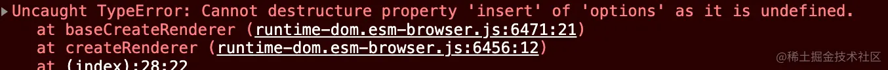
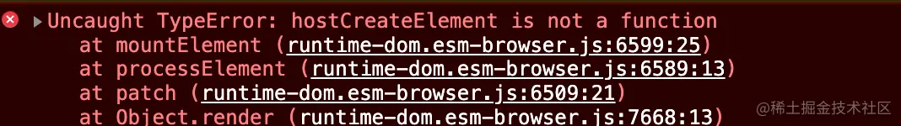
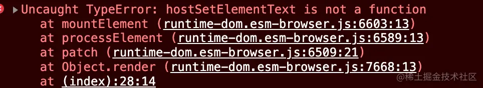
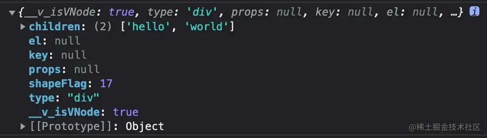

# Vue3 源码解析

[看不懂来打我，vue3如何将template编译成render函数 (qq.com)](https://mp.weixin.qq.com/s/OM_xBi2xci4Wh2ebCT_G1A)

[推荐 7 个 Vue2、Vue3 源码解密分析的开源项目 👍 · Issue #35 · FrontEndGitHub/FrontEndGitHub](https://github.com/FrontEndGitHub/FrontEndGitHub/issues/35)

[Vue3源码解析 (diy4869.github.io)](https://diy4869.github.io/vue-next-analysis/page/flow.html)

[Vue3 的响应式和以前有什么区别，Proxy 无敌？（源码级详解） (qq.com)](https://mp.weixin.qq.com/s?__biz=MzI3NTM5NDgzOA==&mid=2247483711&idx=1&sn=e4c59cd3a742ba8384c05b6d1fb520b7&chksm=eb043946dc73b0501fc5d848f3cd330e1d9386afa27578d349cd918212f7e36de9bf7767f97a&token=431470234&lang=zh_CN#rd)

[从零带你手把手实现Vue3响应式原理-上（非玩具） (qq.com)](https://mp.weixin.qq.com/s?__biz=MzI3NTM5NDgzOA==&mid=2247483736&idx=1&sn=7ffba2b40fa0ddacd1ad0a34c4afad7d&chksm=eb043921dc73b037b637f83a9344f9ffb40f0c514cce6cb2de609093d20860c436cd4d307db8&token=431470234&lang=zh_CN#rd)

[从零带你手把手实现Vue3响应式原理-下（Map和Set的处理） (qq.com)](https://mp.weixin.qq.com/s?__biz=MzI3NTM5NDgzOA==&mid=2247483747&idx=1&sn=735d86b80e363112c9b5244e66697e3f&chksm=eb04391adc73b00c6e0a9b7187119b2c3ffe78d18ca281a789179717313bab6a7b83e49b8df3&token=431470234&lang=zh_CN#rd)

[深度解析：Vue3如何巧妙的实现强大的computed - 掘金 (juejin.cn)](https://juejin.cn/post/6844904053638447117)

[我从 17w star 的 Vuejs 中学到了什么？ (qq.com)](https://mp.weixin.qq.com/s?__biz=MzI3NTM5NDgzOA==&mid=2247489895&idx=1&sn=97e78fa4108bad3251479f507123ff9d&chksm=eb04211edc73a80844e8c5deafb2004fbadef1f6c3dfccf52cfccdd27ddff7982cce3b7a9db1&token=431470234&lang=zh_CN#rd)

[精读《Vue3 DOM diff 最长上升子序列》 (qq.com)](https://mp.weixin.qq.com/s?__biz=MzI3NTM5NDgzOA==&mid=2247496892&idx=2&sn=9be67aca74fe684442a344f5da352101&chksm=eb07ccc5dc7045d38bf49a5f3e4585dd6216cd466299561fcea1557fb22df60c35e2d7053b13&token=431470234&lang=zh_CN#rd)

[从 Vue3 源码中那些实用的基础工具函数中，我学到了什么？ (qq.com)](https://mp.weixin.qq.com/s?__biz=MzI3NTM5NDgzOA==&mid=2247500294&idx=2&sn=dcc6ee708f6bd78ae90a714701b06ee8&chksm=eb07fa7fdc707369eb540d5fd9c289db22dddbfc97540f976246c8244a8fdd1fd66e81e96440&token=431470234&lang=zh_CN#rd)

[让 Vue.js 3.2 创建节点提升 200% 速度的秘密 (qq.com)](https://mp.weixin.qq.com/s?__biz=MzI3NTM5NDgzOA==&mid=2247500914&idx=2&sn=93316e4e43c204c55b109b9286671c72&chksm=eb07fc0bdc70751d0226e689ac4a6827d9984936f8cdc316a8e60cb34e957e51a2b40a50bc60&token=431470234&lang=zh_CN#rd)

[老外挥手百行代码，Vue.js 3.2 响应式性能暴增 (qq.com)](https://mp.weixin.qq.com/s?__biz=MzI3NTM5NDgzOA==&mid=2247500773&idx=2&sn=5a73cf931cbf0f2abd5a59e5dcebb5ae&chksm=eb07fb9cdc70728a26d00690f3ebc7a963316e07892ed88f90ee896d24f4e6efee381c279d72&token=431470234&lang=zh_CN#rd)

[mp.weixin.qq.com/s?__biz=MzI3NTM5NDgzOA==&mid=2247497462&idx=2&sn=807dae4d0f4716db0fb5784be416efeb&chksm=eb07ce8fdc7047993109478c692d3ede64de269b131e75c9338c3acf389a8883cc67bdfc7ddf&token=431470234&lang=zh_CN#rd](https://mp.weixin.qq.com/s?__biz=MzI3NTM5NDgzOA==&mid=2247497462&idx=2&sn=807dae4d0f4716db0fb5784be416efeb&chksm=eb07ce8fdc7047993109478c692d3ede64de269b131e75c9338c3acf389a8883cc67bdfc7ddf&token=431470234&lang=zh_CN#rd)

[字节一面，面试官问我Vue3源码，我说…… - 掘金 (阿崔cxr)](https://juejin.cn/post/7070809037398343717)


[秋招解决方案：深入 Vue3 源码，带你彻底打通 Vue3 源码面试 - 掘金 (juejin.cn)](https://juejin.cn/post/7277511894666559488)


[面试官：Vue3响应式系统都不会写，还敢说精通？ - 掘金 (juejin.cn)](https://juejin.cn/post/7090328834318270494)


[面试官：说一说 vue3 的快速 diff 算法（一） - 掘金 (juejin.cn)](https://juejin.cn/post/7265995969689665595)

[面试官：说一说 vue3 的快速 diff 算法（二） - 掘金 (juejin.cn)](https://juejin.cn/post/7266368395787747382)

[Vue3 编译原理直通车💥——parser 篇 - 掘金 (juejin.cn)](https://juejin.cn/post/7277490240171491340)

[Vue3 编译原理直通车💥——transform 篇 - 掘金 (juejin.cn)](https://juejin.cn/post/7280436247745642515)

[Vue3 编译原理直通车💥—— generate 篇 - 掘金 (juejin.cn)](https://juejin.cn/post/7282666872217255947)

[vue3 提速小巧思🚀，值得一提的编译优化！ - 掘金 (juejin.cn)](https://juejin.cn/post/7300174977167949858)

[Vue3 响应式只知道 Proxy？快来学点新技巧！ - 掘金 (juejin.cn)](https://juejin.cn/post/7314135212355141643)

## 组件库源码解析

[深入解析 Vue 3 组件库 element-plus 架构源码 (qq.com)](https://mp.weixin.qq.com/s?__biz=MzI3NTM5NDgzOA==&mid=2247489991&idx=1&sn=6dd5a9891b2fce9a7f15402c9e07d86a&chksm=eb0421bedc73a8a848b9c9e8101f1e7fc1bf39a3a12a26586bdaea46360dc8183ef515b4d3d8&token=431470234&lang=zh_CN#rd)

[详解三种 Diff 算法（源码+图） - 掘金 (juejin.cn)](https://juejin.cn/post/7125695841897021454)

## Vue3 设计思想

Vue3.0 更注重模块上的拆分，在 2.0 中无法单独使用部分模块。需要引入完整的 Vuejs(例如只想使用使用响应式部分，但是需要引入完整的 Vuejs)， Vue3 中的模块之间耦合度低，模块可以独立使用。**拆分模块**

- `Vue3`将很多功能都设计成了单独的模块，比如可以直接`import { ref, reactive } from 'vue'`使用响应式的方法，模块间耦合度低，可以独立使用；而`Vue2`没办法单独使用部分模块，就算只用到了响应式的部分，也只能引入完整的`Vuejs`。

Vue2 中很多方法挂载到了实例中导致没有使用也会被打包(还有很多组件也是一样)。通过构建工具 Tree-shaking 机制实现按需引入，减少用户打包后体积。**重写 API**

- `Vue2`很多的方法，都是直接挂载到`vm`也就是实例上了，导致没使用的这些方法，也会被打包进最终的打包文件中；`Vue3`中的功能，因为进行了模块拆分，都是函数式`API`，所以打包的时候利用`Tree-shaking`机制，做到了按需引入，有效的减少打包的体积。

Vue3 允许自定义渲染器，扩展能力强。不会发生以前的事情，改写 Vue 源码改造渲染方式。**扩展更方便**

- `Vue3`可以自定义渲染器，增强了扩展能力，暴露了很多的方法，可以进行自定义逻辑；而在一些跨平台的框架中比如小程序，如果想使用`Vue2`作为技术栈，则需要在`Vue2`的源码基础上，改动源码的逻辑，才能进行打包，这相当于破坏了源码，随着更新也会出现一些问题。

依然保留 Vue2 的特色

### Vue3 性能提升

- 打包大小减少 41%
- 初次渲染快 55%, 更新渲染快 133%
- 内存减少 54%
- **使用 Proxy 代替 defineProperty 实现数据响应式**
- **重写虚拟 DOM 的实现和 Tree-Shaking**

### Vue2 和 Vue3 响应式原理有啥不同？

答：Vue2 用的是 Object.defineProperty，Vue3 用的是 Proxy。

#### vue2 的响应式

- 核心:
  - 对象: 通过 defineProperty 对对象的已有属性值的读取和修改进行劫持(监视/拦截)
  - 数组: 通过重写数组更新数组一系列更新元素的方法来实现元素修改的劫持

```js
Object.defineProperty(data, "count", {
	get() {},
	set() {},
});
```

- 问题
  - 对象直接新添加的属性或删除已有属性, 界面不会自动更新
  - 直接通过下标替换元素或更新 length, 界面不会自动更新 arr[1] = {}

#### Vue3 的响应式

##### 核心:

- 通过 Proxy(代理): 拦截对 data 任意属性的任意(13 种)操作, 包括属性值的读写, 属性的添加, 属性的删除等...
- 通过 Reflect(反射): 动态对被代理对象的相应属性进行特定的操作
- 文档:
  - Proxy 文档：<https://developer.mozilla.org/zh-CN/docs/Web/JavaScript/Reference/Global_Objects/Proxy>
  - Reflect 文档：<https://developer.mozilla.org/zh-CN/docs/Web/JavaScript/Reference/Global_Objects/Reflect>

```js
new Proxy(data, {
	// 拦截读取属性值
	get(target, prop) {
		return Reflect.get(target, prop);
	},
	// 拦截设置属性值或添加新属性
	set(target, prop, value) {
		return Reflect.set(target, prop, value);
	},
	// 拦截删除属性
	deleteProperty(target, prop) {
		return Reflect.deleteProperty(target, prop);
	},
});

proxy.name = "tom";
```

```html
<!DOCTYPE html>
<html lang="en">
	<head>
		<meta charset="UTF-8" />
		<meta name="viewport" content="width=device-width, initial-scale=1.0" />
		<title>Proxy 与 Reflect</title>
	</head>
	<body>
		<script>
			const user = {
				name: "John",
				age: 12,
			};

			/* 
    proxyUser是代理对象, user是被代理对象
    后面所有的操作都是通过代理对象来操作被代理对象内部属性
    */
			const proxyUser = new Proxy(user, {
				get(target, prop) {
					console.log("劫持get()", prop);
					return Reflect.get(target, prop);
				},

				set(target, prop, val) {
					console.log("劫持set()", prop, val);
					return Reflect.set(target, prop, val); // (2)
				},

				deleteProperty(target, prop) {
					console.log("劫持delete属性", prop);
					return Reflect.deleteProperty(target, prop);
				},
			});
			// 读取属性值
			console.log(proxyUser === user);
			console.log(proxyUser.name, proxyUser.age);
			// 设置属性值
			proxyUser.name = "bob";
			proxyUser.age = 13;
			console.log(user);
			// 添加属性
			proxyUser.sex = "男";
			console.log(user);
			// 删除属性
			delete proxyUser.sex;
			console.log(user);
		</script>
	</body>
</html>
```

## 搭建 Vue3 源码的开发环境

### 解析 vue3 源码流程

- 1.知道`Vue3`的功能原理
- 2.手写实现一个简版的`Vue3`
- 3.最后我们再去调试 vue3 源码的运行

### 先搭建一个开发环境

我们要使用`Monorepo`的方式来搭建整个项目，那什么是`Monorepo`呢？

`Monorepo`是目前很多大型开源项目，管理代码的一个方式，就是在一个`git`项目仓库中管理多个模块或者工具包。

`Vue3`的源码就是采用这种方式，将模块拆分到`package`目录中，那么好处就是：

- 一个仓库可维护多个模块或工具包，不用到处找各自的仓库。
- 方便每个模块的版本管理和依赖管理，模块之间的引用和调用变的十分方便。

## Vue3 源码目录

Vue3 开源地址：<https://www.github.com/vuejs/core>

上文说到`Vue3`采用的是`Monorepo`这种方式，所以，我们只需要大致写一下`Vue3`中包含的各种包，就能实现一个简单版本的`Vue3`了。

Vue3 源码目录：

```bash
changelogs/ # 包含了项目的变更日志，记录了每个版本的更新内容和修复的问题。
script/ # 存放构建脚本和其他与开发流程相关的脚本，如linting、测试和发布脚本。

packages/ # 存放了Vue3核心的各种包和模块，例如编译器、响应性系统、运行时和服务器端渲染等。
├── compiler-core # 编译时核心包，提供与平台无关的编译功能
├── compiler-dom # 编译时针对浏览器DOM的实现
├── compiler-sfc # 编译时SFC（单文件组件）的实现
├── compiler-ssr # 编译时服务端渲染的实现
├── dts-built-test #
├── dts-test # 与TypeScript声明文件的生成和测试有关。
├── reactivity # 包含Composition API、响应式系统等的实现
├── runtime-core # 提供与平台无关的运行时核心代码
├── runtime-dom # 针对浏览器DOM的运行时实现
├── runtime-test # 运行时测试工具
├── server-renderer # 服务端渲染器
├── sfc-playground # 单文件组件（Single File Components）的实验场，用于Vue组件的开发和测试。
├── shared # Vue内部使用的共享工具代码
├── template-explorer # 模板探索器，用于学习和实验Vue的模板语法。
├── vue # Vue.js框架的核心代码。
└── vue-compat # 是一个兼容性构建，提供可配置的Vue 2兼容行为，用于帮助从Vue 2迁移到Vue 3。

    # 每个子包下一层的文件通常包括src文件夹、__tests__文件夹（包含测试代码）、以及package.json文件（定义包的依赖和配置）。例如，compiler-core文件夹下可能会包含：
    compiler-core
    ├── src # 源代码
    ├── __tests__ # 测试代码
    └── package.json # 包配置文件
```

## 参考 vue3 的源码目录，搭建手写 Vue3 项目

我们使用`pnpm`这个工具，来搭建`Monorepo`环境。

`mkdir vue3-source-code`来创建文件夹，使用`pnpm init -y`命令，初始化`package.json`文件。之后我们创建如下所示的目录结构：

```bash
vue3-source-code
|—— packages 文件夹 // 存放 Vue3 相关的所有包
|—— reactivity 文件夹 // 响应式原理的包
|—— src
|—— index.ts // 入口文件代码
|—— shared 文件夹 // 存放一些公共方法的包
|—— src
|—— index.ts // 入口文件代码
|—— scripts 文件夹 // 存放我们自定义的一些脚本
|—— .npmrc // npm 配置文件
|—— package.json
```

接下来，我们开始完善配置项和一些调试代码，让项目能够跑的通： 在项目根目录，使用`tsc --init`命令，来初始化`tsconfig.json`文件，如果没有安装过`tsc`，需要先全局执行`npm install typescript -g`命令。

我们直接把以下配置填写在`tsconfig.json`文件中。

```javascript
// ts.config.json文件
{
  "compilerOptions": {
    "outDir": "dist", // 输出的目录
    "sourceMap": true, // 启用sourcemap
    "target": "es2016", // 目标语法
    "module": "esnext", // 模块格式为esm
    "moduleResolution": "node", // 模块解析方式
    "strict": false, // 严格模式，可以使用any
    "resolveJsonModule": true, // 解析json模块
    "esModuleInterop": true, // 允许通过es6语法引入commonjs模块
    "jsx": "preserve", // jsx 不转义
    "lib": ["esnext", "dom"], // 支持的类库 esnext及dom
    "baseUrl": "./",
    "paths": {
      "@vue/*": ["packages/*/src"]
    }
  }
}
```

心细的朋友可能发现，最后两个配置项没有注释，我们一会再来解释这两个配置项的作用。

```javascript
// .npmrc文件
shamefully-hoist = true
```

这个配置项非常有意思，我们来解释一下这个配置项是啥意思？

`npm`在安装依赖时候的特征：**会将依拍平在 node_modules 文件夹中**，而`pnpm`在安装依赖之后，则不会将依赖拍平在`node_modules`文件夹中。

举个栗子 🌰，在一个空白项目中，如果我们使用了`npm install webpack`命令，那么当你打开`node_modules`文件夹的时候，会发现安装了一大堆依赖，此时我们在项目中使用`require('express')`，发现依旧不会报错，因为在安装`webpack`的时候，也用到了`express`这个依赖，而且都拍平在`node_modules`文件夹下了，所以在项目中`require('express')`是能够找到，而且不会报错的；

但果我们使用`pnpm install webpack`的话，此时再打开`node_modules`文件，会发现少了很多东西，观察目录结构会发现，其实依赖都被放在了`.pnpm`这个文件夹下，此时如果我们直接`require('express')`，则就会报错，因为`node_modules`目录下，根本不存在`express`模块。那么，在`.npmrc`文件中加入了`shamefully-hoist = true`这个配置项，就能够将`.pnpm`中的依赖，拍平在`node_modules`文件夹中，达到的效果就和`npm`很类似了。

接下来`cd`进入`shared`目录，使用`pnpm init -y`命令初始化，并将`package.json`文件中配置项改为`"name": "@vue/shared" ......`。

```javascript
// shared/src/index.ts 文件中，我们先写一个判断是否为数组的方法，并将其导出
export const isArray = (value) => {
	return Array.isArray(value);
};
```

同样的方法，`cd`进入`reactivity`目录下，使用`pnpm init -y`命令初始化，并将`package.json`文件中配置项改为`"name": "@vue/reactivity" ......`。

接下来，如果我们想在`reactivity/src/index.ts`文件中，使用`shared`包中暴露出来的那个`isArray`方法，那么应该如何引入呢？

首先想到的就是我直接`import { isArray } from '../../shared/src/index.ts'`不就完了么，相对路径一把梭，乍看一眼没啥问题，但是稍微一想，像`shared，reactivity`这种包，最后发布可是要打包完后，单独发布到`npm`上边的，这时候使用相对路径，那肯定就不太合适了吧。有朋友又会说了，那直接用`import { isArray } from '@vue/shared'`来导入不就好了么？

没错，但是如果不进行任何配置，这种写法是去哪里找`@vue/shared`的这个包呢？`node_modules`目录中，那`node_modules`目录中没有这个`shared`包啊，该怎么办呢？聪明的朋友已经还记得，上文我们在配置`tsconfig.json`文件的时候，埋下了一个伏笔。没错，就是最后两个配置项。

```json
"baseUrl": "./",
"paths": {
  "@vue/*": ["packages/*/src"]
 }
```

首先，`baseUrl`可以将根路径定位在当项目的根目录。

其次`paths`可以自定义寻找包的路径，比如上边配置的意思就是，只要`import`了以`@vue/*`开头的包，那么就会去`packages文件夹下的*/src`目录下寻找。所以加上了这个配置项，我们在`reactiviey/src/index.ts`文件中，就可以正常的导入`shared`模块了。

```javascript
// reactiviey/src/index.ts
import { isArray } from "@vue/shared";

console.log(isArray([1, 2, 3]));

export { isArray };
```

`pnpm-workspace.yaml`文件中，我们先填写如下内容，代表`packages`文件夹下所有的目录，都当做包来管理。

```bash
packages:
- 'packages/*'
```

至此，一个简单的`Monorepo`环境就已经搭建好了。

## 编写脚本进行开发环境打包

对于开发环境，我们使用`esbuild`包进行打包，对于生产环境，我们使用`rollup`进行打包。

首先在项目根目录先安装包`pnpm intall esbuild -D -w`，之所以加上`-w`是为了能够让依赖成功安装在项目根目录，不然就会报错。

我们先把入口写成固定为`reactivity/src/index.ts`。具体的配置，可以查看`esbuild`的官方文档，下边就直接写上需要的配置项，并简单做下注释解释。

```javascript
// scripts/dev.js 文件
const { context } = require("esbuild");
const path = require("path");

const target = "reactivity";

context({
	// 打包入口
	entryPoints: [path.resolve(__dirname, `../packages/${target}/src/index.ts`)],
	outfile: path.resolve(__dirname, `../packages/${target}/dist/${target}.js`),
	bundle: true, // 把里文件中的依赖也同时打包进来
	sourcemap: true, // 生成sourcemap，可以调试
	format: "esm", // 打包出来的是esm模块
	platform: "browser",
}).then((ctx) => {
	// 监听文件变化，只要发生了改动，就重新打包编译结果
	ctx.watch().then(() => {
		console.log("watching~~~");
	});
});
```

在`package.json`文件中添加一个命令，进行打包。

```javascript
// package.json
"scripts": {
  "dev": "node scripts/dev.js"
}
```

之后，执行`npm run dev`命令，可以看到，在`reactivity`文件夹下，生成了`reactivity.js`和`reactivity.js.map`两个文件，我们打开`reactivity.js`文件，可以看到，打包结果为：

```javascript
// packages/shared/src/index.ts
var isArray = (value) => {
	return Array.isArray(value);
};

// packages/reactivity/src/index.ts
console.log(isArray([1, 2, 3]));
export { isArray };
//# sourceMappingURL=reactivity.js.map
```

那么此时`js`文件就已经被成功的打包了，在`dist`目录下，我们新建个`index.html`文件，看看刚才打包的结果，能不能在页面上用：

```html
<!-- reactivity/dist/index.html -->
<!DOCTYPE html>
<html lang="en">
	<head>
		<meta charset="UTF-8" />
		<meta http-equiv="X-UA-Compatible" content="IE=edge" />
		<meta name="viewport" content="width=device-width, initial-scale=1.0" />
		<title>Document</title>
	</head>
	<body>
		<script type="module">
			import { isArray } from "./reactivity.js";
			console.log("index.html文件中测试代码：", isArray([2, 3, 4]));
		</script>
	</body>
</html>
```

特别要注意的是，`<script>`标签要加上`type="module"`，因为我们是通过`esModule`的方式进行导入导出的。

此时我们要启动一个本地服务器，来查看`index.html`文件，这里方式很多，我推荐使用一条命令，能够直接启动一个本地服务器，并且不需要安装任何东西。

我们`cd`进入到`reactivity`目录下，执行`npx serve dist`命令（要保证 npm 版本 ≥5.2 才能够使用 npx），这套命令就是将 dist 文件夹作为服务器根目录，然后将`index.html`文件默认作为主文件入口进行展示，执行完毕后，可以看到默认的端口是 3000，我们直接在浏览器中打开`localhost:3000`，打开控制台，可以发现输出了 2 行代码，一个是`reactivity.js`文件中输出的，一个是`index.html`文件中，导入进来输出的。

## 手写 Vue3 组合 API

### 1) shallowReactive 与 reactive

```js
const reactiveHandler = {
	get(target, key) {
		if (key === "_is_reactive") return true;

		return Reflect.get(target, key);
	},

	set(target, key, value) {
		const result = Reflect.set(target, key, value);
		console.log("数据已更新, 去更新界面");
		return result;
	},

	deleteProperty(target, key) {
		const result = Reflect.deleteProperty(target, key);
		console.log("数据已删除, 去更新界面");
		return result;
	},
};

/* 
自定义shallowReactive
*/
function shallowReactive(obj) {
	return new Proxy(obj, reactiveHandler);
}

/* 
自定义reactive
*/
function reactive(target) {
	if (target && typeof target === "object") {
		if (target instanceof Array) {
			// 数组
			target.forEach((item, index) => {
				target[index] = reactive(item);
			});
		} else {
			// 对象
			Object.keys(target).forEach((key) => {
				target[key] = reactive(target[key]);
			});
		}

		const proxy = new Proxy(target, reactiveHandler);
		return proxy;
	}

	return target;
}

/* 测试自定义shallowReactive */
const proxy = shallowReactive({
	a: {
		b: 3,
	},
});

proxy.a = { b: 4 }; // 劫持到了
proxy.a.b = 5; // 没有劫持到

/* 测试自定义reactive */
const obj = {
	a: "abc",
	b: [{ x: 1 }],
	c: { x: [11] },
};

const proxy = reactive(obj);
console.log(proxy);
proxy.b[0].x += 1;
proxy.c.x[0] += 1;
```

### 2）shallowRef 与 ref

```js
/*
自定义shallowRef
*/
function shallowRef(target) {
	const result = {
		_value: target, // 用来保存数据的内部属性
		_is_ref: true, // 用来标识是ref对象
		get value() {
			return this._value;
		},
		set value(val) {
			this._value = val;
			console.log("set value 数据已更新, 去更新界面");
		},
	};

	return result;
}

/* 
自定义ref
*/
function ref(target) {
	if (target && typeof target === "object") {
		target = reactive(target);
	}

	const result = {
		_value: target, // 用来保存数据的内部属性
		_is_ref: true, // 用来标识是ref对象
		get value() {
			return this._value;
		},
		set value(val) {
			this._value = val;
			console.log("set value 数据已更新, 去更新界面");
		},
	};

	return result;
}

/* 测试自定义shallowRef */
const ref3 = shallowRef({
	a: "abc",
});
ref3.value = "xxx";
ref3.value.a = "yyy";

/* 测试自定义ref */
const ref1 = ref(0);
const ref2 = ref({
	a: "abc",
	b: [{ x: 1 }],
	c: { x: [11] },
});
ref1.value++;
ref2.value.b[0].x++;
console.log(ref1, ref2);
```

### 3) shallowReadonly 与 readonly

```js
const readonlyHandler = {
	get(target, key) {
		if (key === "_is_readonly") return true;

		return Reflect.get(target, key);
	},

	set() {
		console.warn("只读的, 不能修改");
		return true;
	},

	deleteProperty() {
		console.warn("只读的, 不能删除");
		return true;
	},
};

/* 
自定义shallowReadonly
*/
function shallowReadonly(obj) {
	return new Proxy(obj, readonlyHandler);
}

/* 
自定义readonly
*/
function readonly(target) {
	if (target && typeof target === "object") {
		if (target instanceof Array) {
			// 数组
			target.forEach((item, index) => {
				target[index] = readonly(item);
			});
		} else {
			// 对象
			Object.keys(target).forEach((key) => {
				target[key] = readonly(target[key]);
			});
		}
		const proxy = new Proxy(target, readonlyHandler);

		return proxy;
	}

	return target;
}

/* 测试自定义readonly */
/* 测试自定义shallowReadonly */
const objReadOnly = readonly({
	a: {
		b: 1,
	},
});
const objReadOnly2 = shallowReadonly({
	a: {
		b: 1,
	},
});

objReadOnly.a = 1;
objReadOnly.a.b = 2;
objReadOnly2.a = 1;
objReadOnly2.a.b = 2;
```

### 4) isRef, isReactive 与 isReadonly

```js
/* 
判断是否是ref对象
*/
function isRef(obj) {
	return obj && obj._is_ref;
}

/* 
判断是否是reactive对象
*/
function isReactive(obj) {
	return obj && obj._is_reactive;
}

/* 
判断是否是readonly对象
*/
function isReadonly(obj) {
	return obj && obj._is_readonly;
}

/* 
是否是reactive或readonly产生的代理对象
*/
function isProxy(obj) {
	return isReactive(obj) || isReadonly(obj);
}

/* 测试判断函数 */
console.log(isReactive(reactive({})));
console.log(isRef(ref({})));
console.log(isReadonly(readonly({})));
console.log(isProxy(reactive({})));
console.log(isProxy(readonly({})));
```

## Vue3 响应式原理

### `Vue3`的响应式原理

#### Vue2 和 Vue3 的对比

这里我们不得不先提及一下`Vue2`的响应式原理，说句现实的话，面试的时候，肯定会一起问的，那么如果能够将两者结合在一起，进行有条理的对比分析回答，那么绝对是一个亮眼的加分项。

#### 响应式原理对比

**`Vue2`不足：**

- 在使用`Vue2`的时候，进行数据劫持使用的是`Object.defineproperty`，需要对我们`data`中定义的所有属性进行重写，从而添加`getter`和`setter`，正是因为了这一步，所以导致，如果`data`中定义的属性过多，性能就会变差。
- 在写项目的时候，有的时候会碰到需要新增或删除属性的操作，那么直接新增/删除，就无法监控变化，所以需要通过一些`api`比如`$set`，`$delete`进行实现，其实原理上还是使用了`Object.defineproperty`进行了数据劫持。
- 针对数组的处理，没有使用`Object.defineproperty`进行数据劫持，因为如果给一个很长的数组的每一项，都添加`getter`和`setter`，那多来几个数组，就崩掉了，而且日常开发中我们通过数组索引进行修改数组的操作比较少。所以`Vue2`的方式就是采用重写了一些常用的数组方法比如`unshift,shift,push,pop,splice,sort,reverse`这七个方法，来解决数组数据响应式的问题。

**`Vue3`改进：**

- `Vue3`使用了`Proxy`来实现了响应式数据变化，从而从根本上解决了上述问题，逻辑也简化了好多。

#### 写法区别对比

- 在`Vue2`中使用的是`OptionsAPI`，我们在写代码的时候，如果页面比较复杂，那么可能就会在`data`中定义很多属性，`methods`中定义很多方法，那么相关的逻辑就不在同一块地方，我们在找代码的时候，就可能比较累，鼠标滚轮或者触摸板来回上下翻找。`Vue3`使用了`CompositionAPI`，可以把某一块逻辑，单独写在一起，解决了这种反复横跳的问题。
- `Vue2`中所有的属性都是通过`this`来进行访问的，`this`的指向一直是`JS`中很恶心的问题，一不小心就搞不清`this`的指向，代码就会出问题。`Vue3`直接干掉了`this`。
- `Vue2`中，很多没有使用的方法或者属性，都会被打包，并且全局的`API`都可以在`Vue`对象上访问到。比如我们在`Computed`中，定义了 3 个值，但是页面中只用到了 1 个，那么依旧会把这 3 个`Computed`值全部都打包。`Vue3`使用的`CompositionAPI`，对`tree-shaking`非常友好，代码压缩后的体积也就更小。
- `Vue2`中的`mixins`可以实现相同逻辑复用，抽离到一个`mixin`文件中，但是会有数据来源不明确的问题，命名上也会产生冲突。而`Vue3`使用`CompositionAPI`，提取公共逻辑可以抽成单独的`hooks`，非常方便，避免了之前的问题。

> 当然，在简单的页面中，我们依旧可以使用`OptionsAPI`，就是`Vue2`的写法。`CompositionAPI`在开发比较复杂的页面中，书写起来显得非常方便。我们本篇文章要学习的就是`Vue3`中的`reactivity`模块，那么这个模块中包含了很多我们使用的`API`，比如`computed,reactive,ref,effect`等。

### `reactive`和`effect`方法的实现

#### `reactivity`模块的基本使用

我们先简单的看下，这个模块的使用方法，然后再来一步一步，简单实现里边的方法。打开上篇文章创建好的项目，在项目根目录，我们执行`pnpm install vue -w`，先用一下`Vue3`官方提供的方法，看看是啥效果。

安装依赖好后，我们通过`node_modules`文件夹找到`@vue/reactivity/dist/reactivity.esm-browser.js`这个文件，通过文件名字我们就能看出来，这个是`esModule`可以放在浏览器中运行的。

把这个文件复制一份，直接放在我们自己`reactivity/dist`目录下，然后修改`reactivity/dist/index.html`的代码如下：

```html
<!DOCTYPE html>
<html lang="en">
	<head>
		<meta charset="UTF-8" />
		<meta http-equiv="X-UA-Compatible" content="IE=edge" />
		<meta name="viewport" content="width=device-width, initial-scale=1.0" />
		<title>Document</title>
	</head>

	<body>
		<div id="app"></div>
		<script type="module">
			import { effect, reactive } from "./reactivity.esm-browser.js";
			const state = reactive({ name: "张三", age: 18 });
			effect(() => {
				app.innerHTML = state.name + ": " + state.age;
			});
			setTimeout(() => {
				state.name = "李四";
			}, 2000);
		</script>
	</body>
</html>
```

我们这里介绍上述代码中的两个`API`，第一个就是我们熟知的`reactive`，没错，在项目中如果想定义一个响应式对象的话，就把对象传进`reactive`中就好了。

那么`effect`又是啥呢？如果我们只是写业务，其实很难用到这个方法，但`effect`确是一个非常重要的方法（又叫副作用函数），执行`effect`就会渲染页面，所以渲染页面的核心离不开`effect`方法。

> 一句话，`reactive`方法会将对象变成`proxy`对象，`effect`中使用`reactive`对象的时候，会进行依赖收集，等之后`reactive`对象中的属性发生变化的时候，会重新执行`effect`函数。

我们在浏览器中执行上边的代码，会发现过了 2 秒后，我们只是将`state.name`赋值成了李四，但是页面也重新被渲染了，名字从张三变成了李四。等看完本篇文章的代码后，可以回过头来再来理解上边的那句话。

有人可能有些疑问了，`reactive`我在项目中确实有用到过，但是这个`effect`方法，在项目中根本没用到过啊，甚至听都没听说过，没错，`effect`方法是底层方法，项目中用不到非常正常，但是`watch`，`watchEffect`总该用过吧？嘿嘿，没错，都是基于`effect`进行了封装从而实现的，别急，我们在下边的文章中会娓娓道来。

#### 开始实现`reactivity`模块中的方法

##### 编写`reactive`方法

首先我们在`shared`中添加一个新方法：

```javascript
// 用来判断是不是一个对象
export const isObject = (value) => {
	return value != null && typeof value === "object";
};
```

之后，我们在`reactivity/src`目录下，新建`reactive.ts`文件，用来写`reactive`的主逻辑：

```javascript
import { isObject } from "@vue/shared";
const mutableHandlers = {
	get(target, key, receiver) {
		return Reflect.get(target, key, receiver);
	},
	set(target, key, value, receiver) {
		Reflect.set(target, key, value, receiver);
		// 严格模式下如果不返回true就会报错
		return true;
	},
};
export function reactive(target) {
	// 先判断target是不是个对象，reactive只能处理对象类型的数据
	if (!isObject(target)) return;
	const proxy = new Proxy(target, mutableHandlers);
	return proxy;
}
```

我们用最简单的代码，写了`reactive`的核心逻辑，从代码中也看到，`reactive`中只能处理对象类型的数据。还有一点，细心的朋友可能会发现，在`get`和`set`中，使用了`Reflect`的`get`，`set`方法，那为什么不直接用`target[key]`呢，效果不是一样的么？看起来是这样，但是在一些情况下，就能看到明显的问题。我们先举个例子：

```javascript
let obj = {
  name: 'zhangsan',
  get nickName{
    return 'nickName：' + this.name
  }
}

let proxyObj = new Proxy(obj, {
  get(target, key, receiver) {
    console.log('收集依赖：', key)
    return target[key]
  }
})

// 进行取值操作
console.log(proxyObj.nickName)
```

上述代码中，是一个很简单的代理，如果我们在页面中，使用了`proxyObj.nickName`这个取值代码，那么根据相应逻辑，执行代码打印的结果就是：

```bash
收集依赖： nickName
nickName：zhangsan
```

那么很明显的问题就是，`obj`中的`name`属性，没有被依赖收集，那么如果在后续操作中，我们对`proxyObj.name = 'xxxxxx'`进行赋值了，因为没有被依赖收集到，所以虽然数据变化了，但是页面视图却并没有同步发生变化。

说到底还是因为`this`指向的原因，当前`this`指向了`obj`，而我们希望这个`this`指向被代理后的`proxyObj`，这样才能够将`name`属性也收集到，那么所以，我们此时应该使用`Reflect`，来使`this`正确的指向被代理后的`proxyObj`属性。

```javascript
let obj = {
	name: "zhangsan",
	get nickName() {
		return "nickName：" + this.name;
	},
};

let proxyObj = new Proxy(obj, {
	get(target, key, receiver) {
		console.log("收集依赖：", key);
		return Reflect.get(target, key, receiver);
	},
});

// 进行取值操作
console.log(proxyObj.nickName);
```

经过此番修改，我们再执行代码，会发现，诶`name`属性也被成功的进行依赖收集了，达到了我们的预期.这就是为什么这里要使用`Reflect`的原因啦。

```bash
收集依赖： nickName
收集依赖： name
nickName：zhangsan
```

经过这个小插曲，我们回到`reactive`代码中。虽然核心逻辑写好了，但是我们要考虑一些小问题，比如在下方代码中，如果用`Vue3`官方源码来执行，那么如果对于同一个对象进行多次代理，都应该返回同一个代理，结果为`true`，但是在我们目前的代码中，没有过这个判断，只要在`reactive`中传入一个对象，就进行`new Proxy()`生成一个新的代理，所以结果为`false`，这样肯定是不合理的。

```javascript
import { reactive } from "vue";
const obj = { name: "zhangsan" };
let proxy1 = reactive(obj);
let proxy2 = reactive(obj);
console.log(proxy1 === proxy2);
```

那么应该如何做到如果传入同一个对象，就返回相同的代理结果呢？其实想一想大致的思路就有了，没错，需要有个缓存表，来记录每次传入的对象是不是重复了，如果重复，就返回已经存在的代理对象。

那应该用什么缓存呢？没错，就是用`WeekMap`，好处就是它的`key`能存放`object`类型的数据，而且不存在垃圾回收的问题，我们来补充完整逻辑吧!

```javascript
import { isObject } from "@vue/shared";
// 1.我们利用WeakMap，来定义一个缓存表
const reactiveMap = new WeakMap();
const mutableHandlers = {
	get(target, key, receiver) {
		return Reflect.get(target, key, receiver);
	},
	set(target, key, value, receiver) {
		Reflect.set(target, key, value, receiver);
		// 严格模式下如果不返回true就会报错
		return true;
	},
};

export function reactive(target) {
	// 先判断target是不是个对象，reactive只能处理对象类型的数据
	if (!isObject(target)) return;
	// 2.先从缓存表中读取代理结果，如果能找到，就直接返回
	const existingProxy = reactiveMap.get(target);
	if (existingProxy) return existingProxy;
	// 没有缓存过就正常new Proxy()
	const proxy = new Proxy(target, mutableHandlers);
	// 代理后，在缓存表中缓存结果
	reactiveMap.set(target, proxy);
	return proxy;
}
```

这时候，我们再引入自己的`reactive`，执行刚才那段测试代码，发现`console.log(proxy1 === proxy2)`返回的就是`true`。这个问题解决了，但是新的问题又来了，还是回到刚才那个测试代码，这次将代理后的对象，再次传入到`reactive`中。

在源码中返回的结果依旧是`true`，但是在我们的代码中，因为传入被代理后的对象，又是一个新的对象，所以会再次被代理。那么，我们怎么才能够判断这种情况呢？

```javascript
import { reactive } from "vue";
const obj = { name: "zhangsan" };
let proxy1 = reactive(obj);
let proxy2 = reactive(proxy1);
console.log(proxy1 === proxy2);
```

很多人第一反应就是我判断传入的值是不是`proxy`不就完事了，首先，并没有什么好的办法，判断传入的值是一个`proxy`代理后的对象，其次，如果用户自己`new Proxy()`生成了一个代理的对象，那么凭啥不让人家传入`reactive`中呢？之所以要做上文和现在这两点优化，是因为同一个对象，或同一个对象经过代理后的结果，多次传入`reactive`中后不会被再次进行代理，提高了效率。

这里，新版本的`Vue3`采用了一个比较巧妙的方法来解决这个问题，第一次看可能会有些绕，所以最好多看几遍代码，或在浏览器中进行断点调试。

```javascript
import { isObject } from '@vue/shared'

const reactiveMap = new WeakMap();
const enum ReactiveFlags {
  IS_REACTIVE = '__v_isReactive'
}

const mutableHandlers =  {
  get(target, key, receiver) {
    // 2.在经过get劫持后，如果访问到的key就是ReactiveFlags.IS_REACTIVE，就说明被代理的对象，又被传进来了，所以直接返回true
    if (key === ReactiveFlags.IS_REACTIVE) return true
    return Reflect.get(target, key, receiver)
  },
  set(target, key, value, receiver) {
    Reflect.set(target, key ,value, receiver)
    // 严格模式下如果不返回true就会报错
    return true
  }
}

export function reactive(target) {
  // 先判断target是不是个对象，reactive只能处理对象类型的数据
  if (!isObject(target)) return
  // 如果能够从从缓存中读取，则直接返回
  const existingProxy = reactiveMap.get(target)
  if(existingProxy) return existingProxy
  // 1.如果被代理后的对象，又被传入进来了，那么应该将这个被代理的对象直接返回，而不是再代理一次
  if (target[ReactiveFlags.IS_REACTIVE]) return target
  // 没有缓存过，就使用proxy进行代理
  const proxy = new Proxy(target, mutableHandlers)
  // 缓存proxy结果
  reactiveMap.set(target, proxy)
  return proxy
}
```

其实就是增加了一个常量枚举值，那么在`Vue3`内部，这些常量都是以`__v`开头的，`IS_REACTIVE`这个常量就代表着是否是一个已经被代理的`reactive`对象。新增的代码非常简洁，我们简单过一遍整体的流程。

首先，当一个普通对象第一次被传入进`reactive`中的时候，`target[ReactiveFlags.IS_REACTIVE]`肯定是`undefined`，这个毫无疑问，返回的值我们称为`proxy1`。

注意重点来了，当我们再次将`proxy1`传入到`reactive`中的时候，因为`proxy1`已经是一个**被代理的对象**了，所以在经过`if(target[ReactiveFlags.IS_REACTIVE]) return target`这行代码的时候，因为`target[ReactiveFlags.IS_REACTIVE]`是一个取值操作，所以就会命中`get`中的逻辑，也就是命中这行代码`if (key === ReactiveFlags.IS_REACTIVE) return true`，返回了`true`，因为返回了`true`，所以根据后边的逻辑，就直接`return target`，将`proxy1`自己直接返回了。

好好品味一下这段逻辑，非常的巧妙。到这里，`reactive`的核心内容我们已经完成了，那么还有一些其他的方法，和细节，我们这里就不再多说，之后分析源码的时候，如果遇到再去讲解分析。

### 编写`effect`方法

reactivity/src/effect.ts 文件：

```javascript
// 2.编写ReactiveEffect类
class ReactiveEffect {
  constructor(public fn) { }
  run() {
    // 执行传入的函数
    return this.fn()
  }
}

// 1. 首先我们创建一个响应式effect导出，并且让effect首先默认执行
export function effect(fn) {
  const _effect = new ReactiveEffect(fn)
  _effect.run()
}
```

那么，`effect`的最基本架子，就搭起来了。接下来是一个很关键的步骤，`effect`是怎么和`reactive`建立起联系，产生关联的呢？

换句话讲，当我们定义的`reactive`变量中的值发生变化了，是怎么执行相应`effect`的函数呢？

有些朋友自然而然就想到了依赖收集、触发更新这两个词，别急，我们一步一步来分析，其实建立联系用到了一个很巧妙的方法，那就是导出一个变量，那么这个变量就代表着`effect`的实例，从`reactive`模块中再导入这个变量，那么就相当于建立起了联系，我们看具体代码：

reactivity/src/effect.ts 文件

```javascript
// 3、当前正在执行的effect
export let activeEffect = undefined
// 2.编写ReactiveEffect类
class ReactiveEffect {
  constructor(public fn) { }
  run() {
    // 4.设置正在运行的是当前effect
    activeEffect = this
    // 执行传入的函数
    return this.fn()
  }
}

// 1. 首先我们创建一个响应式effect导出，并且让effect首先默认执行
export function effect(fn) {
  const _effect = new ReactiveEffect(fn)
  _effect.run()
}
```

没错，就是这两行简单的代码，其实就解释了依赖收集，是怎么收集的。我们可以先在`reactive`模块中导入这个变量，简单的调试看下结果：

reactivity/src/reactive.ts

```javascript
import { activeEffect } from './effect'
// 前面的代码省略

get() {
  // 前面的代码省略

  console.log(activeEffect)

  // 后面的代码省略
}
// 后面的代码省略
```

多余的代码不写了，为了清晰，我们只写调试代码。刷新页面，我们可以看到，在执行`effect`方法中传入的函数时，因为我们在函数中使用到了`reactive`定义的变量，所以可以清楚地看到`activeEffect`被成功的打印了出来，至此，`effect`和`reactive`之间成功建立了联系。后续所有的代码都是建立在这条之上的。

有聪明的小伙伴可能有疑问了，那如果我们在`index.html`中，调用了 2 次或多次`effect`函数，按现在的代码不就有问题了么，因为`run`了多次之后，或者在`effect`外部又改变了`reactive`定义变量的值，那`activeEffect`不就乱套了么？没错，所以我们要保证，每次执行`effect`方法的时候，`activeEffect`都为当前的`effect`，解决方法也很简单，我们再添加几行代码：

reactivity/src/effect.ts 文件

```javascript
// 3、当前正在执行的effect
export let activeEffect = undefined
// 2.编写ReactiveEffect类
class ReactiveEffect {
  constructor(public fn) { }
  run() {
    try {
      // 4.设置正在运行的是当前effect
      activeEffect = this
      // 执行传入的函数
      return this.fn()
    } finally {
      // 5.在执行完传入的函数后，将activeEffect置空，这样做还有个好处就是，如果在effect方法外部使用
      // 了reactive定义的变量，那么就不会被监听到，因为此时activeEffect已经被置为null了
      activeEffect = null
    }
  }
}
// 1. 首先我们创建一个响应式effect导出，并且让effect首先默认执行
export function effect(fn) {
  const _effect = new ReactiveEffect(fn)
  _effect.run()
}
```

我们继续，那么问题又来了，如果按照现在我们的`effect`中的代码，如果在使用`effect`方法的时候，进行了嵌套调用，那`activeEffect`就会出`bug`了，什么意思呢？我们改变一下`index.html`中的代码，然后稍加分析。

```html
<!DOCTYPE html>
<html lang="en">
	<head>
		<meta charset="UTF-8" />
		<meta http-equiv="X-UA-Compatible" content="IE=edge" />
		<meta name="viewport" content="width=device-width, initial-scale=1.0" />
		<title>Document</title>
	</head>

	<body>
		<div id="app"></div>
		<script type="module">
			import { effect, reactive } from "./reactivity.esm-browser.js";
			const state = reactive({ name: "张三", age: 18 });
			effect(() => {
				app.innerHTML = state.name + ": " + state.age;
				effect(() => {
					app.innerHTML = state.name;
				});
				app.innerHTML = state.age;
			});
		</script>
	</body>
</html>
```

我们仔细分析下嵌套部分的代码：

当调用外部的`effect`方法时，`activeEffect`为外部的`effect`，我们这里简称`outer effect`，紧接着，又调用了内部的`effect`方法，那么按照我们现有的`effect`逻辑，此时`activeEffect`又会变为内部的`effect`，我们简称`inner effect`，注意，此时我们内部的`effect`执行完毕后，按照现有逻辑，`activeEffect`会清空变为`null`，但是此时外部的`effect`并没有执行完毕，还剩一句`app.innerHTML = state.age`代码没有执行，没错，这就有问题了，当前的`activeEffect`因为被清空重置为`null`了，所以当对`state.age`进行取值的时候，`effect`和`reactive`之间的联系就断了（没有被依赖收集），而想正确建立联系，那么此时的`activeEffect`就应该是`outer effect`，怎么去做呢？这种嵌套的关系，是不是很像树形结构？树型结构的特点就是有父节点和子节点，所以，我们只需要标记父子关系即可：

reactivity/src/effect.ts 文件

```javascript
// 3、当前正在执行的effect
export let activeEffect = undefined
// 2.编写ReactiveEffect类
class ReactiveEffect {
  // 6.设置一个父节点的标识
  parent = undefined
  constructor(public fn) { }
  run() {
    try {
      // 4.设置正在运行的是当前effect
      activeEffect = this
      // 执行传入的函数
      return this.fn()
    } finally {
      // 5. 6.合并成下方代码
      activeEffect = this.parent // 执行完当前effect之后，还原activeEffect为当前effect的父节点
      this.parent = undefined // 重置父节点标记
    }
  }
}
// 1. 首先我们创建一个响应式effect导出，并且让effect首先默认执行
export function effect(fn) {
  const _effect = new ReactiveEffect(fn)
  _effect.run()
}
```

这下，按照上边的逻辑，我们再分析下嵌套逻辑，就能跑的通了，所以属性发生变化的时候，都可以在`reactive`中的`get`中被监听到。

那么接下来，我们便可以写之前常提到的依赖收集和触发更新了。

我们发现，`reactive`和`effect`方法，其实是多对多的关系，即一个`reactive`中的属性，可以在多个`effect`方法中使用，而一个`effect`方法中，又可以使用多个`reactive`中的属性。

> 所以，我们之前常说的依赖收集，其实可以理解为，使用我们自己定义的一个名叫`track`的方法，在`get`中收集每个响应式属性对应的`effect`方法，让这个属性和`effect`产生关联；而触发更新，则是使用我们自己定义的`trigger`方法，在`set`中触发更新的逻辑，执行每个响应式属性所对应的`effect`方法。

那么我们首先在`reactive`文件中，导入并且调用这两个方法，之后，我们再去`effect`文件中实现这两个方法：

reactivity/src/reactive.ts 文件

```javascript
import { track, trigger } from "./effect";
// 前面的代码省略
const mutableHandlers = {
	get(target, key, receiver) {
		if (key === ReactiveFlags.IS_REACTIVE) return true;
		const res = Reflect.get(target, key, receiver);
		// 1. 进行依赖收集逻辑
		track(target, key);
		return res;
	},
	set(target, key, value, receiver) {
		let oldValue = target[key];
		Reflect.set(target, key, value, receiver);
		// 2.新旧值不一样的时候，触发更新逻辑
		if (oldValue !== value) {
			trigger(target, key, value, oldValue);
		}
		return true;
	},
};
// 后面的代码省略
```

接下来，我们在`effect`中再实现这两个方法：

reactivity/src/effect.ts 文件

```javascript
// 3、当前正在执行的effect
export let activeEffect = undefined
// 2.编写ReactiveEffect类
class ReactiveEffect {
  // 6.设置一个父节点的标识
  parent = undefined
  // 定义一个依赖数组，保存着一个effect对应了哪些依赖
  deps = []
  constructor(public fn) { }
  run() {
    try {
      // 4.设置正在运行的是当前effect
      activeEffect = this
      // 执行传入的函数
      return this.fn()
    } finally {
      // 5. 6.合并成下方代码
      activeEffect = this.parent // 执行完当前effect之后，还原activeEffect为当前effect的父节点
      this.parent = undefined // 重置父节点标记
    }
  }
}
// 1. 首先我们创建一个响应式effect导出，并且让effect首先默认执行
export function effect(fn) {
  const _effect = new ReactiveEffect(fn)
  _effect.run()
}

// 7. 实现依赖收集的逻辑
// 记录依赖关系
const targetMap = new WeakMap()
export function track(target, key) {
  // 只有在effect方法中改变了reactive对象，才会被进行依赖收集，因为此时activeEffect不是undefined
  if (activeEffect) {
    // 首先在targetMap中获取target
    let depsMap = targetMap.get(target)
    // 如果没有，就新建一个映射表，这里使用Map是因为之后的key可能是字符串
    if (!depsMap) {
      targetMap.set(target, (depsMap = new Map()))
    }
    // 如果有映射表，就查找有没有当前的属性
    let dep = depsMap.get(key)
    // 如果没有这个属性，就使用Set添加一个集合
    if (!dep) {
      depsMap.set(key, (dep = new Set()))
    }
    // 判断如果没有的话，再去添加
    let shouldTrack = !dep.has(activeEffect)
    if (shouldTrack) {
      // 在同一个effect中，如果多次使用同一属性，那么就不需要多次进行依赖收集
      dep.add(activeEffect)
      activeEffect.deps.push(dep) // 在effect中记录所有依赖，后续便于清理（多对多联系建立）
    }
  }
}

// 8. 实现触发更新
export function trigger(target, key, newValue, oldValue) {
  // 通过对象找到对应属性，让这个属性对应的effect重新执行
  const depsMap = targetMap.get(target) // 获取对应的映射表
  if (!depsMap) return
  const dep = depsMap.get(key) // 属性对应的所有effect集合，是个set
  dep && dep.forEach(effect => {
    // 执行每个effect中的run方法；正在执行的effect，不要多次执行，防止死循环
    if (effect !== activeEffect) effect.run()
  })
}
```

那么注意，此时的数据结构，很可能会让人很晕乎，我们稍作解释：

```bash
# 这里不知道为什么打包会报错，所以放进代码块里
此时的 `targetMap` 大致上应该是长这个样子的（注意，key 是对象）：`{{name: 'xxx', age: xxx}: {'name': [dep]}}`，也就是 `weakMap : map : set` 这种结构。

`targetMap`的`key`是整个对象，`value`是一个`map`结构，`map` 结构的 `key` 是属性，`value`是 `set` 结构，存储和属性对应的一个个 `effect`，如果还是不清楚，那么可以将 `targetMap` 打印在控制台中。

关于第 8 步骤 `trigger` 中，在循环调用 `effect.run` 方法前，会有一个防止死循环的判断，这是啥意思呢？
```

如果在 `index.html` 中，这样调用`effect`方法的话：

```javascript
effect(() => {
	// 每次修改state.name都是新的随机数
	state.name = Math.random();
	app.innerHTML = state.name + ":" + state.age;
});
```

很明显，上述代码就变成了死循环，因为当`state.name`的值发生变化后，就会触发更新，又执行了`effect`方法，而在执行`effect`方法的时候，又因为重新改变了`state.name`的值，所以就又会触发`effect`方法，就成了无线递归的死循环代码。

所以，我们这边要加一个判断，表明如果当前正在执行的`effect`如果和`activeEffect`不相同的时候，才去执行，这样，就不会造成自己调用自己，死循环的结果。

到这里，我们的代码依旧有些小问题可以优化，我们来看一个比较有意思的场景，改变`index.html`中的代码：

```html
<script>
	// 前面的代码省略

	const state = reactive({ name: "张三", age: 18, flag: true });
	effect(() => {
		console.log("页面刷新");
		app.innerHTML = state.flag ? state.name : state.age;
	});
	setTimeout(() => {
		state.flag = false;
		setTimeout(() => {
			console.log("name被修改了");
			state.name = "李四";
		});
	}, 1000);
</script>
```

我们在浏览器中执行这个代码，会发现页面过了 1 秒，变为了 18，控制台的结果却打印了 4 行，顺序是：

```bash
页面刷新
// 1秒后
页面刷新
// 又过了1秒后
name被修改了
页面刷新
```

那么问题来了，`name`被修改后，不应该又触发一次页面刷新的逻辑，因为此时`flag`已经变为了`false`，按理来说依赖收集应该只收集`flag`和`age`，所以当改变`name`的时候，不会触发更新。

我们再梳理下当前代码，依赖收集和触发更新的流程：一开始`effect`会直接执行，所以会直接输出`页面刷新`，此时依赖收集的属性有`flag`和`name`，过了 1 秒钟，`flag`改为了`false`，所以又会触发页面更新，此时依赖收集的是`flag`和`age`（注意，`name`的依赖收集依旧存在，没有被清理掉，问题就出在这），又过了 1 秒钟，打印了`name`被修改了，但是因为此时`name`的依赖收集依旧存在，在改了`name`的值后，依旧触发了`effect`函数，所以紧接着就打印了`页面刷新`。

看到这，是不是就知道问题所在和怎么去解决呢？没错，就是在进行下次依赖收集之前，要把之前的依赖收集先进行清空，这样，就不会存在上边这种，明明没有收集`name`的依赖，但是当改变`name`的值后，页面依旧触发更新的情况了。

```javascript
// reactivity/src/effect.ts 文件

// 3. 当前正在执行的effect
export let activeEffect = undefined
// 9-1. 声明清理effect的一个方法，在每次依赖收集前进行调用
function cleanupEffect(effect) {
  const { deps } = effect; // 清理effect
  for (let i = 0; i < deps.length; i++) {
    deps[i].delete(effect);
  }
  effect.deps.length = 0;
}
// 2.编写ReactiveEffect类
class ReactiveEffect {
  // 6.设置一个父节点的标识
  parent = undefined
  // 定义一个依赖数组，保存着一个effect对应了哪些依赖
  deps = []
  constructor(public fn) { }
  run() {
    try {
      // 4.设置正在运行的是当前effect
      activeEffect = this
      // 9-2. 清理上一次依赖收集
      cleanupEffect(this)
      // 执行传入的函数
      return this.fn()
    } finally {
      // 5. 6.合并成下方代码
      activeEffect = this.parent // 执行完当前effect之后，还原activeEffect为当前effect的父节点
      this.parent = undefined // 重置父节点标记
    }
  }
}
// 1. 首先我们创建一个响应式effect导出，并且让effect首先默认执行
export function effect(fn) {
  const _effect = new ReactiveEffect(fn)
  _effect.run()
}

// 7. 实现依赖收集的逻辑
// 记录依赖关系
const targetMap = new WeakMap()
export function track(target, key) {
  // 只有在effect方法中改变了reactive对象，才会被进行依赖收集，因为此时activeEffect不是undefined
  if (activeEffect) {
    // 首先在targetMap中获取target
    let depsMap = targetMap.get(target)
    // 如果没有，就新建一个映射表，这里使用Map是因为之后的key可能是字符串
    if (!depsMap) {
      targetMap.set(target, (depsMap = new Map()))
    }
    // 如果有映射表，就查找有没有当前的属性
    let dep = depsMap.get(key)
    // 如果没有这个属性，就使用Set添加一个集合
    if (!dep) {
      depsMap.set(key, (dep = new Set()))
    }
    // 判断如果没有的话，再去添加
    let shouldTrack = !dep.has(activeEffect)
    if (shouldTrack) {
      // 在同一个effect中，如果多次使用同一属性，那么就不需要多次进行依赖收集
      dep.add(activeEffect)
      activeEffect.deps.push(dep) // 在effect中记录所有依赖，后续便于清理（多对多联系建立）
    }
  }
}

// 8. 实现触发更新
export function trigger(target, key, newValue, oldValue) {
  // 通过对象找到对应属性，让这个属性对应的effect重新执行
  const depsMap = targetMap.get(target) // 获取对应的映射表
  if (!depsMap) return
  const dep = depsMap.get(key) // 属性对应的所有effect集合，是个set
  // 9-3 进行一次拷贝，防止自己删除元素的同时，自己添加，造成死循环
  const effects = [...dep]
  effects && effects.forEach(effect => {
    // 执行每个effect中的run方法；正在执行的effect，不要多次执行，防止死循环
    if (effect !== activeEffect) effect.run()
  })
}
```

我们看`9-1`步骤，那么这步就是用到了我们之前定义的`deps = []`这个存放当前`activeEffect`对应了哪些依赖（`set`结构）。

找到后清理掉所有的`effect`，再进行下一次的依赖收集，这样就不会造成类似于"缓存"的问题。

那么在`9-3`步骤，为什么要进行一次拷贝呢？其实很简单，在一个循环中，同时对`effect`进行了添加和删除操作，刚删完元素，就又添加了新元素，那岂不是循环就成了死循环，一直跳不出来了么，所以，解决的方法就是进行一次拷贝，删除和运行分开进行，就不会有死循环的问题了。

经过我们一步步的完善，那么`effect`的代码就逐渐接近尾声了。我们加把劲，继续来!

那么有一种很常见的场景，当我们代理的对象，内部又有很多对象，那这些对象就不会被代理，比如：

```javascript
const obj = reactive({
	name: "张三",
	info: {
		age: 18,
		sex: "男",
	},
});
```

那么这时候，我们就需要进行递归代理，方法也很简单，在`reactive.ts`文件中`get`最后添加几行代码即可：

```javascript
get(target, key, receiver) {
  // 前面的代码省略

  if (key === ReactiveFlags.IS_REACTIVE) return true
  const res = Reflect.get(target, key, receiver)
  track(target, key)
  // 判断如果res是一个对象，则进行递归代理
  if(isObject(res)){
      return reactive(res);
  }
  return res
}
```

接下来我们增加实例的 2 个方法。对于`effect`方法，其实是有一个返回值的，那么我们拿到这返回值，通过调用里边的方法，可以手动进行执行`effect`中的`run`方法，和停止依赖收集的`stop`方法，我们首先来实现拿到返回值进行手动调用（类似于`Vue`中的`forceUpdate`，可以强制刷新组件），其实原理非常简单，就把`new ReactiveEffect(fn)`这个结果，当成返回值不就好了么，没错，不过有些细节，我们通过完善`effect.ts`文件来继续看：

```javascript
// reactivity/src/effect.ts 文件

// 3. 当前正在执行的effect
export let activeEffect = undefined
// 9-1. 声明清理effect的一个方法，在每次依赖收集前进行调用
function cleanupEffect(effect) {
  const { deps } = effect; // 清理effect
  for (let i = 0; i < deps.length; i++) {
    deps[i].delete(effect);
  }
  effect.deps.length = 0;
}
// 2.编写ReactiveEffect类
class ReactiveEffect {
  // 6.设置一个父节点的标识
  parent = undefined
  // 定义一个依赖数组，保存着一个effect对应了哪些依赖
  deps = []
  // 11-1. 表示当前处于激活态，要进行依赖收集
  active = true
  constructor(public fn) { }
  run() {
    // 11-3. 失活态默认调用run的时候，只是重新执行传入的函数，并不会发生依赖收集
    if (!this.active) {
      return this.fn()
    }
    try {
      // 4.设置正在运行的是当前effect
      activeEffect = this
      // 9-2. 清理上一次依赖收集
      cleanupEffect(this)
      // 执行传入的函数
      return this.fn()
    } finally {
      // 5. 6.合并成下方代码
      activeEffect = this.parent // 执行完当前effect之后，还原activeEffect为当前effect的父节点
      this.parent = undefined // 重置父节点标记
    }
  }
  // 11-2. 声明stop方法
  stop() {
    if (this.active) {
      // 失活就停止依赖收集
      this.active = false
      cleanupEffect(this)
    }
  }
}
// 1. 首先我们创建一个响应式effect导出，并且让effect首先默认执行
export function effect(fn) {
  const _effect = new ReactiveEffect(fn)
  _effect.run()
  // 10. 给effect添加一个返回值，通过这个返回值可以调用_effect实例中的stop和run等方法
  const runner = _effect.run.bind(_effect)
  runner.effect = _effect
  return runner
}

// 7. 实现依赖收集的逻辑
// 记录依赖关系
const targetMap = new WeakMap()
export function track(target, key) {
  // 只有在effect方法中改变了reactive对象，才会被进行依赖收集，因为此时activeEffect不是undefined
  if (activeEffect) {
    // 首先在targetMap中获取target
    let depsMap = targetMap.get(target)
    // 如果没有，就新建一个映射表，这里使用Map是因为之后的key可能是字符串
    if (!depsMap) {
      targetMap.set(target, (depsMap = new Map()))
    }
    // 如果有映射表，就查找有没有当前的属性
    let dep = depsMap.get(key)
    // 如果没有这个属性，就使用Set添加一个集合
    if (!dep) {
      depsMap.set(key, (dep = new Set()))
    }
    // 判断如果没有的话，再去添加
    let shouldTrack = !dep.has(activeEffect)
    if (shouldTrack) {
      // 在同一个effect中，如果多次使用同一属性，那么就不需要多次进行依赖收集
      dep.add(activeEffect)
      activeEffect.deps.push(dep) // 在effect中记录所有依赖，后续便于清理（多对多联系建立）
    }
  }
}

// 8. 实现触发更新
export function trigger(target, key, newValue, oldValue) {
  // 通过对象找到对应属性，让这个属性对应的effect重新执行
  const depsMap = targetMap.get(target) // 获取对应的映射表
  if (!depsMap) return
  const dep = depsMap.get(key) // 属性对应的所有effect集合，是个set
  // 9-3 进行一次拷贝，防止自己删除元素的同时，自己添加，造成死循环
  const effects = [...dep]
  effects && effects.forEach(effect => {
    // 执行每个effect中的run方法；正在执行的effect，不要多次执行，防止死循环
    if (effect !== activeEffect) effect.run()
  })
}
```

我们直接看`步骤10`，这样写的好处就是`const runner = effect(() => { console.log('页面刷新') app.innerHTML = state.name })`，在通过上述方式拿到了返回值`runner`后，我们可以手动执行`runner()`方法，或`runner.effect.run()`方法，进行手动刷新页面，我们通过修改`index.html`文件，来尝试用下这个功能，不然只说概念，没有场景，很难理解。

```html
<script>
	import { effect, reactive } from "./reactivity.js";
	const state = reactive({ name: "张三", age: 18, flag: true });
	let a = "李四";
	const runner = effect(() => {
		app.innerHTML = state.name + a;
	});
	setTimeout(() => {
		a = "王五";
		runner();
	}, 1000);
</script>
```

通过上边的代码，我们执行后发现，页面在 1 秒钟后，还是发生了改变，虽然我们只是在定时器里边改了变量`a`的值，但是因为我们进行了手动触发`effect.run()`方法，所以页面还是会更新的。那么我们继续看什么叫做停止依赖收集。

看步骤`11-1~11-3`，非常明确，如果调用了`stop`方法，那么就会停止所有的依赖收集，并且就算之后进行了手动调用`runner.run()`方法，因为步骤`11-3`，所以也只是会再次调用`effect`中传入的函数，并不会进行依赖收集和触发更新。

到这里，`effect`就接近尾声了，那么为了和下篇文章进行接轨，我们再讲最后的一个优化点。上文提到了，我们可以手动执行`runner()或runner.effect.run()`方法进行页面的强制更新，但是这个`runner`方法，我们现在是写在`effect`方法之外的地方，能不能想个办法，将这个逻辑放在`effect`方法中呢？我们对`index.html`稍加改造，然后根据我们想要的数据结构，来反向推断代码应该如何写，我们想要的结果是这样：

```html
<script>
	import { effect, reactive } from "./reactivity.js";
	const state = reactive({ name: "张三", age: 18 });
	const runner = effect(
		() => {
			app.innerHTML = state.name;
			console.log("我执行啦");
		},
		{
			scheduler: () => {
				setTimeout(() => {
					console.log("页面重新刷新了");
					runner();
				}, 1000);
			},
		}
	);
	setTimeout(() => {
		state.name = "王五";
		console.log("名字改变了");
	}, 1000);
</script>
```

我们给`effect`方法，提供第二个参数，参数中有一个`scheduler`属性，这个属性就对应着我们刚才定时器中的逻辑。

我们期望的结果是，过了 1 秒钟，`state.name = '王五'`发生改变后，触发的是我们`effect`方法中第二个参数中的`scheduler`对应的逻辑，而不是`effect`方法中的第一个回调逻辑，这样就达到了当依赖发生变化的时候，我们可以执行自己的逻辑。想要的效果很明确了，那我们来完善下逻辑吧！

```javascript
// reactivity/src/effect.ts 文件

// 3. 当前正在执行的effect
export let activeEffect = undefined
// 9-1. 声明清理effect的一个方法，在每次依赖收集前进行调用
function cleanupEffect(effect) {
  const { deps } = effect; // 清理effect
  for (let i = 0; i < deps.length; i++) {
    deps[i].delete(effect);
  }
  effect.deps.length = 0;
}
// 2.编写ReactiveEffect类
class ReactiveEffect {
  // 6.设置一个父节点的标识
  parent = undefined
  // 定义一个依赖数组，保存着一个effect对应了哪些依赖
  deps = []
  // 11-1. 表示当前处于激活态，要进行依赖收集
  active = true
  // 12-2. 将scheduler挂载effect实例上
  constructor(public fn, public scheduler) { }
  run() {
    // 11-3. 失活态默认调用run的时候，只是重新执行传入的函数，并不会发生依赖收集
    if (!this.active) {
      return this.fn()
    }
    try {
      // 4.设置正在运行的是当前effect
      activeEffect = this
      // 9-2. 清理上一次依赖收集
      cleanupEffect(this)
      // 执行传入的函数
      return this.fn()
    } finally {
      // 5. 6.合并成下方代码
      activeEffect = this.parent // 执行完当前effect之后，还原activeEffect为当前effect的父节点
      this.parent = undefined // 重置父节点标记
    }
  }
  // 11-2. 声明stop方法
  stop() {
    if (this.active) {
      // 失活就停止依赖收集
      this.active = false
      cleanupEffect(this)
    }
  }
}
// 1. 首先我们创建一个响应式effect导出，并且让effect首先默认执行
export function effect(fn, options: any = {}) {
  // 12-1. 添加options.scheduler的传参
  const _effect = new ReactiveEffect(fn, options.scheduler)
  _effect.run()
  // 10. 给effect添加一个返回值，通过这个返回值可以调用_effect实例中的stop和run等方法
  const runner = _effect.run.bind(_effect)
  runner.effect = _effect
  return runner
}

// 7. 实现依赖收集的逻辑
// 记录依赖关系
const targetMap = new WeakMap()
export function track(target, key) {
  // 只有在effect方法中改变了reactive对象，才会被进行依赖收集，因为此时activeEffect不是undefined
  if (activeEffect) {
    // 首先在targetMap中获取target
    let depsMap = targetMap.get(target)
    // 如果没有，就新建一个映射表，这里使用Map是因为之后的key可能是字符串
    if (!depsMap) {
      targetMap.set(target, (depsMap = new Map()))
    }
    // 如果有映射表，就查找有没有当前的属性
    let dep = depsMap.get(key)
    // 如果没有这个属性，就使用Set添加一个集合
    if (!dep) {
      depsMap.set(key, (dep = new Set()))
    }
    // 判断如果没有的话，再去添加
    let shouldTrack = !dep.has(activeEffect)
    if (shouldTrack) {
      // 在同一个effect中，如果多次使用同一属性，那么就不需要多次进行依赖收集
      dep.add(activeEffect)
      activeEffect.deps.push(dep) // 在effect中记录所有依赖，后续便于清理（多对多联系建立）
    }
  }
}

// 8. 实现触发更新
export function trigger(target, key, newValue, oldValue) {
  // 通过对象找到对应属性，让这个属性对应的effect重新执行
  const depsMap = targetMap.get(target) // 获取对应的映射表
  if (!depsMap) return
  const dep = depsMap.get(key) // 属性对应的所有effect集合，是个set
  // 9-3 进行一次拷贝，防止自己删除元素的同时，自己添加，造成死循环
  const effects = [...dep]
  effects && effects.forEach(effect => {
    // 执行每个effect中的run方法；正在执行的effect，不要多次执行，防止死循环
    if (effect !== activeEffect) {
      // 12-3. 如果用户传入了scheduler，那么就执行用户自定义逻辑，否则还是执行run逻辑
      if(effect.scheduler) {
        effect.scheduler()
      }else {
        effect.run()
      }
    }
  })
}
```

通过`12-1~12-3`的这三个步骤，我们不难理解，只需要在`trigger`方法中，也就是触发的时候通过判断是否传入了`options.scheduler`属性，来执行我们自己定义的`scheduler`函数逻辑或者是执行默认的`effect.run`方法。到此，我们的`effect.ts`文件可以说是暂时写完了。

以上，我们基本了解了响应式的核心`reactive`和`effect`

### `computed`、`watch` 和 `ref`方法的实现

#### `watch`的实现

我们先在`reactive.ts`和`/shared/src/index.ts`中完善两个工具方法，方便我们在实现`watch`时进行导入调用。

```javascript
// reactive.ts文件
// 判断传入的值是不是一个响应式的值
export function isReactive(value) {
	return !!(value && value[ReactiveFlags.IS_REACTIVE]);
}
// shared/src/index.ts 文件
// 判断传入的值，是不是一个函数
export const isFunction = (value) => {
	return value && typeof value === "function";
};
```

然后在`/reactivity/src`目录下新建`apiWatch.ts`文件，来写`watch`的主逻辑。首先我们简单回顾下`Vue3`中`watch`的常见用法：

```javascript
const state = reactive({ name: "张三", age: 18 });
// 用法1：
watch(
	() => state.name,
	(newV, oldV) => {
		console.log(newV, oldV);
	}
);
// 用法2：
watch(state, (newV, oldV) => {
	console.log(newV, oldV);
});
```

那么在用到`watch`的时候，第一个参数我们可以传入一个函数（如用法 1）来监听某个属性的变化，有朋友可能会问，为啥要写成一个函数，我直接把第一个参数传入`state.name`不行么？醒醒，快醒醒！在这个案例中`state.name`就是个定死的值`张三`，监听常量，肯定是不会发生变化的啊；

同样，第一个参数还可以传入一个对象（如方法 2）但是这种有几个问题，一般不推荐，比如当第一个参数传入的是对象，实际上`watch`监听的是这个对象的引用地址，所以，无法区分`newV`和`oldV`，引用的地址是一直不变的，所以打印的结果会发现，这俩值是一样的，都是最新的值。还有个小问题就是，虽然你传入参数的是一个对象，但是在`watch`方法的内部，依旧是遍历了这个对象所有的`key`，并且进行取值操作（为的是触发依赖收集）。所以会对性能有所损耗，不过有时候为了方便，还是可以这么去干的（反正内部针对这种情况做了处理，代码写的爽就行了，管他呢）。

我们接下来实现`watch`的逻辑：

```typescript
// /reactivity/src/apiWatch.ts 文件
import { isReactive } from "./reactive";
import { isFunction, isObject } from "@vue/shared";
import { ReactiveEffect } from "./effect";

function traverse(value, seen = new Set()) {
	if (!isObject(value)) {
		return value;
	}
	if (seen.has(value)) {
		return value;
	}
	seen.add(value);
	for (const key in value) {
		if (value.hasOwnProperty(key)) {
			// 就是单纯的取了下值，比如state.name，为了触发reactive对象中属性的getter
			traverse(value[key], seen);
		}
	}
	return value;
}
// 1. 首先导出watch方法
export function watch(source, cb, { immediate } = {} as any) {
	// 2. 分两种情况判断，source是一个响应式对象和source是一个函数
	// 这个getter就相当于是effect中的回调函数
	let getter;
	if (isReactive(source)) {
		// 3. 如果source是一个响应式对象，应该对source递归进行取值
		getter = () => traverse(source);
	} else if (isFunction(source)) {
		getter = source;
	}
	let oldValue;
	// 6. 当触发更新的时候，也就是属性改变的时候，才会执行这个job方法
	const job = () => {
		const newValue = effect.run();
		cb(newValue, oldValue);
		oldValue = newValue;
	};
	// 4. 当new的时候，就会执行getter方法，开始进行依赖收集，数据变化后，会执行cb的回调方法
	const effect = new ReactiveEffect(getter, job);
	// 需要立即执行，那么就先执行一次任务
	if (immediate) {
		job();
	}
	// 5. 将立即执行的effect.run()的结果作为oldValue
	oldValue = effect.run();
}
```

首版代码就算是完成了，代码虽然不多，但是为了方便理解，我们还是需要拆分每个步骤，来进行一一讲解。

- 步骤 1：很好理解，导出的`watch`，放入传参，这里第三个参数`options`我们只实现`immediate`的功能；
- 步骤 2：就是上文提到的，对于传入的`source`，需要进行类型判断，如果是一个函数的话，那就让`getter`赋值为这个函数；如果是对象的话，那就用函数包一层。
- 步骤 3：但是单独包一层，并不会触发依赖收集，所以就需要对这个响应式对象`source`进行遍历，然后对每个`key`进行取值，从而触发依赖收集；代码看上去的效果就是，只是取了下值，实际没有进行其他任何操作。为什么要包装成一个函数呢？别急，看到第 4 步就明白了。
- 步骤 4：这步是不是非常熟？没错，在上篇写`effect`原理的时候，我们就是通过 `new ReactiveEffect(fn, options.scheduler)`进行生成的，所以，此步骤中，我们把`getter`当成第一个参数进行传参，把`job`当成第二个参数，也就是当响应式对象的属性发生变化时候，就会主动来调用`job`方法，如果忘了，可以再去复习下上篇文章。
- 步骤 5：`new`完后，得到的`effect`，我们先执行一次`effect.run`方法，就能拿到最开始的返回值，记为`oldValue`。
- 步骤 6：就是步骤 4 中需要传入的`job`方法，当响应式对象的属性，发生变化，才会执行这个方法，我们在其中调用`cb`，并且传入`oldValue`和`newValue`，大功告成。

是不是发现，当我们理解了`effect`方法原理之后，再去写`watch`的实现，就变得非常简单了呢？所以说嘛`effect`是底层方法，很多方法都是基于它进行封装的。

接下来，我们再介绍一个`Vue3`中`watch`提供的一个功能，所谓新功能，不是无缘无故就出来的，一定是为了解决相关的场景，所以才会提出的新功能，我们改动下`index.html`中的示例代码，先看看如下场景，该用什么方法来解决：

```html
<script>
	const state = reactive({ name: "张三", age: 18 });
	let timmer = 4000;
	function getData(data) {
		return new Promise((resolve, reject) => {
			setTimeout(() => {
				resolve(data);
			}, (timmer -= 1000));
		});
	}
	watch(
		() => state.age,
		async (newV, oldV) => {
			const result = await getData(newV);
			console.log(result);
			app.innerHTML = result;
		}
	);
	// 我们这里直接改变响应式对象属性，模拟用户输入
	state.age = 20;
	state.age = 30;
	state.age = 40;
</script>
```

我们来简单说一下上边代码的含义，设想一下页面里有个输入框，每次输入内容，都会发送一个请求，我们这边模拟用户改变了 3 次值，所以一共发送了 3 次请求；第一个请求历时 4 秒钟能拿到返回结果，第二个请求历时 3 秒能拿到结果，第三个请求历时 2 秒能拿到结果，那么我们期望的页面显示内容，是以最后一次输入的结果为准，即页面上显示的是`state.age = 40`的结果。但是根据我们现在的逻辑，会发现，页面上过 2 秒后确实显示的是`state.age = 40`的结果，但是又过了 1 秒钟，`state.age = 30`这个请求的结果又被显示到页面上，又过了 1 秒`state.age = 20`的结果最终显示在了页面上，那显然不合理，我们的输入框中，最后明明是`40`，但是页面显示的结果却是`20`的请求结果。

所以我们此时需要来解决这个问题，我们第一反应就是，能不能在每次触发新请求的时候，屏蔽上次请求的结果呢?(注意，请求已经发送了，不能取消)，这样，就能保证就算之前的请求，过了很久才拿到返回值，也不会覆盖最新的结果。那我们来在当前代码中，修改下吧!

```html
<script>
	const state = reactive({ name: "张三", age: 18 });
	let timmer = 4000;
	// 1. 新建数组，用于存放上一次请求需要的方法
	let arr = [];
	function getData(data) {
		return new Promise((resolve, reject) => {
			setTimeout(() => {
				resolve(data);
			}, (timmer -= 1000));
		});
	}
	watch(
		() => state.age,
		async (newV, oldV) => {
			let fn;
			// 2. 每次发送请求前，利用闭包，将上次的结果flag改为false，从而屏蔽结果
			while (arr.length) {
				fn = arr.shift();
				fn();
			}
			// 3. 新建一个标识，为true才改变app.innerHTML的内容
			let flag = true;
			// 4. 将flag = false的函数，存在arr数组中，方便下次请求前进行调用
			arr.push(function () {
				flag = false;
			});
			const result = await getData(newV);
			console.log(result);
			flag && (app.innerHTML = result);
		}
	);
	// 我们这里直接改变响应式对象属性，模拟用户输入
	state.age = 20;
	state.age = 30;
	state.age = 40;
</script>
```

之后，我们在页面上再次打印结果，发现，页面上始终显示的是 40，也就是最后`state.age = 40`对应的结果。那么，我们通过在业务逻辑中，的一些代码改良，成功的解决了请求结果顺序错乱的问题。那么在`Vue3`，`watch`中提供了新的参数，可以把一些逻辑放在`watch`的内部，从而达到和上述代码相同的效果，同样，我们先看用法，进而推导下在`watch`源码中是如何实现的。

```html
<script>
	const state = reactive({ name: "张三", age: 18 });
	let timmer = 4000;
	function getData(data) {
		return new Promise((resolve, reject) => {
			setTimeout(() => {
				resolve(data);
			}, (timmer -= 1000));
		});
	}
	// 第三个参数提供了onCleanup，用户可以传入回调
	watch(
		() => state.age,
		async (newV, oldV, onCleanup) => {
			let flag = true;
			onCleanup(() => {
				flag = false;
			});
			const result = await getData(newV);
			console.log(result);
			flag && (app.innerHTML = result);
		}
	);
	// 我们这里直接改变响应式对象属性，模拟用户输入
	state.age = 20;
	state.age = 30;
	state.age = 40;
</script>
```

是不是发现，代码精简了很多？我们接下来实现一下吧！

```typescript
// /reactivity/src/apiWatch.ts 文件
import { isReactive } from "./reactive";
import { isFunction, isObject } from "@vue/shared";
import { ReactiveEffect } from "./effect";

function traverse(value, seen = new Set()) {
	if (!isObject(value)) {
		return value;
	}
	if (seen.has(value)) {
		return value;
	}
	seen.add(value);
	for (const key in value) {
		if (value.hasOwnProperty(key)) {
			// 就是单纯的取了下值，比如state.name，为了触发reactive对象中属性的getter
			traverse(value[key], seen);
		}
	}
	return value;
}
// 1. 首先导出watch方法
export function watch(source, cb, { immediate } = {} as any) {
	// 2. 分两种情况判断，source是一个响应式对象和source是一个函数
	// 这个getter就相当于是effect中的回调函数
	let getter;
	if (isReactive(source)) {
		// 3. 如果source是一个响应式对象，应该对source递归进行取值
		getter = () => traverse(source);
	} else if (isFunction(source)) {
		getter = source;
	}
	let oldValue;
	// 8. 创建cleanup变量，和onCleanup方法
	let cleanup;
	const onCleanup = (fn) => {
		cleanup = fn;
	};
	// 6. 当触发更新的时候，也就是属性改变的时候，才会执行这个job方法
	const job = () => {
		// 9. 当cleanup存在，就调用我们onCleanup中传入的回调方法
		if (cleanup) cleanup();
		const newValue = effect.run();
		// 7. 首先在cb中添加这个onCleanup参数
		cb(newValue, oldValue, onCleanup);
		oldValue = newValue;
	};
	// 4. 当new的时候，就会执行getter方法，开始进行依赖收集，数据变化后，会执行cb的回调方法
	const effect = new ReactiveEffect(getter, job);
	// 需要立即执行，那么就先执行一次任务
	if (immediate) {
		job();
	}
	// 5. 将立即执行的effect.run()的结果作为oldValue
	oldValue = effect.run();
}
```

看 7、8、9 三个步骤，其实就是类似于刚才我们写在外边的逻辑，只不过我们现在把这些逻辑写在了`watch`内部，多读几遍，非常巧妙。

至此为止，关于`watch`的核心逻辑，我们就已经写完了，是不是看起来，没有想象中的那么难呢？接下来我们还要实现下`watchEffect`，莫慌，只需要改动几行代码，便可轻松实现。首先，我们将刚才导出的`watch`改个名字换为`doWatch`，变成一个通用函数，因为前文说过，`watch`和`watchEffect`都是基于`effect`方法进行封装的，所以二者的逻辑可以说是非常相似的，所以我们没必要再写一遍，那么只要调用通用函数，根据传参不同，即可快速实现：

#### `watchEffect`的实现

```typescript
// /reactivity/src/apiWatch.ts 文件
import { isReactive } from "./reactive";
import { isFunction, isObject } from "@vue/shared";
import { ReactiveEffect } from "./effect";

function traverse(value, seen = new Set()) {
	if (!isObject(value)) {
		return value;
	}
	if (seen.has(value)) {
		return value;
	}
	seen.add(value);
	for (const key in value) {
		if (value.hasOwnProperty(key)) {
			// 就是单纯的取了下值，比如state.name，为了触发reactive对象中属性的getter
			traverse(value[key], seen);
		}
	}
	return value;
}
// 1. 首先导出doWatch方法
export function doWatch(source, cb, { immediate } = {} as any) {
	// 2. 分两种情况判断，source是一个响应式对象和source是一个函数
	// 这个getter就相当于是effect中的回调函数
	let getter;
	if (isReactive(source)) {
		// 3. 如果source是一个响应式对象，应该对source递归进行取值
		getter = () => traverse(source);
	} else if (isFunction(source)) {
		getter = source;
	}
	let oldValue;
	// 8. 创建cleanup变量，和onCleanup方法
	let cleanup;
	const onCleanup = (fn) => {
		cleanup = fn;
	};
	// 6. 当触发更新的时候，也就是属性改变的时候，才会执行这个job方法
	const job = () => {
		// 10. 根据传参不同，判断如果有回调函数的话，那么就是watch，如果没有cb那就是watchEffect
		if (cb) {
			// 9. 当cleanup存在，就调用我们onCleanup中传入的回调方法
			if (cleanup) cleanup();
			const newValue = effect.run();
			// 7. 首先在cb中添加这个onCleanup参数
			cb(newValue, oldValue, onCleanup);
			oldValue = newValue;
		} else {
			effect.run();
		}
	};
	// 4. 当new的时候，就会执行getter方法，开始进行依赖收集，数据变化后，会执行cb的回调方法
	const effect = new ReactiveEffect(getter, job);
	// 需要立即执行，那么就先执行一次任务
	if (immediate) {
		job();
	}
	// 5. 将立即执行的effect.run()的结果作为oldValue
	oldValue = effect.run();
}
// 导出watch和watchEffect方法
export function watch(source, cb, options) {
	return doWatch(source, cb, options);
}
export function watchEffect(source, options) {
	return doWatch(source, null, options);
}
```

改动点仅仅是第 10 步骤，加了一个判断，那么这样`doWatch`就是一个通用函数，只需要根据传参不同，在外边再包一层，就是我们平时中项目常用的`watch`和`watchEffect`了！怎样，是不是很容易？那我们继续往下看吧

#### `computed`的实现

我们还是简单用一下`computed`，看看有哪几种用法：

```html
<script>
	const state = reactive({ name: '张三', age: 18 })
	// 1. 可以传入对象，里边自定义get和set的逻辑
	const info = computed({
	  get() {
	    console.log('我触发啦！')
	    return state.name + state.age
	  }
	  set(val){
	    console.log(val)
	  }
	})
	// 虽然取了2次值，但是只会打印一次'我触发了'，因为computed有缓存的效果，依赖的值不变化，就不会多次触发get，要通过.value来取值
	console.log(info.value)
	console.log(info.value)
	// 2. 传入函数，默认就相当于返回了一个get，取值要通过.value来取
	const info = computed(() => {
	  return state.name + state.age
	})
</script>
```

回顾了下基本用法后，我们还是在`reactivity/src`目录下，新建`computed.ts`文件，然后在`reactivity/src/index.ts`中`export * from '.computed'`，进行导出。接下来，我们便可以在`computed.ts`中来实现`computed`的逻辑了。

```javascript
// reactivity/src/computed.ts 文件
import { isFunction } from '@vue/shared'
import { ReactiveEffect } from './effect'

class ComputedRefImpl {
  public effect
  public _value
  public __v_isRef = true
  constructor(getter, public setter) {
    // 3. 还是通过new ReactiveEffect方法
    this.effect = new ReactiveEffect(getter, () => {

    })
  }
  // 4. 给value属性，创建get和set，再取值和赋值的时候，触发相应逻辑
  get value() {
    this._value = this.effect.run()
    return this._value
  }
  set value(newV){
    this.setter(newValue)
  }
}

export function computed(getterOrOptions) {
  // 1. 对传入的参数进行分类处理，对函数和对象进行不同的处理。
  const isGetter = isFunction(getterOrOptions)
  let getter, setter
  if (isGetter) {
    getter = isGetter
    setter = () => ({})
  } else {
    getter = getterOrOptions.get
    setter = getterOrOptions.set
  }
  // 2. 创建计算属性，返回一个响应式对象，访问的时候，通过.value的方式来访问
  return new ComputedRefImpl(getter, setter)
}
```

我们来按步骤一一讲解下

- 步骤 1：没错，非常熟悉的套路，和`watch`处理参数的方式几乎是一模一样；
- 步骤 2：返回一个响应式对象，获取`computed`的值，需要通过`.value`的方法；
- 步骤 3：依旧是通过`new ReactiveEffect`，传入`getter`进行依赖收集，生成`effect`实例对象；
- 步骤 4：因为`computed`返回的对象，是通过`.value`来访问的，所以要创建`get set`，执行相应逻辑；

至此，我们的`computed`就可以简单的用起来了，我们先运行一下，其他的问题，我们后边再来解决，我们改变下`index.html`的代码，查看打印结果：

```html
<script>
	const state = reactive({ name: "张三", age: 18 });
	const info = computed({
		get() {
			console.log("我调用啦！");
			return state.name + state.age;
		},
		set(val) {
			console.log(val);
		},
	});
	// 对info.value取两次值，查看结果
	console.log(info.value);
	console.log(info.value);
</script>
```

此时，我们会发现，控制台中打印的结果是：

```bash
我调用啦！
张三18
我调用啦！
张三18
```

这和我们平时用的`computed`好像哪里有些不同？没错，`info`中依赖的响应式对象`state`中的属性，并没有变化，但是却触发了两次`computed`，并没有实现缓存的效果，那么我们接下来就来实现一下吧！

```javascript
// reactivity/src/computed.ts 文件
import { isFunction } from '@vue/shared'
import { ReactiveEffect } from './effect'

class ComputedRefImpl {
  public effect
  public _value
  // 5. 创建一个_dirty变量，为true的时候就代表可以重新执行取值操作
  public _dirty = true
  constructor(getter, public setter) {
    // 3. 还是通过new ReactiveEffect方法
    this.effect = new ReactiveEffect(getter, () => {
      // 7. 依赖的值变了，判断_dirty是否为false，为false的话，就把_dirty改为true
      this_dirty = true
    })
  }
  // 4. 给value属性，创建get和set，再取值和赋值的时候，触发相应逻辑
  get value() {
    // 6. 如果_dirty是true的话，才会重新执行`run`方法，重新取值，否则，直接返回原值
    if (this._dirty) {
      this._dirty = false
      this._value = this.effect.run()
    }
    return this._value
  }
  set value(newV){
    this.setter(newValue)
  }
}

export function computed(getterOrOptions) {
  // 1. 对传入的参数进行分类处理，对函数和对象进行不同的处理。
  const isGetter = isFunction(getterOrOptions)
  let getter, setter
  if (isGetter) {
    getter = isGetter
    setter = () => ({})
  } else {
    getter = getterOrOptions.get
    setter = getterOrOptions.set
  }
  // 2. 创建计算属性，返回一个响应式对象，访问的时候，通过.value的方式来访问
  return new ComputedRefImpl(getter, setter)
}
```

我们看捕捉 5~7，是不是通过一个`_dirty`属性，就实现了如果依赖不发生变化，那么就不会多次触发`computed`对象中的`get`了呢？还是那句话，`computed`的实现，依旧是依赖于`effect`，所以理解`effect`才是重中之重。

看起来是没啥问题了，但是在有一种场景下，存在着问题，我们改一下`index.html`代码，来看一下：

```html
<script>
	const state = reactive({ name: "张三", age: 18 });
	const info = computed({
		get() {
			console.log("我调用啦！");
			return state.name + state.age;
		},
		set(val) {
			console.log(val);
		},
	});
	effect(() => {
		app.innerHTML = info.value;
	});
	console.log(info.value);
	setTimeout(() => {
		state.age = 22;
		console.log(info.value);
	}, 2000);
</script>
```

没错，就是当我们在`effect`方法中，使用了`computed`计算属性，那么页面就不会更新，因为`effect`中并没有对计算属性进行依赖收集，而`computed`计算属性中也没有对应的`effect`方法。那怎么实现呢？我们想一想，是不是很类似于之前写的依赖收集`track`和触发更新`trigger`方法呢？没错，我们只需要在`computed`中增加进行依赖收集和触发更新的逻辑就好了，而这两个逻辑，我们之前也写过，所以可以把通用的代码直接`copy`过来：

```javascript
// reactivity/src/computed.ts 文件
import { isFunction } from '@vue/shared'
import { ReactiveEffect, activeEffect, trackEffects, triggerEffects } from './effect'

class ComputedRefImpl {
  public effect
  public _value
  public dep = new Set()
  // 5. 创建一个_dirty变量，为true的时候就代表可以重新执行取值操作
  public _dirty = true
  constructor(getter, public setter) {
    // 3. 还是通过new ReactiveEffect方法
    this.effect = new ReactiveEffect(getter, () => {
      // 7. 依赖的值变了，判断_dirty是否为false，为false的话，就把_dirty改为true
      this_dirty = true
      // 9. 触发更新
      triggerEffects(this.dep)
    })
  }
  // 4. 给value属性，创建get和set，再取值和赋值的时候，触发相应逻辑
  get value() {
    // 8. 如果计算属性在effect中使用的话，那也要做依赖收集
    if (activeEffect) {
      trackEffects(this.dep)
    }
    // 6. 如果_dirty是true的话，才会重新执行`run`方法，重新取值，否则，直接返回原值
    if (this._dirty) {
      this._dirty = false
      this._value = this.effect.run()
    }
    return this._value
  }
  set value(newV){
    this.setter(newValue)
  }
}

export function computed(getterOrOptions) {
  // 1. 对传入的参数进行分类处理，对函数和对象进行不同的处理。
  const isGetter = isFunction(getterOrOptions)
  let getter, setter
  if (isGetter) {
    getter = isGetter
    setter = () => ({})
  } else {
    getter = getterOrOptions.get
    setter = getterOrOptions.set
  }
  // 2. 创建计算属性，返回一个响应式对象，访问的时候，通过.value的方式来访问
  return new ComputedRefImpl(getter, setter)
}
// reactivity/src/effect.ts 文件
export function triggerEffects(dep) {
  const effects = [...dep]
  effects && effects.forEach(effect => {
    // 正在执行的effect，不要多次执行，防止死循环
    if (effect !== activeEffect) {
      // 如果用户传入了scheduler，那么就执行用户自定义逻辑，否则还是执行run逻辑
      if(effect.scheduler) {
        effect.scheduler()
      }else {
        effect.run()
      }
    }
  })
}
// computed中收集effect的依赖
export function trackEffects(dep) {
  let shouldTrack = !dep.has(activeEffect)
  if(shouldTrack) {
    // 依赖和effect多对多关系保存
    dep.add(activeEffect)
    activeEffect.deps.push(dep)
  }
}
```

我们看步骤 8，9，依赖收集和触发更新的方法，我们依旧写在`effect.ts`文件中（可以对比下`trigger`和`track`方法，逻辑几乎一模一样）。我们再运行刚才`index.html`中的代码，发现页面成功的更新了，那么至此，`computed`的核心逻辑我们就写完啦！

#### `ref`的实现

我们在`reactivity/src`目录下创建`ref.ts`文件

```typescript
import { isObject } from "@vue/shared";
import { activeEffect, trackEffects, triggerEffects } from "./effect";
import { reactive } from "./reactive";

function toReactive(value) {
	return isObject(value) ? reactive(value) : value;
}

class RefImpl {
	public _value;
	public dep = new Set();
	public __v_isRef = true;
	constructor(public rawValue) {
		// 1. 判断传入的值，如果是对象类型，那么就将其包装成响应式对象
		this._value = toReactive(rawValue);
	}
	get value() {
		if (activeEffect) {
			// 2. 进行依赖收集
			trackEffects(this.dep);
		}
		return this._value;
	}
	set value(newVal) {
		if (newVal !== this.rawValue) {
			this.rawValue = newVal;
			this._value = toReactive(newVal);
			// 3. 进行触发更新
			triggerEffects(this.dep);
		}
	}
}
```

有了前边的基础，写起`ref`来，就显得非常得心应手，核心其实就这几行代码，通过注释，我们就不难发现，如果传入的是对象，那么就是利用了之前写的`reactive`进行包装处理，如果传入了其他类型的数据，那么就和`computed`中的方法一模一样，需要进行依赖收集和触发更新。

#### 实现`toRef`和`toRefs`

这两个方法，其实我们开发中，用的会比较少，所以还是先简单介绍下用法，然后再思考下如何实现，最后再来写一下它们的原理：

```html
<script>
	const state = reactive({name: '张三'}))
	// 单独把name取出来
	let name = state.name
	effect(() => {
	  app.innerHTML = name
	})
	setTimeout(() => {
	  state.name = '李四'
	}, 1000)
</script>
```

这是上边的代码可以看到，当我们将`let name = state.name`单独取出来之后，再修改`state.name`的值之后，`name`的值就不会再发生变化了，页面上的名字也不会随之发生变化，也就是所谓的丢失响应式，那么利用`toRef`就可以解决这种问题：

```html
<script>
	const state = reactive({name: '张三'}))
	// 单独把name取出来
	let name = toRef(state, 'name')
	effect(() => {
	  app.innerHTML = name.value
	})
	setTimeout(() => {
	  state.name = '李四'
	}, 1000)
</script>
```

我们来思考一下如何实现呢？为了不丢失响应式，所以就需要联系，那么肯定就是在`name`和`state.name`之间存在某种联系，当改变`state.name`值的时候，从而能使得`name`同步进行变动。既然这样，那不就可以做一层代理，当访问和修改`name`的时候，实际是去访问和修改`state.name`的值么？思路有了，我们便可以通过代码来实现：

```typescript
// reactivity/src/ref.ts

import { isObject } from "@vue/shared";
import { activeEffect, trackEffects, triggerEffects } from "./effect";
import { reactive } from "./reactive";

function toReactive(value) {
	return isObject(value) ? reactive(value) : value;
}

class RefImpl {
	public _value;
	public dep = new Set();
	public __v_isRef = true;
	constructor(public rawValue) {
		// 1. 判断传入的值，如果是对象类型，那么就将其包装成响应式对象
		this._value = toReactive(rawValue);
	}
	get value() {
		if (activeEffect) {
			// 2. 进行依赖收集
			trackEffects(this.dep);
		}
		return this._value;
	}
	set value(newVal) {
		if (newVal !== this.rawValue) {
			this.rawValue = newVal;
			this._value = toReactive(newVal);
			// 3. 进行触发更新
			triggerEffects(this.dep);
		}
	}
}
// 导出ref
export function ref(value) {
	return new RefImpl(value);
}

class ObjectRefImpl {
	public __v_isRef = true;
	constructor(public _object, public _key) {}
	get value() {
		return this._object[this._key];
	}
	set value(newVal) {
		this._object[this._key] = newVal;
	}
}
// 导出toRef
export function toRef(object, key) {
	return new ObjectRefImpl(object, key);
}
// 导出toRefs
export function toRefs(object) {
	// 如果传入数组，就创建一个空数组，如果是对象，那就创建一个新对象
	const ret = isArray(object) ? new Array(object.length) : {};
	for (const key in object) {
		ret[key] = toRef(object, key);
	}
	return ret;
}
```

代码非常简单，就是进行了一次代理转化，而我们项目中常用的是`toRefs`，也是遍历每个属性，并借助`toRef`来实现的。

#### `proxyRef`的实现

这个方法可能听起来很陌生，但是只要写过`Vue3`的项目，就一定会用到这个方法，举个例子就明白了：

```html
<template>
	<div>{{ name }}</div>
</template>
<script>
	let name = ref("张三");
</script>
```

当我们在代码中，用`ref`声明了一个字符串类型的数据后，如果在代码中使用这个值，是不是需要通过`name.value`的方式来调用呢？但是当我们在模板中使用的时候，却可以直接来用这个`name`而并不需要再`.value`来取值，诶，这就是`Vue3`在模板编译的时候，内部调用了这个方法，帮助我们对`ref`声明变量，进行自动脱钩，那么细心的朋友也发现了，不管是在`computed`，还是`ref`代码中，都有一样`public __v_isRef = true`这个标识，没错，接下来就要用到这个标识了，这个标识就是为了在自动脱钩的时候，来进行分辨的。那么我们来实现这个`proxyRef`方法吧~

```typescript
// reactivity/src/ref.ts

import { isObject } from "@vue/shared";
import { activeEffect, trackEffects, triggerEffects } from "./effect";
import { reactive } from "./reactive";

function toReactive(value) {
	return isObject(value) ? reactive(value) : value;
}

class RefImpl {
	public _value;
	public dep = new Set();
	public __v_isRef = true;
	constructor(public rawValue) {
		// 1. 判断传入的值，如果是对象类型，那么就将其包装成响应式对象
		this._value = toReactive(rawValue);
	}
	get value() {
		if (activeEffect) {
			// 2. 进行依赖收集
			trackEffects(this.dep);
		}
		return this._value;
	}
	set value(newVal) {
		if (newVal !== this.rawValue) {
			this.rawValue = newVal;
			this._value = toReactive(newVal);
			// 3. 进行触发更新
			triggerEffects(this.dep);
		}
	}
}
// 导出ref
export function ref(value) {
	return new RefImpl(value);
}

class ObjectRefImpl {
	public __v_isRef = true;
	constructor(public _object, public _key) {}
	get value() {
		return this._object[this._key];
	}
	set value(newVal) {
		this._object[this._key] = newVal;
	}
}
// 导出toRef
export function toRef(object, key) {
	return new ObjectRefImpl(object, key);
}
// 导出toRefs
export function toRefs(object) {
	// 如果传入数组，就创建一个空数组，如果是对象，那就创建一个新对象
	const ret = isArray(object) ? new Array(object.length) : {};
	for (const key in object) {
		ret[key] = toRef(object, key);
	}
	return ret;
}

export function isRef(value) {
	return !!(value && value.__v_isRef === true);
}
// 如果是ref则取ref.value
export function proxyRefs(objectWithRefs) {
	return new Proxy(objectWithRefs, {
		get(target, key, receiver) {
			let v = Reflect.get(target, key, receiver);
			return isRef(v) ? v.value : v;
		},
		set(target, key, value, receiver) {
			const oldValue = target[key];
			// 老的值如果是个ref，那么实际上赋值的时候应该给他的.value进行赋值
			if (oldValue.__v_isRef) {
				oldValue.value = value;
				return true;
			} else {
				// 其他情况，正常赋值
				return Reflect.set(target, key, value, receiver);
			}
		},
	});
}
```

这个`proxyRef`方法，在后续文章中，会用到，这里只是提前介绍下这个方法。

### 结语

那么至此，我们`reactivity`响应式模块中的一些个核心的方法，基本上已经实现了最核心的逻辑，这样，我们再去阅读源码的时候，就不会变得一头雾水了，好好再熟悉一遍`reactivity`模块的方法吧，然后再去看下`Vue3`源码中的`reactivity`逻辑；我们接下来会继续分析`Vue3`，其他模块的核心代码。

## Vue3 渲染原理

`Vue3`的组成，是有**编译时**和**运行时**的概念。

- 编译时：其实就是将模板转化为函数的过程，举个例子，就是将我们写的模板代码，如`<template>{{ msg }}</template>`转化为函数。之所以用模板的方式来写，纯粹是为了减少开发的心智负担，能够根据语义化进行代码书写，而不必用各种函数调用的方式来生成。
- 运行时：运行时又分为两个部分，那么运行时的核心，也就是`runtime-core`是不依赖任何平台的，

那么模块之间的依赖就是`runtime-dom`提供了浏览器运行环境中的`DOM API`，而`runtime-core`提供了虚拟`dom`的核心逻辑，通过`runtime-dom`提供的`API`，从而生成真实`DOM`，而`runtime-core`中又会引入`reactivity`包中的内容，所以整体的流程是`Vue -> runtime-dom -> runtime-core -> reactivity`后者均是前者的子级，由前者导入使用。我们本篇文章主要讲运行时相关的内容。

在`runtime-core`包中，提供了一个方法`createRenderer`，看着虽然陌生，但是在我们项目中的`createApp`(在`runtime-dom`包中实现)，其实底层调用的就是这个方法，那么我们便从这个方法开始，一步步学习`runtime-dom`和`runtime-core`这两个包吧！

### `runtime-dom`的实现

首先，我们依旧是要创建文件夹，和之前的套路一样，先看下示例效果，再进行代码书写。和`reactivity`包位置相同，我们创建`runtime-dom`文件夹和`package.json`文件，并且在`runtime-dom`文件夹下边创建`src/index.ts`作为入口；

创建`dist/index.html`作为效果展示示例页面。同样，我们把`node_modules`文件夹中，`Vue`官方打包好的`compiler-dom.esm-browser.js`文件，复制进`dist`目录下，和我们之前`reactivity`的操作一模一样，先看看人家官方的方法实现效果，再自己实现一遍。

最后，别忘了将`script/dev.js`中的`target`改为`runtime-dom`，这样，我们就是从`runtime-dom/src/index.ts`作为入口进行打包了。万事具备，我们写一下测试代码，看看有没有跑通吧：

```js
// runtime-dom/src/index.ts
export const testName = "测试runtime-dom";
```

然后执行`npm run dev`，对我们`runtime-dom`模块的代码进行打包，之后修改`dist/index.html`文件内容，执行`npx serve dist`，在浏览器控制台观测结果，成功打印了`testName`，便说明我们已经调通了。

runtime-dom/dist/index.html：

```html
<script type="module">
	import { testName } from "./runtime-dom.js";
	console.log(testName);
</script>
```

我们首先看下两个方法：`createRenderer`和`h`的用法。

```html
<script type="module">
	// runtime-dom/dist/index.html 文件
	// 引入的文件是我们刚才复制进来官方打报好的runtime-dom文件
	import { createRenderer, h } from "./runtime-dom.esm-browser.js";
</script>
```

那么这两个方法，其实是`runtime-core`中提供的，前文也说过，其实`runtime-dom`提供的主要是浏览器相关的`API`，作为参数传入`createRenderer`中。什么意思呢？我们一步一步来看。

相信`h`方法，大家都有所耳闻，可以生成一个虚拟`DOM`，那么调用`createRenderer`就可以将虚拟`DOM`，通过我们传入的`API`，在页面中生成真实的`DOM`，我们再次修改示例代码，然后查看控制台结果。

```html
<script type="module">
	// runtime-dom/dist/index.html 文件
	// 引入的文件是我们刚才复制进来官方打报好的runtime-dom文件
	import { createRenderer, h } from "./runtime-dom.esm-browser.js";
	const renderer = createRenderer();
	// 将h1渲染到页面上
	renderer.render(h("h1", "hello world"), document.getElementById("app"));
</script>
```

发现控制台竟然报错了：



代码非常简单，就是想要将`h1`标签渲染到页面上，但是为啥报错了呢？我们查看报错的内容，可以发现，提示我们缺少`insert`方法，这是啥意思呢？没错，前文提到了`runtime-dom`这个包中，提供了`DOM`操作的`API`，将这些`API`配置项等传入`createRenderer`，才能够正常的执行代码，所以我们此时要传入一个`insert`方法，告诉`runtime-core`在将虚拟`DOM`转化为真实`DOM`，进行插入操作，要用我们传入的这个`insert`方法：

```html
<script type="module">
	// runtime-dom/dist/index.html 文件
	// 引入的文件是我们刚才复制进来官方打报好的runtime-dom文件
	import { createRenderer, h } from "./runtime-dom.esm-browser.js";

	const renderOptions = {
		// 我们自己提供一个insert方法，当做api来调用
		insert(el, container, anchor = null) {
			container.insertBefore(el, anchor);
		},
	};
	// 传入配置项，里边包含各种操作的api
	const renderer = createRenderer(renderOptions);
	// 将h1渲染到页面上
	renderer.render(h("h1", "hello world"), document.getElementById("app"));
</script>
```

此时我们再刷新页面，发现又有了新的报错，很明显，有了前边的经验，我们很容易能明白，原来还缺少一个创建元素的方法，`runtime-core`不知道用哪个`API`来进行元素的创建，于是我们又补充了一下代码：



```html
<script type="module">
	// runtime-dom/dist/index.html 文件
	// 引入的文件是我们刚才复制进来官方打报好的runtime-dom文件
	import { createRenderer, h } from "./runtime-dom.esm-browser.js";

	const renderOptions = {
		// 我们自己提供一个insert方法，当做api来调用
		insert(el, container, anchor = null) {
			container.insertBefore(el, anchor);
		},
		// 注意，报错中的hostCreateElement是对我们配置中的命名做了个映射，所以我们配置这里命名为createElement
		createElement(element) {
			return document.createElement(element);
		},
	};
	// 传入配置项，里边包含各种操作的api
	const renderer = createRenderer(renderOptions);
	// 将h1渲染到页面上
	renderer.render(h("h1", "hello world"), document.getElementById("app"));
</script>
```

我们再运行代码，发现又有了一个报错，还真是没完没了- -，我们不难分析出来，还需要提供一个设置元素值的方法，于是我们再次修改了配置项



```html
<script type="module">
	// runtime-dom/dist/index.html 文件
	// 引入的文件是我们刚才复制进来官方打报好的runtime-dom文件
	import { createRenderer, h } from "./runtime-dom.esm-browser.js";

	const renderOptions = {
		// 我们自己提供一个insert方法，当做api来调用
		insert(el, container, anchor = null) {
			container.insertBefore(el, anchor);
		},
		// 注意，报错中的hostCreateElement是对我们配置中的命名做了个映射，所以我们配置这里命名为createElement
		createElement(element) {
			return document.createElement(element);
		},
		// 将文字内容赋值给元素
		setElementText(el, text) {
			el.innerHTML = text;
		},
	};
	// 传入配置项，里边包含各种操作的api
	const renderer = createRenderer(renderOptions);
	// 将h1渲染到页面上
	renderer.render(h("h1", "hello world"), document.getElementById("app"));
</script>
```

这次我们再刷新页面，可以发现，页面上终于打印出了`hello world`，也就是说，至少要提供创建元素、插入元素、设置元素内容这 3 个`API`，才能够在页面上正常显示一个基本的元素。

说了这么多，大家应该知道`runtime-dom`的大致作用了吧？没错，就是提供了上述的这些个`renderOptions`中`DOM`相关的`API`。所以，我们有了大致的思路，便开始实现一下吧！

目录结构如下：

```js
runtime - dom;
src;
module; // 存放模块文件
index.ts; // 入口文件
nodeOps.ts; // 操作节点相关的api
patchProp.ts; // 属性相关的api
// src/index.ts
import { nodeOps } from "./nodeOps";
import { patchProp } from "./patchProp";

// 将渲染时所需要的属性做整理
export const renderOptions = Object.assign({ patchProp }, nodeOps);
```

`nodeOps.ts`文件中，我们存放了和节点相关的操作，不止上文中提到的三个，常见的还有如下一些`API`：

```javascript
// src/nodeOps.ts文件
export const nodeOps = {
	insert: (child, parent, anchor) => {
		// 添加节点
		parent.insertBefore(child, anchor || null);
	},
	remove: (child) => {
		// 节点删除
		const parent = child.parentNode;
		if (parent) {
			parent.removeChild(child);
		}
	},
	createElement: (tag) => document.createElement(tag), // 创建节点
	createText: (text) => document.createTextNode(text), // 创建文本
	setText: (node, text) => (node.nodeValue = text), //  设置文本节点内容
	setElementText: (el, text) => (el.textContent = text), // 设置文本元素中的内容
	parentNode: (node) => node.parentNode, // 父节点
	nextSibling: (node) => node.nextSibling, // 下一个节点
	querySelector: (selector) => document.querySelector(selector), // 查找元素
};
```

除了节点操作，还涉及到了对比属性的方法，比如处理类，样式的替换，事件的绑定解绑，这些都写在`src/patchProp.ts`文件中：

```javascript
// src/patchProp.ts文件

import { patchClass } from "./module/class";
import { patchStyle } from "./module/style";
import { patchEvent } from "./module/event";
import { patchAttr } from "./module/attr";

// 比对属性的方法
export const patchProp = (el, key, prevValue, nextValue) => {
	if (key === "class") {
		patchClass(el, nextValue);
	} else if (key === "style") {
		patchStyle(el, prevValue, nextValue);
	} else if (/^on[^a-z]/.test(key)) {
		patchEvent(el, key, nextValue);
	} else {
		patchAttr(el, key, nextValue);
	}
};
```

针对不同情况的处理，把这些文件单独放在`module`文件夹下

```javascript
// src/module/attr.ts 文件
export function patchAttr(el, key, value) {
	// 更新属性
	if (value == null) {
		el.removeAttribute(key);
	} else {
		el.setAttribute(key, value);
	}
}
// src/module/class.ts 文件
export function patchClass(el, value) {
	// 根据最新值设置类名
	if (value == null) {
		el.removeAttribute("class");
	} else {
		el.className = value;
	}
}
// src/module/event.ts 文件

function createInvoker(initialValue) {
	const invoker = (e) => invoker.value(e);
	// 真实的方法，是绑定在.value上的
	invoker.value = initialValue;
	return invoker;
}
export function patchEvent(el, rawName, nextValue) {
	const invokers = el._vei || (el._vei = {});
	const exisitingInvoker = invokers[rawName]; // 是否缓存过

	if (nextValue && exisitingInvoker) {
		// 有新值并且绑定过事件，需要进行换绑操作
		exisitingInvoker.value = nextValue;
	} else {
		// 获取注册事件的名称
		const name = rawName.slice(2).toLowerCase();
		if (nextValue) {
			// 缓存函数
			const invoker = (invokers[rawName] = createInvoker(nextValue));
			el.addEventListener(name, invoker);
		} else if (exisitingInvoker) {
			el.removeEventListener(name, exisitingInvoker);
			invokers[rawName] = undefined;
		}
	}
}
// src/module/style.ts 文件
export function patchStyle(el, prev, next) {
	// 更新style
	const style = el.style;
	for (const key in next) {
		// 用最新的直接覆盖
		style[key] = next[key];
	}
	if (prev) {
		for (const key in prev) {
			// 老的有新的没有删除
			if (next[key] == null) {
				style[key] = null;
			}
		}
	}
}
```

那么有了这些个`API`，`runtime-core`就知道，应该用哪些方法将虚拟`DOM`转化为真实`DOM`了。之后，我们引入自己的`renderOptions`看看能不能正常渲染：

```html
<script type="module">
	import { createRenderer, h } from "./runtime-dom.esm-browser.js";
	import { renderOptions } from "./runtime-dom.js";
	const renderer = createRenderer(renderOptions);
	renderer.render(h("h1", "hello"), app);
</script>
```

页面正常渲染了！那么针对上文这种方式，适合针对某个平台（跨平台），自己定义一套渲染`API`，可以随意进行定制化，如果在浏览器环境下，其实正如上文所说，`API`都已经在`runtime-dom`中了，所以在内部又提供了一个方法(`render`)，默认把这一坨`renderOptions`自动传进去了，不用我们再手动传入：

```html
<script type="module">
	import { createRenderer, h, render } from "./runtime-dom.esm-browser.js";
	// import { renderOptions } from './runtime-dom.js'
	//const renderer = createRenderer(renderOptions)
	//renderer.render(h('h1', 'hello'), app)
	render(h("h1", "hello"), app);
</script>
```

再次运行代码，发现结果没变，还是能正常运行，说明这两种方式都可行，使用`render`的话，相当于默认传入浏览器环境下的`API`，使用`createRenderer`可以自定义传入`API`，比较灵活，所以，我们最后还需要改一下入口文件的内容：

```javascript
// src/index.ts
import { nodeOps } from "./nodeOps";
import { patchProp } from "./patchProp";
import { createRenderer as renderer } from "@vue/runtime-core";

// 将渲染时所需要的属性做整理
export const renderOptions = Object.assign({ patchProp }, nodeOps);

export function createRenderer(options) {
	// 提供了渲染的api，但实际调用的是runtime-core中的方法
	return renderer(options);
}

// 专门给浏览器环境中使用
export function render(vnode, container) {
	const renderer = createRenderer(renderOptions);
	return renderer.render(vnode, container);
}
// 将runtime-core中的方法都进行导出
export * from "@vue/runtime-core";
```

既然从`runtime-core`包中引入了渲染的方法，那么接下来我们需要的就是来实现`runtime-core`的核心逻辑了。

### `runtime-core`的实现

老规矩，首先还是创建相应文件夹：

```bash
runtime-core
      src
        index.ts // 入口文件
        createVNode.ts // 创建虚拟DOM
        renderer.ts // 创建真实DOM进行渲染
        h.ts // 封装createVNode，形成h方法
```

先在入口文件进行导出操作，防止后边忘记掉，我们不难发现，正如我们之前所说，`runtime-dom`将`DOM`相关`API`传给`runtime-core`，`runtime-core`中又使用了`reactivity`模块，至此，三个模块便互相串通了起来。

```javascript
// index.ts 入口文件
export * from "./renderer";
export * from "./createVNode";
export * from "./h";
export * from "@vue/reactivity";
```

我们还是先紧跟着`runtime-dom`的逻辑，先写下`renderer.ts`的大概逻辑，那么这个就是我们`runtime-dom`中使用的`createRenderer`方法，实际上调用的还是`runtime-core`中的方法。

```javascript
// renderer.ts文件
export function createRenderer(renderOptions) {
	// 从renderOptions中解构api，并重命名
	const {
		insert: hostInsert,
		remove: hostRemove,
		patchProp: hostPatchProp,
		createElement: hostCreateElement,
		createText: hostCreateText,
		setText: hostSetText,
		setElementText: hostSetElementText,
		parentNode: hostParentNode,
		nextSibling: hostNextSibling,
		querySelector: hostQuerySelector,
	} = renderOptions;
	const render = (vnode, container) => {
		console.log("render");
	};
	return {
		render,
	};
}
```

接下来我们写一下`createVNode.ts`中的逻辑。所谓虚拟`DOM`，就是用对象的形式，来形容一个节点，标注了各种信息，为了之后转化成真实`DOM`。

```javascript
import { ShapeFlags } from "@vue/shared";
// 判断是不是一个虚拟节点
export function isVNode(value) {
	return value ? value.__v_isVNode === true : false;
}
export function createVNode(type, props, children = null) {
	const shapeFlag = typeof type === "string" ? ShapeFlags.ELEMENT : 0;
	// 虚拟节点包含的信息
	const vnode = {
		__v_isVNode: true, // 判断对象是不是虚拟节点
		type,
		props,
		key: props && props["key"], // 虚拟节点的key，主要用于diff算法
		el: null, // 虚拟节点对应的真实节点
		children,
		shapeFlag,
	};
	if (children) {
		let type = 0;
		if (Array.isArray(children)) {
			type = ShapeFlags.ARRAY_CHILDREN;
		} else {
			children = String(children);
			type = ShapeFlags.TEXT_CHILDREN;
		}
		vnode.shapeFlag |= type;
		// 如果shapeFlag结果为9 说明元素中包含一个文本
		// 如果shapeFlag结果为17 说明元素中有多个子节点
	}
	// 返回的虚拟节点并且标注了虚拟节点的类型，之后生成真实DOM时，根据shapFlag调用不同的方法。
	return vnode;
}
```

我们在`@vue/shared`包中补充下`ShapFlags`，并且来详细解释一下，这到底是个什么东西。

```javascript
// shared/src/index.ts
export const enum ShapeFlags { // Vue3提供的标识
  ELEMENT = 1, // 元素
  FUNCTIONAL_COMPONENT = 1 << 1, // 函数式组件
  STATEFUL_COMPONENT = 1 << 2, // 普通状态组件
  TEXT_CHILDREN = 1 << 3, // 组件儿子为文本
  ARRAY_CHILDREN = 1 << 4, // 组件的儿子为数组
  SLOTS_CHILDREN = 1 << 5, // 组件的插槽
  TELEPORT = 1 << 6, // 传送门组件
  SUSPENSE = 1 << 7, // 异步加载组件
  COMPONENT_SHOULD_KEEP_ALIVE = 1 << 8, // keep-alive相关
  COMPONENT_KEPT_ALIVE = 1 << 9, // keep-alive相关
  COMPONENT = ShapeFlags.STATEFUL_COMPONENT | ShapeFlags.FUNCTIONAL_COMPONENT // 按位或操作，相当于包含两种类型
}
```

很多朋友可能对`<< | &`移位、按位或、按位与很陌生，就算知道其定义，也不知道有哪些个使用场景。其实在`Vue3`中，就有很好的例子。比如这个`ShapFlags`通过名称我们便能大致猜出来，是描述形状的标志，比如一个普通的元素，就用 1 来代表，函数式组件就用 1 向左移 1 位来表示，普通的状态组件，就用 1 向左移 2 位来表示。为啥要用移位操作呢？搞几个普通的枚举值不行么，其实，之所以用移位来进行标识，是为了后续进行按位与，按位或操作提供了极大的便利。我们举个例子，我们有如下的 3 种权限：

```bash
测试：1，二进制为001
开发者：1 << 1，二进制为010
超级管理员：1 << 2，二进制为100
```

那么当`A`，既是`开发者`，又是`超级管理员`的时候，那么只需要将`开发者`和`超级管理员`的权限进行按位或操作，也就是`010`和`100`进行按位或操作，得到的结果为`110`，大于`0`。那么判断`A`有没有`测试`权限，只需要将刚才的结果和`测试`的权限进行按位与操作，即`110`和`001`进行按位与操作，得到的结果为`000`，等于`0`。从而我们可以发现，在使用移位符操作的枚举值，进行`|`操作后，相当于权限相加的操作，进行`&`操作后，如果结果大于`0`，说明包含相关权限，如果结果等于`0`，则说明不包括相关权限。

那么再回到我们之前的实例，我们改动下`index.html`中的代码，来调试下代码有没有生效，先调试下`createVNode`方法：

```html
<script>
	import { createVNode } from "./runtime-dom.js";
	console.log(createVNode("div", null, ["hello", "world"]));
</script>
```

打印结果可以看到，虚拟节点成功的被创建了：



但是`createVNode`这个方法，写法是固定的，比如传参的顺序和类型，都不能变，并不灵活，（特别注意，`createVNode`的第三个参数，只能传字符串和数组类型的数据），所以，我们可以基于`createVNode`进行封装，那么这个方法就是我们熟悉的`h`方法了，首先我们先看下`h`方法能怎么传参：

- 只传 1 个参数，就是标签；
- 传 2 个参数，可能是传标签和属性：`h('div', { style: { color: 'red' } })`，也可能是传标签和子元素：`h('div', h('span', null, 'hello'))  h('div', [h('span', null, 'hello')])`，还可能是传标签和内容：`h('div', 'hello')`
- 传 3 个参数，那就是和`createVNode`的传参一样了，即`h('div', { style: {color: 'red'} }, 'hello')`
- 传 3 个以上的参数，第二个参数必须是属性，之后的参数都作为内容：`h('div', null, 'hello', 'world', '!')`

那么知道了以上的用法，我们便可以按照传参数量的不同，分别处理相应逻辑，来编写`h`方法了：

```javascript
// h.ts 文件
import { isArray, isObject } from "@vue/shared";
import { createVNode, isVNode } from "./createVNode";

export function h(type, propsOrChildren?, children?) {
	const l = arguments.length;
	if (l === 2) {
		// 只有属性，或者只有一个生成的虚拟元素的时候
		if (isObject(propsOrChildren) && !isArray(propsOrChildren)) {
			// 区分第二个参数是属性还是生成的虚拟元素，比如h('div',h('span'))
			if (isVNode(propsOrChildren)) {
				// 如果是虚拟元素，根据createVNode的传参要求，就要用数组包起来
				return createVNode(type, null, [propsOrChildren]);
			}
			// 如果是h('div',{style:{color:'red'}})，则进行如下传参
			return createVNode(type, propsOrChildren);
		} else {
			// 传递儿子列表h('div',null,[h('span'),h('span')])或者h('div', 'hello')的情况
			return createVNode(type, null, propsOrChildren);
		}
	} else {
		// 除了前2个，后边的都是子元素
		if (l > 3) {
			children = Array.prototype.slice.call(arguments, 2);
		} else if (l === 3 && isVNode(children)) {
			// 第三个参数传入的是生成的虚拟元素
			children = [children];
		}
		return createVNode(type, propsOrChildren, children);
	}
}
```

到此，我们`h`方法便写好了，是不是没有想象中那么困难呢？

接下来，就该完善`createRenderer`方法，也就是渲染方法了，之后二者一结合，就能够在页面中，将虚拟`DOM`渲染成真实`DOM`了，刚才我们写到了`render`方法，那我们继续完善吧！

```javascript
// renderer.ts 文件
export function createRenderer(renderOptions) {
	// 从renderOptions中解构api，并重命名
	const {
		insert: hostInsert,
		remove: hostRemove,
		patchProp: hostPatchProp,
		createElement: hostCreateElement,
		createText: hostCreateText,
		setText: hostSetText,
		setElementText: hostSetElementText,
		parentNode: hostParentNode,
		nextSibling: hostNextSibling,
		querySelector: hostQuerySelector,
	} = renderOptions;
	const render = (vnode, container) => {
		// 虚拟节点渲染成真实DOM，挂载到页面上
		// 卸载操作 render(null, container)
		// 初始化和更新虚拟DOM
		if (vnode == null) {
			// 卸载逻辑
		} else {
			// 初始传入一个null作为老的虚拟DOM值；保留之前的vnode，为之后的diff算法做准备
			patch(container._vnode || null, vnode, container);
		}
		container._vnode = vnode;
	};
	return {
		render,
	};
}
const mountElement = (vnode, container) => {
	// 将虚拟节点转化为真实DOM
};

// 虚拟节点对比逻辑
const patch = (n1, n2, container) => {
	if (n1 == n2) {
		return;
	}
	if (n1 == null) {
		// 初始化情况
		mountElement(n2, container);
	} else {
		// n1, n2不相等，diff算法逻辑
	}
};
```

那么整个流程的架子我们已经搭好了，接下来就一个个来实现具体的方法，我们先实现将虚拟`DOM`转化为真实`DOM`的`mountElement`方法：

```javascript
// renderer.ts 文件
export function createRenderer(renderOptions) {
	// 从renderOptions中解构api，并重命名
	const {
		insert: hostInsert,
		remove: hostRemove,
		patchProp: hostPatchProp,
		createElement: hostCreateElement,
		createText: hostCreateText,
		setText: hostSetText,
		setElementText: hostSetElementText,
		parentNode: hostParentNode,
		nextSibling: hostNextSibling,
		querySelector: hostQuerySelector,
	} = renderOptions;
	const mountChildren = (children, container) => {
		for (let i = 0; i < children.length; i++) {
			// 递归调用patch方法
			patch(null, children[i], container);
		}
	};
	const mountElement = (vnode, container) => {
		// 将虚拟节点转化为真实DOM
		const { type, props, shapeFlag, children } = vnode;
		// 创建真实元素，挂载到虚拟节点上
		let el = (vnode.el = hostCreateElement(type));
		// 如果有props，则处理属性
		if (props) {
			for (const key in props) {
				hostPatchProp(el, key, null, props[key]);
			}
		}
		if (children) {
			if (shapeFlag & ShapeFlags.TEXT_CHILDREN) {
				// 说明是文本
				hostSetElementText(el, vnode.children);
			} else if (shapeFlag & ShapeFlags.ARRAY_CHILDREN) {
				// 说明有多个儿子
				mountChildren(vnode.children, el);
			}
		}
		hostInsert(el, container); // 插入到容器中
	};
	// 虚拟节点对比逻辑
	const patch = (n1, n2, container) => {
		if (n1 == n2) {
			return;
		}
		if (n1 == null) {
			// 初始化情况
			mountElement(n2, container);
		} else {
			// n1, n2不相等，diff算法逻辑
		}
	};
	const render = (vnode, container) => {
		// 虚拟节点渲染成真实DOM，挂载到页面上
		// 卸载操作 render(null, container)
		// 初始化和更新虚拟DOM
		if (vnode == null) {
			// 卸载逻辑
		} else {
			// 初始传入一个null作为老的虚拟DOM值；保留之前的vnode，为之后的diff算法做准备
			patch(container._vnode || null, vnode, container);
		}
		container._vnode = vnode;
	};
	return {
		render,
	};
}
```

我们可以清楚的看到，就是用了`runtime-dom`中的`API`，来递归生成真实的`DOM`元素，我们来验证一下，代码是否有问题吧：

```html
<script type="module">
	import { h, render } from "./runtime-dom.js";
	render(h("h1", { style: { color: "red" } }, "hello"), app);
</script>
```

在浏览器中运行完代码，发现，`hello`已经成功被渲染到页面上了。那么初始化阶段的渲染的逻辑，便写完了！那么初始化逻辑写完后，我们再写一下卸载的逻辑，什么是卸载的逻辑呢？可以理解为`render(null, app)`，也就是传入了`null`的时候，要把页面中元素清除掉，我们之前已经预留出来卸载逻辑的位置，那我们现在便可以来完善了：

```javascript
// renderer.ts 文件
export function createRenderer(renderOptions) {
	// 从renderOptions中解构api，并重命名
	const {
		insert: hostInsert,
		remove: hostRemove,
		patchProp: hostPatchProp,
		createElement: hostCreateElement,
		createText: hostCreateText,
		setText: hostSetText,
		setElementText: hostSetElementText,
		parentNode: hostParentNode,
		nextSibling: hostNextSibling,
		querySelector: hostQuerySelector,
	} = renderOptions;
	const mountChildren = (children, container) => {
		for (let i = 0; i < children.length; i++) {
			// 递归调用patch方法
			patch(null, children[i], container);
		}
	};
	const mountElement = (vnode, container) => {
		// 将虚拟节点转化为真实DOM
		const { type, props, shapeFlag, children } = vnode;
		// 创建真实元素，挂载到虚拟节点上
		let el = (vnode.el = hostCreateElement(type));
		// 如果有props，则处理属性
		if (props) {
			for (const key in props) {
				hostPatchProp(el, key, null, props[key]);
			}
		}
		if (children) {
			if (shapeFlag & ShapeFlags.TEXT_CHILDREN) {
				// 说明是文本
				hostSetElementText(el, vnode.children);
			} else if (shapeFlag & ShapeFlags.ARRAY_CHILDREN) {
				// 说明有多个儿子
				mountChildren(vnode.children, el);
			}
		}
		hostInsert(el, container); // 插入到容器中
	};
	// 虚拟节点对比逻辑
	const patch = (n1, n2, container) => {
		if (n1 == n2) {
			return;
		}
		if (n1 == null) {
			// 初始化情况
			mountElement(n2, container);
		} else {
			// n1, n2不相等，diff算法逻辑
		}
	};
	// 卸载元素的方法
	const unmount = (vnode) => {
		const { shapeFlag } = vnode;
		if (shapeFlag & ShapeFlags.ELEMENT) {
			// 如果是一个元素，那么直接删除DOM即可
			hostRemove(vnode.el);
		}
	};
	const render = (vnode, container) => {
		// 虚拟节点渲染成真实DOM，挂载到页面上
		// 卸载操作 render(null, container)
		// 初始化和更新虚拟DOM
		if (vnode == null) {
			// 卸载逻辑
			if (container._vnode) {
				// 找到对应的真实节点，将其卸载
				unmount(container._vnode);
			}
		} else {
			// 初始传入一个null作为老的虚拟DOM值；保留之前的vnode，为之后的diff算法做准备
			patch(container._vnode || null, vnode, container);
		}
		container._vnode = vnode;
	};
	return {
		render,
	};
}
```

到这里，就只剩下元素更新的逻辑了，那么元素更新的逻辑，涉及的内容又非常多，我们先讲一些关键性的点，从而为后续文章做好铺垫。我们用几个不同的例子，来表明什么时候触发更新，也就是说，怎么判断两个虚拟节点相同，可以复用：

```html
<script type="module">
	import { h, render } from "./runtime-dom.js";
	// 1、可以看到，标签名不相同，所以就不能够进行DOM复用
	render(h("h1", { style: { color: "red" } }, "hello"), app);
	render(h("div", { style: { color: "blue" } }, "world"), app);
	// 2、那么如果标签名相同，又不想复用DOM，那么这时候就需要提供key，来进行区分了
	render(h("div", { style: { color: "blue" }, key: 1 }, "world"), app);
	render(h("div", { style: { color: "blue" }, key: 2 }, "world"), app);
	// 3、如果标签名相同，也没有key，那么就进行复用
	render(h("h1", { style: { color: "red" } }, "hello"), app);
	render(h("h1", { style: { color: "red" } }, "hello"), app);
</script>
```

> 所以我们可以得到结论，当两个虚拟节点的标签类型不同时候，或者两个虚拟节点标签类型相同，但是 key 不同，那么就不会进行复用；如果两个虚拟节点的标签类型相同，并且不传入 key，或者 key 相同，那么就进行复用。

所以，我们需要继续改进下更新下`patch`方法中的代码：

```javascript
// renderer.ts 文件
export function createRenderer(renderOptions) {
	// 从renderOptions中解构api，并重命名
	const {
		insert: hostInsert,
		remove: hostRemove,
		patchProp: hostPatchProp,
		createElement: hostCreateElement,
		createText: hostCreateText,
		setText: hostSetText,
		setElementText: hostSetElementText,
		parentNode: hostParentNode,
		nextSibling: hostNextSibling,
		querySelector: hostQuerySelector,
	} = renderOptions;
	const mountChildren = (children, container) => {
		for (let i = 0; i < children.length; i++) {
			// 递归调用patch方法
			patch(null, children[i], container);
		}
	};
	const mountElement = (vnode, container) => {
		// 将虚拟节点转化为真实DOM
		const { type, props, shapeFlag, children } = vnode;
		// 创建真实元素，挂载到虚拟节点上
		let el = (vnode.el = hostCreateElement(type));
		// 如果有props，则处理属性
		if (props) {
			for (const key in props) {
				hostPatchProp(el, key, null, props[key]);
			}
		}
		if (children) {
			if (shapeFlag & ShapeFlags.TEXT_CHILDREN) {
				// 说明是文本
				hostSetElementText(el, vnode.children);
			} else if (shapeFlag & ShapeFlags.ARRAY_CHILDREN) {
				// 说明有多个儿子
				mountChildren(vnode.children, el);
			}
		}
		hostInsert(el, container); // 插入到容器中
	};

	// 判断是不是相同的虚拟节点
	const isSameVNode = (n1, n2) => {
		return n1.type === n2.type && n1.key === n2.key;
	};
	// 处理元素
	const processElement = (n1, n2, container) => {
		if (n1 == null) {
			// 初始化情况
			mountElement(n2, container);
		} else {
			// 元素相同，属性更新了，可以进行复用，进行diff的逻辑
			console.log(n1, n2);
		}
	};
	// 虚拟节点对比逻辑
	const patch = (n1, n2, container) => {
		if (n1 == n2) {
			return;
		}
		if (n1 && !isSameVNode(n1, n2)) {
			unmount(n1);
			n1 = null;
		}
		// 处理元素
		processElement(n1, n2, container);
	};
	// 卸载元素的方法
	const unmount = (vnode) => {
		const { shapeFlag } = vnode;
		if (shapeFlag & ShapeFlags.ELEMENT) {
			// 如果是一个元素，那么直接删除DOM即可
			hostRemove(vnode.el);
		}
	};
	const render = (vnode, container) => {
		// 虚拟节点渲染成真实DOM，挂载到页面上
		// 卸载操作 render(null, container)
		// 初始化和更新虚拟DOM
		if (vnode == null) {
			// 卸载逻辑
			if (container._vnode) {
				// 找到对应的真实节点，将其卸载
				unmount(container._vnode);
			}
		} else {
			// 初始传入一个null作为老的虚拟DOM值；保留之前的vnode，为之后的diff算法做准备
			patch(container._vnode || null, vnode, container);
		}
		container._vnode = vnode;
	};
	return {
		render,
	};
}
```

我们又将当两个虚拟节点不相同时的更新逻辑写完了，我们改下调试代码，在页面上看效果，发现，过了 1 秒钟后，成功的渲染了新的虚拟节点：

```html
<script type="module">
	import { h, render } from "./runtime-dom.js";
	render(h("h1", { style: { color: "red" } }, "hello"), app);
	setTimeout(() => {
		render(h("div", { style: { color: "blue" } }, "world"), app);
	}, 2000);
</script>
```

所以，当两个虚拟节点可以复用时的逻辑，我们就放到后续文章中，进行详细的讲解，因为会涉及到我们耳熟能详的`diff`算法。

其实`watch`和`watchEffect`并不在`reactivity`响应式模块里，而是在`runtime-dom`模块里，那为啥还要在`reactivity`这个响应式模块中，来介绍这两个`API`呢？一是因为这两个`API`我们在项目中太常见，二才是最主要的，是因为`watch`和`watchEffect`都是基于上篇文章说的`effect`进行了封装，从而得到的。所以说么，`effect`是最底层的方法，弄懂了上篇文章的内容，那么这篇文章就显得相对好理解很多。

## 文章

Vue3 源码解读开源：<https://github.com/cuixiaorui/mini-vue>

掘金文章说明：<https://juejin.cn/post/6925668019884523534>

这个库把 Vue3 源码中最核心的逻辑剥离出来，只留下核心逻辑，以供大家学习。带有详细的中文注释，以及完善的输出，帮助用户理解运行时流程。

视频脑图：<https://github.com/lgd8981289/book_read_quickly>

视频文档：<https://juejin.cn/post/7197980894363156540>

《Vue3 源码解析，打造自己的 Vue3 框架》：<https://coding.imooc.com/class/608.html>

DSL 编译器《Vue 编译器的核心逻辑》：<https://juejin.cn/post/7197977396603256890>

有点难的《最新 diff 算法详解》：<https://juejin.cn/post/7190726242042118200>

看呆面试官的《手写响应式模块》：<https://juejin.cn/post/7189161043552108599>

## Vue3 响应式原理
