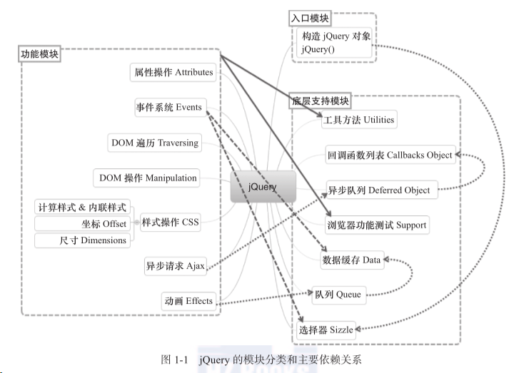

# jQuery 技术内幕

## 相关网址

开源地址：https://github.com/jquery/jquery

npm：[jquery - npm (npmjs.com)](https://www.npmjs.com/package/jquery)

官网：[jQuery](https://jquery.com/)

中文文档：

- [jQuery API 中文文档 | jQuery API 中文在线手册 | jquery api 下载 | jquery api chm (cuishifeng.cn)](https://jquery.cuishifeng.cn/)
- [jQuery API 中文文档 | jQuery 中文网 (jquery123.com)](https://www.jquery123.com/)
- [Jquery 官方文档 |官方教程|Jquery 官方文档 API 中文手册|Jquery 官方文档参考文档\_w3cschool](https://www.w3cschool.cn/jquery/dict)

## jQuery 整体架构

### jQuery 的实现原理

- (function(window, undefined) {})(window);
- jQuery 利用 JS 函数作用域的特性，采用立即调用表达式包裹了自身，解决命名空间和变量污染问题
- window.jQuery = window.$ = jQuery;
- 在闭包当中将 jQuery 和 $ 绑定到 window 上，从而将 jQuery 和 $ 暴露为全局变量

### 零、图例架构

#### 1、设计理念

jQuery 的理念就是“写更少的代码，做更多的事”，而且做到代码的高度兼容性。

#### 2、总体架构

大致可以分为三个部分：构造模块，底层支持模块和功能模块。




### 一、自调用函数

jQuery 整体架构：

```js
(function (global, factory) {})(
	typeof window !== "undefined" ? window : this,
	function (window, noGlobal) {}
);
```

代码分析：jQuery 的所有代码都被包含在一个立即执行的匿名函数这种代码可以称为“自调用函数”，上述代码可以简化为

```js
(function (形参global, 形参factory) {})(实参a, 实参b);
```

#### 匿名函数的作用：

通过创建一个自调用匿名函数，创建了一个特殊的函数作用域，该作用域的代码不会和已有的同名函数、方法和变量以及第三方库冲突。任何 JavaScript 库和框架所必须具备的功能：自己的代码不会受到其他代码（其他 js 库或框架）的干扰，并且自己的代码不会污染或破坏全局变量以至于影响其他代码。

匿名函数的常见写法（大概有十种或更多，我们只选择有代表性的两种）：

#### 1、jQuery 完整版使用的写法

```js
(function () {
	//......
})();
```

#### 2、jQuery 压缩版的写法

```js
!(function () {
	//......
})();
```

**注意：在匿名函数之前或之后最好加上“;”，否则有可能抛出异常**

##### 代码详解：

##### 2.1、实参 a： typeof window !== "undefined" ? window : this, 用于判断当前环境是否支持 window,支持就使用 window，否则就使用 this。

作用：通过传入 window 对象，可以使 window 对象变为局部变量（即把函数参数作为局部变量使用），这样当在 jQuery 代码块中访问 window 对象是，不需要讲作用域链回退到顶层作用域，从而更改地访问 window 对象，另外，将 window 对象作为参数传入，可以在压缩代码中进行优化，例如在 jQuery v3.3.1 压缩版中：

```js
!(function (e, t) {})();
```

形参 global 变成 e,factory 变成 t。

##### 2.2、实参 b：function( window, noGlobal ) {}，里面存放的是 jQuery 的功能函数。

函数中形参 noGlobal 的作用是：模块化时，不设置全局。在实参 b 里面，定义了一个 jQuery 变量，它是一个方法，执行后返回一个新 jQuery 对象。在"window.jQuery = window.$ = jQuery"中会让 window.jQuery 和 window.$两个全局变量引用这个 jQuery 方法。

```js
if` `( !noGlobal ) {``  ``window.jQuery = window.$ = jQuery;``}
```

##### 2.3、匿名函数解析：

```js
 function( global, factory ) {
    "use strict"; //执行JavaScript严格模式
    if ( typeof module === "object" && typeof module.exports === "object" ) {　　//module和module.exports是node.js中创建模块的方法，如果条件成立则执行下列代码兼容node.js,通过factory中间转换使jQuery各个函数功能通过node.js建立模块的方法给建立起来，否则直接执行factory函数。
        module.exports = global.document ?　　//判断当前环境是否支持window.document,
            factory( global, true ) :　　//支持的话直接执行factory()函数
            function( w ) {　　//否则执行函数，报告当前环境不适用jQuery，但是最后仍然返回factory（）函数
                if ( !w.document ) {
                    throw new Error( "jQuery requires a window with a document" );
                }
                return factory( w );
            };
    } else {
        factory( global );
    }
}
```

##### 2.4、 jQuery 代码的总体结构

```js
var version = "3.3.1",
	jQuery = function (selector, context) {
		//构造jQuery对象
		return new jQuery.fn.init(selector, context);
	};
```

### 二、jQuery 无 new 构建实例 以及 共享原型设计

结构如下：

```js
(function (root) {
	var jQuery = function () {
		return new jQuery.prototype.init();
	};
	jQuery.prototype = {
		init: function () {},
		css: function () {},
	};
	jQuery.prototype.init.prototype = jQuery.prototype;
	root.$ = root.jQuery = jQuery;
})(this);
```

> 值得注意：
>
> 1. 以上就是 jQuery 最基本的架构了
> 2. jQuery 返回的是 init 属性，而不是 new 一个对象返回
> 3. 如果返回的是一个 new 对象
>
> ```js
> (function (root) {
> 	var jQuery = function () {
> 		return new jQuery();
> 	};
> })(this);
> ```
>
> 这样就是形成死循环,所以 jQuery 就想出了一个共享原型的设计
>
> 1. `jQuery.prototype.init.prototype = jQuery.prototype;`这个就是共享原型设计

#### jQuery.fn 的 init 方法返回的 this 指的是什么对象

jQuery.fn 的 init 方法 返回的 this 就是 jQuery 对象

用户使用 jQuery() 或 $() 即可初始化 jQuery 对象，不需要动态的去调用 init 方法

### 三、extend 源码解析

#### 1. extend 的使用方法

> - 给任意对象扩充
>   `var obj = $.extend({},{name:"毛毛"}) eg:obj.name`
> - 给 jQuery 本身扩充方法和对象
>   `$.extend({work:function(){ }}) eg:$.work()`
> - 也可以使用$.fn来扩充 ,对jQuery的prototype进行扩充
>    `$.fn.extend({type:"小动物"}) eg:$().type`

#### 2. 为什么$.extend和$.fn.extend 都可以扩充对象

只需赋一下值就行了

```js
(function (root) {
	var jQuery = function () {
		return new jQuery.prototype.init();
	};
	jQuery.fn = jQuery.prototype = {
		init: function () {},
		css: function () {},
	};

	//extend
	jQuery.fn.extend = jQuery.extend = function () {};

	//共享原型对象
	jQuery.fn.init.prototype = jQuery.fn;
	root.$ = root.jQuery = jQuery;
})(this);
```

> 只需要`jQuery.fn = jQuery.prototype`就可以实现$.fn与$相同的功效了，唯一不同的是$.fn代表的是jQuery.prototype，而$代表的是 jQuery

##### jQuery.extend 与 jQuery.fn.extend 的区别

- $.fn.extend() 和 $.extend() 是 jQuery 为扩展插件提拱了两个方法
- $.extend(object) ; // 为 jQuery 添加“静态方法”（工具方法）

```js
$.extend({
	min: function (a, b) {
		return a < b ? a : b;
	},
	max: function (a, b) {
		return a > b ? a : b;
	},
});
$.min(2, 3); // 2
$.max(4, 5); // 5
```

$.extend([true,] targetObject, object1[, object2]); // 对 targt 对象进行扩展

```js
var settings = { validate: false, limit: 5 };
var options = { validate: true, name: "bar" };
$.extend(settings, options); // 注意：不支持第一个参数传 false
// settings == {validate:true, limit:5, name:"bar"}
```

$.fn.extend(json) ; // 为 jQuery 添加“成员函数”（实例方法）

```js
$.fn.extend({
	alertValue: function () {
		$(this).click(function () {
			alert($(this).val());
		});
	},
});

$("#email").alertValue();
```

#### 3. 利用 extend 对 jQuery 或者任意对象扩展

> 思路：获取 extend 中的参数，判断参数个数，如果参数只有一个对象，则就是给 jQuery 本身扩展；如果有不止一个对象，则将扩展参数赋值给第一个对象，实现给任意对象扩展。

代码如下：

```js
jQuery.fn.extend = jQuery.extend = function () {
	var target = arguments[0] || {};
	var length = arguments.length;
	var i = 1;
	var option, name;
	if (typeof target !== "object") {
		target = {};
	}
	//参数个数，只有一个就是给jQuery本身扩充
	if (length === i) {
		target = this;
		i--;
	}
	//拷贝参数给要赋值的对象（这里是浅拷贝）
	for (; i < length; i++) {
		//将参数赋值给target
		if ((option = arguments[i] != null)) {
			for (name in option) {
				target[name] = option[name];
			}
		}
	}
	return target;
};
```

> 到此结束，就实现了对 jQuery 本身或者给任意对象扩展，但是这里用的是浅拷贝，不是深拷贝

#### 4.浅拷贝？深拷贝？

> 简单说，就是浅拷贝只是从**表面上进行了复制替换**，深拷贝则相当于**深度遍历之后进行了复制替换**

举个例行：

```js
var a = { name: "apple", other: { work: "Doctor" } };
var b = { other: { like: "basketball" } };
```

将上述 b 的属性拷贝到 a 上
浅拷贝：
`a = {name:'apple',other:{like:'basketball'}}`
深拷贝：
`a = {name:'apple',other:{work:'Doctor',like:'basketball'}}`

##### jQuery 的属性拷⻉(extend)的实现原理是什么，如何实现深拷⻉

- 浅拷⻉（只复制一份原始对象的引用） var newObject = $.extend({}, oldObject);
- 深拷⻉（对原始对象属性所引用的对象进行进行递归拷⻉） var newObject =
  $.extend(true, {}, oldObject);

#### 5.优化一下，将浅拷贝替换成深拷贝

> 在 jQuery 中如果第一个参数设置为 true，则默认进行深拷贝，如果设置为 false 或者不写则默认是浅拷贝
> `var obj = $.extend({},{name:"毛毛"})`这是浅拷贝
> `var obj = $.extend(true,{},{name:"毛毛"})`这是深拷贝

实现思路：就是第 3 节的代码块中，对参数判断时，对第一个参数判断是 true 还是 false，如果为 false，后面属性遍历不变。如果是 true，后面属性遍历需要改为深拷贝的遍历。

```js
jQuery.fn.extend = jQuery.extend = function () {
	var target = arguments[0] || {};
	var length = arguments.length;
	var i = 1;
	var deep = false; //确定是要浅拷贝还是深拷贝
	var option, name, copy, src, copyIsArray, clone;
	//如果深拷贝，target是第二个参数，从第三个参数开始扩展
	if (typeof target === "boolean") {
		deep = target;
		target = arguments[1];
		i = 2;
	}
	if (typeof target !== "object") {
		target = {};
	}
	//如果没有指定扩展对象，则默认是jQuery本身，参数从i-1开始
	if (length === i) {
		target = this;
		i--;
	}
	//浅拷贝  深拷贝
	for (; i < length; i++) {
		if ((option = arguments[i]) != null) {
			for (name in option) {
				copy = option[name];
				src = target[name];
				//深拷贝
				if (
					deep &&
					(jQuery.isPlainObject(copy) || (copyIsArray = jQuery.isArray(copy)))
				) {
					//确保要传入的参数是数组或者对象
					if (copyIsArray) {
						copyIsArray = false;
						//深拷贝精髓
						clone = src && jQuery.isArray(src) ? src : [];
					} else {
						clone = src && jQuery.isPlainObject(src) ? src : {};
					}
					//递归深度遍历
					target[name] = jQuery.extend(deep, clone, copy);
					//浅拷贝
				} else if (copy != undefined) {
					target[name] = copy;
				}
			}
		}
	}
	return target;
};
```

> 需要注意：
>
> 1. jQuery.isPlainObject 和 jQuery.isArray 都只是用 jQuery 扩充的类型判断，不需要太在意
> 2. 深拷贝中有两处精髓
>    `clone = src && jQuery.isArray(src) ? src : [];` > `clone = src && jQuery.isPlainObject(src) ? src : {};`
>    这个就是实现深拷贝的精髓了
> 3. `target[name] = jQuery.extend(deep, clone, copy);`这个采用了递归的方式，也就是上面说的深度遍历的方式拷贝了所有的属性
> 4. 有时候想不明白，就举个例子调试着跑一遍，一步一步跑完了就明白了。
>    例如：
>    `var a = {} , res = {name:'max',list:{age:10}}` > `$.extend(true,a,res)`
>    这个就是给空对象 a 扩展对象 res
>    ①a.name 没有值，赋值为 a.name={}
>    ②a.name 浅拷贝赋值为 max
>    ③a.list 没有值，赋值为 a.list = {}
>    ④a.list.age 没有值，赋值为 a.list.age = {}
>    ⑤a.list.age 浅拷贝，赋值为 a.list.age = 10
>    ⑥ 扩展结束

#### 6.jQuery 的队列是如何实现的

- jQuery 核⼼中有一组队列控制方法，由 queue()/dequeue()/clearQueue() 三个方法组成。
- 主要应用于 animate() ， ajax ，其他要按时间顺序执行的事件中

```js
var func1 = function () {
	alert("事件1");
};
var func2 = function () {
	alert("事件2");
};
var func3 = function () {
	alert("事件3");
};
var func4 = function () {
	alert("事件4");
};

// 入栈队列事件
$("#box").queue("queue1", func1); // push func1 to queue1
$("#box").queue("queue1", func2); // push func2 to queue1
// 替换队列事件
$("#box").queue("queue1", []); // delete queue1 with empty array
$("#box").queue("queue1", [func3, func4]); // replace queue1
// 获取队列事件（返回一个函数数组）
$("#box").queue("queue1"); // [func3(), func4()]
// 出栈队列事件并执行
$("#box").dequeue("queue1"); // return func3 and do func3
$("#box").dequeue("queue1"); // return func4 and do func4
// 清空整个队列
$("#box").clearQueue("queue1"); // delete queue1 with clearQueue
```

#### 7.完整的代码

```js
(function (root) {
	var jQuery = function () {
		return new jQuery.prototype.init();
	};
	jQuery.fn = jQuery.prototype = {
		init: function () {},
		css: function () {},
	};

	// extend
	jQuery.fn.extend = jQuery.extend = function () {
		var target = arguments[0] || {};
		var length = arguments.length;
		var i = 1;
		var deep = false;
		var option, name, copy, src, copyIsArray, clone;
		if (typeof target === "boolean") {
			deep = target;
			target = arguments[1];
			i = 2;
		}
		if (typeof target !== "object") {
			target = {};
		}
		// 参数的个数 1
		if (length === i) {
			target = this;
			i--;
		}

		// 浅拷贝  深拷贝
		for (; i < length; i++) {
			if ((option = arguments[i]) != null) {
				for (name in option) {
					copy = option[name];
					src = target[name];
					if (
						deep &&
						(jQuery.isPlainObject(copy) || (copyIsArray = jQuery.isArray(copy)))
					) {
						if (copyIsArray) {
							copyIsArray = false;
							clone = src && jQuery.isArray(src) ? src : [];
						} else {
							clone = src && jQuery.isPlainObject(src) ? src : {};
						}
						target[name] = jQuery.extend(deep, clone, copy);
					} else if (copy != undefined) {
						target[name] = copy;
					}
				}
			}
		}
		return target;
	};

	// 共享原型对象
	jQuery.fn.init.prototype = jQuery.fn;
	jQuery.extend({
		// 类型检测
		isPlainObject: function (obj) {
			return toString.call(obj) === "[object Object]";
		},
		isArray: function (obj) {
			return toString.call(obj) === "[object Array]";
		},
	});
	root.$ = root.jQuery = jQuery;
})(this);
```

### jQuery 中的 bind(), live(), delegate(), on()的区别

- bind() 直接绑定在目标元素上
- live() 通过冒泡传播事件，默认 document 上，支持动态数据
- delegate() 更精确的小范围使用事件代理，性能优于 live
- on() 是最新的 1.9 版本整合了之前的三种方式的新事件绑定机制

### 自定义事件

事件即“发布/订阅”模式，自定义事件即“消息发布”，事件的监听即“订阅”

JS 原生支持自定义事件，示例：

```js
// 创建事件
document.createEvent(type);
// 初始化事件
event.initEvent(eventType, canBubble, prevent);
// 监听事件
target.addEventListener("dataavailable", handler, false);
// 触发事件
target.dispatchEvent(e);
```

jQuery 里的 fire 函数用于调用 jQuery 自定义事件列表中的事件

### jQuery 一个对象可以同时绑定多个事件，这是如何实现的

```js
$("#btn").on("mouseover mouseout", func);

$("#btn").on({
	mouseover: func1,
	mouseout: func2,
	click: func3,
});
```

### 针对 jQuery 的优化方法

- 缓存频繁操作 DOM 对象
- 尽量使用 id 选择器代替 class 选择器
- 总是从 #id 选择器来继承
- 尽量使用链式操作
- 使用时间委托 on 绑定事件
- 采用 jQuery 的内部函数 data() 来存储数据
- 使用最新版本的 jQuery
