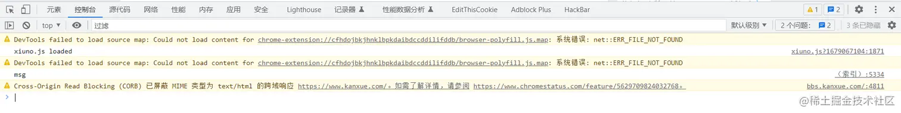

# TamperMonkey 油猴插件开发

[js 逆向-你要学会偷懒「自用油猴脚本」 (qq.com)](https://mp.weixin.qq.com/s/Wqjfd-lo-T3vCfY6lRoc4A)

## 相关网站

官网首页：[首页 | Tampermonkey](https://www.tampermonkey.net/index.php)

搜索脚本：[用户脚本 | Tampermonkey](https://www.tampermonkey.net/scripts.php)

开发文档：[文档 | Tampermonkey](https://www.tampermonkey.net/documentation.php)

开发问题：[常问问题 | Tampermonkey](https://www.tampermonkey.net/faq.php)

油猴中文网：[油猴中文网 - 油猴脚本分享交流 (tampermonkey.net.cn)](https://bbs.tampermonkey.net.cn/)

油猴脚本列表：[用户脚本列表 - ScriptCat](https://scriptcat.org/zh-CN/search)

## 一、前言

**浏览器插件** 泛指 Tampermonkey, Violentmonkey, Greasemonkey 这类给页面注入 js 的浏览器扩展。

**支持浏览器**：Chrome、Microsoft、Edge、Firefox、Safari、Opera Next

「油猴脚本」是一段脚本代码，通过它可以让浏览器实现各种各样的扩展功能，和浏览器扩展的作用类似。 比如获去链接重定向、微博页面精简、去广告等，相当于给浏览器开了个挂，可以说是浏览器的辅助神器了！但浏览器扩展若要发布到 chrome 扩展市场，需要支付 5 美元，但「油猴脚本」可以随时随地发布，不需要支付任何费用费用。

通过在浏览器扩展在网页加载时注入特定的 js 达到更改页面布局效果等等一切 js 能做的事情。这些扩展也提供了一些网页没有的 api，使注入的 js 能突破网页默认的限制，实现其他的功能。

## 二、了解 Tampermonkey

早期浏览器脚本的执行机制：动态创建一个 script 元素插入到 document ，当脚本执行完毕后删除 script 元素。但是这种方式有几个缺陷：

1. 插入 script 标签时会触发 DOMNodeInserted 事件，如下：

```js
document.addEventListener（"DOMNodeInserted"，()=>{
  // ...
}，true）
```

1. 脚本封装的 GM_API 有泄露风险。可能会被恶意网页调用 GM_API 实现跨网页窃取数据。
2. 脚本可以可以通过 file:// 路径来发起请求，读取用户磁盘数据，但这也给恶意网页开了后门，一旦被反向注入会导致用户本地隐私数据泄密。

后面脚本新增了沙盒模式（iframe 方案/with+proxy 方案）进行重构，不再通过注入 script 元素的方式，也不会在宿主环境全局定义 GM_API。并引入了 **XPCNativeWrappers** 机制（返回了一个包装过的数据，这个数据是可以信任的，确保不会被网页进行恶意篡改）。

但是这个方案也不是完美的，也有一些问题：如在设置 onclick 回调函数的时候不可以直接进行赋值；在设置自定义属性的时候没有作用。这些都是因为可信任进程通信管道返回的是一个包装后的数据，而不是原来的数据本身，这时候我们只能使用 addEventListener 来进行添加 onclick 回调函数，使用 setAttribute 来设置自定义属性等等，这很繁琐。

为了妥协，Tampermonkey 提出了 **unsafewindows** ,它是原网页数据的一个映射，我们操纵它就相当于操纵原网页。注意：一旦使用了 unsafewindows，代表破坏了安全模型！并且 unsafewindows 的内容并不完全可信，需要谨慎处理！

默认情况下，脚本运行在沙盒环境下，此环境无法访问到前端 dom 。若声明 @grant none，那脚本就会被直接放在浏览器环境上下文中执行,这时脚本上下文（this）就是浏览器上下文（this）。这更加方便获取 dom 节点，但会导致 GM_API 无法使用。

**grant** 属性可用来申请 `GM_*` 函数和 **unsafeWindow** 权限。

- **none** 就是直接运行在前端页面中，此时脚本中的 this 指向宿主网页的 window 对象。
- **unsafeWindow** 和 `GM_*` 就是运行在沙盒环境，需要使用 **unsafeWindow** 去操作前端的元素。

常用头部信息

| 名称         | 描述                | 说明                                                                                    |
| ------------ | ------------------- | --------------------------------------------------------------------------------------- |
| @name        | 脚本名称            |                                                                                         |
| @namespace   | 脚本命名空间        |                                                                                         |
| @version     | 脚本版本            | 语义化版本规则                                                                          |
| @author      | 脚本作者            | -                                                                                       |
| @description | 脚本描述            | -                                                                                       |
| @include     | 脚本匹配地址        | 可以使用正则表达式/通配符 \*                                                            |
| @match       | 脚本匹配地址        | 允许使用通配符，更加严格                                                                |
| @exclude     | 排除脚本匹配地址    | -                                                                                       |
| @require     | 引入外部 JS 文件    | 加载并执行的 js 文件，如 UNPKG、[jsDelivr](https://www.jsdelivr.com/) 等 cdn 或本地资源 |
| @resource    | 预加载资源          | 将外部库保存成资源，可以在代码中通过 GM_getResourceURL 访问                             |
| @connect     | 获取网站访问权限    | 允许由 GM_xmlhttpRequest 检索的子域                                                     |
| @run-at      | 脚本运行时机        | 可选项：document-start、body、end、idle、menu                                           |
| @grant       | 申请脚本环境/GM_API | none 表示直接注入宿主环境，unsafeWindow 表示沙盒环境，其他权限由 API 名称指定           |
| @noframes    | 脚本标记            | 标记使脚本在主页上运行，但不在 iframe 上运行                                            |

下面列举部分常用 GM_API，其它可见：[文档 | Tampermonkey](https://www.tampermonkey.net/documentation.php#meta:grant)

| 名称                         | 描述                                                                             |
| ---------------------------- | -------------------------------------------------------------------------------- |
| GM_addStyle                  | 将给定样式添加到文档中并返回注入的样式元素                                       |
| GM_addElement                | 创建指定的 HTML 元素，应用所有给定的属性并返回注入的 HTML 元素，此功能是实验性的 |
| GM_setValue                  | 存储一个给定名称的值                                                             |
| GM_getValue                  | 从 GM_setValue 存储的名称中获取值                                                |
| GM_deleteValue               | 将 GM_setValue 存储的名称删除                                                    |
| GM_listValues                | 列出存储的所有名称                                                               |
| GM_addValueChangeListener    | 侦听 GM_setValue 储存名称的值的更改并返回更改前和后的值                          |
| GM_removeValueChangeListener | 删除由 GM_addValueChangeListener 添加的侦听器                                    |
| GM_log                       | 向控制台记录消息                                                                 |
| GM_getResourceText           | 获取由 @resource 预加载的资源                                                    |
| GM_getResourceURL            | 获取由 @resource 预加载的 Base64 编码 URI                                        |
| GM_registerMenuCommand       | 注册一个菜单，在运行此脚本的页面的中显示                                         |
| GM_unregisterMenuCommand     | 取消由 GM_registerMenuCommand 注册的菜单                                         |
| GM_openInTab                 | 通过给定的 URL 打开一个新标签页                                                  |
| GM_xmlhttpRequest            | 通过脚本发送的 XHR 请求                                                          |
| GM_download                  | 通过给定的 URL 下载文件到本地                                                    |
| GM_saveTab                   | 保存选项卡对象，生命周期为选项卡的打开->关闭                                     |
| GM_getTab                    | 获取选项卡对象，生命周期为选项卡的打开->关闭                                     |
| GM_getTabs                   | 获取所有选项卡对象，生命周期为选项卡的打开->关闭                                 |
| GM_notification              | 显示桌面通知                                                                     |
| GM_setClipboard              | 将数据复制到剪贴板                                                               |

## 三、工程化

最基础的开发方式是通过插件自带的在线编辑器开发，但有着诸多问题：只能写原生 js、没有代码提示、没有 js model ，只能通过 @require API 引入第三方库、没有工程化概念，复杂工程管理困难、没有模块热更新等。

第二种方式：通过脚本 `@require file:\C:\Users\userName\Desktop\tm_demo\xxx.user.js` 引用本地资源这种方式，配合 IDE ，如 vscode 开发，但这种只解决了部分问题，复杂项目依然难以维护。

第三种：是通过 [puppeteer](https://puppeteer.bootcss.com/)，加载 Tampermonkey 魔改插件，对插件进行了非侵入式 hook，并且起了个服务器跟浏览器的插件用 socket 通信，实现了文件的自动监控，授权修改，动态更新。原理可参考：[李恒道—尝试抹平 Tampermonkey 的 VSCode 开发体验](https://bbs.tampermonkey.net.cn/thread-6744-1-1.html)。

第四种：最常见的是通过 webpack/rollup/uglify-js/esbuild/vite 等构建工具，我选择了 [vite-plugin-monkey](https://github.com/lisonge/vite-plugin-monkey)，vite 相比 webpack 的优势在于：

- 明确区分了 开发/构建 模式
- 暴露了本地开发服务器的 api 供外部使用
- 更加轻量快速的热重载
- 支持中间件，用来生成中间桥接代码，无需每次生成文件或手动填写代码

具体可参考：[lisonge/vite-plugin-monkey：一个 vite 插件服务器和构建 your.user.js，用于 Tampermonkey、Violentmonkey、Greasemonkey、ScriptCat 等用户脚本引擎 (github.com)](https://github.com/lisonge/vite-plugin-monkey)

## 四、常见问题

### 1. 异步获取元素

获取 dom 节点时可能会出现元素延迟加载的问题，常见解决方案如下：

使用 settimeout 获取，缺点：实时性不足（需要等当前 tick），有性能损失

DOMNodeInserted 事件的性能也 不好

MutationObserver ，缺点：语法复杂

使用第三方库：如 [异步获取元素的脚本库 ElementGetter-油猴中文网 (tampermonkey.net.cn)](https://bbs.tampermonkey.net.cn/thread-2726-1-1.html) 等，

### 2. 存在 iframe 框架

存在某个网页通过 iframe 内嵌了其它网页需要注入，解决方案如下：

@match 匹配到脚本内部

在同域的情况下可以获取到 iframe 元素后通过 conetentWindow 属性访问 iframe 的作用域

### 3. 需要掌握的 JS API

MutationObserver 参考：[DOM 变动观察器（Mutation observer） (javascript.info)](https://zh.javascript.info/mutation-observer)

Proxy 参考：[Proxy 和 Reflect (javascript.info)](https://zh.javascript.info/proxy)

### 4. 需要知道的 CSS 知识点

需要知道：[CSS 选择器 - CSS：层叠样式表 | MDN (mozilla.org)](https://developer.mozilla.org/zh-CN/docs/Web/CSS/CSS_Selectors)

# 油猴脚本开发实战

参考文章合集：[油猴脚本 - 狂奔滴小马的专栏 - 掘金 (juejin.cn)](https://juejin.cn/column/7139154267742896165)

## 新建脚本

在脚本管理控制台，右上角的`+`添加按钮，新建一个脚本，默认会包含以下代码：


最上面的注释不能删除，Tampermonkey 就通过注释代码来配置脚本字段的

- `@match` 用来匹配注入脚本网址的 url 其中 \* 代表一个或者多个任意字符

  若要匹配 baidu 域名下的任意网页可以使用 `*://*.baidu.com/*`;

  若要匹配任意网址，可以使用`*://*/*`

- ` @require` 代表要注入的公用 JS 库

  比如要使用 jquery，可以使用以下代码

```js
// @require https://code.jquery.com/jquery-2.1.4.min.js
// @require tampermonkey://vendor/jquery.js
// @require tampermonkey://vendor/jszip/jszip.js
```

## CSDN 免登录复制

比如 CSDN 中代码块复制必须要登录后才可以复制， 那么我们就可以写一个脚本，输入以下代码

```js
// ==UserScript==
// @name         CSDN 免登录复制
// @version      0.1
// @description  try to take over the world!
// @match        *://*.csdn.net/*
// @require      tampermonkey://vendor/jquery.js
// @grant        none
// ==/UserScript==

(function () {
	"use strict";
	$("pre,code").css("user-select", "auto");
})();
```

保存后，重新刷新浏览器，在右上角的扩展标志中会向上一个`1`, 说明有一个扩展作用于这个网页，脚本注入成功。


其实就是一行代码，CSDN 的默认代码块的样式是 `user-select: none;`，不能复制，改成 `auto` 后就可以复制了。

## 添加样式

首先需要在最上面的注释中开启权限 `@grant` `GM_addStyle`，然后就可以使用内置的 `GM_addStyle` 方法了。

```js
// ==UserScript==
// @grant        GM_addStyle
// ==/UserScript==
GM_addStyle(
	`pre,code{user-select:auto !important}.signin{display: none !important;}`
);
```

这样也可以解决 CSDN 代码块不能复制的问题，顺便将代码块后面的`登录后复制`按钮隐藏；

当然我们也可以使用 JS 自己实现

```js
const heads = document.querySelector("head");
const style = document.createElement("style");
style.setAttribute("type", "text/css");
style.innerHTML = `pre,code{user-select:auto !important}.signin{display: none !important;}`;
heads.append(style);
```

## 网络请求

一般前端脚本都是修改前端网页内容，若复杂一点的脚本，可能会涉及到动态数据，比如我们在脚本中直接写`fetch` 请求，这时浏览器肯定会阻止请求，因为跨域了。

我们需要使用脚本的内置方法

```js
// ==UserScript==
// @grant        GM_xmlhttpRequest
// ==/UserScript==
GM_xmlhttpRequest({
	headers: {
		"content-type": "application/json",
	},
	responseType: "json",
	url: "https://api.juejin.cn/recommend_api/v1/article/recommend_cate_feed",
	data: '{"id_type":2,"sort_type":200,"cate_id":"6809637767543259144","cursor":"0","limit":20}',
	method: "POST",
	onreadystatechange: (res) => {
		if (res.readyState === 4) {
			console.log(res.response);
		}
	},
});
```

在最上面的注释中开启权限 `@grant` `GM_xmlhttpRequest`，然后就可以使用内置的 `GM_xmlhttpRequest` 方法了。

比如把接口换成有道翻译的 api。通过 ` document.getSelection().toString();` 获取网页中的选中文本，便可以实现一个划词翻译油猴插件了。 

## 右键搜索

接下来我们将结合右键菜单和打开新窗口的内置函数，实现一个快捷搜索的功能， 同样内置函数需要在最上面的注释中加入权限，代码如下：

```js
// ==UserScript==
// @grant        GM_registerMenuCommand
// @grant        GM_openInTab
// ==/UserScript==

GM_registerMenuCommand("GitHub 搜索", function () {
	const str = document.getSelection().toString();
	if (str) {
		GM_openInTab(`https://github.com/search?q=${str}`, { active: true });
	}
});

GM_registerMenuCommand("NPM 搜索", function () {
	const str = document.getSelection().toString();
	if (str) {
		GM_openInTab(`https://www.npmjs.com/search?q=${str}`, { active: true });
	}
});
```


这样就有了快捷菜单搜索的功能，只是操作挂着 3 级目录下，操作有些不方便。

以上简单介绍了脚本的开发以及一些简单实现，但这个脚本我们只能在自己电脑使用，若想让其他小伙伴也能够使用，我们需要将脚本发布到脚本脚本市场，供其他小伙伴下载。

## 脚本发布

一个非常流行的脚本共享网站便是 [greasyfork.org](https://greasyfork.org/zh-CN)，有着非常丰富的脚本，并且支持多语言。


注册账号后，点击右上角的`用户名`，然后点击控制台中的`发布你编写的脚本`，贴入你写的脚本代码，便可以发布成功！将发布后的链接发送个小伙伴，就可以让他们安装你写的脚本了，你也可以在上面根据匹配域名搜索相关脚本，看大神们是如何来写脚本的。

## 前端工程化

现代前端开发已经离不开前端框架，若直接使用原生 JS 让我们写复杂的功能，难免会让我们崩溃，比如需要在 JS 中写 CSS，一不小心写错就会让整个脚本无法执行。所以我们可以使用 webpack 来构建一个工程化的项目。 并且使用 Typescript 和 eslint ，让我们的前端工程健全。

下面是 `webpack.config.js`

```js
const webpack = require("webpack");
const fs = require("fs");
const path = require("path");

const config = {
	entry: "./src/index.tsx",

	output: {
		clean: true,
		iife: true,
		path: path.resolve(__dirname, "dist"),
		filename: "bundle.js",
	},
	devServer: {
		static: {
			directory: path.join(__dirname, "public"),
		},
		compress: true,
		port: 9000,
	},
	// 脚本发布后，会被举报，不允许压缩
	optimization: {
		minimize: false,
	},
	module: {
		rules: [
			{
				test: /\.(js|jsx)$/,
				use: "babel-loader",
				exclude: /node_modules/,
			},
			{
				test: /\.css$/,
				use: [
					{
						loader: "style-loader",
						options: {},
					},
					{ loader: "css-loader" },
				],
			},
			{
				test: /\.ts(x)?$/,
				loader: "ts-loader",
				exclude: /node_modules/,
			},
		],
	},
	plugins: [new BannerPlugin()],
	resolve: {
		extensions: [".tsx", ".ts", ".js"],
	},
};

module.exports = config;
```

使用 `style-loader`，在 webpack 打包后，会自动将 css 样式通过 style 标签插入到 head 中，这样就做到了 css 和 js 分离。 这里有个问题，就是油猴脚本特有的代码前置注释 `==UserScript==`，在 webpack 打包后会被删除，所以我们得自己实现一个插件，将这段注释加回来。

```js
const ConcatSource = require("webpack-sources").ConcatSource;

/**
 * 添加前缀注释
 */
class BannerPlugin {
	apply(compiler) {
		let banner = "";
		const entryFile = compiler.options.entry.main.import[0];

		const res = fs.readFileSync(entryFile, "utf-8");
		const matched = res.match(
			/(\/\/\s==UserScript==)(?<content>(\n.+)+)(\n\/\/\s==\/UserScript==)/
		);
		if (matched && matched.groups.content) {
			banner =
				"// ==UserScript==" + matched.groups.content + "\n// ==/UserScript==\n";
		}
		compiler.hooks.emit.tap("BannerPlugin", (compilation) => {
			compilation.chunks.forEach((chunk) => {
				// 最终生成的文件的集合
				chunk.files.forEach((fileName) => {
					compilation.assets[fileName] = new ConcatSource(
						banner,
						compilation.assets[fileName]
					);
				});
			});
		});
	}
}
```

上述代码通过正则匹配 `==UserScript==` 之间的代码，并且将匹配的内容合并到了最后的代码 `chunk` 中。

## CICD

若我们每次打包后的 JS 都需要手动拷贝到 `greasyfork.org` 未免有些麻烦，得益于 `greasyfork.org` 有个自动发布的功能，我们可以配合 GitHub actions 来实现自动发布。

在项目文件夹下建立 `.github/workflows/build.yml`， 输入以下代码

```yml
name: GitHub Pages

on:
  push:
    branches:
      - main
  pull_request:

jobs:
  deploy:
    runs-on: ubuntu-20.04
    permissions:
      contents: write
    concurrency:
      group: ${{ github.workflow }}-${{ github.ref }}
    steps:
      - uses: actions/checkout@v3

      - name: Setup Node
        uses: actions/setup-node@v3
        with:
          node-version: "14"

      - name: Get yarn cache
        id: yarn-cache
        run: echo "::set-output name=dir::$(yarn cache dir)"

      - name: Cache dependencies
        uses: actions/cache@v2
        with:
          path: ${{ steps.yarn-cache.outputs.dir }}
          key: ${{ runner.os }}-yarn-${{ hashFiles('**/yarn.lock') }}
          restore-keys: |
            ${{ runner.os }}-yarn-

      - run: yarn install
      - run: yarn build

      - name: Deploy
        uses: peaceiris/actions-gh-pages@v3
        if: ${{ github.ref == 'refs/heads/main' }}
        with:
          github_token: ${{ secrets.GITHUB_TOKEN }}
          publish_dir: ./dist
```

当我们把代码提交到 Github ，就会自动触发 workflow ，依次执行 `yarn install` 、`yarn build` 并且自动将 `dist` 目录下的代码自动部署到 GitHub pages。

接下来我们复制 pages 中的 raw 源文件地址


贴入复制的源文件地址


- 设置脚本同步为自动
- 并且设置 webhook


复制这里对应的 webhook 地址和秘钥


在 GitHub 项目地址中添加 webhook

这样只要我们一旦提交代码， greasyfork.org 中的脚本便会自动更新最新版本。

以上所有配置整理在[tampermonkey-starter](https://maqi1520/tampermonkey-starter)中， 若你也想创建一个自己的脚本，可以直接 fork 项目，修改相关配置即可。

## 小结

本文简单介绍了油猴脚本开发步骤以及实现，结合 webpack 让脚本实现工程化，并且配合 Github action，让脚本实现自动化构建和部署。

但是若想要实现一些有用的脚本，还需要具备更多的知识，比如`JS逆向分析`等，若你有好的想法，赶快行动起来吧！

# 编写一个自动点击的油猴脚本

### 1. 缘起

最近逛学习网站的时候总是会弹出来各种莫名其妙的框框，十分苦恼之下，偶然间注意到了我浏览器右上角的一个神奇的插件，想起来过往种种用油猴刷英文视频的经历，突然想要自己编写一个油猴插件试一试，所以就有了这篇文章。

因为我是边学边做作品，所以肯定会有些地方写得不成熟，这是正常现象，不要大惊小怪，现在进入正题。

这里如何在浏览器里面安装油猴插件，因为太简单，就不多做介绍了。网上相关经验很多。

### 2. 油猴插件实现原理

油猴的原理，以我目前浅显的了解，就是在特定的玩野，执行特定的、编辑好的 js 脚本，从而实现包括但不限于去广告、实现自动签到、改变网站的布局等等，各种客户端的功能。由于这种脚本只是在客户端做手脚，所以对于网站运营商来说，几乎不会造成任何影响，所以目前应该也不用担心做这个会被送银手镯的问题。

### 3. 实现功能分析

目前的目标(要实现的功能)如下

Alpha 版:

- 去掉看雪论坛上面的升级正式会员的弹框(给发不了好文章的兄弟们带来福音)

Beta 版:

- 实现看雪论坛的自动签到

Release 1.0.0 版:

实现以上两种功能即可 Release。

### 4. 代码设计

然后就是整篇文章的主题部分了，那就是该怎么写这个脚本。

首先，这个油猴要写的是 js 的脚本，这就要求开发者要会一点前端的技术。起码得会一点 js，对前端有简单了解。

#### 4.1 创建脚本

打开控制面板，点击顶部导航栏最左侧的+号创建自己的脚本。


编辑器里面就是我们要写脚本的地方了，可以看到这里已经给出了一部分内容，下面是要实现功能得代码部分，上面是脚本的注释部分，油猴的注释会被解析出来，不同的注释代表着不同的含义。

关于这里各个注释的含义，这里借鉴一下，[别人的总结](https://blog.csdn.net/mukes/article/details/109727662)。

```js
// ==UserScript==
// @name         这里是你的编写的油猴脚本的名字
// @namespace    这个是命名空间；用来区分名称相同但是作者不同的用户脚本，一般都是写作者的个人网址，没有也可以写你的博客地址
// @version      0.1  这个是版本号
// @description  这个是功能描述，描述你的这个脚本是用来干嘛的
// @author       这个是作者的名字，比如我：mukes
// @match        这个是该脚本匹配的网址，支持通配符匹配
// @include		 这个也是该脚本匹配的网址，支持通配符匹配
// @exclude		 这个和 iclude 配合使用，排除匹配到的网址，优先于 include
// @grant        none
// ==/UserScript==
```

借由此，我们可以很容易地写出来自己的文件头

```js
// ==UserScript==
// @name         看雪一键签到
// @namespace    http://lyricpoem.cn/
// @version      Alpha
// @description  实现看雪论坛一键签到，以及去掉看雪的新手顶部弹框。
// @author       Lyr1cP03m
// @match        https://bbs.kanxue.com/
// @icon         data:image/gif;base64,R0lGODlhAQABAAAAACH5BAEKAAEALAAAAAABAAEAAAICTAEAOw==
// @grant        none
// ==/UserScript==

(function () {
	"use strict";

	// Your code here...
})();
```

#### 4.2 关闭弹框功能实现

接下来就是重中之重了，那就是代码的具体实现。这里我首先要实现的功能是关闭看雪论坛的新人弹框。

这个其实他既然设置了能点击右上角关闭弹框，我们直接抄下来他的关闭的代码就行了，事实证明，这个关闭弹框的功能并不难

```js
// 关闭弹框
$(".temporary_member_box").css("height", "0");
```

设置该盒子的 css height 为 0px 即可。

#### 4.3 实现自动签到

这个本来也挺简单的，我开始写的内容如下。

```js
// 自动签到  (使用改脚本会多访问一次`user-is_signin.htm`这个接口)
$.ajax({
	url: "user-is_signin.htm",
	function(code, message) {
		if (code == 1) {
			//查询到未签到的处理方式
			$(".signin").click();
			console.log("已一键签到*_*");
		} else if (code == 0) {
			// 查询到签过到了的处理方式
			var sign_html = `<p>${message}</p>`;
			$(".signin").html(sign_html);
			$(".signin").addClass("signin_over").removeClass("sign");
		}
	},
});
```

我尝试刷新了一下，但是并不起作用，简单看下控制台出现了新的 warnings，如下。



warning 内容为

Cross-Origin Read Blocking (CORB) 已屏蔽 MIME 类型为 text/html 的跨域响应 https://www.kanxue.com/。

如需了解详情，请参阅：https://www.chromestatus.com/feature/5629709824032768。

这个跨域请求问题油猴有内置的解决方案，解决后的脚本内容如下

```js
GM_xmlhttpRequest({
	method: "GET",
	url: "https://bbs.kanxue.com/user-is_signin.htm",
	onload: function (res) {
		if (res.code == 1) {
			//查询到未签到的处理方式
			$(".signin").click();
			console.log("[+]TemperMonkeyMessage 已一键签到*_*");
		} else if (res.code == 0) {
			// 查询到签过到了的处理方式
			console.log("[+]TemperMonkeyMessage 已签过到*_*");
			var sign_html = `<p>${res.message}</p>`;
			$(".signin").html(sign_html);
			$(".signin").addClass("signin_over").removeClass("sign");
		}
	},
});
```

但是问题显然还是没被解决，因为点击效果一直没成。

后来输出一下`console.log($(".signin"))`明白了。


原来是这个 class 对应了两个不同的按钮，油猴脚本这里需要指定要点击的按钮是第几个才行。

还是没解决，应该是油猴脚本的执行时机不对的问题，前端 js 的各种玄学问题。这里不具体研究了，发现其实直接加一个 setTimeout 就挺管用的。有可能是各种资源没加载完，不太懂，有懂得师傅可以解释一下。

#### 4.4 Alpha 版本的代码

```javascript
// ==UserScript==
// @name         看雪一键签到
// @namespace    http://lyricpoem.cn/
// @version      Alpha
// @description  实现看雪论坛一键签到，以及去掉看雪的新手顶部弹框。
// @author       Lyr1cP03m
// @match        https://bbs.kanxue.com/
// @icon         data:image/gif;base64,R0lGODlhAQABAAAAACH5BAEKAAEALAAAAAABAAEAAAICTAEAOw==
// @grant        GM_xmlhttpRequest
// ==/UserScript==

(function () {
	"use strict";

	// 关闭弹框
	$(".temporary_member_box").css("height", "0");
	// 自动签到  (使用改脚本会多访问一次`user-is_signin.htm`这个接口)
	GM_xmlhttpRequest({
		method: "GET",
		url: "https://bbs.kanxue.com/user-is_signin.htm",
		onload: function (res) {
			res = eval("(" + res.response + ")");
			console.log(res);
			if (res.code == "1") {
				//查询到未签到的处理方式
				setTimeout(function () {
					$(".signin").click();
				}, 1000);
				console.log("[+]TemperMonkeyMessage 已一键签到*_*");
			} else if (res.code == "0") {
				// 查询到签过到了的处理方式
				console.log("[+]TemperMonkeyMessage 已签过到*_*");
				var sign_html = `<span>${res.message}</span>`;
				$(".signin").html(sign_html);
				$(".signin").attr("disabled", "true"); //签过到后禁用按钮。
				$(".signin").addClass("signin_over").removeClass("sign");
			}
		},
	});
})();
```

### 5. 发布自己的脚本

接下来就是最后一步了，那就是发布自己的脚本到`GreasyFork (油叉)`了。首先在[油叉](https://greasyfork.org/zh-CN)上登录。


在个人中心里面发布自己的脚本，但是这里新用户是不能发布脚本的，可以先上传到 GitHub 上面，等几天再发布。

GitHub：[GreasyFork-Scripts](https://github.com/m4xlmum/GreasyFork-Scripts)

# 手机上用油猴实现自动抢购某台

要在移动端使用油猴脚本实现自动化操作（比如抢购茅台）是有一定限制的，因为主流的移动浏览器（如 Chrome 和 Safari）通常不支持油猴脚本。

不过，有一个方法可以绕过这一限制，那就是使用支持用户脚本的移动浏览器。

对于 Android 用户，可以考虑使用如 **Kiwi Browser** 或 **Yandex Browser**，这些浏览器基于 Chromium，支持 Chrome 扩展，包括油猴（Tampermonkey）。

### 步骤 1: 在 Android 设备上安装支持扩展的浏览器

1. 下载并安装 Kiwi Browser 或 Yandex Browser:

- 打开 Google Play Store。

- 搜索 “Kiwi Browser” 或 “Yandex Browser”。

- 选择浏览器并安装。

### 步骤 2: 安装 Tampermonkey 扩展

1. 在安装好的浏览器中，打开扩展页面（通常在菜单中有“扩展”选项）。
2. 搜索 Tampermonkey 官网或在 Google 上搜索 Tampermonkey 的 Chrome Web Store 页面，下载并安装 Tampermonkey 扩展。

### 步骤 3: 创建并编辑油猴脚本

1. 点击浏览器中 Tampermonkey 图标，选择“添加新脚本”。
2. 在脚本编辑器中，删除默认模板，粘贴以下示例脚本：

```js
// ==UserScript==
// @name         自动购买茅台移动版
// @namespace    http://tampermonkey.net/
// @version      0.1
// @description  自动化在移动端天猫购买茅台酒
// @author       You
// @match        *://*/*
// @grant        none
// @run-at       document-end
// ==/UserScript==

(function () {
	"use strict";

	// 每次页面加载后检查是否为茅台的购买页面
	if (window.location.href.includes("chaoshi.detail.tmall.com")) {
		setTimeout(() => {
			// 尝试找到购买按钮并点击
			const buyButton = document.querySelector("button.buy"); // 根据实际页面调整选择器
			if (buyButton) {
				buyButton.click();
			} else {
				console.log("购买按钮未找到");
			}
		}, 3000); // 延迟3秒钟执行，等待页面加载完成
	}
})();
```

3. 修改脚本中的 `@match` 以适应实际的 URL，修改选择器以适应实际的按钮。

### 步骤 4: 测试和调整脚本

- 打开目标购买页面，观察脚本是否能正确执行。

- 根据需要调整延迟时间或按钮选择器。

### **注意事项**

- 自动化购买脚本可能违反天猫或其他平台的服务条款，使用时需谨慎。

- 确保脚本不会无意中触发不需要的购买。

- 该方法可能不适用于 iOS 设备，因为 iOS 的浏览器架构限制了此类扩展。

通过这种方法，您可以在支持扩展的移动浏览器上实现类似 PC 浏览器油猴脚本的功能，从而在移动设备上自动化一些操作。这为移动端网页自动化提供了一种可行的解决方案。

### 做些优化

对于在移动端使用油猴脚本进行自动化的场景，以下优化帮助您更安全、更有效地实施自动化策略：

#### 1.监测和调试

- 调试脚本：使用浏览器的开发者工具进行调试，检查是否有 JavaScript 错误或者查看网络请求等。虽然在移动设备上进行调试比较复杂，但使用基于 Chromium 的浏览器如 Kiwi 或 Yandex 可以让这个过程更接近桌面体验。

- 日志记录：在你的脚本中增加适当的日志记录，这可以帮助你理解脚本在实际环境中的行为，尤其是在处理异步事件和响应时。

#### 2.用户界面友好性

- 反馈机制：确保脚本在执行操作时有清晰的用户反馈。例如，当点击按钮或完成购买时，可以显示一些提示信息，让用户知道脚本已经执行。

- 错误处理：增强脚本的错误处理能力，确保在遇到意外情况（如元素未找到、网络请求失败等）时，脚本能给出错误提示并优雅地终止或重试。

#### 3.性能考虑

- 避免过度轮询：使用`setTimeout`或`setInterval`进行元素检查或操作时，设置合理的间隔时间，避免对设备性能造成影响或增加不必要的服务器请求。

- 资源清理：确保脚本在完成任务后能正确清理已占用的资源，如关闭不再需要的定时器，删除不必要的全局变量等。

# 开源插件

[xxxily/h5player：本软件支持所有音视频网站，如 TikTok、YouTube、哔哩哔哩、TED、Instagram、Twitter 等。功能包括：可变播放速度、截屏、视频下载、自定义设置、扩展等，为您提供愉悦的在线音视频播放体验。 (github.com)](https://github.com/xxxily/h5player)

[CodFrm/cxmooc-tools: 一个 超星(学习通)/智慧树(知到)/中国大学mooc 学习工具,火狐,谷歌,油猴支持.全自动任务,视频倍速秒过,作业考试题库,验证码自动打码(੧ᐛ੭挂科模式,启动) (github.com)](https://github.com/CodFrm/cxmooc-tools)

脚本增强视频播放功能，兼容所有H5视频网站，如：Bilibili、TikTok、腾讯视频、优酷、爱奇艺、西瓜视频、YouTube、微博视频、知乎视频、搜狐视频、网易公开课、百度网盘、阿里云Disk、TED、Instagram、Twitter 等等。

脚本支持键盘快捷键全程控制，支持播放速度控制、视频截图、画中画、网页全屏、调节亮度、饱和度、对比度、增强的自定义配置可用性等功能，为您提供愉悦的在线视频播放体验经验：https://github.com/xxxily/h5player
