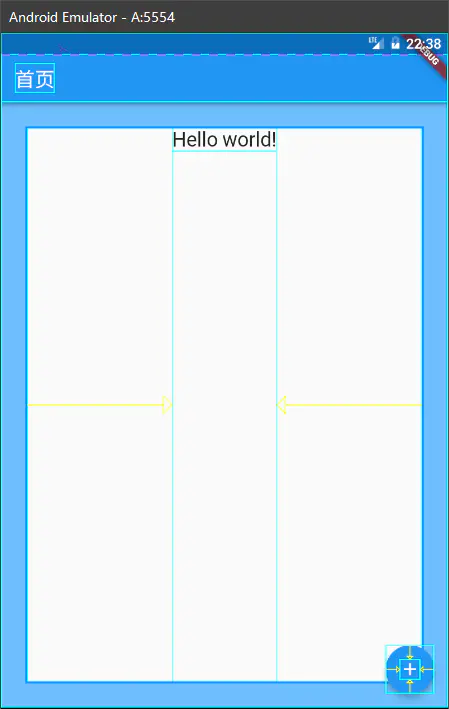
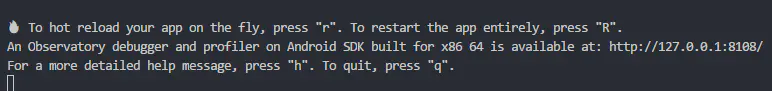
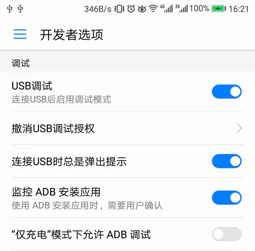

# Flutter 开发环境配置

Flutter 官网的 Flutter SDK：[Flutter SDK releases | Flutter](https://docs.flutter.dev/development/tools/sdk/releases)

官网环境安装教程：[视窗安装 |扑动 (flutter.dev)](https://docs.flutter.dev/get-started/install/windows#android-setup)

**中文官网 文档**：[Flutter: 为所有屏幕创造精彩 - Flutter 中文开发者网站 - Flutter](https://flutter.cn/)

## 一、Windows 系统环境准备

### 1.安装 Flutter SDK

官网：[Flutter - Build apps for any screen](https://flutter.dev/)

1.Flutter SDK 下载后，可以解压到自己安装 java sdk 的文件夹，或者自定义一个文件夹，不要将 flutter 安装到需要一些高权限的路径，如：`C:\Program Files\`

- Flutter SDK 下载地址：[Flutter SDK releases | Flutter](https://docs.flutter.dev/development/tools/sdk/releases)

  2.配置环境变量：进入 bin 目录，复制路径，在环境变量 `path` 新建

- 如：`D:\flutter\bin`

  3.检测安装是否通过

```bash
flutter
# 或
# 检测依赖项和未安装项
flutter doctor
```

> flutter 基于 dart 语言，但**Dart SDK**已经在打包在**Flutter SDK**里了，没有必要单独安装**Dart**；
>
> Dart SDK 官网下载：[Archive | Dart](https://dart.dev/get-dart/archive)。

如果没有通过的话，按报打 X 的每一个都解决完，才能运行 flutter 项目

同意全部许可协议 :

- 按照上述提示 , 执行：`flutter doctor --android-licenses` 命令
- 同意全部许可协议 , 即可检测通过 ;

  4.配置项目依赖下载链接的系统变量

由于在国内访问 Flutter 有时可能会受到限制，Flutter 官方为中国开发者搭建了临时镜像，将如下环境变量加入到用户环境变量中：

```bash
export PUB_HOSTED_URL=https://pub.flutter-io.cn
export FLUTTER_STORAGE_BASE_URL=https://storage.flutter-io.cn
```

或者环境变量配置

- 变量名：FLUTTER_STORAGE_BASE_URL 变量值：<https://storage.flutter-io.cn>
- 变量名：PUB_HOSTED_URL 变量值：<https://pub.flutter-io.cn>

### 2.配置 Android 开发环境

Android Studio 汉化：https://baijiahao.baidu.com/s?id=1734242540910562715&wfr=spider&for=pc

#### 2.1 安装 java JDK

##### java JDK 下载官网地址（需要登录）：[Java Downloads | Oracle](https://www.oracle.com/java/technologies/downloads/)

没有登录账号的，可以随便注册一个，不过官网正常中国网络 下载非常慢(下载大概 100kb/秒)，可以选择镜像网站去下载。

搜索【JRE 8】，下载这个包：jre-8uxxx-自己的系统-xxx.exe

**或者在 Java 官网下载**：<https://www.java.com/zh-CN/>

##### 下载 jre 包后安装

全部点击下一步，直到安装完成，打开命令行：验证安装是否成功命令

```bash
java -version
```

继续运行：`flutter doctor`

---

如果后面运行：`flutter doctor --android-licenses` 命令报错

```bash
Android sdkmanager tool was found, but failed to run
(C:/Users/userHu/AppData/Local/Android/Sdk\cmdline-tools\latest\bin\sdkmanager.bat): "exited code 1".
Try re-installing or updating your Android SDK,
visit https://flutter.dev/docs/get-started/install/windows#android-setup for detailed instructions.
```

Flutter 项目在对 Android12 进行适配时候，修改了 SDK，build tools 等相关工具版本后，会要求使用 Java11 进行编译。

选择 OpenJDK 的 Java 11 版本下载：[Archived OpenJDK GA Releases (java.net)](https://jdk.java.net/archive/)

**`JAVA_HOME` 环境变量**：

- 1.打开“控制面板”——>“系统和安全”——>“系统”，然后单击“高级系统设置”链接。
- 2.单击“环境变量”按钮，然后在“系统变量”列表中找到 `“JAVA_HOME”` 变量。
- 3.如果这个变量不存在，请单击“新建”按钮，填入 `“JAVA_HOME”` 作为变量名，并在变量值输入框中填入 JDK 的安装路径（例如：C:\Program Files\jdk-11）。
- 4.如果这个变量已经存在，请将其值更改为 JDK 的安装路径，然后单击“确定”按钮。
  在 MacOS 或者 Linux 系统中设置 JAVA_HOME 环境变量请参考官方文档。

#### 2.2 安装和配置安卓开发者工具：Android Studio

安卓开发工具官网：[Android Studio 功能 | Android 开发者 | Android Developers (google.cn)](https://developer.android.google.cn/studio/features?hl=zh-cn)

下载完后，安装

Android Studio 使用教程：[Android Studio 简介 - 我爱学习网 (5axxw.com)](https://www.5axxw.com/wiki/content/zzsaqs)

安装完成再继续下面

#### 2.3 配置 Android SDK 的相关环境变量

- `ANDROID_HOME`变量是用来告诉一些第三方工具或插件你的 Android SDK 的位置的，比如 Gradle 或 Cordova。如果你不使用这些工具或插件，你可以不设置这个变量。
- `ANDROID_SDK_HOME`变量是用来告诉 Android Studio 和模拟器你的 AVD 的位置的，也就是`.android`目录。如果你不设置这个变量，它会默认使用你的用户目录下的`.android`目录。如果你想自定义你的 AVD 的位置，你可以设置这个变量。
- `ANDROID_SDK_ROOT` 变量。这个变量是用来告诉 Android Studio 和模拟器你的 Android SDK 的位置的。如果没有设置这个变量，你可能会遇到一些问题，比如 Broken AVD system path。

  1.按照以下步骤设置 `ANDROID_HOME` Android SDK 环境变量：

- 在 Windows 中，打开“环境变量”对话框，请按 Win + R 并输入“sysdm.cpl”。
- 在对话框的“高级”选项卡中，单击“环境变量”按钮。
- 在“系统变量”区域中，单击“新建”按钮。
- 输入“ANDROID_HOME”作为变量名。
- 将 Android SDK 根目录的路径添加为变量的值（例如“C:\Users\userHu\AppData\Local\Android\Sdk”）。
- 单击“确定”来保存更改。

完成后请重新启动终端，或者手动在现有终端中运行以下命令来加载新的环境变量：

```bash
setx Android_Home "%ANDROID_HOME%"
```

2.需要在 `Path` 环境变量中 , 配置 emulator , platform-tools , tools 地址 格式分别是

- ;%ANDROID_HOME%\emulator
- ;%ANDROID_HOME%\platform-tools
- ;%ANDROID_HOME%\tools\bin
- ;%ANDROID_HOME%\cmdline-tools\latest\bin

#### 2.4 Android Studio 的虚拟机安装

0.可以在创建项目的 `More Actions` 中 选择 `SDK Maneger` 下载安卓虚拟机，就不用再执行下面两步

1.创建一个基于 Java 的安卓项目，等待编辑器底部构建项目的依赖下载完成。

2.然后可以使用 Android Studio 的安卓虚拟机运行 flutter 项目，没安装虚拟机的，先安装虚拟机

- Android Studio 应用顶部：

  - 没创建过虚拟机：Tools —> Create Virtual Device... —> 下载你想要的虚拟机
  - 已经创建了虚拟机：Tools —> SDK Manger —> Create Device 创建或列表中运行下载好的安卓虚拟机

  3.命令行运行：`flutter doctor`，如果 `android-studio-dir` 打 X，便设置路径

```bash
# 替换你的Android Studio安装路径
flutter config --android-studio-dir="C:\Program Files\Android\Android Studio"
```

4.如果命令行运行：`flutter doctor` 报错

```bash
[X] Android toolchain - develop for Android devices
X cmdline-tools component is missing
Run path/to/sdkmanager --install "cmdline-tools;latest"
See https://developer.android.com/studio/command-line for more details.
```

解决：在 Android Studio 中安装 cmdline-tools 组件可以通过以下步骤完成：

1. 启动 Android Studio。
2. 点击工具栏中的 "Configure" 按钮，然后选择 "SDK Manager"。
3. 在 SDK Manager 中，选择 "Android SDK" 选项卡。
4. 在 "SDK Platforms" 中选中所需的 Android 版本及其依赖组件。
5. 在 "SDK Tools" 中找到 Android SDK Command-line Tools (latest)，选中最新的版本进行安装。
6. 单击 "Apply" 按钮，完成安装过程。

注意：如果您已经使用 Flutter 安装了 Android SDK，请确保安装的版本是最新的，否则您可能需要手动更新 Android SDK。此外，如果您已将 Android SDK 安装到非默认位置，请确保设置了正确的路径。您可以通过在 Flutter 配置文件中设置正确的 `android-sdk` 路径来解决此问题。

如果还是不行，那就手动安装，在 Android SDK 的安装目录中

```bash
C:/Users/userHu/AppData/Local/Android/Sdk/tools/bin/sdkmanager --install "cmdline-tools;latest"
```

还是不行的话，设置`Path`环境变量

- 1.找到“系统变量”中的“Path”变量，并单击“编辑”按钮。
- 2.单击“新建”按钮，并添加 Android SDK 的路径。
- 在大多数情况下，Android SDK 的路径是 `C:\Users\您的用户名\AppData\Local\Android\sdk`。如果安装 Android Studio 时指定了不同的路径，则可能会有所不同。请查找您的 `Android/sdk` 目录，并在“路径”列表中添加该目录的位置。

还是不行，亲自设置 SDK 的路径

```bash
flutter config --android-sdk "C:/Users/userHu/AppData/Local/Android/Sdk"
# 或
flutter config --android-sdk C:/Users/userHu/AppData/Local/Android/Sdk
```

如果报 以下错误

```bash
[!] Android toolchain - develop for Android devices (Android SDK version 33.0.0)
X Android license status unknown.
Run flutter doctor --android-licenses to accept the SDK licenses.
See https://flutter.dev/docs/get-started/install/windows#android-setup for more details.
```

命令行运行：`flutter doctor --android-licenses`

也可以使用第三方模拟器运行 flutter 项目，继续看下面

**不能启动安卓模拟器错误**：Device Manager The emulator process for AVD Pixel 6 API 30has terminated.
解决：[Error while waiting for device: The emulator process for AVD Pixel*API_30 has terminated.*振华 OPPO 的博客-CSDN 博客](https://blog.csdn.net/qq_42257666/article/details/122061279)

### 3 VS Code 编辑器环境（主要是使用该编辑器开发）

#### 3.1.搜索安装 `Flutter`、`Dart` 插件扩展

flutter 相关扩展

#### 3.2.安卓模拟器配置连接

##### 夜神模拟器

- 1.先配置安装目录的 bin 文件夹的环境 path 变量，例子：`D:\SoftWare\Nox\bin`

- 2.打开运行夜神模拟器，配置与 vscode 的连接

  - 找到安装目录的 bin 目录 ，在该目录打包 cmd 命令行

  - ```bash
    nox_adb.exe connect 127.0.0.1:62001
    ```

  - cmd 终端里建立连接

  - ```bash
    adb connect 127.0.0.1:62001
    ```

- 无法连接问题：

  - 安卓 SDK 和模拟器 adb 版本不统一
  - 1.进入 Android SDK 下的 platform-tools 目录
  - 2.将 adb.exe 拷贝至夜神 bin 目录下，粘贴两个，一个改成 nox_adb.exe，把原来的 nox_adb.exe 删掉。
  - 3.win+r，输入 cmd，cmd 里面`nox_adb connect 127.0.0.1:62001`（也可以在刚刚的文件夹下面，直接在上面的路径里面输入 cmd）
  - 4.如果 62001 端口用不了就换一个。

##### 逍遥模拟器

待定

#### 3.3. VS Code 编辑器创建和运行 flutter 项目

创建 flutter 项目

```bash
flutter create xxx
```

启动 flutter 项目

```bash
flutter run
```

注意 VScode 的底部--右下角看到 No device 选项，可启动并连接模拟器。

#### 3.4.VS Code 编辑器调试功能 运行调试

待定

---

最后，再次检测是否完成安装

```bash
# 检测依赖项和未安装项
flutter doctor
```

如果没有通过的话，按报打 X 的每一个都解决完，才能运行 flutter 项目

## 二、Mac 系统环境准备

官网安装文档：[macOS install | Flutter](https://docs.flutter.dev/get-started/install/macos)

### brew 工具

官网：<https://brew.sh/>

### 2.Flutter SDK 的 macOS 安装包

官网 SDK 下载：[Flutter SDK releases | Flutter](https://docs.flutter.dev/development/tools/sdk/releases?tab=macos)

官网安装文档：[macOS install | Flutter](https://docs.flutter.dev/get-started/install/macos)

下载完成后，按官网文档自行解压安装

### 3.配置环境变量

将 Flutter 安装目录的 bin 目录配置到环境变量，注意 bin 目录写自己的目录。

后两行是 Flutter 国内镜像地址,也配置进环境变量里面。

打开终端输入命令： **vim ~/.bash_profile**

进入后默认不能编辑的，按下**I**，开始编辑。

当然你想用 **open ~/.bash_profile** 来进入文件进行编辑可是可以的。

```bash
export PATH="/Users/apple/flutter_mac/flutter/bin:$PATH"
export PUB_HOSTED_URL=https://pub.flutter-io.cn
export FLUTTER_STORAGE_BASE_UUL=https://storage.flutter-io.cn
```

编辑完成后，按“Esc”,再按“:wq”，保存文件。

然后更新文件，终端输入命令： **source ~/.bash_profile**

这个时候应该能运行 flutter 命令了，我们运行命令行：**flutter -h**, 会有一大堆的提示信息，如果没有提示，上面步骤重复操作。

运行**flutter doctor**，看哪些没有完成安装

### 3.配置 iOS 开发环境(XCode 编辑器)

在 App Store 中安装 Xcode，有的话不用重复安装。

安装完成后继续下面操作

#### 3.1 在命令行中安装 ios tool 的配置项

下面的命令可以使用：`flutter doctor` 命令查看 打 X 未通过，提示需要安装的命令

```bash
brew update
brew install --HEAD usbmuxd
brew link usbmuxd
brew install --HEAD libimobiledevice
brew install ideviceinstaller
brew install ios-deploy
```

安装完成 XCode 编辑器之后，命令行再次运行：`flutter doctor`，看看还需要安装和配置什么。

##### Xcode 命令

在 pod setup 过程中，如果等待时间非常长，最后还更新失败。 可以选择手动更新：

```bash
gem install -n /usr/local/bin cocoapods

git clone https://git.coding.net/CocoaPods/Specs.git ~/.cocoapods/repos/master
```

该过程作用与 pod setup 作用相同。不过要注意，这个 git 地址最好在浏览器中打开来看一下，项目地址可能会迁移

#### 3.2 启动苹果手机模拟器

```bash
Xcode-Open Developer Tool - Simulator
```

#### 3.3 安装 Android Studio

安装包下载（滑到中间偏下）：[下载 Android Studio & App Tools - Android Developers (google.cn)](https://developer.android.google.cn/studio)

安装文档：[安装 Android Studio | Android 开发者 | Android Developers (google.cn)](https://developer.android.google.cn/studio/install?hl=zh-cn#mac)

下载后自行解压安装，启动之前的选项可以点 cancel，直到出现【欢迎界面】。

##### 3.3.1 Android Studio 配置（android sdk、flutter）

之后一路 next，直到最后，点击 finish，下载 android sdk，这个进度条要跑一会，过程有点慢。

下载完成后重新打开 Android Studio， configure ——> pulgin ——> 搜索 flutter 包，然后 install。选择 restart IED，重新打开 Android Studio。

最后命令行运行：`flutter doctor`，Android Studio 前面有对勾，说明安装成功。

##### 3.3.2 安卓证书

命令窗口中的第二项是安卓相关协议，我们找到 run 后面的那句话, 输入 `flutter doctor --android-licenses`，之后的协议一路选 y，直到完成。

运行 flutter，这个时候除了 xcode 和 device 都已经完成了。

##### 3.3.3 安卓虚拟机

回到 Android Studio，进入项目，菜单栏 tool ——> AVD Manager，create,选择手机 Nexus 5,安卓版本安装

9.0，安装需要少许等待。

##### 3.3.4 使用 Android Studio 创建 flutter 项目

最最后，可以使用 Android Studio 创建 flutter 项目，创建项目前，需要配置 Flutter SDK 路径、项目名、项目路径、项目描述等。

#### 3.4 VS Code 扩展和创建运行 flutter 项目

1.安装 `Flutter` 和 `Dart` 插件扩展

2.VS Code 编辑器调试功能 运行调试

cmd 命令行创建新项目

```bash
flutter create xxx
```

运行项目

```bash
flutter run
```

注意 VScode 的底部右下角看到 No device 选项，可启动并连接模拟器。

#### 3.5 运行苹果手机模拟器

命令启动

```bash
flutter emulator --launch apple_ios_simulator
```

#### 3.6 运行项目

```bash
flutter run
```

## 一、Flutter 命令行

```bash
flutter # 查看后面可以接什么命令
flutter doctor # 查看需要安装的依赖
flutter create demo1 # 创建项目
flutter -v # 查看当前版本
flutter version # 查看所有版本
flutter analyze # 分析项目的Dart代码。
flutter run -v # 编译运行
flutter  run # 运行你的Flutter应用程序
flutter stop # 停止在附加设备上的Flutter应用
flutter test # 对当前项目的Flutter单元测试
flutter trace # 开始并停止跟踪运行的Flutter应用程序
flutter upgrade # 升级你的Flutter副本
flutter  build # Flutter构建命令。
flutter channel # 列表或开关Flutter通道
flutter  clean # 删除构建/目录
flutter config # 配置Flutter设置
flutter  devices # 列出所有连接的设备
flutter drive # 为当前项目运行Flutter驱动程序测试
flutter format # 格式一个或多个Dart文件
flutter  fuchsia_reload # 在Fuchsia上进行热重载
flutter install # 在附加设备上安装Flutter应用程序
flutter logs # 显示用于运行Flutter应用程序的日志输出
flutter packages # 命令用于管理Flutter包
flutter  precache # 填充了Flutter工具的二进制工件缓存
flutter screenshot # 从一个连接的设备截图
```

## 二、Flutter 模拟器操作 🚀

### 模拟器操作命令

```bash
运行项目：flutter run

模拟器列表：flutter emulators

启动模拟器,只有启动模拟器才可以运行模拟器：flutter emulators --launch <emulator id>
   例如未启动模拟器列表:
  　　Nexus_5X_API_28 • Nexus 5X • Google • Nexus 5X API 28
  　　apple_ios_simulator • iOS Simulator • Apple
  　　
启动安卓模拟器：flutter emulators --launch Nexus_5X_API_28

运行所有模拟器：flutter run -d all

运行指定模拟器：flutter run -d <deviceId>
 例如模拟器列表:
  Android SDK built for x86 • emulator-5554 • android-x86 • Android 9 (API 28) (emulator)
  xxx的 iPhone • 00008020-001838491169002E • ios • iOS 12.2

运行安卓模拟器：flutter run -d emulator-5554

运行IOS真机：flutter run -d 00008020-001838491169002E

运行所有模拟器：flutter run -d all
```

### 运行模拟器过程中命令

```bash
热更新刷新：r
热重启刷新：R
退出运行模拟器app：q
切换模拟器系统的效果 (安卓和苹果系统)：o
```

## 三、Flutter 运行调试

### 断点调试

在 Flutter 进行断点调试非常简单，只需要在 Vscode 上打上一个断点，按 F5 就会停在断点处。通过左边的调试栏，观察断点处的变量以及栈堆情况。

### debugger 调试

使用 debugger API 的方式

```dart
import 'dart:developer';

void someFunction(double offset) {
    debugger(when: offset > 30.0, message: 'offset 大于 30 时，中断');
    // ...
}
```

debugger 代码只会在开发阶段运行

### rendering 调试

rendering 即开启布局线，当打开 rendering 时，会在界面上看到一些布局线，以便于修复布局效果。

```dart
import 'package:flutter/rendering.dart';

void main() {
    debugPaintSizeEnabled = !true;
    runApp(new MyApp());
}
```



### 日志调试

直接使用 print 输出内容即可，在 AS、Vscode 里的控制台/调试控制台都可以看到。

为了方便，定义一个 Debug 类。

```dart
class Debug {
    static log(String tag, String text) {
        print('[$tag] $text');
    }
    static info(String tag, String text) {
        print('[$tag] $text');
    }
    static success(String tag, String text) {
        print('[$tag] $text');
    }
    static error(String tag, String text) {
        print('[$tag] $text');
    }
}
```

### 运行状态调试

在使用命令：flutter run 时，会有一个 Observatory URL 地址提供（一般为：<http://127.0.0.1:8108/），那就是运行状态调试，打开之后可以看到应用的> GC、VM 方面的信息。注意，如果使用 F5 启动，则没有这个功能。



### 真机调试

开启真机调试的步骤：

- 1.打开 开发者选项 还有 USB 调试。
- 2.使用 USB 将手机连接电脑，若手机出现提示，授权电脑访问手机。
- 3.在命令执行 flutter devices 确认连接电脑的设备。
- 4.然后可通过执行 flutter run 运行我们的 app。
- 5.在手机上开启 USB 调试模式。



### Android Studio 切换单独运行 android 目录 的项目

## 四、Flutter 项目目录结构

```bash
.dart_tool
 记录了一些dart工具库所在的位置和信息
.idea
 android studio 是基于idea开发的，.idea 记录了项目的一些文件的变更记录
android
 android项目需要打包上架的时候，也需要使用此文件夹里面的文件。同样的如果我们需要原生代码的支持，原生代码也是放在这里
ios
 包含了iOS项目相关的配置和文件，当我们的项目需要打包上线的时候，需要打开该文件内的Runner.xcworkspace文件进行编译和打包工作
lib
 日常开发的dart语言代码都放在这里，可以说是我们的“核心工作文件夹”
test
 存放在项目开发过程中的测试代码，良好的测试习惯是保证代码质量的必要手段，希望大家在test文件里写更多的代码
.gitignore
 git忽略配置文件
.metadata
 IDE 用来记录某个 Flutter 项目属性的的隐藏文件
.packages
 pub 工具需要使用的，包含 package 依赖的 yaml 格式的文件
flutter_app.iml
 工程文件的本地路径配置
pubspec.lock
 当前项目依赖所生成的文件
pubspec.yaml
 当前项目的一些配置文件，包括依赖的第三方库、图片资源文件等
README.md
 自述项目信息(html标签)
```

## 五、运行别人的项目

清理

```bash
flutter clean
```

下载包

```bash
flutter pub cache repair

flutter packages get

flutter pub get

flutter packages upgrade
```

重新生成命令生成缺失的自动生成的文件

```bash
flutter create .
```

报错“Invalid plugin specification. Invalid “macos” plugin specification.”

更新 Flutter SDK

```bash
flutter upgrade
```

gradle 版本

```bash
\android\gradle\wrapper\gradle-wrapper.properties 里面的 distributionUrl 值
  distributionUrl=https\://services.gradle.org/distributions/gradle-4.10.2-all.zip // 这里就是你本地的版本
```

\android\build.gradle 文件夹里面的

如：

```bash
dependencies {
    classpath 'com.android.tools.build:gradle:3.2.1' //填写本地版本号
}
```

通过 `flutter packages get` 命令下载所有依赖的插件

## 问题检测解决

### 问题 1：[X] Windows Version (Unable to confirm if installed Windows version is 10 or greater)

按照以下**命令操作**

```bash
flutter channel
# 选择
flutter channel master
# 更新
flutter upgrade
# 再查看
flutter channel
# 最后看故障是否解决
flutter doctor
```

### 问题 2( Android toolchain - develop for Android devices)

Unable to locate Android SDK.（错误详情）

- 设置 SDK

  ```bash
  flutter config --android-sdk <SDK绝对地址>
  ```

- 查看 flutter 状态

  ```bash
  flutter doctor
  ```

- 如果报警告

- ```bash
  Indroid toolchain develop Some Android licenses not for Android devices
  (Android SDk version 33.0.1 accepted. To resolve this, run: flutter doctor
  --android-licenses
  ```

- 同意 android 协议

- ```bash
  flutter doctor --android-licenses
  ```

### 问题 3(Android Studio (version 2022.1))

- Unable to find bundled Java version（问题详情）
- 将 Android Studio 安装目录下的 jre 文件，替换为 jdk 的 jre 文件

### 问题 4

- 确保 Flutter 定位到安装的 Android Studio 位置

```bash
flutter config --android-studio-dir <android studio安装的绝对地址>
```

### 其他

[【亲测有效】flutter doctor 常见问题，卡在Running pub upgrade...，HTTP Host Availability ，Visual Studio is missing_visual studio is missing necessary components. ple-CSDN博客](https://blog.csdn.net/weixin_43748192/article/details/124868144)
