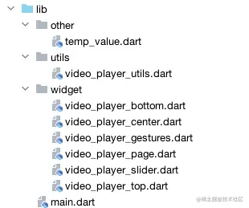
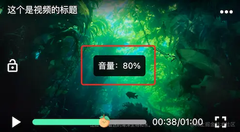
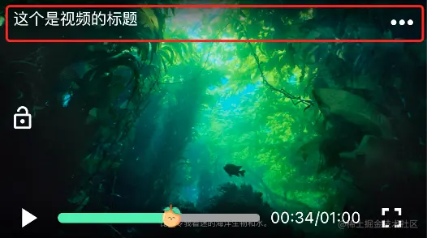
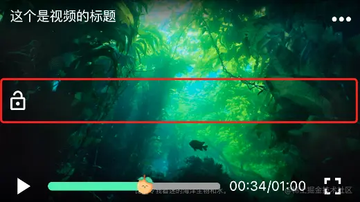
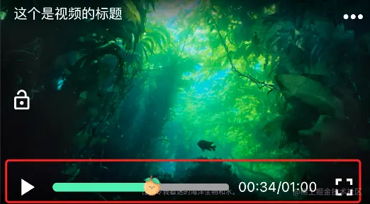

# Flutter 框架和库

## 使用 video_player 封装自己的 Flutter 视频播放器

### 效果图

注：亮度调节和音量调节 gif 无法体现，功能是 ok 的，其次默认 Icon 锁的 close 和 open 实在难以分辨。

#### 竖屏：


#### 横屏：


#### gif 详情：


关于 Flutter 视频的播放，会有很多方案，Pub 上也有很多优秀的插件。

但是完全适合自己的项目总是很难，多数还是需要自己去封装。

封装一个适合自己项目的 Flutter 视频播放器，毫无疑问选择了官方的播放器插件`video_player`进行封装自定义。

过程并不复杂，只要认真看完，相信每一位开发者都能定制属于自己的视频播放器！

### 第三方插件

```makefile
# 播放器
video_player: ^2.2.11
# 屏幕旋转
auto_orientation: ^2.2.1
# 亮度和音量调节
brightness_volume: ^1.0.3
```

### 项目结构



#### video_player_utils

重点说下这个工具类，因为视频播放，涉及到状态改变有很多，笔者刚开始选择使用` InheritedWidget`来在众多的 widget 之间共享数据。但是总感觉这样有点繁琐，且不很优雅！

_这里非广告，如果是使用`GetX`就很简单了，笔者也使用了`GetX`进行封装了，一泻千里的赶脚！，但是笔者还是那句话：刚开始接触 Flutter 的开发者不是很建议使用`GetX`，可以先熟悉下 Flutter 状态管理的基础原理再行使用。而且为了尽量简洁，还是不引入其他的第三方了。_

我们选择对第三方插件进行封装的目的不外乎这几个：

- 方便调用
- 适配业务需要
- 高内聚低耦合
- 后期迭代维护

于是笔者就写了一个工具类`VideoPlayerUtils`，专门且只用来处理播放器的所有业务。包括暂停、播放、跳转、调节音量、调节亮度、切换视频等操作。在所有的 widget 中不会引用关于`video_player`或其他第三方插件的任何信息，`VideoPlayerUtils`负责 widget 与播放器之间的所有操作交互。后续优化迭代或更换播放器插件时，只需针对这个工具类进行修改，对所有 widget 不会有任何的影响，大大的解耦合了。

##### public 属性

```dart
static String get url => _instance._url; // 当前播放的url

static VideoPlayerState get state => _instance._state; // 当前播放状态

static bool get isInitialized => _instance._isInitialized; // 视频是否已经完成初始化

static Duration get duration => _instance._duration; // 视频总时长

static Duration get position => _instance._position; // 当前视频播放进度

static double get aspectRatio => _instance._aspectRatio; // 视频播放比例
```

其中`VideoPlayerState`：

```dart
/// 播放状态
enum VideoPlayerState{
  stopped, // 初始状态，已停止或发生错误
  playing, // 正在播放
  paused,  // 暂停
  completed // 播放结束
}
```

提供以上的公共属性，可以通过`VideoPlayerUtils`来获取对应的值，使用`get`只读，使外界不会误修改这些属性，以保证数值的安全性。开发者可根据自身需要自行添加属性。

##### public 方法

```dart
// 播放、暂停、切换视频等操作，内部自行判断是播放还是暂停，开发者不用关心
static void playerHandle(String url,{bool autoPlay = true,bool looping = false}) async{}

// 跳转播放
static void seekTo({required Duration position}) async{}

// 初始化结果监听，回调2个参数：1、初始化是否成功，2、播放的widget，方便setState()
static void initializedListener({required dynamic key,required Function(bool,Widget) listener}){}

// 移除初始化结果监听
static void removeInitializedListener(dynamic key){}

// 播放状态监听，stopped、playing、paused、completed等
static void statusListener({required dynamic key,required Function(VideoPlayerState) listener}){}

// 移除播放状态监听
static void removeStatusListener(dynamic key){}

// 播放进度监听
static void positionListener({required dynamic key,required Function(int) listener}){}

// 移除播放进度监听
static void removePositionListener(dynamic key){}

// 获取音量
static Future<double> getVolume() async{}

// 设置音量
static Future<void> setVolume(double volume) async{}

// 获取亮度
static Future<double> getBrightness() async{}

// 设置亮度
static Future<void> setBrightness(double brightness) async{}

// 设置播放速度
static Future<void> setSpeed(double speed) async{}

// 设置是否循环播放
static Future<void> setLooping(bool looping) async{}

// 设置横屏
static setLandscape(){}

// 设置竖屏
static setPortrait(){}

// 简单处理下时间格式化mm:ss （超过1小时可自行处理hh:mm:ss，严格来说不属于播放业务）
static String formatDuration(int second){}

// 释放资源
static dispose(){}

// 开发者可行添加比如：亮度、音量改变监听回调等。
```

提供以上方法来处理播放器的所有业务。同样的开发者可根据自身需要自行添加或修改。

###### playerHandle

```dart
static void playerHandle(String url,{bool autoPlay = true,bool looping = false}) async{}
```

重点说下这个方法，是整个业务的核心方法，控制视频的播放或暂停。开发者只要遇到播放或暂停是均可调用此方法，具体是播放或暂停，内部根据传入的`url`自行判断，开发者不需要关心。

切换新视频也是使用此方法，传入的`url`与上次不一致，自动切换新视频。笔者可根据`statusListener`来监听播放状态的改变，以此处理自身逻辑。

###### initializedListener

```dart
// 初始化结果监听
static void initializedListener({required dynamic key,required Function(bool,Widget) listener}){}
```

这个也需要提下，视频播放器在播放新视频时会异步初始化，一般我们的操作是在`initState()`初始化，成功后再`setState()`。这里笔者遇到一个让人蛋疼的问题：

我们看`video_player`的使用：

```dart
AspectRatio(
  aspectRatio: controller.aspectRatio,
  child: VideoPlayer(controller),
);
```

`VideoPlayer(controller)`：widget 中已经持有了 controller。本来笔者封装的目的就是为了让 widget 与 controller 的之间解耦合。

于是笔者取了巧，写了一个初始化监听器`initializedListener`，包换 2 个参数：`bool,Widget`，初始化是否成功；其中 widget 为初始化成功返回需要展示的播放器 UI，失败默认返回`const SizedBox()`。

### 使用

到这里就可以简单使用了：

```dart
class _VideoPlayerUIState extends State<VideoPlayerUI> {
  Widget? _playerUI;
  @override
  void initState() {
    // TODO: implement initState
    super.initState();
    // 播放视频
    VideoPlayerUtils.playerHandle("http://flv3.bn.netease.com/tvmrepo/2018/6/9/R/EDJTRAD9R/SD/EDJTRAD9R-mobile.mp4");
    // 播放新视频，初始化监听
    VideoPlayerUtils.initializedListener(key: this, listener: (initialize,widget){
      if(initialize){ // 初始化成功后，更新UI
        _playerUI = widget;
        if(!mounted) return;
        setState(() {});
      }
    });
  }
  @override
  void dispose() {
    // TODO: implement dispose
    // 移除监听
    VideoPlayerUtils.removeInitializedListener(this);
    super.dispose();
  }
  @override
  Widget build(BuildContext context) {
    return Container(
      alignment: Alignment.center,
      width: 414,
      height: 414*9/16,
      color: Colors.black26,
      child: _playerUI ?? const CircularProgressIndicator(
        strokeWidth: 3,
      )
    );
  }
}
```

没看错，视频播放就是这么简单。

#### Widget

如果有更多的业务功能，笔者也按照自己的需求写了一套，同样的开发者可根据自身需要自行添加或修改。

##### video_player_gestures

`VideoPlayerGestures`主要是处理手势的，比如快进、快退等跳转播放；左侧上下滑动调节亮度；右侧上下滑动调节音量；单击是否开启沉浸式播放，所有 widget 的隐藏与显示；双击播放、暂停等。

```dart
GestureDetector(
  onTap: _onTap, // 单击上下widget隐藏与显示
  onDoubleTap: _onDoubleTap, // 双击暂停、播放
  onVerticalDragStart:_onVerticalDragStart, // 根据起始位置。确定是调整亮度还是调整声音
  onVerticalDragUpdate: _onVerticalDragUpdate,// 一般在更新的时候，同步调整亮度或声音
  onVerticalDragEnd: _onVerticalDragEnd, // 结束后，隐藏百分比提示信息widget
  onHorizontalDragStart: _onHorizontalDragStart,  // 手势跳转播放起始位置
  onHorizontalDragUpdate: _onHorizontalDragUpdate, // 根据手势更新快进或快退
  onHorizontalDragEnd: _onHorizontalDragEnd,  // 手势结束seekTo
  child: Stack(
    children: _children,
  ),
);
```

哦，还有`PercentageWidget`也放到这个文件下了，就是这玩意：



因为显示的百分比与手势相关，随着手势移动而更新。开发者可自行处理。

##### video_player_top

笔者处出于简单考虑，就按照整个 UI 的位置命名了。瞅一眼就知道是啥玩意。



同样的开发者可根据自身需要自行添加或修改。

##### video_player_center

就是这玩意：



同样的开发者可根据自身需要自行添加或修改。话说这个锁的`Icon`的 open 和 close 是真的难分辨！

##### video_player_bottom

就是这玩意：



同样的开发者可根据自身需要自行添加或修改。

##### video_player_slider

这玩意是自定义的，别问，问就是跟产品干一架落了下风

主要就是自定义这玩意：

```dart
SliderThemeData(
  trackHeight: 8,
  inactiveTrackColor: Colors.grey,
  activeTrackColor: Colors.greenAccent,
  thumbShape: SliderThumbImage(image: _customImage),// 自定义
  trackShape: const CustomTrackShape(), // 自定义
),
```

同样的开发者可根据自身需要自定义。

注：这里没有添加缓冲的进度，开发可查看`video_player`中的源码`VideoProgressIndicator`，按业务自行定义。

##### video_player_page

这玩意就是整合以上的 widget，再考虑下全屏的安全区域，没啥东西。开发者可自行处理！

```dart
SafeArea(
  top: !_isFullScreen,
  bottom: !_isFullScreen,
  left: !_isFullScreen,
  right: !_isFullScreen,
  child: SizedBox(
    height: _height,
    width: _width,
    child: _playerUI != null ? VideoPlayerGestures(
      appearCallback: (appear){
        _top!.opacityCallback(appear);
        _lockIcon!.opacityCallback(appear);
        _bottom!.opacityCallback(appear);
        },
      children: [
        Center(
          child: _playerUI,
        ),
        _top!,
        _lockIcon!,
        _bottom!
      ],
    ) : Container(
      alignment: Alignment.center,
      color: Colors.black26,
      child: const CircularProgressIndicator(
        strokeWidth: 3,
      ),
    )
  ),
);
```

### RCFlutterVideoPlayer

开源：https://github.com/RchTime/RCFlutterVideoPlayer.git

具体的实现监听器的思路，[看这里](https://juejin.cn/post/7008351563798282254)。

自此一个漂亮的 Flutter 视频播放器就已经结束了。

# Flutter 常用库插件

## 网络请求

### http

https://pub.dartlang.org/packages/http

https://github.com/dart-lang/http

该软件包包含一组高级函数和类，可以轻松使用 HTTP 资源。它与平台无关，可以在命令行和浏览器上使用。

### dio

https://pub.dartlang.org/packages/dio

Dart 的一个强大的 Http 客户端，支持拦截器、全局配置、FormData、请求取消、文件下载、超时等。

### http_multi_server

https://pub.dartlang.org/packages/http_multi_server

dart:io HttpServer 包装器，用于处理来自多个服务器的请求

## 图像加载

可使用 Image.network 、 FadeInImage.memoryNetwork 或下面的库加载。

### cached_network_image

https://pub.dartlang.org/packages/cached_network_image

Flutter 库来加载和缓存网络图像。也可以与占位符和错误小部件一起使用。

### flutter_advanced_networkimage

https://pub.dartlang.org/packages/flutter_advanced_networkimage

高级图像缓存加载和缩放控制。

### transparent_image

https://pub.dartlang.org/packages/transparent_image

简单的透明图像，表示为 Uint8List。在加载图片时可以用来做为占位符。

## 图像处理

### image_jpeg

https://pub.dartlang.org/packages/image_jpeg

https://github.com/yangyxd/image_jpeg

用于图像上传之前转 jpeg 缩放压缩，调用 Android 或 iOS 原生功能进行处理，性能较高，支持的源图像格式也更多。

### image_picker

https://pub.dartlang.org/packages/image_picker

用于从 Android 和 iOS 图像库中选择图像，并使用相机拍摄新照片。

### photo

https://pub.dartlang.org/packages/photo

用于选择图像，支持多选，而且这个是用 Flutter 做的 UI，可以很方便的自定义修改（强烈推荐）。

### image

https://pub.dartlang.org/packages/image

DART 库，提供以各种不同的文件格式加载、保存和操作图像的能力。该库不依赖于 DART：IO，因此它可以用于服务器和 Web 应用程序。

### flutter_svg

https://pub.dartlang.org/packages/flutter_svg

加载 svg 图像。

### zoomable_image

https://pub.dartlang.org/packages/zoomable_image

提供图像查看和手势缩放操作功能。

### image_carousel

https://pub.dartlang.org/packages/image_carousel

Flutter 图像展示控件，可以左右划动切换上一张下一张图像，还结合了 zoomable_image 可以点击后缩放查看。支持 Asset 和网络图像。

### carousel_slider

https://pub.dartlang.org/packages/carousel_slider

一个支持手势划动和自动播放的图像展示控件。

### parallax_image

https://pub.dartlang.org/packages/parallax_image

视差图像可以与任何可滚动（例如 ListVIEW）一起使用。说白了就是让放在滚动区域内的图像滚动时看起来更平滑。

### camera

https://pub.dartlang.org/packages/camera

用于在 Android 和 iOS 上获取有关和控制相机的信息。支持预览相机馈送和捕捉图像。

## UI 相关

### fluttertoast

https://pub.dartlang.org/packages/fluttertoast

用于 Android 和 ios 的 toast 库。

### flutter_html_view

https://pub.dartlang.org/packages/flutter_html_view

Flutter 没有默认的支持来显示 html，所以需要三方的包来显示。这个包可以将 html 呈现给原生的 Widget。（目前支持的标签比较少）

### flutter_html_textview

https://pub.dartlang.org/packages/flutter_html_textview

将 html 呈现为一个 Widget,在 textview 中呈现 html。

### markdown

https://pub.dartlang.org/packages/markdown

用 Dart 编写的便携式 Markdown 库。它可以在客户端和服务器上将 Markdown 解析为 HTML。

### html2md

https://pub.dartlang.org/packages/html2md

将 html 转换为 Dart 中的 MarkDown.

### flutter_calendar （日历）

https://pub.dartlang.org/packages/flutter_calendar

日历组件.

### flutter_picker

https://pub.dartlang.org/packages/flutter_picker

https://github.com/yangyxd/flutter_picker

选择器。可以根据 json 或自定义数据生成选择器。

### flutter_spinkit

https://github.com/jogboms/flutter_spinkit

加载动画。支持多种常用效果，非常酷炫。

### extended_nested_scroll_view

https://github.com/zmtzawqlp/Flutter_Candies/tree/master/extended_nested_scroll_view

一个扩展 NestedScrollView，能够更好的处理列表、TabView、Sliver 混合的情况（但是这个插件没有在 pub 找到）

### badge

https://pub.dartlang.org/packages/badge

小红点插件，可以用来显示小红点、未读消息数量等，非常方便

## 视频 & 音频

### chewie

https://pub.dartlang.org/packages/chewie

视频播放器，在 video_player 的基础上包装了控制 UI。

### video_player

https://pub.dartlang.org/packages/video_player

用于在 Android 和 iOS 上与其他 Flutter 窗口小部件一起显示内嵌视频。

### video_launcher

https://pub.dartlang.org/packages/video_launcher

视频播放器，可播放本地文件和字节流。

### flute_music_player

https://pub.dartlang.org/packages/flute_music_player

基于 Flutter 的材料设计音乐播放器与音频插件播放本地音乐文件。自带华丽的播放界面。

### audioplayer

https://pub.dartlang.org/packages/audioplayer

一个播放远程或本地音频文件 Flutter 音频插件

### audioplayers

https://pub.dartlang.org/packages/audioplayers

这是 rxlabz 的 audioplayer 的一个分支，不同之处在于它支持同时播放多个音频并显示音量控制。

### spritewidget

https://pub.dartlang.org/packages/spritewidget

SpriteWidget 是用于构建复杂、高性能动画和带有 2D 游戏的插件包，可与其它小部件无缝混合。您可以使用 SpriteWidget 创建任何东西，从动画图标到成熟的游戏。

## 路由和消息传递

### fluro

https://pub.dartlang.org/packages/fluro

https://github.com/theyakka/fluro

最好用的路由导航框架。功能：简单的路线导航；函数处理程序（映射到函数而不是路径）；通配符参数匹配；查询字符串参数解析；内置常用转换；简单的定制转换创建。

### flutter_local_notifications

https://pub.dartlang.org/packages/flutter_local_notifications

一个跨平台的显示本地 notifications 的插件。

### local_notifications

https://pub.dartlang.org/packages/local_notifications

这个库能让你在 Android 和 iOS 上创建 Notifications 很简单。

### url_launcher

https://pub.dartlang.org/packages/url_launcher

用于在 Android 和 iOS 上启动 URL。支持网络，电话，短信和电子邮件方案。

### firebase_messaging

https://pub.dartlang.org/packages/firebase_messaging

一款跨平台的消息传递解决方案，可让您在 Android 和 iOS 上可靠地传递消息。

### flutter_msg_engine

https://pub.dartlang.org/packages/flutter_msg_engine

https://github.com/yangyxd/flutter_msg_engine

消息引擎, 注册一个消息，在任何地方响应并处理。。

### event_bus

https://pub.dartlang.org/packages/event_bus

一个使用 Dart 流进行解耦应用程序的简单事件总线的库。

## 数据存储、缓存有关的库

### sqflite

https://pub.dartlang.org/packages/sqflite

SQLite 的 Flutter 插件，一个自包含的高可靠性嵌入式 SQL 数据库引擎。

### file_cache

https://pub.dartlang.org/packages/file_cache

为 flutter package 项目缓存 Json,Buffer,FileCacheImage。

### flutter_cache_manager

https://pub.dartlang.org/packages/flutter_cache_manager

管理你的 app 下载到本地的文件缓存。它使用缓存控制 HTTP 报头有效地检索文件。

## 类型编解码的库

### html_unescape

https://pub.dartlang.org/packages/html_unescape

用于解决 HTML 编码字符串的 Dart 库。支持所有命名字符引用（如` `），小数字符引用（如`á`）和十六进制字符引用（如`ã`）。

### html

https://pub.dartlang.org/packages/html

HTML 解析库。

### crypto

https://pub.dartlang.org/packages/crypto

在纯 DART 中实现的加解密函数库。支持 SHA-1、SHA-256、MD5、HMAC

## 序列化

### 手动序列化：

使用 `dart:convert` 的内置解码器。包括传入 JSON 原始字符串给 JSON.decode() 方法，然后从 `Map<String, dynamic>` 中查询你需要的数据。

### 自动序列化：

| 库名                  | 版本号 | 链接                                                    | 描述           |
| --------------------- | ------ | ------------------------------------------------------- | -------------- |
| json_serializable     |        | https://pub.dartlang.org/packages/json_serializable     |                |
| built_value           |        | https://pub.dartlang.org/packages/built_value           | runtime 依赖项 |
| built_value_generator |        | https://pub.dartlang.org/packages/built_value_generator | dev 依赖项     |
| built_value_test      |        | https://pub.dartlang.org/packages/built_value_test      | test 依赖项    |

## Json 解析

- https://github.com/javiercbk/json_to_dart 根据 json 生成 Dart 实体类
- https://pub.dartlang.org/packages/json_schema json 解析
- https://github.com/debuggerx01/JSONFormat4Flutter 这是一个 AS 的辅助插件，将 JSONObject 格式的 String 解析成 Dart 的实体类
- Dson 0.13.2 下载地址 https://pub.dartlang.org/packages/dson
  描述：Dson 的 github 地址 https://github.com/drails-dart/dson DSON 是一个将 Dart 对象转换为 JSON 的库。(用于 web)这个库是 Dartson 的一个分支，但又有不同。
- Dartson 是一个 Dart 库，可用于将 Dart 对象转换为 JSON 字符串。 https://github.com/eredo/dartson （用于 web）
- 几个 Json 库的比较：https://github.com/drails-dart/dart-serialise

| 方式              | 大小 (js) | 序列化 (dart) | 反序列化 (dart) | 序列化 (js) | 反序列化 (js) |
| ----------------- | --------- | ------------- | --------------- | ----------- | ------------- |
| json_serializable | 80 KB     | 9.09 ms       | 6.61 ms         | 8.23 ms     | 8.12 ms       |
| Serializable      | 79 KB     | 6.1 ms        | 6.92 ms         | 4.37 ms     |               |
| DSON              | 94 KB     | 12.72 ms      | 11.15 ms        | 16.64 ms    | 17.94 ms      |
| Dartson           | 86 KB     | 9.61 ms       | 6.81 ms         | 8.58 ms     | 7.01 ms       |
| Manual            | 86 KB     | 8.29 ms       | 5.78 ms         | 10.7 ms     | 7.9 ms        |
| Interop           | 70 KB     | 61.55 ms      | 14.96 ms        | 2.49 ms     | 2.93 ms       |
| Jaguar_serializer | 88 KB     | 8.57 ms       | 6.58 ms         | 10.31 ms    | 8.59 ms       |
| Jackson (Groovy)  |           | 496 ms        | 252 ms          | n/a         | n/a           |

## 国际化和本地化

### intl

https://pub.dartlang.org/packages/intl

这个包提供国际化和本地化功能，包括消息翻译、复数和性别、日期/数字格式和解析以及双向文本。

## rx 系列

### rxdart

https://pub.dartlang.org/packages/rxdart

RxDart 是一种基于 ReactiveX 的谷歌 Dart 反应性函数编程库。谷歌 Dart 自带了一个非常不错的流 API;RxDart 没有尝试提供这个 API 的替代方案，而是在它上面添加了一些功能。

### rx_widgets

https://pub.dartlang.org/packages/rx_widgets

rx_widgets 是一个包含基于流的 Flutter Widgets 和 Widget 帮助程序/便利类的程序包，它们有助于反应式编程风格，特别是与 RxDart 和 RxCommands 结合使用。

### rx_command

https://pub.dartlang.org/packages/rx_command

RxCommand 是针对事件处理程序的基于 Reactive Extensions（Rx）的抽象。它基于 ReactiveUI 框架的 ReactiveCommand。它大量使用了 RxDart 包。

## 系统平台有关的库

### path_provider (获取本地文件)

https://pub.dartlang.org/packages/path_provider

用于获取 Android 和 iOS 文件系统上的常用位置，例如 temp 和 app 数据目录。

### shared_preferences (读写 sp 文件)

https://pub.dartlang.org/packages/shared_preferences

用于读写简单键值对的 Flutter 插件。包装 iOS 上的 NSUserDefaults 和 Android 上的 SharedPreferences。

### connectivity (网络状态)

https://pub.dartlang.org/packages/connectivity

用于发现 Android 和 iOS 上的网络状态（WiFi 和移动/蜂窝）连接。

### device_info (设备信息)

https://pub.dartlang.org/packages/device_info

提供有关设备（品牌，型号等）的详细信息，以及应用程序正在运行的 Android 或 iOS 版本。

### flutter_blue (蓝牙)

https://pub.dartlang.org/packages/flutter_blue

这是跨平台的蓝牙 sdk.

### share (分享)

https://pub.dartlang.org/packages/share

支持分享的 flutter 插件

### open_file (打开文件)

https://pub.dartlang.org/packages/open_file

调用平台打开文件。比如直接打开一个 apk 文件会调起平台的安装向导。

## 权限库

### simple_permissions

https://pub.dartlang.org/packages/simple_permissions

用于 android 和 ios 的请求权限的库

### flutter_simple_permissions

https://pub.dartlang.org/packages/flutter_simple_permissions

## 地图（地图显示、定位、经纬度等）

### map_view

https://pub.dartlang.org/packages/map_view

一个用于在 iOS 和 Android 上显示谷歌地图的 Flutter 插件

### flutter_map

https://pub.dartlang.org/packages/flutter_map

基于 leaflet 的 Flutter 地图包

### location

https://pub.dartlang.org/packages/location

这个插件 处理 Android 和 iOS 上的位置。它还提供位置更改时的回调。

### latlong

https://pub.dartlang.org/packages/latlong

LatLong 是一个计算通用的纬度和经度的轻量级库。

### flutter_amap

https://pub.dartlang.org/packages/flutter_amap

高德地图 3d flutter 组件。展示原生 android、ios 高德地图，并与 flutter 交互。

## 二维码

### barcode_scan

https://pub.dartlang.org/packages/barcode_scan

用于扫描 2D 条形码和 QRCodes 的 Flutter 插件。

### qrcode_reader

https://pub.dartlang.org/packages/qrcode_reader

使用相机读取二维码的 Flutter 插件。

## WebView

### flutter_webview_plugin

[pub.dartlang.org/packages/fl…](https://pub.dartlang.org/packages/flutter_webview_plugin)

允许 Flutter 与原生 Webview 进行通信的插件。

## 图表库

### charts-common

https://pub.dartlang.org/packages/charts_flutter

Material Design 风格的图表库

### charts-flutter

https://pub.dartlang.org/packages/charts_common

通用的图表库组件

### flutter_circular_chart

https://pub.dartlang.org/packages/flutter_circular_chart

一个让你使用 flutter 轻松创建的动画圆形图控件的库。

## 其它

### pwa

https://pub.dartlang.org/packages/pwa

基于 Dart 的 PWA 应用程序的

### fluwx (微信)

https://pub.dartlang.org/packages/fluwx

适用于 Flutter 的微信 SDK，方便快捷。

### alipay_me (支付宝)

https://pub.dartlang.org/packages/alipay_me

支付宝插件，支持登录、支付。android 还支持本地计算签名。

### flutter_qq (QQ)

https://pub.dartlang.org/packages/flutter_qq

QQ 登录、分享到 QQ、分享到 QQ 空间。

## 学习资料

https://github.com/AweiLoveAndroid/Flutter-learning

网友阿韦整理的学习资料和 demo.

Flutter 实用例子进阶课程
