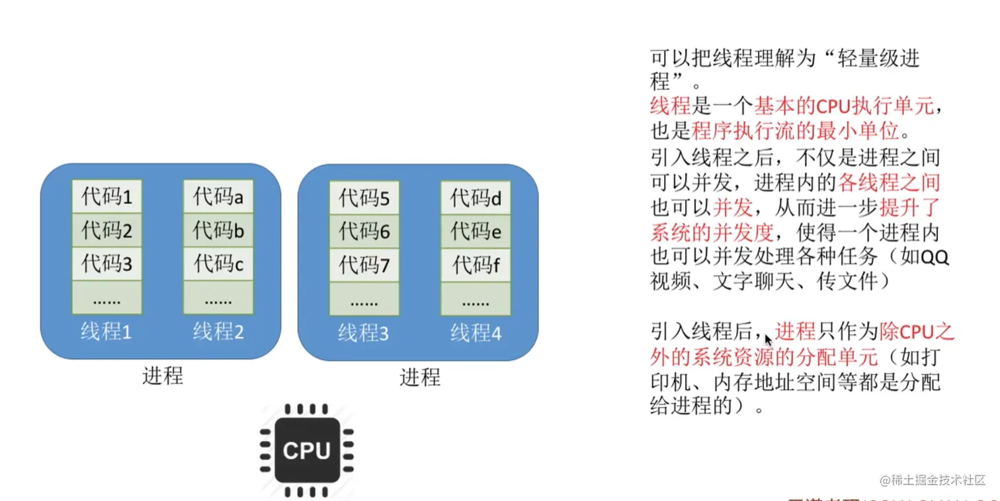

# 操作系统知识

## 要操作系统干嘛？

这里先不讲`操作系统`的概念了，因为文字太生硬了，我们只需要看一个简单的例子：

- 在我们的 JS 代码里，只需要输入 `console.log(1+1)`; 就可以在浏览器面板中看到`2`，这其中发生了什么事情呢?(简单扫一眼)
- 首先键盘输入代码`1+1`到显示器输出`2`, 需要`CPU`控制键盘（输入设备） ，将获取的`1+1`指令放入内存
- 然后 CPU 的控制器从内存中取出指令，并分析出指令是让计算机做一个`1+1`的加法运算
- 此时 CPU 的控制将控制 CPU 的运算器做`1+1`的加法运算，并得出结果`2`
- 最后 CPU 控制器控制运算器将结果返给内存，内存也在 CPU 控制器的控制下，将结果`2`返回给屏幕（输出设备）

好了，这里问题是，如果没有操作系统，一个简单的 1+1 运算，你的 js 代码还需要考虑这些硬件的协调工作，比如你的代码要协调 CPU 资源什么时候读取你的代码，什么时候把进程切换到别的进程。。。这些脏活累活都是操作系统帮你屏蔽了，要不这代码可咋写啊。


## 前端学这个干嘛？

很早以前看朴零大神的《深入浅出 NodeJS》的时候，讲到进程间通信，有一句大概说，windows 平台进程间通信用的是管道，linux 平台用的是 domain socket，我一看就傻眼了，啥是进程间通信？啥是管道？啥是 domain socket？😭 看不懂啊.... 这些都是跟操作系统进程的知识相关）。

## 2、操作系统运行机制和体系结构

预备知识： 什么是指令（更详细内容请看我的计算机组成原理文章）

比如说，如下图（简单扫一下即可）：


a+b 是一段程序代码，a+b 在 CPU 看来并不能一步完成，可以翻译成如下：

```css
// 意思是将内存的16号单元数据，放到A寄存器，
LOAD A, 16
// 意思是将内存的16号单元数据，放到B寄存器
LOAD B, 17
// 存器里的A,B数据相加，得到C
ADD C, A, B
```

这里就可以看得出来，指令是`CPU`能`识别`和`执行`的最基本命令。

#### 2.1 两种指令、两种处理器状态、两种程序

假如说一个用户可以随意把服务器上的所有文件删光，这是很危险的。所以有些指令普通用户是不能使用的，只能是`权限较高`的用户能使用。此时指令就分为了两种，如下图：


这就引出一个问题：CPU`如何判断`当前是否可以执行`特权指令`？ 如下图:  CPU 通常有两种工作模式即：`内核态`和`用户态`，而在 PSW（这个不用管，就知道有一个寄存器的标志位 0 表示用户态，1 表示核心态）中有一个二进制位控制这两种模式。

对于应用程序而言，有的程序能执行特权指令，有的程序只能执行非特权指令。所以操作系统里的程序又分为两种：


#### 2.2 操作系统内核简单介绍

从下图，我们先看看操作系统内核包含哪些


操作系统内核中跟硬件紧密相关的部分有：

- 时钟管理。操作系统的时钟管理是依靠`硬件定时器`的（具体硬件怎么实现我也不太清楚，好像是靠硬件周期性的产生一个脉冲信号实现的）。时钟管理相当重要，比如我们`获取时间信息`，`进程切换`等等都是要依靠时钟管理。
- 中断处理（下一小节会详细介绍）。
- 原语（后面会有案例提到）。现在可以简单理解为用来实现某个特定功能，在执行过程中`不可被中断`的指令集合。原语有一个非常重要的特性，就是原子性（其运行`一气呵成，不可中断`）。

#### 2.3 中断

- 在程序运行过程中，系统出现了一个必须由 CPU 立即处理的情况，此时，CPU`暂时中止程序的执行`转而`处理这个新的情况`的过程就叫做`中断`。 下面举一个例子：

 第一个应用程序在用户态执行了一段时间后  接着操作系统切换到核心态，处理中断信号 

- 操作系统发现`中断的信号`是第一个程序的时间片（每个程序不能一直执行，CPU 会给每个程序一定的执行时间，这段时间就是时间片）用完了，应该换第二个应用程序执行了
- 切换到`第2个进程`后，操作系统会将`CPU`的`使用权`交换给第二个应用程序，接着第二个应用程序就在`用户态`下开始执行。
- `进程`2 需要调用`打印机资源`，这时会执行一个`系统调用`（后面会讲系统调用，这里简单理解为需要操作系统进入核心态处理的函数），让操作系统进入核心态，去调用打印机资源
- 打印机开始工作，`此时进程2`因为要等待打印机启动，操作系统就不等待了（等到打印机准备好了，再回来执行程序 2），直接切换到`第三个应用程序`执行
- 等到打印机准备好了，此时打印机通过 I/O 控制器会给操作系统发出一`个中断信号`，操作系统又进入到核心态，发现这个中断是因为`程序2`等待打印机资源，现在打印机准备好了，就切换到`程序2`，切换到`用户态`，把 CPU 给程序 2 继续执行。

好了，现在可以给出一个结论，就是用户态、核心态之间的切换是怎么实现的?

- "用户态 ---> 核心态"是通过中断实现的。`并且中断时唯一途径`。
- "核心态 ---> 用户态"的切换时通过执行一个特权指令，将程序状态的标志位设为用户态。

#### 2.4 中断的分类

举一个例子，什么是内中断和外中断：

接着说之前的范桶同学，小时候不爱学习，每次学习着学习着突然异想天开，回过神来已经过好好长一段时间，这是`内部中断`。想着想着老师走过来，给了范捅一嘴巴，这是`外部中断`。

官方解释如下： 

- 内中断常见的情况如`程序非法操作`(比如你要拿的的数据的内存地址不是内存地址，是系统无法识别的地址)，`地址越界`(比如系统给你的程序分配了一些内存，但是你访问的时候超出了你应该访问的内存范围)、`浮点溢出`(比如系统只能表示 1.1 到 5.1 的范围，你输入一个 100, 超出了计算机能处理的范围)，或者`异常`，`陷入trap`（是指应用程序请求系统调用造成的，什么是系统调用，后面小节会举例讲）。
- 外中断常见的情况如`I/O中断`（由 I/O 控制器产生，用于发送信号通知操作完成等信号，比如进程需要请求打印机资源，打印机有一个启动准备的过程，准备好了就会给 CPU 一个 I/O 中断，告诉它已经准备好了）、`时钟中断`（由处理器内部的计时器产生，允许操作系统以一定规程执行函数，操作系统每过大约 15ms 会进行一次线程调度，就是利用时钟中断来实现的）。

#### 2.5 系统调用

> 为什么需要系统调用？

- 比如你的程序需要`读取文件信息`，可读取文件属于`读取硬盘里的数`据，这个操作应该时 CPU 在`内核态`去完成的，我们的应用程序怎么让 CPU 去帮助我们切换到内核态完成这个工作呢，这里就需要`系统调用了`。
- 这里就引出系统调用的概念和作用。
- 应用程序`通过系统调用请求操作系统的服务`。系统中的各种共享资源都由操作系统统一管理，因此在用户程序中，凡是与`资源有关的操作`（如存储分配、I/O 操作、文件管理等），都`必须`通过系统调用的方式向操作系统提出服务请求，由操作系统代为完成。

以下内容简单看一下即可，系统调用的分类：


需要注意的是，`库函数`和`系统调用`容易混淆。

- 库是可重用的模块 `处于用户态`
- 进程通过系统调用从用户态进入`内核态`， 库函数中有很大部分是对系统调用的封装

举个例子：比如`windows`和`linux`中，创建进程的系统调用方法是不一样的。 但在 node 中的只需要调用相同函数方法就可以创建一个进程。例如

```javascript
// 引入创建子进程的模块
const childProcess = require("child_process");
// 获取cpu的数量
const cpuNum = require("os").cpus().length;

// 创建与cpu数量一样的子进程
for (let i = 0; i < cpuNum; ++i) {
	childProcess.fork("./worker.js");
}
```

#### 2.6 进程的定义、组成、组织方式、状态与转换

##### 2.6.1 为什么要引入进程的概念呢？

- 早期的计算机只支持`单道程序`（是指所有进程一个一个排队执行，A 进程执行时，CPU、内存、I/O 设备全是 A 进程控制的，等 A 进程执行完了，才换 B 进程，然后对应的资源比如 CPU、内存这些才能换 B 用）。 
- 现代计算机是`多道程序`执行，就是同时看起来有多个程序在一起执行，那每个程序执行都需要系统分配给它资源来执行，比如`CPU`、`内存`。
- 拿内存来说，操作系统要知道给 A 程序分配的内存有哪些，给 B 程序分配的内存有哪些，这些都要有小本本记录下来，这个小本本就是进程的一部分，进程的一大职责就是`记录目前程序运行的状态`。
- 系统为每个运行的程序配置一个数据结构，称为`进程控制块`（PCB），用来描述进程的各种信息（比如代码段放在哪）。

##### 2.6.2 进程的定义？

简要的说，进程就是具有`独立功能的程序`在数据集合上`运行的过程`。(强调动态性)

##### 2.6.3 PCB 有哪些组成

如下图，分别说明一下 

- `进程标识符PID`相当于身份证。是在进程被创建时，操作系统会为该进程分配一个唯一的、不重复的 ID，`用于区分不同的进程`。
- 用户标识符`UID`用来表示这个进程`所属的用户`是谁。
- 进程当前状态和优先级下一小节会详细介绍
- 程序段指针是指当前进程的程序在`内存的什么地方`。
- 数据段指针是指当前进程的数据在`内存的什么地方`。
- 键盘和鼠标是指进程被`分配得到的I/O设备`。
- 各种寄存器值是指比如把程序计数器的值，比如有些计算的结果算到一半，进程切换时需要把这些值保存下来。

##### 2.6.4 进程的组织

在一个系统中，通常由数十、数百乃至数千个`PCB`。为了对他们加以有效的管理，应该用适当的方式把这些 PCB 组织起来。这里介绍一种组织方式，类似数据结构里的链表。


##### 2.6.5 进程的状态

`进程是程序的一次执行。`在这个执行过程中，有时进程正在`被CPU处理`，有时又需要`等待CPU服务`，可见，进程的 状态是会有各种变化。为了方便对各个进程的管理，操作系统需要将进程合理地划分为几种状态。

进程的三种基本状态：


进程的另外两种状态：


##### 2.6.6 进程状态的转换

进程的状态并不是一成不变的，在一定情况下会动态转换。


以上的这些进程状态的转换是如何实现的呢，这就要引出下一个角色了，叫`原语。

- 原语是`不可被中断`的原子操作。我们举一个例子看看原语是怎么保证不可中断的。

 原语采用`关中断指令`和`开中断指令`实现。

- 首先执行关中断指令
- 然后外部来了中断信号，不予以处理
- 等到开中断指令执行后，其他中断信号才有机会处理。

#### 2.6 进程的通信

> 为什么需要进程间通信呢？

因为进程是`分配系统资源的单位`（包括内存地址空间），因此各进程拥有的内存地址空间相互独立。


##### 2.6.1 进程通信方法---共享存储

因为两个进程的存储空间`不能相互访问`，所以操作系统就提供的一个内存空间让彼此都能访问，这就是共享存储的原理。 

其中，介绍一下基于存储区的共享。

- 在内存中画出一块`共享存储区`，数据的形式、存放位置都是由进程控制，而不是操作系统。

##### 2.6.2 进程通信方法---管道


- 管道数据是以`字符流`（注意不是字节流）的形式写入管道，当管道写满时，写进程的`write()`系统调用将被阻塞，等待读进程将数据取走。当读进程将数据全部取走后，管道变空，此时读进程的`read()`系统调用将被阻塞。
- 如果没写满就不允许读。如果都没空就不允许写。
- 数据一旦被读出，就从管道中被丢弃，这就意味着`读进程`最多只能有一个。

##### 2.6.3 进程通信方法---消息传递

进程间的数据交换以`格式化的消息`为单位。进程通过操作系统提供的`"发送消息/接收消息"`两个原语进行数据交换。

其中消息是什么意思呢？就好像你发 QQ 消息，消息头的来源是你，消息体是你发的内容。如下图：


接下来我们介绍一种`间接通信`的方式（很像中介者模式或者发布订阅模式）, 如下图：中介者是信箱，进程通过它来收发消息。


#### 2.7 线程

> 为什么要引入线程呢？

- 比如你在玩 QQ 的时候，QQ 是一个进程，如果 QQ 的进程里没有多线程并发，那么 QQ 进程就只能`同一时间做一件事情`（比如 QQ 打字聊天）
- 但是我们真实的场景是 QQ 聊天的同时，还可以发文件，还可以视频聊天，这说明如果 QQ`没有多线程并发能力`，QQ 能够的实用性就大大降低了。所以我们`需要线程`，也就是`需要进程拥有能够并发`多个事件的能力。



引入线程后带来的变化 

## 3 进程的同步和互斥

> 同步。是指多个进程中发生的事件存在某种先后顺序。即某些进程的执行必须先于另一些进程。

比如说`进程A`需要从缓冲区读取`进程B`产生的信息，当缓冲区为空时，`进程B`因为读取不到信息而被阻塞。而当`进程A`产生信息放入缓冲区时，`进程B`才会被唤醒。概念如图 1 所示。 

> 互斥。是指多个进程不允许同时使用同一资源。当某个进程使用某种资源的时候，其他进程必须等待。

比如`进程B`需要访问打印机，但此时`进程A`占有了打印机，`进程B`会被阻塞，直到`进程A`释放了打印机资源,进程 B 才可以继续执行。概念如图 3 所示。 

#### 3.1 信号量（了解概念即可）

`信号量`主要是来解决进程的`同步`和`互斥`的，我们前端需要了解，如果涉及到同步和互斥的关系（我们编程大多数关于流程的逻辑问题，本质不就是同步和互斥吗？）

在操作系统中，常用`P、V信号量`来实现进程间的`同步`和`互斥`，我们简单了解一下一种常用的信号量，`记录型信号量`来简单了解一下信号量本质是怎样的。（c 语言来表示，会有备注）

```C
/*记录型信号量的定义*/
typedef struct {
    int value; // 剩余资源
    Struct process *L // 等待队列
} semaphore
```

意思是信号量的结构有两部分组成，`一部分是剩余资源value`，比如目前有两台打印机空闲，那么剩余资源就是 2，谁正在使用打印机，剩余资源就减 1。

`Struct process *L `意思是，比如 2 台打印机都有人在用，这时候你的要用打印机，此时会把这个打印机资源的请求放入阻塞队列，L 就是阻塞队列的地址。

```c
/*P 操作，也就是记录型信号量的请求资源操作*/
void wait (semaphore S) {
    S.value--;
    if (S.value < 0){
        block (S.L);
    }
}
```

需要注意的是，如果剩余资源数不够，使用 block 原语使进程从运行态进入阻塞态，并把挂到信号量 S 的等待队列中。

```c
/*V 操作，也就是记录型信号量的释放资源操作*/
void singal (semaphore S) {
    S.value++;
    if (S.value <= 0){
        wakeup (S.L);
    }
}
```

释放资源后，若还有别的进程在等待这个资源，比如打印机资源，则使用 wakeup 原语唤醒等待队列中的一个进程，该进程从阻塞态变为继续态。

#### 3.2 生产者消费者问题（了解概念即可）

为什么要讲这个呢，主要是 node 的流的机制，本质就是生产者消费者问题，可以简单的看看这个问题如何解决。

 如上图，`生产者`的主要作用是生成`一定量的数据放到缓冲区中`，然后`重复此过程`。与此同时，消费者也在`缓冲区消耗这些数据`。该问题的关键就是要保证生产者不会在缓冲区满时加入数据，消费者也不会在缓冲区中空时消耗数据。

这里我们需要两个同步信号量和一个互斥信号量

```c
// 互斥信号量，实现对缓冲区的互斥访问
semaphore mutex = 1;
// 同步信号量，表示目前还可以生产几个产品
semaphore empty = n;
// 同步信号量，表示目前可以消耗几个产品
semaphore full = 0;
```

生产者代码如下

```c
producer () {
    while(1) {
        // 生产一个产品
        P(empty);
        // 对缓冲区加锁
        P(mutex);
        这里的代码是生产一个产品
        // 解锁
        V(mutex);
        // 产出一个产品
        V(full);
    }
}
```

消费者代码如下

```c
producer () {
    while(1) {
        // 消费一个产品
        P(full);
        // 对缓冲区加锁
        P(mutex);
        这里的代码是消费一个产品
        // 解锁
        V(mutex);
        // 消费一个产品
        V(empty);
    }
}
```

## 4 内存的基础知识和概念

> 为什么需要内存

内存是计算机`其它硬件设备`与`CPU沟通`的桥梁、中转站。程序执行前需要先放到内存中才能被 CPU 处理。

#### 4.1 cpu 如何区分执行程序的数据在内存的什么地方

- 是通过给`内存的存储单元编址`实现的。（存储单元一般是以字节为单位）
- 如下图，内存的存储单元，就像一个酒店的房间，都有编号，比如程序一的数据都在 1 楼，1 楼 1 号存储着程序里`let a = 1`这段代码。


#### 4.2 内存管理-内存空间的分配与回收

- 内存分配分为`连续分配`和`非连续分配`，连续分配是指用户进程分配的必须是`一个连续的内存空间`。
- 这里我们只讲连续分配中的`动态分区分配`。
- 什么是动态分区分配呢，这种分配方式`不会预先划分内存分区`，而是在进程装入内存时，根据进程的大小`动态地`建立分区，并使分区的大小`正好适合`进程的需要。（比如，某计算机内存大小 64MB，系统区 8MB，用户区 56MB...，现在我们有几个进程要装入内存，如下图）


- 随之而来的问题就是，如果此时进程 1 使用完了，相应在内存上的数据也被删除了，那么`空闲的区域`，后面该怎么分配（也就是说随着进程退出，会有很多空闲的内存区域出现）

我们讲一种较为简单的处理方法叫`空闲分区表`法来解决这个问题。如下图，右侧的表格就是一个空闲分区表。


当很多个空闲分区都能满足需求时，应该选择哪个分区进行分配呢，例如下图，分别有`20MB`，`10MB`，`4MB`三个空闲分区块，现在`进程5`需要`4MB`空闲分区，改怎么分配呢？

我们需要按照一定的动态分区分配算法，比如有`首次适应算法`，指的是每次都从低地址开始查找，找到第一个能满足大小的空闲分区。还有比如`最佳适应算法`，指的是从空闲分区表中找到最小的适合分配的分区块来满足需求。


`连续分配缺点很明显`，大多数情况，需要分配的进程大小，不能跟空闲分区剩下的大小完全一样，这样就产生很多很难利用的`内存碎片`。

这里我们介绍一种更好的空闲分区的分配方法，`基本分页存储`。如下图

 将内存空间分为`一个个大小相等`的分区（比如：每个分区`4KB`）.每个分区就是一个`“页框”`。页框号从`0`开始。

将用户进程的地址空间分为与页框大小相等的一个个区域，称为`“页”`。每个页也是从`0`开始。

## 5 文件管理

> 文件是什么？

文件就是一组有意义的`信息/数据`集合。

计算机中存放了各种各样的文件，一个文件有哪些属性呢？文件内部的数据应该怎样组织起来？文件之间又该怎么组织起来？

#### 5.1 文件的属性


- 文件名。即文件的名字，需要注意的是，同一目录下`不允许`有重名的文件。
- 标识符。操作系统用于区分各个文件的一种`内部的名称`。
- 类型。文件的类型。
- 位置。文件`存放的路径`，同时也是在硬盘里的位置（需要转换成物理硬盘上的地址）
- 创建时间、上次修改时间、文件所有者就是字面意思。
- 保护信息。比如对这个文件的`执行权限`，是否有删除文件权限，修改文件权限等等。

#### 5.2 文件内部数据如何组织在一起

如下图，文件主要分为`有结构文件`和`无结构文件`。


#### 5.3 文件之间如何组织起来

通过`树状结构`组织的。例如`windows`的文件间的组织关系如下：


接下来我们详细的了解一下`文件的逻辑结构`

#### 5.4 文件的逻辑结构

逻辑结构是指，在用户看来，文件内部的数据是如何组织起来的，而`“物理结构”`是在操作系统看来，文件是如何保存在外存，比如`硬盘`中的。


比如，`“线性表”`就是一种逻辑结构，在用户看来，线性表就是一组有先后关系的元素序列，如：`a,b,c,d,e....`

- `“线性表”`这种逻辑结构可以用不同的物理结构实现，比如：`顺序表/链表`。`顺序表`的各个元素在逻辑上相邻，在物理上也相邻：而`链表`的各个元素在物理上可以是不相邻的。
- 因此，顺序表可以实现`“随机访问”`，而`“链表”`无法实现随机访问。

接下来我了解一下有结构文件的三种逻辑结构

##### 5.4.1 顺序文件

> 什么是顺序文件

指的是文件中的记录一个接一个地在逻辑上是`顺序排列`，记录可以是`定长`或`变长`，各个记录在物理上可以`顺序存储`或`链式存储`


- 顺序文件按结构来划分，可以分为`串结构`和`顺序结构`。
- 串结构是指记录之间的顺序与`关键字无关`，通常都是按照记录的时间决定记录的顺序。
- 顺序结构就必须保证记录之间的先后顺序按`关键字排列`。

这里需要注意的知识点是，顺序文件的存储方式和是否`按关键字排列`，会影响数据`是否支持随机存取`和`是否可以快速按关键字找到对应记录`的功能。

可以看到，顺序文件按顺序存放对于查找是非常有帮助的，我们在记录文件的时候也可以注意利用这一点。


##### 5.4.2 索引文件

对于`可变长记录文件`，要找到`第i`个记录，必须先顺序查找`前i-1`个记录（也就是需要遍历一遍），但是很多场景中又必须使用可变长记录，如何解决这个问题呢？这就引出来马上讲的`索引文件`


- 给这些变长的记录都用一张索引表来记录，一个索引表项包括了`索引号`，`长度`和`指针`。
- 其中，可以将关键字作为索引号的内容，如果关键字本身的排列是有序的，那么还可以按照关键字进行折半查找。这里是关键，因为我们平时用 mysql 数据库对某个字段假如索引，就是这个道理。
- 但是建立索引表的问题也很明显，首先若要`删除/增加`一个记录，同时也要对`索引表`操作，其次，如果`增加一条记录才1KB`，但是索引表`增加i一条记录可能有8KB`，以至于索引表的体积大大多于记录。存储空间的利用率就比较低。

##### 5.4.3 索引顺序文件

索引顺序文件是`索引文件`和`顺序文件`思想的结合。索引顺序文件中，同样会为文件建立一张索引表，但不同的是，并不是每个记录对应一个`索引表项`，而是一组记录对应一个索引表项。


如上图，学生记录按照学生姓名的开头字母进行分组。每个分组就是一个顺序文件，分组内的记录不需要按关键字排序

#### 5.5 文件目录

首先，我们需要了解一下`文件控制`块是什么。我们假设目前在`windows的D盘`，如下图


可以看到，目录本身就是一种`有结构的文件`，记录了目录里的`文件`和`目录`的信息，比如名称和类型。而这些一条条的记录就是一个个的`“文件控制块”（FCB）`。

文件目录的结构通常是`树状的`，例如 linux 里`/`是指根路径，`/home`是根路径下的二级目录


- 需要注意的是，树状目录`不容易实现文件共享`，所以在树形目录结构的基础上，增加了一些指向同一节点的有向边（可以简单理解为引用关系，就跟 js 里的对象一样）
- 也就是说需要为`每个共享节点`设置一个`共享计数器`，用于记录此时有多少个地方在共享该结点。只有`共享计数器减为0`，才删除该节点。

#### 文件分配方式（物理分配）

我们这里介绍一种索引分配的方式：

索引分配允许文件离散地分配在各个磁盘块中，系统会为每个文件建立一张索引表，索引表记录了文件各个逻辑块对应的物理块。索引表存放的磁盘块称为索引快。文件数据存放的磁盘块称为数据块。


如上图，假设某个新创建的文件'aaa'的数据依次存放磁盘块 2->5->13>9。7 号磁盘块作为’aaa‘的索引块，索引块保存了索引表的内容

#### 文件的逻辑分配和物理分配

上面我们讲到了文件的逻辑分配，是站在用户视角的分配，物理分配是站在操作系统的角度的分配，分配的是实际的物理磁盘里的空间。

举个例子，我们用户看到的文件，意识里都是顺序排列的，比如说，excel 表有 100 行数据，用户看来这 100 行数据就是连续的。

在操作系统的视角，它可以把这 100 行数据分为一个个的数据块，比如跟磁盘块（假设磁盘块是 1kb 大小）一样都是 1kb，拆分后的数据可以使用索引表的形式分配（也就是我们上面才讲了的，索引分配的方式，打散分配在实际的物理磁盘里）

#### 5.6 文件存储空间管理

首先，我们了解一下磁盘分为`目录区`和`文件区`。


接着，我们了解一下常见的两种`文件存储空间的管理算法`，如下图，假如硬盘上`空闲的数据块`是蓝色，`非空闲的数据`块是橙色。


对分配连续的存储空间，可以采用`空闲表法`（只讲这种较简单的方法）来`分配`和`回收`磁盘块。对于分配，可以采用首次适应，最佳适应等算法来决定要为文件分配哪个区间。（空闲表表示如下）


- `首次适应`是指当要插入数据的时候，空闲表会依次检查空闲表中的表项，然后找到`第一个满足条件`的空闲区间。
- `最佳适应算法`是指当要插入数据的时候，空闲表会依次检查空闲表中的表项，然后找到`满足条件而且空闲块最小的空闲区间`。

再讲一种位示图法

如下图：


每一个二进制位对应一个磁盘块，比如上面 0 表示空闲块，1 表示已分配的块。而且我们可以通过一定的公式，可以从示图表的横纵坐标推断出物理块的实际地址，也可以从物理块的实际地址推断出在表里的横纵坐标。

#### 5.7 文件共享

文件共享分为两种


- 注意，多个用户`共享同一个文件`，意味着系统只有`“一份”`文件数据。并且只要某个用户修改了该文件的数据，其他用户也可以看到`文件的变化`。
- 软连接可以理解为`windows`里的`快捷方式`。
- 硬链接可以理解为 js 里的`引用计数`，只有引用为`0`的时候，才会真正删除这个文件。

#### 5.8 文件保护

操作系统需要保护文件的安全，一般有如下 3 种方式：

- 口令保护。是指为文件设置一个`“口令”`（比如 123），用户请求访问该文件时必须提供对应的口令。口令一般放在文件对应的`FCB或者索引结点`上。
- 加密保护。使用某个`"密码"`对文件进行加密，在访问文件时需要提供`正确的“密码”`才能对文件进行正确的解密。
- 访问控制。在每个文件的 FCB 或者索引节点种增加一个`访问控制列表`，该表中记录了各个用户可以对该文件执行哪些操作。


## 总结文件系统这块的内容

我们举一个实际案例，把上面的内容总结一下。

假如我们当前的操作系统采用如下的文件系统管理方式：

- 文件的物理结构 --- 索引分配（混合索引）
- 文件目录的实现 --- inode 结点
- 空闲分区管理 --- 位示图法

那么我们假设 0 号磁盘块就是装载位示图的磁盘块，用来管理哪些磁盘是空闲的哪些是正在使用的。 

因为这里我们已经使用了 0 号块，位示图的第一项就是 1

接着我们把磁盘块第二块用来放 inode 节点，也就是文件目录索引节点，意思是文件目录下存放的只有文件名和索引节点的位置，要知道文件的详细信息，就要靠着


假设 2 号磁盘块存放了我们根目录信息，而本身目录其实也是一种特殊的文件，也在 inode 节点表里有自己的信息，1 号磁盘块增加类似如下信息：

```bash
类型：目录
存放在：2号磁盘块
```

2 号磁盘块里面存放了一个`你好.txt`文件，那么 2 号磁盘块会增加一行信息，类似

```bash
文件名：你好.txt
inode结点：2
```

这就意味着，2 号 inode 节点存放了你好.txt 文件的具体磁盘块在哪，所以在 1 号磁盘块的 2 号 inode 节点增加

```bash
类型：txt
存放在：3、4号磁盘块
```

为什么要放到 3、4 号磁盘块呢，因为我们有位示图，知道哪些磁盘块是空闲的就分配给它，一扫描发现 3、4 正空闲而且满足存放这个文件的条件，就分配出去了。

我们在细分一下这里的 3、4 号磁盘块是什么意思，因为我们物理磁盘块分配的方法是混合索引，其实 3、4 号磁盘块表示的形式如下：

```bash
直接索引：3号磁盘块
直接索引：4号磁盘块
```

上面只涉及到直接索引，我们其实还可以有 1 级索引，2 级索引，这些索引指向的是一个索引表，我们这里就不详细叙述了（之前交过索引块和索引表）。

到这里我们们就基本明白了一个文件系统的基本运行原理。

### 6 I/O 设备

> 什么是 I/O 设备

I/O 就是`输入输出`(Input/Output)的意思，I/O 设备就是可以将数据输入到计算机，或者可以接收计算机输出数据的外部设备，属于计算机中的硬件部件。 

#### 6.1 I/O 设备分类--按使用特性

- 人机交互类设备，这类设备传输数据的速度慢


- 存储设备，这类设备传输数据的速度较快


- 网络通信设备，这类设备的传输速度介于人机交互设备和存储设备之间

#### 6.2 I/O 控制器

CPU 无法直接控制`I/O设备的机械部件`，因此 I/O 设备还要有一个电子部件作为`CPU`和`I/O设备`机械部件之间的`“中介”`，用于实现 CPU 对设备的控制。这个电子部件就是`I/O控制器`。


- 接收和识别 CPU 发出的指令是指，比如 CPU 发来读取文件的命令，I/O 控制器中会有相应的`控制寄存器`来存放命令和参数
- 向 cpu 报告设备的状态是指，I/O 控制器会有相应的`状态寄存器`，用来记录 I/O 设备`是否空闲`或者`忙碌`
- 数据交换是指 I/O 控制器会设置相应的`数据寄存器`。输出时，数据寄存器用于`暂存CPU发来的数据`，之后再由控制器传送给设备。
- 地址识别是指，为了区分设备控制器中的各个寄存器中的各个寄存器，也需要给各个寄存器设置一个特性的`“地址”`。I/O 控制器通过 CPU 提供的“地址”来判断 CPU 要读写的是哪个寄存器

#### 6.3 I/O 控制方式

- 这里我们指讲一下目前比较先进的方式，通道控制方式。
- 通道可以理解为一种`“弱鸡版CPU”`。通道可以识别并执行一系列通道指令。 

通道最大的优点是极大的`减少了CPU的干预频率`，`I/O设备`完成任务，通道会向 CPU 发出`中断`，不需要轮询来问 I/O 设备是否完成 CPU 下达的任务。

本文完结。

预告：后面会有数据结构入门知识（常用的数据结构以及在内存的存储形式，并对比其增删改查的时间复杂度）

注： 本文绝大多数资料来源于以下的学习视频资料

- [操作系统\_清华大学（陈渝）](https://www.bilibili.com/video/av6538245)
- [2019 王道考研 操作系统](https://www.bilibili.com/video/av70156862)
- [操作系统（哈工大李治军老师）32 讲](https://www.bilibili.com/video/av51437944)
- [【Linux 操作系统】Lecture 3 Process Concept\_哔哩哔哩\_bilibili](https://www.bilibili.com/video/BV147411G7zD/)

# 第二篇

在 k8s 和 devops 上有大的突破，其中需要对操作系统知识需要有一些更深入的学习。

实际上，你如果能像本文一样，对操作系统讲的一些基础知识能串在一起，有自己的理解，而不是死记硬背，最终，形成一个基本的知识体系。

这不仅仅对写前端代码运行有帮助，更对你后续学习 nodejs（例如服务端对内存管理很敏感，你不了解内存基本分配和回收机制是不太合适的，这又恰恰是前端很缺少的知识，而且市面上很少有结合操作系统的运行机制来解释的文章）。

当然这还对学习 devops 知识大有裨益，例如我们现在都是容器化部署，大多数都是用 docker 作为容器运行时，早年 docker 使用的文件系统叫 overlay，会产生 inode 用尽的问题（简单来说就是文件系统格式化后，inode 占用的磁盘空间是确定的，一旦占用完了，就用尽了，也就无法打开别的文件了），这里就涉及到可能对于很多前端同学，尤其是非科班的，inode 表这个概念会不太了解，也很难知道这个问题是什么。

## 从开机开始

首先，我们开机的时候，启动的是操作系统。可是你有没有想过，操作系统也是软件，运行软件都是要把程序装载到内存，才能被 cpu 调度的。

所以我们要启动操作系统，是需要把启动程序从硬盘读取到内存才可以被 cpu 执行的。

这里就有问题了:

### 为什么要把程序代码读到内存才能执行？直接读取硬盘数据执行不行吗？

原因是首先因为磁盘读取速度太慢了，cpu 执行速度太快，所以应用程序需要加载到读取速度更快的物理介质中。

然后，你可能会问为什么不把所有程序都装在内存里呢？就不用从磁盘把程序读到内存了啊。这里又涉及到一个知识点，就是数据存储器分为 RAM 和 ROM。 RAM 代表随机存取内存，特点是掉电数据就没了。ROM 代表只读内存，掉电还能保存数据，比如硬盘。

最终，简而言之，通过一系列操作读取到启动操作系统的程序，然后 cpu 执行这由这个程序帮助我们最终完成开机操作。

额外小知识：更深入的开机流程，有兴趣的同学可以自行搜索，例如什么是 MBR 启动分区，什么是 BIOS 等等，这里顺便提一个很有趣的知识点，我们在用电脑的时候，尤其是台式电脑，一般启动的时候会短促有 “嘀”的一声，这是 BIOS 硬件自检通过的标志（简单理解硬件自检就是，启动电脑，硬盘、内存、cpu 等这些硬件是否能正常工作，比如你硬盘都没了，你咋加载操作系统软件呢，更别谈开机了）。

开机后，我们找到自己的前端项目，准备开始今天的任务，一般都是打开代码编辑器，比如 vscode，此时 vscode 将我们的存放代码加载进来，此时又有问题了

### 我们的代码，也就是文件是如何从硬盘加载到内存？

我要加载文件，按道理来说，我直接去操作系统的磁盘里找到这个文件就行了，可现实却不是这样的。

无论 windows 还是 mac，都是可以多人用自己的账号登录，那么有可能我的文件我并不想让别的用户访问，所以打开文件我们不能直接打开，起码要看看你有没有打开的权限。

所以当我们打开文件的时候首先是去某个目录下寻找该文件，所以我们的目录就应该存储在硬盘里，并且因为目录访问是非常频繁的，一般开机的时候，目录表就已经加载到内存了。

问题又来了？

### 目录中保存了哪些信息帮助我们去找文件呢？

回答这个问题之前，我们需要先介绍一下保存文件的物理存储设备，磁盘（我们逻辑上的数据块映射到的物理设备就是磁盘，或者更精确的说是磁盘上的扇区）。

首先磁盘是块设备，什么意思呢？就是读取信息的时候并不是一个字节一个字节读取，而是一整块一整块的读取，我们假设每个块大小是 512kb。

这里有要引申出一个问题，数据块我们一般都是逻辑上的叫法，真实映射到物理磁盘上，我们称之为扇区，什么是扇区呢？

### 这里我们不得不来看看磁盘的物理结构了


上面的是黑色部分，分别是磁头和磁臂，然后磁头读取盘面上的信息。然后磁盘上会有扇区划分，如下图：


上面可以看到，一个盘面被划分为多个相等的扇区。然后我们可以给扇区编上号，这样当我们要查找某个文件的时候，操作系统会指名这个文件在几号数据块上，数据块又映射到物理上的扇区上，讲真正的数据提取到内存中供 CPU 调度。

所以回到上面的问题：目录中保存了哪些信息帮助我们去找文件呢？肯定要包含数据块的信息，比如文件存放到 1 号数据块里，这样操作系统内部在映射到磁盘扇区上。

我们可以再想想，目录中保存的文件信息，起码要有文件名对吧，我们就是靠文件名去目录表里搜索到底是哪个文件的，当然还有我们之前提到的权限，就是权限信息，例如你有可读，可写，还是可以执行的文件的权限。文件大小，文件路径是不是按道理也需要。

我们在命令行可以输入，ls -l 命令，就可以看到目录的详细信息。如下图


简而言之，每条文件信息在目录里，我们称之为 FCB，文件控制块（file control block）。在 linux 中，又被称之为 inode 表，inode 指的是 index node，也就是索引节点的意思。

这就回答了上面的问题，就是数据如何从磁盘读取到内存，其实因为磁盘读取速度比较慢，一般磁盘的数据会存储到一个缓存缓冲区里，然后缓冲区再存到内存里，缓冲区对于我们理解 node.js 中流的使用至关重要，在操作系统中，缓冲区（Buffer）是一种用于临时存储数据的区域，通常用于在两个不同的设备或进程之间进行数据传输。

文件加载进去了，此时，我们前端需要新建一个组件，我们就打开代码编辑器，在里面通过 GUI（也就是可视化界面）来创建一个新文件。

此时，又有几个问题来了，首先，你创建新文件其实是需要将新文件创建的基本信息存放到目录表里，还有实际上在磁盘里给这个文件划分使用的扇区，这样就有了物理空间存储数据。但是你怎么知道扇区里那些地方有空闲的磁盘块呢？

### 如何知道哪里有空闲的磁盘块呢？

其实操作系统会在你格式化的文件系统里，有一部分存储空间专门存储空闲磁盘块有哪些的信息。

例如空间磁盘块的管理方法有一种叫 bit map（位图）。

也就是说假如有我们实际上只有 4 个数据块可以使用，bit map 就存储了 0000，这 4 个比特位，4 对应了 4 个数据块，0 代表着目前 4 个数据块都是没有使用的，1 代表使用了。

这样的管理方式有什么缺点呢，就是我们要扫瞄一遍才能知道有哪个空闲块，优点是标识数据块已经有数据和没有数据非常方便，只要改下 0 或者 1 就行了。

所以还有一些其他管理方式，比如链表法，把每个空闲块用链表的方式存储起来，这样查找空闲块就很方便，从链表头部就知道哪些是空闲的。这些方法各有优缺点，不同的文件系统选择不同的管理方式。

好了，创建好文件之后，你有没有想过，我们存放的代码文件在内存里是如何存放的呢？

有人会说了，这还不简单，连续存放的呗，比如我有一个 js 文件，可能比较大，占据数据块 1 号和 2 号，存放的时候，直接 1 号和 2 号存到物理扇区里。

但是你有没有想过，假如一个文件 A 占据 10 个数据块，另一个文件 B 也占 10 个数据块，它们是挨着的，如下：

```bash
A文件占据的数据块 | B文件占据的数据块 ｜ C文件占据的数据块
```

那么问题来了，A 文件变大了，那么为了给 A 文件提供更多连续的存储空间，不得不把 b，c 文件数据块往后移，这就可怕了，数据文件多了，这种文件管理方式的弊端就非常明显了。

但是如果你的文件都是只读的，不能写，其实这种方式也可以。

也就是说，实际上落到磁盘的数据，如果物理上都要求连续存储，其实使用场景是非常有限的，所以我们需要一种非连续分配的方式，我这里直接说一下现代操作系统常用的一种方式吧，就是索引分配


这里可以看到，目录表，一般存放的是这个文件存储的物理块号在哪里，但索引分配是存储了索引表，在索引表上存储里对应物理块号的哪一个。（还有多级索引表，这里不引申了）

它的优点是什么，我们可以进行随机访问，因为存储索引的数据结构在 linux 的 ext4 系统里是 b 树，b 树支持随机查找。B 树示意图如下（这个不深究了，属于数据结构和算法的内容）。


其实这一部分主要想介绍的就是文件系统，接下来我们用一个完整案例，来把上面的知识串到一起。

首先，磁盘最开始什么都没有，卖磁盘的厂家会先对磁盘进行低级格式化，也就是划分扇区：


然后装操作系统的过程，会对磁盘进行高级格式化，高级格式化主要目的是在磁盘上装载文件系统，同时会安装引导操作系统启动的引导程序。


可以看到，在第一个扇区，存放着主引导记录，主要包含了磁盘引导程序和分区表。分区表不用说了，这个大家能理解，尤其是 windows，我们划分为 c 盘，d 盘什么的。磁盘引导程序一个主要作用就是扫描分区，然后执行主分区里引导程序，在 windows 一下一般都是 c 盘，linux 则是情况而定。如下：


然后执行主分区里的系统初始化程序，完成“开机”等一系列动作。

上图可以看到，c 盘里的第二个灰色块是超级块，简单来说就是存放硬盘已用空间、数据块可用空间信息等等，说白了就是描述整个文件系统基本信息的。

c 盘里的第三个灰色块，就是空闲块管理信息，比如 bit map 存储。

c 盘里的第五个灰色块，对应下面的目录表，和第四个灰色块对应下方的索引表


然后打开文件 -> 去目录表（索引表或者叫 inode 表）查这个文件 -> 目录表上有索引信息，然后拿着索引信息去索引表找到真实文件的逻辑地址 ->

去磁盘上找到对应的文件信息 -> 读取到内存等待 cpu 读取

最后，再提一个关键知识点，在 linux 系统中，其实所有打开的文件都会有记录在系统的打开文件表里，如下图


每一个进程都维护了一个自己打开哪些文件的表，例如，在 node.js 中，调用 fs 模块的 open 方法，会返回一个文件描述符，如上图最左侧，文件描述是操作文件很关键的一个凭证，其实它在知识进程打开表的一个索引而已。

好了，至此，我们简单了解了文件系统和磁盘。不知道有多少人坚持到这里了，送你一个赞


接着来，我们在写前端页面，也就是输入代码的时候，此时其实是键盘这个 I/O 设备在一个字符一个字符在输入，这期间

### 计算机是如何让键盘上输入的字符显示到显示器上的呢？

整个操作系统的目的就是管理硬件资源的， 这里的键盘和显示器都是常见的 I/O 设备（I/O 设备就是能往计算里输入或者输出数据的设备），它们是如何被计算机控制的呢？

这里有个隐藏的小知识点，也就是上面我们谈到磁盘也是 I/O 设备，而且是块设备，也就读取数据是按数据块来的，而键盘是另一种 I/O 设备，叫字符设备，它输入数据是按字符来的。cpu 其实并不是直接操作 I/O 设备的，而是通过 I/O 控制器来控制， 所以这里就有问题了

### 为什么 CPU 控制 I/O 设备要通过 I/O 控制器呢？

这就需要提到人类第一台计算机埃尼阿克，它也要接入 I/O 设备来输入数据和输出结果，但它连接的线非常多。


因为每一种 I/O 设备控制的方法不一样，不得不给每一个 I/O 设备专门写控制它们的程序。

现在有了 I/O 控制器，那么

### CPU 怎么控制 I/O 设备

最简单的思路就是，轮询，cpu 每次过 1 秒去问 I/O 设备，有没有数据啊，有的话我就拿。但这有什么问题吗？可以想象，现代的操作系统同时要处理很多任务的，键盘输入频繁，那么是不是 CPU 要花大量的时间跟键盘耗在一起了，这就没办法处理别的任务了。

所以后面产生另一种 CPU 控制 I/O 设备的方式，叫中断。

中断是一个非常非常非常重要的知识点，所以我们需要消息描述一下

### 为什么需要中断？

这就要谈到一些必须具备的基础概念了。所以先学习下面的概念后，我们回答这个问题

#### 两种指令、两种处理器状态、两种程序

假如说一个用户可以随意把服务器上的所有文件删光，这是很危险的。所以有些指令普通用户是不能使用的，只能是`权限较高`的用户能使用。此时指令就分为了两种，如下图：


这就引出一个问题：CPU`如何判断`当前是否可以执行`特权指令`？ 如下图:


CPU 通常有两种工作模式即：`内核态`和`用户态`，而在 PSW（这个不用管，就知道有一个寄存器的标志位 0 表示用户态，1 表示核心态）中有一个二进制位控制这两种模式。

对于应用程序而言，有的程序能执行特权指令，有的程序只能执行非特权指令。所以操作系统里的程序又分为两种：


所以说，我们需要一种机制，让用户态的程序能进入内核态执行一些特权指令，这个就是中断其中的一个作用。中断也是用户态到内核态唯一的办法。

回到我们开始讨论的问题，CPU 怎么控制 I/O 设备，我们说轮询的方式很低效，所以产生了中断。

键盘输入字符的时候，会引发外中断，外中断是指外部 I/O 设备引起的中断。

此时中断发生，cpu 就马上回去处理这个中断。虽然比轮询更强，但是频繁中断也是很低效的，假如我们此时正在打游戏，游戏里的队友很坑，你就不停的打字喷他。

此时就会产生大量中断，也就是 cpu 要控制把你喷的字从 i/o 设备里放到内存中，然后从内存显示到显示器上。

你发现没，有时候打字到时候游戏就会卡，这是因为中断会陷入内核态，陷入之前需要把当前运行的程序信息保存起来，等回到用户态，再把之前运行程序的程序信息恢复

上面的方式主要适用于字节设备，比如键盘，是按字节为单位进行数据传输的。

对于块设备的数据传输，有一种方式叫 DMA，如下图


DMA 控制器是如何跟 CPU 交互的呢，它允许外部设备直接跟内存进行数据传输，而无需 CPU 的干预。

cpu 指明此次要进行的操作，如读操作，并说明要读入多少数据，数据要存放在内存什么位置等等信息。

DMA 控制器会根据 cpu 提出的要求完成数据的读写工作，整块数据传输完成后，才向 CPU 发出中断信号。

我们用键盘输入的字符主要是跟后端联调的 fetch 请求的代码。如下

```js
fetch(url).then((response) => console.log(response));
```

其实这也牵扯到常见的面试题，就是 tcp 的三次握手，这次我们从更底层的角度去看，如何通过网卡这个 i/o 设备去建立 tcp 连接。


上图左边是主机 1，也就是我们前端的电脑，右边是主机 2，也就是后端的电脑

我们发起请求的时候，先是我们调用 fecth 请求，浏览器会调用 sokcet 系统调用，创建一个套接字，网络套接字你可以理解为申请一片内存空间，用来接收和发送数据

socket 系统调用会给用户返回一个 fd，也就是文件描述符（指向套接字的一个引用），然后浏览器调用 bind 函数（操作系统提供的系统调用），用来绑定本机的一个端口，不同的端口意味着不同的应用在提供服务，需要通过端口号来区分不同的应用。

最后浏览器会调用 connect 函数（也是操作系统提供的系统调用），把 fd 传进去，例如 connect（fd，ip 地址等等参数），最后会跟服务器建立连接。

最后浏览器通过 write 调用（把我们 fetch 函数里传的数据传输出去）数据存通过 write 调用传输到网卡上，网卡再传输到网络中去。

## 我们总结一下用户层软件调用 I/O 设备的过程

算是把上面关于 io 设备的知识做一个串联。


如上图，我们简单描述一下浏览器调用 io 设备（如上图，用户层软件我们假设位是浏览器）的流程，浏览器肯定可以调用网卡这个设备的，因为我们需要 http 请求跟后端交互。

那么最终浏览器调用的是操作系统提供的 write 函数，这个 write 函数就是上图的设备独立性软件提供的，也是操作系统提供的。同时它还负责调用相应的驱动程序。

为什么需要驱动程序呢（如上图第三层），因为网卡是有不同的产品的，比如用 A 厂家的网卡和 B 厂家的网卡，可能在一些实现细节上不一样，比如发送数据 A 厂家调用自己的 writeA 函数，B 厂家叫 writeB，所以最终还需要驱动程序来实现真正最后调用硬件的细节代码。

所以为了屏蔽这些差异，外部接入设备一般都要写自己的驱动程序。

这就是一个用户从软件层面再到真实调用物理 io 设备的流程，当然，我们最终让操作系统完成写网卡这个操作是需要发出中断请求的，从而从用户态进入内核态，让操作系统去完成。相同，当 io 设备返回数据的时候，比如后端的数据又经过我们的网卡返回的时候，也是需要中断告诉操作系统，此时有数据来了，cpu 需要马上安排一下。

好了，到此为止上面简单的介绍了 i/o 设备的管理，看到这里再给你点个赞


上面一直说，无论是 i/o 设备还是从磁盘读取的数据，最终都要先到内存，才能被 cpu 调度。我们先来看一个很直接的案例，到底我们写的前端代码是如何存储在内存的。

例如代码如下：

```js
const global = 100;
function f(x, y) {
	const p = {};
	return;
}
function g(a) {
	f(a, a + 1);
	return;
}
function main() {
	const i = 100;
	g(100);
	return;
}
main();
```

在内存里，我们代码存放主要分为

- text：代码段
- data：全局和静态变量数据
- stack：栈用于存放局部变量，函数返回地址
- heap：堆用于程序运行时动态分配内存

如下图：


之前我们写的前端代码要开始运行了，我们的前端代码是存储在 text 区域的，对于一些静态语言来说，text 是 2 进制的 binary code，而对于 javascript 这种解释性语言，存储的就是我们写的前端 js 代码，只有在执行的时候才会去解释和编译为 2 进制的机器码，再执行。

我们从上到下执行之前写的前端代码，首先

```js
const global = 100;
function f(x, y) {
	const p = {};
	return;
}
function g(a) {
	f(a, a + 1);
	return;
}
function main() {
	const i = 100;
	g(100);
	return;
}
```

这是全局变量，存放到 data 区域，f、g 和 main 也是全局函数，所以也会存放在 data 区域。

然后，开始执行 main 函数

```bash
main();
```

main 函数执行，里面代码就开始执行了,只要执行函数，就会把它的返回地址写入到 stack 中，这样方便我们执行完毕后，再返回到这个函数向下执行。所以此时 stack 区域是


然后执行 main 函数里的内容

```bash
function main(){
    const i = 100;
    g(100);
    return;
}
```

i 变量是局部变量，所以存放在 stack 区域，然后继续执行 g(100)，此时 stack 区域是这样的


然后接着 g 函数执行，g 函数执行后，f 函数又开始执行，f 函数中声明了一个对象，对象在 js 语言里是被存放到堆，也就是 heap 区域，所以此时 heap 区域就有了数据。此时 stack 如下图：


每次函数调用的时候，都会把返回地址压入栈（stack）中，那么函数执行完毕，则根据返回地址弹出 stack。

可是这里有一个很重要的点，就是局部变量 x、y 和 i 瞬间就销毁了，但是在 heap 区域里的数据不是瞬间销毁的，是需要靠垃圾回收机制销毁。

这就涉及到内存的回收，我们的操作系统如何回收 heap 里的数据呢？

这里我们延伸一下，看看 node.js 中的 v8 引擎是用了什么回收算法（下面主要介绍了分带回收和标记清除算法）。

### 如何查看 V8 的内存使用情况

使用 process.memoryUsage(),返回如下

```yaml
{ rss: 4935680, heapTotal: 1826816, heapUsed: 650472, external: 49879 }
```

heapTotal 和 heapUsed 代表 V8 的内存使用情况。也就是之前我们提到的 heap 区域的使用情况。

external 代表 V8 管理的，绑定到 Javascript 的 C++对象的内存使用情况。

rss, 其实就是占用的所有物理内存的大小，是给这个进程分配了多少物理内存，也就是我们上面 提到的，这些物理内存中包含堆，栈，和代码段等等。

### V8 的内存分代和回收算法请简单讲一讲

在 V8 中，主要将内存分为新生代和老生代两代。新生代中的对象存活时间较短的对象，老生代中的对象存活时间较长，或常驻内存的对象。


#### 新生代

新生代中的对象主要通过 Scavenge 算法进行垃圾回收。这是一种采用复制的方式实现的垃圾回收算法。它将堆内存一分为二，每一部分空间成为 semispace。在这两个 semispace 空间中，只有一个处于使用中，另一个处于闲置状态。处于使用状态的 semispace 空间称为 From 空间，处于闲置状态的空间称为 To 空间。


- 当开始垃圾回收的时候，会检查 From 空间中的存活对象，这些存活对象将被复制到 To 空间中，而非存活对象占用的空间将会被释放。完成复制后，From 空间和 To 空间发生角色对换。
- 因为新生代中对象的生命周期比较短，就比较适合这个算法。
- 当一个对象经过多次复制依然存活，它将会被认为是生命周期较长的对象。这种新生代中生命周期较长的对象随后会被移到老生代中。

#### 老生代

老生代主要采取的是标记清除的垃圾回收算法。与 Scavenge 复制活着的对象不同，标记清除算法在标记阶段遍历堆中的所有对象，并标记活着的对象，只清理死亡对象。活对象在新生代中只占叫小部分，死对象在老生代中只占较小部分，这是为什么采用标记清除算法的原因。

#### 标记清楚算法的问题

主要问题是每一次进行标记清除回收后，内存空间会出现不连续的状态


- 这种内存碎片会对后续内存分配造成问题，很可能出现需要分配一个大对象的情况，这时所有的碎片空间都无法完成此次分配，就会提前触发垃圾回收，而这次回收是不必要的。
- 为了解决碎片问题，标记整理被提出来。就是在对象被标记死亡后，在整理的过程中，将活着的对象往一端移动，移动完成后，直接清理掉边界外的内存。

到这里，我们了解对前端代码在内存的简单分配和回收有了大致的了解，那么我们现在就要更深入的了解一些关于内存管理的其他知识了。

首先

### 内存是如何存储数据的呢？

最后，我们要来讲讲进程和线程了，还是拿我们熟知的前端代码，我们上面已经知道前端代码运行时在内存的表现形式，那么 cpu 内部是如何一条一条取指令来运行的，这里首先就会有一个问题了，就是指令是什么？

### 指令是什么？

它是指计算机执行某种操作的命令，是计算机运行的最小功能单位。一台计算机的所有指令的集合构成该机的指令系统，也称为指令集。比如著名的 x86 架构（intel 的 pc）和 ARM 架构（手机）的指令集是不同的。


一条指令就是机器语言的一个语句，它是一组有意义的二进制代码。一条指令通常包括操作码（OP） + 地址码（A）

- 操作码简单来说就是我要进行什么操作，比如我要实现 1+1，加法操作，停机操作等等
- 地址码就是比如实现加法操作的数据地址在哪，通常是内存地址。

### cpu 是如何去内存取指令，然后一步一步执行的呢？

首先，是取指令的过程如下


- 我们简单描述，就是 CPU 要知道下一条指令是什么，就必须去存储器（内存）去拿，`PC`去了存储器的`MAR`拿要执行的指令地址，`MAR`（存储器里专门存指令地址的地方）
- 第二步和第三步，`MAR`去存储体内拿到指令之后，将指令地址放入`MDR`(存储器里专门存数据的地方)
- 然后 MDR 里的数据会返回给 CPU
- 比如这条指令是计算 1+1 等于几，CPU 会把这个任务交给内部的运算器，计算完毕，指令会告诉你把计算结果放到内存的哪个位置，上面我们知道内存逻辑上是按块存储的，比如告诉我们放到 20 号内存块，cpu 就放过去，这样一条指令执行完毕，cpu 就会接着执行程序的下一条指令。

我们接着说内存是如何存储数据的

首先，我们要知道内存也是分块的，我们都知道酒店会有很多房间，房间会有很多编号，其实内存也类似，如下图


然后就是具体存放数据了，一般情况下，大家都会想，当然连续存放呗，例如 a 程序占据内存块 1 号，b 程序占据内存块 2 号，依次类推。

这其实是连续存放的思想，连续存放我们在讲磁盘存数据的时候也讲过，连续存放会导致很多严重的问题，例如，a,b,c 程序在内存的排放方式如下：

```bash
A文件占据的内存块 | B文件占据的内存块 ｜ C文件占据的内存块
```

此时，如果 A 程序产生了很多局部变量，也就是要存放到 A 程序占有内存的 stack 区域，因为 ABC 文件占据内存是连续存放的，我们不得不把 B 和 C 往后移动。

所以往往会采取分连续分配内存块的算法。分连续分配有分段和分页算法。这里我们简单介绍一下分页算法，分段算法就不多说了，思想是一样的，在 linux 操作系统中，其实采取的是类似分页的算法，叫 buddy 算法，buddy 的意思是伙伴，好朋友的意思，所以也叫伙伴算法。

分页算法是把内存空间分为一个个大小相等的分区，一般每个分区是 4k，我们称之为页框。

同时讲进程的逻辑地址空间也分为与内存页框相等的一个个部分，我们把每个部分称为“页”，如下图


所以我们把进程逻辑上的数据分为一个个 4kb 的块，在内存上任意地方存放，从而实现数据在内存的非连续存放。

有的同学肯定想，分散后，我咋知道内存上哪些部分是存放进程 A 数据的呢？所以我们还需要一个表，记录进程上的逻辑块号，跟内存上的块号的映射关系。


其实真实的分页处理要比这个复杂很多，例如 linux 的伙伴算法，可以有效的减少外部碎片，为了减少内部碎片，还采用了 slab 分配机制。（更详细内容建议搜索谷歌，不过对我们前端来说不了没啥影响）

这里再简单介绍一个知识点，例如我们的计算机内存是 8GB，但是一个大型游戏可能有 10GB 大，显然，内存是不够大，加上我们的电脑同时还运行着很多别的程序，所以我们的计算机到底是怎么做到呢？

这也是非常非常重要的一个概念，叫虚拟内存

### 什么是虚拟内存？为什么需要它？

虚拟内存 使得应用程序认为它拥有连续的可用的内存（一个连续完整的地址空间），而实际上，它通常是被分隔成多个物理内存碎片，还有部分暂时存储在外部磁盘存储器上，在需要时进行数据交换。

举个例子，我们玩的游戏假如有 10G,但是目前内存只有 4G,实际上我们的计算机只会加载部分游戏数据到内存中，因为全部的游戏数据，在我们当前的画面不会全部用到，我们只把用到的加载进来，这叫做局部性原理，它是指处理器在访问某些数据时短时间内存在重复访问，某些数据或者位置访问的概率极大，大多数时间只访问局部的数据。

如果要加载新的页面，例如你玩游戏进入了新的场景，需要加载新的数据，同时也需要把已经在内存的老数据置换出去，就会触发缺页中断，告诉操作系统要置换数据了。

此时涉及到置换算法，这里就有一个很常见的置换算法叫 LRU 页面置换算法，也算是前端面试很常见的 leetcode 面试题了。

最后，我们来讲一讲 cpu 和进程，首先

### 为什么需要进程

因为我们的计算机是多道程序并发执行（多核 cpu 可以并行），假如我们现在只有一个 cpu，那么为什么我们能同时打开 qq 聊天，还可以听着网易云音乐呢，这是两个不同的 app，我们用起来好像它们就是并行的。

可实际上，微观层面，cpu 是并发执行，也就是 cpu 会有一个时间片，先给 qq 程序一小段时间使用，然后马上切换到网易云音乐程序，只是快到我们使用者层面觉得是两个程序同时在运行。

这里面就涉及到两个问题？一是 cpu 时间片如何设计调度算法，比如有很多紧急的任务，我们一般都要先执行紧急的任务，但是如果紧急任务特别多，其他一些不紧急的任务就得不到时间片，就无法执行，这是问题。二是，时间片运行的程序实际上在操作系统层面是以进程为单位调度的，这些进程是如何表示的。

我们先来看第一个问题

### CPU 调度进程的算法

其实有很多算法，比如先来先服务，短作业优先等等，这些我们都不讲，对于我们前端来说，其实大概知道，cpu 执行程序的指令，是以时间片的形式，时间到了，会有外中断（操作系统提供的时钟管理强制打断目前的执行的程序）然后切换为另一个程序执行。

对于我们前端而言，了解进程和线程本身的运行机制，尤其对于后续做 nodejs 开发尤为重要，到底进程包含了哪些东西。

之前我们知道，一个程序运行的时候在内存实际上包含

- text：代码段
- data：全局和静态变量数据
- stack：栈用于存放局部变量，函数返回地址
- heap：堆用于程序运行时动态分配内存

其实还有一个更重要的东西，叫进程控制块（PCB），为什么需要这么一个东西呢，一个程序运行的标志是有进程正在被调度，当一个程序时间片到了切换到另一个时间片到时候，我们是不是保存上一个程序的状态，比如代码在内存哪些地方，引用的文件有哪些（当前进程打开的文件，回顾文件系统篇的内容），进程状态，pid（进程 id）等等信息。

并且实际进程切换的时候，就是 PCB 的切换，因为有了 PCB，进程的所有信息都可以找到。

到此为止，我们知道操作系统调度程序的基本单位是进程。这有什么问题，进程增加的操作系统的并发能力，但是并没有增加单个程序的并发能力，什么意思呢？比如我用 qq 的时候，是既可以聊天，又可以视频，这是单个程序的并发能力，如何实现呢？

这时，我们的线程就登场了，一个进程有多个线程，这样单个程序也具备并发能力了。如下图：如果只有一个线程就入下图的左侧部分，多线程的话就是下图右侧部分。


我们可以看到，线程共享了代码段，数据，files（当前打开的哪些文件），pcb 等信息。

而每个线程单独拥有 registers（寄存器空间），stack（栈，放局部变量）

最后，我再简单介绍进程间通信，这里涉及到 node.js 进程间通信的问题，也是操作系统一个重要知识点，nodejs 在 Windows 下用命名管道实现，\*nix 系统则采用 Unix Domain Socket 实现。

### 管道

在学习 Linux 命令时，我们经常看到「`|`」这个竖线。

```bash
$ ps aux | grep node
```

上面命令行里的「`|`」竖线就是一个**管道**，它的功能是 ps aux 得到的结果传给 grep node，需要注意的是**管道传输数据是单向的**，如果想相互通信，我们需要创建两个管道才行。


上面的管道没有名字，所以「`|`」表示的管道称为**匿名管道**，用完了就销毁。

还有一种管道叫**命名管道**，也被叫做 `FIFO`，因为数据是先进先出的传输方式。

匿名管道只能在父子关系的进程中使用，命名管道可以在不相关的进程间使用。我们使用的 shell 中的管道是匿名管道，使用匿名管道的命令实际上会被 shell 生成两个子进程。

### domain sokcet

跟我们上面介绍的网络 socket 基本一致。只是本地 socket 在 bind 的时候，不像 TCP 和 UDP 要绑定 IP 地址和端口，而是**绑定一个本地文件**

好了，全文就说到这里，顺便推广一下我的[react 组件库教程](https://link.juejin.cn?target=)，如果对你有帮助，感谢 star，以下是常见的面试题，有兴趣的同学可以看看。

### 以下是常见面试题，先列出来，后续更新答案（部分知识点文章没有介绍）

1. 进程、线程和协程的区别是什么
2. 进程间通信是什么
3. 中断和系统调用的区别
4. 进程有哪几种状态，状态之间是如何转换的
5. 进程的调度策略和流程
6. 什么是虚拟内存？什么是共享内存？
7. 有什么常见的页面置换算法
8. 文件系统中文件是如何组织的
9. 磁盘调度算法以及磁盘空间存储管理
10. 内存分配有哪些机制
