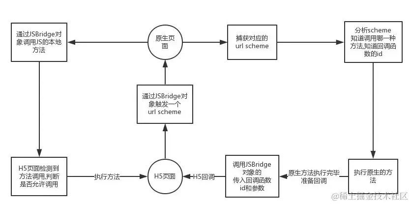
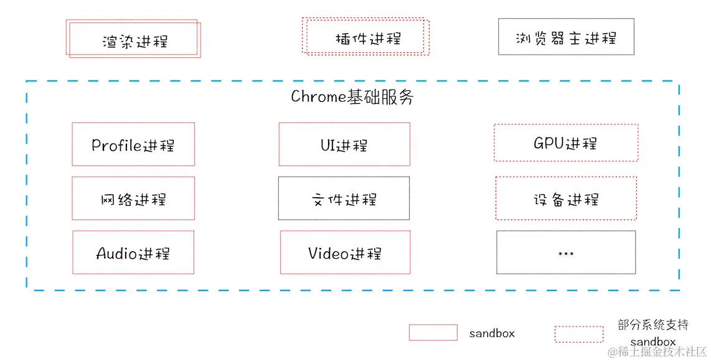
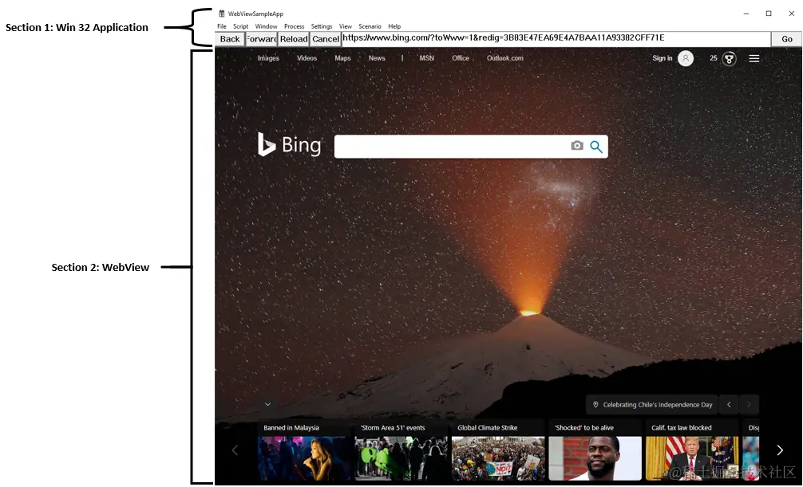

# 浏览器原理和引擎

对于前端，来说，浏览器承载着所有前端项目，要进阶高级前端开发，我认为熟悉浏览器原理和引擎，时非常必要的，所以我把它归类在【计算机基础】中。

# 前端认知下的 WebView

参考：[前端认知下的 WebView - 掘金 (juejin.cn)](https://juejin.cn/post/7275640415905628215)

## 前言

WebView 一般是指移动端用以承载 H5 页面的容器控件；可以在移动应用程序中嵌入网页内容，实现内置浏览器的功能。

> **简单理解来说，** 类似于页面中的 iframe，原生 App 与 WebView 的交互可以简单看作是页面与页面内 iframe 页面进行的交互。
>
> 当然实现方式及用途都不同， WebView 是原生应用程序提供的控件，由原生应用程序加载并控制；而 iframe 是 HTML 标签，由浏览器解析和控制。

我们试着围绕周边知识点，从更广的角度来认识它。

## 原生 App 中的 WebView 容器

### HyBrid 混合开发

现在很多公司开发的 App 应用，都采用 Hybrid 混合开发的方式。

这是介于 Web App、Native App 这两者之间的 App 开发技术，兼具“**Native App 良好交互体验的优势**”和“**Web App 跨平台开发的优势**”。

> 不过，我认为大部分公司的目的其实是减低成本，提高前端开发的人效。甚至不少 App 扒开一看，就剩个原生的壳子，实际业务全是 H5 页面。

就算不采用 Hybrid 混合开发的模式，在移动 App 里内嵌 H5 页面，已经是最常见的诉求。

### 而在 App 中的 H5 运行环境可以分为以下几种：

1. 系统自带浏览器：移动设备都会自带了一个浏览器应用程序，比如 Android 自带的 Chrome 内核 浏览器和 iOS 自带的 Safari 浏览器等。在应用程序中，可以通过调用系统自带浏览器的接口，将网页内容展示在应用程序中。
2. 第三方浏览器内核：比如 Chromium 内核、WebKit 内核等，这些浏览器内核可以作为库集成到应用程序中，提供浏览器功能。
3. WebView：它是一个控件，提供一个沙箱环境用以运行 HTML、JS 等运行时；在 Android 平台，WebView 内核是 Chrome 或 Webkit；在 iOS 平台，WebView 内核是 WKWebView 或 UIWebView；

### 可以开多少个 WebView

在移动设备上，可以同时打开多个 WebView，但是每个 WebView 实例都会消耗系统资源。因此，通常建议尽量避免打开过多的 WebView 实例，以提高应用程序的性能和稳定性。一般来说，最好控制 WebView 的数量，避免同时打开过多的 WebView 实例，通常应该在应用程序中使用单个 WebView 实例，并在需要时重新加载或替换其内容。

在具体实现上，可以通过管理 WebView 实例的生命周期和资源来优化应用程序的性能，例如使用缓存、按需加载、延迟加载等技术来减少 WebView 的创建和销毁次数，从而减少资源消耗。

### 实际开发中遇到的问题：

#### 一般什么时候需要新开 WebView?

1.独立的业务链接，保证操作的完整性及体验；

2.需要在一些列操作后，返回到某个入口页。比如购买商品支付，可以通过入口处新开 WebView，在操作成功后，直接关闭整个 WebView ，返回到入口页。

#### 遇到 IOS 中无法通过`history.go(-1)`返回到上一个 WebView。

在 iOS 中，如果使用的是 WKWebView 来显示网页内容，可能会出现无法返回到上一个 WebView 的情况。这是因为 WKWebView 在加载网页时会创建一个新的浏览器进程，而这个进程与主线程是分离的，因此直接调用 goBack() 方法可能会导致无法返回到上一个 WebView。

这时需要代码做兼容处理，通过调用 WebView 上的方法，返回到上一个 WebView；

```javascript
if (window.history.length > 0) {
	history.go(-1);
} else {
	// 如果无法成功返回，则使用WebView的goBack()方法返回
	window.WebView.goBack();
}
```

这就是我们对 WebView 最直接的认知来源。不过大部分 Webview 的问题一般都由原生客户端开发团队去踩坑解决，不用前端操心。

## 微信小程序 WebView

**小程序本质上也是 Hybrid 技术的应用**。只是魔改了运行环境、内核，做成了半封闭的生态圈。

在微信小程序中，通过 **wx.navigateTo**、**wx.redirectTo** 和 **wx.reLaunch** 方法打开的页面，都是在一个新的 WebView 中打开的。

> **wx.navigateTo** 方法会打开一个新页面，该页面会被推入页面栈中，当前页面会被保留在页面栈中，新页面将在一个新的 WebView 中打开。
>
> **wx.redirectTo** 方法也会打开一个新页面，但是该页面将替换当前页面，不会保留在页面栈中。新页面也将在一个新的 WebView 中打开。
>
> **wx.reLaunch** 方法会关闭所有页面，打开一个新页面，新页面也将在一个新的 WebView 中打开。

在微信小程序中，同时可以存在最多 10 个 WebView 实例，包括当前页面和打开的其他页面。

当打开新页面时，微信小程序会创建一个新的 WebView 实例，该实例与原始页面使用不同的线程运行，并且可以独立于其他 WebView 实例运行。但是，由于每个 WebView 实例都会消耗系统资源，因此在实际开发中，控制打开的 WebView 数量，以确保应用程序的性能和稳定性。

### 在微信小程序中页面，通过 web-view 打开一个新的 H5 页面，有几个 WebView?

答案是 2 个，在微信小程序中，一个页面内通过 **web-view** 组件打开的 H5 页面也是在一个新的 WebView 中打开的，而不是在当前 WebView 中打开。这个新的 WebView 实例是独立于当前 WebView 实例的，拥有自己的 JavaScript 执行环境和渲染引擎。

需要注意的是，在微信小程序中，**web-view** 组件所打开的 H5 页面是运行在微信客户端内部的，而不是在真正的浏览器环境中运行。因此，**web-view** 组件所支持的 Web API 和浏览器特性可能与真正的浏览器有所不同。

### 微信内部的 H5 运行环境使用的是什么？

微信内部的 H5 运行环境使用的是自研的 XWeb 无头浏览器内核，它最早是基于 Chromium 进行开发和优化。

其他的钉钉小程序和飞书小程序等的浏览器环境并非公开透露的信息。不过，可以推测它们可能使用了自研的浏览器内核或者集成了第三方的浏览器内核来进行魔改。

### H5 页面与小程序的通信

微信目前直接通过提供 JSSDK 的方式，实现对原生的交互通信机制；

[web-view | 微信开放文档](https://developers.weixin.qq.com/miniprogram/dev/component/web-view.html)

## WebView 与原生 Native 通信交互

[Android / iOS WebView 容器下 JSBridge SDK 原理浅析](https://mp.weixin.qq.com/s/h_vmDxBjNWJnoopRArYwCg)

H5 页面运行在移动端上的 WebView 容器之中，WebView 容器功能受限于应用程序的安全限制等原因，很多业务场景下 H5 需要依赖原生端上提供的信息/能力，这时我们需要在 WebView 与原生 Native 之间借助于一套协议来作为连接的桥梁。 这个桥梁就是 **JSBridge**，让 Web 端和 Native 端得以实现双向通信。

并且因为 Android、iOS 的 WebView 内核的不同、通信机制有所区别，所以一般还需要 **JSBridge 桥接层**做好兼容处理。

### Native 向 Web 发送消息

Native 向 Web 发送消息基本原理上是在 WebView 容器中动态地执行一段 JS 脚本，通常情况下是调用一个挂载在 window 上全局上下文的方法。

### Web 向 Native 发送消息

Web 向 Native 发送消息目前业界主流的实现方案有两种，分别是**注入式**和**拦截式**。

1. **注入式**，它的原理是 Native 向 WebView 的 JS 全局上下文对象 window 中注入对象或者方法。Web 中通过 JS 调用挂载的方法，即可触发相应的 Native 代码逻辑。
2. **拦截式，** 原理就是双方在此之前约定一种特定的请求格式，Native 会拦截 WebView 内的某类特定的 URL Scheme，满足约定则根据 URL 来执行对应的 Native 方法，若不是则直接转发。

- - 例如通过`location.href = `myApp://go/web?mUrl=${encodeURIComponent(url)}``新开 WebView;

在目前主流的实现中，主要采用以注入式为主、拦截式为兜底策略进行通信。

**注入式 JSSDK 简单代码：**

```typescript
// bridge
import isPlainObject from 'lodash/isPlainObject';
import ENV from './env'; // 环境变量

const { isBridge, version } = ENV;

class Bridge {
  private readyPromise: Promise<any>;

  constructor() {
    if (isBridge) {
      this.readyPromise = this.ready();
    }
  }

  // 处理返回数据
  public async exec(name, params): Promise<any> {
    if (!isBridge) {
      return console.error('请使用 XX App 容器打开页面');
    }

    await this.readyPromise;

    const command = isPlainObject(params) ? params.command : '';
    const directive = [name, command].join(':');

    return new Promise((resolve) => {
      window.WebViewJavascriptBridge.callHandler(
        name,
        params,
        (response) => {
          if (typeof response === 'string') {
            response = JSON.parse(response);
          }
          if (response.code !== 0) {
            Promise.reject(`调用 XX App jsbridge: ${directive} 命令错误`);
          }
          resolve(response.data);
        },
        (fail) => {
          Promise.reject(`调用 XX App jsbridge: ${directive} 命令错误`);
        }
      );
    });
  }

  /**
   * comand交互
   */
  public async command(command, params?) {
    return await this.exec('command', { command, values: params });
  }

  /**
   * 注册交互
   */
  public async registerHandler(...props) {
    if (!isBridge) {
      return;
    }
    await this.readyPromise;
    return window.WebViewJavascriptBridge.registerHandler(...props);
  }

  private ready() {
    return new Promise((resolve) => {
      // 设置超时阀值
      const timer = setTimeout(() => {
        Promise.reject('JSBridge注入失败');
      }, 5e3);
      // 计时开始
      const before = performance.now();
      // WebViewJavascriptBridge 初始化任务
      const init = () => {
        clearTimeout(timer);
        if (window.WebViewJavascriptBridge.init && !window.WebViewJavascriptBridge.inited) {
          window.WebViewJavascriptBridge.init();
        }
        resolve();

        //其他逻辑，统计、发送日志等
        //...
      };

      if (window.WebViewJavascriptBridge) {
        init();
      } else {
        document.addEventListener('WebViewJavascriptBridgeReady', init, false);
      }
    });
	};

export default new Bridge();


// page.js
// 通过bridge使用
import bridge from 'bridge';

// 获取原生App上的用户数据
async getUserInfo() {
    return await this.command('getUserInfo');
}
// 注册监听回退事件
bridge.registerHandler('h5goBack', () => {
  bridge.exec('closeWebView', data);
});
```

**URL 拦截式基本过程是:**

H5->通过某种方式触发一个 url->Native 捕获到 url，进行分析->原生做处理->Native 调用 H5 的 JSBridge 对象传递回调。



## 内核架构

绕不开的，首先得了解浏览器的内核架构。

### 浏览器内核架构

现代浏览器是多进程多线程架构的。

经历：单进程架构 -> 多进程架构 -> 未来**面向服务化**的架构(SOA)；

从下面的这个问题了解多进程架构；

#### Chrome 打开一个页面会启动多少进程？

目前多进程架构：最新的 Chrome 浏览器包括：1 个浏览器（Browser）主进程、1 个 GPU 进程、1 个网络（NetWork）进程、多个渲染进程和多个插件进程。

- **浏览器进程**。主要负责界面显示、用户交互、子进程管理，同时提供存储等功能。
- **渲染进程**。核心任务是将 HTML、CSS 和 JavaScript 转换为用户可以与之交互的网页，排版引擎 Blink 和 JavaScript 引擎 V8 都是运行在该进程中，默认情况下，Chrome 会为每个 Tab 标签创建一个渲染进程。出于安全考虑，渲染进程都是运行在沙箱模式下。
- **GPU 进程**。其实，Chrome 刚开始发布的时候是没有 GPU 进程的。而 GPU 的使用初衷是为了实现 3D CSS 的效果，只是随后网页、Chrome 的 UI 界面都选择采用 GPU 来绘制，这使得 GPU 成为浏览器普遍的需求。最后，Chrome 在其多进程架构上也引入了 GPU 进程。
- **网络进程**。面向渲染进程和浏览器进程等提供网络下载功能，主要负责页面的网络资源加载，之前是作为一个模块运行在浏览器进程里面的，直至最近才独立出来，成为一个单独的进程。
- **插件进程**。主要是负责插件的运行，因插件易崩溃，所以需要通过插件进程来隔离，以保证插件进程崩溃不会对浏览器和页面造成影响。


**Tips:** 浏览器的架构是一直在演变的。目前 Chrome 正处在老的架构向服务化架构过渡阶段。会发现越来越多的服务（Service）进程出现。比如上图中的 "Storage Service"；

Chrome“面向服务的架构”进程模型图：



多线程主要指的是**渲染进程是多线程**的， 它包含了以下多个线程：**渲染主线程、GUI 渲染线程、JS 引擎线程、事件触发线程、定时触发器线程、合成线程、** I **/O 线程等等。**

**各线程的任务是通过浏览器的任务调度机制，调度到到主线程上执行的**。

这里就不展开赘述了。

### 移动 App 中 WebView 的架构演变

目前，在应用内打开多个 WebView 时，通常不会创建多个进程，而是在应用进程内创建多个 WebView 实例。每个 WebView 实例都运行在应用进程的上下文中，共享应用进程的资源和内存空间。这种方式比多进程的实现更轻量级，因此在某些情况下可能更适合应用程序。

但从浏览器架构的演变，其实也能推测 移动 App 中 WebView 的架构演变。

**这是载自 ChatGPT 的回答：**

移动 App 中 WebView 的架构演变可以分为以下几个阶段：

> 1. 简单的 WebView：最初的移动 App 中的 WebView 通常是单个 WebView 实例，没有特别的架构设计。这种设计简单易实现，但同时也存在一些性能和安全问题。
> 2. 多 WebView 实例架构：随着移动 App 越来越复杂，一些应用开始采用多 WebView 实例的架构，即为每个页面或功能模块创建一个单独的 WebView 实例。这种架构可以提高应用程序的性能和稳定性，但同时也增加了开发和管理的复杂度。
> 3. 多进程架构：为了进一步提高性能和稳定性，一些应用开始采用多进程架构，即为每个 WebView 实例创建一个单独的进程。这样做可以实现更好的隔离性和安全性，但同时也带来了更高的资源占用和管理难度。
> 4. 混合应用架构：随着移动 App 需要实现越来越丰富的用户交互体验，一些应用开始采用混合应用架构，即将 WebView 和原生组件结合使用。这种架构可以充分利用 Web 技术和原生技术的优势，实现更加丰富和高效的用户界面和交互效果。但同时也需要解决 WebView 和原生组件之间的通信和协作问题，增加了开发和测试的复杂度。
>
> 总的来说，移动 App 中 WebView 的架构演变主要是为了实现更好的性能、稳定性和用户体验，并在此过程中不断优化和平衡各种因素。

## 了解 Microsoft Edge WebView2

[learn.microsoft.com/zh-cn/micro…](https://learn.microsoft.com/zh-cn/microsoft-edge/webview2/)

在 21 年初，Microsoft 推出了 WebView2;

Microsoft Edge WebView2 是应用开发人员在 Windows 应用程序中嵌入 Web 内容 (（如 HTML、JavaScript 和 CSS) ）的一种方式。 通过将 WebView2 控件包含在应用中，开发人员可以为网站或 Web 应用编写代码，然后在其 Windows 应用程序中重复使用该 Web 代码，从而节省时间和精力。

使用 WebView2 可以在本机应用的不同部分嵌入 Web 代码，或在单个 WebView2 实例中生成所有本机应用。


实例：



### Microsoft Edge 和 WebView2 之间的差异

WebView2 基于 Microsoft Edge 浏览器。 你有机会将功能从浏览器扩展到基于 WebView2 的应用，这非常有用。 但是，由于 WebView2 不限于类似浏览器的应用，因此需要修改或删除一些浏览器功能。

WebView2 目前基本只能在 window10 以上环境 下运行，不支持跨平台；且已经随着 window 11 系统预装在用户电脑上。

WebView2 提供了更好的性能、更高的兼容性和更多的功能。未来更多类似 WebView2 这样的技术，势必也会拓展前端的领域。

## 最后

> 计算机科学领域里的任何问题，都可以通过引入一个中间层来解决。

在浏览器这些底层内核架构的快速演变中也同样适用这句话，不断抽象、分层、替换，悄无声息地改变着。而我们则需要不断提升认知。

**参考链接**

- [李兵-浏览器工作原理与实践](https://time.geekbang.org/column/article/113513)
- [Android / iOS Webview 容器下 JSBridge SDK 原理浅析](https://mp.weixin.qq.com/s/h_vmDxBjNWJnoopRArYwCg)
- [Microsoft Edge WebView2 简介](https://learn.microsoft.com/zh-cn/microsoft-edge/webview2/)
