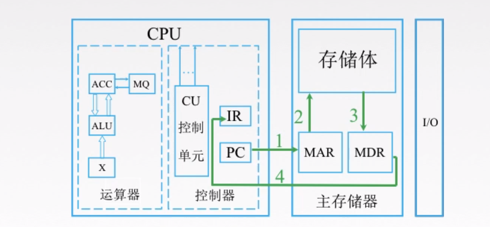

# 计算机组成原理

前端开发人员中，有相当大比例的同学不是科班出来的，所以对于基本的科班`必修课`，例如：`计算机组成原理`、`操作系统`、`计算机网络`、`数据结构和算法`等知识接触不多。

当你越深入学习，越会发现这些知识的重要性。

比如大家都知道 js 里面`0.1 + 0.2` 是`不等于0.3`的，为什么呢？这就牵扯到计算机组成原理中`浮点数`的表示方法，以及`浮点数`的加减运算（正文会有白话版解答）。

又例如从键盘输入`a+b`这个指令，如何通过`cpu`的调度输出到`屏幕上`呢？这就涉及到`冯诺依曼体系`，如果你是编程人员，都不清楚数据从键盘到屏幕的`基本流向`，那是时候看看这篇'十全大补文'了

本文是一篇`计算机组成原理`最基本的入门文章，我觉得前端没有必要那么深入这个专题，掌握基本的`计算机组成原理`的常识即可。

### 1、计算机的工作原理

首先，计算机最基本的 5 大组成部分如下图，分别为：`输入设备`(比如键盘), `存储器`(比如内存), `运算器`(cpu), `控制器`(cpu), `输出设备`(显示器)。


工作原理如下

#### 1.1 控制器 ---> 控制输入设备 ----> 指令流向内存

当我们输入数据的时候，cpu 里的`控制器`会让`输入设备`把这些指令存储到`存储器`(内存)上。


#### 1.2 控制器分析指令 ---> 控制存储器 ---> 把数据送到运算器

控制器分析指令之后， 此时让`存储器`把数据发送到`运算器`里(`控制器`和`运算器`都在`cpu`里面)

这里需要注意，`存储器`既能`存储数据`，还能`存储指令`


#### 1.3 控制器控制运算器做数据的运算 并且将运算结果返回存储器


#### 1.4 控制器控制存储器将结果返回给输出设备


从接下来，我们更近一步，看看计算机内部，CPU 是怎么跟存储器交互的。

### 2、CPU 及其工作过程

CPU 中比较重要的两个部件是`运算器`和`控制器`，我们先来看看运算器的主要作用

#### 2.1 运算器主要部件


如上图，运算器里最重要的部件是`ALU`，中文叫`算术逻辑单元`，用来进行`算术`和`逻辑运算`的。其它的`MQ`,`ACC`这些我们不用管了，是一些`寄存器`。

#### 2.2 控制器主要部件


控制器中最重要的部件是`CU`（控制单元），只要是`分析指令`，给出`控制信号`。

`IR`（指令寄存器），存放当前需要执行的指令

`PC`存放的指令的地址。

#### 2.3 举例 - 取数指令执行过程

首先，是取指令的过程如下



- 第一步，`PC`，也就是存放指令地址的地方，我们要知道下一条指令是什么，就必须去存储器拿，`CPU`才知道接下来做什么。`PC`去了存储器的`MAR`拿要执行的指令地址，`MAR`（存储器里专门存指令地址的地方）
- 第二步和第三步，`MAR`去存储体内拿到指令之后，将指令地址放入`MDR`(存储器里专门存数据的地方)
- 第四步`MDR`里的数据返回到`IR`里面，`IR`是存放指令的地方，我们把刚才从存储体里拿的指令放在这里

然后，分析指令，执行指令的过程如下


- 第五步， `IR`将指令放入`CU`中，来分析指令，比如说分析出是一个取数指令，接着就要执行指令了（这里取数指令，其实就是一个地址码，按着这个地址去存储体取数据）
- 第六步，第七步 `IR`就会接着去找存储体里的`MAR`（存储地址的地方），`MAR`就根据取数指令里的地址吗去存储体里去数据
- 第八步，取出的数据返回给`MDR`（存放数据的地方）
- 第九步，`MDR`里的数据放到运算器的寄存器里，这里的取指令的过程结束了。

来个插曲，我们知道数据在`内存`里是`二进制`存着，也就是`0和1`, `0和1`怎么用表示呢？

我们拿其中一种存储 0 和 1 的方式来说明

- 电容是否有电荷，有电荷代表 1，无电荷代表 0

- 如下图

  


### 3、计算机编程语言

我们看看机器语言，怎么表示存放一个数的指令，例如下图


我们来看二进制代码 `0000，0000，000000010000`

- 其中第一个`0000`，表示的是汇编语言里的`LOAD`，也就是加载，加载什么呢
- 加载地址`000000010000`上的数据到第二个`0000`（寄存器的位置）。

接下来，我们看看如果是`汇编语言`怎么表示


`LOAD A, 16`意思是将存储体内的 16 号单元数据，放到寄存器地址 A 中 `ADD C, A, B`意思是将寄存器里的 A,B 数据相加，得到 C `STORE C, 17`意思是将寄存器里的数据存到存储体 17 号单元内

最后，我们看看怎么用`高级语言`表示


高级语言是不是很简单，就一个`a+b`，你都不用去考虑`寄存器`，`存储体`这些事。

#### 这部分的总结

高级语言一般有两种方式转换为机器语言

- 一种是直接借助`编译器`，将高级语言转换为`二进制`代码，比如`c`，这样`c`运行起来就特别快，因为编译后是机器语言，直接就能在系统上跑，但问题是，编译的速度可能会比较慢。
- 一种是解释性的，比如 `js`，是将代码翻译一行成`机器语言`（中间可能会先翻译为`汇编`代码或者`字节码`），解释一行，执行一行

需要注意的是，按照第一种将大量的高级代码翻译为机器语言，这其中就有很大的空间给`编译器`做代码优化，解释性语言就很难做这种优化，但是在`v8`引擎中，`js`还是要被优化的，在`编译阶段`（代码分`编译`和`执行`两个阶段）会对代码做一些优化，编译后立即执行的方式通常被称为 `JIT (Just In Time) Comipler`。

### 4、进制转换

接下来 4.3 这个小节会解释为什么 0.1 + 0.2 等于 0.3

#### 4.1 二进制如何转化为十进制

例如`2`进制`101.1`如何转化为`10`进制。（有些同学觉得可以用`parseInt('101.1', 2)`，这个是不行的，因为`parseInt`返回整数）

转化方法如下：


上图的规则是什么呢？

`二进制`的每个数去`乘以2`的相应次方,注意小数点后是乘以它的`负相应次方`。 再举一个例子你就明白了，

二进制`1101`转为十进制


#### 4.2 十进制整数转为二进制

`JS`里面可以用`toString(2)`这个方法来转换。如果要用通用的方法，例如：将十进制数`（29）`转换成二进制数， 算法如下：

- 把给定的十进制数 29 除以 2，商为 14，所得的余数 1 是二进制数的最低位的数码
- 再将 14 除以 2，商为 7，余数为 0
- 再将 7 除以 2，商为 3，余数为 1，再将 3 除以 2，商为 1，余数为 1
- 再将 1 除以 2，商为 0，余数为 1 是二进制数的最高位的数码


其结果为：11101

#### 4.3 十进制小数转为二进制

方式是采用“乘 2 取整，顺序排列”法。具体做法是：

- 用 2 乘十进制小数，可以得到积，将积的整数部分取出-
- 再用 2 乘余下的小数部分，又得到一个积，再将积的整数部分取出-
- 如此进行，直到积中的小数部分为零，或者达到所要求的精度为止

我们具体举一个例子

如: 十进制 0.25 转为二进制

- `0.25 * 2 = 0.5` 取出整数部分：`0`
- `0.5 * 2 = 1.0` 取出整数部分 1

即十进制`0.25`的二进制为 `0.01` ( 第一次所得到为最高位,最后一次得到为最低位)

此时我们可以试试十进制`0.1`和`0.2`如何转为二进制

```
0.1(十进制) = 0.0001100110011001(二进制)
十进制数0.1转二进制计算过程：
0.1*2＝0.2……0——整数部分为“0”。整数部分“0”清零后为“0”，用“0.2”接着计算。
0.2*2＝0.4……0——整数部分为“0”。整数部分“0”清零后为“0”，用“0.4”接着计算。
0.4*2＝0.8……0——整数部分为“0”。整数部分“0”清零后为“0”，用“0.8”接着计算。
0.8*2＝1.6……1——整数部分为“1”。整数部分“1”清零后为“0”，用“0.6”接着计算。
0.6*2＝1.2……1——整数部分为“1”。整数部分“1”清零后为“0”，用“0.2”接着计算。
0.2*2＝0.4……0——整数部分为“0”。整数部分“0”清零后为“0”，用“0.4”接着计算。
0.4*2＝0.8……0——整数部分为“0”。整数部分“0”清零后为“0”，用“0.8”接着计算。
0.8*2＝1.6……1——整数部分为“1”。整数部分“1”清零后为“0”，用“0.6”接着计算。
0.6*2＝1.2……1——整数部分为“1”。整数部分“1”清零后为“0”，用“0.2”接着计算。
0.2*2＝0.4……0——整数部分为“0”。整数部分“0”清零后为“0”，用“0.4”接着计算。
0.4*2＝0.8……0——整数部分为“0”。整数部分“0”清零后为“0”，用“0.2”接着计算。
0.8*2＝1.6……1——整数部分为“1”。整数部分“1”清零后为“0”，用“0.2”接着计算。
……
……
所以，得到的整数依次是：“0”，“0”，“0”，“1”，“1”，“0”，“0”，“1”，“1”，“0”，“0”，“1”……。
由此，大家肯定能看出来，整数部分出现了无限循环。
```

接下来看`0.2`

```
0.2化二进制是
0.2*2=0.4,整数位为0
0.4*2=0.8,整数位为0
0.8*2=1.6,整数位为1,去掉整数位得0.6
0.6*2=1.2,整数位为1,去掉整数位得0.2
0.2*2=0.4,整数位为0
0.4*2=0.8.整数位为0
就这样推下去！小数*2整,一直下去就行
这个数整不断
0.0011001
```

所以`0.1`和`0.2`都无法完美转化为二进制，所以它们相加当然不是`0.3`了

### 5、定点数和浮点数

首先，什么是定点数呢？

#### 5.1 定点数


如上图，举例纯整数的二进制`1011`和`-1011`，如果是`整数`，符号位用`0`表示，如果是`负数`符号为用`1`表示


同理，纯小数表示举例如下：


那如果不是`纯小数`或者`纯整数`，该怎么表示呢？

比如`10.1`, 可以乘以一个比例因子，将`10.1 ---> 101` 比例因子是`10`, 或者`10.1 ---> 0.101`比例因子是`100`

定点数很简单，接下来我们介绍浮点数，再 JS 里面，数字都是用`双精度的浮点数`，所以学习浮点数对我们理解 JS 的数字有帮助。

#### 5.2 浮点数

浮点数怎么表示呢？


上面是`十进制`的科学计数法，从中我们需要了解几个概念，一个是`尾数`，`基数`和`阶码`

- `尾数`必须是纯小数，所以上图中`1.2345`不满足尾数的格式，需要改成`0.12345`
- `基数`，在二进制里面是`2`
- `阶码`就是多少次方

所以`浮点数`的`通用`表示格式如下：


- S 代表尾数
- r 代表基数
- j 代表阶码

这里需要注意的是，浮点数的加减运算，并不是像我们上面介绍的那样简单，会经过以下几个步骤完成


这些名词大家感兴趣的话，可以去网上查询，我们只要了解到`浮点数加减运算`很麻烦就行了，但如果你要做一个浮点数运算的库，你肯定是要完全掌握的。

### 6、局部性原理和 catche(缓存)

先看下图


（说明一下，`MDR`和`MAR`虽然逻辑上属于主存，但是在`电路实现`的时候，`MDR`和`MAR`离`CPU`比较近）

上图是在执行一串代码,可以理解为 js 的 for 循环

```js
const n = 1000;
const a = [1, 2, 3, 4, 5, 6, 7];
for (let i = 0; i < n; i++) {
	a[i] = a[i] + 2;
}
```

我们可以发现

- 数组的数据有时候在内存是连续存储的
- 如果我们要取数据，比如从内存取出 a[0]的数据需要 1000ns(ns 是纳秒的意思),那么取出 a[0]到 a[7]就需要 1000 \* 8 = 8000 ns
- 如果我们 cpu 发现这是取数组数据，那么我就把就近的数据块 a[0]到 a[7]全部存到缓存上多好，这样只需要取一次数据，消耗 1000ns

`cahce`就是`局部性原理`的一个应用


- `空间局部性`：在最近的未来要用到的信息（`指令`和`数据`），很可能与现在正在使用的信息在`存储空间`上是邻近的
- `时间局部性`：在最近的未来要用到的信息，很可能是现在`正在使用的信息`


可以看到`cache`一次性取了`a[0]`到`a[9]`存储体上的数据，只需要`1000ns`，因为`Cache`是`高速存储器`，跟`cpu`交互速度就比`cpu`跟`主存`交互速度快很多。

接下里，进入最后一节(略过对总线知识的学习)，I/O 设备的演变

### 7、I/O 设备的演变

I/O 是什么呢？

```
输入/输出（Input /Output ,简称I/O），指的是一切操作、程序或设备与计算机之间发生的数据传输过程。
```

比如文件读写操作，就是典型的`I/O`操作。接下来我们看一下 I/O 设备的演进过程


在早期的计算机里，`cpu`如何知道`I/O设备`已经完成任务呢?比如说怎么知道`I/O设备`已经读取完一个文件的数据呢?`CPU`会不断查询`I/O设备`是否已经准备好。这时，`cpu`就处于等待状态。也就是`cpu`工作的时候，`I/O`系统是不工作的，`I/O`系统工作，`cpu`是不工作。

接着看第二阶段


- 为了解决第一阶段`CPU`要等待`I/O设备`，`串行`的工作方式，所有`I/O设备`通过`I/O总线`来跟`CPU`打交道，一旦某个`I/O设备`完成任务，就会以`中断请求`的方式，通过`I/O总线`，告诉`CPU`，我已经准备好了。
- 但是对于`高速外设`，它们完成任务的速度很快，所以会频繁中断`CPU`, 为了解决这个问题，高速外设跟主存之间用一条直接数据通路，`DMA总线`连接，`CPU`只需要安排开始高速外设做什么，剩下的就不用管了，这样就可以防止频繁中断`CPU`。

最后来看一下第三阶段


第三阶段，CPU 通过通道控制部件来管理 I/O 设备，CPU 不需要帮它安排任务，只需要简单的发出启动和停止类似的命令，通道部件就会自动的安排相应的 I/O 设备工作

# 其他待定
