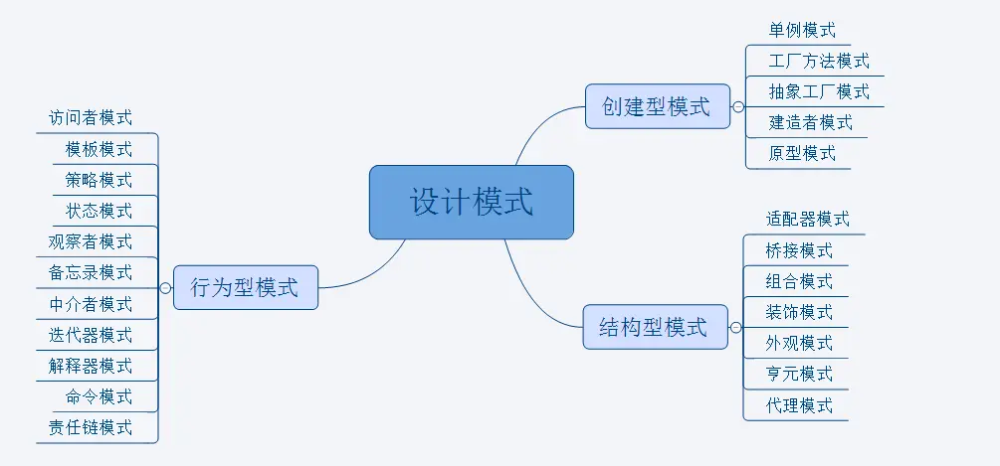

# 设计模式

## 1、前言

- 每个设计模式我都用一个很简单的例子来让大家去理解，入门为主，深入为辅
- 毕竟深入设计模式还需要在实际写代码、优化代码的过程中去深化理解（即需要自己遇到该用的场景）
- 并不会列举所有的设计模式，比如 java 里的建造者模式，我自己没有实际场景用过，所以体会不深，我们就略过。

## 2、设计模式有哪些

我们先来看看 java 里设计模式有哪些



好了，我们就用这张图作为引子，开撸了！！！go! go !go!

### 2.1 设计模式的 6 大原则

这里我们只关心两大原则(是 js 常用的两大原则，单一职责原则和开关闭合原则，既然入门，内容就越简单越好)

- S(SRP)单一职责原则

单一职责原则很简单，一个方法 一个类只负责一个职责，各个职责的程序改动，不影响其它程序。

```javascript
// 个人认为组件化思想就是单一职责原则很好的体现
// 组件的好处在于如果我们有10个页面都需要这个组件，那么我们就可以重用这个组件，复用代码
// 而且当这个组件的逻辑需要改变的时候，一般情况下我们只需要改这个组件本身的逻辑就好了，不影响其它组件
```

- O(SCP)开放封闭原则

如类、模块和函数，应当对扩展开放，但对修改关闭

```javascript
// 举个例子，我最深的体会就是固定逻辑抽象出来，然后不固定的逻辑方便拓展
// 这里我们可以看到，getUserInfo就是获取用户信息的逻辑是不变的，我们就封装到一个方法里，这就是固定逻辑
const getUserInfo = function (callback) {
	$.ajax("http:// xxx.com/getUserInfo", callback);
};

// 但是用获取的信息做的事情可能不同，是变化的，这就是不固定的逻辑
getUserInfo((data) => {
	console.log(data.userName);
});
getUserInfo((data) => {
	console.log(data.userId);
});
```

## 3、创建型设计模式

在我看来创建型设计模式就是如何创建对象的设计模式，比如我们常见的创建对象如下

```javascript
const obj = new Object();
```

但实际写代码的过程中，创建对象的复杂度比上面的代码高很多。接下来介绍一种常见的创建对象的设计模式叫简单工厂模式

### 3.1、简单工厂模式

这个模式我个人觉得核心意义在于只暴露出一个工厂方法，实际上建造什么样的实例对象（也就是 new 哪一个构造函数）我们不用关心。（我在 react15 版本源码里看到 createElement()方法就是用的这种模式）

```javascript
// 暴露出一个工厂类，或者你也写成构造函数也行，比如说这个工厂类叫User，构造不一样的角色，不同的角色的有不一样的属性
class User {
	//构造器
	constructor(opt) {
		this.viewPage = opt.viewPage;
		this.name = opt.name;
	}

	//静态方法，这是内部实现工厂方法的细节
	static getInstance(role) {
		switch (role) {
			case "superAdmin":
				return new User({
					name: "超级管理员",
					viewPage: ["首页", "通讯录", "发现页", "应用数据", "权限管理"],
				});
				break;
			case "admin":
				return new User({
					name: "管理员",
					viewPage: ["首页", "通讯录", "发现页", "应用数据"],
				});
				break;
			case "user":
				return new User({
					name: "普通用户",
					viewPage: ["首页", "通讯录", "发现页"],
				});
				break;
			default:
				throw new Error("参数错误, 可选参数:superAdmin、admin、user");
		}
	}
}

//调用
let superAdmin = User.getInstance("superAdmin");
let admin = User.getInstance("admin");
let normalUser = User.getInstance("user");
```

### 3.2、单例模式

保证一个类仅有一个实例。我们简单看一下代码就明白什么意思了，单例模式还是比较好理解。

```javascript
// 这是单例类
var Singleton = function (name) {
	this.name = name;
};

// 暴露出一个静态方法，来获取单例
Singleton.getInstance = (function () {
	var instance = null;
	return function (name) {
		// 第一次执行getInstance函数，因为变量instance是null，所以执行if里面的语句
		// 第二次执行getInstance函数，因为变量instance是new Singleton( name )，所以执行不执行if里的语句
		if (!instance) {
			instance = new Singleton(name);
		}
		return instance;
	};
})();
```

好啦，创建型设计模式我们就介绍这两种，是不是比唱跳 rap 和篮球要轻松一些呢，接下来介绍结构型设计模式

## 4、结构型设计模式

结构型模式关注于整体最终的结构，通过继承和组合，构建出更加复杂的结构。就拿下面第一个适配器模式，我们很快的理解一下什么叫出更加复杂的结构

### 4.1、适配器模式

是指将一个接口转换成自己希望的另外一个接口。

```javascript
// 比如获取到后端传来的数据，但这个数据不是我们想要的格式
// 这个时候就可以用适配器来转换一下

function ajaxAdapter(data) {
	// 处理数据并返回新数据
	// 通过对象解构，获取list列表,data数据假如是 {code: 200, data: {list: [{name:1}]} }
	const {
		data: { list },
	} = data;
	return list;
}

$.ajax({
	url: "http://zxx",
	success(data) {
		doSomething(ajaxAdapter(data));
	},
});
```

### 4.2、装饰器模式

是指在不改变原对象的基础上，通过对其进行包装拓展（添加属性或者方法）使原有对象可以满足用户更复杂的需求

```javascript
// 我们声明了一个对象小蔡，他只会打篮球
let xiaoCai = {
	sing() {
		console.log("大家好，我是小蔡，我会打篮球");
	},
};

// 我们声明了一个对象小李，他也想学小蔡打篮球
let xiaoLi = {
	sing() {
		console.log("大家好，我是小李，我也想学打篮球");
	},
};

// 小李在B站看了视频之后，也会打篮球了
// 把小李的sing方法保存起来
const xiaoLiSing = xiaoLi.sing;
// 重写小李的sing方法，把小蔡的篮球技术给小李
xiaoLi.sing = () => {
	xiaoLiSing();
	xiaoCai.sing();
};
```

### 4.3、外观模式

为一组复杂的子系统接口提供一个更高级的统一接口，通过这个接口使得对子系统系统接口的访问更容易。

```javascript
// js里比如根据不同浏览器做兼容处理，提供统一接口
// 有的浏览器通过DOM元素的innerText属性获取其中的值,比如<div>hello</div>中hello这个文本
// 有的浏览器通过DOM元素的textContent属性获取其中的值
function getInnerText(element) {
	//判断element是否支持innerText
	if (typeof element.innerText === "string") {
		return element.innerText;
	} else {
		return element.textContent;
	}
}
```

### 4.4、代理模式

是指

- 1、代理（proxy）是一个对象，它可以用来控制对另外一个对象的访问
- 2、代理对象和本体对象实现了同样的接口，并且会把任何方法调用传递给本体对象
- 3、简单的理解就是你需要找一个明星代言你的产品，你拨打的电话一般都是明星经纪人的电话，而不是直接找到明星，这个经纪人其实就是代理，明星是本体

```javascript
// 举例场景是缓存代理
// 缓存是指每次传入的参数和结果缓存到一个对象里
// 这样下一次传入同样的参数，如果之前在缓存对象里，就直接拿缓存里的数据
// 这样就不用每次都要调用函数去计算，有缓存直接用缓存，提升了效率

var plus = function (...argArray) {
	var a = 0;
	for (var i = 0; i < argArray.length; i++) {
		a = a + argArray[i];
	}
	return a;
};

// 高阶函数（将函数作为参数或者返回值的函数）包装一下上面的plus函数
var proxyFactory = function (fn) {
	var cache = {}; // 参数缓存列表
	return function (...argArray) {
		// 将传入的参数变为字符串，作为
		var argString = argArray.join();
		// 如果在缓存里就输出缓存内容
		var argsString = String(argArray);
		if (argsString in cache) {
			return cache[argsString];
		}
		// 如果没有在缓存里就保存在缓存中
		return (cache[argsString] = fn(...argArray));
	};
};
// 测试
const proxyPlus = proxyFactory(plus);
console.log(proxyPlus(5, 6, 7, 8));
```

### 4.5、桥接模式

- 是指在系统沿着多个维度变化的同时，又不增加其复杂度并以达到解耦
- 我的理解就是把公共逻辑抽象成公用逻辑就是桥接模式

```javascript
// 这个例子就是抽象层和实现层的解耦
// 提取共同点（抽象层）给每个对象都添加公共方法，即addMethod方法
Object.prototype.addMethod = function (name, fn) {
	this[name] = fn;
};
// 创建类并实例化对象（实现层）
function Box(x, y, z) {
	this.x = x;
	this.y = y;
	this.z = z;
}

var box = new Box(20, 10, 10);
// 为对象拓展方法（桥接方法）

box.addMethod("init", function () {
	console.log(
		"盒子的长度为：" + this.x + " , 宽度为：" + this.y + " , 高度为：" + this.z
	);
});
// 测试代码
box.init();
```

### 4.6、组合模式

- 是指在程序设计中，组合模式就是用小的子对象来构建更大的对象，而这些小的子对象本身也是由更小的对象组成的。
- 这里只是组合，并没有从属关系。

```javascript
// 这里的场景是加入有一堆命令，通过组合模式构建更复杂的，自定义的命令集合
// 宏命令的代码
var closeDoorCommand = {
	//作为叶对象
	execute: function () {
		console.log("关门");
	},
};
var openPcCommand = {
	//作为叶对象
	execute: function () {
		console.log("开电脑");
	},
};
var openQQCommand = {
	//作为叶对象
	execute: function () {
		console.log("登录QQ");
	},
};
//组合模式的根对象
var MacroCommand = function () {
	return {
		commandsList: [],
		add: function (command) {
			//叶对象作为数组的元素传递到
			//数组中
			this.commandsList.push(command);
		},
		execute: function () {
			//执行组合命令
			for (var i = 0, command; (command = this.commandsList[i++]); ) {
				command.execute(); //叶对象都有execute方法
			}
		},
	};
};
var macroCommand = MacroCommand();
macroCommand.add(closeDoorCommand); //添加到根对象数组中
macroCommand.add(openPcCommand); //同上
macroCommand.add(openQQCommand); //同上
macroCommand.execute(); //执行根命令
```

### 4.7、享元模式

- 运行共享技术有效地支持大量细粒度的对象，避免大量拥有相同内容的小类的开销(如耗费内存)，使大家共享一个类(元类)

```javascript
// 举例对象池子
// 对象池是另外一种性能优化方案，和享元模式有一些相似之处，但没有分离内部状态和外部状态这个过程
// 建立一个对象池工厂 objectPoolFactory
var objectPoolFactory = function (createObjFn) {
	var objectPool = []; //对象池
	return {
		create: function () {
			//取出
			var obj =
				objectPool.length === 0
					? createObjFn.apply(this, arguments)
					: objectPool.shift();
			return obj;
		},
		recover: function (obj) {
			//收回
			objectPool.push(obj);
		},
	};
};
// 现在利用objectPoolFactory来创建一个装载一些iframe的对象池
var iframeFactory = objectPoolFactory(function () {
	var iframe = document.createElement("iframe");
	document.body.appendChild(iframe);
	iframe.onload = function () {
		iframe.onload = null; //防止iframe重复加载的bug
		iframeFactory.recover(iframe); //iframe加载完成后往对象池填回节点(收回)
	};
	return iframe;
});
//调用
var iframe1 = iframeFactory.create();
iframe1.src = "http://www.qq.com";
```

## 5、行为型设计模式

创建型设计模式解决了如何创建对象，那创建对象后能做什么呢，接着结构型模式描述如何将类和对象组合起来，形成更大的结构。

最后就是行为型设计模式闪亮登场了，行为型设计模式不仅仅关注类和对象的结构，而且重点关注它们之间的相互作用。

### 5.1、模板方法模式

它定义一个操作中的算法的骨架，而将一些步骤延迟到子类中。模板方法使得子类可以不改变一个算法的结构即可重定义该算法的某些特定步骤，具体实现 demo 如下

```javascript
// 模板方法分为两部分：1、抽象的父类 2、具体实现的子类
// 父类，我们这里举例称作饮料类，即Beverage
class Beverage {
	// 冲饮料第一步需要把水煮沸
	boilWater() {
		console.log("把水煮沸");
	}
	// 冲饮料第二部需要把材料放入沸水
	brew() {}
	// 冲饮料第三步把饮料倒进杯子里
	addCoundiments() {}
	init() {
		this.boilWater();
		this.brew();
		this.addCondiments();
	}
}

// 子类，我们假如冲茶
class Tea extends Beverage {
	// 冲饮料第二步需要把材料放入沸水
	brew() {
		console.log("用沸水泡茶");
	}
	// 冲饮料第三步把饮料倒进杯子里
	addCondiments() {
		console.log("把茶放入杯子里");
	}
}
const tea = new Tea();
tea.init();
```

### 5.2、命令模式

将请求与实现解耦并封装成独立对象，从而使不同的请求对客户端的实现参数化

```javascript
// 比如二次封装react的antd组件，我几乎都是用命令模式去封装的
// 在我的运用中，这个设计模式就是用数据去驱动UI，比如用的elementUI\antd组件，是不是放入数据,视图就自动生成了呢
// 这里简单将命令模式应用于canvas绘图
const CanvasCommand = (function(){
        const canvas = document.getElementById('canvas');
        const ctx = canvas.getContext('2d');
        const Action = {
            // 填充颜色
            fillStyle(c){
                ctx.fillStyle = c
            }
            // 填充矩形
            fillRect(x, y, width, height){
                ctx.fillRect(x, y, width, height)
            }
        }
        return {
            execute(msg){
                if(msg.length){
                        msg.forEach((v)=>{
                            Action[v.command].apply(Action, msg.param)
                        } )
                    } else {
                        return
                    }
                }
            }
        }
    })()

    // 写命令
    CanvasCommand.excute([
        {command: 'fillStyle', param: 'red'},
        {command: 'fillRect', param: [20, 20, 100, 100]}
    ])
```

### 5.3、发布-订阅者模式

- 如果要说 web 前端里面只有一种设计模式需要学习，那我觉得就是发布订阅者模式了
- 我不说它繁琐的定义，简单理解就是，大家用过 onClick 函数绑定点击事件吧，当你写好绑定点击事件的函数时，这就叫注册或者订阅了点击事件
- 当你真的点击你绑定的比如 button 或者 div 时，这时叫发布或者触发事件，这就是这个设计模式的运用
- 它的作用比如说 redux、vuex 是为了解决模块之间通信的，实际上解决的是主体对象和观察者之间的耦合

```javascript
// 手写一个基于发布订阅模式的事件绑定机制
const event = {
	// 事件都注册在eventList数组里
	eventList: [],
	/**
	 * 订阅事件函数
	 * @key {string} 订阅事件名称
	 * @fn {function} 订阅事件的回调函数
	 **/
	listen(key, fn) {
		if (typeof fn !== "function") {
			console.log("请添加回调函数");
			return;
		}
		if (!this.eventList[key]) {
			this.eventList[key] = [];
		}
		this.eventList[key].push(fn);
	},
	trigger(key, ...arg) {
		const fns = this.eventList[key];
		if (!fns || fns.length === 0) {
			return false;
		}
		fns.forEach((fn) => {
			fn.apply(this.arg);
		});
	},
};
// 测试
event.listen("click", function () {
	console.log("订阅事件1");
});
event.listen("click", function () {
	console.log("订阅事件2");
});
event.trigger("click");
```

### 5.4、策略模式

- 策略模式是定义一系列算法，把它们一个个封装起来，并且使他们可以相互替换
- 举例如下，假如我们最近我们做了一个投票征集活动，让网友投票选出我们本月最美的图片，每张图片会有以下几种结果 1、A 等级的图片会显示 10 颗星，B 等级的图片会显示 9 颗星，C 等级的图片会显示 8 颗星。。。。以此类推 F 等级图片显示 5 颗星，正常写法如下第一段代码，策略模式改进，如下第二段代码

```javascript
// 常规写法
function showResult(level) {
	if (level === "A") {
		return "10颗星";
	} else if (level === "B") {
		return "9颗星";
	} else if (level === "C") {
		return "8颗星";
	} else if (level === "D") {
		return "7颗星";
	} else if (level === "E") {
		return "6颗星";
	} else if (level === "F") {
		return "5颗星";
	}
}
console.log(showResult("F"));
```

假如 if...else 有 1000 种可能，那么如果这么判断下去，要判断 1000 次才能匹配 if...else 的最后一个条件，效率就特别低，现在我们用策略模式去改进

```javascript
//  策略模式改进，把if的条件定义为一个个的算法
const state = {
	A() {
		return "10颗星";
	},
	B() {
		return "9颗星";
	},
	C() {
		return "8颗星";
	},
	D() {
		return "7颗星";
	},
	E() {
		return "6颗星";
	},
	F() {
		return "5颗星";
	},
};
// 策略模式调用
function showResult(level) {
	return state[level]();
}
console.log(showResult("F"));
```

### 5.5、中介者模式

- 中介者模式主要解决多个对象和类之间的通信复杂度，主要通过一个中介类接受所有消息，然后再进行转发。
- 中介者模式的作用就是接触对象与对象之间的耦合关系（感觉有点像发布订阅者模式呢。。。。）

```javascript
// 写一个JS版的泡泡堂游戏, 这是自己在书上看到的一个很好的中介者模式案例
// 目前玩家是两个人，所以当其中一个玩家死亡的时候游戏便结束，同时通知它的对手胜利
function Player(name) {
	this.name = name;
	this.enemy = null;
}

Player.prototype.win = function () {
	console.log(this.name + "won");
};

Player.prototype.lose = function () {
	console.log(this.name + "lost");
};

Player.prototype.die = function () {
	this.lose();
	this.enemy.win();
};

// 接下来创建2个玩家对象
var player1 = new Player("沈腾");
var player2 = new Player("贾玲");

// 给玩家相互设置敌人
player1.enemy = player2;
player2.enemy = player1;
// 当玩家player1被泡泡炸死的时候，只需要调用这一句代码 便完成了一局游戏
player1.die();

// 接下来，假如玩家数量变为了8个，我们的游戏代码就变成了下面这样
// 以下创建人物的代码这里不需要看懂，接着往后面看就行了，我是怕有些人跑代码跑不通，所以现把队伍的人建立起来
// 定一个数组players来保存所有玩家
var players = [];
// 红队
var player1 = playerFactory("沈腾", "read");
var player2 = playerFactory("黄海波", "read");
var player3 = playerFactory("张全蛋", "read");
var player4 = playerFactory("李大嘴", "read");

// 蓝队
var player5 = playerFactory("小沈阳", "blue");
var player6 = playerFactory("周杰", "blue");
var player7 = playerFactory("贾乃亮", "blue");
var player8 = playerFactory("李小璐", "blue");

// 定义一个工厂来创建玩家
function playerFactory(name, teamColor) {
	var newPlayer = new Player(name, teamColor); // 创建新玩家
	for (var i = 0; i < players.length; i++) {
		// 通知所有玩家,有新角色加入
		var player = players[i];
		if (player.teamColor === newPlayer.teamColor) {
			player.partners.push(newPlayer);
			newPlayer.partners.push(player);
		} else {
			player.enemies.push(newPlayer); // 相互添加敌人列表
			newPlayer.enemies.push(player);
		}
	}
	players.push(newPlayer);
	return newPlayer;
}
// 接着再改写构造函数Player, 使每个玩家对象都增加一些属性，分别是队友列表，敌人列表，玩家当前的状态，角色名字，以及玩家所在队伍的颜色
function Player(name, teamColor) {
	this.partners = []; // 队友列表
	this.enemies = []; // 敌人的状态
	this.state = "live"; // 玩家状态
	this.name = name; // 角色名字
	this.teamColor = teamColor; // 队伍颜色
}

// 玩家胜利和失败之后的展现
Player.prototype.win = function () {
	console.log("winner: " + this.name); // 玩家团队胜利
};
Player.prototype.lose = function () {
	console.log("lose: " + this.name); // 玩家团队失败
};

// 玩家死亡之后要遍历自己的队友，如果队友全部死亡则游戏结束，这局游戏失败，同时通知敌人队伍的所有玩家取得胜利，代码如下
Player.prototype.die = function () {
	// 玩家死亡
	var all_dead = true;
	this.state = "dead"; // 设置玩家为死亡状态
	for (var i = 0, partner; (partner = this.partners[i++]); ) {
		if (partner.state !== "dead") {
			// 如果还有一个队友没有死亡， 则游戏还未失败
			all_dead = false;
			break;
		}
	}
	if (all_dead === true) {
		// 如果队友全部死亡
		this.lose(); // 通知自己游戏失败
		for (var i = 0; i < this.partners.length; i++) {
			// 通知所有队友玩家游戏失败
			var partner = this.partners[i];
			partner.lose();
		}
		for (var i = 0; i < this.enemies.length; i++) {
			// 通知所有敌人游戏胜利
			var enemy = this.enemies[i];
			enemy.win();
		}
	}
};
```

测试代码如下：

```javascript
// 让红队玩家全部死亡
player1.die();
player2.die();
player3.die();
player4.die();
```

我们可以看到，每个玩家都保存里了队友列表和对手列表，如果线上有 1 万个人，那这个列表就是非常大，每个人都去遍历这个列表，开销太大了，所以我们需要一种方法来解决这个问题，此时，中介者模式闪亮登场喽

```javascript
// 以下的playerDirector就是中介者，我们最后来实现它，先不管
// 重新定义Player类
function Player(name, teamColor) {
	this.name = name; // 角色名字
	this.teamColor = teamColor; // 队伍颜色
	this.state = "alive"; // 玩家生存状态
}

Player.prototype.win = function () {
	console.log(this.name + " won ");
};

Player.prototype.lose = function () {
	console.log(this.name + " lost");
};

// 玩家死亡
Player.prototype.die = function () {
	this.state = "dead";
	playerDirector.reciveMessage("playerDead", this); // 给中介者发送消息，玩家死亡
};
// 移除玩家
Player.prototype.remove = function () {
	playerDirector.reciveMessage("removePlayer", this); // 给中介者发送消息，移除一个玩家
};
// 玩家换队
Player.prototype.changeTeam = function (color) {
	playerDirector.reciveMessage("changeTeam", this, color); // 给中介者发送消息，玩家换队
};

// 创建玩家的工厂函数改为
var playerFactory = function (name, teamColor) {
	var newPlayer = new Player(name, teamColor); // 创造一个新的玩家对象
	playerDirector.reciveMessage("addPlayer", newPlayer); // 给中介者发送消息，新增玩家
	return newPlayer;
};

// 中介者用订阅发布这模式实现
var playerDirector = (function () {
	var players = {}, // 保存所有玩家
		operations = {}; // 中介者可以执行的操作
	// 新增一个玩家
	operations.addPlayer = function (player) {
		var teamColor = player.teamColor; // 玩家的队伍颜色
		players[teamColor] = players[teamColor] || []; // 如果该颜色的玩家还没有成立队伍，则
		新成立一个队伍;
		players[teamColor].push(player); // 添加玩家进队伍
	};
	// 移除一个玩家
	operations.removePlayer = function (player) {
		var teamColor = player.teamColor, // 玩家的队伍颜色
			teamPlayers = players[teamColor] || []; // 该队伍所有成员
		for (var i = teamPlayers.length - 1; i >= 0; i--) {
			// 遍历删除
			if (teamPlayers[i] === player) {
				teamPlayers.splice(i, 1);
			}
		}
	};
	// 玩家换队
	operations.changeTeam = function (player, newTeamColor) {
		// 玩家换队
		operations.removePlayer(player); // 从原队伍中删除
		player.teamColor = newTeamColor; // 改变队伍颜色
		operations.addPlayer(player); // 增加到新队伍中
	};
	operations.playerDead = function (player) {
		// 玩家死亡
		var teamColor = player.teamColor,
			teamPlayers = players[teamColor]; // 玩家所在队伍
		var all_dead = true;
		for (var i = 0, player; (player = teamPlayers[i++]); ) {
			if (player.state !== "dead") {
				all_dead = false;
				break;
			}
		}
		if (all_dead === true) {
			// 全部死亡
			for (var i = 0, player; (player = teamPlayers[i++]); ) {
				player.lose(); // 本队所有玩家 lose
			}
			for (var color in players) {
				if (color !== teamColor) {
					var teamPlayers = players[color]; // 其他队伍的玩家
					for (var i = 0, player; (player = teamPlayers[i++]); ) {
						player.win(); // 其他队伍所有玩家 win
					}
				}
			}
		}
	};
	var reciveMessage = function () {
		var message = Array.prototype.shift.call(arguments); // arguments 的第一个参数为消息名称
		operations[message].apply(this, arguments);
	};
	return {
		reciveMessage: reciveMessage,
	};
})();
```

测试代码

```javascript
我们来看下测试结果：
// 红队：
var player1 = playerFactory( '皮蛋', 'red' ),
 player2 = playerFactory( '小乖', 'red' ),
 player3 = playerFactory( '宝宝', 'red' ),
 player4 = playerFactory( '小强', 'red' );
// 蓝队：
var player5 = playerFactory( '黑妞', 'blue' ),
 player6 = playerFactory( '葱头', 'blue' ),
 player7 = playerFactory( '胖墩', 'blue' ),
 player8 = playerFactory( '海盗', 'blue' );
player1.die();
player2.die();
player3.die();
player4.die();
```

### 5.6、迭代器模式

- 这种模式用于顺序访问集合对象的元素，不需要知道集合对象的底层表示。
- js 里 es6 的 iterator 就是迭代器模式就能很好的体现这个设计模式

```javascript
// 数组生成迭代器需要调用它的Symbol.iterator属性，就可以以此遍历这个数组的每一项了
let arr = ["a", "b", "c"];
let iter = arr[Symbol.iterator]();

iter.next(); // { value: 'a', done: false }
iter.next(); // { value: 'b', done: false }
iter.next(); // { value: 'c', done: false }
iter.next(); // { value: undefined, done: true }
```

### 5.7、职责链模式

- 为了避免请求发送者与多个请求处理者耦合在一起，将所有请求的处理者通过前一对象记住其下一个对象的引用而连成一条链；当有请求发生时，可将请求沿着这条链传递，直到有对象处理它为止。

我们举例的场景大概是：公司针对支付过定金的用户有一定的优惠政策。在正式购买后，已经支付过 500 元定金的用户会收到 100 元的商城优惠券，200 元定金的用户可以收到 50 元的优惠券，而之前没有支付定金的用户只能进入普通购买模式，也就是没有商城优惠券，且在库存有限的情况下不一定保证能买到。

以下是我们需要的几个字段

- orderType: 表示订单类型（区分定金用户和普通购买用户），code 的值是 1 的时候是 500 元定金用户，为 2 的时候是 200 元定金用户，为 3 的时候是普通购买用户
- pay：表示用户是否已经支付定金，值为 true 或者 false，虽然用户已经下过 500 元定金的订单，但如果他一直没有支付定金，现在只能降级进入普通购买模式
- stock：表示当前用户普通购买的手机库存数量，已经支付过 500 元或者 200 定金的用户不受此限制

```javascript
// 实现代码如下
var order = function (orderType, pay, stock) {
	if (orderType === 1) {
		// 500元定金购买模式
		if (pay === true) {
			// 已支付定金
			console.log("500元定金预购，得到100元优惠券");
		} else {
			if (stock > 0) {
				// 用于普通购买模式
				console.log("普通购买，无优惠券");
			} else {
				console.log("手机库存不足");
			}
		}
	} else if (orderType === 1) {
		// 200元定金购买模式
		if (pay === true) {
			console.log("200元定金预购，得到100元优惠券");
		} else {
			if (stock > 0) {
				console.log("普通购买，无优惠券");
			} else {
				console.log("手机库存不足");
			}
		}
	} else if (orderType === 3) {
		// 普通购买模式
		if (stock > 0) {
			console.log("普通购买，无优惠券");
		} else {
			console.log("手机库存不足");
		}
	}
};
order(1, true, 500); // 输出: 500元定金预购，得到100元优惠券
```

这段代码很繁琐，难以阅读，一般情况下，我会想到用策略模式，把 if 条件变为一个个的算法，来减少大量的 if...else 的判断

```javascript
// 500元订单
var order500 = function (orderType, pay, stock) {
	if (orderType === 1 && pay === true) {
		console.log("500元定金预购，得到100元优惠券");
	} else {
		order200(orderType, pay, stock); // 将请求传给200元的订单
	}
};

// 200元订单
var order200 = function (orderType, pay, stock) {
	if (orderType === 2 && pay === true) {
		console.log("200元定金预购，得到50元优惠券");
	} else {
		order200(orderType, pay, stock); // 将请求传给普通订单
	}
};

// 普通订单
var orderNormal = function (orderType, pay, stock) {
	if (stock > 0) {
		console.log("普通购买，无优惠券");
	} else {
		console.log("手机库存不足");
	}
};

// 测试结果
order500(1, true, 500); // 输出： 500元定金预购，得到100优惠券
```

接下来，我们更深一步，毕竟用责任链模式来改造

```javascript
// 500元订单
var order500 = function (orderType, pay, stock) {
	if (orderType === 1 && pay === true) {
		console.log("500元定金预购，得到100元优惠券");
	} else {
		return "nextSuccessor";
	}
};

// 200元订单
var order200 = function (orderType, pay, stock) {
	if (orderType === 2 && pay === true) {
		console.log("200元定金预购，得到50元优惠券");
	} else {
		return "nextSuccessor";
	}
};

// 普通订单
var orderNormal = function (orderType, pay, stock) {
	if (stock > 0) {
		console.log("普通购买，无优惠券");
	} else {
		console.log("手机库存不足");
	}
};
```

接着我们写一个链条的类，用来形成我们的链条

```javascript
var Chain = function (fn) {
	this.fn = fn;
	this.successor = null;
};
Chain.prototype.setNextSuccessor = function (successor) {
	// 这个方法是把请求给链条的下一个
	return (this.successor = successor);
};
Chain.prototype.passRequest = function (...args) {
	// 传递请求给某个节点
	var ret = this.fn(...args);
	if (ret === "nextSuccessor") {
		return this.successor && this.successor.passRequest(...args);
	}
	return ret;
};
```

现在我们把 3 个订单函数分别包装成责任链的节点：

```javascript
var chainOrder500 = new Chain(order500);
var chainOrder200 = new Chain(order200);
var chainOrderNormal = new Chain(orderNormal);
```

然后指定节点在职责链中的顺序

```javascript
chainOrder500.setNextSuccessor(chainOrder200);
chainOrder200.setNextSuccessor(chainOrderNormal);
```

最后把请求传给第一个节点

```javascript
chainOrder500.passRequest(1, true, 500); // 输出：500元定金预购，得到100元优惠券
chainOrder500.passRequest(2, true, 500); // 输出：200元定金预购，得到50元优惠券
chainOrder500.passRequest(3, true, 500); // 输出：普通购买，无优惠券
chainOrder500.passRequest(1, false, 0); // 输出：手机库存不足
```

拓展： 异步责任链模式

```javascript
Chain.prototype.next = function (...args) {
	return this.successor && this.successor.passRequest(...args);
};
```

异步函数如下

```javascript
var fn1 = new Chain(function () {
	console.log(1);
	return "nextSuccessor";
});

var fn2 = new Chain(function () {
	console.log(2);
	var self = this;
	setTimeout(function () {
		self.next();
	});
});

var fn3 = new Chain(function () {
	console.log(3);
});
// 测试
fn1.setNextSuccessor(fn2).setNextSuccessor(fn3);
fn1.passRequest();
```

## 结语

- 本文有些案例来自于《JavaScript 设计模式与开发实践》+《JavaScript 设计模式》
- 自己对设计模式的研究目前就告一段落了，更深一步对设计模式的了解需要在实战中不断学习和思考。
- 今年的下一个目标就是 Node 中高级的进阶学习 + 搞定基础算法，所以后面希望能写一篇前端基础算法的文章，和一篇 node(egg)+mysql(orm 框架目前在学习中)+react(dva)+webpack4 后台管理系统项目实战

## 作者：孟祥\_成都

链接：https://juejin.cn/post/6844903890622611470
来源：稀土掘金

```

```
