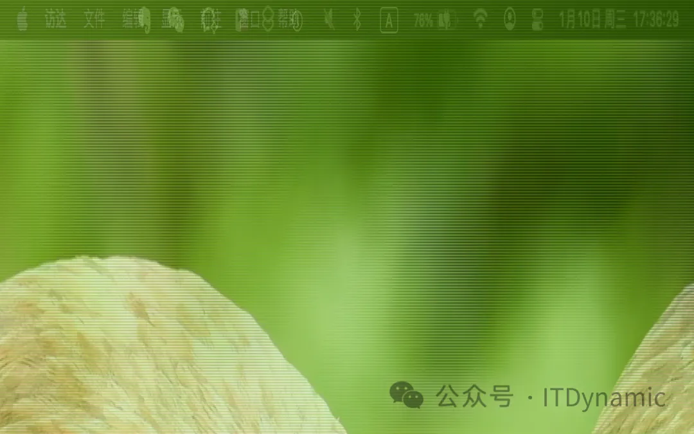

[UI 自动化工具，你知道有几个？](https://cloud.tencent.com/developer/article/1541231)

[robotjs alternative-掘金 (juejin.cn)](https://juejin.cn/s/robotjs alternative)

# Electron+robotjs 实现自动化

参考：[electron+robotjs 安装出错问题解决日志\_electron 安装 robotjs_QIHU.ZY 的博客-CSDN 博客](https://blog.csdn.net/jncinets/article/details/123822486)

robotjs 官网编译方案：<http://robotjs.io/docs/electron>

Electron 编译元素 Node 模块方案：<https://www.electronjs.org/zh/docs/latest/tutorial/using-native-node-modules>

## 1.安装 robotjs

在已有的 electron 项目中添加 robotjs 并使用

```bash
npm install robotjs --save
或
yarn add robotjs
或
pnpm install robotjs --save
```

```js
// js中引入使用
const robot = require("robotjs");
```

## 2.引用 robotjs 后运行时报错


```bash
start electron app...
X [ERROR] Could not resolve "./build/Release/robotjs.node"

    node_modules/robotjs/index.js:1:22:
      1 │ var robotjs = require('./build/Release/robotjs.node');
        ╵                       ~~~~~~~~~~~~~~~~~~~~~~~~~~~~~~

19:32:32 [vite] error while updating dependencies:
Error: Build failed with 1 error:
node_modules/robotjs/index.js:1:22: ERROR: Could not resolve "./build/Release/robotjs.node"
    at failureErrorWithLog (D:\Code\[MyProject]\[Electron]\electron-recruitment_assistant\node_modules\esbuild\lib\main.js:1604:15)
    at D:\Code\[MyProject]\[Electron]\electron-recruitment_assistant\node_modules\esbuild\lib\main.js:1056:28
    at runOnEndCallbacks (D:\Code\[MyProject]\[Electron]\electron-recruitment_assistant\node_modules\esbuild\lib\main.js:1476:61)
    at buildResponseToResult (D:\Code\[MyProject]\[Electron]\electron-recruitment_assistant\node_modules\esbuild\lib\main.js:1054:7)
    at D:\Code\[MyProject]\[Electron]\electron-recruitment_assistant\node_modules\esbuild\lib\main.js:1166:14
    at responseCallbacks.<computed> (D:\Code\[MyProject]\[Electron]\electron-recruitment_assistant\node_modules\esbuild\lib\main.js:701:9)
    at handleIncomingPacket (D:\Code\[MyProject]\[Electron]\electron-recruitment_assistant\node_modules\esbuild\lib\main.js:756:9)
    at Socket.readFromStdout (D:\Code\[MyProject]\[Electron]\electron-recruitment_assistant\node_modules\esbuild\lib\main.js:677:7)
    at Socket.emit (node:events:513:28)
    at addChunk (node:internal/streams/readable:324:12)
```

### 报错原因

robotjs 使用的 Node 环境与当前 Node 版本不一致，需要重新编译 robotjs

### 解决方案

**根据官网文档方案**：<http://robotjs.io/docs/electron>

注意：找到 electron 的版本和对应的 Node 版本，这里的 node 版本可不是你在命令行中查到的版本；

如果没安装 node-gyp 等编译工具，需要先安装

```bash
# window系统C和C++打包工具
npm install -g --production windows-build-tools
yarn global add windows-build-tools

# node包编译工具
npm install -g node-gyp
```

#### 安装 electron-rebuild 重新编译项目中使用的 Node 版本

#### 1.先安装：electron-rebuild

注意：electron-rebuild 必须安装到 dependencies 里

```bash
npm i electron-rebuild --dev
或
yarn add electron-rebuild -D
或
pnpm i electron-rebuild --dev
```

依赖包的命令目录

```bash
./node_modules/.bin/electron-rebuild
```

#### 安装原生模块文档

关于 gyp 与 node-gyp 与 node-pre-gyp 可以看这篇文章：<https://zhuanlan.zhihu.com/p/330468774>

**官网安装原生模块文档**：[Node 原生模块 | Electron (electronjs.org)](https://www.electronjs.org/zh/docs/latest/tutorial/using-native-node-modules)

#### 2.进入 robotjs 目录，直接进入模块文件夹

```bash
cd ./node_modules/robotjs
```

#### 3.目录中执行执行命令

版本说明

```bash
node-gyp rebuild --runtime=electron --disturl=https://atom.io/download/atom-shell --target=<你的electron版本> --abi=<对应abi版本>
```

示例：项目中查询 abi 版本：`npx electron --abi`

```bash
node-gyp rebuild --runtime=electron --target=21.4.1 --disturl=https://atom.io/download/atom-shell --abi=109
```

注意：

- --target：是你当前的 electron 版本
- --abi：当前 electron 中`node版本`对应的`node_abi`号：[找 abi 版本](https://github.com/mapbox/node-pre-gyp/blob/master/lib/util/abi_crosswalk.json)
  - 1.或者在这里查询-`node版本`对应的`node_abi`号：[v21 (yuque.com)](https://www.yuque.com/u34495/mivcfg/by432vfs60nuuoy7)
  - 2.或者使用命令：打开 全局`electron --abi` 或 局部 `npx electron --abi`

#### 编译成功后仍然遇到版本不匹配的问题


其实报错信息中已经提示了 需要哪个版本，重新编译对应版本的 robotjs 就行了

其他还不能解决的问题：[为电子重建机器人 J ·问题 #675 ·Octalmage/robotjs (github.com)](https://github.com/octalmage/robotjs/issues/675)

尝试运行下面命令来修复错误：

```bash
electron-rebuild -f -w robotjs
```

#### 安装 robotjs 引入使用后报错

报错信息

```bash
App threw an error during load
Error: A dynamic link library (DLL) initialization routine failed.
\\?\D:\vue\lianji\node_modules\robotjs\build\Release\robotjs.node
    at process.module.(anonymous function) [as dlopen] (ELECTRON_ASAR.js:166:20)
    at Object.Module._extensions..node (internal/modules/cjs/loader.js:740:18)
    at Object.module.(anonymous function) [as .node] (ELECTRON_ASAR.js:166:20)
    at Module.load (internal/modules/cjs/loader.js:620:32)
    at tryModuleLoad (internal/modules/cjs/loader.js:559:12)
    at Function.Module._load (internal/modules/cjs/loader.js:551:3)
    at Module.require (internal/modules/cjs/loader.js:658:17)
    at require (internal/modules/cjs/helpers.js:20:18)
    at Object.<anonymous> (D:\vue\lianji\node_modules\robotjs\index.js:1:170)
    at Object.<anonymous> (D:\vue\lianji\node_modules\robotjs\index.js:38:3)
```

#### 在项目根目录中执行

##### 1.直接执行编译命令

```bash
npm rebuild --runtime=electron --target=21.1.1 --disturl=https://atom.io/download/atom-shell --abi=102
```

##### 2.在 package.json 中设置编译命令

Node 版本使用的是：17.1.0

```json
"scripts": {
    "rebuild": "npm rebuild --runtime=electron --target=21.1.1 --disturl=https://atom.io/download/atom-shell --abi=102"
  },
```

## 3.使用命令创建的 electron 项目快速开发安装 robotjs 的错误

```bash
npm create @quick-start/electron
```

选择使用的是 vue 的 js 模板

### 原因

背景：使用 electron-builder 和 @journeyapps/sqlcipher 的项目

安装 robotjs 时，会执行：electron-builder install-app-deps

一般 electron-builder 的项目下完包的最后，会调用 electron-builder install-app-deps 命令重新构建本地依赖

### 然后报错

```bash
electron-builder install-app-deps
  • electron-builder  version=23.6.0
  • loaded configuration  file=D:\Code\[MyProject]\[Electron]\electron-recruitment_assistant\electron-builder.yml
  • rebuilding native dependencies  dependencies=robotjs@0.6.0 platform=win32 arch=x64
  • install prebuilt binary  name=robotjs version=0.6.0 platform=win32 arch=x64 napi=
  • build native dependency from sources  name=robotjs
                                          version=0.6.0
                                          platform=win32
                                          arch=x64
                                          napi=
                                          reason=prebuild-install failed with error (run with env DEBUG=electron-builder to get more information)
                                          error=D:\Code\[MyProject]\[Electron]\electron-recruitment_assistant\node_modules\node-abi\index.js:36
      throw new Error('Could not detect abi for version ' + target + ' and runtime ' + runtime + '.  Updating "node-abi" might help solve this issue if it is a new release of ' + runtime)
      ^

    Error: Could not detect abi for version 23.0.0 and runtime electron.  Updating "node-abi" might help solve this issue if it is a new release of electron
        at getAbi (D:\Code\[MyProject]\[Electron]\electron-recruitment_assistant\node_modules\node-abi\index.js:36:9)
        at module.exports (D:\Code\[MyProject]\[Electron]\electron-recruitment_assistant\node_modules\prebuild-install\rc.js:73:57)
        at Object.<anonymous> (D:\Code\[MyProject]\[Electron]\electron-recruitment_assistant\node_modules\prebuild-install\bin.js:9:25)
        at Module._compile (node:internal/modules/cjs/loader:1159:14)
        at Module._extensions..js (node:internal/modules/cjs/loader:1213:10)
        at Module.load (node:internal/modules/cjs/loader:1037:32)
        at Module._load (node:internal/modules/cjs/loader:878:12)
        at Function.executeUserEntryPoint [as runMain] (node:internal/modules/run_main:81:12)
        at node:internal/main/run_main_module:23:47

    Node.js v18.12.1

  • rebuilding native dependency  name=robotjs version=0.6.0
  ⨯ cannot execute  cause=exit status 1
yarn run v1.22.19
$ prebuild-install || node-gyp rebuild

    D:\Code\[MyProject]\[Electron]\electron-recruitment_assistant\node_modules\robotjs>if not defined npm_config_node_gyp (node "C:\Program Files\nodejs\node_modules\npm\bin\node-gyp-bin\\..\..\node_modules\node-gyp\bin\node-gyp.js" rebuild )  else (node "" rebuild )
info Visit https://yarnpkg.com/en/docs/cli/run for documentation about this command.

warning ..\..\package.json: No license field
    D:\Code\[MyProject]\[Electron]\electron-recruitment_assistant\node_modules\node-abi\index.js:36
      throw new Error('Could not detect abi for version ' + target + ' and runtime ' + runtime + '.  Updating "node-abi" might help solve this issue if it is a new release of ' + runtime)
      ^

    Error: Could not detect abi for version 23.0.0 and runtime electron.  Updating "node-abi" might help solve this issue if it is a new release of electron
        at getAbi (D:\Code\[MyProject]\[Electron]\electron-recruitment_assistant\node_modules\node-abi\index.js:36:9)
        at module.exports (D:\Code\[MyProject]\[Electron]\electron-recruitment_assistant\node_modules\prebuild-install\rc.js:73:57)
        at Object.<anonymous> (D:\Code\[MyProject]\[Electron]\electron-recruitment_assistant\node_modules\prebuild-install\bin.js:9:25)
        at Module._compile (node:internal/modules/cjs/loader:1159:14)
        at Module._extensions..js (node:internal/modules/cjs/loader:1213:10)
        at Module.load (node:internal/modules/cjs/loader:1037:32)
        at Module._load (node:internal/modules/cjs/loader:878:12)
        at Function.executeUserEntryPoint [as runMain] (node:internal/modules/run_main:81:12)
        at node:internal/main/run_main_module:23:47

    Node.js v18.12.1
    gyp info it worked if it ends with ok
    gyp info using node-gyp@9.1.0
    gyp info using node@18.12.1 | win32 | x64
    gyp info find Python using Python version 3.10.10 found at "C:\Users\userHu\AppData\Local\Microsoft\WindowsApps\PythonSoftwareFoundation.Python.3.10_qbz5n2kfra8p0\python.exe"
    gyp http GET https://registry.npmmirror.com/dist/v23.0.0/node-v23.0.0-headers.tar.gz
    gyp http 404 https://registry.npmmirror.com/dist/v23.0.0/node-v23.0.0-headers.tar.gz
    gyp WARN install got an error, rolling back install
    gyp ERR! configure error
    gyp ERR! stack Error: 404 response downloading https://registry.npmmirror.com/dist/v23.0.0/node-v23.0.0-headers.tar.gz
    gyp ERR! stack     at go (C:\Users\userHu\AppData\Roaming\nvm\v18.12.1\node_modules\npm\node_modules\node-gyp\lib\install.js:153:17)
    gyp ERR! stack     at process.processTicksAndRejections (node:internal/process/task_queues:95:5)
    gyp ERR! stack     at async install (C:\Users\userHu\AppData\Roaming\nvm\v18.12.1\node_modules\npm\node_modules\node-gyp\lib\install.js:62:18)
    gyp ERR! System Windows_NT 10.0.22621
    gyp ERR! command "C:\\Program Files\\nodejs\\node.exe" "C:\\Program Files\\nodejs\\node_modules\\npm\\node_modules\\node-gyp\\bin\\node-gyp.js" "rebuild"
    gyp ERR! cwd D:\Code\[MyProject]\[Electron]\electron-recruitment_assistant\node_modules\robotjs
    gyp ERR! node -v v18.12.1
    gyp ERR! node-gyp -v v9.1.0
    gyp ERR! not ok
error Command failed with exit code 1.

                    command='C:\Program Files\nodejs\node.exe' 'C:\Users\userHu\AppData\Roaming\nvm\v18.12.1\node_modules\yarn\bin\yarn.js' run install
                    workingDir=D:\Code\[MyProject]\[Electron]\electron-recruitment_assistant\node_modules\robotjs
error Command failed with exit code 1.
info Visit https://yarnpkg.com/en/docs/cli/add for documentation about this command.
```

[当我为 javaScript 项目安装 robotjs 时出错（操作系统自动化） ·问题 #642 ·Octalmage/robotjs (github.com)](https://github.com/octalmage/robotjs/issues/642)

前面的都不行的话，看：Electron 编译元素 Node 模块方案：<https://www.electronjs.org/zh/docs/latest/tutorial/using-native-node-modules>

文档页面内搜索：`--dist-url=https://electronjs.org/headers` 替换 `--disturl=https://atom.io/download/atom-shell` ，因为 atom-shell 这个链接停止运营

# 「全局命令」& robotjs 体验桌面自动化

本文主要介绍如何实现全局命令，如何使用 robotjs 实现桌面自动化以及踩坑经验分享。


自动旋转 3D 模型

## 实现全局命令的步骤

#### 1.创建一个新项目，并生成 package.json 文件

比如新建项目 `weakup`，并在项目根目录下执行 `npm init -y` 生成 package.json 文件。

#### 2.创建一个 bin 文件夹，并在 bin 文件夹下创建一个 weakup.js 文件

比如需要创建一个 node 可执行文件，如下代码：

```js
#!/usr/bin/env node

console.log("Hello, Weakup");
```

首行 `#!/usr/bin/env` 表示这是一个可执行文件，`node` 表示使用系统环境变量中的 `node` 命令来执行这个文件。如果需要用 `python` 来执行这个文件，可以改为 `#!/usr/bin/env python`。

#### 3.修改 package.json 文件添加 `bin` 字段

在`bin`字段中声明全局命令和对应执行的文件，如下代码：

```json
{
	"name": "weakup",
	"type": "module",
	"bin": {
		"weakup": "bin/weakup.js"
	},
	"files": ["bin"]
}
```

`"weakup": "bin/weakup.js"`表示全局命令为 `weakup`，对应的执行文件为 `bin/weakup.js`。当我们在命令行里输入 `weakup` 并按下回车后，会自动执行 `bin/weakup.js` 文件。

#### 4.执行 `npm link` 将 `weakup` 命令注册到系统

> `npm link` 可以帮助我们模拟包安装后的状态，它会在系统中做一个快捷方式映射，让本地的包就好像 install 过一样，可以直接使用。

**在项目根目录下执行 `npm link` 命令**，将`weakup`命令注册到系统。这样在任意命令行下执行 `weakup` 都会自动执行 `bin/weakup.js` 文件。

请注意`name`字段是必填项，否则在执行 `npm link` 时会报相应错误。另外，如果是 Mac 电脑可能需要加 `sudo` 执行。

参考[从零开发前端 CL 命令](https://juejin.cn/post/7271599265969225743) 👍

#### 5.配合`inquirer`库，可以实现命令行交互功能

```javascript
import inquirer from "inquirer";
const questions = [{type:'list', ...}, {type:'input', ...}]
inquirer.prompt(questions).then((res) => {
  console.log("你的选择:", res);
}).catch(console.error)
```

参考[inquirer 文档](https://www.npmjs.com/package/inquirer)

## robotjs 的基本使用

robotjs 可以实现桌面自动化，它提供了鼠标、键盘和屏幕的控制能力。方法不是很多，文档也比较清晰，使用的时候查一下就好了。需要注意的是，执行完鼠标移动、点击或输入操作后，最好 delay 一下，否则可能会出现一些奇怪的问题。参考[robotjs 文档](https://robotjs.io/docs/syntax)

### 下面说一下安装：

```bash
npm install robotjs
```

#### Mac 前置安装工具（如果运行失败）

1. 1. xcode 环境
2. 2. CammandLineTools

#### windows 前置安装工具

- • Python 环境：下载安装 python3.11.x（下载地址：https://www.python.org/downloads/windows/。安装后可在C:\Users\xxx\AppData\Local\Programs\Python查看安装版本）
- • C++环境：下载安装 VisualStudio，在安装 Visual Studio 时，请确保选择了 "Desktop development with C++" 工作负载。（下载地址：https://visualstudio.microsoft.com/zh-hans/downloads/（社区版））；
- • npm install --global --production windows-build-tools

### 几个本人的使用场景

- • 屏幕取色：实时显示鼠标位置和当前位置的屏幕颜色；
- • 风格截屏：截取整个屏幕，处理 rgba 信息，并保存为 PNG 文件（还没有实现鼠标拖动截屏功能）；
- • 自动登陆 ssh：打开系统命令行工具，执行预设的服务器登录流程
- • 抖音无人直播助手：web 页面观看直播时自动点击页面实现保活 / 3D 无人直播时旋转 3D 模型 / 模拟输入自动回复直播间的聊天（需要走 http 服务并接入 GPT）；
- • 录屏：robotjs 截屏存图，再用 ffmpeg 把图片组装生成视频（todo）；

之前用过`puppeteer`这种无头浏览器模拟，它的功能更强大。用来实现爬虫、截屏、自动化测试都挺方便的运行起来不占用用户的鼠标、键盘外设，这些是它的优点。但是`robotjs`的优点也很明显，就是它能够在桌面层级进行操作，理论上如果仔细编排流程的话，任何界面任何软件都能模拟用户的真实操作。_觉得 robojs 强大，然而我没有想到什么特别有意思且使用的场景，想来个集思广益的 😮_。

### 「截屏保存」简单实现

```javascript
import fs from "fs";
import robot from "robotjs";
import { PNG } from "pngjs";
import { fileURLToPath } from "url";
import path, { dirname } from "path";

const __filename = fileURLToPath(import.meta.url);
const __dirname = dirname(__filename);

// 截图尺寸
const dpr = 2; //获取自己屏幕的dpr
const size = robot.getScreenSize();
console.log("size:", size);

// 截取屏幕
const screenshot = robot.screen.capture(0, 0, size.width, size.height);
console.log("screenshot.image.length:", screenshot.image.length);

// 创建 PNG 对象，缩放dpr倍，解决图片不完整的问题
const png = new PNG({
	width: size.width * dpr,
	height: size.height * dpr,
});
console.log("\npng.data.length:", png.data.length);

for (let y = 0; y < png.height; y++) {
	for (let x = 0; x < png.width; x++) {
		let idx = (png.width * y + x) * 4;
		let r = screenshot.image[idx];
		let g = screenshot.image[idx + 1];
		let b = screenshot.image[idx + 2];
		let a = screenshot.image[idx + 3];

		//交换r和b
		png.data[idx] = b;
		png.data[idx + 1] = g;
		png.data[idx + 2] = r;
		png.data[idx + 3] = a;
	}
}

// 将 PNG 对象保存为图片文件
const filename = "screenshot.png";
const savePath = path.join(__dirname, filename);

png.pack().pipe(fs.createWriteStream(filename));

console.log(`截图保存在 ${savePath}`);
```

## 踩坑经验

以下是实现「屏幕截图存为图片」时遇到的几个问题：

#### 1. 如何把 `robot.screen.capture` 返回的 `Bitmap` 数据的 `image` 存储为 PNG 文件？

`robotjs` 没有提供类似方法，我目前是利用`pngjs`库进行的处理。参考[pngjs 文档](https://github.com/pngjs/pngjs)

#### 2. 使用 `pngjs` 保存的 PNG 模糊不完整？

先看第一版代码：

```javascript
const screenshot = robot.screen.capture(0, 0, size.width, size.height);
const png = new PNG({
	width: size.width,
	height: size.height,
});

console.log("screenshot.image.length:", screenshot.image.length);
console.log("png.data.length:", png.data.length);
```

观察上面的 log 输出可以发现，从`robot.screen.capture`返回的`screenshot.image`长度为`x`，而`png.data`长度为`x/2`，相差一半。这里可以初步判断图片不完整的原因，且可以知道 `dpr` 是 2；



模糊不完整截图

如果修改为以下代码，问题就解决了。

```javascript
const dpr = 2; // 假设屏幕是高清屏
const png = new PNG({
	width: size.width * dpr,
	height: size.height * dpr,
});
```


完整清晰截图

#### 3.生成的 png 图片「红蓝颠倒」了？

将 robotjs 截图数据填充到`png`的`data`过程中，需要交换`r`和`b`两个像素的位置，例如：

```javascript
for (let y = 0; y < png.height; y++) {
	for (let x = 0; x < png.width; x++) {
		let idx = (png.width * y + x) * 4;
		let r = screenshot.image[idx];
		let g = screenshot.image[idx + 1];
		let b = screenshot.image[idx + 2];
		let a = screenshot.image[idx + 3];

		//交换r和b（不知道为什么顺序不是rgba而是bgra🤷）
		png.data[idx] = b;
		png.data[idx + 1] = g;
		png.data[idx + 2] = r;
		png.data[idx + 3] = a; // 不透明
	}
}
```

请教下屏幕前的朋友为什么顺序不是 rgba 而是 bgra🤷

#### 4. `ES module` 模式不支持 `__dirname`，报错如下：

```javascript
const savePath = path.join(__dirname, "screenshot.png");
^

ReferenceError: __dirname is not defined in ES module scope
This file is being treated as an ES module because it has a '.js' file extension and '/Users/xxx/package.json' contains "type": "module". To treat it as a CommonJS script, rename it to use the '.cjs' file extension.
```

解决方案：

```javascript
import { fileURLToPath } from "url";
import path, { dirname } from "path";

const __filename = fileURLToPath(import.meta.url);
const __dirname = dirname(__filename);

const savePath = path.join(__dirname, "screenshot.png");
```

#### 引用链接

`[1]` 从零开发前端 CL 命令：https://juejin.cn/post/7271599265969225743
`[2]` inquirer 文档：https://www.npmjs.com/package/inquirer
`[3]` robotjs 文档：https://robotjs.io/docs/syntax
`[4]` pngjs 文档：https://github.com/pngjs/pngjs
