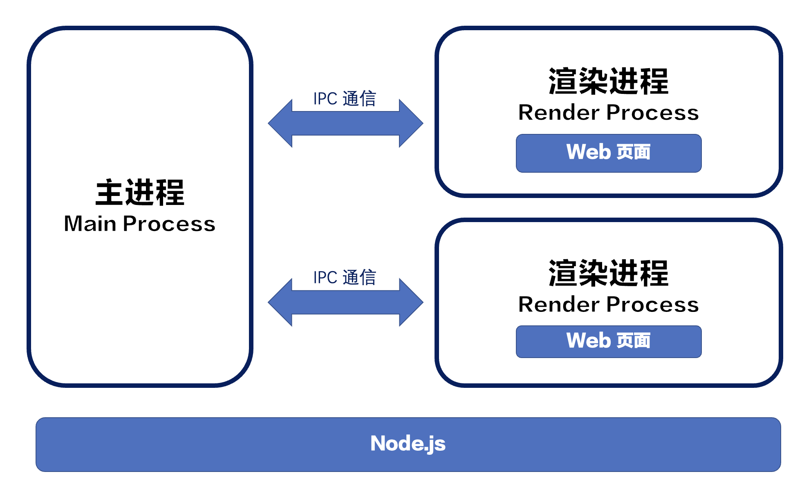

# Electron 入门

看知乎问题教程：<https://www.zhihu.com/question/476225078/answer/2712326251?utm_id=0>

## electron介绍

- Electron是由Github开发，用HTML，CSS和JavaScript来构建跨平台桌面应用程序的一个开源库。 Electron通过将Chromium和Node.js合并到同一个运行时环境中，并将其打包为Mac，Windows和Linux系统下的应用来实现这一目的。

- 网站

  - https://www.electronjs.org/zh/docs/latest#

  - https://www.w3cschool.cn/electronmanual/

- 特点：

  - 上手简单：只要会前端的知识就可以做桌面应用

  - 跨平台：Mac，Linux，Windows

  - 自动更新

## 1、前导知识

- HTML
- CSS
- JavaScript
- ES6+
- Node.js

## 2、安装 Node.js

<http://nodejs.cn/download/>

## 3、安装 VSCode

<https://code.visualstudio.com/>

Volar 插件

## 4、安装 Git

<https://git-scm.com/downloads>

## 一、Electron

### 1、什么是 Electron

Electron 是由 Github 开发，用 HTML，CSS 和 JavaScript 来构建跨平台桌面应用程序的一个开源库。 Electron 通过将 Chromium 和 Node.js 合并到同一个运行时环境中，并将其打包为 Mac，Windows 和 Linux 系统下的应用来实现这一目的。

网站：

- <https://www.electronjs.org/zh/docs/latest#>
- <https://www.w3cschool.cn/electronmanual/>

### Electron 应用的原生 Native 能力和原生 GUI✌️✌️

#### 1.系统原生 API：Native API

app 设置 dock.badge：[类: Dock | Electron (electronjs.org)](https://www.electronjs.org/zh/docs/latest/api/dock#docksetbadgetext-macos)

BrowserWindow-应用窗口：[BrowserWindow | Electron (electronjs.org)](https://www.electronjs.org/zh/docs/latest/api/browser-window)

Menu-菜单：[Menu | Electron (electronjs.org)](https://www.electronjs.org/zh/docs/latest/api/menu)

Notification-通知：[通知 | Electron (electronjs.org)](https://www.electronjs.org/zh/docs/latest/api/notification)

dialog-原生弹框：[dialog | Electron (electronjs.org)](https://www.electronjs.org/zh/docs/latest/api/dialog)

Tray-系统托盘：[系统托盘 | Electron (electronjs.org)](https://www.electronjs.org/zh/docs/latest/api/tray)

TouchBar-macOS 系统触控板 TouchBar：[触控板 | Electron (electronjs.org)](https://www.electronjs.org/zh/docs/latest/api/touch-bar)

...

#### 2.使用 Electron API 获得底层能力

clipboard-剪切板：[clipboard | Electron (electronjs.org)](https://www.electronjs.org/zh/docs/latest/api/clipboard)

globalshortcut-全局快捷键：[globalShortcut | Electron (electronjs.org)](https://www.electronjs.org/zh/docs/latest/api/global-shortcut)

desktopCapturer-捕获桌面：[desktopCapturer | Electron (electronjs.org)](https://www.electronjs.org/zh/docs/latest/api/desktop-capturer)

shell 打开文件和文件夹、URL：[shell | Electron (electronjs.org)](https://www.electronjs.org/zh/docs/latest/api/shell)

...

#### 3.使用 Node.js 获得底层能力

Electron 同时在主进程和渲染进程中对 Nodejs 暴露了所有的接口

- fs 进行文件读写
- crypto 进行加解密
- ...

通过 npm 安装即可引入 Node 社区上所有的 Node.js 库

#### 4.通过 Node.js 的调用系统原生模块-通过 Node.js 的插件机制集成 C++

node.js add-on：下面是搜索【node addon】得到的

- [Node addons 简介 - 知乎 (zhihu.com)](https://zhuanlan.zhihu.com/p/351997504)
- [都 2020 年了，该如何开发 Node.js Native Add-on？\_前端瓶子君的博客-CSDN 博客](https://blog.csdn.net/lunahaijiao/article/details/110729861)
- [一篇了解 Node-Addon-Api 的设计和实现 (baidu.com)](https://baijiahao.baidu.com/s?id=1705404202572113582&wfr=spider&for=pc)
- [Node.js add on module in C/C++ - Stack Overflow](https://stackoverflow.com/questions/66584229/node-js-add-on-module-in-c-c)
- [【Node】一个完整的 node addon 实现流程\_前端开发小司机的博客-CSDN 博客](https://blog.csdn.net/web22050702/article/details/127367468)

node-ffi (Foreign Function Interface)：调用写好的 C++动态库

#### 5.可以通过 Node.js 的子进程调用系统集成的 OS 能力

Shell(nodejs child_process---系统的命令)：[shell | Electron (electronjs.org)](https://www.electronjs.org/zh/docs/latest/api/shell)

AppleScript（与系统其他应用交互）：苹果公司开发的一种脚本语言，可以用来控制运行于 Mac OS 上的程序，也可以写成独立运行的 Applet。最早版本在 1993 年十月推出，在 System 7（System 7.1.1）运行：<https://github.com/TooTallNate/node-applescript>

Windows Runtime(WinRT)：Windows 8 中的一种跨平台应用程序架构（蓝牙等）：<https://github.com/NodeRT/NodeRT>

#### 总结：Electron 能力

| Node.js             | 原生 API          | 文件读写、操作系统、加解密             |
| ------------------- | ----------------- | -------------------------------------- |
|                     | Node.js 扩展      | 集成三方 C++库                         |
| Electron Native API | 客户端 GUI        | 右键菜单、窗口定制 、系统托盘、Dock... |
|                     | 桌面环境集成      | 系统通知、剪切板、系统快捷键、文件拖放 |
|                     | 设备 API          | 电源监视、内存、CPU、屏幕              |
| OS                  | Applescript(macOS | 系统原生应用调用                       |
|                     | Windows RT        | USB、蓝牙、预览文件                    |

#### 🌟Electron 开发释放想象力

- 1.不用担心在 Safari、IE 上的表现差异了
- 2.大胆使用 chrome 浏览器已经支持的 API
- 3.oabel 中设置 targets 为 Electron 对应的 Chrome 版本
- 4.因为 Electron 代码运行在高版本的 Chromium 内核上，所以可以大胆的使用 ES6/7/8/9/10/11/12 等高级语法特性，不用担心引入过多的 Polyfill 而影响项目
  - Async await / Promise
  - String/Array/0bject 等高级用法
  - BigInt
- 5.Electron 开发无跨域问题
  - 使用 Node.js 发送请求
  - 使用 Electron net 发送请求
  - 
- 通过 Node.js 做 更多...
  - 操作本地文件：业务里面会留一份本地日志方便我们排查问题
  - 更好用的本地 DB：引入一些更好用的本地 DB，除了原来的 webDB：indexDB 外，如 Lowdb、Leveldb 甚至是 SQLite 等等的本地存储
  - 多线程、多进程并行：可以通过 Node.js 的 Worker 和 child_process，将任务拆成多线程多进程运行，充分利用计算机的多核硬件性能

首先，这是一个没有 IE 的世界，我们只需要对 chrome 负责，可以大胆的使用 Chrome 的最新的 Feature，也不需要做过多的浏览器验证。而因为不需要兼容其他的浏览器，我们在前端打包时，只需要对 chrome 的高版本打包就可以了，包的体积也会被缩减。

举个例子：比如像在我们 chrome 76 之后，就支持了一个纯天然的 LazyLoad(懒加载)，我们在加载图片的时候可以用这个特性来做懒加载。

- 纯天然 LazyLoad：<https://mathiasbynens.be/demo/img-loading-lazy>
- 元素是这样的【loading="lazy"】：``

谷歌浏览器和 Chromium 内核 更新【博客文章】：<https://developers.google.com/web/updates>

Polyfill：Polyfill 或者 Polyfiller，是英国 Web 开发者 Remy Sharp 想用一个词来形容"用 JavaScript 来实现一些浏览器不支持的原生 API"。**Polyfill 的准确意思为：磨平浏览器的缝隙，实现浏览器不支持的原生 API 的代码。**

- [译更了解一点 polyfill | 码农家园 (codenong.com)](https://www.codenong.com/j5e0ee6985188253ab84/)
- 比如在具体项目中，兼容 ie8 以及 ie8 以下一直是一个难题，因为最常用的 ES5 的 API 却有很多都无法使用，比如**getElementByClassName**无法使用，querySelectorAll 在 ie8 虽然可以使用，但也只能使用 css2.1 的选择器，诸如此类的问题有很多。
- 为了在日常开发中，开发者不会针对这种兼容性问题伤透脑筋，所出现的库就可以称为 Polyfill。一个 Polyfill 是抹平新老浏览器 标准原生 API 之间的差距的一种封装，而不是实现自己的 API。
- Polymer（低版本浏览器兼容 html5 components）
- FlashCanvas(兼容不支持 canvas 的浏览器)

### 2、Electron 初探

#### 2.1 常见的桌面 GUI 工具介绍

| 名称     | 语音   | 优点                      | 缺点                     |
| -------- | ------ | ------------------------- | ------------------------ |
| QT       | C++    | 跨平台、性能好、生态好    | 依赖多，程序包大         |
| PyQT     | Python | 底层集成度高、易上手      | 授权问题                 |
| WPF      | C#     | 类库丰富、扩展灵活        | 只支持 Windows，程序包大 |
| WinForm  | C#     | 性能好，组件丰富，易上手  | 只支持 Windows，UI 差    |
| Swing    | Java   | 基于 AWT，组件丰富        | 性能差，UI 一般          |
| NW.js    | JS     | 跨平台性好，界面美观      | 底层交互差、性能差，包大 |
| Electron | JS     | 相比 NW 发展更好          | 底层交互差、性能差，包大 |
| CEF      | C++    | 性能好，灵活集成，UI 美观 | 占用资源多，包大         |

- 底层依赖 + 调用：CEF、QT、Swing
- UI 美观：Electron（NW.js）、PyQT
- 跨平台：Swing（JAVA）、PyQT（Python、C++）、Electron（前端）

技术是为业务服务的，选择合适的最重要！

#### 2.2 桌面端设计与开发要点

1、UX/UI 设计概念

**UX 设计：**UX（User Experience）即用户体验，其核心是用户，体验指用户在使用产品以及与产品发生交互时出现的主观感受和需求满足。

**UI 设计：**UI（User Interface）使用者界面，可以说是 UX 设计的一部分，其中重要的**图形化或者可视化**部分，都是由 UI 设计来完成的。

2、核心原则

简单易用。

3、通用原则

交互简单：上手就会，一看就懂

风格统一：菜单、导航、按钮反馈、颜色、预知提示

认知一致：名词、友好提示、划分信息、突出展示

4、桌面端设计

保持与 PC 端统一的风格设计与交互设计。

加入定制的菜单与专业操控设计。

减少资源加载。

#### 2.3 初始化项目 + 项目依赖介绍

1、Electron 官网

<https://www.electronjs.org/>

2、初始化一个项目

```bash
npm init -y
```

3、项目安装 electron

```bash
npm i electron -D
```

3、配置启动脚本

在 package.json 里配置 npm 脚本：

```json
{
	"scripts": {
		"start": "electron ."
	}
}
```

4、创建入口文件

- 在项目根目录下创建文件 index.html：

```html
<!DOCTYPE html>
<html lang="en">
	<head>
		<meta charset="UTF-8" />
		<meta http-equiv="X-UA-Compatible" content="IE=edge" />
		<meta name="viewport" content="width=device-width, initial-scale=1.0" />
		<title>Electron Demo</title>
	</head>
	<body>
		hello Electron
	</body>
</html>
```

- 在项目根目录下创建 index.js 文件，这是程序的入口文件：

```js
const { app } = require("electron");

// 主进程
const createWindow = () => {
	const win = new BrowserWindow({
		width: 800,
		height: 600,
	});

	win.loadFile("index.html");
};

app.whenReady().then(createWindow);
```

### 3、Electron 核心概念

#### 3.1 Electron 主进程与渲染进程

**主进程：**启动项目时运行的 main.js 脚本就是我们说的主进程。在主进程运行的脚本可以以创建 Web 页面的形式展示 GUI。**主进程只有一个**。

**渲染进程：**每个 Electron 的页面都在运行着自己的进程，这样的进程称之为渲染进程（基于 Chromium 的多进程结构）。



主进程使用 BrowserWindow 创建实例，主进程销毁后，对应的渲染进程回被终止。主进程与渲染进程通过 IPC 方式（事件驱动）进行通信。

##### 主进程 API-Main Process

- app
- autoUpdater
- BrowserWindow
- contentTracing
- dialog
- ipcMain
- globalShortcut
- Menu
- Menultem
- powerMonitor
- powerSaveBlocker
- protocolsession
- systemPreferencesTray

##### 渲染进程 API-Renderer Process

- desktopCapturer
- ipcRenderer
- remote
- webFrame
- DOM/Browser APIs

##### 两个进程都可以使用的 API-Both

- clipboard
- crashReporter
- nativelmage
- shell
- screen

#### 3.2 主进程事件生命周期

> main process modules/app/event：<https://www.electronjs.org/zh/docs/latest/api/app>

```js
app.on("window-all-closed", () => {
	console.log("window-all-closed");
	// 对于 MacOS 系统 -> 关闭窗口时，不会直接推出应用
	if (process.platform !== "darwin") {
		app.quit();
	}
});

app.on("quit", () => {
	console.log("quit");
});

app.whenReady().then(() => {
	createWindow();
	// 在MacOS下，当全部窗口关闭，点击 dock 图标，窗口再次打开。
	app.on("activate", () => {
		if (BrowserWindow.getAllWindows().length === 0) {
			createWindow();
		}
	});
});
```

#### 3.3 渲染进程如何使用 Node 模块

**1、通过 webPreferences/nodeIntegration**：

```js
const win = new BrowserWindow({
	width: 800,
	height: 400,
	webPreferences: {
		nodeIntegration: true,
		contextIsolation: false,
	},
});
```

```html
<!DOCTYPE html>
<html lang="en">
	<head>
		<meta charset="UTF-8" />
		<meta http-equiv="X-UA-Compatible" content="IE=edge" />
		<meta name="viewport" content="width=device-width, initial-scale=1.0" />
		<title>Electron Demo</title>
		<script src="https://unpkg.com/vue@next"></script>
	</head>
	<body>
		<h1>hello Electron</h1>
		<div id="root">
			<p>electronVersion: {{electronVersion}}</p>
			<p>nodeVersion: {{nodeVersion}}</p>
			<p>chromeVersion: {{chromeVersion}}</p>
		</div>
		<script>
			// const path = require('path')
			// console.log(path)
			const app = Vue.createApp({
				data() {
					return {
						electronVersion: process.versions.electron,
						nodeVersion: process.versions.node,
						chromeVersion: process.versions.chrome,
					};
				},
			});
			app.mount("#root");
		</script>
	</body>
</html>
```

**2、通过 webPreferences/preload 实现**：

```js
const win = new BrowserWindow({
	width: 800,
	height: 400,
	webPreferences: {
		// 在启动应用时在渲染进程里预加载 js
		preload: path.join(__dirname, "./preload-js/index.js"),
	},
});
```

```js
// preload-js/index.js

// const { contextBridge } = require('electron')
// contextBridge.exposeInMainWorld('myAPI', {
//  desktop: true
// })

const { createApp } = require("vue");
window.addEventListener("load", () => {
	const app = createApp({
		data() {
			return {
				electronVersion: process.versions.electron,
				nodeVersion: process.versions.node,
				chromeVersion: process.versions.chrome,
			};
		},
	});
	app.mount("#root");
});
```

**3、代码改造**：

```js
// index.js
win.loadFile("./renderer/index.html");
```

```html
<!-- renderer/index.html -->
<!DOCTYPE html>
<html lang="en">
	<head>
		<meta charset="UTF-8" />
		<meta http-equiv="X-UA-Compatible" content="IE=edge" />
		<meta name="viewport" content="width=device-width, initial-scale=1.0" />
		<!-- <meta http-equiv="Content-Security-Policy" content="script-src 'self';"> -->
		<title>Electron Demo</title>
		<script src="./vue.global.js"></script>
	</head>
	<body>
		<h1>hello Electron</h1>
		<div id="root"></div>
		<script src="./main.js"></script>
	</body>
</html>
```

```js
// renderer/main.js
const app = Vue.createApp({
	template: `
    <p>electronVersion: {{electronVersion}}</p>
    <p>nodeVersion: {{nodeVersion}}</p>
    <p>chromeVersion: {{chromeVersion}}</p>
  `,
	data() {
		return {
			electronVersion: process.versions.electron,
			nodeVersion: process.versions.node,
			chromeVersion: process.versions.chrome,
		};
	},
});
app.mount("#root");
```

```html
<!-- 配置CSP -->
<meta
	http-equiv="Content-Security-Policy"
	content="default-src 'self'; img-src 'self' data:; script-src 'self'; style-src 'self' 'unsafe-inline'"
/>
```

```js
// 暂时关闭安全警告
process.env["ELECTRON_DISABLE_SECURITY_WARNINGS"] = "true";
```

#### 3.5 主进程与渲染进程通信

##### 3.5.1 index.html

```html
<!DOCTYPE html>
<html>
	<head>
		<meta charset="UTF-8" />
		<meta
			http-equiv="Content-Security-Policy"
			content="script-src 'self' 'unsafe-inline'"
		/>
		<title>Hello World!</title>
	</head>
	<body>
		<h1>Hello World!</h1>

		<button type="button" id="talk">Talk to main process</button><br />

		<!-- All of the Node.js APIs are available in this renderer process. -->
		We are using Node.js
		<strong
			><script>
				document.write(process.versions.node);
			</script></strong
		>, and Electron
		<strong
			><script>
				document.write(process.versions.electron);
			</script></strong
		>.

		<script>
			// You can also require other files to run in this process
			require("./renderer.js");
		</script>
	</body>
</html>
```

##### 3.5.2 renderer.js

```js
// This file is required by the index.html file and will
// be executed in the renderer process for that window.
// All of the Node.js APIs are available in this process.

const { ipcRenderer } = require("electron");

let i = 1;
setInterval(() => {
	console.log(i);
	i++;
}, 1000);

document.getElementById("talk").addEventListener("click", (e) => {
	// ipcRenderer.send( 'channel1', 'Hello from main window')

	let response = ipcRenderer.sendSync("sync-message", "Waiting for response");
	console.log(response);
});

ipcRenderer.on("channel1-response", (e, args) => {
	console.log(args);
});

ipcRenderer.on("mailbox", (e, args) => {
	console.log(args);
});
```

##### 3.5.3 main.js

```js
// Modules
const { app, BrowserWindow, ipcMain } = require("electron");

// Keep a global reference of the window object, if you don't, the window will
// be closed automatically when the JavaScript object is garbage collected.
let mainWindow;

// Create a new BrowserWindow when `app` is ready
function createWindow() {
	mainWindow = new BrowserWindow({
		width: 1000,
		height: 800,
		x: 100,
		y: 140,
		webPreferences: { nodeIntegration: true },
	});

	// Load index.html into the new BrowserWindow
	mainWindow.loadFile("index.html");

	// Open DevTools - Remove for PRODUCTION!
	mainWindow.webContents.openDevTools();

	mainWindow.webContents.on("did-finish-load", (e) => {
		// mainWindow.webContents.send( 'mailbox', {
		//   from: 'Ray',
		//   email: 'ray@stackacademy.tv',
		//   priority: 1
		// })
	});

	// Listen for window being closed
	mainWindow.on("closed", () => {
		mainWindow = null;
	});
}

ipcMain.on("sync-message", (e, args) => {
	console.log(args);

	setTimeout(() => {
		e.returnValue = "A sync response from the main process";
	}, 4000);
});

ipcMain.on("channel1", (e, args) => {
	console.log(args);
	e.sender.send(
		"channel1-response",
		'Message received on "channel1". Thank you!'
	);
});

// Electron `app` is ready
app.on("ready", createWindow);

// Quit when all windows are closed - (Not macOS - Darwin)
app.on("window-all-closed", () => {
	if (process.platform !== "darwin") app.quit();
});

// When app icon is clicked and app is running, (macOS) recreate the BrowserWindow
app.on("activate", () => {
	if (mainWindow === null) createWindow();
});
```

### 4、主进程

> Electron API （Electron API 有两种）

- Main Process （主进进程）
- Renderer Process（渲染进程）

#### 4.1 App

##### 4.1.1 事件

###### 4.1.1.1 before-quit

> 在应用程序开始关闭窗口之前触发。

```js
app.on("before-quit", (e) => {
	console.log("App is quiting");
	e.preventDefault();
});
```

###### 4.1.1.2 browser-window-blur

> 在 browserWindow 失去焦点时发出

```js
app.on("browser-window-blur", (e) => {
	console.log("App unfocused");
});
```

###### 4.1.1.3 browser-window-focus

> 在 browserWindow 获得焦点时发出

```js
app.on("browser-window-focus", (e) => {
	console.log("App focused");
});
```

##### 4.1.2 方法

4.1.2.1 app.quit()

```js
app.on("browser-window-blur", (e) => {
	setTimeout(() => {
		app.quit();
	}, 3000);
});

app.on("browser-window-blur", (e) => {
	setTimeout(app.quit, 3000);
});
```

###### 4.1.2.2 app.getPath(name)

```js
app.whenReady().then(() => {
	console.log(app.getPath("desktop"));
	console.log(app.getPath("music"));
	console.log(app.getPath("temp"));
	console.log(app.getPath("userData"));

	createWindow();
});
```

#### 4.2 BrowserWindow

> electron.BrowserWindow: 创建和控制浏览器窗口

##### 4.2.1 实例方法

win.loadURL(url[, options]): 和 loadFile 互斥

```js
mainWindow.loadURL("https://www.baidu.com");
```

##### 4.2.2 优雅的显示窗口

- 使用 ready-to-show 事件

```js
let mainWindow = new BrowserWindow({ show: false });
mainWindow.once("ready-to-show", () => {
	mainWindow.show();
});
```

- 设置 backgroundColor

```js
let win = new BrowserWindow({ backgroundColor: "#2e2c29" });
```

##### 4.2.3 父子窗口

- 窗口定义

```js
secondaryWindow = new BrowserWindow({
	width: 600,
	height: 600,
	webPreferences: { nodeIntegration: true },
});

secondaryWindow.loadFile("index.html");

secondaryWindow.on("closed", () => {
	mainWindow = null;
});
```

- 窗口关系

```js
secondaryWindow = new BrowserWindow({
	parent: mainWindon, // 定义父窗口
	modal: true, // 锁定在主窗口
});
```

- 子窗口显示和隐藏

```js
secondaryWindow = new BrowserWindow({
	show: false,
});

setTimeout(() => {
	secondaryWindow.show();
	setTimeout(() => {
		secondaryWindow.hide();
	}, 3000);
}, 2000);
```

##### 4.2.4 无边框窗口

> Frameless Window

```js
mainWindow = new BrowserWindow({
	frame: false,
});
```

让页面可拖拽

```html
<body style="user-select: none; -webkit-app-region:drag;"></body>
```

no-drag 修复下面控件的 bug

```html
<input
	style="-webkit-app-region: no-drag;"
	type="range"
	name="range"
	min="0"
	max="10"
/>
```

显示红绿灯

```js
mainWindow = new BrowserWindow({
	titleBarStyle: "hidden", // or hiddenInset 距离红绿灯更近
});
```

##### 4.2.5 属性与方法

###### 4.2.5.1 minWidth && minHeight

```js
mainWindow = new BrowserWindow({
	minWidth: 300,
	minHeight: 300,
});
```

更多详见：<https://electronjs.org/docs/api/browser-window#new-browserwindowoptions>

###### 4.2.5.2 窗口焦点事件

```js
secWindow = new BrowserWindow({
	width: 400,
	height: 300,
	webPreferences: { nodeIntegration: true },
});

mainWindow.on("focus", () => {
	console.log("mainWindow focused");
});

secWindow.on("focus", () => {
	console.log("secWindow focused");
});

app.on("browser-window-focus", () => {
	console.log("App focused");
});
```

###### 4.2.5.3 静态方法

- getAllWindows()

```js
let allWindows = BrowserWindow.getAllWindows();
console.log(allWindows);
```

更多详见: <https://electronjs.org/docs/api/browser-window#%E9%9D%99%E6%80%81%E6%96%B9%E6%B3%95>

###### 4.2.5.4 实例方法

- maximize()

```js
secWindow.on("closed", () => {
	mainWindow.maximize();
});
```

更多详见：<https://electronjs.org/docs/api/browser-window#%E5%AE%9E%E4%BE%8B%E6%96%B9%E6%B3%95>

##### 4.2.6 state

> electron-win-state 保存窗口的状态
> `npm install electron-win-state`

##### 4.2.7 webContents

> webContents 是 EventEmitter 的实例， 负责渲染和控制网页, 是 BrowserWindow 对象的一个属性。

```js
let wc = mainWindow.webContents;
console.log(wc);
```

###### 4.2.7.1 方法 getAllWebContents(）\*

- 返回 WebContents[] - 所有 WebContents 实例的数组。 包含所有 Windows，webviews，opened devtools 和 devtools 扩展背景页的 web 内容

```js
const { app, BrowserWindow, webContents } = require("electron");
console.log(webContents.getAllWebContents());
```

###### 4.2.7.2 实例事件

- did-finish-load
- dom-ready

```html
<div>
	
</div>
<script>
	let wc = mainWindow.webContents;
	wc.on("did-finish-load", () => {
		console.log("Conent fully loaded");
	});
	wc.on("dom-ready", () => {
		console.log("DOM Ready");
	});
</script>
```

- new-window

```html
<div>
	<a target="_blank" href="https://placekitten.com/500/500"><h3>Kitten</h3></a>
</div>

<script>
	wc.on("new-window", (e, url) => {
		e.preventDefault();
		console.log("DOM Ready");
	});
</script>
```

- context-menu : 右键上下文信息

```js
wc.on("context-menu", (e, params) => {
	console.log(
		`Context menu opened on: ${params.mediaType} at x:${params.x}, y:${params.y}`
	);
});

wc.on("context-menu", (e, params) => {
	console.log(`User seleted text: ${params.selectionText}`);
	console.log(`Selection can be copied: ${params.editFlags.canCopy}`);
});
```

###### 4.2.7.3 实例方法

- executeJavaScript()

```js
wc.on("context-menu", (e, params) => {
	wc.executeJavaScript(`alert('${params.selectionText}')`);
});
```

#### 4.3 dialog - 对话框

> 显示用于打开和保存文件、警报等的本机系统对话框

```js
const { app, BrowserWindow, dialog } = require("electron");

mainWindow.webContents.on("did-finish-load", () => {
	dialog
		.showOpenDialog({
			buttonLabel: "选择",
			defaultPath: app.getPath("desktop"),
			properties: [
				"multiSelections",
				"createDirectory",
				"openFile",
				"openDirectory",
			],
		})
		.then((result) => {
			console.log(result.filepaths);
		});
});
```

```js
dialog.showSaveDialog({}).then((result) => {
	console.log(result.filePath);
});
```

```js
const answers = ["Yes", "No", "Maybe"];
dialog
	.showMessageBox({
		title: "Message Box",
		message: "Please select an option",
		detail: "Message details.",
		buttons: answers,
	})
	.then(({ response }) => {
		console.log(`User selected: ${answers[response]}`);
	});
```

#### 4.4 快捷键+系统快捷键

> **快捷键**：定义键盘快捷键。
> **系统快捷键**：在应用程序没有键盘焦点时，监听键盘事件。

快捷键可以包含多个功能键和一个键码的字符串，由符号+结合，用来定义你应用中的键盘快捷键

示例：

- CommandOrControl+A
- CommandOrControl+Shift+Z

快捷方式使用 register 方法在 globalShortcut 模块中注册。

globalShortcut 模块可以在操作系统中注册/注销全局快捷键, 以便可以为操作定制各种快捷键。

注意: 快捷方式是全局的; 即使应用程序没有键盘焦点, 它也仍然在持续监听键盘事件。 在应用程序模块发出 ready 事件之前, 不应使用此模块。

```js
const { app, BrowserWindow, globalShortcut } = require("electron");

globalShortcut.register("G", () => {
	console.log("User pressed G");
});
```

```js
globalShortcut.register("CommandOrControl+Y", () => {
	console.log("User pressed G with a combination key");
	globalShortcut.unregister("CommandOrControl+G");
});
```

#### 4.5 Menu

##### 4.5.1 index.html

```html
<!DOCTYPE html>
<html>
	<head>
		<meta charset="UTF-8" />
		<meta
			http-equiv="Content-Security-Policy"
			content="script-src 'self' 'unsafe-inline'"
		/>
		<title>Hello World!</title>
	</head>
	<body>
		<h1>Hello World!</h1>

		<textarea name="name" rows="8" cols="80"></textarea>

		<!-- All of the Node.js APIs are available in this renderer process. -->
		We are using Node.js
		<strong
			><script>
				document.write(process.versions.node);
			</script></strong
		>, and Electron
		<strong
			><script>
				document.write(process.versions.electron);
			</script></strong
		>.

		<script>
			// You can also require other files to run in this process
			require("./renderer.js");
		</script>
	</body>
</html>
```

##### 4.5.2 main.js

```js
// Modules
const { app, BrowserWindow, Menu, MenuItem } = require("electron");

// Keep a global reference of the window object, if you don't, the window will
// be closed automatically when the JavaScript object is garbage collected.
let mainWindow;

let mainMenu = Menu.buildFromTemplate(require("./mainMenu"));

// Create a new BrowserWindow when `app` is ready
function createWindow() {
	mainWindow = new BrowserWindow({
		width: 1000,
		height: 800,
		webPreferences: { nodeIntegration: true },
	});

	// Load index.html into the new BrowserWindow
	mainWindow.loadFile("index.html");

	// Open DevTools - Remove for PRODUCTION!
	mainWindow.webContents.openDevTools();

	Menu.setApplicationMenu(mainMenu);

	// Listen for window being closed
	mainWindow.on("closed", () => {
		mainWindow = null;
	});
}

// Electron `app` is ready
app.on("ready", createWindow);

// Quit when all windows are closed - (Not macOS - Darwin)
app.on("window-all-closed", () => {
	if (process.platform !== "darwin") app.quit();
});

// When app icon is clicked and app is running, (macOS) recreate the BrowserWindow
app.on("activate", () => {
	if (mainWindow === null) createWindow();
});
```

##### 4.5.3 mainMenu.js

```js
module.exports = [
	{
		label: "Electron",
		submenu: [
			{ label: "Item 1" },
			{ label: "Item 2", submenu: [{ label: "Sub Item 1" }] },
			{ label: "Item 3" },
		],
	},
	{
		label: "Edit",
		submenu: [
			{ role: "undo" },
			{ role: "redo" },
			{ role: "copy" },
			{ role: "paste" },
		],
	},
	{
		label: "Actions",
		submenu: [
			{
				label: "DevTools",
				role: "toggleDevTools",
			},
			{
				role: "toggleFullScreen",
			},
			{
				label: "Greet",
				click: () => {
					console.log("Hello from Main Menu");
				},
				accelerator: "Shift+Alt+G",
			},
		],
	},
];
```

#### 4.6 Context Menus

##### 4.6.1 index.html

```html
<!DOCTYPE html>
<html>
	<head>
		<meta charset="UTF-8" />
		<meta
			http-equiv="Content-Security-Policy"
			content="script-src 'self' 'unsafe-inline'"
		/>
		<title>Hello World!</title>
	</head>
	<body>
		<h1>Hello World!</h1>

		<textarea name="name" rows="8" cols="80"></textarea>

		<!-- All of the Node.js APIs are available in this renderer process. -->
		We are using Node.js
		<strong
			><script>
				document.write(process.versions.node);
			</script></strong
		>, and Electron
		<strong
			><script>
				document.write(process.versions.electron);
			</script></strong
		>.

		<script>
			// You can also require other files to run in this process
			require("./renderer.js");
		</script>
	</body>
</html>
```

##### 4.6.2 main.js

```js
// Modules
const { app, BrowserWindow, Menu } = require("electron");

// Keep a global reference of the window object, if you don't, the window will
// be closed automatically when the JavaScript object is garbage collected.
let mainWindow;

let contextMenu = Menu.buildFromTemplate([
	{ label: "Item 1" },
	{ role: "editMenu" },
]);

// Create a new BrowserWindow when `app` is ready
function createWindow() {
	mainWindow = new BrowserWindow({
		width: 1000,
		height: 800,
		webPreferences: { nodeIntegration: true },
	});

	// Load index.html into the new BrowserWindow
	mainWindow.loadFile("index.html");

	// Open DevTools - Remove for PRODUCTION!
	mainWindow.webContents.openDevTools();

	mainWindow.webContents.on("context-menu", (e) => {
		contextMenu.popup();
	});

	// Listen for window being closed
	mainWindow.on("closed", () => {
		mainWindow = null;
	});
}

// Electron `app` is ready
app.on("ready", createWindow);

// Quit when all windows are closed - (Not macOS - Darwin)
app.on("window-all-closed", () => {
	if (process.platform !== "darwin") app.quit();
});

// When app icon is clicked and app is running, (macOS) recreate the BrowserWindow
app.on("activate", () => {
	if (mainWindow === null) createWindow();
});
```

#### 4.7 Tray (托盘)

##### 4.7.1 main.js

```js
// Modules
const { app, BrowserWindow, Tray, Menu } = require("electron");

// Keep a global reference of the window object, if you don't, the window will
// be closed automatically when the JavaScript object is garbage collected.
let mainWindow, tray;

let trayMenu = Menu.buildFromTemplate([{ label: "Item 1" }, { role: "quit" }]);

function createTray() {
	tray = new Tray("trayTemplate@2x.png");
	tray.setToolTip("Tray details");

	tray.on("click", (e) => {
		if (e.shiftKey) {
			app.quit();
		} else {
			mainWindow.isVisible() ? mainWindow.hide() : mainWindow.show();
		}
	});

	tray.setContextMenu(trayMenu);
}

// Create a new BrowserWindow when `app` is ready
function createWindow() {
	createTray();

	mainWindow = new BrowserWindow({
		width: 1000,
		height: 800,
		webPreferences: { nodeIntegration: true },
	});

	// Load index.html into the new BrowserWindow
	mainWindow.loadFile("index.html");

	// Open DevTools - Remove for PRODUCTION!
	mainWindow.webContents.openDevTools();

	// Listen for window being closed
	mainWindow.on("closed", () => {
		mainWindow = null;
	});
}

// Electron `app` is ready
app.on("ready", createWindow);

// Quit when all windows are closed - (Not macOS - Darwin)
app.on("window-all-closed", () => {
	if (process.platform !== "darwin") app.quit();
});

// When app icon is clicked and app is running, (macOS) recreate the BrowserWindow
app.on("activate", () => {
	if (mainWindow === null) createWindow();
});
```

### 5、渲染进程

#### 5.1 clipboard

> 在系统剪贴板上进行复制和粘贴操作。
>
> 在主进程（main process）和渲染进程（renderer process）上均可用。

##### 5.1.1 `readText()`

返回字符串 - 剪贴板中的内容为纯文本。

```js
const { clipboard } = require("electron");

clipboard.writeText("千锋教育HTML5大前端!");

const text = clipboard.readText();
console.log(text);
// hello i am a bit of text!'
```

##### 5.1.2 `writeText(text)`

将文本作为纯文本写进剪贴板。

#### 5.2 contextBridge

> 创建一个安全的、双向的、跨越隔离情境的同步桥梁。
>
> 只在渲染进程（renderer pocess）中可用。

#### 5.3 desktopCapturer

> 使用 navigator.mediaDevices.getUserMedia API 访问可用于从桌面捕获音频和视频的媒体源信息。
>
> 只在主进程（main process）可用。

下面的例子显示了如何从一个标题为 Electron 的桌面窗口捕捉图像：

- 在主进程里

```js
// ./controller/getSource.js
const { desktopCapturer, ipcMain } = require("electron");

const getSource = (mainWindow) => {
	ipcMain.handle("desktop-capturer", async (event) => {
		desktopCapturer
			.getSources({
				types: ["window", "screen"],
				thumbnailSize: {
					width: 1728,
					height: 1117,
				},
			})
			.then(async (sources) => {
				for (const source of sources) {
					if (source.name === "Entire Screen") {
						mainWindow.webContents.send("SET_SOURCE", source);
						return;
					}
				}
			});
	});
};

module.exports = getSource;

// ./main.js
getSource(win);
```

- 在预处理 JS 里

```js
// ./preload-js/setSource.js
const { ipcRenderer } = require("electron");

const setSource = () => {
	return new Promise((resolve) => {
		ipcRenderer.on("SET_SOURCE", async (event, source) => {
			let str = source.thumbnail.crop({
				x: 0,
				y: 30,
				width: 1200,
				height: 1170,
			});
			resolve(str.toDataURL());
		});
	});
};

const invokeCaptureEvent = async () => {
	const result = await ipcRenderer.invoke("desktop-capturer");
	return result;
};

module.exports = {
	setSource,
	invokeCaptureEvent,
};

// ./preload-js/index.js
const { setSource, invokeCaptureEvent } = require("./setSource");
contextBridge.exposeInMainWorld("myAPI", {
	setSource,
	invokeCaptureEvent,
});
```

- 在渲染进程页面里

```js
const app = Vue.createApp({
	template: `
    <div>
      <button @click="captureDesk">抓取桌面</button>
    </div>
    <div>
      
    </div>
  `,

	data() {
		return {
			imgSrc: "",
		};
	},

	methods: {
		async captureDesk() {
			const result = await myAPI.invokeCaptureEvent();
		},
	},

	async beforeCreate() {
		let imgDataUrl = await myAPI.setSource();
		this.imgSrc = imgDataUrl;
	},
});

app.mount("#root");
```

#### 5.4 ipcRenderer

> 从一个渲染器进程到主进程的异步通信。
>
> 只在渲染进程（renderer pocess）中可用。

#### 5.5 nativeImage

> 使用 PNG 或 JPG 文件创建托盘、停靠区和应用程序图标。
>
> 在主进程（main process）和渲染进程（renderer process）上均可用。

在 Electron 中，对于接受图像的 API，你可以传递文件路径或 NativeImage 实例。当传递 null 时，将使用一个空的图像。

例如，在创建一个托盘或设置一个窗口的图标时，你可以把图像文件路径作为一个字符串传递。

```js
const { BrowserWindow, Tray } = require("electron");

const appIcon = new Tray("./images/icon.png");
const win = new BrowserWindow({ icon: "./images/window.png" });
console.log(appIcon, win);
```

或者从剪贴板上读取图像，返回一个 NativeImage。

```js
const { clipboard, Tray } = require("electron");
const image = clipboard.readImage();
const appIcon = new Tray(image);
console.log(appIcon);
```

##### 5.5.1 支持的格式

目前支持 PNG 和 JPEG 图像格式。建议使用 PNG，因为它支持透明度和无损压缩。

在 Windows 上，你也可以从文件路径加载 ICO 图标。为了获得最佳的视觉质量，建议至少包括以下尺寸的文件。

- Small icon
  - 16x16 (100% DPI scale)
  - 20x20 (125% DPI scale)
  - 24x24 (150% DPI scale)
  - 32x32 (200% DPI scale)
- Large icon
  - 32x32 (100% DPI scale)
  - 40x40 (125% DPI scale)
  - 48x48 (150% DPI scale)
  - 64x64 (200% DPI scale)
  - 256x256

##### 5.5.2 高分辨率图像

在支持高 DPI 的平台上，如苹果 Retina 显示器，你可以在图像的基本文件名后附加@2x 来标记它为高分辨率的图像。

例如，如果 icon.png 是一个具有标准分辨率的普通图像，那么icon@2x.png，将被视为具有双倍 DPI 密度的高分辨率图像。

如果你想同时支持不同 DPI 密度的显示器，你可以把不同尺寸的图像放在同一个文件夹里，使用不带 DPI 后缀的文件名。例如：

```js
images/
├── icon.png
├── icon@2x.png
└── icon@3x.png
```

```js
const { Tray } = require("electron");
const appIcon = new Tray("./images/icon.png");
console.log(appIcon);
```

还支持以下 DPI 的后缀：

```bash
@1x
@1.25x
@1.33x
@1.4x
@1.5x
@1.8x
@2x
@2.5x
@3x
@4x
@5x
```

##### 5.5.3 方法

- ### `nativeImage.createEmpty()`

- ### `nativeImage.createFromPath(path)`

返回 `NativeImage`

从位于路径的文件中创建一个新的 NativeImage 实例。如果路径不存在，不能被读取，或者不是一个有效的图像，该方法将返回一个空图像。

```js
const nativeImage = require("electron").nativeImage;

const image = nativeImage.createFromPath("/Users/somebody/images/icon.png");
console.log(image);
```

- ### `nativeImage.createFromDataURL(dataURL)`

#### 5.5.4 Class: NativeImage

自然地包裹图像，如托盘、停靠区和应用程序图标。

在主进程（main process）和渲染进程（renderer process）上均可用。

实例方法：

- #### `image.toPNG([options])`

- #### `image.toJPEG(quality)`

- #### `image.toDataURL([options])`

- #### `image.getSize([scaleFactor])`

- #### `image.crop(rect)`

### electron 项目调试方法

#### 1.窗口运行调试---顶部 view

- Toggle Developer Tools
- 快捷键：ctrl+shift+I

#### 2.主进程调试：谷歌浏览器 debug 调试

1、在 package.json 文件里"script"属性运行配置 start 的运行命令配置：在命令后面添加 --inspect=5858

```json
 "scripts": {
    "start": "electron  --inspect=5858 ."
  },
```

2、谷歌浏览器网址栏目输入：chrome://inspect

3、点击浏览器页面的 “Devices” - “Configure...” 按钮

4、填写网址和端口-输入框中添加端口：`localhost:5858`

5.Done 完成后等待连接

6.等待片刻 “Remote Target”标签下面会出现 “inspect” 点击调试

#### 3.主进程调试：VSCode 调试

vscode 界面点击最左边竖排小甲虫图标

打开或者创建 launch.json 文件

添加一个 .vscode/launch.json 文件并使用以下配置：

```json
{
	"version": "0.2.0",
	"configurations": [
		{
			"name": "Debug Main Process",
			"type": "node",
			"request": "launch",
			"cwd": "${workspaceRoot}",
			"runtimeExecutable": "${workspaceRoot}/node_modules/.bin/electron",
			"windows": {
				"runtimeExecutable": "${workspaceRoot}/node_modules/.bin/electron.cmd"
			},
			"args": ["."],
			"outputCapture": "std"
		}
	]
}
```

在虫子图标选项下：点击左边顶部绿色运行图标，自动运行项目，在 main.js 设定断点 便可以 调试 ，关闭启动的程序再查看断点信息

## 二、Vue3+Electron19 项目

解决方案

可以自动安装跨平台的编译器：gym

```bash
npm install -g node-gyp

npm install –global –production windows-build-tools
```


## 进程

### 主进程

- 主进程：Electron 运行 package.json 的 main 脚本的进程被称为主进程。 在主进程中运行的脚本通过创建web页面来展示用户界面。 一个 Electron 应用总是有且只有一个主进程。

- 主进程调试

  - 主进程浏览器调试

    - 1.命令行开关：package.json配置

      - --inspect=[port]

      - 例如：electron --inspect=5858 your/app

      -   "scripts": {    "start": "electron  --inspect=5858 ."  },

    - 2.打开浏览器输入：chrome://inspect

    - 3.点击浏览器 “Devices” - “Configure...” 按钮

      - 1.填写网址和端口

        - localhost:5858

        - Done完成后等待连接

      - 2.等待片刻  “Remote Target ”标签下面会出现 “inspect” 点击调试

  - 使用vs code调试：

    - 点击左边工具栏虫子图标

    - 添加一个 .vscode/launch.json 文件并使用以下配置：

    - ```json
      {  "version": "0.2.0",  "configurations": [    {      "name": "Debug Main Process",      "type": "node",      "request": "launch",      "cwd": "${workspaceRoot}",      "runtimeExecutable": "${workspaceRoot}/node_modules/.bin/electron",      "windows": {        "runtimeExecutable": "${workspaceRoot}/node_modules/.bin/electron.cmd"      },      "args" : ["."],      "outputCapture": "std"    }  ] } 
      ```

    - 

    - 在虫子图标选项下：点击左边顶部绿色运行图标，自动运行项目，在main.js设定断点 便可以 调试 ，关闭启动的程序再查看断点信息

### 渲染进程

- 渲染进程：用户所看到的web界面就是由渲染进程描绘出来的。包括html，css和js。

- 渲染进程的调试
  - 网页的调试

## app常用事件和方法

- 文档地址：
  - https://www.electronjs.org/zh/docs/latest/api/app

- Main Process 模块

- Renderer Process 模块

- 自定义 DOM 元素

- Chromium 和 Node.js

- 类

- API 结构

## 开发踩坑

- 浏览器安全策略eval()阻止报错
  - 把标签onclick事件，改成获取id.addEventListener("click",()=>{})的方式监听事件

- process is not defined

  - 1.main.js文件 webPreferences:{}里面
    - ```js
      webPreferences: {      preload: path.join(__dirname, 'preload.js'),      // 加上以下两句：解决问题：process is not defined      
          // 才能使 require 和 process 等变量有效   
          nodeIntegration: true,      
              // 上面还是报错就再添加这行
              contextIsolation: false,    }
      ```
    
    - 
    
  - ​      nodeIntegration: true,
    - ​      // 才能使 require 和 process 等变量有效
  
  - ​      contextIsolation: false,
    - ​      // 上面还是报错就再添加这行

## 快速项目开发

- electron-quick-start

  - 1. 克隆示例项目的仓库

    - git clone https://github.com/electron/electron-quick-start

  - 2. 进入这个仓库

    - cd electron-quick-start

  - 3. 安装依赖

    - npm install 

  - 4. 运行

    - npm start

  - 如果下载比较慢的话，推荐使用淘宝镜像。
    - npm config set ELECTRON_MIRROR https://npm.taobao.org/mirrors/electron/

- 与Vue结合

  - 安装vue脚手架
    - npm install -g vue-cli

  - 创建工程
    - vue init simulatedgreg/electron-vue electron-vue-start

  - 进入工程安装依赖
    - cd electron-vue-start

  - yarn

    - 启动开发模式

    - yarn dev

  - 常见问题
    - Windows无法编辑node-sass

  - 解决方案

    - 可以自动安装跨平台的编译器：gym

    - npm install -g node-gyp

    - npm install –global –production windows-build-tools 

  - 打包命令
    - yarn build

- 与react结合

  - 下载示例工程
    - ```bash
      git clone --depth 1 --single-branch --branch master https://github.com/electron-react-boilerplate/electron-react-boilerplate.git electron-react-start
      ```
    
    - 
    
  - 进入工程安装依赖
    - cd electron-react-start

  - yarn

    - 启动开发模式

    - yarn dev

  - 可能出现的问题1： 网速太慢yarn总是不成功

    - 安装yrm并切换镜像

    - npm install yrm –g

    - 查看所有镜像

    - yrm ls

    - 切换镜像

    - yrm use taobao

  - 可能出现的问题2： 提示需要安装python

    - 下载并安装python2.7:
  
    - https://www.python.org/download/releases/2.7/
  
  - 打包命令
    - yarn package
