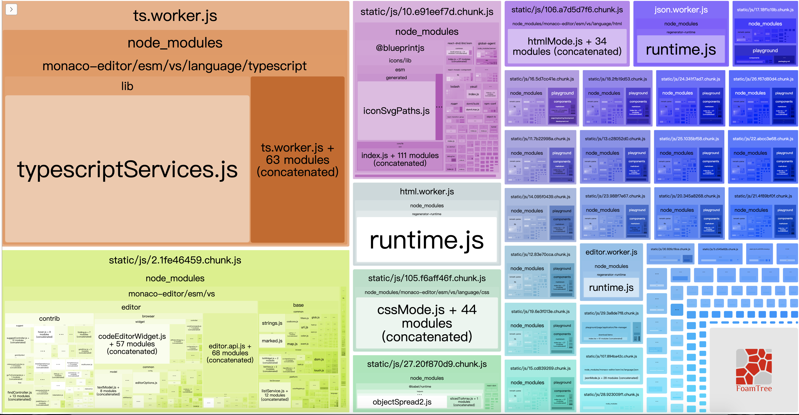
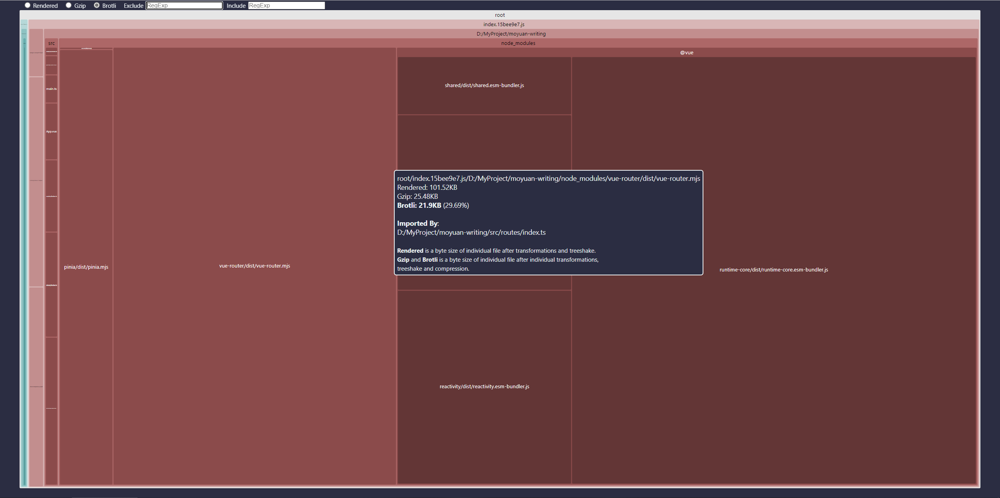
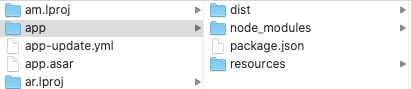

# Electron 项目打包优化配置

## 打包后的文件说明

### 关键文件说明

1. **app.asar**

将我们项目的代码进行打包后的文件。默认情况下会对我们的整个项目进行打包，包括需要使用到的在 `package.json` 中 `dependencies` 声明的包。

可以利用 asar 工具解压这个文件看下里面包含了什么。

解压工具使用文章：[如何解压 app.asar-百度经验 (baidu.com)](https://jingyan.baidu.com/article/60ccbcebb2bb1264cab197b3.html)

#### 反编译 asar 文件

1.反编译 asar 文件，全局安装 asar

```bash
npm install -g asar
```

2.将 app.asar 放在一个新建的文件夹内，然后在根目录右键单击时按住 Shift 键，选择“在此处打开 Power Shell 窗口”

在命令行中输入

```bash
asar extract app.asar ./
```

然后回车，即可回到文件夹查看 extract 出来的文件。注意，所输命令不带引号！“./”表示将 app.asar 反编译（解压）到根目录下，当然你也可以按需制定目标文件夹。

1. **elecrton.asar**

`electron` 的 JS 部分代码。如提供 `remote`、`ipcMain`、`ipcRenderer` 等模块。

1. **electron.exe**

我们应用的主程序。一个事先就编译好的程序，功能就是运行 `resoruces/app.asar` 这个文件内所包含的项目代码。

## 如何正确打包

直接打包存在的问题

1. 体积大
2. 暴露源码

### 优化方向

从项目目录结构中可以看出，`electron.exe`、`electron.asar` 等文件是每个 `Electron` 应用都一样且必需的，因此我们可以优化的空间只是 `app.asar` 文件。

目前 `app.asar` 是将我们的项目整个打包，我们整个应用之所以大，原因在于 `node_modules` 文件夹特别大。因此我们要做的是我们的应用能否不打包 `node_modules` 文件夹，或者让需要打包的东西尽可能的少。

## 打包优化

- 策略
  - 缩减包体积
    - yarn autoclean -I
    - yarn autoclean -F
- 一些概念
  - electron-shared：所有的 electron 共享一个运行时
  - miniblink：国内开发者改版的浏览器的轻量内核：[Miniblink - 免费小巧开源的浏览器控件](http://www.miniblink.net/)

### 减少 `dependencies` 依赖

之所以需要打包 `dependencies` 中的依赖，是因为 `Electron` 是直接运行我们的源码，依赖引用的查找路径是从 `node_modules` 文件夹中查找。

**因此：**

优化应用程序体积 == 减少 `node_modules` 文件夹的大小 == 减少需要打包的依赖数量 == 减少 `dependencies` 中的依赖。

**如何减少 `dependencies` 中的依赖？**

如果我们将代码进行打包，将需要使用到的依赖直接打包进最终的文件，那就可以不需要再将 `node_modules` 打包进应用程序了。并且通过打包一方面可以减少应用的体积，另一方面也可以对我们的代码进行混淆，避免暴露我们的源码。

#### 视图层(网页界面)代码打包

这个和平时的网页项目一样，简单使用 `Webpack` 进行打包就好，大家都会的就不废话了~

当我们对视图层的代码打包之后，只有视图层需要用到的代码就不在需要打包进 `node_module` 文件夹中了。为了不让打包程序将这些只在视图层使用到的依赖打包进 `node_modules` 中，最简单的方式就是在 `package.json` 文件中将这部分依赖从 `dependencies` 中移动到 `devDependencies`（`electron-builder` 不会将 `devDependencies` 中的依赖打包进应用程序）。

（这样的话如果 `eslint` 配置了引用的依赖必须在 `denpendencies` 中声明的规则，则需要将其关闭）

#### 主进程(Electron 层)代码打包

使用 `Webpack` 对主进程的代码打包与普通网页打包基本是一致的。需要注意的是 `target` 需要设置为 `electron-main`。

详细看 `Webpack` 中对 `target` 字段的说明：[Webpack - Target](https://webpack.js.org/configuration/target/)

### 必须保留的 `dependencies` 依赖

当把上面的步骤都做好后，我们将 `node_modules` 从需要打包的文件列表中删除。但打包后会发现 `node_modules` 文件夹还是会被打包进最终的应用中。

实际上 `electron-builder` 保留 `node_modules` 是有原因的。我们使用 `Electron` 开发是为了可以实现跨平台，JS 代码借助 `Electron` 确实是可以实现跨平台，但有些 npm 包为了性能上或者其他因素的考虑，并非使用 JS 而是 C、C++ 来实现。这些包是需要根据平台来编译后才能使用。`electron-builder` 打包时也是在打包某个平台的版本时重新安装相对应平台的依赖包。

### 双 `package.json` 项目结构

上面说到，为不不让 `electron-builder` 将运行时需要用到但是我们自己已经打包好的依赖放进 `node_modules` 里一起打包，我们是将那些依赖放进了 `devDependencies` 中，因为即使设置不打包 `node_modules` 还是会帮我们打包进我们的应用。

虽然将不需要打包的依赖放进 `devDependencies` 可以解决这个问题，但是不太优雅。

而 `electron-builder` 也提供了另外一种方式帮助我们更好的管理依赖：也就是双 `package.json` 项目结构。

#### 双 `packajson.json` 文件进行依赖管理

`electron-builder` 对双 `package.json` 的解释：[Two package.json Structure - electron-builder](https://www.electron.build/tutorials/two-package-structure)

**双 `packajson.json` 具体是怎么样？**

1. 在原本的项目下新建一个需要打包的文件夹 `app`。

如果项目下有 `app` 文件夹，`electron-builder` 在打包时会以改文件夹为打包的根文件夹，即只会打包改文件夹下的文件。配置中设置的需要打包的文件/文件夹也是基于 `app` 文件夹来设置。如设置

```javascript
"build": {
    "files": [
        "dist"
    ]
}
```

则只会打包 `app/dist` 这个文件夹下的内容。

1. `app` 文件夹下创建 `package.json` 文件

由于只会打包 `app` 下的文件，因此我们也需要在 `app` 文件夹下创建 `package.json` 文件，在该文件中配置我们应用的名称、版本、主进程入口文件等信息。

1. 依赖管理

接下来，我们可以把只在开发中使用到的依赖装在整个项目的根目录下，将需要打包的依赖(与平台相关的或者运行时需要的依赖)装在 `app` 文件夹下。因为现在打包工具不会打包除 `app` 文件夹外的文件，因此也不用担心安装在根目录下的 `dependencies` 依赖会被打包进去。

### 进一步减少体积

将 `node_modules` 文件夹移除后相信我们的应用体积已经小了很多。不过这里还有个小技巧可以让我们的体积再小些。

如果我们没有使用到平台相关的依赖(Native npm modules)，我们打包后的应用里是没有 `node_modules` 文件夹的，但是难免会使用到，这时候我们还是需要打包 `node_modules` 文件夹。而发布包的作者一般也不会只打包代码，可能也会打包一些 `README` 等一些打包后不需要用到的文件。这些文件可以通过 `yarn` 提供的 `autoclean` 功能进行清除：

```bash
# 初始化 yarn autoclean, 生成 .yarnclean 文件，和 .gitignore 一样，不过 .yarnclena 是声明需要清理的文件
yarn autoclean -I
# 清理
yarn autoclean -F
```

### 其他底层优化文章

[Electron 源码学习: Electron 程序体积裁剪（减小体积）\_星空漫步者的博客-CSDN 博客\_electron 体积](https://blog.csdn.net/qq_42208826/article/details/107359532)

### 依赖项，按需加载

检查一下依赖项的位置和引用，首先对于 package.json 中依赖项进行排查，查看 dependencies 和 devDependencies 中的依赖项有没有错位的（开发依赖项写在了生产依赖项中），由于打包时只打包 dependencies 中的依赖项，所以在生产环境中用不到的依赖项一律塞至 devDependencies。  
然后再检查引用库的按需加载：

如果是 webpack：可以使用[webpack-bundle-analyzer](https://www.npmjs.com/package/webpack-bundle-analyzer)可视化插件看一下依赖体积图示



如果是 vite：就使用[rollup-plugin-visualizer](https://www.npmjs.com/package/rollup-plugin-visualizer)



---

## vite 打包优化配置

### node_modules 优化

基于`vite`项目依赖包分析插件 `rollup-plugin-visualizer`：[汇总插件可视化工具 - npm (npmjs.com)](https://www.npmjs.com/package/rollup-plugin-visualizer)

#### 1.安装 rollup-plugin-visualizer 插件

```bash
npm install --save-dev rollup-plugin-visualizer
```

#### 2.vite.config.ts 文件添加配置

```js

```

#### 3.项目打包后，打开跟目录下的 `start.html` 文件

分析依赖大小

#### 4.回到项目打开 package.json 文件，分析哪些是开发环境插件哪些是生产环境插件

分析一下打包后的文件包，在 release -> 【版本号命名的文件夹】 -> win-ia32-unpacked -> resources 下有个 app.asar 文件，这其实是个压缩包，目的是保护代码隐私，在 build 中可配置是否需要压缩为 asar 包。  
在 electron-builder.yml 中加入：

```shell
asar: true, // asar打包
```

用 asar 工具包解压。

```shell
# 安装
npm install asar -g

# 解压
asar extract app.asar <解压后的目录>
```

解压然后看下包中有哪些内容：  
  
dist 和 resources 是配置项中指定的需要复制打包的内容，这没有问题，可是 node_modules 中的依赖项已经在 webpack 打包构建时一同打包进了 dist 下，它不应该在这里，而且 electron-builder 配置项 files 中也没有指定复制此文件夹。带着这个疑问，查看一下[文档](https://www.electron.build/configuration/contents)，找到了原因，原来 files 有默认值：

```json
[
	"**/*",
	"!**/node_modules/*/{CHANGELOG.md,README.md,README,readme.md,readme}",
	"!**/node_modules/*/{test,__tests__,tests,powered-test,example,examples}",
	"!**/node_modules/*.d.ts",
	"!**/node_modules/.bin",
	"!**/*.{iml,o,hprof,orig,pyc,pyo,rbc,swp,csproj,sln,xproj}",
	"!.editorconfig",
	"!**/._*",
	"!**/{.DS_Store,.git,.hg,.svn,CVS,RCS,SCCS,.gitignore,.gitattributes}",
	"!**/{__pycache__,thumbs.db,.flowconfig,.idea,.vs,.nyc_output}",
	"!**/{appveyor.yml,.travis.yml,circle.yml}",
	"!**/{npm-debug.log,yarn.lock,.yarn-integrity,.yarn-metadata.json}"
]
```

```vhdl
package.json and **/node_modules/**/* (only production dependencies will be copied) is added to your custom in any case.

意思是：package.json和node_modules（仅仅生产依赖项会被复制）在任何情况下都会被添加至自定义（应该是files配置项下吧）中。
```

那这就很清楚了，我只需要在 files 中添加"!node_modules"即可，打包后体积是 128M，足足小了 37M，安装执行，没有问题。

#### 5.externals 提取项目依赖

从上面的打包分析页面中可以看到，`chunk-vendors.js` 体积为 `2.21M`，其中最大的几个文件都是一些公共依赖包，那么只要把这些依赖提取出来，就可以解决 chunk-vendors.js 过大的问题

可以使用 `externals` 来提取这些依赖包，告诉 webpack 这些依赖是外部环境提供的，在打包时可以忽略它们，就不会再打到 chunk-vendors.js 中

1）vue.config.js 中配置：

```js
module.exports = {
  configureWebpack: {
    externals: {
      vue: 'Vue',
      'vue-router': 'VueRouter',
      axios: 'axios',
      echarts: 'echarts'
    }
}
```

---

#### 图片优化

图片优化在整个项目的优化中是优先级较高的，所谓的图片优化，其实是体积与质量之间的博弈，因此要想减小包中图片的体积，是要牺牲一部分图片质量的，也就是清晰度。做出如下优化：

- 首先对 gif 图在不影响用户观看的前提下做了一定压缩；
- 将一些 png（流程图，logo，线条简单的）转为 svg；
- 将一些截图 png 转为 jpg；

最终将整体包体积 dmg 减小至 102M，ia32exe 为 80M 左右

#### 组件库的按需引入

为什么没有使用 externals 的方式处理组件库呢？

**externals 缺点**：直接在 html 内引入的，失去了按需引入的功能，只能引入组件库完整的 js 和 css

组件库按需引入的原理：最终只引入指定组件和对应的样式

elementUI 需要借助 babel-plugin-component 插件实现，插件的作用如下：

如按需引入 Button 组件：

```vue
import { Button } from 'element-ui' Vue.component(Button.name, Button)
```

编译后的文件（自动引入 button.css）：

```vue
import _Button from "element-ui/lib/button"; import _Button2 from
"element-ui/lib/theme-chalk/button.css"; // base.css是公共的样式 import
"element-ui/lib/theme-chalk/base.css"; Vue.component(_Button.name, _Button);
```

通过该插件，最终只引入指定组件和样式，来实现减少组件库体积大小

1）安装 babel-plugin-component

```bash
npm install babel-plugin-component -D
```

2）babel.config.js 中引入

```js
module.exports = {
	presets: ["@vue/app"],
	plugins: [
		[
			"component",
			{
				libraryName: "element-ui",
				styleLibraryName: "theme-chalk",
			},
		],
	],
};
```

### webpack 打包优化配置

### vue 项目优化配置

### react 项目优化配置

### electron-builder 打包配置优化

#### 双 package.json 配置

官方重构了生产依赖项，提出双 package.json 结构（[two package.json](https://www.electron.build/tutorials/two-package-structure.html)）。顾名思义，通过两个 package.json 管理依赖项。一个用来管理开发依赖项，一个管理应用程序依赖项，最终打包时只打包应用程序依赖项。

- 开发依赖

  此 package.json 在项目根目录下，文件中声明开发依赖和打包脚本；

- 应用程序依赖；

  在 app 文件夹下，声明应用程序依赖，打包时仅打包此文件中声明的依赖。所有的元字段应当在此文件声明（version，name 等）。

#### 版本

electron 版本也会对打包体积有影响，这里用 electron^8 和 10.1.5 小试一下，下图左为 8 版本，右为 10 版本。或许系统版本对打包体积也有影响，这里不做尝试了，有条件同学的可以试一下。


### babel 代码压缩配置

## 源码安全

### asar

```bash
# 安装
npm i asar -g
# 解压
asar eapp.asar unpack
# 进入解压的目录
cd unpack
```

### ASAR Hack

[electron 审计及攻击链研究-其他-IT 技术 (zsbeike.com)](https://www.zsbeike.com/technology/f787ba5a4f.html)

[破解修改 Electron 软件 | 游戏 - JeasonBoy - 博客园 (cnblogs.com)](https://www.cnblogs.com/jeason1997/p/6853737.html)

## electron 打包经验总结&技巧

- 产品发布时版本号需升级，一般遵循 semver 语法，可以使用 npm version patch/minor/major 管理。
- Windows 下需要证书签名，否则可能被杀毒软件误杀
- Mac 下如果没有证书签名，无法使用 Electron 自动更新
- windows 下打包可以写 nsis 逻辑修改安装包
- 开源软件可以基于 Travis，AppVeyor 持续集成
