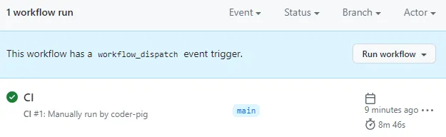

# Github Actions全平台应用打包

> GitHub 的持续集成和持续部署（CI/CD）平台，允许用户自动化他们的构建、测试和部署工作流程。通过在 GitHub 仓库中创建工作流程，开发者可以在每次提交代码、创建拉取请求（PR）、或者定义的其他事件发生时自动运行这些工作流程。

需要 **科学上网**，有个 **Github账号**，以这个开源项目为例，演示下具体打包操作：

- **c001apk
  **https://github.com/bggRGjQaUbCoE/c001apk

① 点击 **Fork**→ 页面跳转后直接按「**Create fork**」

② 接着会自动跳转我们Fork的项目，接着点击「**Actions**」，点击下述按钮：

③ 点击「**CI**」→ 「**Run workflow**」→ 「**Run workflow**」

④ 然后可以看到 **打包脚本正在执行**：

⑤ 打包需要时间，可以过一阵子再来看，出现绿色✅，说明 **打包成功**：

⑥ 点进去，点击「**build**」，找到「**Upload release**」，在这里找到打包好的** apk文件的url**：**

**⑦ 点击url后会 **自动下载**，得到一个apk压缩包，解压安装即可~**

 

还是非常简单，除了打APK外，也可以 **打iOS包**，但需要提供：

- 苹果打包 **证书(.p12)**，以及导出证书的密码。
- 证书对应的 **描述文件(.mobileprovision)**。