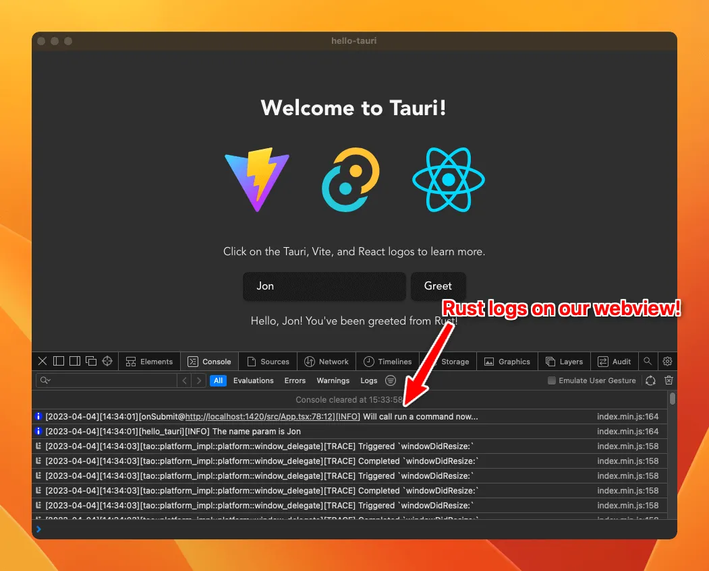

# Tauri 应用日志记录

日志记录是任何应用程序的重要组成部分。这篇文章将向你展示如何使用官方 Tauri 日志插件来记录带有大量示例的消息。

在本指南中，我们将介绍您需要了解的有关使用 Tauri 进行日志记录的所有信息。我们将深入探讨 Tauri 的具体日志功能、如何安装官方插件、如何从 Rust 和 Javascript 生成日志、如何配置应用程序以过滤各种类型的事件。

无论您是初学者还是经验丰富的开发人员，本指南都适合每个人。最后，您将全面了解如何有效地使用 Tauri 进行日志记录以及如何使用这些日志来改进您的应用程序。那么，让我们开始吧！

## 标准记录

您需要知道的第一件事是，使用 Tauri 创建的应用程序默认情况下不具有任何日志记录功能。这听起来可能是一件消极的事情，但实际上是一件好事。这意味着您可以选择最适合您需求的日志库。

我们将在本指南中探索官方 Tauri Log Plugin，它基于非常流行的 Log Rust 箱。

首先，我们将日志箱添加到 Cargo.toml 文件中来安装它：

```rust
[dependencies]
...
log = "^0.4"
```

该板条箱添加了各种宏，您可以使用它们从 Rust 生成日志。最常见的是 `info!` 、 `warn!` 、 `error!` 和 `debug!` 。因此，让我们尝试将其添加到我们的命令之一：

```rust
#[tauri::command]
fn greet(name: &str) -> String {
    info!("The name param is {}", name);

    format!("Hello, {}! You've been greeted from Rust!", name)
}
```

如果您运行该应用程序并查找日志，您将看不到任何内容。这是因为我们还没有为应用程序配置日志输出。这就是官方 Tauri Log Plugin 的用武之地，它不仅提供了一种将日志输出到各个目的地的方法，而且还提供了一种过滤日志的方法，并具有一个 JavaScript 库来从 JavaScript 进行日志记录。

## 安装 Tauri 日志插件

我们首先将插件箱添加到我们的 Cargo.toml 文件中：

```rust
[dependencies]
...
log = "^0.4"
tauri-plugin-log = { git = "https://github.com/tauri-apps/plugins-workspace", branch = "dev" }
```

现在我们只需要将插件添加到 Tauri 的 `main.rs` 文件上的构建管道中：

```rust
fn main() {
    tauri::Builder::default()
        .plugin(tauri_plugin_log::Builder::default().build()) // <-- this line here
        .invoke_handler(tauri::generate_handler![greet])
        .run(tauri::generate_context!())
        .expect("error while running tauri application");
}
```

如果我们启动应用程序并再次触发命令，我们现在会在终端上看到我们的日志消息，以及其他一些消息！

```bash
[2023-04-04][14:11:11][tao::platform_impl::platform::window_delegate][TRACE] Triggered `windowDidResignKey:`
[2023-04-04][14:11:11][tao::platform_impl::platform::window_delegate][TRACE] Completed `windowDidResignKey:`
[2023-04-04][14:11:12][tao::platform_impl::platform::window_delegate][TRACE] Triggered `windowDidBecomeKey:`
[2023-04-04][14:11:12][tao::platform_impl::platform::window_delegate][TRACE] Completed `windowDidBecomeKey:`
[2023-04-04][14:11:17][hello_tauri][INFO] The name param is Jon
```

## 从 JavaScript 记录

Tauri 的美妙之处在于您只需使用 JavaScript 就可以完成几乎任何事情，日志记录也不例外。 Tauri 日志插件附带一个 JavaScript 库，您可以使用它从 JavaScript 进行日志记录。

您可以使用 npm （或 yarn/pnpm）安装它：

```bash
npm add https://github.com/tauri-apps/tauri-plugin-log
```

然后从库中导入相同的 `info` 、 `warn` 、 `error` 和 `debug` 函数：

```js
import { info } from "tauri-plugin-log-api";

function App() {
  ...
  async function greet() {
    info("Will call run a command now...") // <-- this line here

    await invoke("greet", { name });
  }
...
```

如果您再次运行该应用程序，您将在终端上看到该消息以及来自 Rust 的其他日志。

你可能认为一切都结束了，但事实并非如此。继续阅读一些额外的简洁功能。

## 配置 Tauri 日志插件

默认情况下，插件会将日志输出到：

- Stdout，如果您从开发中运行它，这就是您的终端；
- 日志文件，位于用户的主目录中。在哪里可以找到 Tauri Apps 的日志文件？

但是这个插件（像许多其他插件一样）是高度可配置的，因此您可以更改日志输出以及其他一些设置。

让我们探讨一下我们可以做的一些事情。

### 1.输出到 webview 控制台

如果您花费大部分时间在开发工具打开的情况下开发应用程序，您可能会发现将日志输出到 webview 控制台很有用。我们可以通过将 `LogTarget::Webview` 作为目标添加到插件来做到这一点：

```rust
use tauri_plugin_log::LogTarget;

.plugin(tauri_plugin_log::Builder::default().targets([
    LogTarget::Stdout,
    LogTarget::Webview,
]).build())
```

在上面的示例中，日志将被转发到终端和 webview 控制台。要实际在 webview 控制台上查看日志，您需要从 JavaScript 调用 `attachConsole` ，最好尽早在您的 index.ts/js 文件中调用：

```js
import React from "react";
import ReactDOM from "react-dom/client";
import App from "./App";
import { attachConsole } from "tauri-plugin-log-api";

attachConsole(); // <-- this line here

ReactDOM.createRoot(document.getElementById("root") as HTMLElement).render(
  <React.StrictMode>
    <App />
  </React.StrictMode>
);
```



您可能还会发现为调试和发布版本设置不同的输出目标很有用，这可以通过以下方式实现：

```rust
#[cfg(debug_assertions)]
const LOG_TARGETS: [LogTarget; 2] = [LogTarget::Stdout, LogTarget::Webview];

#[cfg(not(debug_assertions))]
const LOG_TARGETS: [LogTarget; 2] = [LogTarget::Stdout, LogTarget::LogDir];

.plugin(tauri_plugin_log::Builder::default().targets(LOG_TARGETS).build())
```

上面的代码将使用 stdout 和 logdir 进行发布版本，使用 stdout 和 webview 进行调试版本。

您可以对我们接下来将探讨的其他设置使用相同的技术。

### 2. 彩色输出

有些日志肯定比其他日志更重要，因此最好有一种方法来区分它们。 Tauri 日志插件允许您为各种不同的日志级别着色，以便您可以轻松发现重要的日志级别。

我们首先在插件箱上启用 `colored` 功能：

```rust
...
log = "^0.4"
tauri-plugin-log = { git = "https://github.com/tauri-apps/plugins-workspace", branch = "dev", features = ["colored"] }
```

然后在插件生成器上启用它：

```rust
.plugin(
    tauri_plugin_log::Builder::default().targets([
        LogTarget::Stdout,
        LogTarget::Webview,
    ])
+   .with_colors(ColoredLevelConfig::default())
    .build()
)
```

就是这样！现在，您将看到根据级别不同颜色的日志，例如红色表示错误，黄色表示警告。这是您可能希望为调试和发布版本使用不同配置的另一个设置。

### 3. 过滤不需要的日志

我们将探讨的最后一个配置是过滤不需要的日志的能力。您可能已经注意到，由于 Tauri 的内部日志，终端上有相当多的噪音。

`log` 板条箱非常受欢迎，因此您最终很可能会添加一个依赖项，该依赖项也将它用于自己的日志记录，该依赖项将与您自己的日志一起显示。

在过滤方面我们能做的第一件事就是提高最低日志级别。默认情况下，插件将输出所有日志，但我们可以通过设置最低日志级别来更改：

```rust
+ use log::LevelFilter;

.plugin(
    tauri_plugin_log::Builder::default().targets([
        LogTarget::Stdout,
        LogTarget::Webview,
    ])
    .with_colors(ColoredLevelConfig::default())
+   .level(LevelFilter::Warn)
    .build()
)
```

上面的代码将仅输出级别为 `warn` 或更高级别的日志，这可能非常适合发布版本。

但如果过滤太多，我们也可以按模块过滤。该插件允许您指定要过滤的模块列表和相应的日志级别，如果您想过滤掉特定依赖项的日志，这非常有用：

```rust
.plugin(
    tauri_plugin_log::Builder::default().targets([
        LogTarget::Stdout,
        LogTarget::Webview,
    ])
    .with_colors(ColoredLevelConfig::default())
+   .level_for("tauri", LevelFilter::Info)
+   .level_for("hyper", LevelFilter::Info)
    .level(LevelFilter::Debug)
    .build(),
)
```

上面的代码只会输出级别为 `info` 或更高级别的 `tauri` 和 `hyper` 模块的日志，同时保留级别为 `debug` 或更高。

## 结论

就是这样，您现在知道如何从 Rust 和 JavaScript 进行日志记录，以及如何根据您的喜好配置 Tauri 日志插件。我希望这篇文章对您有用！

如果您有兴趣深入了解用户如何使用您的应用程序，您可能需要查看 Aptabase，这是一个尊重用户隐私的隐私优先分析平台。

## 在 Tauri Apps 上哪里可以找到日志文件

使用 Tauri 的官方 `log` 插件。在要求用户报告问题和共享日志文件时通常需要这些日志。

Tauri 应用程序的日志在哪里？嗯，这取决于您运行应用程序的平台。

| 平台     | 地点                                     | 例子                                                   |
| -------- | ---------------------------------------- | ------------------------------------------------------ |
| 苹果系统 | `$HOME/Library/Logs/{bundleIdentifier}`  | `/Users/Bob/Library/Logs/com.domain.appname`           |
| 视窗     | `%APPDATA%\${bundleIdentifier}\logs`     | `C:\Users\Bob\AppData\Roaming\com.domain.appname\logs` |
| Linux    | `$HOME/.config/${bundleIdentifier}/logs` | `/home/bob/.config/com.domain.appname\logs`            |

但是 `bundleIdentifier` 是什么？这是在您的 `tauri.conf.json` 文件中配置的。例如，如果您有以下配置，则捆绑包标识符将为 `com.domain.appname` 。

```json
{
  "$schema": "../node_modules/@tauri-apps/cli/schema.json",
  "build": {
    "beforeBuildCommand": "npm run build:vite",
    "beforeDevCommand": "npm run dev:vite",
    "devPath": "http://localhost:5173",
    "distDir": "../dist"
  },
  "package": {
    "productName": "YourAppName",
    "version": "1.3.2"
  },
  "tauri": {
    "bundle": {
      "active": true,
      "category": "DeveloperTool",
      "identifier": "com.domain.appname",
      ...
```
