# Tauri2移动端开发和打包

## 一、Tauri2.0环境搭建与项目创建

### 一、搭建 Tauri 2.0 开发环境

> 本教程默认你已经安装基本开发环境，如果你没有安装，请查看官方教程：[前置要求 | Tauri](https://v2.tauri.app/zh-cn/start/prerequisites/)

我当前的环境如下

| 软件   | 版本     |
| ------ | -------- |
| Nodejs | v20.12.2 |
| pnpm   | v9.12.1  |
| rust   | 1.81.0   |

介绍安装pnpm，pnpm是一个好用的Node包管理工具。安装较为简单

```
npm install pnpm -g
```

安装没有报错就说明安装成功。

查看版本：

```bash
pnpm -v
```

### 二、创建 Tauri 2 项目

官方教程：[创建项目 | Tauri](https://v2.tauri.app/zh-cn/start/create-project/)

pnpm创建

```bash
pnpm create tauri-app
```

> 执行那条命令，以下是输入的选项：

1. 项目名：`tauri-vue`
2. 前端语言：`Typescript / JavaScript`
3. 包管理器：`pnpm`
4. UI模板：`Vue`

### 三、安装依赖

按照提示，应该是依次执行

```
cd tauri-vue
pnpm install
```

等待依赖安装完成后，就可以运行项目了

### 四、编译运行

接下来直接编译运行初始项目，看看效果

```
pnpm tauri dev
```

> 命令运行后有一个较长的编译过程


编译完成后，效果如下


### 五、设置开发环境

无论是Tauri还是Rust，官方都建议使用VSCode来进行开发，同时对其支持也是相当完善，因此下文使用VSCode编辑器做开发。安装好VSCode后，只需要安装以下安装插件

- Tauri
- rust-analyzer
- vue

## 二、项目结构

当前项目文件结构如下


在当前目录中，需要关心的，基本上只有

- src：Vue前端源文件夹
- src-tauri：Rust后端源文件夹


## tauri的移动端开发环境配置和编译

### 环境安装

参考官方说明：[前置要求 | Tauri](https://v2.tauri.app/zh-cn/start/prerequisites/#移动端配置)

1.关于C++组件

```bash
对于 Windows 用户，请确保至少安装了 Win10 SDK(10.0.19041.0) 和 Visual Studio Build Tools 2022（版本 17.2 或更高），此外还需要安装以下组件：

Microsoft Visual C++ 2015-2022 Redistributable (x64)
Microsoft Visual C++ 2015-2022 Redistributable (x86)
Microsoft Visual C++ 2012 Redistributable (x86)（可选）
Microsoft Visual C++ 2013 Redistributable (x86)（可选）
Microsoft Visual C++ 2008 Redistributable (x86)（可选）
```

2.Rust版本，最新稳定版即可，我已经升到1.70了。并且需要包含安卓的所有跨跨平台编译器。参考上面的链接就是需要运行这个命令了。

```bash
rustup target add aarch64-linux-android armv7-linux-androideabi i686-linux-android x86_64-linux-android
```

3.Nodejs/npm/pnpm安装。nodejs选择最新的lts版本就好了，当前应该是18.12，npm装完nodejs自带就有。pnpm可以用npm安装。例如用这个命令：

```bash
npm install -g pnpm
```

4.需要安卓Android Studio开发工具，安装最新版即可。

- SDK安装：打开Android Studio，选择`Tool`-`SDK Manager`，然后安装你想要安装的SDK版本。以我为例，我的手机是安卓12，我想打包后的apk兼容安卓9-13，那就勾选完9-13的所有SDK，然后点击`Apply`即可开始下载（或许需要外网环境
- 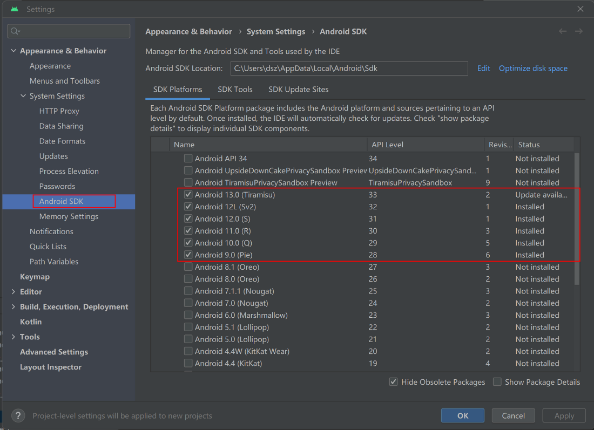
- NDK安装：打开Android Studio，选择`Tool`-`SDK Manager`，还是上面哪个界面，点击`SDK Tools`，需要安装`Android SDK Build-Tools`，`NDK (Side by Side)`，`Android SDK Command Tools (Latest)`，`Cmake`，`Android Auto API Simulatros`，`Android Emulator`（安卓模拟器），`Android Emulator Hypervisor Driver (installer)`，`Android SDK Platform-Tools`，`Google USB Driver` (谷歌USB驱动，用于adb调试），`Google Web Driver`(谷歌wifi驱动，用于adb wifi调试），`Intel X86 Emulator Accelerator (HAXM installer)`，然后点击`Apply`开始下载。
- 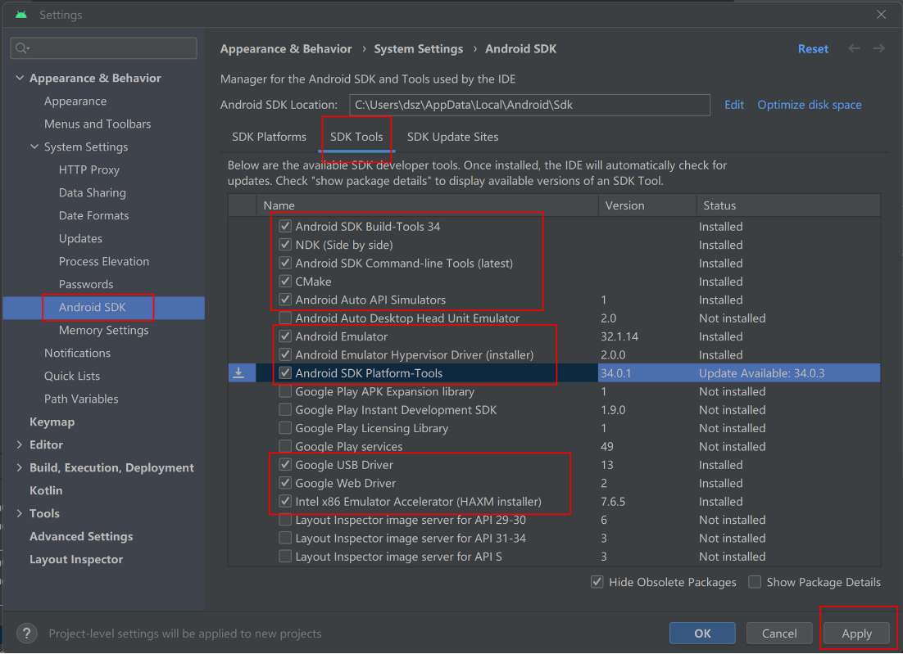
- 拷贝SDK路径：打开Android Studio，选择`Tool`-`SDK Manager`，还是上面哪个界面，将`Android SDK Locations`后面的路径拷贝一下，我的显示是：`C:\Users\dsz\AppData\Local\Android\Sdk`

5.环境设置。对于Win11：打开`Windows设置`-`系统`-`系统信息`-`高级系统设置`-`环境变量`。在用户环境，新建用户变量。下面是几个需要构建的变化。

- 变量名：`ANDROID_HOME`，变量值：`C:\Users\dsz\AppData\Local\Android\Sdk` 这个路径是从刚刚上一步拷贝而来的这个路径是从刚刚上一步拷贝而来的
- 变量名：`JAVA_HOME`，变量值：`C:\Program Files\Android\Android Studio\jbr` (这个路径需要根据你的**Android Studio安装目录**决定，我是默认安装位置，所以就是这个了。)
- 变量名：`NDK_HOME`，变量值：`C:\Users\dsz\AppData\Local\Android\Sdk\ndk\25.2.9519653` （注意这个路径需要你去`C:\Users\你的用户名\AppData\Local\Android\Sdk\ndk`找找看，版本号不一定是我这个。
- 然后再找到用户变量的`Path变量`，选择编辑。
- 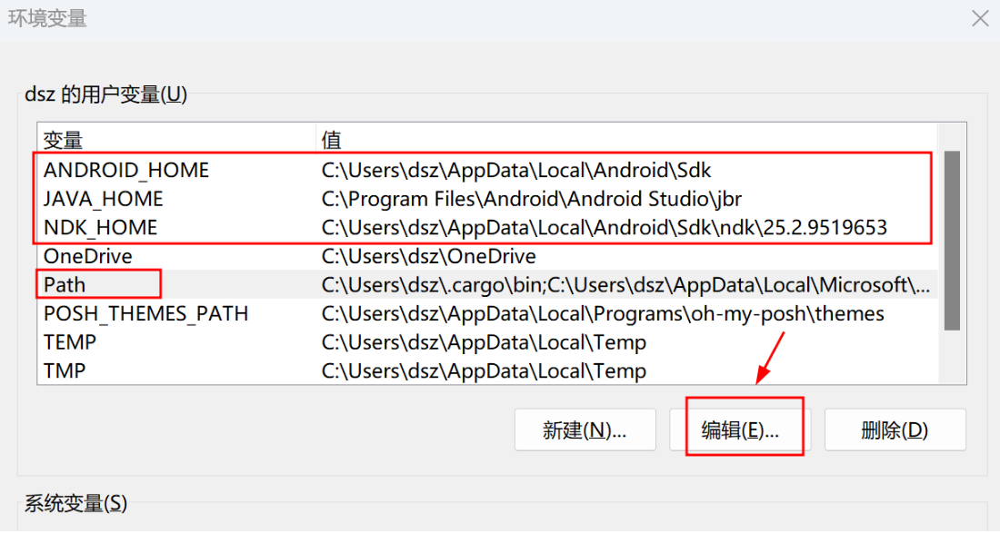
- 然后再新建三个路径（需要根据你的用户名找到对应的路径）：
- `C:\Program Files\Android\Android Studio\jbr\bin` 这个提供了一些java运行命令以及最后apk签名的工具。
- `C:\Users\dsz\AppData\Local\Android\Sdk\platform-tools` 这个下面提供了一些adb工具，可以用来控制你的手机安装软件。
- `C:\Users\dsz\AppData\Local\Android\Sdk\build-tools\34.0.0` 这个下面是一些apk查看，编辑的工具，可以用来定位apk错误信息。
- 参考截图如下：
- 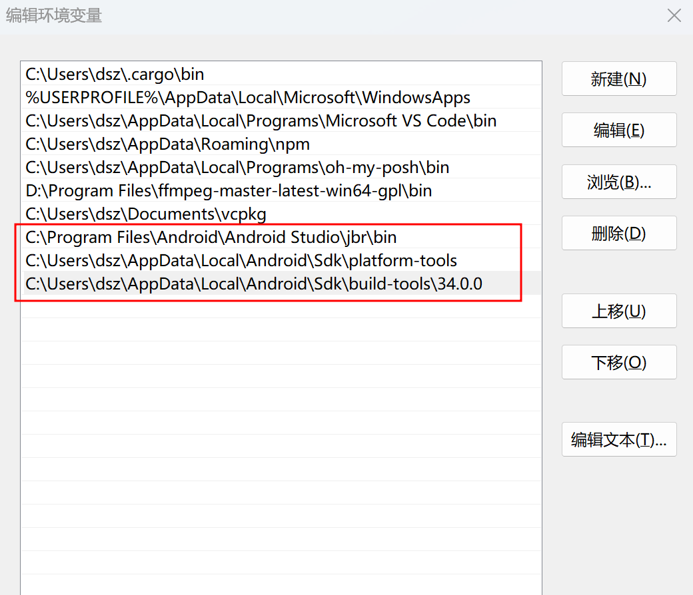
- 保存完环境变量后，需要验证一下。打开powershell。输入下面几个命令，如果没有提示找不到xxx，则说明ok。

```bash
java --version
rustc --version
pnpm --version
adb --version
node --version
npm --version
pnpm --version
aapt
jarsigner --help
keytool --help
```

### 迁移项目到Tauri 2.0

[更新和迁移 | Tauri](https://v2.tauri.app/zh-cn/start/migrate/)

- 观察tauri github项目主页：https://github.com/tauri-apps/tauri
- 主页下面有一个表格，里面写了最新tauri版本。
- 运行下面的命令，来更新rust项目中需要的tauri版本。

```bash
pnpm add tauri@2.0.0
pnpm add tauri-build@2.0.0 --build
pnpm install tauri-cli --version "^2.0.0"
```

### 移动端运行项目：模拟器调试和编译安卓APK

#### 1.需要打开Android Studio的安卓模拟器或者adb命令连接你的手机，建议后者会更好一些。

可以用下面的adb命令查看当前电脑已经连接的设备。如果没有，则会运行项目时会自动打开虚拟机中的模拟器。

```bash
adb devices
```

也可以去Android Studio，打开`Tool`-`Device Manager`查看你的虚拟机。如果虚拟机也么有，那就需要去Device Manage，点击`Create`创建一个了。

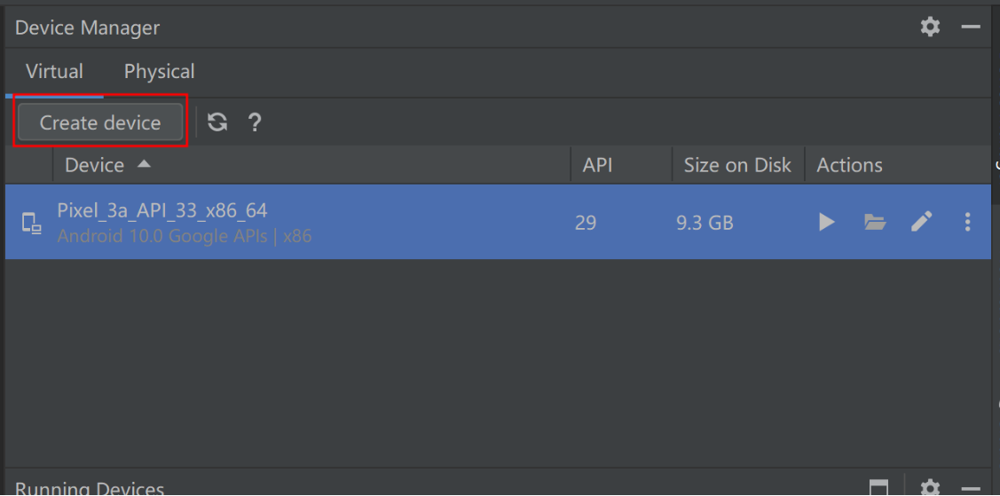

#### 2.回到项目根路径，用tauri 2.0编译生成安卓代码

参考教程：[开发 |折腾 (tauri.app)](https://v2.tauri.app/zh-cn/develop/#developing-your-mobile-application)

```bash
pnpm tauri android init
```

#### 3.以dev环境运行安卓项目

运行后会依次编译，安卓运行后会依次编译web tauri，安卓，此时手机/虚拟机会自动安装apk。你点击手机屏幕会电脑终端可以看到对应的调试信息。

这个命令，只要按照前面的配置，可以按下面命令一键运行项目，会自动启动Android Studio安装过的安卓虚拟机

```bash
pnpm tauri android dev
```

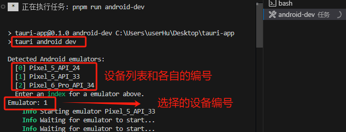

初次运行需要下载一些依赖项：

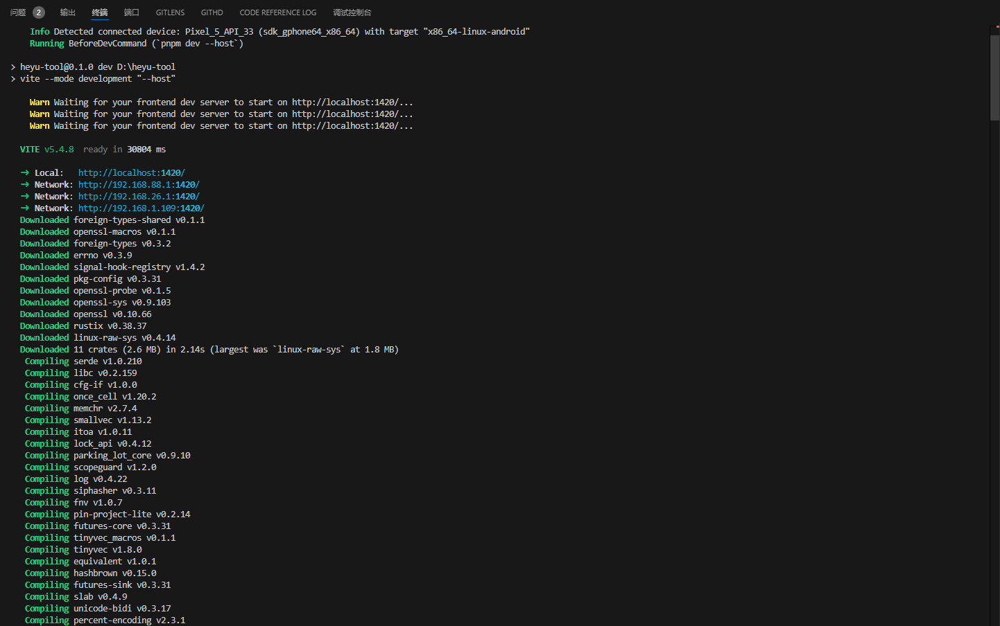

运行后，可以在这个项目根目录下的：`src-tauri\gen\android\app\build\outputs\apk\arm64\debug`路径看到这个apk，它的命名为`app-arm64-debug.apk`。

#### 4.正式使用时，一般不需要那么多调试信息，而且也要缩减安装包大小

所以需要编译一下正式版应用。运行下面的命令即可编译正式版应用，可能需要2-5分钟。

```bash
pnpm tauri android build
```

- 输出结果如下：

```bash
See https://docs.gradle.org/8.0/userguide/command_line_interface.html#sec:command_line_warnings
    Finished 1 APK at:
        C:\Users\dsz\Documents\rust_web\tauri_demo\src-tauri/gen/android\app/build/outputs/apk/universal/release/app-universal-release-unsigned.apk

    Finished 1 AAB at:
        C:\Users\dsz\Documents\rust_web\tauri_demo\src-tauri/gen/android\app/build/outputs/bundle/universalRelease/app-universal-release.aab
```

- 可以看到生成了apk和aab两个安装包。
- 观察apk命名：`app-universal-release-unsigned.apk`有两个关键信息，`universal`代表多架构，`unsigned`代表未包含签名。
- 尝试将这个apk放到安卓手机安装，提示没有签名无法安装。
- 多架构说明还能精简一下，像手机一般用arm64就行了，多余的目前用不上。
- 目前要做的事情是先给apk签名。

#### 5.生成签名

参考教程：[Distribute | Tauri](https://v2.tauri.app/zh-cn/distribute/)

根据这个链接，我们需要先生成一个签名。对于windows，使用下面这个命令来生成(注意keystore里面的用户名改成你的，最好是全英语）。

```bash
keytool -genkey -v -keystore C:\Users\dsz\upload-keystore.jks -storetype JKS -keyalg RSA -keysize 2048 -validity 10000 -alias upload
```

- 注意口令千万记牢固了，否则要重新生成了，会影响到后期的上架应用商店问题。
- 参考输入

```bash
输入密钥库口令:
再次输入新口令:
您的名字与姓氏是什么?
  [Unknown]:  Tlntin Deng
您的组织单位名称是什么?
  [Unknown]:  MyCompany
您的组织名称是什么?
  [Unknown]:  MyOrg
您所在的城市或区域名称是什么?
  [Unknown]:  GuangZhou
您所在的省/市/自治区名称是什么?
  [Unknown]:  GuangDong
该单位的双字母国家/地区代码是什么?
  [Unknown]:  CN
CN=Tlntin Deng, OU=MyCompany, O=MyOrg, L=GuangZhou, ST=GuangDong, C=CN是否正确?
  [否]:  Y
```

- 生成完签名后，还需要将签名应用到apk中，还是参考上面的链接。先建一个`src-tauri/gen/android/key.properties`文件。填入你的口令以及签名路径：

```bash
storePassword=xxxxxxxxx
keyPassword=xxxxxxxxx
keyAlias=upload
storeFile=C:\\Users\\dsz\\upload-keystore.jks
```

- 修改`src-tauri/gen/android/app/build.gradle.kts`文件。基本修改内容就是参考链接里面说的。我这里不再废话了。修改完长这样：

```bash
import java.util.Properties
import java.io.FileInputStream

plugins {
    id("com.android.application")
    id("org.jetbrains.kotlin.android")
    id("rust")
}

val keyPropertiesFile = rootProject.file("key.properties")
val keyProperties = Properties()
keyProperties.load(FileInputStream(keyPropertiesFile))

android {
    compileSdk = 33
    namespace = "com.tauri.tauri_demo"
    defaultConfig {
        manifestPlaceholders["usesCleartextTraffic"] = "false"
        applicationId = "com.tauri.tauri_demo"
        minSdk = 24
        targetSdk = 33
        versionCode = 1
        versionName = "1.0"
    }

    signingConfigs {
       create("release") {
           keyAlias = keyProperties["keyAlias"] as String
           keyPassword = keyProperties["keyPassword"] as String
           storeFile = file(keyProperties["storeFile"] as String)
           storePassword = keyProperties["storePassword"] as String
       }
    }

    buildTypes {
        getByName("debug") {
            manifestPlaceholders["usesCleartextTraffic"] = "true"
            isDebuggable = true
            isJniDebuggable = true
            isMinifyEnabled = false
            packaging {                jniLibs.keepDebugSymbols.add("*/arm64-v8a/*.so")
                jniLibs.keepDebugSymbols.add("*/armeabi-v7a/*.so")
                jniLibs.keepDebugSymbols.add("*/x86/*.so")
                jniLibs.keepDebugSymbols.add("*/x86_64/*.so")
            }
        }
        getByName("release") {
            isMinifyEnabled = true
            signingConfig = signingConfigs.getByName("release")
            proguardFiles(
                *fileTree(".") { include("**/*.pro") }
                    .plus(getDefaultProguardFile("proguard-android-optimize.txt"))
                    .toList().toTypedArray()
            )
        }
    }
    kotlinOptions {
        jvmTarget = "1.8"
    }
}

rust {
    rootDirRel = "../../../"
}

dependencies {
    implementation("androidx.webkit:webkit:1.6.1")
    implementation("androidx.appcompat:appcompat:1.6.1")
    implementation("com.google.android.material:material:1.8.0")
    testImplementation("junit:junit:4.13.2")
    androidTestImplementation("androidx.test.ext:junit:1.1.4")
    androidTestImplementation("androidx.test.espresso:espresso-core:3.5.0")
}

apply(from = "tauri.build.gradle.kts")
```

- 在项目根目录，终端环境下，重新运行一次编译命令。

```bash
pnpm tauri android build
```

- 输出结果如下：

```bash
See https://docs.gradle.org/8.0/userguide/command_line_interface.html#sec:command_line_warnings
    Finished 1 APK at:
        C:\Users\dsz\Documents\rust_web\tauri_demo\src-tauri/gen/android\app/build/outputs/apk/universal/release/app-universal-release.apk

    Finished 1 AAB at:
        C:\Users\dsz\Documents\rust_web\tauri_demo\src-tauri/gen/android\app/build/outputs/bundle/universalRelease/app-universal-release.aab
```

- 可以看到文件没有提示未签名（unsigned）了。

#### 6.精简架构（可选），观察一下目前apk的信息（注意路径改成你的）。

```bash
aapt dump badging C:\Users\dsz\Documents\rust_web\tauri_demo\src-tauri/gen/android\app/build/outputs/apk/universal/release/app-universal-release.apk
```

- 输出结果：

```bash
native-code: 'arm64-v8a' 'armeabi-v7a' 'x86' 'x86_64
```

- 可以看到目前有4种架构，分别是arm 64位/arm 32位，x86 32位，x86 64位，一般来说，我们手机都是arm架构，除非用电脑模拟器，否则只需要arm64就行。
- 获取编译安卓时的帮助信息

```bash
pnpm tauri android build --help
```

- 输出结果：

```bash
Android build

Usage: pnpm tauri android build [OPTIONS]

Options:
  -d, --debug                     Builds with the debug flag
  -v, --verbose...                Enables verbose logging
  -t, --target [<TARGETS>...]     Which targets to build (all by default) [possible values: aarch64, armv7, i686, x86_64]
  -f, --features [<FEATURES>...]  List of pnpm features to activate
  -c, --config <CONFIG>           JSON string or path to JSON file to merge with tauri.conf.json
      --split-per-abi             Whether to split the APKs and AABs per ABIs
      --apk                       Build APKs
      --aab                       Build AABs
  -o, --open                      Open Android Studio
  -h, --help                      Print help
  -V, --version                   Print version
```

- 注意：`-t, --target [<TARGETS>...] Which targets to build (all by default) [possible values: aarch64, armv7, i686, x86_64]` 这里说`all by default`，默认是4种架构都支持，我们需要arm64，所以就选`aarch64`即可。
- 于是下面编译正式版时，指定一下架构aarch64。在项目根目录，终端环境下，重新运行一次编译命令。

```bash
pnpm tauri android build --target aarch64
```

- 观察输出结果，命名好像没有变化，还是通用架构，已签名。

```bash
See https://docs.gradle.org/8.0/userguide/command_line_interface.html#sec:command_line_warnings
    Finished 1 APK at:                                                                                                                                                                             
        C:\Users\dsz\Documents\rust_web\tauri_demo\src-tauri/gen/android\app/build/outputs/apk/universal/release/app-universal-release.apk                                                         

    Finished 1 AAB at:
        C:\Users\dsz\Documents\rust_web\tauri_demo\src-tauri/gen/android\app/build/outputs/bundle/universalRelease/app-universal-release.aab
```

- 观察一下新apk安装包的信息：

```bash
aapt dump badging C:\Users\dsz\Documents\rust_web\tauri_demo\src-tauri/gen/android\app/build/outputs/apk/universal/release/app-universal-release.apk
```

- 输出结果：

```bash
native-code: 'arm64-v8a
```

- 目前只支持单一架构了。文件名大小从38M到11M，减少了70%多。
- 然后把这个安装包发到手机上，就可以安装了。如果提示签名不一致，那就卸载一下旧版。

## 环境配置2

### 文档

配置文档：[移动端配置](https://v2.tauri.app/zh-cn/guides/prerequisites/#%E7%A7%BB%E5%8A%A8%E7%AB%AF%E9%85%8D%E7%BD%AE)

安全：[Capability | Tauri](https://v2.tauri.app/zh-cn/reference/acl/capability/)

### 1.安装AndroidStudio以及对应版本(可以是其他版本，但路径要对应)

```bash
安装Android Sdk Platform 34
安装Android SDK Platform-Tools
安装NDK (Side by side) 26.0.10792818
安装Android SDK Build-Tools 34.0
安装Android SDK Command-line Tools
```

### 2.配置环境变量(建议直接配置在系统环境)

```bash
rustup target add aarch64-linux-android armv7-linux-androideabi i686-linux-android x86_64-linux-android

#这里根据具体路径进行设置
[System.Environment]::SetEnvironmentVariable("JAVA_HOME", "C:\Program Files\Android\Android Studio\jbr", "User")
[System.Environment]::SetEnvironmentVariable("ANDROID_HOME", "$env:LocalAppData\Android\Sdk", "User")
[System.Environment]::SetEnvironmentVariable("NDK_HOME", "$env:LocalAppData\Android\Sdk\ndk\26.0.10792818", "User")
```

### 3.初始化tauri文件(这里对非安卓同样有效)

运行命令

```bash
pnpm tauri init    #找一个空文件夹初始化tauri项目(建议先配前端，他可以自动分析)

# Where are your web assets：如果是标准项目../src目录即可，如果是vite配置../dist
# What is the URL of your dev server?： 如果是vite，http://localhost:%vite端口%。否则src目录即可
# What is your frontend dev command?：如果是vite，则为npm run dev，否则空
# What is your frontend build command? ：如果是vite，则为npm run build，否则空
```

配置好后修改tauri.conf.json的identifier

### 4.初始化tauri安卓环境

```bash
pnpm tauri android init    # 初始化安卓项目
pnpm tauri android open    # 通过android studio打开安卓项目(会自动下载gradle环境)
```

### 5.额外需要配置的东西

配置powershell开发者模式

```bash
# Windows启动开发者模式
reg add "HKEY_LOCAL_MACHINE\SOFTWARE\Microsoft\Windows\CurrentVersion\AppModelUnlock" /t REG_DWORD /f /v "AllowDevelopmentWithoutDevLicense" /d "1"
```


### 6.运行

```bash
pnpm tauri dev # 测试
pnpm tauri build   # 构建
pnpm tauri android dev     # 测试安卓
pnpm tauri android build   # 构建安卓
```


### 7.修改配置用来发布

链接

```json
"bundle": {
  "active": true,    # 这个直接true就行，代表绑捆的应用，跟targets挂钩
  "category": "类型",
  "copyright": "软件协议",
  "identifier": "唯一标识符",
  "longDescription": "长介绍",
  "shortDescription": "短介绍",
  "publisher": "发布者",
},
```


### 8.对发布后的apk进行签名

```bash
#创建签名，接下来签名密码要记住
keytool -genkey -v -keystore 密钥存储位置 -alias 密钥别名(一般和密钥一样就行) -keyalg RSA -validity 30000(持续时间)

#用apksigner进行签名
apksigner sign --ks (签名地址) --ks-key-alias (别名) --out (签名后的apk地址) (待签名apk地址)

#进行验证
apksigner verify -v --print-certs (apk地址)

#修改对齐(如果安装报对齐错误再使用)
zipalign -c -v 4 existing.apk #查看应用对齐方式
zipalign -p -f -v 4 infile.apk outfile.apk  #修改对齐(直接用这个即可，上面这个是输出信息的)
```


## 开启远程调试功能

本节内容为使用Tauri App使用远程调试功能，借助**PageSpy**提供的强大功能，Tauri可以很方便的调试自己的App，除断点调试无法实现外，抓包，元素审查，查看localstorage以及查看系统特性等功能都是可以使用的，基本可以满足调试要求，并且接入相当简单，推荐大家在使用Tauri调试移动端时使用。（比如安卓，tauri是可以读logcat的，但是总是会输出一些无关信息，影响开发效率，还是这种Chrome开发这工具的更方便，但logcat你也得学会看，这只是方不方便的区别）

### 一、搭建PageSpy环境

第一步先搭建PageSpy环境，首先找官方仓库，你只要在Github搜 `page-spy-web` 就可以了，当然也可以直接使用我的命令，前提是得有docker或者podman。

```
# docker 部署
docker run -d --restart=always -p 6752:6752 --name="pageSpy" ghcr.io/huolalatech/page-spy-web:release
# podman 部署
podman run -d --restart=always -p 6752:6752 --name="pageSpy" ghcr.io/huolalatech/page-spy-web:release
```

你也可以使用Node来部署

```bash
yarn global add @huolala-tech/page-spy-api
# 如果你使用 npm
npm install -g @huolala-tech/page-spy-api
```

安装完只要命令行运行`page-spy-api`启动服务，然后访问`ip:6752`就可以了。

打开页面显示

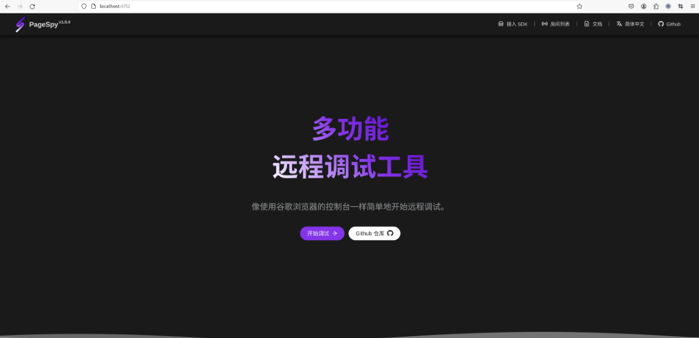

### 二、接入SDK

点击接入SDK就会出现

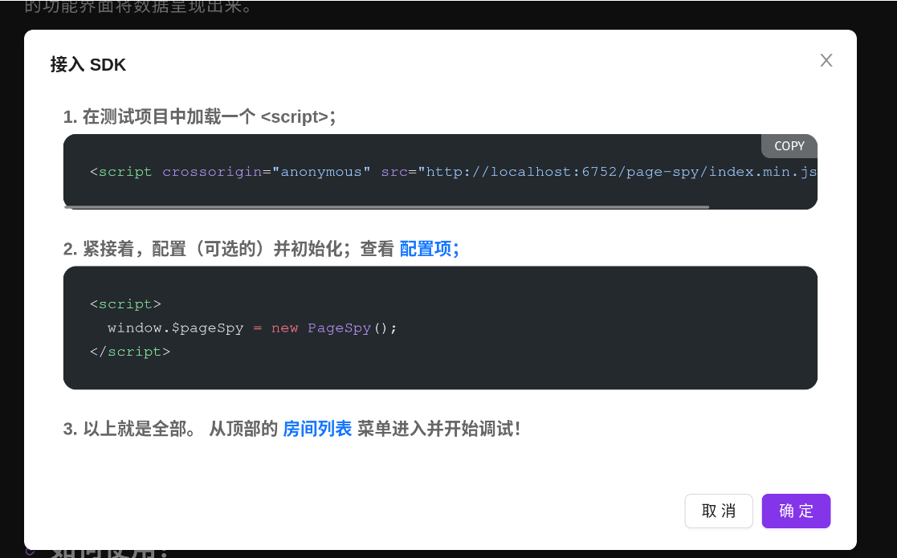

```html
<script crossorigin="anonymous" src="http://localhost:6752/page-spy/index.min.js"></script>
<script>
   window.$pageSpy = new PageSpy();
</script>
```

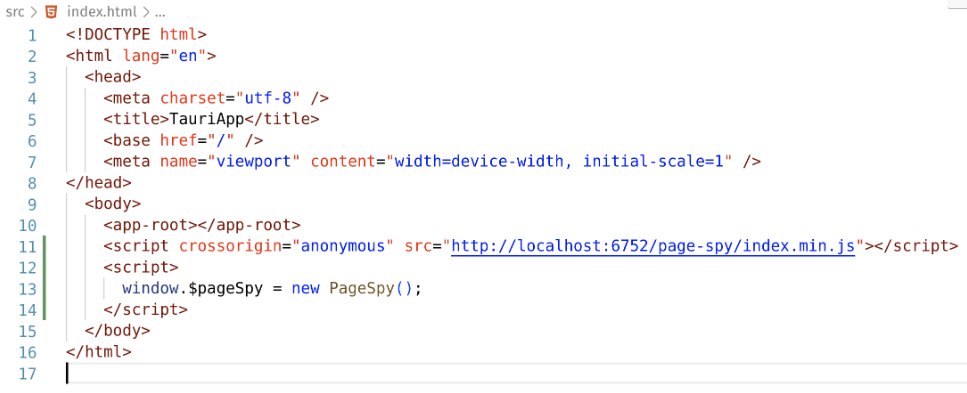

> localhost换成你的远程地址才可用

### 三、进行远程调试

此时运行你的项目，会出现一个logo


表明已经连接到远程调试了，然后在**PageSpy**的Web页面进入房间页面，就会有你的设备

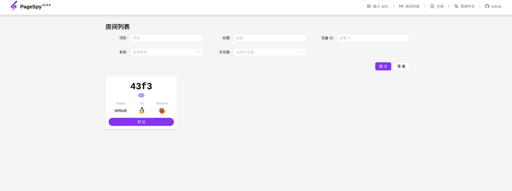

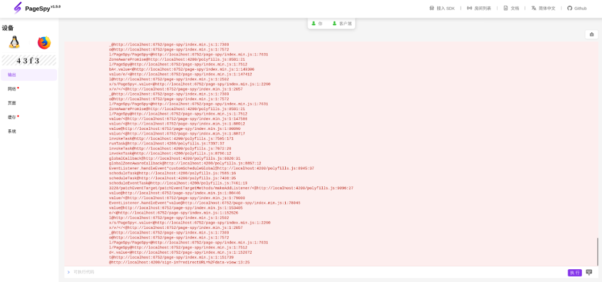


能做Tauri开发说明你已经是个老玩家了，这个界面会相当熟悉，新手也不用慌，可以F12玩玩你的开发者工具。

### 调试控制台

控制台查看调试输出的内容，以及进行一些js命令的运行。

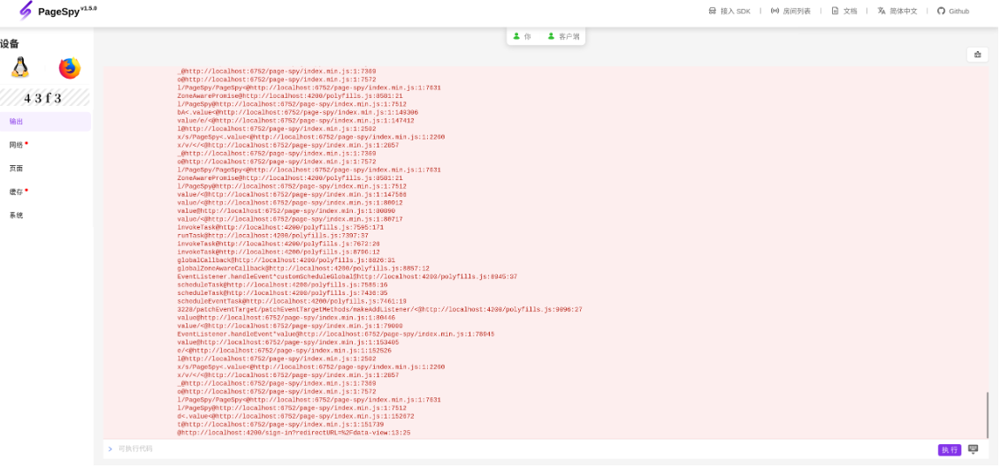

### 网络抓包

抓取请求响应，调试必备。

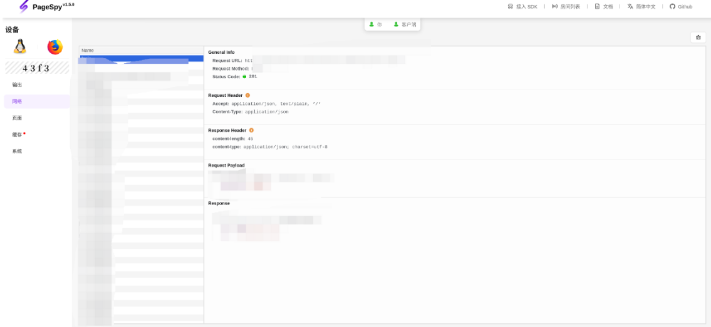


### 审查元素

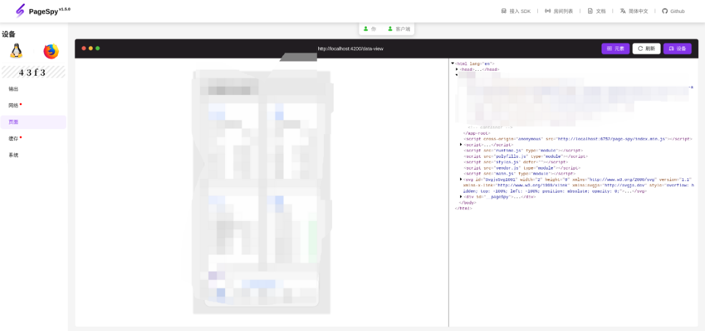


### 四、延伸

**PageSpy**功能很强大，基本上，利用Webview来实现跨端App的，都可以拿来调试，如果开发工具没有像Uniapp一样自带真机调试功能，使用这种远程调试还是很值得的，而且想要去除也是相当容易。

# 移动端运行报错

## 第一次运行下载报错问题

第一次运行移动端，需要下载一些以来，可能会因为网络下载报错，请调整好网络。


## 运行报错：error sending request for url(http://localhost:1420/)

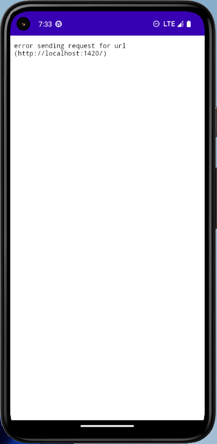

参考Issue：[bug：`error sending request for url (http://192.168.0.x:1420/)` on iOS · Issue #9509 · tauri-apps/tauri (github.com)](https://github.com/tauri-apps/tauri/issues/9509)

需要将`tauri.config.json`中的`beforeDevCommand`改为`pnpm dev --host`使得网页内容可以在局域网中访问。再将devUrl中的IP改为开发者电脑的，使得手机可以从电脑端获取网页资源。

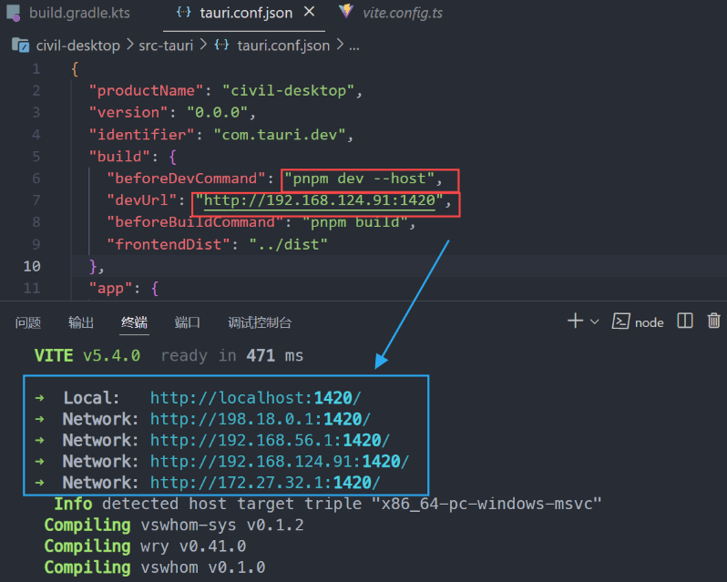

我实际试过了，在字段：`beforeDevCommand`后面添加成：`"beforeDevCommand": "pnpm dev --host"`  这样就行了。

# 使用Barcode Scanner实现扫码功能（安卓）

首先，本节内容是假设你已经会使用Tauri2.0搭建移动端项目，并且你的App需要添加一个扫码功能，如果你正对此出现的各种离谱问题，比如Rust插件依赖装不上，好不容易装上依赖但是又出现App闪退等问题，那么看这篇文章就对了，哪怕你第一次接触Tauri，学习一下也是好的。

> 关于Tauri系列的其他内容在后面几天将陆续更新，本节首先发布是因为这个问题比较紧急。后面会从Tauri2.0移动端框架的搭建，调试等方面做点介绍，旨在大家能真实的用上Tauri，它不是个花架子。

## 一、Barcode Scanner插件

Tauri2.0当前还处于Alpha测试阶段，一些内容尚未发布，且不稳定。但是一些功能已经可以使用了，比如扫码。（还有个Deep Linking后续聊）它的文档是严重落后与开发的，而且开发也极其缓慢，半年就更新出个扫码功能，而且还一堆破Bug，我这里只是将就写写，内容供大家参考。

## 二、使用步骤

### 1.安装插件

#### 安装要求

该插件安装分为两部分：

1. Rust后端插件
2. 前端插件

在安装之前，需要明确，检查你的环境是否正确，如果不正确，就会出现插件安装失败，或者插件安装不上。

1. 需要Rust至少1.64版本，直接用最新的1.70+版本，如果你的不够请更新。
2. 需要明确你使用的前端包管理工具，支持pnpm，npm和yarn，我使用的是pnpm。

最后一个必须检查的问题，就是你项目使用的tauri版本，**不能**使用最新的**alpha.18**版本，会有依赖冲突，表现为shell这个库爆红。

> ##### 解决方案
>
> 将你的Tauri版本改为**alpha.13**

如果你按照这个方式修改了但是仍然出现闪退问题，就将pnpm.lock改回去，直到能运行不闪退，然后将你的Tauri版本改为**alpha.13**，重新构建，就可以解决问题了。解决插件装不上和闪退问题。

#### 安装Rust后端插件

github提供的写法是

```bash
[dependencies]
tauri-plugin-barcode-scanner = "2.0.0-alpha"
# 使用git源:
tauri-plugin-barcode-scanner = { git = "https://github.com/tauri-apps/plugins-workspace", branch = "v2" }
```

如果你真的这么写，那么你必然踩坑。我怀疑这段文字是使用机器生成的，因为所有插件都是这么写的，但是看他的example里却不是这么用的，推荐使用以下写法

```bash
[target."cfg(any(target_os = \"android\", target_os = \"ios\"))".dependencies]
tauri-plugin-barcode-scanner = "2.0.0-alpha.2"
```

> **注意**
>
> 不要使用pnpm来更新依赖，使用pnpm clean以后，使用tauri的命令让他自己跑，就不会报错了。

#### 安装前端插件

此部分内容，只要按照你的包管理工具安装即可，选任意一个

```bash
pnpm add @tauri-apps/plugin-barcode-scanner
# or
npm add @tauri-apps/plugin-barcode-scanner
# or
yarn add @tauri-apps/plugin-barcode-scanner
# alternatively with Git:
pnpm add https://github.com/tauri-apps/tauri-plugin-barcode-scanner#v2
# or
npm add https://github.com/tauri-apps/tauri-plugin-barcode-scanner#v2
# or
yarn add https://github.com/tauri-apps/tauri-plugin-barcode-scanner#v2
```

### 2.使用

使用如果没有出现问题会相当简单，如果你是按照我给的流程来安装的话。

#### 注册插件

在main.rs中注册插件就行，如果爆红，就看上面

```rust
fn main() {
    tauri::Builder::default()
        .plugin(tauri_plugin_barcode_scanner::init())// 添加这行
        .run(tauri::generate_context!())
        .expect("error while running tauri application");
}
```

#### 调用扫码功能

导入包

```ts
import { scan } from "@tauri-apps/plugin-barcode-scanner";
```

然后直接调用即可

```ts
scan({ 
    windowed: false, 
    formats: [Format.QRCode] 
    }).then(resp => {
          console.log(`响应内容: ${resp.content}`);
        })
```

如果你想要更加详细的了解，那么主要注意的有

1. **resp**是Scanned类型的，他的定义为

```ts
export interface Scanned {
    content: string;
    format: Format;
    bounds: unknown;
}
```

1. 扫码的类型是可以定义的，也就是Format

```ts
export declare enum Format {
    QRCode = "QR_CODE",
    UPC_A = "UPC_A",
    UPC_E = "UPC_E",
    EAN8 = "EAN_8",
    EAN13 = "EAN_13",
    Code39 = "CODE_39",
    Code93 = "CODE_93",
    Code128 = "CODE_128",
    Codabar = "CODABAR",
    ITF = "ITF",
    Aztec = "AZTEC",
    DataMatrix = "DATA_MATRIX",
    PDF417 = "PDF_417"
}
```

1. 摄像头也是可以指定的，相关代码为

```ts
export interface ScanOptions {
    cameraDirection?: "back" | "front";
    formats?: Format[];
    windowed?: boolean;
}
```