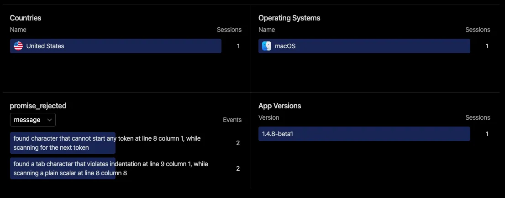

# Tauri应用程序崩溃收集处理

尽管 Rust 崩溃很少发生，但也并非不可能。探索如何在 Tauri 应用程序中有效管理这些异常。

Rust 开发人员不惜一切代价努力避免恐慌，但恐慌偶尔会发生，导致应用程序崩溃。在本文中，我们深入研究了 Tauri 应用程序中管理恐慌的策略，并分享了有关减轻其可能性的见解。

## 理解 Rust 中的恐慌

在 Rust 的上下文中，恐慌意味着无法挽回的错误——程序由于无法克服的问题而无法继续进行的情况。

Rust 函数通常返回一个 `Result<T, E>` 值，使您能够控制如何响应潜在错误。但是，在使用第三方 crate 或编写自己的代码时，您可能会遇到使用 `unwrap` 和 `expect` 的场景。

如果结果等于 Err 值，这些函数会引发恐慌。当开发人员确定结果始终是 Ok 值时，通常会使用 `unwrap` 或 `expect` 。然而，如果发生不可预见的错误，就会发生恐慌，导致程序停止。

## 如何处理 Tauri 应用程序中的恐慌

应用程序崩溃的重大挑战之一是其不可预测性。您可能拥有数千名用户，但崩溃的检测仍然难以捉摸，除非用户报告问题（这种情况很少见）。

作为解决此问题的第一步，我们将探讨如何在出现恐慌时接收通知。

由于 Tauri 作为 Rust 应用程序运行，因此我们可以利用内置的恐慌钩子来监视和处理这些恐慌。考虑以下示例：

```rust
use std::panic;

fn main() {
    std::panic::set_hook(Box::new(|info| {
        error!("Panicked: {:?}", info);
    }));

    tauri::Builder::default()
        .run(tauri::generate_context!())
        .expect("error while running tauri application");
}
```

每当发生恐慌时，上面的代码都会记录一条错误消息。此外，您可以使用 info 参数来获得有关恐慌的更多见解。将 `info` 转换为字符串会产生一条有用的消息，其中包括发生紧急情况的文件和行。

在这个钩子中，您可以自由地实施任何行动方案！虽然上面的示例在开发期间就足够了——因为您可以在控制台中查看日志——但它在生产环境中可能不那么有效，因为您无法立即访问此信息。

## 生产中的恐慌管理

在生产版本中，有几种解决应用程序崩溃的策略：

**1. 将错误记录到文件中**

不幸的是，现阶段，Tauri Log Plugin 尚未初始化，因此无法使用。但是， `std::fs` 模块可用于将错误详细信息写入文件。如果用户报告问题，您可以请求他们与您共享此文件。

**2. 将错误发送到服务器**

这种替代方案通常更有利，因为它允许您获取错误信息而不需要用户发送文件。然而，考虑隐私影响并确保敏感的用户信息不会无意中发送到远程服务器至关重要。

虽然 Aptabase 主要不是作为崩溃报告服务而设计的，但它可以用作此目的的轻量级且注重隐私的解决方案。

看看这个例子：

```rust
use std::panic;

fn main() {
    tauri::Builder::default()
        .plugin(
            tauri_plugin_aptabase::Builder::new("YOUR_KEY_HERE")
                .with_panic_hook(Box::new(|client, info, msg| {
                 let location = info.location().map(|loc| format!("{}:{}:{}", loc.file(), loc.line(), loc.column())).unwrap_or_else(|| "".to_string());

                 client.track_event("panic", Some(json!({
                   "info": format!("{} ({})", msg, location),
                 })));
                }))
                .build(),
        )
        .run(tauri::generate_context!())
        .expect("error while running tauri application");
}
```

此代码与前面的示例非常相似，但它不是将错误写入文件，而是将其传输到 Aptabase。因此，您可以直接从 Aptabase 仪表板查看错误以及其他分析。

除此之外，Aptabase 还可以在前端使用来监视 Web 视图中发生的错误。以下是如何捕获所有未处理的拒绝（承诺）和其他错误的示例：

```rust
import { trackEvent } from "@aptabase/tauri";

addEventListener("unhandledrejection", (e) => {
  trackEvent("promise_rejected", {
    message: (e.reason?.message || e.reason || e).toString(),
  });
});

window.addEventListener("error", (e) => {
  trackEvent("js_error", {
    message: e.message,
  });
});
```

这是 Aptabase 仪表板上的错误报告的样子。



这是所有错误的聚合视图，因此您可以轻松识别最常见的问题、出现这些问题的应用程序版本以及用户使用的操作系统。

##  结论

我一直在我个人的 Tauri 应用程序中使用它，并发现它是一种高效但简单的恐慌管理技术。虽然它没有提供完整的解决方案，但它显着推进了您增强应用程序稳定性的旅程。