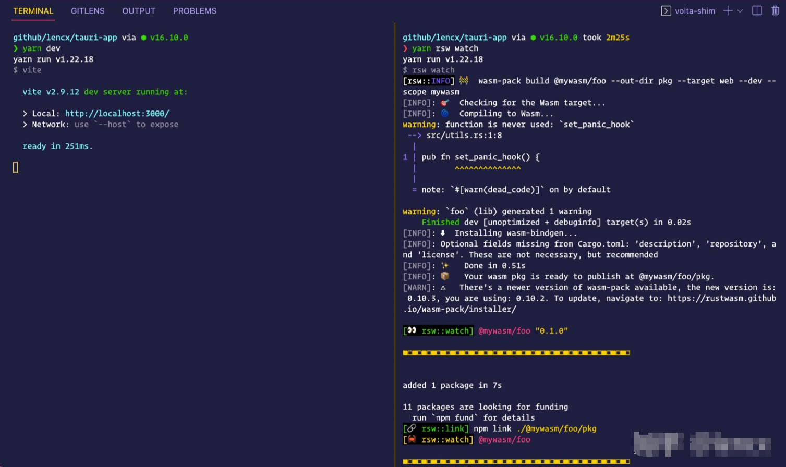
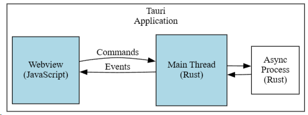

# Tauri框架入门

官网：<https://tauri.app/zh-cn/>

中文文档：[Tauri 教程_w3cschool](https://www.w3cschool.cn/tauri/)

中文文档2：[指南-Tauri中文网](https://www.tauri.net.cn/guide)

GitHub开源地址：<https://github.com/tauri-apps/tauri>

## 介绍

和Electron相比

- 打包更小
- 启动更快
- 性能更好
- 安全性好

## Tauri+系列教程

**Tauri+系列教程**：[lencx/tauri-tutorial · Discussions · GitHub](https://github.com/lencx/tauri-tutorial/discussions?discussions_q=label%3A"Tauri+系列")

[#Tauri 探索系列 (qq.com)](https://mp.weixin.qq.com/mp/appmsgalbum?__biz=MzIzNjE2NTI3NQ==&action=getalbum&album_id=2593843659863752704&from_itemidx=1&from_msgid=2247485485#wechat_redirect)

---

一文读懂 Tauri：<https://github.com/lencx/tauri-tutorial/discussions/23>

## Tauri 概览

- 利用操作系统提供的 WebView 来呈现界面，来避免打包体积过大。一般套壳空应用打包后的体积控制在 3M 左右。而 [Electron](https://www.electronjs.org/) 会将整个 [Chromium](https://www.chromium.org/) 打包进应用（安装包体积几十兆起步）。因为系统差异，所以使用自带 Webview 会存在兼容性问题，但是应该朝前看，IE 浏览器都被微软自家宣布死亡了。

- 相比 Electron 有更低的内存占用，更小的体积，更少的线程，系统调用等。了解更多 [Tauri 基准测试](https://tauri.app/v1/references/benchmarks)。

- 安装包是跨平台的，目前支持 Mac，Windows，Linux 等，未来也会支持 iOS/iPadOS 和 Android 等，跨平台打包可以使用官方提供的 [Tauri GitHub Action](https://github.com/tauri-apps/tauri-action)，虽然是跨端，但是一些特定于平台的代码还是需要借助于插件或者自行实现，并在真机上进行功能验证，否则可能出现行为和预期不一致。

- 提供内置签名以确保应用自动更新时可以安全安装，相关配置请查看 [Tauri Updater](https://tauri.app/v1/guides/distribution/updater)。

- 使用 [tauri icons](https://tauri.app/v1/guides/features/icons) 命令生成自定义应用图标（要求：格式为 PNG 的正方形图片）。

- 应用更安全，Tauri 在架构层做了很多安全处理（比如：通过配置来约束 Tauri 访问系统文件，网络请求，剪贴板等）。

  - 源代码更安全，Tauri 只提供二进制文件。而不是像 Electron 的 [ASAR](https://www.electronjs.org/docs/latest/tutorial/asar-archives) 文件。
  - 数据更安全，隔离模式会对前后端（Webview 和 Tauri Core）通信数据进行加密传输。

- 前端使用 HTML、CSS、JavaScript 来构建界面（也可以使用前端主流技术，如：[vite](https://vitejs.dev/)，[react](https://reactjs.org/)，[vue](https://vuejs.org/)，[svelte](https://svelte.dev/) 等）。后端目前使用 Rust，未来也可能会支持其他类型语言（如：Go、Nim、Python、Csharp 等）。

- 强大的系统交互能力，支持配置全局快捷键，系统菜单，系统托盘，文件读写，命令行，系统信息，剪贴板等。Rust 给 Tauri 带来了无限的想象力，Rust 可以做的事情，Tauri 理论上也可以做（欢迎自行尝试，可能也有做不了的）。

- Tauri Window

  支持多种配置。磨砂透明背景，无边框功能则需要借助的两个插件（支持 Windows 和 macOS，Linux 暂不支持）：

  - [window-shadows](https://github.com/tauri-apps/window-shadows) - 为窗口添加阴影。
  - [window-vibrancy](https://github.com/tauri-apps/window-vibrancy) - 为窗口配置磨砂效果。

- 支持创建多个窗口以及为新窗口脚本注入，但是脚本注入需要在 rust 端创建窗口，使用 `WindowBuilder::new` 中的 `initialization_script` 来加载脚本。

- 通过提供的 [Tauri Command](https://tauri.app/v1/guides/features/command)，可以从 Web 应用程序调用 Rust 函数。通过 [Tauri Events](https://tauri.app/v1/guides/features/events)（`emit` 和 `listen`）可以在前后端之间传递消息，它与 Tauri Command 有类似性。

- ...

综合来看，[Tauri JS API](https://tauri.app/v1/api/js/) 确实提供了很多便捷 API 供前端使用，但是有些底层方法并未暴露，而 [Tauri Rust API](https://docs.rs/tauri/1.2.0/tauri/) 则要强大很多。

## 开发问题

### 资源 & 文档

- [Tauri doc](https://tauri.app/) - 官方文档，第一参考资料，建议熟读，源码及 issues 可以作为补充。
- [Awesome Tauri](https://github.com/tauri-apps/awesome-tauri) - 精选的 Tauri 生态系统和社区中最好的东西，包含插件和应用，可以借鉴和学习。
- [Tauri issues](https://github.com/tauri-apps/tauri/issues) - 质量很高的问题回答，可以解决开发中遇到的大量困惑或报错。如果未搜到，还可以自己上报，执行 `cargo tauri info` 或 `npm run tauri info` 可以查看平台和版本信息。
- [Tauri discussions](https://github.com/tauri-apps/tauri/discussions) - 讨论社区
- [MDN doc](https://developer.mozilla.org/en-US/) - 很权威的 Web 技术文档，包含 CSS，HTML，JavaScript。
- [Rust doc](https://doc.rust-lang.org/book/) - Rust 编程语言基本语法学习
- [npmjs](https://www.npmjs.com/) - 前端生态的包管理网站
- [crates.io](https://crates.io/) - Rust 生态的包管理网站

### 开发准备

编辑器推荐使用 [Visual Studio Code](https://code.visualstudio.com/)，需要安装的插件：

- [Tauri](https://marketplace.visualstudio.com/items?itemName=tauri-apps.tauri-vscode) - 对 Tauri 命令和 tauri.conf.json JSON 验证提供支持。
- [rust-analyzer](https://marketplace.visualstudio.com/items?itemName=rust-lang.rust-analyzer) - 插件提供了对 Rust 编程语言的支持。包含代码提示，类型定义，代码跳转等等。
- [crates](https://marketplace.visualstudio.com/items?itemName=serayuzgur.crates) - 是 `crates.io` 依赖项的插件。旨在帮助开发人员在使用 Cargo.toml 时管理依赖项（鼠标悬停 crate 名称可以显示可用版本列表）。

## 常见问题

文档：[常见问题 | Tauri Apps](https://tauri.app/zh-cn/v1/guides/faq)

### 子窗口不能使用 `__TAURI__` API

新创建的远程 URL 子窗口无法使用 Tauri API，因为这与 Tauri 架构安全是违背的，以下有两条相关 issues：

- [[bug\] cant use window.**TAURI** with remote url](https://github.com/tauri-apps/tauri/issues/4837)
- [[feat\] Inject window.**TAURI** in allowed remote URLs](https://github.com/tauri-apps/tauri/issues/5088)

简单概括为：任何与 IPC 相关的问题都触及到了 Tauri 核心，并不能快速解决此类问题，但在 v2，v3 或未来更高的版本会有所改进。Tauri 不会在外部 URL 开的窗口上注入 Tauri API，如果项目没有本地资源，可以通过将 `distDir` 设置为`远程 URL` 来解决这个问题，或者在使用的运行时更改它。但这种情况下只有一个外部 URL 能够访问 Tauri API，其实就是修改 tauri.conf.json 中配置的 `build.devPath`（开发环境） 和 `build.distDir` （生产环境）字段。

### Brownfield vs Isolation 模式

[Brownfield 模式](https://tauri.app/v1/references/architecture/inter-process-communication/brownfield)是使用 Tauri 的最简单、最直接的模式，因为它尽可能地与现有的前端项目兼容。但也并非完全兼容（API 未被浏览器广泛支持，Tauri 正在实现中的），请参阅 [不兼容部分](https://tauri.app/v1/references/architecture/inter-process-communication/brownfield#incompatibilities)。

[Isolation 模式](https://tauri.app/v1/references/architecture/inter-process-communication/isolation)下前端发送到 Tauri Core 之前会被注入的一个安全的应用程序拦截和修改传入的 IPC 消息（使用 [iframe](https://developer.mozilla.org/en-US/docs/Web/HTML/Element/iframe) 沙盒隔离，使用浏览器的 [SubtleCrypto](https://developer.mozilla.org/en-US/docs/Web/API/SubtleCrypto) 来对数据进行加密。为了确保安全，每次运行应用时都会生成新的密钥），来避免被前端恶意调用。

总结：所以老项目想使用 Tauri 进行套壳，想快速上线，可以考虑 Brownfield 模式。使用 Isolation 模式则更加安全，通信时消息加解密相比于 Brownfield 模式会存在额外的开销成本，除非高性能要求，否则 `AES-GCM` 身份验证算法的成本几乎可以忽略不计。

## 评价 Tauri

> 在技术群，文章评论区也有一些朋友问过我：”如何看待 Tauri？“，我也只是业余折腾，写过几篇浅显的文章而已。

以我目前的了解来看，觉得它很可能成为下一代跨端（桌面，移动端）方案，但前提是它真的实现了比较易用的移动端绑定（目前还在计划中）。Web 的生态奠定了今天的互联网基础，前端技术又是层出不穷，快速迭代。而 Tauri 想做的事情就是实现 Webview 和系统之间的桥接层（站在巨人的肩膀）。所以跨多少个端，提供什么样的能力是 Tauri 需要考虑的事情，开发应用功能是我们需要考虑的事情。Tauri 未提供的支持，我们也可以通过它的插件机制去扩展。

————————————————————————————————————————————

- 参考教程：<https://www.hellagur.com/2022/09/06/%E5%88%9D%E8%AF%86-Tauri-%E7%AF%87%E4%B8%80%E4%B9%8B%E5%88%9D%E7%AA%A5%E9%97%A8%E5%BE%84/>
- [基于tauri+vue3.x多开窗口|Tauri创建多窗体实践 - xiaoyan2017 - 博客园 (cnblogs.com)](https://www.cnblogs.com/xiaoyan2017/p/16812092.html)
- [vue3.js+tauri整合聊天|tauri仿微信|vite3+tauri聊天室 - 掘金 (juejin.cn)](https://juejin.cn/post/7159783024995860494)
- tauri打包桌面应用步骤及配置详解--windows完美打包&mac完美打包：<https://www.cnblogs.com/JokerA/p/15638087.html>

## 集成 WebAssembly

在 Tauri 中使用 Rust 和 WebAssembly (Wasm) 可以让你的应用程序具有高性能和低资源消耗的特点。以下是一个简单的步骤指南，帮助你开始在 Tauri 中集成 Rust 和 Wasm：

1. **安装必要的工具**:
   - 安装 `rustup` 来管理 Rust 版本。
   - 安装 `wasm-pack`，它是一个帮助你构建和打包 Rust 代码为 Wasm 的工具。
   - 安装 `cargo-generate`，它可以帮助你从预设模板创建项目。
2. **创建一个新的 Tauri 项目**:
   - 使用 `tauri init` 命令来初始化一个新的 Tauri 应用程序。
3. **编写 Rust 代码**:
   - 在 `src-tauri/src` 目录下创建 Rust 源文件。
   - 使用 `wasm-bindgen` 宏来注释你的 Rust 函数，这样它们就可以被编译成 Wasm 并从 JavaScript 调用。
4. **构建 Wasm 模块**:
   - 运行 `wasm-pack build` 命令来编译 Rust 代码为 Wasm。
   - 这将生成一个 `pkg` 目录，其中包含 Wasm 文件和一个自动生成的 JavaScript 包装器。
5. **集成 Wasm 到前端**:
   - 在你的前端代码中，使用 `import` 语句来加载 Wasm 模块。
   - 确保在调用任何 Wasm 函数之前，先初始化 Wasm 模块。
6. **在 Tauri 应用中使用 Wasm**:
   - 在 Tauri 的 `tauri.conf.json` 配置文件中，确保启用了对 Wasm 的支持。
   - 在 Tauri 应用的 JavaScript 部分，调用 Wasm 函数来执行 Rust 代码。
7. **调试和优化**:
   - 使用浏览器的开发者工具来调试 Wasm 模块。
   - 根据需要优化你的 Rust 代码以提高性能。

### 安装依赖

[vite-plugin-rsw](https://github.com/rwasm/vite-plugin-rsw) - 基于 vite 实现的 webAssembly 插件，支持热更新，友好的报错提示

```bash
yarn add -D vite-plugin-rsw
```

[rsw-rs](https://github.com/rwasm/rsw-rs) - 一个 CLI 工具，用于增强 [wasm-pack](https://github.com/rustwasm/wasm-pack) 的功能，如支持 watch 模式，多 crate 同时 build，watch，自动执行 `npm link` 等

```bash
cargo install rsw
```

### 使用说明

#### 1. 编辑 vite.config.js

```js
import { defineConfig } from 'vite'
import { ViteRsw } from 'vite-plugin-rsw'; // ✅ 新增

export default defineConfig({
  plugins: [
    ViteRsw(), // ✅ 新增
  ],
})
```

#### 2. 编辑 package.json

```json
{
  "scripts": {
    "dev": "vite",
    "build": "rsw build && tsc && vite build",
    "preview": "vite preview",
    "tauri": "tauri",
    "rsw": "rsw"
  }
}
```

#### 3. 运行 rsw

##### 1). 初始化 rsw 配置

生成 `rsw.toml`，了解更多 [rsw.toml 配置信息](https://github.com/rwasm/rsw-rs#rswtoml)

```bash
yarn rsw init
```


##### 2). 新建 wasm 项目

内置三种模式，可以通过编辑 `rsw.toml` > `[new]` > `using` 来切换

```bash
yarn rsw new @mywasm/foo
```


在 `rsw.toml` > `[[crates]]` 中新增 `@mywasm/foo`

```yaml
#! link 类型: `npm` | `yarn` | `pnpm`, 默认是 `npm`
cli = "npm"

[new]
#! 使用: `wasm-pack` | `rsw` | `user`, 默认 `wasm-pack`
#! 1. wasm-pack: `rsw new <name> --template <template> --mode <normal|noinstall|force>`
#! 2. rsw: `rsw new <name>`, 内置模板
#! 3. user: `rsw new <name>`，如果 `dir`未配置, 则使用 `wasm-pack new <name>`初始化 wasm 项目
using = "rsw"
#! 当 `using = "user"` 时，`dir` 才会生效
#! 如果 `using = "wasm-pack"` 或 `using = "rsw"`，则忽略
#! 复制此目录下的所有文件到初始化的 wasm 项目中
dir = "my-template"

[[crates]]
#! npm 包，@mywasm 为 npm 组织，foo 是该组织下的包名
name = "@mywasm/foo"
#! 是否执行 link， link 类型通过 `cli` 配置
link = true

[[crates]]
#! npm 包，@mywasm 为 npm 组织，bar 是该组织下的包名
name = "@mywasm/bar"
#! 是否执行 link， link 类型通过 `cli` 配置
link = true
```

### 开发模式

> 监听 rust 文件变更，自动执行构建，并通知到浏览器（热更新）

1. 执行以下命令，不要退出：

```bash
yarn rsw watch
```

2. 新开一个命令行窗口，执行 a 或 b：

```bash
# a. 在浏览器环境
yarn dev

# b. 在 tauri 环境
yarn tauri dev
```



### 使用

> 在项目中使用 wasm

```js
// App.jsx
import { useEffect } from 'react'
import init, { greet } from '@mywasm/foo'

function App() {
  useEffect(() => {
    // ✅ 初始化，加载 wasm 文件
    init();
  }, [])

  return (
    <div className="App">
        {/* ✅ 调用 greet 方法，必须保证 init 方法执行完成之后，才可以调用，否则会报错 */}
        <button onClick={() => greet()}>click me</button>
    </div>
  )
}

export default App
```

### 构建

> 编译生产环境下的 wasm 文件（代码优化）

1. 构建 wasm

```bash
yarn rsw build
```

2. 构建项目

```bash
yarn build
```


### 项目结构

rsw 对项目结构并无特别要求，但是为了保持统一及维护性，推荐以下结构。

- `@mywasm`: wasm 包的组织名称（推荐使用，但非必需），rust 编译为 wasm，会以 npm 包的形式提供给前端使用。使用组织的好处就是方便管理，防止包名冲突
- `.rsw` - rsw 运行时生成的临时文件夹
- `rsw.toml` - rsw 配置文件
- `.watchignore` - rsw watch 监听文件变更时需要忽略的文件，忽略规则与 [.gitignore](https://git-scm.com/docs/gitignore) 类似

```bash
[tauri-app] # 项目名称
│ # 新增结构
├─ [@mywasm] # ✅ 组织名称（npm org）
│    ├─ [foo] # ✅ @mywasm/foo - wasm 包名
│    └─ [bar] # ✅ @mywasm/bar - wasm 包名
├─ [.rsw] # ✅ rsw 临时文件夹
├─ rsw.toml # ✅ rsw 配置文件
├─ .watchignore # ✅ rsw watch 忽略文件
│┈┈┈┈┈┈┈┈┈┈┈┈┈┈┈┈┈┈┈┈┈
│ # 原结构
├─ [node_modules] # 前端依赖
├─ [src] # 前端程序源
├─ [src-tauri] # Tauri 程序源
│    ├─ [icons] # 应用程序图标
│    ├─ [src] # Tauri App 程序源，例如系统菜单，托盘，插件配置等
│    ├─ [target] # 构建的产物会被放入此文件夹中，target 目录的结构取决于是否使用 --target 标志为特定的平台构建
│    ├─ build.rs # Tauri 构建应用
│    ├─ Cargo.lock # 包含了依赖的精确描述信息，类似于 yarn.lock 或 package-lock.json
│    ├─ Cargo.toml # Tauri (Rust) 项目清单
│    └─ tauri.conf.json # 自定义 Tauri 应用程序的配置文件，例如应用程序窗口尺寸，应用名称，权限等
├─ index.html # 项目主界面
├─ package.json # 前端项目清单
├─ tsconfig.json # typescript 配置文件
├─ vite.config.ts # vite 配置文件
├─ yarn.lock # 前端依赖的精确描述信息
└─ ... # 其他
```

## 透明及磨砂背景

开源库：[tauri-apps/window-vibrancy：让你的窗户充满活力。 (github.com)](https://github.com/tauri-apps/window-vibrancy)

### 源码阅读

> 官方文档是第一手学习资料，当文档不能满足需要时，了解其生态，或者阅读一些源码，可能会有意想不到的收获。

通过阅读 [wry 源码示例](https://github.com/tauri-apps/wry/blob/d7c9097256d76de7400032cf27acd7a1874da5cd/examples/transparent.rs) 可知 Tauri 应用的背景分三层：

- 第一层是 `window`
- 第二层是 `webview`
- 第三层是 `html`

```rust
fn main() -> wry::Result<()> {
  use wry::{
    application::{
      event::{Event, WindowEvent},
      event_loop::{ControlFlow, EventLoop},
      window::WindowBuilder,
    },
    webview::WebViewBuilder,
  };

  let event_loop = EventLoop::new();
  let window = WindowBuilder::new()
    .with_decorations(false)
    // ✅ 第一层：
    // There are actually three layer of background color when creating webview window.
    // The first is window background...
    .with_transparent(true)
    .build(&event_loop)
    .unwrap();

  let _webview = WebViewBuilder::new(window)?
    // ✅ 第二层：
    // The second is on webview...
    .with_transparent(true)
    // ✅ 第三层：
    // And the last is in html.
    .with_url(
      r#"data:text/html,
            <!doctype html>
            <html>
              <body style="background-color:rgba(87,87,87,0.5);">hello</body>
              <script>
                window.onload = function() {
                  document.body.innerText = `hello, ${navigator.userAgent}`;
                };
              </script>
            </html>"#,
    )?
    .build()?;

  event_loop.run(move |event, _, control_flow| {
    *control_flow = ControlFlow::Wait;

    match event {
      Event::WindowEvent {
        event: WindowEvent::CloseRequested,
        ..
      } => *control_flow = ControlFlow::Exit,
      _ => {}
    }
  });
}
```

所以如果我们想要实现磨砂或半透明应用应该从这三方面的配置入手。

### 透明背景

#### tauri.conf.json 配置

在官方文档 `tauri.conf.json 窗口配置中有 transparent 字段，设置为 true 启用透明度。（默认为 false，不启用）`

注意：在 macOS 上，需要从 `tauri.conf.json > tauri > macOSPrivateApi` 启用 `macos-private-api` ，默认为 `false`，不启用。（警告：[在 macOS 上使用私有 API 的应用程序会被 App Store 拒绝](https://developer.apple.com/forums/thread/64443)）

`macOSPrivateApi` 设置为 `true` 时：

- 1.在 **macOS** 设置上，请参阅 [tauri.conf.json#L49](https://github.com/tauri-apps/window-vibrancy/blob/dev/examples/tauri/src-tauri/tauri.conf.json#L49)`"macOSPrivateApi": true`
- 2.启用透明背景 API：设置见 [index.html#L12](https://github.com/tauri-apps/window-vibrancy/blob/dev/examples/tauri/public/index.html#L12)`html, body { background: transparent }`
- 3.设置见 [tauri.conf.json#L57](https://github.com/tauri-apps/window-vibrancy/blob/dev/examples/tauri/src-tauri/tauri.conf.json#L57)：`"windows": [ { "transparent": true } ]`

- 4.将 `fullScreenEnabled` 首选项设置为 `true`

```json
{
  "tauri": {
    "macOSPrivateApi": true,
    "windows": [
      {
        "width": 800,
        "height": 600,
        "resizable": true,
        "fullscreen": false,
        "title": "Oh My Box",
        "transparent": true
      }
    ]
  }
}
```

#### html 配置

窗口配置中的 `transparent` 是开启第一层（window）和第二层（webview）的透明度。如果透明度未生效，请检查 html 是否设置了不透明背景色，将其修改为 `RGBA` 或 `transparent`。也可以通过 css 文件设置 body 样式。

```html
<!DOCTYPE html>
<html>
  <body style="background-color: rgba(87,87,87,0.5);">
    <div id="root"></div>
  </body>
</html>
```


注意：在 macOS 中使用透明背景在页面跳转时会出现残影，暂未了解到相关解决方案


### 磨砂背景

透明背景虽然很酷，但实用性低。因为在使用应用时很容易受到桌面背景的干扰，所以磨砂背景更符合使用场景。

官网并没有给出磨砂背景的相关配置，直接在第三层 html 中使用 css 属性实现模糊效果也会存在一些问题，具体原因可以查看 [Blurry and translucent background on a transparent window](https://github.com/tauri-apps/tauri/issues/2827)，issues 中作者提到可能会在 `tauri v2` 版本中支持此功能，过渡方案可以使用 [tauri-apps/window-vibrancy](https://github.com/tauri-apps/window-vibrancy) 插件。所以接下来的配置将围绕 `tauri-apps/window-vibrancy` 进行：

#### Step 1

安装 `window-vibrancy` 依赖，推荐使用 [cargo edit](https://github.com/killercup/cargo-edit)（该工具扩展了 Cargo，允许你通过从命令行修改 Cargo.toml 文件来添加、删除和升级依赖项） ：

```bash
# 1. 命令进入 src-tauri 目录
cd src-tauri

# 2. 安装 window-vibrancy
cargo add window-vibrancy
```

安装完成后会在 `Cargo.toml > dependencies` 中看到该依赖。


#### Step 2

在 `src-tauri/src` 下新建 `setup.rs` 文件：

```rust
use tauri::{App, Manager};
use window_vibrancy::{self, NSVisualEffectMaterial};

/// setup
pub fn init(app: &mut App) -> std::result::Result<(), Box<dyn std::error::Error>> {
    let win = app.get_window("main").unwrap();

    // 仅在 macOS 下执行
    #[cfg(target_os = "macos")]
    window_vibrancy::apply_vibrancy(&win, NSVisualEffectMaterial::FullScreenUI)
        .expect("Unsupported platform! 'apply_vibrancy' is only supported on macOS");

    // 仅在 windows 下执行
    #[cfg(target_os = "windows")]
    window_vibrancy::apply_blur(&win, Some((18, 18, 18, 125)))
        .expect("Unsupported platform! 'apply_blur' is only supported on Windows");

    Ok(())
}
```

代码中的 `#[cfg(target_os)]` 是指条件编译，仅在目标的操作系统中执行相关代码，可以查看 [conditional compilation - target_os](https://doc.rust-lang.org/reference/conditional-compilation.html#target_os) 了解更多。

#### Step 3

在 `src-tauri/src/main.rs` 中使用 `setup.rs`：

```rust
mod setup;

fn main() {
    let context = tauri::generate_context!();
    tauri::Builder::default()
        .setup(setup::init)
        .run(context)
        .expect("error while running OhMyBox application");
}
```

`setup` 是一个 Rust 模块，简单来讲就是按照逻辑单元或功能模块进行代码拆分。可以查看 [rust-by-example - mod](https://doc.rust-lang.org/rust-by-example/mod.html) 了解更多。


### 相关阅读

- [NSVisualEffectView (apple developer)](https://developer.apple.com/documentation/appkit/nsvisualeffectview) - 为界面中的视图添加半透明和活力效果
- 相关库：[tauri-apps/window-vibrancy: Make your windows vibrant. (github.com)](https://github.com/tauri-apps/window-vibrancy)

## 开发模式下忽略文件

### 背景

在开发模式（`tauri dev`）下，位于 `src-tauri` 目录中的任意文件变更都会引发应用的重新构建，每次构建 Tauri 都会重新启动应用，影响开发体验。

### 解决方案

此类问题如果只看官方文档，并不能找到相关描述，所以查看 issues 及相关工具链版本升级的 `changelog` 就显得尤为重要（个人经验：新技术可参考资料稀少，所以对其探索更容易培养解决问题的能力）。

#### 升级 CLI

升级 `@tauri-apps/cli` 到 `v1.1.0+` 版本

```bash
# npm
npm i @tauri-apps/cli@1.1.0

# yarn
yarn add @tauri-apps/cli@1.1.0
```

#### 使用

`@tauri-apps/cli v1.1.0` 版本新增了两种忽略方式（`.taurignore` 和 `--no-watch`）：

**1. 使用忽略文件** **`.taurignore`**：

在 `src-tauri` 下创建 `.taurignore` 忽略文件，底层依赖 [ignore](https://github.com/BurntSushi/ripgrep/tree/master/crates/ignore) crate，忽略规则设置请查看 ignore 文档，与 `.gitignore` 规则类似。（注意：经验证，`@tauri-apps/cli v1.1.1` 版本在设置除 `*` 之外的任意路径规则并未生效，官方目前并未给出解决方案）

```bash
# 忽略 src-tauri 目录下的所有文件变更
*
```

**2. 使用命令行参数** **`--no-watch`**：

```bash
tauri dev --no-watch
```

**结论： 使用任意一种方式在开发模式（`tauri dev`），** **`src-tauri`** **目录中任意文件变更都将不会引起应用构建及重启，请谨慎使用。**

### 参考资料

- [tauri/tooling/cli/CHANGELOG v1.1.0](https://github.com/tauri-apps/tauri/blob/dev/tooling/cli/CHANGELOG.md%23110)
- [[feat\] Add .taurignore and turn off the default behavior of watching all workspace members](https://github.com/tauri-apps/tauri/issues/4617)

## Rust 与 JavaScript 的双向通信



Tauri 为 Rust 和 JavaScript 间的通信提供了两种机制：事件（Event）和命令（Command）。Tauri 的 [command从前端调用 Rust](https://tauri.app/zh-cn/v1/guides/features/command/)和 [Events事件](https://tauri.app/zh-cn/v1/guides/features/events/)很好地涵盖了这些内容。

## Tauri 插件

官方文档：[Tauri 插件 | Tauri Apps](https://tauri.app/zh-cn/v1/guides/features/plugin)

## Tauri Debug调试

tauri2调试：https://beta.tauri.app/zh-cn/guides/debug

tauri1调试：[应用程序调试 | Tauri Apps](https://tauri.app/zh-cn/v1/guides/debugging/application)

# 自动通知应用升级+发布应用

官方文档（更新需要的配置和说明）：[Updater | Tauri Apps](https://tauri.app/zh-cn/v1/guides/distribution/updater)

官方的JavaScript/typescript的update API文档：[updater | Tauri Apps](https://tauri.app/zh-cn/v1/api/js/updater)

## 签名

Tauri 通过签名来保证安全更新应用。 签名更新应用需要做两件事：

1. 私钥 (privkey) 用于签署应用的更新，必须严密保存。此外，如果丢失了此密钥，将无法向当前用户群发布新的更新，将其保存在安全的地方至关重要。
2. 在 `tauri.conf.json` 中添加公钥 (pubkey)，以在安装前验证更新存档。

### 生成签名

使用 Tauri CLI 提供的命令可以生成密钥（`.pub` 后缀的文件为公钥）：

```bash
tauri signer generate -w ~/.tauri/omb.key           

$ tauri signer generate -w /Users/lencx/.tauri/omb.key
Generating new private key without password.
Please enter a password to protect the secret key.
Password: 
Password (one more time): 
Deriving a key from the password in order to encrypt the secret key... done

Your keypair was generated successfully
Private: /Users/lencx/.tauri/omb.key (Keep it secret!)
Public: /Users/lencx/.tauri/omb.key.pub
---------------------------

Environment variabled used to sign:
`TAURI_PRIVATE_KEY`  Path or String of your private key
`TAURI_KEY_PASSWORD`  Your private key password (optional)

ATTENTION: If you lose your private key OR password, you'll not be able to sign your update package and updates will not works.
---------------------------

✨  Done in 39.09s.
```


**⚠️ 注意：如果丢失了私钥或密码，将无法签署更新包并且更新将无法正常工作（请妥善保管）。**

### tauri.conf.json 配置

```json 
{
  "updater": {
    "active": true,
    "dialog": true,
    "endpoints": ["https://releases.myapp.com/{{target}}/{{current_version}}"],
    "pubkey": "YOUR_UPDATER_PUBKEY"
  },
}
```

- **active** - 布尔值，是否启用，默认值为 false

- **dialog** - 布尔值，是否启用内置新版本提示框，如果不启用，则需要在 JS 中自行监听事件并进行提醒

- endpoints

  \- 数组，通过地址列表来确定服务器端是否有可用更新，字符串 {{target}} 和 {{current_version}} 会在 URL 中自动替换。如果指定了多个地址，服务器在预期时间内未响应，更新程序将依次尝试。endpoints 支持两种格式：

  - [**动态接口**](https://tauri.app/v1/guides/distribution/updater#server-support) - 服务器根据客户端的更新请求确定是否需要更新。 如果需要更新，服务器应以状态代码 `200 OK` 进行响应，并在正文中包含更新 JSON。 如果不需要更新，服务器必须响应状态代码 `204 No Content`。
  - [**静态文件**](https://tauri.app/v1/guides/distribution/updater#update-file-json-format) - 备用更新技术使用纯 JSON 文件，将更新元数据存储在 [gist](https://gist.github.com/)，[github-pages](https://pages.github.com/) 或其他静态文件存储中。

- **pubkey** - 签名的公钥

## 实现步骤

### 拆解问题

要实现自动升级应用主要分为以下几个步骤：

1. 生成签名（公私钥）：
   - 私钥用于设置打包（`tauri build`）的环境变量
   - 公钥用于配置 `tauri.conf.json -> updater.pubkey`
2. 向客户端推送包含签名及下载链接的更新请求，有两种形式：
   - 动态接口返回 json 数据
   - 静态资源返回 json 文件
3. 将 2 中的更新请求地址配置在 `tauri.conf.json -> updater.endpoints`
4. 通过将 `tauri.conf.json -> updater.dialog` 配置为 `true`，启用内置通知更新应用的弹窗。设置为 false 则需要自行通过 js 事件来处理（暂不推荐，喜欢折腾的朋友可以自行尝试）

因为应用的跨平台打包借助了 `github action` 的工作流来实现，具体可以参考[【Tauri 入门篇 - 跨平台编译】](https://github.com/lencx/OhMyBox/discussions/8)，所以更新也同样使用 `github action` 来实现，充分发挥 github 的能力（简单来说，就是不需要借助其他第三方平台或服务就可以实现整个应用的自动化发布更新）。

### 梳理流程

- 在本地生成公私钥
- 加签名构建跨平台应用（通过 github action 设置签名环境变量）
- 对构建出的安装包解析，生成静态资源文件（通过脚本实现安装包信息获取）
- 推送更新请求采用静态资源的方式（可以将 json 文件存储在 github pages）
- 将 github pages 的资源地址配置到 `tauri.conf.json -> updater.endpoints`

### 代码实现

#### Step1

生成公私钥

```bash
tauri signer generate -w ~/.tauri/omb.key
```

配置公钥 `pubkey`（`~/.tauri/omb.key.pub`）及资源地址 `endpoints`（github pages 地址）：

```json
{
  "package": {
    "productName": "OhMyBox",
    "version": "../package.json"
  },
  "tauri": {
    "updater": {
      "active": true,
      "dialog": true,
      "endpoints": ["https://lencx.github.io/OhMyBox/install.json"],
      "pubkey": "dW50cnVzdGVkIGNvbW1lbnQ6IG1pbmlzaWduIHB1YmxpYyBrZXk6IEU5MEIwREEzNDlBNzdDN0MKUldSOGZLZEpvdzBMNmFOZ2cyY2NPeTdwK2hsV3gwcWxoZHdUWXRZWFBpQTh1dWhqWXhBdkl0cW8K"
    }
  }
}
```

#### Step2

在项目根路径下创建 `scripts` 目录，然后在 `scripts` 下依次创建 `release.mjs`，`updatelog.mjs`，`updater.mjs` 三个 [.mjs](https://docs.fileformat.com/web/mjs/) 文件：

- `scripts/release.mjs` - 版本发布，因发布需涉及多处改动（如版本，版本日志，打 tag 标签等等），故将其写成脚本，减少记忆成本
- `scripts/updatelog.mjs` - 版本更新日志处理，供 `scripts/updater.mjs` 脚本使用
- `scripts/updater.mjs` - 生成应用更新需要的静态文件

```bash
# 安装开发依赖
yarn add -D node-fetch @actions/github
```

版本相关

```js
// scripts/release.mjs

import { createRequire } from 'module';
import { execSync } from 'child_process';
import fs from 'fs';

import updatelog from './updatelog.mjs';

const require = createRequire(import.meta.url);

async function release() {
  const flag = process.argv[2] ?? 'patch';
  const packageJson = require('../package.json');
  let [a, b, c] = packageJson.version.split('.').map(Number);

  if (flag === 'major') {  // 主版本
    a += 1;
    b = 0;
    c = 0;
  } else if (flag === 'minor') {  // 次版本
    b += 1;
    c = 0;
  } else if (flag === 'patch') {  // 补丁版本
    c += 1;
  } else {
    console.log(`Invalid flag "${flag}"`);
    process.exit(1);
  }

  const nextVersion = `${a}.${b}.${c}`;
  packageJson.version = nextVersion;

  const nextTag = `v${nextVersion}`;
  await updatelog(nextTag, 'release');

  // 将新版本写入 package.json 文件
  fs.writeFileSync('./package.json', JSON.stringify(packageJson, null, 2));

  // 提交修改的文件，打 tag 标签（tag 标签是为了触发 github action 工作流）并推送到远程
  execSync('git add ./package.json ./UPDATE_LOG.md');
  execSync(`git commit -m "v${nextVersion}"`);
  execSync(`git tag -a v${nextVersion} -m "v${nextVersion}"`);
  execSync(`git push`);
  execSync(`git push origin v${nextVersion}`);
  console.log(`Publish Successfully...`);
}

release().catch(console.error);
```

更新日志

```js
// scripts/updatelog.mjs

import fs from 'fs';
import path from 'path';

const UPDATE_LOG = 'UPDATE_LOG.md';

export default function updatelog(tag, type = 'updater') {
  const reTag = /## v[\d\.]+/;

  const file = path.join(process.cwd(), UPDATE_LOG);

  if (!fs.existsSync(file)) {
    console.log('Could not found UPDATE_LOG.md');
    process.exit(1);
  }

  let _tag;
  const tagMap = {};
  const content = fs.readFileSync(file, { encoding: 'utf8' }).split('\n');

  content.forEach((line, index) => {
    if (reTag.test(line)) {
      _tag = line.slice(3).trim();
      if (!tagMap[_tag]) {
        tagMap[_tag] = [];
        return;
      }
    }
    if (_tag) {
      tagMap[_tag].push(line);
    }
    if (reTag.test(content[index + 1])) {
      _tag = null;
    }
  });

  if (!tagMap?.[tag]) {
    console.log(
      `${type === 'release' ? '[UPDATE_LOG.md] ' : ''}Tag ${tag} does not exist`
    );
    process.exit(1);
  }

  return tagMap[tag].join('\n').trim() || '';
}
```

更新操作

```js
// scripts/updater.mjs

import fetch from 'node-fetch';
import { getOctokit, context } from '@actions/github';
import fs from 'fs';

import updatelog from './updatelog.mjs';

const token = process.env.GITHUB_TOKEN;

async function updater() {
  if (!token) {
    console.log('GITHUB_TOKEN is required');
    process.exit(1);
  }

  // 用户名，仓库名
  const options = { owner: context.repo.owner, repo: context.repo.repo };
  const github = getOctokit(token);

  // 获取 tag
  const { data: tags } = await github.rest.repos.listTags({
    ...options,
    per_page: 10,
    page: 1,
  });

  // 过滤包含 `v` 版本信息的 tag
  const tag = tags.find((t) => t.name.startsWith('v'));
  // console.log(`${JSON.stringify(tag, null, 2)}`);

  if (!tag) return;

  // 获取此 tag 的详细信息
  const { data: latestRelease } = await github.rest.repos.getReleaseByTag({
    ...options,
    tag: tag.name,
  });

  // 需要生成的静态 json 文件数据，根据自己的需要进行调整
  const updateData = {
    version: tag.name,
    // 使用 UPDATE_LOG.md，如果不需要版本更新日志，则将此字段置空
    notes: updatelog(tag.name),
    pub_date: new Date().toISOString(),
    platforms: {
      win64: { signature: '', url: '' }, // compatible with older formats
      linux: { signature: '', url: '' }, // compatible with older formats
      darwin: { signature: '', url: '' }, // compatible with older formats
      'darwin-aarch64': { signature: '', url: '' },
      'darwin-x86_64': { signature: '', url: '' },
      'linux-x86_64': { signature: '', url: '' },
      'windows-x86_64': { signature: '', url: '' },
      // 'windows-i686': { signature: '', url: '' }, // no supported
    },
  };

  const setAsset = async (asset, reg, platforms) => {
    let sig = '';
    if (/.sig$/.test(asset.name)) {
      sig = await getSignature(asset.browser_download_url);
    }
    platforms.forEach((platform) => {
      if (reg.test(asset.name)) {
        // 设置平台签名，检测应用更新需要验证签名
        if (sig) {
          updateData.platforms[platform].signature = sig;
          return;
        }
        // 设置下载链接
        updateData.platforms[platform].url = asset.browser_download_url;
      }
    });
  };

  const promises = latestRelease.assets.map(async (asset) => {
    // windows
    await setAsset(asset, /.msi.zip/, ['win64', 'windows-x86_64']);

    // darwin
    await setAsset(asset, /.app.tar.gz/, [
      'darwin',
      'darwin-x86_64',
      'darwin-aarch64',
    ]);

    // linux
    await setAsset(asset, /.AppImage.tar.gz/, ['linux', 'linux-x86_64']);
  });
  await Promise.allSettled(promises);

  if (!fs.existsSync('updater')) {
    fs.mkdirSync('updater');
  }

  // 将数据写入文件
  fs.writeFileSync(
    './updater/install.json',
    JSON.stringify(updateData, null, 2)
  );
  console.log('Generate updater/install.json');
}

updater().catch(console.error);

// 获取签名内容
async function getSignature(url) {
  try {
    const response = await fetch(url, {
      method: 'GET',
      headers: { 'Content-Type': 'application/octet-stream' },
    });
    return response.text();
  } catch (_) {
    return '';
  }
}
```


在根路径下创建 `UPDATE_LOG.md` 文件，通知用户更新注意事项，格式如下（使用版本号作为标题，具体请查看 `scripts/updatelog.mjs`）：

```bash
# Updater Log

## v0.1.7

- feat: xxx
- fix: xxx

## v0.1.6

test
```


修改 `package.json`，在 "scripts" 中加入 `updater` 和 `release` 命令：

```json
  "scripts": {
    "dev": "vite --port=4096",
    "build": "rsw build && tsc && vite build",
    "preview": "vite preview",
    "tauri": "tauri",
    "rsw": "rsw",
    "updater": "node scripts/updater.mjs", // ✅ 新增
    "release": "node scripts/release.mjs" // ✅ 新增
  },
```


#### Step3

Action 配置请参考之前的文章【Tauri 入门篇 - 跨平台编译】，此处新增环境设置签名和静态资源推送。

##### 设置 Secret

配置变量 `Repo -> Settings -> Secrets -> Actions -> New repository secret`：

- TAURI_PRIVATE_KEY - 私钥，value 为

  ```bash
  ~/.tauri/omb.key.pub
  ```

  内容

  - Name: `TAURI_PRIVATE_KEY`
  - Value: `******`

- TAURI_KEY_PASSWORD - 密码，value 为生成签名时的密码

  - Name: `TAURI_KEY_PASSWORD`
  - Value: `******`

##### 设置 `.github/workflows/release.yml`

```yaml
name: Release CI

on:
  push:
    # Sequence of patterns matched against refs/tags
    tags:
      - 'v*' # Push events to matching v*, i.e. v1.0, v20.15.10

jobs:
  create-release:
    runs-on: ubuntu-latest
    outputs:
      RELEASE_UPLOAD_ID: ${{ steps.create_release.outputs.id }}

    steps:
      - uses: actions/checkout@v2
      - name: Query version number
        id: get_version
        shell: bash
        run: |
          echo "using version tag ${GITHUB_REF:10}"
          echo ::set-output name=version::"${GITHUB_REF:10}"

      - name: Create Release
        id: create_release
        uses: actions/create-release@v1
        env:
          GITHUB_TOKEN: ${{ secrets.GITHUB_TOKEN }}
        with:
          tag_name: '${{ steps.get_version.outputs.VERSION }}'
          release_name: 'OhMyBox ${{ steps.get_version.outputs.VERSION }}'
          body: 'See the assets to download this version and install.'

  build-tauri:
    needs: create-release
    strategy:
      fail-fast: false
      matrix:
        platform: [macos-latest, ubuntu-latest, windows-latest]

    runs-on: ${{ matrix.platform }}
    steps:
      - uses: actions/checkout@v2

      - name: Setup node
        uses: actions/setup-node@v1
        with:
          node-version: 16

      - name: Install Rust stable
        uses: actions-rs/toolchain@v1
        with:
          toolchain: stable

      # Rust cache
      - uses: Swatinem/rust-cache@v1

      - name: install dependencies (ubuntu only)
        if: matrix.platform == 'ubuntu-latest'
        run: |
          sudo apt-get update
          sudo apt-get install -y libgtk-3-dev webkit2gtk-4.0 libappindicator3-dev librsvg2-dev patchelf

      # Install wasm-pack
      - uses: jetli/wasm-pack-action@v0.3.0
        with:
          # Optional version of wasm-pack to install(eg. 'v0.9.1', 'latest')
          version: v0.9.1

      - name: Install rsw
        run: cargo install rsw

      - name: Get yarn cache directory path
        id: yarn-cache-dir-path
        run: echo "::set-output name=dir::$(yarn config get cacheFolder)"

      - name: Yarn cache
        uses: actions/cache@v2
        id: yarn-cache # use this to check for `cache-hit` (`steps.yarn-cache.outputs.cache-hit != 'true'`)
        with:
          path: ${{ steps.yarn-cache-dir-path.outputs.dir }}
          key: ${{ runner.os }}-yarn-${{ hashFiles('**/yarn.lock') }}
          restore-keys: |
            ${{ runner.os }}-yarn-

      - name: Install app dependencies and build it
        run: yarn && yarn build
      - uses: tauri-apps/tauri-action@v0
        env:
          GITHUB_TOKEN: ${{ secrets.GITHUB_TOKEN }}
          TAURI_PRIVATE_KEY: ${{ secrets.TAURI_PRIVATE_KEY }}
          TAURI_KEY_PASSWORD: ${{ secrets.TAURI_KEY_PASSWORD }}
        with:
          releaseId: ${{ needs.create-release.outputs.RELEASE_UPLOAD_ID }}

  # 生成静态资源并将其推送到 github pages
  updater:
    runs-on: ubuntu-latest
    needs: [create-release, build-tauri]

    steps:
      - uses: actions/checkout@v2
      - run: yarn
      - run: yarn updater
        env:
          GITHUB_TOKEN: ${{ secrets.GITHUB_TOKEN }}

      - name: Deploy install.json
        uses: peaceiris/actions-gh-pages@v3
        with:
          github_token: ${{ secrets.GITHUB_TOKEN }}
          publish_dir: ./updater
          force_orphan: true
```


## 发布应用

功能开发完成，提交代码后，只需执行 `yarn release` 命令就可以自动进行应用发布了。如果不想借助 github 打包和静态资源存放，也可以参考上面的步骤，自行部署。

```bash
# 发布主版本，v1.x.x -> v2.x.x
yarn release major

# 发布次版本，v1.0.x -> v1.1.x
yarn release minor

# 发布补丁版本，patch 参数可省略，v1.0.0 -> v1.0.1
yarn release [patch]
```


**注意：每次执行 `yarn release` 发布版本，`主版本`，`次版本`，`补丁版本` 都是自增 1。**

[](https://user-images.githubusercontent.com/16164244/195824508-e4807ba5-2084-475a-aa11-9376af66a19a.png)

[](https://user-images.githubusercontent.com/16164244/195824577-6ff7bb0e-8b60-4b36-881b-1e96296a075c.png)

## 常见问题

### Error A public key has been found, but no private key

如果在 `tauri.conf.json` 中配置了 `pubkey`，但未设置环境变量会出现以下错误：

```bash
tauri build
# ...
   Compiling omb v0.1.0 (/Users/lencx/github/lencx/OhMyBox/src-tauri)
    Finished release [optimized] target(s) in 21.27s
    Bundling OhMyBox.app (/Users/lencx/github/lencx/OhMyBox/src-tauri/target/release/bundle/macos/OhMyBox.app)
    Bundling OhMyBox_0.1.1_x64.dmg (/Users/lencx/github/lencx/OhMyBox/src-tauri/target/release/bundle/dmg/OhMyBox_0.1.1_x64.dmg)
     Running bundle_dmg.sh
    Bundling /Users/lencx/github/lencx/OhMyBox/src-tauri/target/release/bundle/macos/OhMyBox.app.tar.gz (/Users/lencx/github/lencx/OhMyBox/src-tauri/target/release/bundle/macos/OhMyBox.app.tar.gz)
    Finished 3 bundles at:
        /Users/lencx/github/lencx/OhMyBox/src-tauri/target/release/bundle/macos/OhMyBox.app
        /Users/lencx/github/lencx/OhMyBox/src-tauri/target/release/bundle/dmg/OhMyBox_0.1.1_x64.dmg
        /Users/lencx/github/lencx/OhMyBox/src-tauri/target/release/bundle/macos/OhMyBox.app.tar.gz (updater)

       Error A public key has been found, but no private key. Make sure to set `TAURI_PRIVATE_KEY` environment variable.
error Command failed with exit code 1.
```


**解决方案：**

- [Use environment variables in Terminal on Mac](https://support.apple.com/guide/terminal/use-environment-variables-apd382cc5fa-4f58-4449-b20a-41c53c006f8f/2.12/mac/11.0)
- [Set Environment Variable in Windows](https://learn.microsoft.com/en-us/windows-server/administration/windows-commands/set_1)

```bash
# macOS 设置环境变量：
export TAURI_PRIVATE_KEY="********" # omb.key
export TAURI_KEY_PASSWORD="********" # 生成公私钥时在终端输入的密码，如果未设置密码则无需设置此变量

# Windows 设置环境变量：
set TAURI_PRIVATE_KEY="********"
set TAURI_KEY_PASSWORD="********"
```


```bash
# 如果签名打包成功会看到以下信息（以 macOS 为例）
        Info 1 updater archive at:
        Info         /Users/lencx/github/lencx/OhMyBox/src-tauri/target/release/bundle/macos/OhMyBox.app.tar.gz.sig
✨  Done in 58.55s.
```


### 版本信息错误

发布的应用版本以 `tauri.conf.json` 中的 `package.version` 为准，在发布新版本时注意更新 `version`。

### 可能造成更新失败的原因

- 使用 github pages 作为更新文件静态资源存储在国内会因网络限制导致更新失败，无法看到更新弹窗提示，或者下载不响应等问题，可以通过配置多个 `endpoints` 地址来解决，安装包也可以放在自建服务器来提高下载的稳定性
- 静态 json 文件中的平台签名（`platforms[platform].signature`）是否完整，签名内容可以在`tauri build` 产生的 `target/release/bundle/<platform>/*.sig` 文件中查看


参考文章：

主要参考这个：[【13】Tauri 应用篇 - 自动通知应用升级 · lencx/tauri-tutorial · Discussion #21 (github.com)](https://github.com/lencx/tauri-tutorial/discussions/21)

下面的文章还未参考

[tauri在github上进行自动更新打包并发版过程，实战操作避坑_tauri自动更新-CSDN博客](https://blog.csdn.net/weixin_44786530/article/details/131963524)

[Tauri 应用自动更新 | Updater - 码农之家 (pipipi.net)](https://www.pipipi.net/36452.html)

[一个关于 Tauri 自动更新的 demo-CSDN博客](https://blog.csdn.net/YWwXxx/article/details/134424518)

    https://www.modb.pro/db/572260
    https://blog.csdn.net/weixin_44786530/article/details/129617866
    https://juejin.cn/post/7128568878732410887
    https://github.com/lencx/tauri-tutorial/discussions/21
    https://zhuanlan.zhihu.com/p/573735645
    https://zhuanlan.zhihu.com/p/573735645
